# Frequently Asked Questions
## Stakeholder-Specific FAQ Resources for MerajutASA Platform

> **Purpose**: Provide easy access to comprehensive FAQ resources tailored to each stakeholder group in the penta-helix collaboration model, ensuring all community members can quickly find answers to their questions while maintaining our unwavering commitment to child safety and privacy protection.

---

## 🎯 FAQ Resource Organization

### Stakeholder-Centered Support
Our FAQ resources are organized to serve the diverse needs of our penta-helix stakeholder community:

```yaml
FAQ Structure:
  Child Safety Focus: All answers prioritize child protection and welfare
  Stakeholder Specificity: Tailored content for each sector's unique needs
  Accessibility: Clear, simple language accessible to all users
  Cultural Sensitivity: Respectful of Indonesian values and traditions
```

### Quick Access by Stakeholder Type
Navigate directly to the FAQ resources most relevant to your role and interests:

```mermaid
graph TD
    A[❓ MerajutASA FAQs] --> B[👥 Community FAQs]
    A --> C[🏛️ Government FAQs]
    A --> D[🏢 Business FAQs]
    A --> E[🎓 Academic FAQs]
    A --> F[📺 Media FAQs]
    
    B --> G[✅ Available Now]
    C --> H[📋 Coming Soon]
    D --> H
    E --> H
    F --> H
    
    G --> I[👶 Child-Centered Answers]
    H --> I
    
    style A fill:#3498DB
    style B fill:#27AE60
    style I fill:#E74C3C
```



---

## 📚 Stakeholder FAQ Resources

### 👥 Community Sector
**[Community Support FAQ →](docs/stakeholders/community/support/faq.md)**

Comprehensive FAQ covering:
- Child safety and protection protocols
- Volunteer participation and requirements  
- Donation processes and impact tracking
- Platform safety and privacy protection
- Cultural integration and community values
- Technical support and accessibility features
- Emergency procedures and crisis support

*This resource serves community volunteers, donors, and local organizations with detailed guidance on platform engagement, safety protocols, and meaningful participation in child welfare activities.*

### 🏛️ Government Sector
**Government FAQ Resources**

*Comprehensive FAQ resources for government stakeholders are currently under development. Government partners can access specific guidance through:*
- **[Government Engagement Guide →](docs/stakeholders/government/README.md)**
- **Direct Support**: gov-support@merajutasa.id
- **Policy Coordination**: +62-21-MERAJUT (637-2588)

### 🏢 Business Sector  
**Business Partnership FAQ Resources**

*Detailed FAQ resources for corporate partners and business stakeholders are in development. Business partners can access current guidance through:*
- **[Business Partnership Guide →](docs/stakeholders/business/README.md)**
- **Direct Support**: business-support@merajutasa.id
- **Partnership Development**: +62-21-MERAJUT (637-2588)

### 🎓 Academic Sector
**Academic Collaboration FAQ Resources**

*Comprehensive FAQ resources for research institutions and academic partners are being prepared. Academic stakeholders can access current resources through:*
- **[Academic Collaboration Guide →](docs/stakeholders/academia/README.md)**
- **Direct Support**: research-support@merajutasa.id
- **Research Coordination**: +62-21-MERAJUT (637-2588)

### 📺 Media Sector
**Media Partnership FAQ Resources**

*Detailed FAQ resources for media partners and communication professionals are under development. Media stakeholders can access current guidance through:*
- **[Media Partnership Guide →](docs/stakeholders/media/README.md)**
- **Direct Support**: media-support@merajutasa.id
- **Media Relations**: +62-21-MERAJUT (637-2588)

---

## 🛡️ Child Safety & Privacy

### Unwavering Child Protection Commitment
Every FAQ resource reflects our absolute commitment to child safety and privacy:

```yaml
Child Safety Standards:
  Data Protection: Military-grade encryption for all child information
  Privacy Controls: Strict access limitations and audit trails
  Safety Protocols: 24/7 monitoring and emergency response systems
  Professional Oversight: Trained child protection specialists
  
Legal Compliance:
  Indonesian Law: Full compliance with national data protection laws
  International Standards: GDPR, COPPA, and UN child rights conventions
  Regular Audits: Quarterly security and privacy compliance reviews
  Professional Training: Ongoing staff education on child protection
```

### Emergency Support Resources
**Immediate child safety concerns should always be reported through our emergency channels:**

- **Emergency Hotline**: +62-21-MERAJUT (637-2588) (24/7)
- **Emergency Email**: emergency@merajutasa.id  
- **Platform Emergency Button**: Available in mobile app
- **Response Time**: <15 minutes for life-threatening situations

---

## 📞 Additional Support

### Comprehensive Support Infrastructure
Can't find the answer you need? Our support team is here to help:

```yaml
Primary Support Channels:
  General Support: support@merajutasa.id
  Community Questions: community@merajutasa.id
  Technical Help: tech-support@merajutasa.id
  Emergency Assistance: +62-21-MERAJUT (637-2588) (24/7)

Language Support:
  Indonesian: Primary language for all services
  English: Full translation and bilingual staff available
  Regional Languages: Basic support for major regional languages
```

### Self-Service Resources
- **[Stakeholder Documentation Index →](docs/stakeholders/README.md)**
- **[Platform Style Guide →](docs/STYLE_GUIDE.md)**
- **[Contributing Guidelines →](CONTRIBUTING.md)**
- **[Code of Conduct →](CODE_OF_CONDUCT.md)**

---

## 🔄 FAQ Resource Development

### Ongoing Enhancement
We continuously expand and improve our FAQ resources based on stakeholder feedback and emerging needs:

```yaml
Development Process:
  Community Input: Regular feedback collection from all stakeholder groups
  Expert Review: Professional validation of all child safety content
  Accessibility Testing: WCAG 2.1 AA compliance verification
  Cultural Sensitivity: Indonesian cultural advisor review
  
Update Schedule:
  Monthly: Content updates based on new questions and feedback
  Quarterly: Comprehensive review and expansion
  Annually: Complete resource audit and strategic enhancement
```

### Contributing to FAQ Resources
Help improve our FAQ resources:
- **Submit Questions**: Use the feedback form in each FAQ section
- **Report Issues**: Contact the appropriate stakeholder support team
- **Suggest Improvements**: Email suggestions to docs@merajutasa.id

---

*Your questions help us serve our community better. If you don't find the answers you need in these resources, please reach out — we're here to help you make a meaningful difference in children's lives.*

**Need immediate help?** Contact our 24/7 support team at support@merajutasa.id or call +62-21-MERAJUT (637-2588) for emergency assistance.