# Stakeholder Guide
## Quick Navigation to MerajutASA Penta-Helix Collaboration

> **Mission**: Connect stakeholders across government, business, academia, community, and media sectors to create sustainable support networks for vulnerable children across Indonesia through coordinated collaboration.

This guide provides quick access to stakeholder-specific portals within the MerajutASA platform, designed to facilitate effective multi-sector partnerships following the penta-helix collaboration model.

---

## 🌟 Penta-Helix Collaboration Framework

The MerajutASA platform brings together five key stakeholder sectors to maximize impact for child welfare:

```mermaid
graph TD
    A[👶 Child Welfare Mission] --> B[🏛️ Government]
    A --> C[🏢 Business] 
    A --> D[🎓 Academia]
    A --> E[👥 Community]
    A --> F[📺 Media]
    
    B --> G[🤝 Integrated Collaboration]
    C --> G
    D --> G 
    E --> G
    F --> G
    
    G --> H[📊 Enhanced Child Outcomes]
    
    style A fill:#E74C3C
    style G fill:#3498DB
    style H fill:#27AE60
```

---

## 🚀 Quick Access by Stakeholder

### 🏛️ Government Sector
**Focus**: Policy implementation, regulatory compliance, public service delivery
- **Main Portal**: [Government Stakeholder Portal](docs/stakeholders/government/README.md)

### 🏢 Business Sector  
**Focus**: Corporate social responsibility, sustainable partnerships, shared value creation
- **Main Portal**: [Business Stakeholder Portal](docs/stakeholders/business/README.md)
- **Key Resources**:
  - [CSR Integration](docs/stakeholders/business/partnership-models/csr-integration.md)
  - [Technology Partnerships](docs/stakeholders/business/partnership-models/technology-partnerships.md)
  - [Employee Volunteering](docs/stakeholders/business/partnership-models/employee-volunteering.md)

### 🎓 Academic Sector
**Focus**: Evidence-based practice, research collaboration, knowledge translation  
- **Main Portal**: [Academic Stakeholder Portal](docs/stakeholders/academia/README.md)
- **Key Resources**:
  - [Research Data Access](docs/stakeholders/academia/research-data-access.md)
  - [Publication Guidelines](docs/stakeholders/academia/publication-guidelines.md)
  - [Student Projects](docs/stakeholders/academia/student-projects.md)

### 👥 Community Sector
**Focus**: Community mobilization, volunteer coordination, local resource development
- **Main Portal**: [Community Stakeholder Portal](docs/stakeholders/community/README.md) 
- **Key Resources**:
  - [Getting Started](docs/stakeholders/community/getting-started/README.md)
  - [Child Protection](docs/stakeholders/community/safety/child-protection.md)
  - [FAQ & Support](docs/stakeholders/community/support/faq.md)

### 📺 Media Sector
**Focus**: Story amplification, awareness raising, advocacy support
- **Main Portal**: [Media Stakeholder Portal](docs/stakeholders/media/README.md)
- **Key Resources**:
  - [Media Guidelines](docs/stakeholders/media/media-guidelines.md)
  - [Press Kit](docs/stakeholders/media/press-kit.md)
  - [Brand Guidelines](docs/stakeholders/media/brand-guidelines.md)

---

## 🛡️ Child Safety & Accessibility Baseline

### Child Protection Standards
All stakeholder engagement must adhere to our fundamental child protection principles:

- **Child Safety First**: Every interaction, document, and system prioritizes child welfare and protection
- **Privacy Protection**: Strict data protection protocols safeguarding child information ([Privacy Compliance](docs/stakeholders/community/policies/privacy-policy.md))
- **Zero Tolerance**: No tolerance for any form of child exploitation or harm
- **Transparency**: Open communication with appropriate confidentiality safeguards

### Accessibility Requirements  
Our platform ensures inclusive access for all stakeholders:

- **WCAG 2.1 AA Compliance**: All digital content meets accessibility standards
- **Multi-language Support**: Content available in Bahasa Indonesia and English
- **Device Compatibility**: Accessible across desktop, mobile, and assistive technologies
- **Cultural Sensitivity**: Respectful of Indonesian values and diverse community needs

For detailed accessibility guidelines, see: [Accessibility Compliance](docs/architecture/compliance/accessibility-compliance.md)

---

## 🔗 Essential Cross-Stakeholder Resources

### Platform Documentation
- **[Main Stakeholder Index](docs/stakeholders/README.md)** - Comprehensive overview of all stakeholder engagement
- **[Collaboration Framework](docs/stakeholders/collaboration-framework.md)** - Guidelines for cross-sector partnerships
- **[Communication Protocols](docs/stakeholders/communication-protocols.md)** - Standard communication procedures

### Governance & Compliance
- **[Governance Model](docs/stakeholders/governance-model.md)** - Platform governance structure
- **[Impact Measurement](docs/stakeholders/impact-measurement.md)** - Shared metrics and evaluation frameworks
- **[Style Guide](docs/STYLE_GUIDE.md)** - Documentation and communication standards

### Support & Contact
- **[Community Guidelines](docs/stakeholders/community/policies/community-guidelines.md)** - Platform community standards
- **[Terms of Service](docs/stakeholders/community/policies/terms-of-service.md)** - Platform usage terms
- **[Support Contacts](docs/stakeholders/community/support/contact-information.md)** - Help and assistance resources

---

## 📊 Platform Overview

### Mission Alignment
Every stakeholder portal is designed to advance our core mission of creating sustainable support networks for vulnerable children through:

- **Coordinated Collaboration**: Integrated cross-sector partnerships
- **Evidence-Based Practice**: Research-informed interventions and policies  
- **Community Empowerment**: Local capacity building and resource mobilization
- **Transparent Accountability**: Open impact measurement and reporting
- **Cultural Responsiveness**: Solutions adapted to Indonesian context and values

### Getting Started
1. **Choose Your Sector**: Select the stakeholder portal that matches your organization type
2. **Review Requirements**: Understand sector-specific guidelines and expectations
3. **Access Resources**: Utilize tools, templates, and support materials
4. **Connect & Collaborate**: Engage with other stakeholders for maximum impact

---

**Every stakeholder brings unique value to child welfare. Together, we weave a stronger safety net for Indonesia's children.**

---

*For questions about stakeholder engagement or this guide, contact: stakeholders@merajutasa.id*