# Contributing to MerajutASA Documentation
## Guidelines for Documentation Excellence

> **Mission**: Create comprehensive, accessible, and maintainable documentation that empowers all stakeholders to effectively use and contribute to the MerajutASA platform while prioritizing child safety and welfare.

---

## 🎯 Documentation Philosophy

### Child-Centered Documentation
All documentation must prioritize child safety and welfare:

```yaml
Child Protection Principles:
  Safety First: All documentation prioritizes child welfare
  Privacy by Design: Never expose sensitive information
  Age-Appropriate: Content suitable for intended audiences
  Inclusive Language: Welcoming to all stakeholders
  Accessibility: Following WCAG 2.1 AA standards
  
Documentation Values:
  Clarity: Clear, concise, and actionable content
  Empathy: Understanding diverse stakeholder needs
  Accuracy: Technically correct and up-to-date
  Completeness: Comprehensive coverage of topics
  Consistency: Unified voice and style
```

### Stakeholder-Centric Approach
Documentation organized by the penta-helix collaboration model:

```mermaid
graph TD
    A[📝 Documentation Contributors] --> B[🏛️ Government Docs]
    A --> C[🏢 Business Docs]
    A --> D[🎓 Academic Docs]
    A --> E[👥 Community Docs]
    A --> F[📰 Media Docs]
    
    B --> G[📊 Unified Knowledge Base]
    C --> G
    D --> G
    E --> G
    F --> G
    
    G --> H[🎯 Stakeholder Success]
```



---

## 🚀 Getting Started

### 1. Prerequisites for Contributors

#### Technical Requirements
```yaml
Required Tools:
  - Git (version 2.30+)
  - Node.js (version 18+)
  - Text editor with Markdown support
  - Basic command line knowledge
  
Recommended Tools:
  - VS Code with Markdown extensions
  - Grammarly for writing assistance
  - Draw.io for diagram creation
  - Figma for UI documentation
```

#### Knowledge Requirements
```yaml
Documentation Skills:
  - Basic Markdown syntax
  - Understanding of platform architecture
  - Familiarity with stakeholder needs
  - Knowledge of child protection principles
  
Domain Knowledge:
  - Social impact measurement
  - Child welfare best practices
  - Indonesian regulatory context
  - Penta-helix collaboration model
```

### 2. Repository Setup

#### Clone and Setup
```bash
# Clone the repository
git clone https://github.com/wahyumumtazsyah04/MerajutASA.git
cd MerajutASA

# Install dependencies
npm install

# Set up documentation environment
cd docs
npm install

# Start local documentation server
npm run docs:dev
```

#### Branch Strategy for Documentation
```yaml
Branch Naming Convention:
  Features: docs/feature/stakeholder-portal-update
  Fixes: docs/fix/api-documentation-typos
  Updates: docs/update/security-guidelines-2025
  
Branch Types:
  - docs/feature/* - New documentation sections
  - docs/fix/* - Bug fixes and corrections
  - docs/update/* - Content updates and revisions
  - docs/translation/* - Translation improvements
```

---

## 📝 Content Guidelines

### 1. Writing Standards

#### Voice and Tone
```yaml
Documentation Voice:
  Professional: Authoritative yet approachable
  Compassionate: Reflecting our mission for children
  Inclusive: Welcoming to all stakeholders
  Clear: Direct and easy to understand
  
Tone Guidelines:
  Technical Docs: Professional and precise
  User Guides: Friendly and supportive
  Policy Docs: Formal and comprehensive
  Community Content: Warm and engaging
```

#### Language Requirements
```yaml
Primary Language: Indonesian (Bahasa Indonesia)
Secondary Language: English
Translation Standards: Professional translation required

Language Guidelines:
  - Use clear, simple language
  - Define technical terms when first used
  - Include cultural context for Indonesian users
  - Provide English equivalents for key terms
  
Accessibility Language:
  - Use person-first language
  - Avoid technical jargon without explanation
  - Include alternative text for images
  - Provide video transcripts
```

### 2. Content Structure

#### Document Template
```markdown
# Title: Clear and Descriptive
## Subtitle: Context and Purpose

> **Mission/Purpose**: Brief statement of document purpose

---

## 🎯 Overview
Brief introduction and objectives

## 📋 Prerequisites
What readers need to know/have

## 🚀 Main Content
Structured content with clear headings

## 📚 Additional Resources
Related documentation and links

## 📞 Support
Contact information for help

---

*Footer with update information and contact*
```

#### Content Organization
```yaml
Section Structure:
  1. Overview and Purpose
  2. Prerequisites and Setup
  3. Step-by-step Instructions
  4. Examples and Use Cases
  5. Troubleshooting
  6. Additional Resources
  
Visual Elements:
  - Diagrams for complex concepts
  - Screenshots for UI guidance
  - Code examples with syntax highlighting
  - Callout boxes for important information
```

### 3. Technical Documentation Standards

#### Code Documentation
```yaml
Code Examples:
  - Complete, runnable examples
  - Clear comments explaining logic
  - Error handling examples
  - Security best practices included
  
API Documentation:
  - Complete endpoint descriptions
  - Request/response examples
  - Authentication requirements
  - Error code explanations
  
Configuration Examples:
  - Environment-specific examples
  - Security considerations noted
  - Common pitfalls highlighted
  - Validation steps included
```

#### Diagram Standards
```yaml
Diagram Types:
  - Architecture diagrams (system overview)
  - Flow diagrams (process flows)
  - Sequence diagrams (API interactions)
  - Entity diagrams (data relationships)
  
Diagram Tools:
  - Mermaid for simple diagrams
  - Draw.io for complex architectures
  - Figma for UI mockups
  - PlantUML for technical diagrams
  
Diagram Requirements:
  - Clear labeling and legends
  - Consistent color schemes
  - Accessible contrast ratios
  - Alternative text descriptions
```

---

## 🔄 Contribution Process

### 1. Content Creation Workflow

#### Documentation Request Process
```yaml
1. Issue Creation:
   - Use documentation issue template
   - Specify stakeholder group affected
   - Include priority level
   - Reference related features/changes
   
2. Content Planning:
   - Review existing documentation
   - Identify gaps and overlaps
   - Plan content structure
   - Assign stakeholder reviewers
   
3. Content Creation:
   - Follow style guidelines
   - Include required sections
   - Add visual elements as needed
   - Test all examples and links
   
4. Review Process:
   - Technical accuracy review
   - Stakeholder relevance review
   - Language and style review
   - Accessibility compliance check
```

#### Pull Request Guidelines
```yaml
PR Requirements:
  Title: Clear description of changes
  Description: Detailed explanation of updates
  Checklist: All required items completed
  Reviewers: Appropriate stakeholder reviewers
  
PR Checklist:
  ☐ Content follows style guidelines
  ☐ All links tested and working
  ☐ Images include alternative text
  ☐ Code examples tested
  ☐ Spelling and grammar checked
  ☐ Stakeholder review completed
  ☐ Technical accuracy verified
  ☐ Accessibility guidelines followed
```

### 2. Review Process

#### Review Types
```yaml
Technical Review:
  Reviewer: Development team member
  Focus: Technical accuracy and completeness
  Timeline: 2-3 business days
  
Stakeholder Review:
  Reviewer: Representative from affected stakeholder group
  Focus: Relevance and usability
  Timeline: 3-5 business days
  
Editorial Review:
  Reviewer: Documentation team member
  Focus: Style, grammar, and consistency
  Timeline: 1-2 business days
  
Accessibility Review:
  Reviewer: Accessibility specialist
  Focus: WCAG 2.1 AA compliance
  Timeline: 2-3 business days
```

#### Review Criteria
```yaml
Content Quality:
  ✅ Accuracy: Information is correct and current
  ✅ Completeness: All necessary information included
  ✅ Clarity: Content is easy to understand
  ✅ Relevance: Content serves stakeholder needs
  
Technical Quality:
  ✅ Examples: Code examples work as documented
  ✅ Links: All links functional and appropriate
  ✅ Images: High quality with proper alternative text
  ✅ Structure: Logical organization and flow
  
Compliance:
  ✅ Style Guide: Follows established guidelines
  ✅ Accessibility: Meets WCAG 2.1 AA standards
  ✅ Child Safety: Protects child privacy and safety
  ✅ Legal: Complies with relevant regulations
```

### 3. Publishing Process

#### Publishing Workflow
```yaml
1. Final Review:
   - All review comments addressed
   - Final stakeholder approval
   - Technical validation complete
   - Legal/compliance clearance
   
2. Pre-Publication:
   - Link checking and validation
   - Search engine optimization
   - Metadata completion
   - Translation coordination
   
3. Publication:
   - Merge to main branch
   - Automated deployment
   - Search index update
   - Notification to stakeholders
   
4. Post-Publication:
   - Monitor for feedback
   - Track usage analytics
   - Schedule review dates
   - Update related documentation
```

---

## 🎨 Style Guide Summary

### 1. Formatting Standards

#### Markdown Conventions
```yaml
Headers:
  # H1: Document titles only
  ## H2: Major sections
  ### H3: Subsections
  #### H4: Sub-subsections (maximum depth)
  
Text Formatting:
  **Bold**: Important terms, UI elements
  *Italic*: Emphasis, first use of terms
  `Code`: Inline code, filenames, commands
  
Lists:
  - Unordered: Use for non-sequential items
  1. Ordered: Use for sequential steps
  
Links:
  [Description](URL): Descriptive link text
  [Internal](./path/file.md): Relative paths for internal links
```

#### Visual Elements
```yaml
Code Blocks:
  ```yaml
  # Use appropriate language tags
  # Include comments for clarity
  # Provide complete examples
  ```
  
Callouts:
  > **Note**: Important information
  > **Warning**: Potential issues
  > **Tip**: Helpful suggestions
  
Tables:
  | Column 1 | Column 2 | Column 3 |
  |----------|----------|----------|
  | Data     | Data     | Data     |
```

### 2. Language Guidelines

#### Terminology Standards
```yaml
Platform Terms:
  - MerajutASA (not Merajut ASA or merajutasa)
  - Platform (capitalize when referring to MerajutASA)
  - Stakeholders (not users, unless specifically end-users)
  - Penta-helix (with hyphen)
  
Technical Terms:
  - API (not Api or api)
  - Database (not DB in formal documentation)
  - User Interface (not UI in formal documentation)
  - Configuration (not config in formal documentation)
  
Child Welfare Terms:
  - Children (preferred over kids or minors)
  - Orphanage (standard term for institutional care)
  - Caregiver (inclusive term for care providers)
  - Child protection (standard terminology)
```

#### Inclusive Language
```yaml
Inclusive Practices:
  - Use person-first language
  - Avoid gendered assumptions
  - Include diverse perspectives
  - Respect cultural differences
  
Examples:
  ✅ Person with disabilities (not disabled person)
  ✅ They/them for unknown gender
  ✅ Children of all backgrounds
  ✅ Culturally appropriate examples
```

---

## 🌐 Internationalization

### 1. Translation Process

#### Translation Workflow
```yaml
1. Source Content Creation:
   - Create content in primary language (Indonesian)
   - Complete technical and stakeholder reviews
   - Finalize content before translation
   
2. Professional Translation:
   - Use certified translators
   - Maintain cultural context
   - Preserve technical accuracy
   - Include glossary terms
   
3. Translation Review:
   - Native speaker review
   - Technical accuracy check
   - Cultural appropriateness review
   - Stakeholder feedback incorporation
   
4. Publication and Maintenance:
   - Coordinate simultaneous publication
   - Track translation updates needed
   - Maintain translation consistency
   - Monitor user feedback
```

#### Translation Standards
```yaml
Quality Requirements:
  - Professional translation services
  - Native speaker review required
  - Technical terminology consistency
  - Cultural adaptation when needed
  
Language Priorities:
  1. Indonesian (Primary)
  2. English (Secondary)
  3. Regional languages (as needed)
  
Content Synchronization:
  - Source updates trigger translation reviews
  - Version control for all language variants
  - Consistent publication timing
  - Regular translation audits
```

### 2. Cultural Considerations

#### Indonesian Context
```yaml
Cultural Adaptation:
  - Use appropriate honorifics (Bapak/Ibu)
  - Include relevant cultural references
  - Respect religious sensitivities
  - Consider regional differences
  
Legal and Regulatory:
  - Reference Indonesian laws and regulations
  - Include local compliance requirements
  - Adapt international standards to local context
  - Provide relevant government contacts
```

---

## 📊 Quality Assurance

### 1. Content Quality Metrics

#### Measurable Quality Indicators
```yaml
Accuracy Metrics:
  - Technical review pass rate: >95%
  - User-reported errors: <5 per month
  - Link validation rate: 100%
  - Code example success rate: >98%
  
Usability Metrics:
  - User task completion rate: >85%
  - Documentation satisfaction score: >4.5/5
  - Time to find information: <3 minutes
  - Support ticket reduction: 20% target
  
Accessibility Metrics:
  - WCAG 2.1 AA compliance: 100%
  - Screen reader compatibility: 100%
  - Mobile accessibility score: >90
  - Alternative text coverage: 100%
```

#### Quality Assurance Process
```yaml
Automated Checks:
  - Spell checking and grammar validation
  - Link validation and monitoring
  - Accessibility scanning
  - Performance monitoring
  
Manual Reviews:
  - Quarterly content audits
  - Annual stakeholder feedback review
  - Regular accessibility testing
  - Periodic language review
  
Feedback Integration:
  - User feedback collection and analysis
  - Support ticket pattern analysis
  - Analytics-driven improvements
  - Stakeholder satisfaction surveys
```

### 2. Maintenance Schedule

#### Regular Maintenance Activities
```yaml
Daily:
  - Link monitoring and validation
  - User feedback review
  - Support ticket analysis
  - Analytics monitoring
  
Weekly:
  - Content update review
  - Translation status check
  - Accessibility scan results
  - Performance metrics analysis
  
Monthly:
  - Content accuracy review
  - Stakeholder feedback analysis
  - Translation quality assessment
  - Search optimization review
  
Quarterly:
  - Comprehensive content audit
  - Style guide updates
  - Process improvement review
  - Technology stack evaluation
```

---

## 🏆 Recognition and Rewards

### 1. Contributor Recognition

#### Recognition Programs
```yaml
Documentation Contributors:
  - Monthly contributor highlights
  - Annual documentation awards
  - Community recognition events
  - Professional development opportunities
  
Recognition Categories:
  - Outstanding Technical Documentation
  - Exceptional User Experience Documentation
  - Excellence in Accessibility
  - Innovation in Documentation Design
  
Rewards and Benefits:
  - Public recognition on platform
  - Professional references and recommendations
  - Conference speaking opportunities
  - Early access to new features
```

#### Contribution Tracking
```yaml
Metrics Tracked:
  - Number of contributions
  - Quality of contributions
  - User impact of contributions
  - Stakeholder feedback scores
  
Recognition Criteria:
  - Consistent high-quality contributions
  - Positive stakeholder feedback
  - Innovation in documentation approaches
  - Mentoring of other contributors
```

### 2. Community Building

#### Documentation Community
```yaml
Community Initiatives:
  - Monthly documentation meetups
  - Collaborative writing workshops
  - Stakeholder feedback sessions
  - Best practice sharing events
  
Communication Channels:
  - Slack workspace for documentation
  - Monthly newsletter
  - Quarterly community calls
  - Annual documentation conference
```

---

## 📞 Support and Resources

### 1. Getting Help

#### Support Channels
```yaml
Documentation Support:
  Email: docs-help@merajutasa.id
  Slack: #documentation-help
  Office Hours: Tuesdays 2-4 PM WIB
  
Technical Writing Support:
  Email: writing-help@merajutasa.id
  Slack: #writing-support
  Workshop Schedule: Weekly Fridays
  
Translation Support:
  Email: translation@merajutasa.id
  Slack: #translation-team
  Review Schedule: Bi-weekly
```

#### Resources and Tools
```yaml
Documentation Tools:
  - Style guide and templates
  - Markdown cheat sheets
  - Diagram creation guides
  - Accessibility checklists
  
Training Resources:
  - Technical writing courses
  - Accessibility training
  - Cultural sensitivity workshops
  - Platform-specific training
```

### 2. Feedback and Improvement

#### Feedback Mechanisms
```yaml
Feedback Collection:
  - User surveys and feedback forms
  - Stakeholder interview sessions
  - Analytics and usage data
  - Support ticket analysis
  
Continuous Improvement:
  - Monthly process review meetings
  - Quarterly strategy updates
  - Annual documentation planning
  - Regular tool and process updates
```

---

## 📋 Quick Reference

### Contribution Checklist
```yaml
Before Starting:
  ☐ Review relevant style guidelines
  ☐ Check existing documentation for gaps
  ☐ Identify stakeholder reviewers
  ☐ Set up local development environment
  
During Writing:
  ☐ Follow established templates
  ☐ Include all required sections
  ☐ Test all examples and links
  ☐ Add appropriate visual elements
  ☐ Consider accessibility requirements
  
Before Submission:
  ☐ Complete self-review checklist
  ☐ Run automated quality checks
  ☐ Verify all links are functional
  ☐ Confirm accessibility compliance
  ☐ Add appropriate reviewers
```

### Quick Links
- **[Style Guide](STYLE_GUIDE.md)** - Detailed writing standards
- **[Translation Guide](TRANSLATION_GUIDE.md)** - Translation processes
- **[Review Process](REVIEW_PROCESS.md)** - Review workflows
- **[Maintenance Guide](MAINTENANCE.md)** - Ongoing maintenance
- **[Metrics Guide](METRICS.md)** - Quality measurement

---

> **Documentation Mission**: "Through excellent documentation, we empower every stakeholder to effectively contribute to improving the lives of children in Indonesia. Clear, accessible, and comprehensive documentation is not just about information—it's about enabling action that creates positive change."

---

*Thank you for contributing to MerajutASA documentation. Together, we're creating resources that help build a brighter future for Indonesia's children.*

**[Start Contributing →](../README.md)** | **[Get Support →](#support-and-resources)** | **[View Guidelines →](STYLE_GUIDE.md)**
