# Documentation Review Process
## Comprehensive Review Workflow for MerajutASA Platform

> **Mission**: Establish a rigorous, collaborative, and efficient review process that ensures all documentation meets the highest standards of accuracy, accessibility, and stakeholder relevance while prioritizing child safety and welfare.

---

## 🎯 Review Philosophy

### Child-Centered Review Standards
All documentation reviews must prioritize child safety and welfare:

```yaml
Review Principles:
  Child Safety First: Every review ensures child protection
  Accuracy Imperative: Information must be completely accurate
  Accessibility Focus: Content accessible to all stakeholders
  Cultural Sensitivity: Respectful of Indonesian and global contexts
  Stakeholder Value: Content serves intended audience needs
  
Quality Standards:
  Technical Excellence: Technically accurate and complete
  Editorial Quality: Clear, well-written, and engaging
  Legal Compliance: Meets all regulatory requirements
  Cultural Appropriateness: Suitable for intended audience
  Performance Impact: Contributes to platform mission
```

### Multi-Stakeholder Review Model
Review process aligned with penta-helix collaboration:

```mermaid
graph TD
    A[📝 Content Creation] --> B[🔍 Internal Review]
    
    B --> C[🏛️ Government Review]
    B --> D[🏢 Business Review]
    B --> E[🎓 Academic Review]
    B --> F[👥 Community Review]
    B --> G[📰 Media Review]
    
    C --> H[✅ Final Approval]
    D --> H
    E --> H
    F --> H
    G --> H
    
    H --> I[📖 Publication]
    I --> J[📊 Post-Publication Monitoring]
```



---

## 🔄 Review Workflow Overview

### 1. Review Process Stages

#### Stage 1: Internal Review (24-48 hours)
```yaml
Purpose: Ensure basic quality and accuracy standards
Participants: Documentation team and content creators
Focus Areas:
  - Technical accuracy verification
  - Style guide compliance
  - Basic accessibility check
  - Content completeness assessment
  
Deliverables:
  - Initial quality assessment
  - Technical correction list
  - Style guide compliance report
  - Readiness for stakeholder review
```

#### Stage 2: Stakeholder Review (48-96 hours)
```yaml
Purpose: Validate content relevance and appropriateness
Participants: Representative stakeholders by content type
Focus Areas:
  - Stakeholder needs alignment
  - Cultural appropriateness
  - Practical usability
  - Content accuracy from user perspective
  
Deliverables:
  - Stakeholder feedback report
  - Usability assessment
  - Cultural appropriateness confirmation
  - Content improvement recommendations
```

#### Stage 3: Expert Review (24-72 hours)
```yaml
Purpose: Verify specialized knowledge and compliance
Participants: Subject matter experts and specialists
Focus Areas:
  - Technical depth and accuracy
  - Legal and regulatory compliance
  - Child protection standards
  - International best practices
  
Deliverables:
  - Expert validation report
  - Compliance verification
  - Technical accuracy confirmation
  - Professional recommendation
```

#### Stage 4: Final Editorial Review (12-24 hours)
```yaml
Purpose: Final polish and publication preparation
Participants: Senior editorial team
Focus Areas:
  - Language quality and clarity
  - Overall coherence and flow
  - Brand voice consistency
  - Publication readiness
  
Deliverables:
  - Final editorial report
  - Publication approval
  - Launch coordination plan
  - Quality assurance certification
```

### 2. Review Type Classification

#### Content-Based Review Types
```yaml
Technical Documentation Review:
  Primary Reviewers: Development team, Technical writers
  Secondary Reviewers: End users, Support team
  Focus: Accuracy, completeness, usability
  Timeline: 48-72 hours
  
User Guide Review:
  Primary Reviewers: UX team, Representative users
  Secondary Reviewers: Support team, Training team
  Focus: Clarity, completeness, user experience
  Timeline: 72-96 hours
  
Policy Documentation Review:
  Primary Reviewers: Legal team, Compliance officer
  Secondary Reviewers: Affected stakeholders
  Focus: Legal accuracy, compliance, clarity
  Timeline: 96-120 hours
  
Marketing Content Review:
  Primary Reviewers: Marketing team, Brand manager
  Secondary Reviewers: Stakeholder representatives
  Focus: Brand alignment, messaging, impact
  Timeline: 24-48 hours
```

---

## 👥 Review Team Structure

### 1. Core Review Team

#### Internal Review Team
```yaml
Documentation Lead:
  Responsibilities:
    - Review process coordination
    - Quality standard enforcement
    - Timeline management
    - Final publication approval
    
  Qualifications:
    - 5+ years documentation experience
    - Child welfare sector knowledge
    - Indonesian and English fluency
    - Project management expertise
    
Technical Review Lead:
  Responsibilities:
    - Technical accuracy verification
    - Code example validation
    - API documentation review
    - Integration testing
    
  Qualifications:
    - Software development experience
    - Technical writing expertise
    - Platform architecture knowledge
    - Testing and validation skills
    
Editorial Review Lead:
  Responsibilities:
    - Language quality assessment
    - Style guide enforcement
    - Brand voice consistency
    - Accessibility compliance
    
  Qualifications:
    - Professional editing experience
    - Multi-language capability
    - Accessibility expertise
    - Cultural sensitivity training
```

### 2. Stakeholder Review Panel

#### Government Stakeholder Reviewers
```yaml
Government Review Representative:
  Background: Government social services or policy
  Focus Areas:
    - Policy compliance and accuracy
    - Government procedure representation
    - Regulatory requirement fulfillment
    - Inter-agency coordination clarity
    
  Review Criteria:
    ✅ Accurate government process description
    ✅ Appropriate regulatory language
    ✅ Clear compliance requirements
    ✅ Practical implementation guidance
```

#### Business Stakeholder Reviewers
```yaml
Business Review Representative:
  Background: Corporate CSR or partnership management
  Focus Areas:
    - Business value proposition clarity
    - Corporate engagement processes
    - ROI and impact measurement
    - Partnership opportunity presentation
    
  Review Criteria:
    ✅ Clear business value articulation
    ✅ Practical implementation steps
    ✅ Measurable outcome description
    ✅ Professional communication standards
```

#### Academic Stakeholder Reviewers
```yaml
Academic Review Representative:
  Background: Social work, public policy, or child welfare research
  Focus Areas:
    - Research methodology accuracy
    - Evidence-based practice representation
    - Academic collaboration opportunities
    - Ethical research considerations
    
  Review Criteria:
    ✅ Methodologically sound approaches
    ✅ Evidence-based recommendations
    ✅ Ethical consideration inclusion
    ✅ Research collaboration clarity
```

#### Community Stakeholder Reviewers
```yaml
Community Review Representative:
  Background: Volunteer coordination or community organizing
  Focus Areas:
    - Community engagement accessibility
    - Volunteer experience quality
    - Local resource integration
    - Cultural appropriateness
    
  Review Criteria:
    ✅ Accessible community language
    ✅ Clear volunteer pathways
    ✅ Culturally appropriate content
    ✅ Local context consideration
```

#### Media Stakeholder Reviewers
```yaml
Media Review Representative:
  Background: Journalism or communications
  Focus Areas:
    - Story accessibility and appeal
    - Fact accuracy and verification
    - Media resource usefulness
    - Communication effectiveness
    
  Review Criteria:
    ✅ Fact-checked information accuracy
    ✅ Story angle accessibility
    ✅ Media resource completeness
    ✅ Communication impact potential
```

### 3. Specialist Review Panel

#### Child Welfare Specialists
```yaml
Child Protection Expert:
  Background: Child welfare, social work, or child psychology
  Responsibilities:
    - Child safety standard verification
    - Age-appropriate content assessment
    - Child protection policy compliance
    - Trauma-informed approach validation
    
  Review Focus:
    - Child-centered language usage
    - Safety protocol accuracy
    - Developmental appropriateness
    - Protection standard compliance
```

#### Technical Specialists
```yaml
Security Expert:
  Background: Information security and privacy
  Responsibilities:
    - Security procedure accuracy
    - Privacy protection verification
    - Compliance standard assessment
    - Risk mitigation validation
    
  Platform Expert:
  Background: Software architecture and development
  Responsibilities:
    - Technical accuracy verification
    - Implementation feasibility
    - Best practice compliance
    - Performance consideration
```

#### Cultural and Language Specialists
```yaml
Cultural Consultant:
  Background: Indonesian cultural studies or anthropology
  Responsibilities:
    - Cultural appropriateness assessment
    - Regional sensitivity verification
    - Traditional value alignment
    - Cross-cultural communication review
    
  Language Expert:
  Background: Linguistics or professional translation
  Responsibilities:
    - Language quality assessment
    - Translation accuracy verification
    - Cultural adaptation review
    - Accessibility language compliance
```

---

## 📋 Review Criteria and Standards

### 1. Technical Accuracy Review

#### Technical Content Verification
```yaml
Code Examples Review:
  Verification Requirements:
    ☐ All code examples execute successfully
    ☐ Examples follow best practices
    ☐ Security considerations included
    ☐ Error handling demonstrated
    ☐ Comments explain complex logic
    
  Testing Process:
    - Run all code examples in test environment
    - Verify output matches documentation
    - Test error scenarios and edge cases
    - Validate security implementations
    - Confirm accessibility compliance
    
API Documentation Review:
  Accuracy Requirements:
    ☐ Endpoint URLs are correct
    ☐ Request/response examples accurate
    ☐ Parameter descriptions complete
    ☐ Error codes documented
    ☐ Authentication requirements clear
    
  Validation Process:
    - Test all API endpoints
    - Verify request/response formats
    - Validate authentication flows
    - Test error conditions
    - Confirm rate limiting accuracy
```

#### Configuration and Setup Verification
```yaml
Installation Instructions:
  Verification Checklist:
    ☐ Prerequisites clearly stated
    ☐ Step-by-step process functional
    ☐ Configuration examples accurate
    ☐ Troubleshooting section complete
    ☐ Validation steps included
    
  Testing Requirements:
    - Fresh environment installation test
    - Configuration validation
    - Common error scenario testing
    - Performance verification
    - Security configuration check
```

### 2. Content Quality Review

#### Editorial Quality Standards
```yaml
Language and Style:
  Quality Criteria:
    ☐ Clear and concise writing
    ☐ Consistent terminology usage
    ☐ Appropriate tone for audience
    ☐ Grammar and spelling accuracy
    ☐ Style guide compliance
    
  Review Process:
    - Professional editing review
    - Style guide compliance check
    - Terminology consistency verification
    - Readability assessment
    - Cultural appropriateness evaluation
    
Content Structure:
  Organization Requirements:
    ☐ Logical information flow
    ☐ Clear heading hierarchy
    ☐ Effective use of lists and tables
    ☐ Appropriate visual elements
    ☐ Scannable content layout
    
  Assessment Criteria:
    - Information architecture evaluation
    - User journey consideration
    - Content hierarchy assessment
    - Visual element effectiveness
    - Navigation clarity
```

#### Accessibility Review
```yaml
Accessibility Compliance:
  WCAG 2.1 AA Requirements:
    ☐ Alternative text for all images
    ☐ Color contrast meets standards
    ☐ Heading structure logical
    ☐ Link text descriptive
    ☐ Content readable by screen readers
    
  Plain Language Standards:
    ☐ Reading level appropriate for audience
    ☐ Technical terms defined
    ☐ Sentence length manageable
    ☐ Active voice preferred
    ☐ Cultural context provided
    
  Testing Process:
    - Screen reader compatibility test
    - Color contrast measurement
    - Keyboard navigation verification
    - Plain language assessment
    - Mobile accessibility check
```

### 3. Stakeholder Relevance Review

#### User-Centered Design Assessment
```yaml
Stakeholder Needs Analysis:
  Government Stakeholders:
    ☐ Policy compliance clearly addressed
    ☐ Regulatory requirements explicit
    ☐ Implementation guidance practical
    ☐ Inter-agency coordination facilitated
    
  Business Stakeholders:
    ☐ Value proposition clear
    ☐ Implementation steps actionable
    ☐ ROI measurement defined
    ☐ Partnership benefits explicit
    
  Academic Stakeholders:
    ☐ Research methodology sound
    ☐ Evidence base documented
    ☐ Collaboration opportunities clear
    ☐ Ethical considerations addressed
    
  Community Stakeholders:
    ☐ Volunteer pathways accessible
    ☐ Local context respected
    ☐ Community benefits clear
    ☐ Engagement opportunities defined
    
  Media Stakeholders:
    ☐ Story angles accessible
    ☐ Facts verified and accurate
    ☐ Media resources available
    ☐ Impact potential clear
```

#### Usability Assessment
```yaml
User Experience Evaluation:
  Task Completion:
    - Can users complete intended tasks?
    - Are instructions clear and complete?
    - Are error recovery options provided?
    - Is help readily available?
    
  Information Finding:
    - Can users find needed information quickly?
    - Is navigation intuitive?
    - Are search functions effective?
    - Are related resources linked?
    
  Comprehension:
    - Is information clearly communicated?
    - Are examples relevant and helpful?
    - Are concepts explained appropriately?
    - Is technical level appropriate?
```

### 4. Compliance and Safety Review

#### Child Protection Compliance
```yaml
Child Safety Standards:
  Content Review:
    ☐ No personally identifiable information exposed
    ☐ Age-appropriate language and concepts
    ☐ Trauma-informed approach maintained
    ☐ Safety protocols clearly described
    ☐ Emergency procedures accessible
    
  Privacy Protection:
    ☐ Data handling procedures accurate
    ☐ Consent processes clearly described
    ☐ Privacy rights explained
    ☐ Data subject controls documented
    ☐ Breach response procedures included
```

#### Legal and Regulatory Compliance
```yaml
Regulatory Review:
  Indonesian Compliance:
    ☐ Data protection law alignment
    ☐ Child welfare regulation compliance
    ☐ Government procedure accuracy
    ☐ Cultural sensitivity maintenance
    
  International Standards:
    ☐ GDPR requirement compliance
    ☐ UNICEF standard alignment
    ☐ UN Convention rights respect
    ☐ International best practice integration
```

---

## ⏰ Review Timeline Management

### 1. Standard Review Timelines

#### Content Type-Based Timelines
```yaml
Critical Updates (Same Day):
  - Security announcements
  - Child safety alerts
  - System emergency procedures
  - Legal compliance updates
  
Standard Content (3-5 Business Days):
  - Feature documentation
  - User guide updates
  - Process documentation
  - Training materials
  
Comprehensive Content (1-2 Weeks):
  - New platform sections
  - Policy documentation
  - Research publications
  - Strategic communications
  
Annual Reviews (Quarterly Schedule):
  - Complete documentation audit
  - Compliance verification
  - Stakeholder satisfaction assessment
  - Process improvement evaluation
```

#### Review Stage Timing
```yaml
Internal Review: 24-48 hours
  - Technical accuracy check: 24 hours
  - Editorial review: 24 hours
  - Accessibility assessment: 12 hours
  - Initial approval: 12 hours
  
Stakeholder Review: 48-96 hours
  - Stakeholder notification: 4 hours
  - Review period: 72 hours
  - Feedback compilation: 12 hours
  - Response preparation: 8 hours
  
Expert Review: 24-72 hours
  - Expert assignment: 4 hours
  - Specialist review: 48 hours
  - Report preparation: 12 hours
  - Recommendation finalization: 8 hours
  
Final Editorial: 12-24 hours
  - Final editing: 12 hours
  - Publication preparation: 8 hours
  - Launch coordination: 4 hours
```

### 2. Emergency Review Procedures

#### Urgent Content Review
```yaml
Emergency Criteria:
  - Child safety issues
  - Security vulnerabilities
  - Legal compliance emergencies
  - Platform critical errors
  
Fast-Track Process:
  1. Immediate notification (within 1 hour)
  2. Emergency team assembly (within 2 hours)
  3. Rapid review cycle (within 4 hours)
  4. Emergency publication (within 6 hours)
  5. Post-emergency review (within 24 hours)
  
Emergency Team:
  - Documentation lead (always available)
  - Technical expert (on-call rotation)
  - Legal/compliance representative
  - Child safety specialist
  - Senior management approval
```

---

## 📊 Review Quality Assurance

### 1. Review Effectiveness Metrics

#### Quantitative Metrics
```yaml
Review Efficiency:
  Timeline Adherence: >90% on-time completion
  Review Cycle Time: Average 5 business days
  Reviewer Response Rate: >95% participation
  Feedback Implementation: >85% acceptance rate
  
Quality Outcomes:
  Post-Publication Errors: <5 per month
  User Satisfaction: >4.5/5.0 rating
  Accessibility Compliance: 100% WCAG 2.1 AA
  Stakeholder Approval: >90% positive feedback
  
Process Efficiency:
  Review Iterations: <3 cycles average
  Time to Publication: <7 business days
  Resource Utilization: <20 hours per review
  Cost per Review: Within budget targets
```

#### Qualitative Assessment
```yaml
Review Quality Dimensions:
  Thoroughness: Complete coverage of content areas
  Accuracy: Reliable identification of issues
  Constructiveness: Helpful improvement suggestions
  Timeliness: Appropriate speed for content type
  
Stakeholder Satisfaction:
  Content Relevance: Does content serve stakeholder needs?
  Review Effectiveness: Are reviews thorough and helpful?
  Process Efficiency: Is the review process appropriate?
  Communication Quality: Is feedback clear and actionable?
```

### 2. Continuous Improvement Process

#### Monthly Review Assessment
```yaml
Performance Review:
  Metrics Analysis:
    - Review timeline performance
    - Quality outcome measurement
    - Stakeholder satisfaction assessment
    - Process efficiency evaluation
    
  Improvement Identification:
    - Bottleneck analysis
    - Quality gap identification
    - Process optimization opportunities
    - Resource allocation review
    
  Action Planning:
    - Process adjustment implementation
    - Training need identification
    - Tool and resource updates
    - Timeline optimization
```

#### Quarterly Process Optimization
```yaml
Strategic Review:
  Process Effectiveness:
    - Review workflow efficiency
    - Stakeholder engagement quality
    - Quality standard achievement
    - Resource utilization optimization
    
  Stakeholder Feedback Integration:
    - Reviewer satisfaction surveys
    - Content creator feedback
    - End-user experience assessment
    - Management effectiveness review
    
  Innovation Implementation:
    - New tool evaluation
    - Process automation opportunities
    - Best practice adoption
    - Industry standard integration
```

---

## 🛠️ Review Tools and Resources

### 1. Review Management Tools

#### Collaboration Platforms
```yaml
Primary Platform: Microsoft 365 / Google Workspace
  Features:
    - Document collaboration and commenting
    - Version control and change tracking
    - Real-time collaboration
    - Integration with project management
    
Review Workflow: GitHub Pull Requests
  Features:
    - Structured review process
    - Code and documentation review
    - Approval workflow management
    - Integration with development process
    
Project Management: Monday.com / Asana
  Features:
    - Review timeline tracking
    - Task assignment and monitoring
    - Progress visualization
    - Stakeholder communication
```

#### Quality Assurance Tools
```yaml
Automated Testing:
  Link Checking: Automated link validation
  Accessibility: WAVE accessibility scanner
  Grammar: Grammarly Pro integration
  Style: Custom style guide checking
  
Manual Review Tools:
  Accessibility: Screen reader testing
  Usability: User testing platforms
  Cultural: Expert consultant reviews
  Technical: Development environment testing
```

### 2. Review Templates and Checklists

#### Standard Review Templates
```yaml
Technical Review Template:
  ☐ Technical accuracy verified
  ☐ Code examples tested
  ☐ Configuration instructions validated
  ☐ Security considerations addressed
  ☐ Performance implications assessed
  
  Comments Format:
    - Issue description
    - Suggested improvement
    - Priority level
    - Implementation guidance
    
Content Quality Template:
  ☐ Language quality assessed
  ☐ Style guide compliance verified
  ☐ Accessibility requirements met
  ☐ Cultural appropriateness confirmed
  ☐ Stakeholder relevance validated
  
  Feedback Structure:
    - Strength identification
    - Improvement opportunities
    - Specific recommendations
    - Resource suggestions
```

#### Stakeholder-Specific Checklists
```yaml
Government Review Checklist:
  ☐ Policy accuracy verified
  ☐ Regulatory compliance confirmed
  ☐ Government process representation accurate
  ☐ Inter-agency coordination clarity
  ☐ Implementation feasibility assessed
  
Business Review Checklist:
  ☐ Value proposition clarity
  ☐ Implementation practicality
  ☐ ROI measurement definition
  ☐ Partnership opportunity presentation
  ☐ Professional communication standards
  
Academic Review Checklist:
  ☐ Research methodology soundness
  ☐ Evidence base documentation
  ☐ Ethical consideration inclusion
  ☐ Collaboration opportunity clarity
  ☐ Academic standard compliance
```

---

## 📞 Review Support and Training

### 1. Reviewer Training Program

#### Initial Reviewer Training
```yaml
Training Duration: 2-day comprehensive program
Training Format: Interactive workshops and hands-on practice

Day 1: Foundation Training
  - MerajutASA mission and values
  - Child protection principles
  - Review process overview
  - Quality standards introduction
  - Tool and platform training
  
Day 2: Specialized Training
  - Role-specific review criteria
  - Stakeholder perspective development
  - Practical review exercises
  - Feedback writing techniques
  - Cultural sensitivity training
```

#### Ongoing Development
```yaml
Monthly Skill Development:
  - Best practice sharing sessions
  - New tool and technique training
  - Quality standard updates
  - Cross-stakeholder perspective building
  
Quarterly Expert Sessions:
  - Subject matter expert presentations
  - Industry trend discussions
  - Advanced review technique training
  - Innovation and improvement workshops
  
Annual Certification:
  - Competency assessment
  - Quality standard verification
  - Feedback effectiveness evaluation
  - Continuous improvement planning
```

### 2. Review Support Infrastructure

#### Help and Support
```yaml
Review Support Team:
  Email: review-support@merajutasa.id
  Response Time: 4 hours maximum
  Available: Monday-Friday, 8 AM - 6 PM WIB
  
Support Services:
  - Review process guidance
  - Tool and platform assistance
  - Quality standard clarification
  - Conflict resolution support
  
Escalation Process:
  Level 1: Review coordinator assistance
  Level 2: Documentation lead consultation
  Level 3: Management intervention
  Level 4: Executive decision
```

#### Resources and Documentation
```yaml
Resource Library:
  - Review guideline documents
  - Quality standard references
  - Best practice examples
  - Training materials archive
  
Tool Documentation:
  - Platform user guides
  - Review template library
  - Checklist collections
  - Process flow diagrams
  
Reference Materials:
  - Industry standards documentation
  - Legal and compliance guides
  - Cultural sensitivity resources
  - Accessibility guidelines
```

---

## 🎯 Review Success Metrics

### 1. Success Indicators

#### Review Process Success
```yaml
Efficiency Metrics:
  ✅ 90% of reviews completed on time
  ✅ <3 review cycles per document average
  ✅ 95% reviewer participation rate
  ✅ <7 business days average completion time
  
Quality Metrics:
  ✅ <5 post-publication errors per month
  ✅ 100% accessibility compliance achievement
  ✅ >4.5/5.0 stakeholder satisfaction rating
  ✅ >85% reviewer recommendation implementation
```

#### Content Quality Outcomes
```yaml
User Experience:
  ✅ Increased documentation usage
  ✅ Improved task completion rates
  ✅ Reduced support ticket volume
  ✅ Higher stakeholder engagement
  
Platform Impact:
  ✅ Enhanced feature adoption
  ✅ Improved stakeholder onboarding
  ✅ Increased platform effectiveness
  ✅ Better child welfare outcomes
```

### 2. Continuous Improvement Framework

#### Monthly Assessment
```yaml
Review Performance:
  - Timeline adherence analysis
  - Quality outcome measurement
  - Stakeholder feedback compilation
  - Process efficiency assessment
  
Improvement Actions:
  - Process optimization implementation
  - Training program updates
  - Tool and resource enhancement
  - Communication improvement
```

#### Annual Strategic Review
```yaml
Strategic Assessment:
  - Review process effectiveness evaluation
  - Stakeholder satisfaction comprehensive survey
  - Quality standard achievement analysis
  - Industry best practice benchmarking
  
Strategic Planning:
  - Process evolution roadmap
  - Technology upgrade planning
  - Training program enhancement
  - Quality standard advancement
```

---

## 📋 Quick Reference Guide

### Review Process Checklist
```yaml
Pre-Review Preparation:
  ☐ Content creator self-review completed
  ☐ Appropriate reviewers identified and scheduled
  ☐ Review materials and context provided
  ☐ Timeline communicated to all participants
  ☐ Review criteria and standards clarified
  
During Review:
  ☐ Review completed within scheduled timeframe
  ☐ Feedback provided using standard templates
  ☐ Issues prioritized and categorized appropriately
  ☐ Constructive improvement suggestions included
  ☐ Review documentation completed thoroughly
  
Post-Review:
  ☐ Feedback compiled and communicated effectively
  ☐ Revisions completed based on review input
  ☐ Final approval obtained from appropriate stakeholders
  ☐ Publication process initiated
  ☐ Review effectiveness measured and recorded
```

### Emergency Contact Information
```yaml
Emergency Review Contacts:
  Documentation Lead: +62-XXX-XXXX-XXXX
  Technical Review Lead: +62-XXX-XXXX-XXXX
  Child Safety Officer: +62-XXX-XXXX-XXXX (24/7)
  Legal/Compliance: +62-XXX-XXXX-XXXX
  
Emergency Email: emergency-review@merajutasa.id
Response Time: Within 1 hour for critical issues
```

---

> **Review Process Mission**: "Through rigorous, collaborative, and efficient review processes, we ensure that every piece of documentation serves our stakeholders effectively and contributes to improved outcomes for Indonesia's children. Quality documentation saves lives, builds trust, and enables meaningful action."

---

*This review process ensures that MerajutASA documentation maintains the highest standards of quality, accuracy, and stakeholder relevance, directly contributing to better outcomes for children and more effective collaboration among all platform stakeholders.*

**[Contributing Guidelines →](CONTRIBUTING.md)** | **[Style Guide →](STYLE_GUIDE.md)** | **[Translation Guide →](TRANSLATION_GUIDE.md)**
