# Documentation Style Guide
## Writing Standards for MerajutASA Platform

> **Mission**: Establish consistent, accessible, and high-quality writing standards that ensure all documentation effectively serves our diverse stakeholder community while prioritizing child safety and welfare.

---

## 🎯 Style Guide Principles

### Child-Centered Communication
All documentation must reflect our commitment to child welfare:

```yaml
Core Principles:
  Child Safety First: Never compromise child protection
  Accessibility: Content accessible to all stakeholders
  Cultural Sensitivity: Respectful of Indonesian culture
  Clarity: Clear and understandable communication
  Consistency: Unified voice across all documentation
  
Communication Values:
  Empathy: Understanding diverse stakeholder needs
  Precision: Accurate and specific information
  Respect: Honoring all community members
  Transparency: Open and honest communication
  Impact Focus: Connecting documentation to real outcomes
```

### Stakeholder-Inclusive Language
Writing that serves the penta-helix collaboration model:

```mermaid
graph TD
    A[📝 Writing Standards] --> B[🏛️ Government Voice]
    A --> C[🏢 Business Voice]
    A --> D[🎓 Academic Voice]
    A --> E[👥 Community Voice]
    A --> F[📰 Media Voice]
    
    B --> G[🎯 Unified Platform Voice]
    C --> G
    D --> G
    E --> G
    F --> G
    
    G --> H[👶 Child-Centered Outcomes]
```



---

## ✍️ Voice and Tone

### 1. Platform Voice Characteristics

#### Primary Voice Attributes
```yaml
Professional Yet Approachable:
  - Authoritative without being intimidating
  - Knowledgeable yet humble
  - Confident but not arrogant
  - Expert while remaining accessible
  
Compassionate and Caring:
  - Reflects our mission for children
  - Shows empathy for stakeholder challenges
  - Demonstrates understanding of complex situations
  - Conveys genuine care for outcomes
  
Inclusive and Welcoming:
  - Uses language that includes all stakeholders
  - Avoids jargon that excludes non-technical users
  - Respects cultural and linguistic diversity
  - Creates safe spaces for all contributors
  
Clear and Direct:
  - Uses simple, straightforward language
  - Avoids unnecessary complexity
  - Focuses on actionable information
  - Eliminates ambiguity
```

#### Voice Examples
```yaml
✅ Recommended Voice:
  "MerajutASA helps orphanages connect with the resources they need to provide excellent care for children."
  
  "This feature ensures that child data remains secure while enabling authorized caregivers to access important information."
  
  "We designed this process to be simple and effective, recognizing that orphanage staff have many responsibilities."

❌ Avoid These Approaches:
  "MerajutASA leverages synergistic partnerships to optimize child welfare outcomes." (Too corporate)
  
  "Just follow these easy steps to configure the system." (Dismissive of complexity)
  
  "This advanced functionality provides sophisticated capabilities." (Unnecessarily complex)
```

### 2. Tone Adaptation by Context

#### Technical Documentation Tone
```yaml
Characteristics:
  - Professional and precise
  - Methodical and systematic
  - Comprehensive yet focused
  - Helpful and supportive
  
Language Patterns:
  - Step-by-step instructions
  - Clear cause-and-effect relationships
  - Specific technical terminology with definitions
  - Examples and code samples
  
Example:
  "To configure secure authentication, follow these steps. Each step includes validation to ensure proper setup."
```

#### User Guide Tone
```yaml
Characteristics:
  - Friendly and encouraging
  - Patient and understanding
  - Supportive of learning
  - Celebratory of achievements
  
Language Patterns:
  - "You will" rather than "The user will"
  - Encouraging phrases like "well done" and "successfully completed"
  - Anticipating questions and concerns
  - Providing multiple ways to accomplish tasks
  
Example:
  "Great! You've successfully created your first child profile. The system has automatically encrypted this information to ensure privacy and security."
```

#### Policy Documentation Tone
```yaml
Characteristics:
  - Formal and authoritative
  - Clear about requirements
  - Respectful of regulations
  - Comprehensive in coverage
  
Language Patterns:
  - "Must," "shall," and "required" for mandates
  - "May" and "can" for options
  - Clear definitions of terms
  - References to relevant laws and standards
  
Example:
  "All child data must be encrypted at rest and in transit. This requirement ensures compliance with Indonesian data protection laws and international child safety standards."
```

#### Community Content Tone
```yaml
Characteristics:
  - Warm and engaging
  - Inclusive and welcoming
  - Inspirational and motivating
  - Story-focused
  
Language Patterns:
  - Personal stories and examples
  - Community-building language
  - Celebration of contributions
  - Invitations to participate
  
Example:
  "Join thousands of volunteers who are making a difference in children's lives. Every contribution, no matter how small, helps build stronger communities around our orphanages."
```

---

## 📝 Writing Standards

### 1. Grammar and Mechanics

#### Language Usage
```yaml
Primary Language: Indonesian (Bahasa Indonesia)
  - Use formal Indonesian for official documentation
  - Include colloquial terms when appropriate for community content
  - Provide glossaries for technical terms
  - Maintain consistency in terminology

Secondary Language: English
  - Use American English spelling conventions
  - Follow AP Style for news-related content
  - Use Chicago Manual of Style for academic references
  - Maintain parallel structure in translations
```

#### Sentence Structure
```yaml
Clarity Guidelines:
  - Use active voice when possible
  - Keep sentences under 25 words
  - Use parallel structure in lists
  - Vary sentence length for readability
  
Examples:
  ✅ Active: "The system encrypts all child data automatically."
  ❌ Passive: "All child data is encrypted automatically by the system."
  
  ✅ Parallel: "Create, edit, and delete user accounts"
  ❌ Non-parallel: "Create, editing, and deletion of user accounts"
```

#### Punctuation Standards
```yaml
Consistency Rules:
  - Use Oxford commas in series
  - Use sentence case for headings
  - Use em dashes (—) for breaks in thought
  - Use straight quotes (") not curly quotes
  
List Punctuation:
  - No periods in bulleted lists unless sentences are complete
  - Periods required in numbered instruction lists
  - Consistent capitalization in all lists
  - Parallel structure in all list items
```

### 2. Formatting Conventions

#### Heading Structure
```yaml
Heading Hierarchy:
  # H1: Document title only (one per document)
  ## H2: Major sections
  ### H3: Subsections
  #### H4: Sub-subsections (avoid going deeper)
  
Heading Style:
  - Use sentence case (not title case)
  - Include emojis for visual hierarchy
  - Keep headings descriptive and scannable
  - Maintain parallel structure in same-level headings
  
Examples:
  ✅ "## 🔒 Security configuration"
  ✅ "### Setting up authentication"
  ❌ "## Security Configuration" (title case)
  ❌ "### How to Set Up Authentication" (title case)
```

#### Text Formatting
```yaml
Emphasis Rules:
  **Bold**: UI elements, important terms, warnings
  *Italic*: First use of technical terms, emphasis
  `Code`: Code snippets, file names, commands
  
UI Element Documentation:
  - Bold for clickable elements: **Submit** button
  - Quotes for field names: "Email Address" field
  - Angle brackets for placeholders: <your-api-key>
  
Examples:
  ✅ "Click the **Save** button to store your changes."
  ✅ "Enter your email in the 'User Email' field."
  ✅ "Replace <username> with your actual username."
```

#### Link Standards
```yaml
Link Best Practices:
  - Use descriptive link text (never "click here")
  - Include context for external links
  - Use relative paths for internal links
  - Test all links before publishing
  
Examples:
  ✅ [stakeholder onboarding guide](./stakeholders/onboarding.md)
  ✅ [UNICEF child protection standards](https://example.com) (external)
  ❌ [click here](./guide.md)
  ❌ [this link](https://example.com)
```

### 3. Content Organization

#### Document Structure Template
```yaml
Standard Document Layout:
  1. Title and subtitle
  2. Mission/purpose statement (in blockquote)
  3. Horizontal rule separator
  4. Overview section
  5. Main content with clear headings
  6. Additional resources section
  7. Support/contact information
  8. Footer with update information
```

#### Section Organization
```yaml
Information Hierarchy:
  - Start with overview and objectives
  - Present information in logical sequence
  - Use progressive disclosure (simple to complex)
  - Group related information together
  - End with next steps or additional resources
  
Content Flow:
  - What (overview)
  - Why (rationale/importance)
  - How (step-by-step instructions)
  - Examples (practical applications)
  - Troubleshooting (common issues)
  - Resources (additional help)
```

---

## 🌐 Language Guidelines

### 1. Terminology Standards

#### Platform-Specific Terms
```yaml
MerajutASA Platform Terms:
  ✅ MerajutASA: Always capitalized, no spaces
  ✅ Platform: Capitalized when referring to MerajutASA
  ✅ Stakeholder: Preferred over "user" for partners
  ✅ Penta-helix: Always hyphenated
  ✅ Child profile: Not "child record" or "child file"
  
Avoid These Terms:
  ❌ Merajut ASA, merajutasa, MERAJUTASA
  ❌ Users (use stakeholders or specific roles)
  ❌ Kids (use children)
  ❌ Pentahelix, penta helix
```

#### Technical Terminology
```yaml
Preferred Technical Terms:
  ✅ Authentication: Process of verifying identity
  ✅ Authorization: Process of granting permissions
  ✅ Configuration: System setup and settings
  ✅ Implementation: Putting into practice
  ✅ Integration: Connecting systems together
  
Avoid Abbreviations:
  ❌ Auth (use authentication/authorization)
  ❌ Config (use configuration)
  ❌ Impl (use implementation)
  ❌ DB (use database)
  ❌ UI (use user interface in formal docs)
```

#### Child Welfare Terminology
```yaml
Respectful Language:
  ✅ Children: Primary term for young people
  ✅ Orphanage: Standard term for institutional care
  ✅ Caregiver: Inclusive term for care providers
  ✅ Child protection: Standard safety terminology
  ✅ Vulnerable children: When describing at-risk populations
  
Avoid These Terms:
  ❌ Kids, minors (too informal)
  ❌ Orphan (focus on the child, not status)
  ❌ Institution (use orphanage or care facility)
  ❌ Staff (use caregivers or care providers)
```

### 2. Inclusive Language Standards

#### Person-First Language
```yaml
Inclusive Practices:
  ✅ Person with disabilities: Not "disabled person"
  ✅ Child with special needs: Not "special needs child"
  ✅ They/them: For unknown or non-binary gender
  ✅ Children of all backgrounds: Inclusive phrasing
  
Cultural Sensitivity:
  ✅ Indonesian context: Include relevant cultural references
  ✅ Religious sensitivity: Respectful of all beliefs
  ✅ Regional awareness: Acknowledge Indonesian diversity
  ✅ Economic sensitivity: Don't assume resource availability
```

#### Gender-Neutral Language
```yaml
Inclusive Pronouns:
  ✅ "They" for singular unknown gender
  ✅ "Team member" instead of "guy/gal"
  ✅ "Workforce" instead of "manpower"
  ✅ "Chair" instead of "chairman"
  
Role-Based Language:
  ✅ "Development team" not "developers and designers"
  ✅ "Stakeholder" not "businessman"
  ✅ "Care provider" not "caretaker"
  ✅ "Administrator" not "admin staff"
```

### 3. Accessibility Language

#### Plain Language Principles
```yaml
Readability Standards:
  - Use common words when possible
  - Define technical terms on first use
  - Keep sentences under 25 words
  - Use familiar words over formal alternatives
  
Examples:
  ✅ "Use" instead of "utilize"
  ✅ "Help" instead of "facilitate"
  ✅ "Show" instead of "demonstrate"
  ✅ "Start" instead of "initiate"
```

#### Alternative Text Standards
```yaml
Image Descriptions:
  - Describe image content concisely
  - Include relevant context
  - Describe text in images
  - Avoid "image of" or "picture of"
  
Examples:
  ✅ "Dashboard showing 847 children served this month"
  ✅ "Flowchart: Data flows from collection to encryption to storage"
  ❌ "Image of a dashboard"
  ❌ "Picture showing statistics"
```

---

## 📊 Content Types and Standards

### 1. Instructional Content

#### Step-by-Step Instructions
```yaml
Instruction Format:
  1. Use numbered lists for sequential steps
  2. One action per step
  3. Use imperative voice ("Click," "Enter," "Select")
  4. Include expected outcomes
  5. Provide troubleshooting for common issues
  
Example Structure:
  1. **Action**: Clear instruction
     - Expected outcome: What should happen
     - If something goes wrong: Troubleshooting tip
  
  2. **Next action**: Continue with next step
     - Verification: How to confirm success
```

#### Code Documentation
```yaml
Code Block Standards:
  - Include language specification
  - Provide complete, runnable examples
  - Add comments explaining complex logic
  - Include error handling examples
  - Show expected output when relevant
  
Example:
  ```javascript
  // Encrypt child data before storage
  const encryptedData = await encrypt(childData, {
    algorithm: 'AES-256-GCM',
    key: process.env.ENCRYPTION_KEY
  });
  
  // Expected output: Base64 encoded string
  console.log(encryptedData); // "eyJhbGciOiJIUzI1NiIsInR5cCI6..."
  ```
```

### 2. Reference Content

#### API Documentation
```yaml
API Reference Format:
  - Clear endpoint descriptions
  - Complete parameter lists
  - Request/response examples
  - Error code explanations
  - Authentication requirements
  
Standard Sections:
  1. Endpoint overview
  2. Authentication requirements
  3. Request format
  4. Response format
  5. Error responses
  6. Code examples
```

#### Configuration Guides
```yaml
Configuration Documentation:
  - Environment-specific examples
  - Security considerations highlighted
  - Default values clearly marked
  - Validation steps included
  - Common mistakes noted
  
Safety Guidelines:
  - Never include real credentials
  - Use placeholder values consistently
  - Highlight security-critical settings
  - Provide validation commands
```

### 3. Conceptual Content

#### Architecture Documentation
```yaml
Architecture Content:
  - High-level overviews before details
  - Clear diagrams with explanations
  - Component relationships explained
  - Data flow documentation
  - Security considerations integrated
  
Diagram Standards:
  - Consistent visual language
  - Clear labels and legends
  - Accessible color choices
  - Alternative text descriptions
```

#### Process Documentation
```yaml
Process Documentation:
  - Clear process objectives
  - Step-by-step workflows
  - Decision points highlighted
  - Role responsibilities defined
  - Escalation procedures included
  
Workflow Elements:
  - Entry and exit criteria
  - Required inputs and outputs
  - Quality checkpoints
  - Exception handling
```

---

## 🎨 Visual Elements

### 1. Diagram Standards

#### Diagram Types and Usage
```yaml
Architecture Diagrams:
  Tool: Draw.io or Mermaid
  Purpose: System overviews and component relationships
  Style: Clean, professional, accessible colors
  
Flow Diagrams:
  Tool: Mermaid (preferred for simple flows)
  Purpose: Process flows and decision trees
  Style: Clear decision points and flow direction
  
Sequence Diagrams:
  Tool: Mermaid or PlantUML
  Purpose: API interactions and time-based processes
  Style: Clear actor separation and message flow
```

#### Visual Design Principles
```yaml
Accessibility Requirements:
  - Color contrast ratio: 4.5:1 minimum
  - Don't rely on color alone for meaning
  - Include alternative text for all diagrams
  - Use patterns or shapes in addition to colors
  
Consistency Standards:
  - Use established color palette
  - Maintain consistent font sizes
  - Apply uniform spacing and alignment
  - Use standard icons and symbols
```

### 2. Screenshots and UI Documentation

#### Screenshot Standards
```yaml
Screenshot Guidelines:
  - Use high-resolution images (300 DPI minimum)
  - Crop to show relevant UI elements only
  - Highlight important areas with callouts
  - Use consistent browser and device types
  - Protect any sensitive information
  
Annotation Standards:
  - Use red arrows or boxes for highlights
  - Number steps in sequential order
  - Keep annotations clear and readable
  - Match annotation style across all images
```

#### UI Element Documentation
```yaml
UI Description Format:
  - Use bold for clickable elements
  - Describe element location when helpful
  - Include keyboard navigation instructions
  - Provide alternative interaction methods
  
Example:
  "In the top navigation bar, click the **Settings** button (gear icon) to access configuration options. Alternatively, use the keyboard shortcut Alt+S."
```

---

## 📈 Quality Assurance

### 1. Content Review Checklist

#### Pre-Publication Checklist
```yaml
Content Quality:
  ☐ Information is accurate and current
  ☐ All examples tested and working
  ☐ Links verified and functional
  ☐ Grammar and spelling checked
  ☐ Style guide compliance verified
  
Accessibility:
  ☐ Plain language principles followed
  ☐ Alternative text provided for images
  ☐ Color contrast meets standards
  ☐ Content readable by screen readers
  ☐ Keyboard navigation documented
  
Stakeholder Focus:
  ☐ Content serves intended audience
  ☐ Technical level appropriate
  ☐ Cultural considerations addressed
  ☐ Child safety principles upheld
  ☐ Penta-helix model reflected
```

### 2. Maintenance Standards

#### Content Lifecycle
```yaml
Creation Phase:
  - Research and planning
  - Stakeholder input gathering
  - Initial draft creation
  - Internal review and revision
  
Review Phase:
  - Technical accuracy verification
  - Stakeholder relevance review
  - Editorial and style review
  - Accessibility compliance check
  
Publication Phase:
  - Final approval and sign-off
  - Publication and distribution
  - Initial feedback collection
  - Performance monitoring
  
Maintenance Phase:
  - Regular accuracy reviews
  - User feedback integration
  - Technology update alignment
  - Scheduled content refresh
```

#### Update Triggers
```yaml
Immediate Updates Required:
  - Security vulnerabilities discovered
  - Critical functionality changes
  - Legal or compliance changes
  - Child safety issues identified
  
Scheduled Updates:
  - Feature releases and updates
  - Annual content audits
  - Style guide revisions
  - Translation updates
  
User-Driven Updates:
  - Frequent support requests
  - Accessibility feedback
  - Usability testing results
  - Stakeholder satisfaction surveys
```

---

## 🌍 Cultural and Contextual Guidelines

### 1. Indonesian Context

#### Cultural Considerations
```yaml
Indonesian Cultural Elements:
  - Use appropriate honorifics (Bapak/Ibu)
  - Reference relevant cultural celebrations
  - Include archipelago diversity awareness
  - Respect religious and ethnic diversity
  
Local Context Integration:
  - Indonesian legal references
  - Local government structure understanding
  - Regional economic considerations
  - Educational system awareness
```

#### Language Adaptation
```yaml
Indonesian Language Standards:
  - Use formal Bahasa Indonesia for official content
  - Include regional terms when appropriate
  - Provide pronunciation guides for foreign terms
  - Maintain consistent terminology across documents
  
English-Indonesian Translation:
  - Maintain meaning over literal translation
  - Adapt cultural references appropriately
  - Ensure technical accuracy in both languages
  - Consider Indonesian sentence structure
```

### 2. International Standards

#### Global Best Practices
```yaml
International Compliance:
  - UN Convention on Rights of the Child
  - WCAG 2.1 AA accessibility standards
  - ISO documentation standards
  - GDPR privacy requirements
  
Cross-Cultural Communication:
  - Avoid culture-specific idioms
  - Use universal examples when possible
  - Include diverse perspective examples
  - Respect different communication styles
```

---

## 📞 Style Guide Support

### 1. Getting Help with Style

#### Style Support Resources
```yaml
Quick Help:
  - Style guide quick reference cards
  - Common mistake correction guides
  - Template library with examples
  - Automated style checking tools
  
Expert Support:
  Email: style-help@merajutasa.id
  Slack: #documentation-style
  Office Hours: Wednesdays 2-4 PM WIB
```

### 2. Style Guide Evolution

#### Continuous Improvement
```yaml
Style Guide Updates:
  - Quarterly review meetings
  - Annual comprehensive revision
  - User feedback integration
  - Industry best practice adoption
  
Community Input:
  - Monthly style discussion forums
  - Stakeholder feedback collection
  - Writing workshop insights
  - International standard updates
```

---

## 📋 Quick Reference

### Essential Style Rules
```yaml
Key Reminders:
  ✅ Write for your specific stakeholder audience
  ✅ Use child-centered, compassionate language
  ✅ Follow accessibility guidelines consistently
  ✅ Test all examples and links before publishing
  ✅ Include cultural context for Indonesian users
  
Common Mistakes to Avoid:
  ❌ Using "click here" for links
  ❌ Relying on color alone for meaning
  ❌ Writing in passive voice
  ❌ Including sensitive information in examples
  ❌ Forgetting alternative text for images
```

### Style Tools and Resources
- **[Grammar checking](https://grammarly.com)** - Writing assistance
- **[Accessibility checker](https://wave.webaim.org)** - WCAG compliance
- **[Plain language guide](https://plainlanguage.gov)** - Readability improvement
- **[Color contrast checker](https://webaim.org/resources/contrastchecker/)** - Visual accessibility

---

> **Style Guide Mission**: "Clear, consistent, and compassionate communication enables every stakeholder to effectively contribute to improving children's lives. Our style guide ensures that every word we write brings us closer to our mission of weaving hope for Indonesia's children."

---

*This style guide is a living document that evolves with our platform and community needs. Your feedback and contributions help us maintain the highest standards of communication excellence.*

**[Contributing Guidelines →](CONTRIBUTING.md)** | **[Translation Guide →](TRANSLATION_GUIDE.md)** | **[Review Process →](REVIEW_PROCESS.md)**
