# Translation Guide
## Internationalization Guidelines for MerajutASA Platform

> **Mission**: Create comprehensive, culturally appropriate, and accessible multilingual documentation that enables global stakeholders to understand and contribute to child welfare improvements while respecting Indonesian cultural values and international best practices.

---

## 🌍 Translation Philosophy

### Child-Centered Multilingual Communication
All translations must prioritize child safety and cultural appropriateness:

```yaml
Translation Principles:
  Child Safety Universal: Protect children across all languages
  Cultural Respect: Honor Indonesian values and traditions
  Accessibility Focus: Ensure content is accessible globally
  Quality Assurance: Maintain accuracy across languages
  Stakeholder Inclusion: Serve diverse global community
  
Cultural Values:
  Indonesian Heritage: Respect local customs and traditions
  Global Understanding: Bridge cultural differences
  Inclusive Communication: Welcome international stakeholders
  Professional Standards: Maintain quality across languages
  Community Building: Foster global collaboration
```

### Penta-Helix Multilingual Model
Translation strategy supporting international collaboration:

```mermaid
graph TD
    A[🌍 Source Content<br/>Bahasa Indonesia] --> B[🔄 Translation Process]
    
    B --> C[🏛️ Government Content<br/>Indonesian + English]
    B --> D[🏢 Business Content<br/>English + Indonesian]
    B --> E[🎓 Academic Content<br/>English + Indonesian]
    B --> F[👥 Community Content<br/>Indonesian + Regional]
    B --> G[📰 Media Content<br/>Multiple Languages]
    
    C --> H[🌐 Global Platform Access]
    D --> H
    E --> H
    F --> H
    G --> H
    
    H --> I[🎯 International Child Welfare Collaboration]
```



---

## 🗣️ Language Strategy

### 1. Language Priority Framework

#### Primary Languages
```yaml
Bahasa Indonesia (Primary):
  Priority: Highest
  Coverage: 100% of platform content
  Context: Primary audience and cultural base
  Maintenance: Real-time updates
  
  Content Focus:
    - All stakeholder documentation
    - Legal and compliance materials
    - Cultural context explanations
    - Local implementation guides
    
  Quality Standards:
    - Native speaker review required
    - Cultural appropriateness verification
    - Regional variation consideration
    - Formal and informal register options
```

#### Secondary Languages
```yaml
English (International):
  Priority: High
  Coverage: 90% of platform content
  Context: International stakeholders and partners
  Maintenance: Within 48 hours of source updates
  
  Content Focus:
    - Technical documentation
    - API references
    - International partnership materials
    - Research and academic content
    
  Quality Standards:
    - Professional translation services
    - Technical accuracy verification
    - International business English standards
    - Cross-cultural adaptation
```

#### Regional Languages (Future)
```yaml
Regional Indonesian Languages:
  Priority: Medium (Phase 2)
  Coverage: Community-focused content
  Context: Local community engagement
  Maintenance: Weekly update cycles
  
  Planned Languages:
    - Javanese (Central and East Java)
    - Sundanese (West Java)
    - Batak (North Sumatra)
    - Minangkabau (West Sumatra)
    
  Content Focus:
    - Community volunteer guides
    - Local resource information
    - Cultural celebration content
    - Regional success stories
```

### 2. Content Categorization for Translation

#### Translation Priority Matrix
```yaml
Immediate Translation (0-24 hours):
  - Security announcements
  - Child safety alerts
  - Critical system updates
  - Emergency procedures
  - Legal compliance changes
  
Standard Translation (24-72 hours):
  - Feature releases
  - User guide updates
  - Policy changes
  - Training materials
  - Stakeholder communications
  
Scheduled Translation (Weekly):
  - Blog posts and articles
  - Success stories
  - Community content
  - Marketing materials
  - Cultural content
  
Annual Translation Review:
  - Complete documentation audit
  - Cultural adaptation review
  - Terminology standardization
  - Style guide updates
  - Quality assessment
```

---

## 🔄 Translation Process

### 1. Translation Workflow

#### Phase 1: Preparation
```yaml
Source Content Preparation:
  1. Content Finalization:
     - Complete stakeholder review
     - Technical accuracy verification
     - Cultural appropriateness check
     - Final editing and proofreading
     
  2. Translation Package Creation:
     - Extract translatable content
     - Prepare context documentation
     - Create terminology glossary
     - Include cultural notes
     
  3. Resource Allocation:
     - Assign qualified translators
     - Schedule review appointments
     - Prepare reference materials
     - Set quality checkpoints
```

#### Phase 2: Professional Translation
```yaml
Translation Execution:
  1. Initial Translation:
     - Professional translator assignment
     - Cultural context consideration
     - Technical accuracy maintenance
     - Terminology consistency application
     
  2. Quality Review:
     - Native speaker review
     - Cultural appropriateness check
     - Technical accuracy verification
     - Style guide compliance
     
  3. Stakeholder Validation:
     - Target audience feedback
     - Subject matter expert review
     - Usability testing
     - Final approval process
```

#### Phase 3: Publication and Maintenance
```yaml
Publication Process:
  1. Final Preparation:
     - Format consistency check
     - Link localization
     - Image adaptation
     - Metadata translation
     
  2. Synchronized Publication:
     - Coordinate release timing
     - Update navigation elements
     - Verify search functionality
     - Test user experience
     
  3. Post-Publication Monitoring:
     - User feedback collection
     - Analytics monitoring
     - Error reporting system
     - Performance tracking
```

### 2. Quality Assurance Framework

#### Translation Quality Standards
```yaml
Accuracy Requirements:
  Linguistic Accuracy: 98% minimum
  - Correct grammar and syntax
  - Appropriate vocabulary usage
  - Proper cultural adaptation
  - Technical term precision
  
  Technical Accuracy: 100% requirement
  - API endpoint correctness
  - Configuration accuracy
  - Code example functionality
  - Link and reference validation
  
  Cultural Accuracy: Expert verification
  - Cultural context appropriateness
  - Local custom consideration
  - Religious sensitivity awareness
  - Regional variation respect
```

#### Multi-Stage Review Process
```yaml
Review Stage 1 - Technical Review:
  Reviewer: Technical team member
  Focus: Technical accuracy and completeness
  Timeline: 24 hours
  
  Checklist:
    ☐ API endpoints correctly translated
    ☐ Code examples functional
    ☐ Technical terms consistently used
    ☐ Links and references working
    
Review Stage 2 - Cultural Review:
  Reviewer: Cultural expert/native speaker
  Focus: Cultural appropriateness and adaptation
  Timeline: 48 hours
  
  Checklist:
    ☐ Cultural context appropriate
    ☐ Local customs respected
    ☐ Regional variations considered
    ☐ Religious sensitivity maintained
    
Review Stage 3 - Stakeholder Review:
  Reviewer: Target stakeholder representative
  Focus: Usability and relevance
  Timeline: 72 hours
  
  Checklist:
    ☐ Content serves stakeholder needs
    ☐ Language level appropriate
    ☐ Examples relevant and helpful
    ☐ Call-to-actions clear
```

---

## 📚 Translation Standards

### 1. Terminology Management

#### Glossary Development
```yaml
Platform Terminology:
  MerajutASA Terms:
    - MerajutASA: Keep in original (no translation)
    - Platform: "Platform" (Indonesia), "Platform" (English)
    - Penta-helix: "Penta-helix" (universal)
    - Stakeholder: "Pemangku kepentingan" (ID), "Stakeholder" (EN)
    
  Child Welfare Terms:
    - Children: "Anak-anak" (ID), "Children" (EN)
    - Orphanage: "Panti asuhan" (ID), "Orphanage" (EN)
    - Caregiver: "Pengasuh" (ID), "Caregiver" (EN)
    - Child protection: "Perlindungan anak" (ID), "Child protection" (EN)
    
  Technical Terms:
    - Authentication: "Autentikasi" (ID), "Authentication" (EN)
    - Database: "Basis data" (ID), "Database" (EN)
    - API: "API" (universal)
    - Configuration: "Konfigurasi" (ID), "Configuration" (EN)
```

#### Terminology Consistency Tools
```yaml
Translation Memory Systems:
  Primary Tool: SDL Trados or equivalent
  Purpose: Maintain consistency across translations
  Features:
    - Term base integration
    - Translation memory leverage
    - Quality assurance checks
    - Workflow management
    
  Glossary Management:
    - Centralized terminology database
    - Regular updates and reviews
    - Stakeholder input integration
    - Version control system
    
  Quality Control:
    - Automated consistency checking
    - Term validation workflows
    - Stakeholder review processes
    - Continuous improvement feedback
```

### 2. Cultural Adaptation Guidelines

#### Indonesian Cultural Context
```yaml
Cultural Elements to Preserve:
  Traditional Values:
    - Gotong royong (community cooperation)
    - Respect for elders and authority
    - Religious diversity acknowledgment
    - Family-centered care models
    
  Communication Patterns:
    - Indirect communication respect
    - Hierarchical relationship acknowledgment
    - Consensus-building emphasis
    - Face-saving consideration
    
  Local Context Integration:
    - Indonesian government structure
    - Local legal framework references
    - Regional economic considerations
    - Educational system integration
```

#### Cross-Cultural Adaptation
```yaml
International Adaptation:
  Business Communication:
    - International business standards
    - Global corporate terminology
    - Cross-cultural partnership language
    - ESG and CSR standard terms
    
  Academic Standards:
    - International research terminology
    - Academic publication standards
    - Evidence-based practice language
    - Global child welfare frameworks
    
  Technical Communication:
    - Industry-standard terminology
    - International compliance frameworks
    - Global security standards
    - Universal accessibility principles
```

### 3. Format and Style Adaptation

#### Language-Specific Formatting
```yaml
Indonesian Formatting:
  Date Format: DD/MM/YYYY
  Number Format: 1.234.567,89
  Currency: Rp 1.234.567
  Time Format: 24-hour (14:30 WIB)
  
  Text Direction: Left-to-right
  Punctuation: European style
  Quotation Marks: "Indonesian style"
  
English Formatting:
  Date Format: MM/DD/YYYY
  Number Format: 1,234,567.89
  Currency: $1,234,567 or Rp 1,234,567
  Time Format: 12-hour (2:30 PM GMT+7)
  
  Text Direction: Left-to-right
  Punctuation: American style
  Quotation Marks: "American style"
```

#### Content Structure Adaptation
```yaml
Indonesian Structure Preferences:
  - Context before details
  - Relationship emphasis
  - Respect for hierarchy
  - Community benefit focus
  
English Structure Preferences:
  - Direct communication
  - Action-oriented language
  - Individual responsibility
  - Efficiency emphasis
```

---

## 🛠️ Translation Tools and Resources

### 1. Translation Technology Stack

#### Professional Translation Tools
```yaml
Computer-Assisted Translation (CAT):
  Primary: SDL Trados Studio
  Secondary: MemoQ
  Purpose: Consistency and efficiency
  
  Features:
    - Translation memory management
    - Terminology database integration
    - Quality assurance automation
    - Project management workflow
    
Web-Based Translation Management:
  Platform: Phrase (formerly Memsource)
  Purpose: Collaborative translation workflow
  
  Features:
    - Real-time collaboration
    - Version control integration
    - API connectivity
    - Quality scoring
```

#### Quality Assurance Tools
```yaml
Automated QA Tools:
  Language Checking: Grammarly Pro
  Terminology Validation: Acrolinx
  Cultural Validation: Human expert review
  Technical Validation: Custom scripts
  
Manual Review Tools:
  Style Guide Compliance: Custom checklists
  Cultural Appropriateness: Expert panels
  Technical Accuracy: Subject matter experts
  User Experience: Stakeholder testing
```

### 2. Resource Libraries

#### Reference Materials
```yaml
Indonesian Language Resources:
  - Kamus Besar Bahasa Indonesia (KBBI)
  - Pusat Bahasa Kemendikbud guidelines
  - Indonesian government terminology standards
  - Academic writing style guides
  
International Resources:
  - UN translation guidelines
  - UNICEF communication standards
  - World Bank style guide
  - WHO health communication guidelines
  
Technical Resources:
  - Software localization best practices
  - API documentation standards
  - Technical writing guidelines
  - Accessibility translation guides
```

#### Training Materials
```yaml
Translator Training:
  - Platform overview and mission
  - Child welfare terminology
  - Technical documentation standards
  - Cultural sensitivity training
  
Reviewer Training:
  - Quality assessment criteria
  - Cultural appropriateness evaluation
  - Technical accuracy verification
  - Stakeholder needs understanding
```

---

## 👥 Translation Team Structure

### 1. Team Roles and Responsibilities

#### Core Translation Team
```yaml
Translation Manager:
  Responsibilities:
    - Translation strategy development
    - Quality standard maintenance
    - Team coordination and scheduling
    - Stakeholder communication
    
  Qualifications:
    - 5+ years translation management experience
    - Indonesian and English fluency
    - Child welfare sector knowledge
    - Project management expertise
    
Lead Translators:
  Indonesian Lead:
    - Native Indonesian speaker
    - Cultural expert for Indonesian context
    - Government and legal terminology expertise
    - 3+ years social sector experience
    
  English Lead:
    - Native English speaker with Indonesian experience
    - International development background
    - Technical writing expertise
    - Cross-cultural communication skills
```

#### Specialist Reviewers
```yaml
Subject Matter Experts:
  Child Welfare Specialist:
    - Child protection expertise
    - Indonesian child welfare law knowledge
    - International standards awareness
    - Cultural sensitivity training
    
  Technical Expert:
    - Software documentation experience
    - API documentation expertise
    - Security terminology knowledge
    - Accessibility standards awareness
    
  Cultural Consultant:
    - Indonesian cultural expertise
    - Regional variation knowledge
    - Religious and ethnic sensitivity
    - Community engagement experience
```

### 2. Workflow Management

#### Project Coordination
```yaml
Translation Projects:
  Planning Phase:
    - Scope definition and timeline
    - Resource allocation
    - Quality checkpoints
    - Stakeholder communication plan
    
  Execution Phase:
    - Daily progress monitoring
    - Quality gate reviews
    - Issue escalation process
    - Timeline adjustment protocols
    
  Delivery Phase:
    - Final quality verification
    - Stakeholder approval process
    - Publication coordination
    - Post-delivery monitoring
```

#### Communication Protocols
```yaml
Internal Communication:
  Daily: Progress updates and issue reports
  Weekly: Team meetings and quality reviews
  Monthly: Performance assessment and planning
  Quarterly: Strategy review and improvement
  
Stakeholder Communication:
  Project Updates: Weekly status reports
  Quality Milestones: Stakeholder review invitations
  Issue Escalation: Immediate notification
  Completion: Delivery confirmation and feedback
```

---

## 📊 Quality Metrics and Monitoring

### 1. Translation Quality Metrics

#### Quantitative Measures
```yaml
Accuracy Metrics:
  Linguistic Accuracy: >98% target
  Technical Accuracy: 100% requirement
  Terminology Consistency: >95% target
  Cultural Appropriateness: Expert approval required
  
Efficiency Metrics:
  Translation Speed: 2000 words/day average
  Review Turnaround: 24-48 hours
  Revision Cycles: <3 per project
  On-time Delivery: >95% target
  
User Satisfaction:
  Stakeholder Feedback: >4.5/5.0
  Usability Testing: >85% task completion
  Error Reports: <5 per month
  Usage Analytics: Increasing engagement
```

#### Qualitative Assessment
```yaml
Quality Dimensions:
  Readability: Clear and accessible language
  Appropriateness: Culturally sensitive content
  Completeness: All necessary information included
  Consistency: Uniform style and terminology
  
Review Criteria:
  Does the translation serve the target audience?
  Is the cultural context appropriate?
  Are technical details accurate?
  Does the content maintain child safety focus?
```

### 2. Continuous Improvement Process

#### Feedback Integration
```yaml
Feedback Sources:
  Stakeholder Input:
    - Regular satisfaction surveys
    - Focus group discussions
    - Individual feedback sessions
    - Usage pattern analysis
    
  Technical Feedback:
    - Developer review comments
    - System integration testing
    - Performance monitoring
    - Error tracking systems
    
  User Analytics:
    - Content engagement metrics
    - Search behavior analysis
    - Support ticket patterns
    - Language preference data
```

#### Improvement Implementation
```yaml
Monthly Reviews:
  - Translation quality assessment
  - Feedback analysis and categorization
  - Process improvement identification
  - Tool and resource updates
  
Quarterly Updates:
  - Glossary and style guide revisions
  - Training program updates
  - Technology stack evaluation
  - Team performance review
  
Annual Strategy Review:
  - Language priority reassessment
  - Cultural adaptation updates
  - Quality standard refinement
  - Technology roadmap planning
```

---

## 🌍 Cultural Considerations

### 1. Indonesian Cultural Integration

#### Regional Diversity Respect
```yaml
Cultural Sensitivity Areas:
  Religious Diversity:
    - Islamic terminology appropriateness
    - Christian context sensitivity
    - Hindu-Buddhist respect
    - Traditional belief acknowledgment
    
  Ethnic Considerations:
    - Javanese cultural elements
    - Sundanese traditions
    - Batak community values
    - Papua cultural respect
    
  Economic Sensitivity:
    - Urban vs. rural differences
    - Resource availability variations
    - Technology access considerations
    - Economic opportunity differences
```

#### Traditional Values Integration
```yaml
Indonesian Values in Translation:
  Gotong Royong (Mutual Assistance):
    - Community cooperation emphasis
    - Collective responsibility language
    - Shared benefit communication
    - Collaborative action focus
    
  Respect and Hierarchy:
    - Appropriate formal language
    - Authority acknowledgment
    - Elder respect demonstration
    - Professional courtesy
    
  Family and Community:
    - Extended family consideration
    - Community involvement emphasis
    - Social harmony prioritization
    - Collective welfare focus
```

### 2. International Stakeholder Considerations

#### Global Business Culture
```yaml
International Business Standards:
  Communication Style:
    - Direct and efficient language
    - Action-oriented instructions
    - Results-focused messaging
    - Professional terminology
    
  Cultural Adaptation:
    - Avoid Indonesian-specific idioms
    - Use universal examples
    - Include global context
    - Respect diverse perspectives
```

#### Academic and Research Culture
```yaml
Research Community Standards:
  Academic Language:
    - Formal scholarly tone
    - Evidence-based communication
    - Peer-review appropriate language
    - International research standards
    
  Cross-Cultural Research:
    - Methodology explanation
    - Cultural context provision
    - Bias acknowledgment
    - Ethical consideration emphasis
```

---

## 📱 Technology and Localization

### 1. Technical Localization

#### Software Interface Translation
```yaml
UI Element Translation:
  Button Labels: Action-oriented, clear
  Menu Items: Hierarchical, logical
  Error Messages: Helpful, solution-focused
  Help Text: Contextual, supportive
  
  Indonesian UI Considerations:
    - Longer text accommodation
    - Reading pattern respect
    - Cultural icon appropriateness
    - Color meaning consideration
    
  English UI Considerations:
    - Concise labeling
    - International icon usage
    - Accessibility compliance
    - Mobile responsiveness
```

#### Content Management Integration
```yaml
CMS Localization:
  WordPress/Drupal Integration:
    - Multilingual plugin optimization
    - SEO translation coordination
    - Content synchronization
    - Media localization
    
  Custom Platform Integration:
    - API translation endpoints
    - Dynamic content translation
    - User preference handling
    - Performance optimization
```

### 2. Digital Asset Localization

#### Media Adaptation
```yaml
Image Localization:
  Cultural Appropriateness:
    - Indonesian context images
    - Diverse representation
    - Appropriate clothing/settings
    - Regional landmark inclusion
    
  Text in Images:
    - Indonesian text overlay
    - Font selection consideration
    - Reading direction respect
    - Accessibility compliance
    
Video Content:
  Subtitle Translation:
    - Accurate timing
    - Cultural context adaptation
    - Technical term explanation
    - Accessibility compliance
    
  Voice-over Considerations:
    - Native speaker preference
    - Professional quality requirement
    - Cultural tone matching
    - Child-appropriate delivery
```

---

## 📞 Translation Support and Resources

### 1. Support Infrastructure

#### Technical Support
```yaml
Translation Platform Support:
  Help Desk: translation-support@merajutasa.id
  Response Time: 4 hours maximum
  Available: Monday-Friday, 8 AM - 6 PM WIB
  
  Technical Issues:
    - Platform access problems
    - File format compatibility
    - Integration troubleshooting
    - Performance optimization
    
Content Support:
  Subject Matter Experts: Available for consultation
  Cultural Consultants: Available for review
  Stakeholder Representatives: Available for feedback
  Quality Assurance Team: Available for verification
```

#### Training and Development
```yaml
Translator Training Program:
  Onboarding: 2-week comprehensive program
  Ongoing Training: Monthly skill development
  Specialized Training: Quarterly expert sessions
  Certification: Annual competency assessment
  
  Training Topics:
    - Platform mission and values
    - Child welfare terminology
    - Technical documentation standards
    - Cultural sensitivity practices
    - Quality assurance procedures
```

### 2. Community and Collaboration

#### Translation Community
```yaml
Community Building:
  Monthly Meetings: Translation team gatherings
  Quarterly Workshops: Skill development sessions
  Annual Conference: Best practice sharing
  Online Forum: Continuous collaboration
  
  Knowledge Sharing:
    - Best practice documentation
    - Challenging translation solutions
    - Cultural insight sharing
    - Quality improvement ideas
```

#### Stakeholder Engagement
```yaml
Feedback Mechanisms:
  Regular Surveys: Stakeholder satisfaction assessment
  Focus Groups: Detailed feedback sessions
  User Testing: Translation usability evaluation
  Analytics Review: Usage pattern analysis
  
  Improvement Integration:
    - Feedback categorization and prioritization
    - Solution development and implementation
    - Progress monitoring and reporting
    - Stakeholder communication
```

---

## 📋 Translation Checklist

### Pre-Translation Preparation
```yaml
Source Content Readiness:
  ☐ Content finalized and approved
  ☐ Technical accuracy verified
  ☐ Cultural context documented
  ☐ Terminology glossary updated
  ☐ Style guide compliance confirmed
  
Translation Resources:
  ☐ Qualified translator assigned
  ☐ Subject matter expert identified
  ☐ Cultural reviewer scheduled
  ☐ Reference materials prepared
  ☐ Quality checkpoints planned
```

### Translation Execution
```yaml
Translation Quality:
  ☐ Terminology consistency maintained
  ☐ Cultural adaptation appropriate
  ☐ Technical accuracy preserved
  ☐ Style guide compliance verified
  ☐ Target audience consideration addressed
  
Review Process:
  ☐ Technical review completed
  ☐ Cultural review approved
  ☐ Stakeholder feedback integrated
  ☐ Final quality check passed
  ☐ Publication approval granted
```

### Post-Translation Monitoring
```yaml
Publication Success:
  ☐ Content published correctly
  ☐ Links and references functional
  ☐ User interface properly localized
  ☐ Search functionality working
  ☐ Analytics tracking implemented
  
Ongoing Maintenance:
  ☐ User feedback monitoring active
  ☐ Update notification system enabled
  ☐ Quality metrics tracking operational
  ☐ Improvement opportunities identified
  ☐ Stakeholder satisfaction measured
```

---

## 🌟 Translation Excellence

### Best Practices Summary
```yaml
Excellence Principles:
  Child Safety Priority: Every translation protects children
  Cultural Respect: Honor Indonesian and international values
  Quality Assurance: Maintain highest standards consistently
  Stakeholder Focus: Serve diverse global community needs
  Continuous Improvement: Evolve based on feedback and learning
  
Success Indicators:
  - High stakeholder satisfaction ratings
  - Increased platform usage across languages
  - Positive feedback from international partners
  - Successful child welfare outcomes
  - Cultural appropriateness recognition
```

### Future Vision
```yaml
Translation Roadmap:
  2025 Q3: Enhanced Indonesian regional language support
  2025 Q4: Advanced cultural adaptation features
  2026: Southeast Asian language expansion
  Long-term: Global multi-language platform
  
Innovation Areas:
  - AI-assisted translation with human oversight
  - Real-time cultural context adaptation
  - Advanced terminology management
  - Stakeholder-specific language optimization
```

---

> **Translation Mission**: "Through accurate, culturally appropriate, and accessible multilingual communication, we ensure that the mission of improving children's lives transcends language barriers and cultural differences, creating a truly global community of care and support."

---

*This translation guide ensures that MerajutASA's impact extends beyond linguistic boundaries, creating an inclusive platform that serves children and stakeholders worldwide while honoring Indonesian cultural heritage.*

**[Contributing Guidelines →](CONTRIBUTING.md)** | **[Style Guide →](STYLE_GUIDE.md)** | **[Review Process →](REVIEW_PROCESS.md)**
