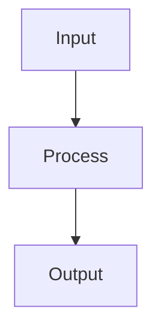

# Title

<!-- Purpose: Explain how this page advances child safety and penta-helix collaboration. Keep it specific to MerajutASA. -->
## Purpose

<!-- Scope & Audience: Who is this for and what is excluded. Avoid generic statements. -->
## Scope & Audience

<!-- Key Facts must be grounded with internal links only. Aim for 1–3 bullets per subsection. -->
## Key Facts (Grounded)
- [docs/instructions.md] – Binding rules for grounded-only docs and quality gates
- [docs/STYLE_GUIDE.md] – Writing standards (accessibility, child-centered language)
- [docs/architecture/README.md] – Architecture overview entry point

<!-- Provide precise, verifiable steps. Include validation after critical actions. -->
## How-To / Steps
1. 
2. 
3. 

<!-- Optional diagram: prefer Mermaid for simple flows. Provide alt text in surrounding prose. -->
## Diagrams (optional)

<!-- Always include accessibility and child safety notes relevant to this topic. Use WCAG 2.1 AA. Avoid PII. -->
## Accessibility & Child Safety

<!-- Describe how readers can verify success, where to monitor, and what alerts/metrics apply. -->
## Validation & Monitoring (optional)

<!-- Answer common questions with grounded references. Remove section if not needed. -->
## FAQ (optional)

## Changelog
- 0.1.0 (YYYY-MM-DD): Initial creation from template

<!-- Authoring guidance:
- Keep claims specific and cite only internal sources (relative links).
- If a fact is missing, add a short "Open questions" list and file a docs-gap issue.
- Ensure link-check, markdownlint, and style checks pass before PR.
- Follow single-topic, <300 LOC PR rule with evidence packet.
References: docs/instructions.md, docs/instructions.json
-->
