# Architecture Documentation
## MerajutASA Platform Architecture Overview

> **Mission**: Establish a comprehensive, scalable, and secure technical foundation that enables the penta-helix collaboration model while prioritizing child safety, data protection, and stakeholder accessibility across Indonesia's diverse technological landscape.

---

## 🏗️ Architecture Philosophy

### Child-Centered Technical Design
All architectural decisions prioritize child safety and welfare:

```yaml
Architecture Principles:
  Child Safety First: Every component protects vulnerable data
  Security by Design: Built-in protection at every layer
  Accessibility Focus: Inclusive design for all stakeholders
  Scalability Planning: Growth to serve all Indonesian children
  Cultural Adaptation: Technology respecting local contexts
  
Technical Values:
  Reliability: 99.9% uptime for critical child services
  Performance: Sub-second response for emergency access
  Maintainability: Clear, documented, and sustainable code
  Interoperability: Seamless stakeholder system integration
  Compliance: Meeting all regulatory requirements
```

### Penta-Helix Technical Architecture
System design supporting multi-stakeholder collaboration:

```mermaid
graph TB
    A[🌐 External Stakeholder Systems] --> B[🔒 API Gateway Layer]
    
    B --> C[🏛️ Government Services]
    B --> D[🏢 Business Services]
    B --> E[🎓 Academic Services]
    B --> F[👥 Community Services]
    B --> G[📰 Media Services]
    
    C --> H[⚙️ Core Platform Services]
    D --> H
    E --> H
    F --> H
    G --> H
    
    H --> I[🗄️ Data Layer]
    H --> J[🔐 Security Layer]
    H --> K[📊 Analytics Layer]
    
    I --> L[👶 Child-Centered Outcomes]
    J --> L
    K --> L
```



---

## 🎯 Architecture Documentation Navigation

### 🏗️ System Architecture Overview

#### High-Level Architecture Views
```yaml
Architecture Perspectives:
  Business Architecture: Stakeholder value and process flows
  Application Architecture: System components and interactions
  Data Architecture: Information flow and storage design
  Technology Architecture: Infrastructure and platform choices
  Security Architecture: Protection and compliance framework
```

**📚 [System Context →](overview/system-context.md)** - C4 model system boundaries
**🤝 [Stakeholder Landscape →](overview/stakeholder-landscape.md)** - Penta-helix interaction model
**⚙️ [Technology Stack →](overview/technology-stack.md)** - Technology selection rationale
**🚀 [Deployment Topology →](overview/deployment-topology.md)** - Infrastructure architecture

### 🔒 Security and Compliance

#### Child Protection Architecture
```yaml
Security Focus Areas:
  Data Protection: End-to-end encryption for child data
  Access Control: Role-based permissions with audit trails
  Privacy by Design: GDPR and UNICEF standard compliance
  Incident Response: 24/7 monitoring and response capabilities
```

**🛡️ [Security Model →](overview/security-model.md)** - Comprehensive security architecture
**📊 [Data Architecture →](overview/data-architecture.md)** - Data flow and protection design

### 🔗 Integration and Scalability

#### Platform Integration Strategy
```yaml
Integration Patterns:
  Government Systems: Secure data exchange and compliance
  Business Platforms: CSR and partnership integration
  Academic Tools: Research data and collaboration
  Community Systems: Volunteer and donation platforms
```

**🔌 [Integration Patterns →](overview/integration-patterns.md)** - External system connectivity
**📈 [Scalability Strategy →](overview/scalability-strategy.md)** - Growth and scaling approach

---

## 🏗️ Microservices Architecture

### Core Business Services

#### Child Welfare Services
```yaml
Child Management Service:
  Purpose: Child profile and case management
  Database: PostgreSQL with encryption
  Key Features:
    - Encrypted child data storage
    - Consent management workflows
    - Case history tracking
    - Guardian relationship management
    
Orphanage Management Service:
  Purpose: Institutional management and capacity tracking
  Database: PostgreSQL with compliance auditing
  Key Features:
    - Facility registration and profiles
    - Capacity and resource management
    - Staff credential tracking
    - Compliance monitoring
```

#### Stakeholder Services
```yaml
Government Integration Service:
  Purpose: Regulatory compliance and reporting
  Integration: Government API gateways
  Key Features:
    - Automated compliance reporting
    - Policy implementation tracking
    - Inter-agency data sharing
    - Regulatory audit support
    
Business Partnership Service:
  Purpose: Corporate engagement and CSR tracking
  Integration: Business systems and platforms
  Key Features:
    - Partnership management
    - CSR impact measurement
    - Employee volunteer coordination
    - Donation processing
```

**📚 [Complete Service Catalog →](microservices/service-catalog.md)**

---

## 🛠️ Technology Stack

### Development Stack
```yaml
Backend Technologies:
  Runtime: Node.js 18+ with TypeScript
  Framework: Express.js with security middleware
  Database: PostgreSQL 14+ with encryption
  Cache: Redis 7+ cluster configuration
  Message Queue: RabbitMQ with high availability
  
Frontend Technologies:
  Web Framework: React 18 with TypeScript
  Mobile Framework: React Native with platform optimization
  State Management: Redux Toolkit with RTK Query
  UI Library: Material-UI with accessibility features
  Build Tools: Vite (web) and Metro (mobile)
```

### Infrastructure Stack
```yaml
Cloud Platform: AWS with multi-region deployment
Container Orchestration: Kubernetes (EKS)
Service Mesh: Istio for traffic management
API Gateway: Kong with security plugins
Infrastructure as Code: Terraform with modules
Configuration Management: Helm charts

Monitoring and Observability:
  Metrics: Prometheus with Grafana dashboards
  Logging: ELK stack (Elasticsearch, Logstash, Kibana)
  Tracing: Jaeger for distributed tracing
  APM: DataDog for application performance monitoring
```

**⚙️ [Complete Technology Rationale →](overview/technology-stack.md)**

---

## 🔐 Security Architecture

### Defense in Depth Strategy

#### Security Layers
```yaml
Perimeter Security:
  - Web Application Firewall (CloudFlare)
  - DDoS protection and rate limiting
  - Geographic access controls
  - SSL/TLS termination with HSTS
  
Application Security:
  - JWT-based authentication with refresh tokens
  - Role-based access control (RBAC)
  - Input validation and sanitization
  - Output encoding and CSRF protection
  
Data Security:
  - AES-256 encryption at rest
  - TLS 1.3 encryption in transit
  - Key management with AWS KMS
  - Database encryption with key rotation
```

#### Child Data Protection
```yaml
Child-Specific Protections:
  Data Minimization: Collect only necessary information
  Consent Management: Age-appropriate consent workflows
  Access Logging: Comprehensive audit trails
  Data Retention: Automated deletion policies
  Breach Response: 24/7 incident response team
```

**🛡️ [Complete Security Model →](overview/security-model.md)**

---

## 📊 Data Architecture

### Data Flow Design

#### Data Classification
```yaml
Child Data (CONFIDENTIAL):
  - Personal identification information
  - Health and development records
  - Case management notes
  - Guardian and family information
  
Operational Data (INTERNAL):
  - Orphanage operational metrics
  - Stakeholder interaction data
  - Platform usage analytics
  - Financial transaction records
  
Public Data (PUBLIC):
  - Anonymized impact statistics
  - General orphanage information
  - Platform feature descriptions
  - Success stories (with consent)
```

#### Data Storage Strategy
```yaml
Primary Database: PostgreSQL with row-level security
Document Storage: MongoDB for unstructured data
Analytics Database: ClickHouse for real-time analytics
Cache Layer: Redis for session and application cache
File Storage: AWS S3 with encryption and versioning
```

**📊 [Complete Data Architecture →](overview/data-architecture.md)**

---

## 🔗 Integration Architecture

### External System Integration

#### Government System Integration
```yaml
Integration Patterns:
  API Gateway: Secure government API connections
  Data Exchange: Standardized data format exchange
  Authentication: Government SSO integration
  Compliance: Automated regulatory reporting
  
Technical Implementation:
  - OAuth 2.0 with government identity providers
  - X.509 certificate-based authentication
  - Message-level encryption for sensitive data
  - Audit logging for all government interactions
```

#### Business Platform Integration
```yaml
Integration Capabilities:
  CRM Systems: Salesforce, HubSpot integration
  HR Platforms: Employee volunteer coordination
  Payment Gateways: Secure donation processing
  Communication Tools: Email and SMS integration
  
Security Considerations:
  - API key management and rotation
  - Rate limiting and throttling
  - Data privacy protection
  - Cross-border data transfer compliance
```

**🔌 [Complete Integration Patterns →](overview/integration-patterns.md)**

---

## 📈 Scalability and Performance

### Scaling Strategy

#### Horizontal Scaling Design
```yaml
Microservices Scaling:
  Auto-scaling: Kubernetes HPA with custom metrics
  Load Balancing: NGINX Ingress with session affinity
  Service Mesh: Istio for traffic management
  Circuit Breakers: Resilience4j for fault tolerance
  
Database Scaling:
  Read Replicas: PostgreSQL read-only replicas
  Sharding Strategy: Horizontal partitioning by region
  Cache Strategy: Redis cluster with data distribution
  CDN Integration: CloudFront for static content
```

#### Performance Optimization
```yaml
Response Time Targets:
  Page Load Time: <2 seconds (95th percentile)
  API Response Time: <500ms (average)
  Database Query Time: <100ms (average)
  Mobile App Launch: <3 seconds cold start
  
Optimization Techniques:
  - Database query optimization and indexing
  - Application-level caching strategies
  - CDN for static asset delivery
  - Code splitting and lazy loading
  - Image optimization and compression
```

**📈 [Complete Scalability Strategy →](overview/scalability-strategy.md)**

---

## 🌍 Multi-Regional Architecture

### Indonesian Deployment Strategy

#### Regional Distribution
```yaml
Primary Regions:
  Jakarta (ap-southeast-1): Primary production environment
  Singapore (ap-southeast-1): Disaster recovery and backup
  
Regional Considerations:
  - Latency optimization for Indonesian users
  - Data sovereignty compliance
  - Local CDN presence
  - Regional backup and disaster recovery
  
Connectivity:
  - Multiple ISP connections
  - CDN edge locations across Indonesia
  - Mobile network optimization
  - Satellite backup connectivity for remote areas
```

#### Cultural and Technical Adaptation
```yaml
Indonesian-Specific Optimizations:
  Language Support: Indonesian and regional languages
  Cultural UI: Indonesian design patterns and colors
  Local Compliance: Indonesian data protection laws
  Payment Methods: Local payment gateway integration
  
Technical Adaptations:
  - Bandwidth optimization for slower connections
  - Mobile-first design for smartphone prevalence
  - Offline capability for unreliable internet
  - SMS integration for feature phone support
```

---

## 🔍 Architecture Decision Records (ADRs)

### Decision Tracking
```yaml
Recent Architecture Decisions:
  ADR-001: Microservices vs. Monolithic Architecture
  ADR-002: PostgreSQL vs. MongoDB for Primary Database
  ADR-003: Kubernetes vs. Docker Swarm for Orchestration
  ADR-004: React vs. Vue.js for Frontend Framework
  ADR-005: AWS vs. Google Cloud vs. Azure for Cloud Provider
```

**📋 [Architecture Decision Records →](decisions/README.md)**

---

## 🧪 Architecture Testing

### Testing Strategy

#### Architecture Validation
```yaml
Component Testing:
  - Unit tests for business logic
  - Integration tests for service communication
  - Contract tests for API compatibility
  - Security tests for vulnerability assessment
  
System Testing:
  - End-to-end workflow validation
  - Performance and load testing
  - Disaster recovery testing
  - Multi-region failover testing
  
Chaos Engineering:
  - Service failure simulation
  - Network partition testing
  - Database failure scenarios
  - Infrastructure failure recovery
```

---

## 📊 Architecture Metrics

### System Health Indicators

#### Technical Metrics
```yaml
Availability Metrics:
  System Uptime: 99.9% target (43 minutes downtime/month)
  Service Availability: 99.95% per microservice
  Database Availability: 99.99% with failover
  
Performance Metrics:
  Response Time: <500ms API average
  Throughput: 10,000 requests/second peak
  Concurrent Users: 50,000 simultaneous users
  Data Processing: Real-time analytics with <1s latency
```

#### Operational Metrics
```yaml
Current Platform Status:
  Active Child Profiles: 12,847 (as of monitoring/README.md)
  Monthly Active Users: 89% (tracked in monitoring/README.md) 
  Child Safety Incidents: 0 (tracked in security/incident-logs/)
  Feature Usage: 85% adoption rate (from monitoring/README.md)
```

---

## 🚀 Architecture Evolution

### Future Architecture Roadmap

#### Short-term Evolution (Q3-Q4 2025)
```yaml
Planned Enhancements:
  - AI/ML integration for predictive analytics
  - Enhanced mobile offline capabilities
  - Advanced search and recommendation engine
  - Real-time collaboration features
  
Infrastructure Improvements:
  - Multi-cloud deployment strategy
  - Enhanced disaster recovery capabilities
  - Advanced monitoring and observability
  - Automated security scanning and remediation
```

#### Long-term Vision (2026-2030)
```yaml
Strategic Initiatives:
  - Blockchain integration for transparency
  - IoT integration for orphanage monitoring
  - Advanced AI for child welfare prediction
  - Regional expansion architecture
  
Innovation Areas:
  - Quantum-safe cryptography preparation
  - Edge computing for remote areas
  - 5G optimization for mobile experiences
  - Augmented reality for training and education
```

---

## 📞 Architecture Support

### Technical Support and Guidance

#### Architecture Team
```yaml
Architecture Support:
  Email: architecture@merajutasa.id
  Slack: #architecture-team
  Office Hours: Wednesdays 2-4 PM WIB
  
Architecture Review Board:
  - Chief Technology Officer
  - Senior Software Architect
  - Security Architect
  - DevOps Lead
  - Product Owner
```

#### Documentation and Resources
```yaml
Reference Materials:
  - System design documentation
  - API specifications and schemas
  - Infrastructure as code repositories
  - Security policies and procedures
  - Performance benchmarks and SLAs
```

---

## 📋 Architecture Standards

### Implementation Standards
```yaml
Required Practices:
  Child Data Protection: Encryption at rest and transit (security/README.md)
  Access Control: Role-based permissions (security/README.md)
  System Monitoring: 99.9% uptime target (monitoring/README.md)
  Code Quality: Documentation standards (docs/STYLE_GUIDE.md)
  
Implementation Validation:
  - Security controls verified against security/ policies
  - Performance targets defined in monitoring/ configurations
  - Code reviews follow REVIEW_PROCESS.md requirements
  - Documentation adheres to STYLE_GUIDE.md standards
```

### Architecture Review Process
```yaml
Review Schedule:
  Monthly: Performance monitoring review (monitoring/README.md)
  Quarterly: Security assessment (security/README.md) 
  Annually: Architecture documentation audit
  
Change Management:
  - Follow ADR process in docs/architecture/decisions/
  - Update monitoring configurations in monitoring/
  - Security changes require security/ policy updates
  - Documentation updates follow docs/REVIEW_PROCESS.md
```

---

> **Architecture Purpose**: Document technical design decisions and implementation guidance for platform development and operations.

---

*Technical documentation for system architecture, security controls, and operational procedures. See [ARCHITECTURE.md](../../ARCHITECTURE.md) for system overview.*

**[System Context →](overview/system-context.md)** | **[Technology Stack →](overview/technology-stack.md)** | **[Security Model →](overview/security-model.md)**
