# Audit Trail and Compliance Monitoring
## Comprehensive Audit Framework for MerajutASA Platform

> **Purpose**: Establish comprehensive audit trail capabilities and compliance monitoring systems to ensure transparency, accountability, and regulatory compliance throughout the MerajutASA platform operations while protecting child welfare and enabling effective penta-helix collaboration.

---

## 🔍 Audit Trail Philosophy

### Comprehensive Accountability Framework
```yaml
Audit Principles:
  Complete Transparency: Full auditability of all system actions
  Child Protection Accountability: Enhanced audit for child-related activities
  Stakeholder Trust: Verifiable and transparent operations
  Regulatory Compliance: Comprehensive audit for legal requirements
  
Audit Values:
  Integrity: Tamper-proof audit records
  Completeness: No activity goes unaudited
  Accessibility: Appropriate audit access for all stakeholders
  Privacy: Audit without compromising personal data protection
```

### Multi-Level Audit Architecture

```mermaid
graph TD
    A[🎯 Audit Trail Framework] --> B[🔐 Security Audit Layer]
    A --> C[👶 Child Protection Audit]
    A --> D[🤝 Stakeholder Activity Audit]
    A --> E[📊 Data Processing Audit]
    A --> F[⚖️ Compliance Audit Layer]
    
    B --> G[🛡️ Security Operations Center]
    C --> H[👥 Child Welfare Monitoring]
    D --> I[🌐 Penta-Helix Activity Tracking]
    E --> J[🔒 Data Governance Compliance]
    F --> K[📋 Regulatory Compliance Dashboard]
    
    G --> L[📈 Real-Time Audit Analytics]
    H --> L
    I --> L
    J --> L
    K --> L
    
    L --> M[👑 Enhanced Child Safety & Compliance]
    
    style A fill:#9B59B6
    style L fill:#3498DB
    style M fill:#27AE60
```


---

## 🔐 Security Audit Trail

### Comprehensive Security Event Logging

#### Authentication and Authorization Audit
```yaml
Authentication Events:
  Login Activities:
    - User login attempts (successful and failed)
    - Multi-factor authentication events
    - Password reset and change activities
    - Session establishment and termination
    - Suspicious login pattern detection
    
  Authorization Events:
    - Permission grants and revocations
    - Role assignment and modification
    - Access control policy changes
    - Privileged operation attempts
    - Cross-service authorization events
    
  Child-Specific Authentication:
    - Parental approval for child account access
    - Age verification and validation events
    - Guardian authentication for child data access
    - Emergency access override documentation

Data Structure:
authentication_audit:
  event_id: uuid
  timestamp: iso8601_timestamp
  user_id: encrypted_user_identifier
  event_type: [login_attempt, mfa_challenge, password_change, etc.]
  client_info:
    ip_address: hashed_ip
    user_agent: sanitized_user_agent
    location: geo_location_hash
  result: [success, failure, suspicious]
  risk_score: numeric_risk_assessment
  child_protection_flag: boolean
  stakeholder_type: [government, business, academic, community, individual]

Technical Implementation:
  Authentication Audit Service: /microservices/auth-audit/
  
  Features:
    - Real-time authentication event capture
    - Risk-based authentication analysis
    - Child protection authentication monitoring
    - Cross-stakeholder authentication tracking
    - Anomaly detection and alerting
```

#### Data Access and Modification Audit
```yaml
Data Access Events:
  Read Operations:
    - Data retrieval with purpose justification
    - Query execution and result set information
    - API endpoint access with parameter logging
    - Database connection and query audit
    - Child data access with enhanced logging
    
  Write Operations:
    - Data creation with source validation
    - Data modification with change tracking
    - Data deletion with retention verification
    - Bulk operations with impact assessment
    - Child data changes with approval workflow
    
  Data Transfer Events:
    - Inter-service data exchange
    - External API data sharing
    - Data export and download activities
    - Backup and restoration operations
    - Cross-border data transfer compliance

Data Structure:
data_access_audit:
  event_id: uuid
  timestamp: iso8601_timestamp
  user_id: encrypted_user_identifier
  operation_type: [read, write, delete, transfer]
  data_classification: [public, internal, confidential, child_protected]
  data_elements:
    - element_type: data_field_type
      sensitivity_level: privacy_classification
      child_data_flag: boolean
  purpose_justification: encrypted_purpose_description
  legal_basis: gdpr_legal_basis
  retention_period: data_retention_schedule
  approvals:
    - approver_id: encrypted_approver_id
      approval_timestamp: iso8601_timestamp
      approval_type: [automatic, manual, emergency]

Technical Implementation:
  Data Access Audit Service: /microservices/data-audit/
  
  Components:
    - AccessLogger: Comprehensive access event logging
    - ChangeTracker: Detailed modification audit trail
    - TransferMonitor: Data movement audit and compliance
    - ChildDataAuditor: Enhanced child data access monitoring
```

### Network and Infrastructure Audit
```yaml
Network Security Events:
  Connection Monitoring:
    - Inbound and outbound connection logging
    - VPN and secure tunnel establishment
    - Firewall rule triggers and blocks
    - DDoS attack detection and mitigation
    - SSL/TLS certificate validation events
    
  Infrastructure Changes:
    - Server configuration modifications
    - Network topology changes
    - Security policy updates
    - Certificate rotation and renewal
    - System patch and update installations
    
  Threat Detection:
    - Intrusion detection system alerts
    - Malware detection and quarantine
    - Vulnerability scan results
    - Security incident response activities
    - Threat intelligence integration events

Technical Implementation:
  Infrastructure Audit Service: /microservices/infra-audit/
  
  Features:
    - Real-time network monitoring and logging
    - Infrastructure change management audit
    - Security incident comprehensive documentation
    - Threat landscape analysis and reporting
    - Compliance infrastructure validation
```

---

## 👶 Child Protection Audit

### Enhanced Child Welfare Activity Monitoring

#### Child Interaction Audit
```yaml
Child Engagement Events:
  Platform Interactions:
    - Child login and activity sessions
    - Feature usage patterns and duration
    - Communication with adults (monitored and approved)
    - Educational content access and progress
    - Safety feature activation and usage
    
  Protection Mechanism Triggers:
    - Inappropriate content detection and blocking
    - Suspicious adult interaction alerts
    - Emergency contact activation
    - Parental notification triggers
    - Child welfare service referral initiation
    
  Development and Progress Tracking:
    - Educational milestone achievements
    - Skill development progress documentation
    - Therapy and intervention session records
    - Family reunification progress tracking
    - Independent living preparation activities

Data Structure:
child_interaction_audit:
  event_id: uuid
  timestamp: iso8601_timestamp
  child_id: encrypted_child_identifier
  age_group: [early_childhood, school_age, adolescent]
  interaction_type: [educational, social, therapeutic, administrative]
  content_accessed:
    - content_id: encrypted_content_id
      content_type: [educational, entertainment, therapeutic]
      appropriateness_verified: boolean
      duration: time_spent_minutes
  protection_triggers:
    - trigger_type: safety_mechanism_type
      severity_level: [low, medium, high, critical]
      response_action: automated_response_taken
      human_review_required: boolean
  parental_involvement:
    consent_status: current_consent_state
    notification_sent: boolean
    parental_review_required: boolean
  welfare_impact:
    positive_indicators: [learning, engagement, social_connection]
    concern_indicators: [withdrawal, distress, inappropriate_content]
    intervention_recommended: boolean

Technical Implementation:
  Child Protection Audit Service: /microservices/child-protection-audit/
  
  Features:
    - Real-time child activity monitoring
    - Safety mechanism trigger documentation
    - Development progress tracking
    - Parental involvement audit trail
    - Welfare outcome measurement
```

#### Case Management Audit
```yaml
Child Welfare Case Events:
  Case Creation and Assignment:
    - Initial case assessment documentation
    - Social worker assignment and handover
    - Stakeholder team formation
    - Risk assessment completion
    - Case priority level determination
    
  Intervention Planning and Execution:
    - Service plan development and approval
    - Intervention implementation tracking
    - Resource allocation and utilization
    - Progress monitoring and assessment
    - Plan modification and adaptation
    
  Multi-Stakeholder Coordination:
    - Government agency collaboration
    - Healthcare provider coordination
    - Educational institution involvement
    - Community support activation
    - Legal proceeding documentation

Data Structure:
case_management_audit:
  event_id: uuid
  timestamp: iso8601_timestamp
  case_id: encrypted_case_identifier
  child_id: encrypted_child_identifier
  event_category: [assessment, planning, intervention, review, closure]
  stakeholders_involved:
    - stakeholder_id: encrypted_stakeholder_id
      role: [social_worker, healthcare, education, legal, community]
      involvement_type: [primary, supporting, consulting]
      access_level: data_access_permission_level
  actions_taken:
    - action_type: intervention_category
      urgency_level: [routine, urgent, emergency]
      outcome_expected: anticipated_result
      resources_required: resource_allocation_details
  compliance_checkpoints:
    - regulation: applicable_law_or_policy
      compliance_status: [compliant, needs_attention, violation]
      corrective_action: remediation_required
  child_welfare_impact:
    safety_improvement: safety_score_change
    wellbeing_indicators: wellbeing_metrics
    family_stability: family_situation_assessment

Technical Implementation:
  Case Management Audit Service: /microservices/case-audit/
  
  Components:
    - CaseEventLogger: Comprehensive case activity logging
    - StakeholderCoordination: Multi-agency collaboration audit
    - OutcomeTracker: Child welfare outcome measurement
    - ComplianceValidator: Regulatory compliance verification
```

---

## 🤝 Stakeholder Activity Audit

### Penta-Helix Collaboration Monitoring

#### Government Sector Audit
```yaml
Government Agency Activities:
  Policy Implementation:
    - Policy directive implementation tracking
    - Regulatory compliance verification
    - Inter-agency coordination documentation
    - Public service delivery monitoring
    - Budget allocation and utilization tracking
    
  Data Sharing and Integration:
    - Cross-agency data sharing agreements
    - Data integration and synchronization
    - Privacy and security compliance verification
    - Data quality and accuracy validation
    - Legal authorization documentation
    
  Public Accountability:
    - Transparency reporting generation
    - Public inquiry response tracking
    - Audit result publication
    - Citizen feedback integration
    - Performance metric publication

Data Structure:
government_audit:
  event_id: uuid
  timestamp: iso8601_timestamp
  agency_id: government_agency_identifier
  officer_id: encrypted_officer_identifier
  activity_type: [policy_implementation, data_access, service_delivery]
  legal_authority:
    - law_reference: indonesian_law_citation
      authorization_level: permitted_action_scope
      oversight_requirement: supervision_needed
  data_handling:
    classification_level: government_data_classification
    sharing_agreements: active_data_sharing_mou
    privacy_compliance: gdpr_and_local_compliance_status
  public_impact:
    citizens_affected: number_of_individuals_impacted
    service_improvement: quality_metrics_change
    transparency_level: information_disclosure_score

Technical Implementation:
  Government Audit Service: /microservices/gov-audit/
  
  Features:
    - Policy implementation tracking
    - Inter-agency coordination monitoring
    - Public accountability documentation
    - Legal compliance verification
    - Transparency reporting automation
```

#### Business Sector Audit
```yaml
Corporate Engagement Activities:
  CSR and Social Investment:
    - Corporate social responsibility program participation
    - Social investment allocation and impact
    - Employee volunteer program coordination
    - Skills-based volunteering documentation
    - Community partnership development
    
  Data and Technology Contribution:
    - Technology platform contribution
    - Data analytics and insights sharing
    - Innovation collaboration projects
    - Digital transformation support
    - Cybersecurity enhancement cooperation
    
  Ethical Business Practices:
    - Child labor prevention verification
    - Supply chain ethical compliance
    - Environmental sustainability practices
    - Anti-corruption policy implementation
    - Stakeholder engagement transparency

Data Structure:
business_audit:
  event_id: uuid
  timestamp: iso8601_timestamp
  company_id: business_entity_identifier
  representative_id: encrypted_representative_id
  engagement_type: [csr_program, technology_contribution, volunteer_support]
  investment_details:
    financial_contribution: monetary_value_contributed
    time_investment: hours_contributed
    skill_sharing: expertise_areas_shared
    resource_allocation: non_monetary_resources
  impact_measurement:
    children_benefited: number_of_children_helped
    families_supported: family_units_assisted
    community_reach: geographic_and_demographic_reach
    sustainability_metrics: long_term_impact_indicators
  compliance_verification:
    ethical_standards: ethical_compliance_certification
    child_protection: child_safeguarding_verification
    data_privacy: business_privacy_compliance
    esg_reporting: environmental_social_governance_metrics

Technical Implementation:
  Business Audit Service: /microservices/business-audit/
  
  Components:
    - CSRTracker: Corporate social responsibility monitoring
    - ContributionValidator: Business contribution verification
    - ImpactMeasurer: Social impact assessment and documentation
    - ComplianceChecker: Ethical business practice verification
```

#### Academic Sector Audit
```yaml
Research and Education Activities:
  Research Ethics Compliance:
    - Human subjects research approval
    - Child participant protection protocols
    - Informed consent and assent documentation
    - Data anonymization and privacy protection
    - Research outcome publication ethics
    
  Knowledge Sharing and Transfer:
    - Academic research collaboration
    - Best practice documentation and sharing
    - Policy recommendation development
    - Professional training and education
    - International cooperation and exchange
    
  Student and Faculty Engagement:
    - Student volunteer program participation
    - Faculty expertise contribution
    - Academic-community partnership
    - Service learning project coordination
    - Research-practice integration

Data Structure:
academic_audit:
  event_id: uuid
  timestamp: iso8601_timestamp
  institution_id: academic_institution_identifier
  researcher_id: encrypted_researcher_identifier
  activity_type: [research_project, knowledge_transfer, student_engagement]
  ethics_compliance:
    irb_approval: institutional_review_board_approval
    child_protection: minor_participant_protection_protocol
    consent_documentation: informed_consent_audit_trail
    data_anonymization: privacy_protection_verification
  research_contribution:
    study_focus: research_area_and_methodology
    participant_demographics: anonymized_demographic_data
    findings_summary: research_outcome_summary
    policy_implications: practice_and_policy_recommendations
  knowledge_impact:
    academic_publications: peer_reviewed_publication_count
    practice_integration: evidence_based_practice_adoption
    capacity_building: training_and_education_provision
    international_collaboration: global_partnership_development

Technical Implementation:
  Academic Audit Service: /microservices/academic-audit/
  
  Features:
    - Research ethics compliance monitoring
    - Knowledge transfer impact tracking
    - Academic-community partnership documentation
    - Student engagement activity logging
    - International collaboration audit
```

#### Community Sector Audit
```yaml
Community Engagement Activities:
  Volunteer and Citizen Participation:
    - Community volunteer registration and screening
    - Citizen participation in decision-making
    - Grassroots initiative development and support
    - Local knowledge contribution and validation
    - Community feedback and input collection
    
  Cultural and Social Integration:
    - Cultural competency in service delivery
    - Local custom and tradition integration
    - Community leader and elder involvement
    - Indigenous knowledge system respect
    - Social cohesion and harmony promotion
    
  Capacity Building and Empowerment:
    - Community skill development programs
    - Local leadership training and support
    - Economic empowerment initiative tracking
    - Social entrepreneurship development
    - Community resilience building activities

Data Structure:
community_audit:
  event_id: uuid
  timestamp: iso8601_timestamp
  community_id: community_group_identifier
  participant_id: encrypted_participant_identifier
  engagement_type: [volunteer_activity, decision_participation, capacity_building]
  participation_details:
    activity_description: community_activity_summary
    time_commitment: hours_contributed
    skill_contribution: expertise_and_knowledge_shared
    leadership_role: community_leadership_involvement
  cultural_integration:
    local_knowledge: traditional_knowledge_contribution
    cultural_sensitivity: cultural_appropriateness_verification
    language_accommodation: linguistic_accessibility_provision
    tradition_respect: cultural_tradition_integration
  community_impact:
    social_cohesion: community_unity_indicators
    capacity_enhancement: skill_development_metrics
    economic_empowerment: livelihood_improvement_measures
    resilience_building: community_strength_indicators

Technical Implementation:
  Community Audit Service: /microservices/community-audit/
  
  Components:
    - ParticipationTracker: Community engagement monitoring
    - CulturalIntegration: Cultural competency audit
    - CapacityBuilder: Community development tracking
    - ImpactAssessment: Community outcome measurement
```

---

## 📊 Data Processing Audit

### Comprehensive Data Lifecycle Monitoring

#### Data Collection Audit
```yaml
Data Source and Collection Events:
  Collection Point Documentation:
    - Data source identification and validation
    - Collection method and tool documentation
    - Data quality assessment at point of collection
    - Consent and authorization verification
    - Purpose limitation compliance verification
    
  Personal Data Collection:
    - Individual consent documentation
    - Legal basis establishment and verification
    - Data minimization principle compliance
    - Purpose specification and limitation
    - Retention period establishment
    
  Child Data Special Protections:
    - Age verification and documentation
    - Parental consent where required
    - Best interest assessment documentation
    - Enhanced protection measure implementation
    - Special category data handling

Data Structure:
data_collection_audit:
  event_id: uuid
  timestamp: iso8601_timestamp
  collection_source: data_source_identifier
  collector_id: encrypted_collector_identifier
  data_subject_type: [adult, child, organization]
  collection_method: [form_submission, api_integration, manual_entry]
  consent_framework:
    consent_status: [given, withdrawn, expired, not_required]
    legal_basis: gdpr_article_6_basis
    special_category_basis: gdpr_article_9_basis_if_applicable
    child_protection_compliance: enhanced_protection_verification
  data_elements:
    - element_name: data_field_identifier
      sensitivity_classification: privacy_sensitivity_level
      purpose_limitation: specified_processing_purpose
      retention_period: data_retention_schedule
      minimization_justified: necessity_justification
  quality_assurance:
    accuracy_verification: data_accuracy_check_status
    completeness_assessment: data_completeness_score
    consistency_validation: data_consistency_verification
    timeliness_check: data_freshness_validation

Technical Implementation:
  Data Collection Audit Service: /microservices/collection-audit/
  
  Features:
    - Real-time collection event logging
    - Consent and authorization tracking
    - Data quality assessment integration
    - Child protection compliance verification
    - Purpose limitation enforcement
```

#### Data Processing and Analytics Audit
```yaml
Processing Operation Events:
  Automated Processing:
    - Algorithm execution and decision-making
    - Machine learning model training and inference
    - Data analytics and statistical processing
    - Automated decision impact assessment
    - Bias detection and mitigation tracking
    
  Human Processing Activities:
    - Manual data review and validation
    - Expert analysis and interpretation
    - Case assessment and decision-making
    - Quality assurance and verification
    - Exception handling and resolution
    
  Cross-System Processing:
    - Data integration across multiple systems
    - Inter-service data exchange and transformation
    - Third-party service integration
    - Data synchronization and replication
    - Cross-border data transfer processing

Data Structure:
data_processing_audit:
  event_id: uuid
  timestamp: iso8601_timestamp
  processor_id: system_or_human_processor_id
  processing_type: [automated, manual, hybrid]
  processing_purpose: specific_processing_objective
  legal_basis: processing_legal_justification
  data_inputs:
    - source_system: data_source_identifier
      data_volume: number_of_records_processed
      sensitivity_level: privacy_classification
      child_data_included: boolean_child_data_flag
  processing_algorithm:
    algorithm_name: processing_method_identifier
    version: algorithm_version_number
    bias_assessment: fairness_evaluation_results
    accuracy_metrics: processing_accuracy_indicators
  processing_outputs:
    - output_type: result_classification
      accuracy_level: output_accuracy_assessment
      human_review_required: manual_review_flag
      decision_impact: impact_on_individuals_or_cases
  compliance_validation:
    purpose_limitation: processing_within_purpose_scope
    proportionality: processing_proportionality_assessment
    necessity: processing_necessity_justification
    accuracy_maintenance: data_accuracy_preservation

Technical Implementation:
  Data Processing Audit Service: /microservices/processing-audit/
  
  Components:
    - AlgorithmTracker: Automated processing monitoring
    - HumanActivityLogger: Manual processing documentation
    - CrossSystemMonitor: Inter-system processing audit
    - ComplianceValidator: Processing compliance verification
```

### Data Sharing and Transfer Audit
```yaml
Data Sharing Events:
  Internal Data Sharing:
    - Inter-department data sharing within organization
    - Cross-service data exchange documentation
    - Role-based data access and sharing
    - Temporary data sharing for specific purposes
    - Emergency data sharing for child protection
    
  External Data Sharing:
    - Third-party service provider data sharing
    - Government agency data exchange
    - Research institution data collaboration
    - International organization data sharing
    - Community partner data coordination
    
  Data Subject Rights Implementation:
    - Data portability request fulfillment
    - Data access request processing
    - Data correction implementation
    - Data deletion execution
    - Consent withdrawal processing

Data Structure:
data_sharing_audit:
  event_id: uuid
  timestamp: iso8601_timestamp
  sharing_initiator: encrypted_initiator_identifier
  data_recipient: recipient_organization_identifier
  sharing_type: [internal, external, subject_request]
  sharing_purpose: specific_sharing_objective
  legal_authorization:
    legal_basis: sharing_legal_justification
    data_sharing_agreement: agreement_reference_id
    regulatory_approval: authority_approval_reference
    emergency_justification: emergency_sharing_rationale
  data_shared:
    - data_category: shared_data_classification
      volume: number_of_records_shared
      sensitivity: privacy_sensitivity_level
      child_data_flag: boolean_child_data_included
      anonymization_applied: privacy_protection_technique
  recipient_obligations:
    purpose_limitation: recipient_purpose_restrictions
    security_requirements: required_security_measures
    retention_limits: data_retention_obligations
    onward_sharing_restrictions: further_sharing_limitations
  monitoring_requirements:
    audit_frequency: required_audit_schedule
    compliance_reporting: recipient_reporting_obligations
    breach_notification: incident_reporting_requirements
    performance_metrics: success_measurement_criteria

Technical Implementation:
  Data Sharing Audit Service: /microservices/sharing-audit/
  
  Features:
    - Real-time sharing event documentation
    - Legal authorization verification
    - Recipient compliance monitoring
    - Data subject rights implementation tracking
    - Cross-border transfer compliance
```

---

## ⚖️ Regulatory Compliance Audit

### Legal and Policy Compliance Monitoring

#### Indonesian Legal Compliance
```yaml
UU No. 35/2014 (Child Protection Law) Compliance:
  Child Welfare Service Delivery:
    - Best interest principle implementation
    - Child participation rights protection
    - Non-discrimination principle enforcement
    - Child-friendly service delivery verification
    - Parental responsibility support documentation
    
  Child Protection Mechanism:
    - Child abuse prevention and detection
    - Emergency response system effectiveness
    - Child safety assessment and monitoring
    - Rehabilitation and reintegration tracking
    - Family preservation and reunification efforts
    
  Stakeholder Coordination:
    - Government agency collaboration compliance
    - Community involvement in child protection
    - Professional standard adherence verification
    - Inter-sectoral coordination effectiveness
    - Child protection network strengthening

UU No. 27/2022 (Personal Data Protection) Compliance:
  Data Processing Compliance:
    - Lawful processing basis establishment
    - Consent management and documentation
    - Data subject rights implementation
    - Cross-border transfer compliance
    - Data breach notification procedures
    
  Data Controller Obligations:
    - Data protection impact assessment
    - Privacy policy publication and maintenance
    - Data protection officer appointment
    - Regular compliance audit execution
    - Staff training and awareness programs
    
  Child Data Special Protection:
    - Enhanced consent mechanisms for children
    - Parental involvement in data decisions
    - Age-appropriate privacy information
    - Special protection measure implementation
    - Best interest consideration in data processing

Data Structure:
indonesian_compliance_audit:
  event_id: uuid
  timestamp: iso8601_timestamp
  law_reference: [uu_35_2014, uu_27_2022, other_regulation]
  compliance_category: [child_protection, data_protection, service_delivery]
  compliance_requirement: specific_legal_requirement
  implementation_evidence:
    policy_documentation: implemented_policy_reference
    procedure_execution: executed_procedure_documentation
    training_completion: staff_training_evidence
    monitoring_results: compliance_monitoring_outcomes
  compliance_status: [fully_compliant, partially_compliant, non_compliant]
  corrective_actions:
    - action_required: specific_remediation_action
      responsible_party: assigned_responsibility
      deadline: completion_deadline
      resource_allocation: required_resources
  child_impact_assessment:
    direct_impact: immediate_child_welfare_impact
    indirect_impact: systemic_child_protection_enhancement
    risk_mitigation: child_protection_risk_reduction
    outcome_improvement: child_welfare_outcome_enhancement

Technical Implementation:
  Indonesian Compliance Service: /microservices/indonesian-compliance/
  
  Features:
    - Real-time legal compliance monitoring
    - Child protection law implementation tracking
    - Data protection regulation compliance verification
    - Government oversight and reporting
    - Legal requirement change management
```

#### International Standards Compliance
```yaml
GDPR Compliance Monitoring:
  Data Subject Rights:
    - Right to information implementation
    - Right of access request processing
    - Right to rectification execution
    - Right to erasure (right to be forgotten)
    - Right to data portability facilitation
    
  Processing Compliance:
    - Lawfulness of processing verification
    - Purpose limitation enforcement
    - Data minimization principle implementation
    - Accuracy maintenance procedures
    - Storage limitation compliance
    
  Organizational Measures:
    - Data protection by design and by default
    - Data protection impact assessment execution
    - Data protection officer role fulfillment
    - International transfer safeguards
    - Breach notification compliance

UNICEF Child Rights Standards:
  Child Participation Rights:
    - Age-appropriate participation facilitation
    - Child voice inclusion in decision-making
    - Child feedback collection and integration
    - Child advocacy and representation support
    - Child-led initiative promotion
    
  Child Protection Standards:
    - Child safeguarding policy implementation
    - Risk assessment and management procedures
    - Child-friendly complaint mechanisms
    - Trauma-informed service delivery
    - Cultural sensitivity in child protection
    
  Digital Rights for Children:
    - Digital literacy and empowerment
    - Online safety and protection measures
    - Digital divide reduction efforts
    - Child-appropriate technology design
    - Digital citizenship education

Data Structure:
international_compliance_audit:
  event_id: uuid
  timestamp: iso8601_timestamp
  standard_reference: [gdpr, unicef_standards, crc, other_international]
  compliance_area: [data_protection, child_rights, digital_rights]
  standard_requirement: specific_international_requirement
  implementation_approach:
    policy_framework: adopted_policy_approach
    technical_measures: implemented_technical_solutions
    organizational_measures: established_organizational_procedures
    training_programs: conducted_training_initiatives
  compliance_evidence:
    documentation: compliance_documentation_reference
    audit_results: independent_audit_findings
    certification: relevant_certification_status
    peer_review: external_validation_results
  global_best_practice:
    benchmark_comparison: international_benchmark_assessment
    innovation_adoption: cutting_edge_practice_implementation
    knowledge_sharing: international_collaboration_contribution
    standard_development: contribution_to_standard_evolution

Technical Implementation:
  International Compliance Service: /microservices/international-compliance/
  
  Components:
    - GDPRComplianceTracker: EU data protection compliance
    - UNICEFStandardsMonitor: Child rights standards implementation
    - InternationalBenchmark: Global best practice comparison
    - CertificationManager: International certification maintenance
```

---

## 📈 Audit Analytics and Reporting

### Comprehensive Audit Intelligence

#### Real-Time Audit Dashboard
```yaml
Executive Dashboard Metrics:
  Overall Compliance Score: 98.7% (Target: >95%)
  Critical Audit Findings: 0 (Target: 0)
  Compliance Trend: +2.3% (Month-over-Month Improvement)
  Stakeholder Trust Index: 94.1% (Target: >90%)
  
Child Protection Metrics:
  Child Safety Incidents: 0 (Target: 0)
  Child Data Protection Score: 99.8% (Target: >99%)
  Child Welfare Outcome Improvement: +15.7% (Target: >10%)
  Parental Satisfaction: 96.3% (Target: >95%)
  
Stakeholder Engagement Metrics:
  Government Compliance: 100% (Target: 100%)
  Business Partner Satisfaction: 92.8% (Target: >90%)
  Academic Collaboration Effectiveness: 89.4% (Target: >85%)
  Community Trust Level: 91.7% (Target: >85%)
  
Technical Performance:
  System Availability: 99.97% (Target: >99.9%)
  Security Incident Response Time: 8 minutes (Target: <15 minutes)
  Data Processing Accuracy: 99.94% (Target: >99.9%)
  Audit Trail Completeness: 100% (Target: 100%)

Dashboard Implementation:
  Audit Analytics Service: /microservices/audit-analytics/
  
  Features:
    - Real-time metric calculation and display
    - Trend analysis and predictive modeling
    - Stakeholder-specific dashboard views
    - Alert and notification system
    - Automated compliance reporting
```

#### Predictive Compliance Analytics
```yaml
Risk Prediction Models:
  Compliance Risk Assessment:
    - Machine learning-based risk prediction
    - Pattern recognition for potential violations
    - Early warning system for compliance gaps
    - Proactive remediation recommendation
    - Resource allocation optimization
    
  Child Protection Risk Modeling:
    - Vulnerability assessment prediction
    - Early intervention need identification
    - Risk factor pattern analysis
    - Protective factor enhancement recommendation
    - Outcome prediction for intervention planning
    
  Stakeholder Engagement Prediction:
    - Participation level forecasting
    - Collaboration effectiveness prediction
    - Trust relationship sustainability assessment
    - Engagement optimization recommendation
    - Partnership success probability modeling

Technical Implementation:
  Predictive Analytics Service: /microservices/predictive-audit/
  
  Components:
    - RiskPredictionEngine: ML-based risk assessment
    - EarlyWarningSystem: Proactive alert generation
    - RecommendationEngine: Optimization suggestions
    - TrendAnalyzer: Pattern recognition and analysis
```

### Audit Reporting Framework
```yaml
Automated Report Generation:
  Regulatory Reports:
    - Government oversight reporting
    - Legal compliance status reports
    - Child protection service delivery reports
    - Data protection authority submissions
    - International standards compliance reports
    
  Stakeholder Reports:
    - Executive leadership dashboards
    - Board governance reports
    - Partner collaboration summaries
    - Community impact assessments
    - Academic research findings
    
  Operational Reports:
    - System performance analytics
    - Security incident summaries
    - Data processing efficiency reports
    - User experience metrics
    - Platform optimization recommendations

Custom Reporting Capabilities:
  Ad-Hoc Analysis:
    - Custom query and analysis tools
    - Data visualization and exploration
    - Cross-stakeholder impact analysis
    - Historical trend investigation
    - Comparative benchmark analysis
    
  Real-Time Reporting:
    - Live dashboard updates
    - Instant alert and notification
    - Real-time compliance monitoring
    - Immediate incident response coordination
    - Dynamic resource allocation guidance

Technical Implementation:
  Audit Reporting Service: /microservices/audit-reporting/
  
  Features:
    - Automated report generation
    - Custom visualization creation
    - Multi-format output support
    - Scheduled delivery automation
    - Interactive analysis capabilities
```

---

## 🔒 Audit Security and Integrity

### Tamper-Proof Audit Trail

#### Blockchain-Based Audit Integrity
```yaml
Immutable Audit Records:
  Blockchain Implementation:
    - Distributed ledger for critical audit events
    - Cryptographic hashing for record integrity
    - Multi-node validation for audit authenticity
    - Immutable timestamp verification
    - Cross-stakeholder audit validation
    
  Critical Event Recording:
    - Child protection decision points
    - Regulatory compliance checkpoints
    - Data sharing authorization events
    - Security incident response actions
    - System configuration changes
    
  Audit Chain Validation:
    - Continuous integrity verification
    - Tamper detection and alerting
    - Historical audit trail validation
    - Cross-reference verification
    - Independent audit confirmation

Technical Implementation:
  Blockchain Audit Service: /microservices/blockchain-audit/
  
  Features:
    - Distributed audit ledger management
    - Cryptographic integrity verification
    - Multi-stakeholder validation network
    - Tamper detection and response
    - Historical audit trail immutability
```

#### Access Control and Audit Security
```yaml
Audit Access Management:
  Role-Based Audit Access:
    - Stakeholder-specific audit visibility
    - Hierarchical access control implementation
    - Need-to-know basis audit information sharing
    - Time-limited audit access permissions
    - Emergency audit access procedures
    
  Audit Viewing Audit:
    - Comprehensive audit access logging
    - Audit trail viewing activity monitoring
    - Unauthorized access attempt detection
    - Audit data export and download tracking
    - Analysis activity documentation
    
  Privacy-Preserving Audit Display:
    - Automatic personal data redaction in audit views
    - Role-appropriate information filtering
    - Child data enhanced protection in audit displays
    - Stakeholder consent for audit information sharing
    - Anonymization for research and analysis purposes

Technical Implementation:
  Audit Security Service: /microservices/audit-security/
  
  Components:
    - AccessController: Audit access management
    - ViewingAuditor: Audit access monitoring
    - PrivacyFilter: Personal data protection in audit
    - IntegrityValidator: Audit trail integrity verification
```

---

**Platform**: MerajutASA - Indonesian Child Welfare Platform  
**Domain**: merajutasa.id  
**Audit Framework**: Comprehensive accountability and transparency system  
**Focus**: Child protection compliance with multi-stakeholder trust
