# Data Governance Framework
## Comprehensive Data Handling and Protection for MerajutASA Platform

> **Purpose**: Establish a comprehensive data governance framework that ensures responsible, secure, and compliant handling of all data, with special emphasis on child protection, privacy by design, and stakeholder trust across the penta-helix collaboration model.

---

## 📊 Data Governance Philosophy

### Child-Centric Data Stewardship
```yaml
Data Protection Principles:
  Child Safety Primacy: Every data decision protects vulnerable children
  Privacy by Design: Built-in protection from data collection to deletion
  
Data Stewardship Values:
  Transparency: Clear data handling practices for all stakeholders
  Accountability: Defined responsibility for all data activities
  Minimization: Collect and retain only necessary data
  Purpose Limitation: Use data only for stated purposes
```

### Stakeholder Data Trust Model

```mermaid
graph TD
    A[👶 Child Data Subject] --> F[🛡️ Data Governance Engine]
    B[🏛️ Government Data Sharing] --> F
    C[🏢 Business Analytics] --> F
    D[🎓 Research Data Access] --> F
    E[👥 Community Engagement] --> F
    G[📺 Media Content] --> F
    
    F --> H[🔒 Data Classification]
    F --> I[📋 Consent Management]
    F --> J[🔍 Access Control]
    F --> K[📝 Audit Trail]
    
    H --> L[👶 Child Welfare Outcomes]
    I --> L
    J --> L
    K --> L
    
    style A fill:#E74C3C
    style F fill:#2C3E50
    style L fill:#27AE60
```


---

## 🗂️ Data Classification Framework

### 1. Data Classification Taxonomy

#### Primary Data Categories
```yaml
CONFIDENTIAL - Child Personal Data:
  Definition: Any information directly identifying or relating to a child
  Examples:
    - Full names, photographs, biometric data
    - Family information, guardian details
    - Case notes, assessment reports
    - Medical records, psychological evaluations
    - Location data, contact information
    
  Protection Requirements:
    - AES-256-GCM encryption at rest and in transit
    - Multi-factor authentication for all access
    - Comprehensive audit logging
    - Data loss prevention (DLP) monitoring
    - Geographic restrictions on data storage
    
  Retention Policy:
    - Legal basis required for all collection
    - Automatic deletion after 7 years (unless legal hold)
    - Regular review of retention necessity
    - Secure deletion with verification

RESTRICTED - Operational Sensitive Data:
  Definition: Internal operational data that could impact child safety if disclosed
  Examples:
    - Staff personal information
    - Internal communications about cases
    - Operational procedures and protocols
    - Vendor contracts and agreements
    - Security incident reports
    
  Protection Requirements:
    - AES-256 encryption for sensitive elements
    - Role-based access controls
    - Secure transmission protocols
    - Regular access reviews
    - Data backup encryption
    
  Retention Policy:
    - Business need-based retention
    - Minimum 3 years for audit purposes
    - Annual review of business necessity
    - Secure disposal procedures

INTERNAL - Business Information:
  Definition: General business information for internal use
  Examples:
    - Anonymized statistics and reports
    - Policy documentation
    - Training materials
    - Process documentation
    - Non-sensitive system logs
    
  Protection Requirements:
    - Standard encryption for transmission
    - Access controls based on business need
    - Regular backup procedures
    - Version control and document management
    
  Retention Policy:
    - Standard business retention periods
    - 7 years for financial records
    - 3 years for operational documents
    - Permanent for policy documents

PUBLIC - Open Information:
  Definition: Information approved for public disclosure
  Examples:
    - Website content and marketing materials
    - Published impact reports (anonymized)
    - Press releases and media content
    - Public educational resources
    - Event announcements
    
  Protection Requirements:
    - Integrity controls to prevent tampering
    - Version management
    - Approval workflow for publication
    - Regular content review
    
  Retention Policy:
    - Indefinite retention for valuable content
    - Regular review for accuracy and relevance
    - Archive management for historical content
```

### 2. Special Category Data Handling

#### Child-Specific Data Processing
```yaml
Enhanced Protection Measures:
  Age Verification:
    - Multi-point age verification process
    - Parental consent for children under 13
    - Guardian verification for vulnerable children
    - Regular re-verification requirements
    
  Consent Management:
    - Granular consent options
    - Easy consent withdrawal mechanisms
    - Parent/guardian consent override capability
    - Consent renewal for long-term data retention
    
  Data Minimization:
    - Collect only essential information for child welfare
    - Regular data necessity assessments
    - Automated data purging for unnecessary information
    - Purpose-specific data collection
    
  Special Safeguards:
    - Enhanced encryption for all child data
    - Restricted access to trained staff only
    - Mandatory reporting integration
    - Trauma-informed data handling practices
```

#### Cross-Border Data Transfer Controls
```yaml
Transfer Governance Framework:
  Adequacy Assessment:
    - Automated adequacy decision checking
    - Country-specific risk assessment
    - Regular review of international data transfer laws
    - Emergency suspension capabilities
    
  Safeguards Implementation:
    - Standard Contractual Clauses (SCCs) for all transfers
    - Data Processing Agreements (DPAs) with all recipients
    - Transfer risk assessments for each jurisdiction
    - Regular monitoring of recipient compliance
    
  Child Data Transfer Restrictions:
    - Prohibited countries: Those without adequate child protection
    - Enhanced safeguards: Additional protection for child data
    - Parental notification: Inform parents of international transfers
    - Right to object: Allow objection to specific transfers
    
Technical Implementation:
  Location: /microservices/data-transfer-governance/
  
  Transfer Control System:
    - Real-time transfer monitoring and logging
    - Automated blocking of unauthorized transfers
    - Encryption key management for cross-border data
    - Compliance reporting for regulatory authorities
```

---

## 🔒 Data Lifecycle Management

### 1. Data Collection and Creation

#### Collection Governance
```yaml
Data Collection Principles:
  Lawful Basis Verification:
    - Legal basis assessment before any collection
    - Documentation of lawful basis for each data type
    - Regular review of collection necessity
    - Clear communication of collection purpose to users
    
  Consent Management:
    - Informed consent with plain language explanations
    - Granular consent options for different processing purposes
    - Easy consent withdrawal mechanisms
    - Parental consent management for minors
    
  Quality Assurance:
    - Data accuracy verification at point of collection
    - Regular data quality audits
    - Error correction procedures
    - Data validation rules and checks

Collection Process Implementation:
  Data Collection Service: /microservices/data-collection/
  
  Components:
    - Consent capture interface with audit trail
    - Data validation and quality checking
    - Legal basis verification engine
    - Collection purpose documentation system
    
  Integration Points:
    - User interfaces with consent management
    - Third-party data sources with agreements
    - Government systems with legal frameworks
    - Partner systems with data sharing agreements
```

### 2. Data Processing and Usage

#### Processing Governance Framework
```yaml
Purpose Limitation Controls:
  Processing Registry:
    - Comprehensive register of all processing activities
    - Clear purpose documentation for each activity
    - Legal basis mapping to processing purposes
    - Regular review of processing necessity
    
  Automated Controls:
    - Purpose-based access controls
    - Processing activity monitoring
    - Unauthorized usage detection
    - Purpose drift prevention mechanisms
    
  Child Data Processing:
    - Enhanced purpose limitation for child data
    - Mandatory child welfare benefit assessment
    - Restricted secondary processing
    - Enhanced monitoring and audit trails

Data Processing Architecture:
  Processing Engine: /microservices/data-processing/
  
  Core Features:
    - Purpose-aware data processing workflows
    - Automated legal basis checking
    - Processing activity logging and monitoring
    - Data subject rights integration
    
  Quality Controls:
    - Data accuracy maintenance during processing
    - Processing error detection and correction
    - Performance monitoring and optimization
    - Compliance validation at each processing step
```

### 3. Data Storage and Retention

#### Storage Governance
```yaml
Storage Classification:
  Hot Storage (Frequent Access):
    - Active child cases and current operations
    - High-performance SSD storage with encryption
    - Immediate availability requirements
    - Enhanced monitoring and security
    
  Warm Storage (Occasional Access):
    - Historical cases and archived operations
    - Standard storage with encryption
    - Moderate access time requirements
    - Regular integrity checks
    
  Cold Storage (Long-term Archive):
    - Legal retention and compliance requirements
    - Encrypted archival storage
    - Extended retrieval time acceptable
    - Annual access and necessity review

Retention Policy Framework:
  Retention Schedules:
    Child Data:
      - Active case data: Duration of case + 7 years
      - Educational records: 25 years after last contact
      - Medical information: Permanent with restricted access
      - Photos/videos: Consent-based with review every 3 years
    
    Operational Data:
      - Financial records: 10 years minimum
      - Staff records: Employment + 7 years
      - Audit logs: 7 years minimum
      - System logs: 2 years unless incident-related
    
    Research Data:
      - Anonymized datasets: 10 years or publication + 5 years
      - Consent records: Life of data + 3 years
      - Ethics approvals: Permanent
      - Study documentation: 15 years minimum

Technical Implementation:
  Storage Management Service: /microservices/storage-management/
  
  Automated Features:
    - Retention policy enforcement
    - Automated data migration between storage tiers
    - Secure deletion with verification
    - Storage optimization and cost management
```

### 4. Data Sharing and Disclosure

#### Sharing Governance Framework
```yaml
Data Sharing Principles:
  Need-to-Know Basis:
    - Minimum necessary information sharing
    - Purpose-specific data sharing
    - Recipient verification and authorization
    - Regular review of sharing arrangements
    
  Child Protection Priority:
    - Child welfare consideration in all sharing decisions
    - Enhanced protection for vulnerable children
    - Mandatory reporting compliance
    - Safety-first sharing protocols
    
  Stakeholder Trust:
    - Transparent sharing practices
    - Clear benefit articulation
    - Respect for stakeholder preferences
    - Regular sharing impact assessment

Sharing Categories:
  Government Data Sharing:
    Legal Basis: Public task and legal obligation
    Data Types: Compliance reporting, mandatory notifications
    Safeguards: Government-to-government secure channels
    Monitoring: Real-time sharing logs and audit trails
    
  Research Data Sharing:
    Legal Basis: Legitimate interest with safeguards
    Data Types: Anonymized datasets for research
    Safeguards: Ethics approval, data use agreements
    Monitoring: Research output tracking and compliance
    
  Business Partnership Sharing:
    Legal Basis: Legitimate interest or consent
    Data Types: Anonymized impact metrics, partnership data
    Safeguards: Partnership agreements, purpose limitation
    Monitoring: Regular partnership review and assessment
    
  Emergency Sharing:
    Legal Basis: Vital interests and public task
    Data Types: Urgent child protection information
    Safeguards: Emergency protocols, immediate documentation
    Monitoring: Post-emergency review and justification

Technical Implementation:
  Data Sharing Service: /microservices/data-sharing/
  
  Core Components:
    - Sharing request and approval workflow
    - Automated sharing controls and monitoring
    - Data anonymization and pseudonymization
    - Sharing audit trail and compliance reporting
```

---

## 👥 Data Governance Roles and Responsibilities

### 1. Governance Structure

#### Data Governance Committee
```yaml
Committee Composition:
  Chief Data Officer (CDO):
    - Overall data governance strategy and oversight
    - Data governance policy development and enforcement
    - Stakeholder engagement and relationship management
    - Regular reporting to executive leadership
    
  Data Protection Officer (DPO):
    - Privacy compliance and protection strategy
    - Data subject rights management
    - Privacy impact assessment oversight
    - Regulatory relationship management
    
  Child Protection Data Specialist:
    - Child-specific data protection measures
    - Child welfare impact assessment
    - Best practices research and implementation
    - Training and awareness for child data handling
    
  Technical Data Architect:
    - Technical implementation of data governance
    - Data architecture design and maintenance
    - System integration and interoperability
    - Technical compliance monitoring
    
  Legal and Compliance Representative:
    - Legal compliance oversight and advice
    - Regulatory relationship management
    - Contract and agreement review
    - Legal risk assessment and mitigation

Committee Responsibilities:
  Strategic Planning:
    - Annual data governance strategy development
    - Policy development and review
    - Regulatory compliance planning
    - Stakeholder engagement strategy
    
  Operational Oversight:
    - Monthly governance review meetings
    - Incident response and resolution
    - Compliance monitoring and reporting
    - Continuous improvement initiatives
```

### 2. Operational Data Roles

#### Data Stewardship Model
```yaml
Data Stewards by Domain:
  Child Data Steward:
    Scope: All child personal and case information
    Responsibilities:
      - Child data quality assurance
      - Access request review and approval
      - Child welfare impact assessment
      - Parent and guardian communication
    
  Operational Data Steward:
    Scope: Organizational and operational data
    Responsibilities:
      - Business data quality management
      - Operational reporting and analytics
      - Staff data access management
      - Process improvement recommendations
    
  Research Data Steward:
    Scope: Research and analytics datasets
    Responsibilities:
      - Research data preparation and anonymization
      - Academic partnership data management
      - Research ethics compliance
      - Publication and sharing oversight
    
  External Data Steward:
    Scope: Third-party and shared data
    Responsibilities:
      - External data integration and quality
      - Partnership data management
      - Vendor data governance
      - Cross-border data transfer oversight

Data Custodians:
  Technical Responsibilities:
    - Day-to-day data management and maintenance
    - Backup and recovery operations
    - Security control implementation
    - Performance monitoring and optimization
    
  Operational Responsibilities:
    - User access provisioning and management
    - Data quality monitoring and reporting
    - Incident detection and initial response
    - Regular maintenance and updates
```

---

## 🔍 Data Rights Management

### 1. Data Subject Rights Implementation

#### Rights Management System
```yaml
Data Subject Rights Framework:
  Right of Access (Article 15 GDPR):
    Implementation: Self-service portal with identity verification
    Response Time: Within 30 days (free first request per year)
    Data Formats: Machine-readable formats (JSON, CSV, PDF)
    Special Considerations: Enhanced verification for child data
    
  Right to Rectification (Article 16 GDPR):
    Implementation: Online correction interface with approval workflow
    Response Time: Within 72 hours for corrections
    Validation: Automated data validation and manual review
    Notification: All data recipients notified of corrections
    
  Right to Erasure (Article 17 GDPR):
    Implementation: Secure deletion with verification
    Response Time: Within 72 hours (unless legal retention required)
    Scope: All copies including backups and archives
    Exceptions: Legal obligations, public interest, vital interests
    
  Right to Data Portability (Article 20 GDPR):
    Implementation: Automated export in common formats
    Response Time: Within 30 days
    Data Scope: Personal data provided by the data subject
    Transfer Options: Direct transfer to other controllers where possible

Child-Specific Rights Implementation:
  Parental Rights Exercise:
    - Verified parental authority to exercise rights
    - Child consultation for age-appropriate decisions
    - Balancing child interests with parental rights
    - Special protection for vulnerable children
    
  Age-Appropriate Communication:
    - Simplified explanations for children
    - Visual aids and child-friendly language
    - Age-appropriate consent and notification processes
    - Guardian involvement in complex decisions

Technical Implementation:
  Rights Management Service: /microservices/rights-management/
  
  Core Features:
    - Identity verification and authorization
    - Automated rights fulfillment where possible
    - Workflow management for complex requests
    - Audit trail for all rights exercises
    - Integration with all data processing systems
```

### 2. Consent Management

#### Comprehensive Consent Framework
```yaml
Consent Collection and Management:
  Consent Capture:
    - Clear, plain language consent notices
    - Granular consent options by processing purpose
    - Separate consent for each significant purpose
    - Age-appropriate consent interfaces for children
    
  Consent Verification:
    - Strong identity verification for consent
    - Parental verification for children under 13
    - Regular consent verification for high-risk processing
    - Fraud detection in consent processes
    
  Consent Withdrawal:
    - Easy withdrawal mechanisms (one-click where possible)
    - Immediate effect of withdrawal
    - Clear explanation of withdrawal consequences
    - Confirmation of successful withdrawal
    
  Consent Records:
    - Comprehensive audit trail of all consent actions
    - Proof of consent collection and withdrawal
    - Regular consent status review and renewal
    - Legal compliance documentation

Special Consent Considerations:
  Child Consent Management:
    - Age verification and appropriate consent mechanisms
    - Parental consent integration
    - Competence assessment for older children
    - Regular consent review as children mature
    
  Vulnerable Population Consent:
    - Enhanced protection for particularly vulnerable children
    - Guardian involvement in consent decisions
    - Simplified consent processes where appropriate
    - Additional safeguards and monitoring

Technical Implementation:
  Consent Management Service: /microservices/consent-management/
  
  Key Components:
    - Consent capture and verification interfaces
    - Centralized consent record management
    - Consent status checking for all processing activities
    - Automated consent renewal and review processes
    - Integration with all data collection and processing systems
```

---

## 📊 Data Quality and Monitoring

### 1. Data Quality Framework

#### Quality Dimensions and Metrics
```yaml
Data Quality Dimensions:
  Accuracy:
    Definition: Data correctly represents real-world entities
    Measurement: Error rate, validation failure rate
    Target: >99% accuracy for child data, >95% for operational data
    Monitoring: Continuous validation and regular audits
    
  Completeness:
    Definition: All required data fields are populated
    Measurement: Missing field percentage, incomplete record rate
    Target: >98% completeness for essential fields
    Monitoring: Automated completeness checking and reporting
    
  Consistency:
    Definition: Data values are consistent across systems and time
    Measurement: Consistency rule violations, duplicate detection
    Target: >99% consistency across integrated systems
    Monitoring: Cross-system validation and reconciliation
    
  Timeliness:
    Definition: Data is current and available when needed
    Measurement: Data freshness, update lag time
    Target: Real-time for critical child safety data, daily for operational
    Monitoring: Data pipeline monitoring and alerting
    
  Validity:
    Definition: Data conforms to defined formats and constraints
    Measurement: Validation rule violations, format error rate
    Target: >99.5% validation success rate
    Monitoring: Real-time validation and error reporting

Quality Improvement Process:
  Data Profiling:
    - Regular automated data profiling
    - Quality trend analysis and reporting
    - Root cause analysis for quality issues
    - Quality improvement recommendation generation
    
  Quality Monitoring:
    - Real-time quality monitoring dashboards
    - Automated quality alerts and notifications
    - Quality scorecard generation and distribution
    - Regular quality review meetings and actions
```

### 2. Data Monitoring and Auditing

#### Comprehensive Monitoring Framework
```yaml
Monitoring Categories:
  Access Monitoring:
    - All data access logged with user, time, and purpose
    - Anomalous access pattern detection
    - Privileged access monitoring and alerting
    - Regular access review and certification
    
  Processing Monitoring:
    - All data processing activities logged
    - Processing purpose validation and enforcement
    - Processing quality monitoring and alerting
    - Performance monitoring and optimization
    
  Sharing Monitoring:
    - All data sharing activities logged and audited
    - Sharing agreement compliance monitoring
    - Recipient activity monitoring where possible
    - Sharing impact assessment and review
    
  Compliance Monitoring:
    - Regulatory compliance continuous monitoring
    - Policy compliance checking and reporting
    - Violation detection and automatic remediation
    - Compliance scorecard generation and reporting

Child Data Specific Monitoring:
  Enhanced Protection Monitoring:
    - Heightened monitoring for all child data access
    - Suspicious activity detection and immediate alerting
    - Staff training compliance monitoring
    - Child welfare impact tracking and reporting
    
  Safety Monitoring:
    - Content monitoring for child safety concerns
    - Communication monitoring with privacy safeguards
    - Interaction pattern analysis for risk detection
    - Integration with child protection services

Technical Implementation:
  Data Monitoring Service: /microservices/data-monitoring/
  
  Monitoring Infrastructure:
    - Real-time data streaming and analysis
    - Machine learning for anomaly detection
    - Automated alerting and escalation
    - Comprehensive audit trail management
    - Integration with SIEM and security monitoring
```

---

## 📋 Compliance and Reporting

### Data Governance Metrics and KPIs
```yaml
Governance Performance Indicators:
  Data Quality Metrics:
    - Overall Data Quality Score: 98.7% (Target: >95%)
    - Child Data Accuracy: 99.3% (Target: >99%)
    - Data Completeness: 97.8% (Target: >95%)
    - Processing Error Rate: 0.2% (Target: <0.5%)
    
  Privacy and Rights Metrics:
    - Data Subject Request Response Time: 18.3 days avg (Target: <30 days)
    - Consent Compliance Rate: 99.8% (Target: >99%)
    - Privacy Impact Assessment Coverage: 100% (Target: 100%)
    - Rights Exercise Success Rate: 99.5% (Target: >98%)
    
  Security and Access Metrics:
    - Unauthorized Access Incidents: 0 (Target: 0)
    - Data Breach Incidents: 0 (Target: 0)
    - Access Review Completion: 100% (Target: 100%)
    - Security Control Effectiveness: 98.9% (Target: >95%)
    
  Compliance Metrics:
    - Regulatory Compliance Score: 99.1% (Target: >98%)
    - Audit Finding Resolution Rate: 100% (Target: 100%)
    - Policy Compliance Rate: 98.5% (Target: >95%)
    - Training Completion Rate: 97.2% (Target: >95%)
```

---

**Platform**: MerajutASA - Indonesian Child Welfare Platform  
**Domain**: merajutasa.id  
**Data Governance**: Child-protection-first comprehensive framework  
**Compliance**: GDPR, Indonesian PDP Law, UNICEF Guidelines
