# Privacy by Design Architecture
## Comprehensive Privacy Framework for MerajutASA Platform

> **Purpose**: Document the implementation of Privacy by Design principles throughout the MerajutASA platform architecture, ensuring proactive privacy protection for children and all stakeholders while enabling effective child welfare services and penta-helix collaboration.

---

## 🔐 Privacy by Design Philosophy

### Child-Centered Privacy Protection
```yaml
Privacy Principles:
  Child Privacy Primacy: Maximum protection for vulnerable children
  Proactive Protection: Built-in privacy from system inception
  
Privacy Values:
  Dignity: Respectful data handling for all individuals
  Autonomy: User control over personal information
  Trust: Transparent and trustworthy data practices
  Safety: Privacy as a child safety mechanism
```

### Seven Foundational Principles Implementation

```mermaid
graph TD
    A[🛡️ Privacy by Design Framework] --> B[1️⃣ Proactive not Reactive]
    A --> C[2️⃣ Privacy as Default]
    A --> D[3️⃣ Full Functionality]
    A --> E[4️⃣ End-to-End Security]
    A --> F[5️⃣ Visibility & Transparency]
    A --> G[6️⃣ Respect for Privacy]
    A --> H[7️⃣ Privacy Embedded in Design]
    
    B --> I[🔒 Technical Implementation]
    C --> I
    D --> I
    E --> I
    F --> I
    G --> I
    H --> I
    
    I --> J[👶 Child Data Protection]
    I --> K[🤝 Stakeholder Privacy]
    I --> L[🌐 System-Wide Privacy]
    
    J --> M[👑 Enhanced Child Welfare]
    K --> M
    L --> M
    
    style A fill:#9B59B6
    style I fill:#3498DB
    style M fill:#27AE60
```


---

## 1️⃣ Proactive not Reactive

### Anticipatory Privacy Measures

#### Privacy Impact Assessment (PIA) Framework
```yaml
Proactive Assessment Process:
  Pre-Development PIA:
    - Comprehensive privacy risk assessment before any development
    - Stakeholder consultation on privacy implications
    - Child welfare impact evaluation
    - Legal and regulatory compliance verification
    
  Continuous PIA Updates:
    - Regular reassessment of privacy risks
    - Feature-level privacy impact evaluation
    - Emerging threat assessment and mitigation
    - Stakeholder feedback integration
    
  Child-Specific PIA:
    - Enhanced protection for children under 18
    - Developmental stage-appropriate privacy measures
    - Parental involvement assessment
    - Long-term privacy impact consideration

Technical Implementation:
  PIA Automation Service: /microservices/privacy-impact-assessment/
  
  Core Features:
    - Automated risk scoring for new features
    - Template-based PIA generation
    - Stakeholder consultation workflow
    - Compliance verification integration
    - Continuous monitoring and alerting
    
  Risk Categories:
    - High Risk: Children's personal data, sensitive processing
    - Medium Risk: Adult personal data, routine processing
    - Low Risk: Anonymized data, public information
```

#### Privacy-First Architecture Design
```yaml
Architectural Privacy Principles:
  Data Minimization by Design:
    - Collect only necessary information for specified purposes
    - Automatic data purging based on retention policies
    - Purpose-specific data collection and processing
    - Regular necessity assessments for all data types
    
  Privacy-Preserving Analytics:
    - Differential privacy for statistical analysis
    - K-anonymity for research data sharing
    - Synthetic data generation for testing
    - On-device processing where possible
    
  Decentralized Privacy Controls:
    - Distributed consent management
    - Edge processing for sensitive data
    - Client-side encryption and decryption
    - Minimal server-side personal data storage

Implementation Architecture:
  Privacy Engine: /microservices/privacy-engine/
  
  Components:
    - DataMinimizer: Automatic data reduction
    - PrivacyAnalytics: Privacy-preserving data analysis
    - ConsentDistributor: Decentralized consent management
    - PrivacyMonitor: Continuous privacy compliance monitoring
```

---

## 2️⃣ Privacy as the Default

### Maximum Privacy Settings by Default

#### Default Privacy Configuration
```yaml
User Account Defaults:
  Data Sharing Settings:
    - All data sharing disabled by default
    - Explicit opt-in required for any sharing
    - Granular control over sharing preferences
    - Regular consent renewal requirements
    
  Communication Settings:
    - Direct communication disabled by default
    - Moderated communication only for children
    - Parent/guardian notification enabled
    - Privacy-preserving communication channels
    
  Profile Visibility:
    - Private profiles by default
    - Limited information sharing with verified stakeholders
    - No public profile information for children
    - Age-appropriate visibility controls

Child-Specific Defaults:
  Enhanced Protection Mode:
    - Maximum privacy settings for all children
    - Parental control integration
    - Enhanced monitoring and safety features
    - Limited data collection to essential purposes only
    
  Age-Appropriate Defaults:
    - Progressively relaxed privacy settings with age
    - Parental oversight decreasing with maturity
    - Educational privacy awareness integration
    - Transition planning for adult privacy control

Technical Implementation:
  Default Privacy Service: /microservices/default-privacy/
  
  Features:
    - ProfileDefaults: Maximum privacy profile setup
    - SettingsInheritance: Age-based privacy inheritance
    - PrivacyEducation: User education on privacy choices
    - ConsentDefaults: Conservative consent defaults
```

#### Privacy-Preserving User Interface Design
```yaml
Interface Privacy Principles:
  Minimal Data Display:
    - Show only necessary information
    - Progressive disclosure of personal details
    - Context-sensitive information sharing
    - User control over information visibility
    
  Privacy-Aware Interactions:
    - Clear indication of data collection
    - Just-in-time privacy notices
    - Easy privacy control access
    - Visual privacy status indicators
    
  Child-Friendly Privacy Controls:
    - Simple, visual privacy settings
    - Age-appropriate privacy explanations
    - Gamified privacy education
    - Parent/child collaborative controls

UI Implementation:
  Privacy Interface Components: /frontend/privacy-ui/
  
  Components:
    - PrivacyDashboard: Centralized privacy control
    - DataVisibilityControl: Granular sharing controls
    - PrivacyIndicator: Real-time privacy status
    - ChildPrivacyHelper: Age-appropriate privacy assistance
```

---

## 3️⃣ Privacy Embedded in Design

### System-Wide Privacy Integration

#### Privacy-Integrated Development Lifecycle
```yaml
Development Phase Integration:
  Requirements Phase:
    - Privacy requirements alongside functional requirements
    - Stakeholder privacy need assessment
    - Legal and regulatory requirement integration
    - Child protection requirement prioritization
    
  Design Phase:
    - Privacy architecture design reviews
    - Data flow privacy impact assessment
    - Privacy-preserving algorithm selection
    - User interface privacy integration
    
  Implementation Phase:
    - Privacy-aware coding standards
    - Automated privacy testing integration
    - Code review with privacy focus
    - Privacy-preserving library usage
    
  Testing Phase:
    - Privacy compliance testing
    - Data leakage prevention testing
    - User privacy experience testing
    - Child safety privacy validation

Privacy Development Tools:
  Development Toolkit: /tools/privacy-development/
  
  Tools:
    - PrivacyLinter: Automated privacy code review
    - DataFlowAnalyzer: Privacy data flow validation
    - PrivacyTestSuite: Comprehensive privacy testing
    - ComplianceChecker: Regulatory compliance validation
```

#### Privacy-Aware System Architecture
```yaml
Microservices Privacy Design:
  Service Isolation:
    - Privacy boundary enforcement between services
    - Minimal inter-service personal data exchange
    - Encrypted communication channels
    - Audit logging for all data access
    
  API Privacy Controls:
    - Privacy-aware API design
    - Automatic data classification and protection
    - Request/response privacy validation
    - Rate limiting based on privacy sensitivity
    
  Database Privacy Architecture:
    - Column-level encryption for personal data
    - Row-level security for data access control
    - Database activity monitoring and auditing
    - Automated data retention policy enforcement

Implementation Framework:
  Privacy Architecture Service: /microservices/privacy-architecture/
  
  Features:
    - ServicePrivacyEnforcer: Inter-service privacy controls
    - APIPrivacyValidator: API privacy compliance
    - DatabasePrivacyController: Database privacy management
    - PrivacyAuditLogger: Comprehensive privacy auditing
```

---

## 4️⃣ End-to-End Security

### Comprehensive Security-Privacy Integration

#### Data Protection Throughout Lifecycle
```yaml
Data Security Stages:
  Collection Security:
    - End-to-end encryption from point of collection
    - Secure transmission protocols (TLS 1.3+)
    - Client-side data validation and sanitization
    - Secure collection point authentication
    
  Processing Security:
    - Zero-knowledge processing where possible
    - Homomorphic encryption for computation on encrypted data
    - Secure multi-party computation for analytics
    - Trusted execution environments for sensitive processing
    
  Storage Security:
    - AES-256-GCM encryption at rest
    - Key management with hardware security modules
    - Database-level encryption with column-level granularity
    - Secure backup and disaster recovery
    
  Transmission Security:
    - Perfect forward secrecy for all communications
    - Certificate pinning for API communications
    - VPN-over-Tor for high-sensitivity data transfer
    - End-to-end encryption for all stakeholder communications

Child Data Enhanced Security:
  Special Protection Measures:
    - Additional encryption layer for child data
    - Biometric-protected access for child records
    - Geo-fencing for child data access
    - Time-limited access tokens for child information
    
Technical Implementation:
  Security Privacy Service: /microservices/security-privacy/
  
  Features:
    - E2EEncryption: End-to-end encryption management
    - ZeroKnowledgeProcessor: Privacy-preserving computation
    - SecureStorage: Enhanced storage security
    - ChildDataProtector: Child-specific security measures
```

#### Secure Communication Channels
```yaml
Stakeholder Communication Security:
  Government Communications:
    - Government-grade encryption standards
    - Secure government API integration
    - Compliance with national security requirements
    - Audit trails for all government interactions
    
  Business Communications:
    - Corporate security standard compliance
    - Secure API gateways for business integration
    - Data sovereignty and residency controls
    - Business continuity and disaster recovery
    
  Academic Communications:
    - Research ethics-compliant secure channels
    - Anonymization and pseudonymization pipelines
    - Secure multi-institutional collaboration
    - Publication-ready privacy protection
    
  Community Communications:
    - User-friendly encryption for volunteers
    - Secure mobile communication channels
    - Privacy-preserving community interaction
    - Protection against community-level surveillance

Implementation Architecture:
  Secure Communication Service: /microservices/secure-communication/
  
  Features:
    - ChannelEncryption: Communication channel security
    - StakeholderAuthentication: Multi-stakeholder identity verification
    - MessageSecurity: Message-level encryption and validation
    - CommunicationAudit: Secure communication monitoring
```

---

## 5️⃣ Visibility and Transparency

### Transparent Privacy Practices

#### Privacy Dashboard and Controls
```yaml
User Privacy Visibility:
  Data Usage Dashboard:
    - Real-time view of data collection and usage
    - Clear purpose explanation for all data processing
    - Data sharing activity log and notifications
    - Impact measurement of data usage on child welfare
    
  Control Interface:
    - Granular privacy control options
    - Easy-to-use privacy setting adjustments
    - Bulk privacy setting management
    - Privacy setting recommendation engine
    
  Audit Trail Access:
    - Complete access log for personal data
    - Processing activity timeline
    - Third-party sharing notifications
    - Data correction and deletion history

Child and Family Transparency:
  Age-Appropriate Transparency:
    - Visual privacy dashboards for children
    - Simple explanations of data usage
    - Parent/guardian shared visibility
    - Educational privacy awareness content
    
  Family Privacy Collaboration:
    - Shared family privacy controls
    - Parent-child privacy agreement tools
    - Transition planning for independent privacy control
    - Emergency privacy override capabilities

Technical Implementation:
  Transparency Service: /microservices/transparency/
  
  Components:
    - PrivacyDashboard: Real-time privacy visibility
    - DataUsageTracker: Comprehensive usage monitoring
    - ControlInterface: User-friendly privacy controls
    - AuditTrailManager: Complete activity logging
```

#### Privacy Policy and Notice Management
```yaml
Dynamic Privacy Notices:
  Just-in-Time Notices:
    - Context-sensitive privacy information
    - Minimal disruption to user experience
    - Clear, actionable privacy choices
    - Immediate implementation of user decisions
    
  Layered Privacy Information:
    - Short, clear privacy notices for immediate decisions
    - Detailed privacy policy for comprehensive understanding
    - Technical privacy documentation for developers
    - Legal privacy framework for compliance teams
    
  Multi-Language and Accessibility:
    - Privacy notices in Indonesian and English
    - Age-appropriate language for children
    - Accessibility compliance for privacy information
    - Cultural sensitivity in privacy communication

Privacy Notice System:
  Notice Management Service: /microservices/privacy-notices/
  
  Features:
    - DynamicNoticeGenerator: Context-aware privacy notices
    - LayeredInformation: Multi-level privacy information
    - LanguageAdaptation: Multilingual privacy communication
    - AccessibilityIntegration: Accessible privacy notices
```

---

## 6️⃣ Respect for User Privacy

### User-Centric Privacy Control

#### Individual Privacy Autonomy
```yaml
User Privacy Rights:
  Control and Choice:
    - Granular control over all personal data
    - Easy privacy preference management
    - Immediate implementation of privacy choices
    - No penalty for privacy-protective choices
    
  Access and Portability:
    - Complete personal data access and download
    - Machine-readable data export formats
    - Direct data transfer to other services
    - Data visualization for better understanding
    
  Correction and Deletion:
    - Easy personal data correction interface
    - Immediate data deletion capabilities
    - Secure data destruction verification
    - Recovery options for accidental deletion

Child Privacy Respect:
  Age-Appropriate Autonomy:
    - Graduated privacy control with age and maturity
    - Supported decision-making for younger children
    - Educational privacy empowerment
    - Respect for evolving privacy preferences
    
  Family Privacy Dynamics:
    - Balance between child autonomy and parental oversight
    - Conflict resolution for privacy disagreements
    - Emergency override for child safety
    - Transition planning for independent control

Technical Implementation:
  User Privacy Rights Service: /microservices/user-privacy-rights/
  
  Features:
    - AutonomyController: User privacy autonomy management
    - DataPortability: Comprehensive data export and transfer
    - CorrectionDeletion: Data correction and deletion management
    - ChildPrivacyBalance: Age-appropriate privacy control
```

#### Privacy Preference Learning and Adaptation
```yaml
Intelligent Privacy Assistance:
  Preference Learning:
    - Machine learning-based privacy preference inference
    - Pattern recognition in privacy choices
    - Proactive privacy recommendation
    - Continuous improvement based on user feedback
    
  Adaptive Privacy Controls:
    - Context-aware privacy setting suggestions
    - Risk-based privacy adjustment recommendations
    - Seasonal and situational privacy adaptation
    - Group privacy norm consideration with individual override
    
  Privacy Education Integration:
    - Personalized privacy education based on usage patterns
    - Just-in-time privacy learning opportunities
    - Gamified privacy awareness for children
    - Family privacy education resources

Implementation Framework:
  Privacy Intelligence Service: /microservices/privacy-intelligence/
  
  Components:
    - PreferenceLearner: Privacy preference machine learning
    - AdaptiveController: Context-aware privacy adaptation
    - EducationEngine: Personalized privacy education
    - FamilyPrivacyHelper: Family privacy support tools
```

---

## 7️⃣ Full Functionality - Positive Sum

### Privacy-Preserving Innovation

#### Privacy-Enhanced Features
```yaml
Privacy as Feature Enhancement:
  Anonymous Interaction:
    - Anonymous volunteer matching systems
    - Privacy-preserving community interaction
    - Pseudonymous expert consultation
    - Encrypted peer support networks
    
  Collective Privacy Benefits:
    - Group privacy protection for community initiatives
    - Aggregate analytics without individual exposure
    - Community-level privacy advocacy
    - Shared privacy learning and best practices
    
  Enhanced Security Through Privacy:
    - Privacy-based fraud detection
    - Anonymous threat reporting
    - Privacy-preserving emergency response
    - Secure child protection coordination

Innovation Through Privacy:
  Privacy-Preserving Research:
    - Federated learning for child welfare insights
    - Differential privacy for population health research
    - Synthetic data generation for system testing
    - Privacy-preserving cross-institutional collaboration
    
  Business Value Through Privacy:
    - Trust-based stakeholder engagement
    - Privacy-competitive advantage
    - Regulatory compliance as business enabler
    - Privacy-driven innovation catalyst

Technical Implementation:
  Privacy Innovation Service: /microservices/privacy-innovation/
  
  Features:
    - AnonymousInteraction: Privacy-preserving user interaction
    - CollectivePrivacy: Community privacy protection
    - PrivacyResearch: Privacy-preserving analytics
    - TrustEnhancement: Privacy-based trust building
```

#### Privacy-Performance Optimization
```yaml
Efficient Privacy Protection:
  Performance-Optimized Encryption:
    - Hardware-accelerated encryption
    - Efficient key management and rotation
    - Optimized privacy computation algorithms
    - Edge computing for privacy-sensitive operations
    
  Scalable Privacy Controls:
    - Distributed privacy policy enforcement
    - Caching for privacy permission checks
    - Batch privacy operations for efficiency
    - Asynchronous privacy processing
    
  User Experience Privacy Integration:
    - Seamless privacy control integration
    - Minimal user burden for privacy protection
    - Intuitive privacy status indication
    - Fast privacy preference application

Performance Monitoring:
  Privacy Performance Service: /microservices/privacy-performance/
  
  Metrics:
    - Privacy operation latency monitoring
    - Encryption performance optimization
    - User experience impact measurement
    - Privacy compliance efficiency tracking
```

---

## 🔍 Privacy Monitoring and Compliance

### Continuous Privacy Assurance

#### Privacy Monitoring Framework
```yaml
Real-Time Privacy Monitoring:
  Privacy Violation Detection:
    - Automated privacy policy violation detection
    - Anomalous data access pattern identification
    - Unauthorized data sharing prevention
    - Privacy breach early warning system
    
  Compliance Monitoring:
    - Continuous regulatory compliance checking
    - Policy compliance real-time validation
    - User consent status monitoring
    - Data retention policy enforcement
    
  Child Protection Privacy Monitoring:
    - Enhanced monitoring for child data access
    - Suspicious activity detection and alerting
    - Inappropriate data usage prevention
    - Child safety privacy integration

Privacy Audit Framework:
  Internal Privacy Audits:
    - Monthly privacy practice audits
    - Quarterly comprehensive privacy assessments
    - Annual third-party privacy audits
    - Continuous improvement based on findings
    
  External Privacy Validation:
    - Regulatory authority compliance verification
    - Independent privacy certification
    - Peer review and validation
    - International best practice benchmarking

Technical Implementation:
  Privacy Monitoring Service: /microservices/privacy-monitoring/
  
  Components:
    - ViolationDetector: Real-time privacy violation detection
    - ComplianceChecker: Continuous compliance monitoring
    - AuditManager: Comprehensive privacy audit management
    - ImprovementTracker: Privacy improvement implementation
```

### Privacy Metrics and KPIs

#### Privacy Performance Indicators
```yaml
Technical Privacy Metrics:
  Privacy Compliance Score: 99.2% (Target: >98%)
  Data Breach Incidents: 0 (Target: 0)
  Privacy Violation Detection Rate: 99.8% (Target: >99%)
  User Privacy Control Usage: 87.3% (Target: >80%)
  
User Privacy Experience:
  Privacy Satisfaction Score: 4.6/5.0 (Target: >4.0)
  Privacy Control Ease of Use: 4.4/5.0 (Target: >4.0)
  Privacy Understanding: 89.1% (Target: >85%)
  Trust in Privacy Protection: 92.7% (Target: >90%)
  
Child Privacy Protection:
  Child Data Protection Score: 99.8% (Target: >99%)
  Parental Satisfaction: 4.8/5.0 (Target: >4.5)
  Child Privacy Education Completion: 78.9% (Target: >75%)
  Privacy Incident Response Time: 12 minutes (Target: <30 minutes)
  
Stakeholder Privacy Trust:
  Government Privacy Compliance: 100% (Target: 100%)
  Business Partner Privacy Satisfaction: 94.2% (Target: >90%)
  Academic Privacy Ethics Compliance: 98.7% (Target: >95%)
  Community Privacy Trust: 91.4% (Target: >85%)
```

---

## 📚 Privacy Education and Training

### Comprehensive Privacy Awareness Program

#### Stakeholder Privacy Training
```yaml
Internal Team Training:
  All Staff Privacy Training:
    - Privacy by design principles
    - Child protection privacy requirements
    - Data handling best practices
    - Privacy incident response procedures
    
  Technical Team Training:
    - Privacy-preserving development techniques
    - Secure coding for privacy protection
    - Privacy testing methodologies
    - Privacy architecture design principles
    
  Child Welfare Team Training:
    - Child development and privacy understanding
    - Age-appropriate privacy communication
    - Family privacy dynamics navigation
    - Emergency privacy override procedures

External Stakeholder Education:
  Government Privacy Training:
    - Legal compliance requirements
    - Inter-agency privacy protocols
    - Child protection privacy best practices
    - Public sector privacy accountability
    
  Business Privacy Education:
    - Corporate privacy responsibilities
    - Data sharing agreements and protocols
    - ESG privacy reporting requirements
    - Privacy-competitive advantage strategies
    
  Community Privacy Awareness:
    - Personal privacy protection skills
    - Child online safety and privacy
    - Digital literacy and privacy empowerment
    - Community privacy advocacy

User Privacy Education:
  Child Privacy Education:
    - Age-appropriate privacy awareness
    - Digital citizenship and privacy rights
    - Safe online interaction practices
    - Privacy decision-making skills
    
  Family Privacy Education:
    - Parental privacy oversight guidance
    - Family privacy policy development
    - Child privacy education support
    - Privacy technology usage training
```

---

**Platform**: MerajutASA - Indonesian Child Welfare Platform  
**Domain**: merajutasa.id  
**Privacy Framework**: Comprehensive Privacy by Design implementation  
**Focus**: Child-centered privacy protection with stakeholder trust
