# Security Controls Implementation
## Comprehensive Security Framework for MerajutASA Platform

> **Purpose**: Document the implementation of technical security controls based on NIST Cybersecurity Framework, OWASP ASVS Level 2, and child-specific protection requirements, ensuring robust defense-in-depth security for vulnerable child data and stakeholder systems.

---

## 🛡️ Security Control Framework

### Defense-in-Depth Architecture
```yaml
Security Philosophy:
  Child Safety First: Every control protects vulnerable children
  Zero Trust Model: Never trust, always verify
  
Security Principles:
  Least Privilege: Minimum necessary access only
  Defense in Depth: Multiple overlapping security layers
  Fail Secure: System fails to secure state
  Security by Design: Built-in from architecture inception
```

### NIST Cybersecurity Framework Implementation

```mermaid
graph TD
    A[🔍 IDENTIFY] --> F[🛡️ Security Operations Center]
    B[🛡️ PROTECT] --> F
    C[🔍 DETECT] --> F
    D[🚨 RESPOND] --> F
    E[🔄 RECOVER] --> F
    
    F --> G[👶 Child Data Protection]
    F --> H[🤝 Stakeholder Security]
    F --> I[🌐 Platform Integrity]
    
    A --> A1[Asset Management<br/>Risk Assessment<br/>Governance]
    B --> B1[Access Control<br/>Data Security<br/>Protective Technology]
    C --> C1[Anomalies & Events<br/>Continuous Monitoring<br/>Detection Processes]
    D --> D1[Response Planning<br/>Communications<br/>Analysis & Mitigation]
    E --> E1[Recovery Planning<br/>Improvements<br/>Communications]
    
    style A fill:#2E8B57
    style B fill:#4169E1
    style C fill:#DAA520
    style D fill:#DC143C
    style E fill:#9932CC
    style F fill:#2C3E50
    style G fill:#E74C3C
```


---

## 🔒 Core Security Controls

### 1. Access Control and Authentication

#### Multi-Factor Authentication (MFA)
```yaml
Implementation Standard: OWASP ASVS 2.1
Requirement Level: Level 2 (Standard)

Technical Implementation:
  Primary Authentication: Username/password with complexity requirements
  Secondary Factor: Time-based OTP (TOTP) or SMS
  Backup Factor: Recovery codes or hardware tokens
  
  Configuration:
    Password Policy:
      Minimum Length: 12 characters
      Complexity: Upper, lower, numbers, special characters
      History: Last 24 passwords remembered
      Expiration: 90 days for admin accounts, 180 days for users
      
    TOTP Settings:
      Algorithm: SHA-256
      Token Validity: 30 seconds
      Clock Skew: ±1 window
      Rate Limiting: 3 attempts per 5 minutes
```

#### Role-Based Access Control (RBAC)
```yaml
Access Control Matrix:
  Child Data Access:
    Direct Care Staff: Read/Write (assigned children only)
    Supervisors: Read/Write (all children in facility)
    System Administrators: Technical access only (no personal data)
    External Auditors: Read-only with audit trail
    
  Stakeholder Portal Access:
    Government Users: Policy-relevant data only
    Business Partners: Anonymized impact metrics
    Academic Researchers: De-identified research datasets
    Community Volunteers: Task-specific limited access
    Media Representatives: Approved public information only

Technical Implementation:
  Framework: Attribute-Based Access Control (ABAC)
  Location: /microservices/access-control/
  
  Core Components:
    - Policy Decision Point (PDP): Central authorization engine
    - Policy Enforcement Point (PEP): Access gate at each service
    - Policy Information Point (PIP): Attribute data sources
    - Policy Administration Point (PAP): Policy management interface
    
  Access Decision Algorithm:
    1. User authentication verification
    2. Role and attribute extraction
    3. Resource classification check
    4. Policy evaluation (XACML-based)
    5. Context evaluation (location, time, device)
    6. Final access decision with logging
```

#### Privileged Access Management (PAM)
```yaml
Administrative Access Controls:
  Just-in-Time (JIT) Access:
    - Temporary elevation for specific tasks
    - Maximum session duration: 4 hours
    - Automatic revocation after task completion
    - Full session recording and monitoring
    
  Privileged Session Management:
    - Dedicated jump servers for administrative access
    - Session isolation and recording
    - Real-time monitoring with anomaly detection
    - Mandatory dual approval for critical operations
    
  Administrative Account Security:
    - Separate administrative accounts (no shared admin access)
    - Hardware token requirement for all admin operations
    - Network-level access restrictions
    - Regular access review (monthly for critical systems)
```

### 2. Data Protection and Encryption

#### Data Classification and Handling
```yaml
Data Classification Framework:
  CONFIDENTIAL - Child Personal Data:
    Examples: Names, photos, family information, case notes
    Protection: AES-256 encryption, restricted access, audit logs
    Retention: Minimum necessary, automatic deletion schedules
    
  RESTRICTED - Operational Data:
    Examples: Staff communications, internal processes
    Protection: AES-256 encryption, role-based access
    Retention: Business requirement-based
    
  INTERNAL - Business Information:
    Examples: Anonymized statistics, policy documents
    Protection: Access controls, secure transmission
    Retention: Standard business practices
    
  PUBLIC - Marketing Content:
    Examples: Website content, public reports
    Protection: Integrity controls, version management
    Retention: Indefinite with periodic review

Encryption Standards:
  At Rest Encryption:
    Algorithm: AES-256-GCM
    Key Management: AWS KMS with customer-managed keys
    Database: Transparent Data Encryption (TDE)
    Files: Individual file encryption with unique keys
    
  In Transit Encryption:
    External: TLS 1.3 minimum
    Internal: mTLS with certificate rotation
    API: End-to-end encryption for sensitive data
    Messaging: Encrypted message queues
```

#### Key Management System
```yaml
Key Lifecycle Management:
  Key Generation:
    - Hardware Security Module (HSM) based
    - FIPS 140-2 Level 3 compliance
    - Quantum-resistant algorithms preparation
    
  Key Distribution:
    - Secure key exchange protocols
    - Automated key provisioning
    - Zero-knowledge key sharing where possible
    
  Key Rotation:
    - Automatic rotation every 90 days
    - Emergency rotation capability
    - Version management and backward compatibility
    
  Key Destruction:
    - Secure deletion protocols
    - Verification of destruction
    - Audit trail maintenance

Technical Implementation:
  Primary KMS: AWS Key Management Service (KMS)
  Backup KMS: Azure Key Vault (disaster recovery)
  Local HSM: Thales Luna Network HSM
  
  Key Hierarchy:
    - Root Key: HSM-protected master key
    - Domain Keys: Service-specific encryption keys
    - Data Keys: Individual data encryption keys
    - Session Keys: Temporary communication keys
```

### 3. Network Security Controls

#### Zero Trust Network Architecture
```yaml
Network Segmentation:
  DMZ Layer:
    - Web Application Firewall (WAF)
    - Load balancers with DDoS protection
    - Public-facing API gateways
    - Content Delivery Network (CDN)
    
  Application Layer:
    - Microservices mesh with mTLS
    - Service-to-service authentication
    - API rate limiting and throttling
    - Application-level firewalls
    
  Data Layer:
    - Database access through secure tunnels
    - Encrypted data transmission
    - Database activity monitoring
    - Access control at database level
    
  Management Layer:
    - Isolated administrative networks
    - VPN access for remote administration
    - Privileged access workstations
    - Security monitoring and logging

Micro-segmentation Implementation:
  Technology: Istio service mesh
  Policy Engine: Open Policy Agent (OPA)
  
  Security Policies:
    - Default deny all traffic
    - Explicit allow rules for necessary communication
    - Regular policy review and updates
    - Automated policy testing and validation
```

#### Intrusion Detection and Prevention
```yaml
Network Monitoring:
  Network IDS/IPS:
    Technology: Suricata with custom rules
    Deployment: Inline with high availability
    Rules: OWASP Core Rule Set + custom child protection rules
    
  Behavioral Analysis:
    Technology: Elastic Security SIEM
    Features: Machine learning anomaly detection
    Baselines: Normal traffic patterns and user behavior
    
  Real-time Alerting:
    Critical Alerts: Immediate notification (<1 minute)
    High Priority: Notification within 5 minutes
    Medium Priority: Hourly summary reports
    Low Priority: Daily summary reports

Threat Intelligence Integration:
  Sources: Commercial threat feeds, open source intelligence
  Automation: Automated indicator of compromise (IoC) updates
  Correlation: Cross-reference with internal security events
  Response: Automated blocking of known malicious indicators
```

### 4. Application Security Controls

#### Secure Software Development Lifecycle (SSDLC)
```yaml
Development Security Gates:
  Design Phase:
    - Threat modeling for all new features
    - Security architecture review
    - Privacy impact assessment
    - Secure coding standards documentation
    
  Implementation Phase:
    - Static Application Security Testing (SAST)
    - Dependency vulnerability scanning
    - Code review with security focus
    - Unit testing including security test cases
    
  Testing Phase:
    - Dynamic Application Security Testing (DAST)
    - Interactive Application Security Testing (IAST)
    - Penetration testing for major releases
    - Security regression testing
    
  Deployment Phase:
    - Container security scanning
    - Infrastructure security validation
    - Runtime Application Self-Protection (RASP)
    - Security monitoring activation

Security Testing Tools:
  SAST: SonarQube with security rules
  DAST: OWASP ZAP automated scanning
  Dependency Scanning: Snyk vulnerability database
  Container Scanning: Twistlock/Prisma Cloud
```

#### Input Validation and Output Encoding
```yaml
Input Validation Framework:
  Validation Strategy: Whitelist-based validation
  Implementation: Centralized validation service
  
  Data Type Validation:
    - String length and format validation
    - Numeric range and precision checks
    - Date and time format validation
    - File type and size restrictions
    
  Content Validation:
    - Cross-site scripting (XSS) prevention
    - SQL injection prevention
    - Command injection prevention
    - Path traversal prevention
    
  Child-Specific Validation:
    - Age-appropriate content filtering
    - Personal information detection and protection
    - Inappropriate image content detection
    - Communication content monitoring

Output Encoding:
  Context-Aware Encoding:
    - HTML encoding for web content
    - JavaScript encoding for dynamic content
    - URL encoding for parameters
    - SQL parameterization for database queries
    
  Content Security Policy (CSP):
    - Strict CSP headers for all responses
    - Nonce-based script execution
    - Restricted resource loading sources
    - Regular CSP policy review and updates
```

### 5. Child-Specific Security Controls

#### Enhanced Child Data Protection
```yaml
Special Protection Measures:
  Data Minimization:
    - Collect only essential information
    - Regular data inventory and cleanup
    - Automated retention policy enforcement
    - Purpose limitation for all data processing
    
  Consent Management:
    - Parental consent verification
    - Age-appropriate consent interfaces
    - Consent withdrawal mechanisms
    - Regular consent renewal requirements
    
  Access Restrictions:
    - Enhanced background checks for staff access
    - Mandatory training before child data access
    - Continuous monitoring of access patterns
    - Anomaly detection for unusual access

Child Safety Monitoring:
  Content Filtering:
    - AI-powered inappropriate content detection
    - Real-time image and text analysis
    - Automated content blocking and reporting
    - Human review for borderline cases
    
  Communication Monitoring:
    - Supervised communication channels
    - Keyword and pattern detection
    - Escalation protocols for concerning content
    - Privacy-preserving monitoring techniques
    
  Behavioral Analysis:
    - Detection of concerning interaction patterns
    - Early warning systems for at-risk situations
    - Integration with child protection services
    - Trauma-informed response protocols
```

---

## 🔍 Security Monitoring and Incident Response

### 1. Security Operations Center (SOC)

#### 24/7 Monitoring Capabilities
```yaml
Monitoring Infrastructure:
  SIEM Platform: Elastic Security with custom dashboards
  Log Aggregation: Centralized logging from all systems
  Metrics Collection: Prometheus with Grafana visualization
  Alerting: PagerDuty with escalation policies
  
  Key Monitoring Areas:
    - Authentication and authorization events
    - Data access and modification activities
    - Network traffic anomalies
    - Application performance and errors
    - Infrastructure health and security
    
  Alert Categories:
    P1 - Critical: Child safety incidents, data breaches
    P2 - High: Security control failures, system outages
    P3 - Medium: Performance degradation, minor security events
    P4 - Low: Maintenance notifications, informational alerts

SOC Team Structure:
  Tier 1 Analysts: Initial triage and basic response
  Tier 2 Analysts: Investigation and intermediate response
  Tier 3 Experts: Advanced analysis and complex incidents
  SOC Manager: Overall coordination and stakeholder communication
```

#### Incident Response Framework
```yaml
Incident Classification:
  Security Incidents:
    - Data breach or unauthorized access
    - Malware or ransomware detection
    - Insider threat activities
    - External attack attempts
    
  Child Safety Incidents:
    - Inappropriate content discovery
    - Concerning communication patterns
    - Potential abuse indicators
    - Privacy violation reports
    
  Operational Incidents:
    - System outages affecting child services
    - Data integrity issues
    - Performance degradation
    - Third-party service failures

Response Procedures:
  Detection (0-15 minutes):
    - Automated detection through monitoring systems
    - Manual reporting through multiple channels
    - Initial severity assessment
    - SOC team notification
    
  Analysis (15-60 minutes):
    - Incident scope determination
    - Impact assessment on child services
    - Evidence collection and preservation
    - Stakeholder notification decisions
    
  Containment (1-4 hours):
    - Immediate threat containment
    - Service isolation if necessary
    - Emergency communication to affected parties
    - Law enforcement notification if required
    
  Recovery (4-24 hours):
    - System restoration and validation
    - Service availability confirmation
    - Monitoring enhancement
    - Lessons learned documentation
```

### 2. Vulnerability Management

#### Continuous Vulnerability Assessment
```yaml
Vulnerability Scanning:
  Infrastructure Scanning: Weekly automated scans
  Application Scanning: Daily SAST/DAST scans
  Dependency Scanning: Continuous monitoring
  Penetration Testing: Quarterly professional assessment
  
  Scanning Tools:
    - Nessus for infrastructure vulnerabilities
    - OWASP ZAP for web application scanning
    - Snyk for dependency vulnerabilities
    - Custom scripts for child-specific security checks
    
Vulnerability Prioritization:
  Critical (Fix within 24 hours):
    - Vulnerabilities affecting child data security
    - Remote code execution vulnerabilities
    - Authentication bypass vulnerabilities
    
  High (Fix within 72 hours):
    - Privilege escalation vulnerabilities
    - Data exposure vulnerabilities
    - Service disruption vulnerabilities
    
  Medium (Fix within 1 week):
    - Information disclosure vulnerabilities
    - Denial of service vulnerabilities
    - Configuration weaknesses
    
  Low (Fix within 1 month):
    - Minor information leaks
    - Non-exploitable vulnerabilities
    - Cosmetic security issues
```

#### Patch Management Process
```yaml
Patch Testing Pipeline:
  Development Environment:
    - Initial patch testing and validation
    - Automated test suite execution
    - Security regression testing
    
  Staging Environment:
    - Full system integration testing
    - Performance impact assessment
    - Stakeholder acceptance testing
    
  Production Deployment:
    - Phased rollout with monitoring
    - Immediate rollback capability
    - Post-deployment validation
    
Emergency Patching:
  Criteria: Critical vulnerabilities affecting child safety
  Timeline: Within 4 hours of patch availability
  Process: Expedited testing with enhanced monitoring
  Approval: Emergency change advisory board
```

---

## 📊 Security Metrics and KPIs

### Security Performance Indicators
```yaml
Technical Security Metrics:
  Vulnerability Management:
    - Mean Time to Detect (MTTD): <15 minutes
    - Mean Time to Respond (MTTR): <1 hour
    - Critical Vulnerability Fix Time: <24 hours
    - Vulnerability Scan Coverage: 100%
    
  Access Control:
    - Failed Authentication Rate: <0.1%
    - Privileged Access Review Compliance: 100%
    - Multi-Factor Authentication Adoption: 100%
    - Access Certification Completion: 100%
    
  Data Protection:
    - Encryption Coverage: 100%
    - Data Backup Success Rate: 100%
    - Recovery Time Objective (RTO): <4 hours
    - Recovery Point Objective (RPO): <1 hour

Child Safety Security Metrics:
  Content Protection:
    - Inappropriate Content Detection Rate: >99.5%
    - False Positive Rate: <0.1%
    - Content Review Response Time: <30 seconds
    - Parent Complaint Response Time: <2 hours
    
  Access Monitoring:
    - Child Data Access Monitoring: 100%
    - Anomalous Access Detection: <5 minutes
    - Staff Training Completion: 100%
    - Background Check Compliance: 100%
```

### Compliance and Audit Metrics
```yaml
Regulatory Compliance:
  GDPR Compliance Score: 100%
  Indonesian PDP Compliance: 100%
  OWASP ASVS Level 2 Compliance: 100%
  Security Control Effectiveness: >95%
  
Audit Readiness:
  Control Documentation: 100% complete
  Evidence Collection: Automated
  Audit Response Time: <24 hours
  Finding Resolution Rate: 100%
```

---

**Platform**: MerajutASA - Indonesian Child Welfare Platform  
**Domain**: merajutasa.id  
**Security Framework**: Defense-in-depth with child protection focus  
**Compliance Level**: OWASP ASVS Level 2, NIST Cybersecurity Framework
