# Architecture Decision Records (ADRs)
## Technical Decision Documentation for MerajutASA Platform

> **Mission**: Document architectural decisions with clear rationale, context, and consequences to enable informed decision-making and knowledge transfer while ensuring every technical choice serves our mission of protecting and supporting vulnerable children through the penta-helix collaboration model.

---

## 🎯 ADR Philosophy

### Child-Centered Architecture Decisions
All architectural decisions prioritize child safety, welfare, and platform mission:

```yaml
Decision Principles:
  Child Safety First: Every technical choice protects vulnerable children
  Mission Alignment: Decisions support orphanage operations and child welfare
  Stakeholder Value: Architecture serves penta-helix collaboration needs
  
Technical Values:
  Security by Design: Protection built into every architectural layer
  Accessibility First: Technology inclusive of all stakeholders and abilities
  Scalability for Impact: Architecture supports growing social impact
  Cultural Sensitivity: Technology respecting Indonesian values and context
```

### Evidence-Based Technical Decision Making
Systematic approach to architectural choices following industry best practices:

```mermaid
graph TD
    A[🎯 Problem Identification<br/>Technical Challenge or Opportunity] --> B[🔍 Options Analysis<br/>Technology Research & Evaluation]
    B --> C[📊 Decision Matrix<br/>Multi-Criteria Assessment]
    C --> D[👥 Stakeholder Review<br/>Penta-Helix Input & Validation]
    D --> E[📝 ADR Documentation<br/>Decision Record Creation]
    E --> F[🚀 Implementation<br/>Technical Execution]
    F --> G[📈 Monitoring<br/>Decision Outcome Tracking]
    G --> H[🔄 Review Cycle<br/>Periodic Assessment & Learning]
    
    subgraph "🎨 Decision Criteria Framework"
        I[🛡️ Child Safety Impact<br/>Protection & Privacy Assessment]
        J[💰 Cost Effectiveness<br/>Resource Optimization Analysis]
        K[🔧 Technical Feasibility<br/>Implementation Complexity]
        L[📈 Scalability Potential<br/>Growth Support Capability]
        M[🤝 Stakeholder Alignment<br/>Penta-Helix Value Creation]
        N[🌏 Cultural Adaptation<br/>Indonesian Context Fit]
    end
    
    C --> I
    C --> J
    C --> K
    C --> L
    C --> M
    C --> N
    
    style A fill:#FFE0B2,stroke:#FF8F00,stroke-width:2px
    style E fill:#4ECDC4,stroke:#333,stroke-width:3px,color:#fff
    style I fill:#FF6B6B,stroke:#333,stroke-width:2px,color:#fff
    style J fill:#45B7D1,stroke:#333,stroke-width:2px,color:#fff
    style K fill:#96CEB4,stroke:#333,stroke-width:2px,color:#fff
    style L fill:#FECA57,stroke:#333,stroke-width:2px,color:#fff
    style M fill:#FF9FF3,stroke:#333,stroke-width:2px,color:#fff
    style N fill:#54A0FF,stroke:#333,stroke-width:2px,color:#fff
```



---

## 📋 ADR Process and Workflow

### 1. ADR Creation Process

#### When to Create an ADR
```yaml
ADR Triggers:
  Significant Technical Decisions:
    - Technology stack selections (frameworks, databases, cloud providers)
    - Architecture pattern choices (microservices, event-driven, APIs)
    - Security framework implementations (authentication, authorization)
    - Integration approach decisions (third-party services, external APIs)
  
  Child Safety Related Decisions:
    - Data protection strategy changes
    - Privacy framework implementations
    - Compliance requirement implementations
    - Emergency response system designs
  
  Stakeholder Impact Decisions:
    - User interface framework choices affecting accessibility
    - API design decisions impacting integrations
    - Performance optimization choices affecting user experience
    - Deployment strategy changes affecting availability
  
  Cost or Risk Implications:
    - Infrastructure decisions with significant cost impact
    - Vendor selections with long-term commitments
    - Technology choices affecting maintainability
    - Security decisions with risk implications
```

#### ADR Creation Workflow
```yaml
Step 1: Problem Identification (1-2 days)
  Activities:
    - Document the technical challenge or opportunity
    - Identify stakeholders affected by the decision
    - Assess urgency and impact of the decision
    - Gather initial requirements and constraints
  
  Deliverables:
    - Problem statement with context
    - Stakeholder impact assessment
    - Initial timeline and priority assessment

Step 2: Research and Analysis (3-5 days)
  Activities:
    - Research available technology options
    - Analyze pros and cons of each option
    - Conduct proof-of-concept implementations if needed
    - Gather expert opinions and industry best practices
  
  Deliverables:
    - Technology options matrix
    - Proof-of-concept results (if applicable)
    - Expert consultation summary
    - Risk and benefit analysis

Step 3: Decision Matrix Development (1-2 days)
  Activities:
    - Define evaluation criteria with weightings
    - Score each option against criteria
    - Calculate weighted scores and rankings
    - Identify clear winner or shortlist finalists
  
  Deliverables:
    - Completed decision matrix
    - Scoring rationale documentation
    - Recommended option with justification

Step 4: Stakeholder Review (2-3 days)
  Activities:
    - Present analysis to relevant stakeholders
    - Gather feedback and address concerns
    - Refine decision based on stakeholder input
    - Obtain necessary approvals for implementation
  
  Deliverables:
    - Stakeholder feedback summary
    - Final decision with stakeholder approval
    - Implementation plan and timeline

Step 5: ADR Documentation (1 day)
  Activities:
    - Create ADR using standard template
    - Document decision context, options, and rationale
    - Include implementation guidance and success metrics
    - Review and publish ADR to repository
  
  Deliverables:
    - Completed ADR document
    - Implementation checklist
    - Success measurement plan

Step 6: Implementation and Monitoring (Ongoing)
  Activities:
    - Execute implementation plan
    - Monitor decision outcomes and effectiveness
    - Document lessons learned and adjustments
    - Update ADR with implementation results
  
  Deliverables:
    - Implementation progress reports
    - Outcome measurement data
    - Lessons learned documentation
    - ADR updates with results
```

### 2. ADR Review and Maintenance

#### Regular Review Cycle
```yaml
Monthly Reviews:
  Scope: Recent ADRs (last 30 days)
  Focus: Implementation progress and early outcomes
  Participants: Technical leads, implementation teams
  
Quarterly Reviews:
  Scope: ADRs from last quarter with implementation data
  Focus: Decision effectiveness and stakeholder impact
  Participants: Architecture team, stakeholder representatives
  
Annual Reviews:
  Scope: All ADRs with full outcome assessment
  Focus: Strategic technology direction and lessons learned
  Participants: Executive team, architecture council, external advisors
```

#### ADR Lifecycle Management
```yaml
ADR Status Evolution:
  Proposed: Decision under consideration and analysis
  Accepted: Decision approved and ready for implementation
  Implemented: Decision executed with initial results available
  Superseded: Decision replaced by newer ADR
  Deprecated: Decision no longer relevant or valid
  
Status Change Triggers:
  Proposed → Accepted: Stakeholder approval and implementation plan
  Accepted → Implemented: Successful deployment and operation
  Implemented → Superseded: New decision addresses same problem
  Any Status → Deprecated: Technology or requirements change
```

---

## 📝 ADR Template and Standards

### Standard ADR Template Structure
```markdown
# ADR-XXX: [Decision Title]
## [Brief Description of Decision]

> **Decision Date**: YYYY-MM-DD | **Status**: [Proposed/Accepted/Implemented/Superseded/Deprecated]
> **Child Safety Impact**: [High/Medium/Low] | **Stakeholder Impact**: [High/Medium/Low]

---

## 🎯 Context and Problem Statement

### Problem Description
[Clear description of the technical challenge or opportunity]

### Child Welfare Considerations
[How this decision impacts child safety, privacy, or platform mission]

### Stakeholder Impact
[How this decision affects each stakeholder group in the penta-helix model]

### Technical Constraints
[Technical limitations, requirements, or dependencies]

### Timeline Considerations
[Urgency, deadlines, or sequence dependencies]

---

## 🔍 Decision Drivers

### Functional Requirements
[What the solution must accomplish]

### Quality Attributes
[Performance, security, scalability, maintainability requirements]

### Constraints
[Technology, budget, time, or organizational limitations]

### Child Protection Requirements
[Specific child safety, privacy, or compliance needs]

---

## 📊 Options Considered

### Option 1: [Option Name]
**Description**: [Brief overview of the option]

**Pros**:
- [Advantage 1]
- [Advantage 2]
- [Advantage 3]

**Cons**:
- [Disadvantage 1]
- [Disadvantage 2]
- [Disadvantage 3]

**Child Safety Impact**: [Assessment of impact on child protection]
**Implementation Effort**: [High/Medium/Low]
**Cost**: [High/Medium/Low]

### Option 2: [Option Name]
[Similar structure for each option]

### Option 3: [Option Name]
[Similar structure for each option]

---

## ✅ Decision Outcome

### Selected Option
**Chosen**: [Selected option name]

### Decision Rationale
[Why this option was selected over alternatives]

### Child Welfare Justification
[How this decision best serves child protection and platform mission]

### Stakeholder Value
[How this decision creates value for each stakeholder group]

---

## 🚀 Implementation Guidance

### Implementation Steps
1. [Step 1 with timeline]
2. [Step 2 with timeline]
3. [Step 3 with timeline]

### Success Criteria
[Measurable outcomes that indicate successful implementation]

### Risk Mitigation
[Identified risks and mitigation strategies]

### Rollback Plan
[How to reverse the decision if implementation fails]

---

## 📈 Monitoring and Success Metrics

### Technical Metrics
[Performance, reliability, security metrics to track]

### Business Metrics
[Impact on child welfare, stakeholder satisfaction, cost effectiveness]

### Timeline
[When to measure and review decision effectiveness]

---

## 🔗 Related Resources

### Related ADRs
- [Link to related architectural decisions]

### External References
- [Industry best practices, documentation, research papers]

### Implementation Resources
- [Tools, documentation, training materials]

---

*Last Updated: [Date] | Next Review: [Date]*
*Decision Owner: [Name/Role] | Implementation Lead: [Name/Role]*
```

---

## 📚 Current ADR Index

### 🏗️ Architecture Foundation (ADRs 001-010)
```yaml
Core Architecture Decisions:
  001-microservices-adoption.md: Service architecture strategy
  002-database-strategy.md: Data persistence and management
  003-api-gateway-selection.md: API management and gateway choice
  004-frontend-framework.md: User interface technology selection
  005-mobile-development-approach.md: Mobile application strategy
  006-authentication-provider.md: Identity and access management
  007-message-queue-selection.md: Asynchronous messaging system
  008-monitoring-stack.md: Observability and monitoring tools
  009-deployment-orchestration.md: Container orchestration platform
  010-ci-cd-pipeline.md: Continuous integration and deployment
```

### 🛠️ Development and Operations (ADRs 011-020)
```yaml
Development Process Decisions:
  011-documentation-platform.md: Documentation tooling and process
  012-testing-strategy.md: Quality assurance and testing approach
  013-security-framework.md: Security tooling and implementation
  014-accessibility-standards.md: Accessibility compliance approach
  015-internationalization.md: Multi-language support strategy
  016-payment-gateway.md: Payment processing and financial integration
  017-content-delivery.md: Content distribution and media strategy
  018-search-engine.md: Search functionality implementation
  019-analytics-platform.md: Data analytics and insights tooling
  020-backup-strategy.md: Data protection and recovery approach
```

### 🔒 Security and Compliance (ADRs 021-030)
```yaml
Security and Risk Management:
  021-compliance-monitoring.md: Regulatory compliance automation
  022-performance-monitoring.md: Application performance management
  023-error-tracking.md: Error monitoring and incident response
  024-feature-flagging.md: Feature management and deployment control
  025-secrets-management.md: Secure configuration and secrets handling
  026-service-mesh.md: Service-to-service communication security
  027-data-pipeline.md: Data processing and analytics architecture
  028-notification-service.md: Communication and messaging strategy
  029-file-storage.md: File management and storage approach
  030-disaster-recovery.md: Business continuity and disaster recovery
```

---

## 🎯 Decision Criteria Framework

### 1. Child Safety and Protection Assessment
```yaml
Child Safety Criteria:
  Data Protection: How well does the decision protect child personal information?
  Privacy by Design: Does the solution implement privacy from the ground up?
  Access Control: How effectively does it control who can access child data?
  Audit and Transparency: Can we track and verify all child data interactions?
  
Scoring Framework (1-5 scale):
  5: Exceptional child protection with industry-leading safeguards
  4: Strong child protection meeting all regulatory requirements
  3: Adequate child protection with standard safeguards
  2: Basic child protection with some gaps or risks
  1: Insufficient child protection requiring significant enhancement
```

### 2. Stakeholder Value Assessment
```yaml
Penta-Helix Value Criteria:
  Government Value: Regulatory compliance, transparency, policy implementation
  Business Value: ROI, efficiency, partnership opportunities, ESG impact
  Academic Value: Research capability, data access, knowledge generation
  Community Value: Accessibility, volunteer engagement, local empowerment
  Media Value: Story access, impact measurement, awareness raising
  
Assessment Questions:
  - Does this decision enable better stakeholder collaboration?
  - How does it improve stakeholder-specific workflows and outcomes?
  - What new capabilities does it provide for stakeholder groups?
  - How does it reduce barriers to stakeholder participation?
```

### 3. Technical Excellence Evaluation
```yaml
Technical Quality Criteria:
  Performance: Response time, throughput, resource utilization
  Scalability: Growth support, load handling, horizontal scaling
  Maintainability: Code quality, documentation, team productivity
  Security: Vulnerability protection, compliance, risk mitigation
  Reliability: Uptime, error rates, disaster recovery capability
  
Cost-Benefit Analysis:
  Development Cost: Initial implementation investment
  Operational Cost: Ongoing maintenance and support
  Opportunity Cost: Alternatives foregone and their potential value
  Risk Cost: Potential costs of security breaches or failures
  Value Creation: Quantifiable benefits to mission and stakeholders
```

---

## 📊 ADR Analytics and Insights

### Decision Impact Tracking
```yaml
Quantitative Metrics:
  Implementation Success Rate: % of ADRs successfully implemented
  Timeline Accuracy: Actual vs. planned implementation timelines
  Cost Accuracy: Actual vs. estimated implementation costs
  Stakeholder Satisfaction: Survey scores from affected stakeholder groups
  
Qualitative Assessment:
  Decision Quality: Retrospective assessment of decision effectiveness
  Process Improvement: Lessons learned and process enhancements
  Knowledge Transfer: How well ADRs enable team knowledge sharing
  Strategic Alignment: How decisions support overall platform mission
```

### Continuous Improvement Process
```yaml
Monthly Analysis:
  - Review recent ADR implementation progress
  - Identify blockers and acceleration opportunities
  - Update templates and processes based on experience
  
Quarterly Deep Dive:
  - Analyze decision outcomes and stakeholder impact
  - Review decision criteria effectiveness
  - Update framework based on new requirements or lessons learned
  
Annual Strategic Review:
  - Assess overall architectural direction and decision quality
  - Benchmark against industry best practices
  - Plan strategic technology evolution for following year
```

---

## 🚀 Getting Started with ADRs

### For Decision Authors
1. **Review existing ADRs** to understand current architectural direction
2. **Use the ADR template** to structure your decision documentation
3. **Engage stakeholders early** in the decision process
4. **Focus on child safety implications** in every decision
5. **Document implementation progress** and outcomes

### For Reviewers
1. **Assess child safety impact** as the primary review criterion
2. **Evaluate stakeholder value creation** across penta-helix model
3. **Consider long-term maintainability** and platform evolution
4. **Provide constructive feedback** with specific improvement suggestions
5. **Approve decisions** only when all criteria are adequately addressed

### For Implementers
1. **Follow implementation guidance** provided in relevant ADRs
2. **Track success metrics** and report progress regularly
3. **Document lessons learned** and implementation challenges
4. **Update ADRs** with actual implementation results and outcomes
5. **Share knowledge** with team members and stakeholders

---

*Last Updated: August 2025 | Next Review: November 2025*
*ADR Process Owner: Architecture Team | Template Maintainer: Technical Documentation Lead*
