# Architecture Diagrams and Models
## Visual Documentation for MerajutASA Platform Architecture

> **Mission**: Provide comprehensive visual documentation that enables all stakeholders to understand the MerajutASA platform architecture through clear, accessible, and professionally maintained diagrams that prioritize child safety, stakeholder collaboration, and technical excellence.

---

## 🎯 Diagram Philosophy

### Child-Centered Visual Communication
All architectural diagrams must prioritize child safety and welfare understanding:

```yaml
Diagram Principles:
  Child Safety Focus: Visual representation of protection mechanisms
  Stakeholder Clarity: Clear communication for diverse audiences
  
Visual Values:
  Accessibility: WCAG 2.1 AA compliant visual elements
  Consistency: Unified visual language across all diagrams
```

### Penta-Helix Visual Architecture
Diagram strategy supporting multi-stakeholder collaboration understanding:

```mermaid
graph TD
    A[🎨 Visual Documentation] --> B[🏛️ Government Systems View]
    A --> C[🏢 Business Integration View]
    A --> D[🎓 Academic Data Flow View]
    A --> E[👥 Community Engagement View]
    A --> F[📰 Media Distribution View]
    
    B --> G[🔒 Secure Architecture]
    C --> G
    D --> G
    E --> G
    F --> G
    
    G --> H[👶 Child Protection Layer]
    
    style A fill:#54A0FF,stroke:#333,stroke-width:2px,color:#fff
    style H fill:#FF6B6B,stroke:#333,stroke-width:2px,color:#fff
```



---

## 📊 Diagram Portfolio Overview

### 🏗️ C4 Architecture Model

#### System Context Diagrams
```yaml
Purpose: High-level system boundaries and stakeholder interactions
Scope: Complete platform ecosystem view
Audience: Executive stakeholders, business leaders, government officials

Key Elements:
  - External system boundaries
  - Stakeholder touchpoints
  - Child safety perimeter
  - Data flow patterns
  
Maintenance Schedule: Monthly review, quarterly updates
```

#### Container Diagrams
```yaml
Purpose: Major technology components and communication patterns
Scope: Platform infrastructure and service architecture
Audience: Technical teams, DevOps engineers, security architects

Key Elements:
  - Microservices containers
  - Database systems
  - External integrations
  - Security boundaries
  
Maintenance Schedule: Bi-weekly review, monthly updates
```

#### Component Diagrams
```yaml
Purpose: Internal structure of major containers and services
Scope: Service-level architecture and business logic organization
Audience: Development teams, technical architects, integration specialists

Key Elements:
  - Service components
  - Business logic boundaries
  - Data access patterns
  - Integration points
  
Maintenance Schedule: Weekly review, bi-weekly updates
```

#### Code Diagrams
```yaml
Purpose: Implementation-level views of critical components
Scope: Detailed code structure and class relationships
Audience: Developers, code reviewers, technical leads

Key Elements:
  - Class hierarchies
  - Interface definitions
  - Dependency relationships
  - Design patterns
  
Maintenance Schedule: Daily review during active development
```

### 🔒 Security Architecture Diagrams

#### Security Model Diagrams
```yaml
Purpose: Comprehensive security controls and threat mitigation
Files: security-model.puml, threat-landscape.puml
Focus: Child data protection, access controls, audit trails

Key Security Elements:
  - Zero-trust architecture
  - Child data protection flows
  - Authentication boundaries
  - Encryption layers
```

#### Compliance Architecture
```yaml
Purpose: Regulatory compliance and audit trail visualization
Files: compliance-framework.puml, audit-flows.puml
Focus: Indonesian data protection laws, international child protection standards

Compliance Elements:
  - Data residency controls
  - Audit logging systems
  - Privacy protection mechanisms
  - Regulatory reporting flows
```

### 🌐 Integration Architecture Diagrams

#### External System Integration
```yaml
Purpose: Third-party system connections and data exchange patterns
Files: external-integrations.puml, api-gateway.puml
Focus: Government systems, business platforms, academic institutions

Integration Elements:
  - API gateway architecture
  - Authentication flows
  - Data synchronization
  - Error handling patterns
```

#### Stakeholder Workflow Diagrams
```yaml
Purpose: Business process flows for each stakeholder group
Files: government-workflows.puml, business-workflows.puml
Focus: User journeys, approval processes, collaboration patterns

Workflow Elements:
  - User interaction flows
  - Approval mechanisms
  - Notification systems
  - Emergency procedures
```

---

## 🛠️ Diagram Creation and Maintenance

### 1. Diagram Creation Standards

#### PlantUML Standards
```yaml
File Naming Convention:
  Format: [context]-[type]-[version].puml
  Examples:
    - system-context-v1.puml
    - container-diagram-v2.puml
    - security-model-v1.puml

PlantUML Best Practices:
  - Use consistent styling themes
  - Include comprehensive legends
  - Provide alternative text descriptions
  - Maintain version control comments
```

#### Visual Design Guidelines
```yaml
Color Scheme:
  Child Safety: #FF6B6B (Red tones for protection elements)
  Government: #4ECDC4 (Teal for official systems)
  Business: #45B7D1 (Blue for corporate elements)
  Academic: #96CEB4 (Green for research components)
  Community: #FECA57 (Orange for community features)
  Media: #9B59B6 (Purple for media elements)

Typography:
  Primary Font: Arial, sans-serif
  Diagram Labels: 12pt minimum
  Annotations: 10pt minimum
  
Accessibility Requirements:
  - High contrast ratios (4.5:1 minimum)
  - Pattern usage alongside color
  - Alternative text for all elements
```

### 2. Source File Organization

#### Source Directory Structure
```
source/
├── c4-model/                    # C4 architecture models
│   ├── system-context.puml      # System boundaries and external interactions
│   ├── container-diagram.puml   # Major containers and technology choices
│   ├── component-diagrams.puml  # Internal component structure
│   └── code-diagrams.puml       # Implementation-level details
├── security/                    # Security architecture diagrams
│   ├── security-model.puml      # Comprehensive security controls
│   ├── threat-landscape.puml    # Threat modeling and mitigation
│   ├── compliance-framework.puml # Regulatory compliance architecture
│   └── audit-flows.puml         # Audit and monitoring flows
├── integration/                 # Integration and workflow diagrams
│   ├── external-integrations.puml # Third-party system connections
│   ├── api-gateway.puml         # API gateway architecture
│   ├── government-workflows.puml # Government stakeholder processes
│   ├── business-workflows.puml  # Business stakeholder processes
│   ├── academic-workflows.puml  # Academic stakeholder processes
│   ├── community-workflows.puml # Community stakeholder processes
│   └── media-workflows.puml     # Media stakeholder processes
├── infrastructure/              # Infrastructure and deployment diagrams
│   ├── deployment-topology.puml # Environment and infrastructure layout
│   ├── network-architecture.puml # Network design and security zones
│   ├── scaling-strategy.puml    # Auto-scaling and load balancing
│   └── disaster-recovery.puml   # Backup and recovery architecture
└── shared/                      # Shared diagram elements and themes
    ├── themes/                  # PlantUML themes and styling
    ├── icons/                   # Custom icons and symbols
    └── templates/               # Diagram templates and standards
```

### 3. Maintenance Workflow

#### Regular Review Schedule
```yaml
Daily Reviews (Development Phase):
  Scope: Code-level diagrams for active development
  Participants: Development team leads
  Duration: 15 minutes
  
Weekly Reviews:
  Scope: Component diagrams and integration flows
  Participants: Technical architects, DevOps team
  Duration: 45 minutes
  
Monthly Reviews:
  Scope: Container diagrams and security models
  Participants: Architecture team, security specialists
  Duration: 2 hours
  
Quarterly Reviews:
  Scope: System context and stakeholder workflows
  Participants: All stakeholders, executive team
  Duration: Half-day workshop
```

#### Update Triggers
```yaml
Automatic Update Triggers:
  - Major architecture changes (ADR implementation)
  - Security model updates
  - New external system integrations
  - Compliance requirement changes

Manual Update Triggers:
  - Stakeholder feedback on clarity
  - Accessibility improvements
  - Visual design enhancements
  - Documentation synchronization
```

---

## 📋 Diagram Quality Standards

### 1. Technical Quality Requirements

#### Accuracy Standards
```yaml
Technical Accuracy:
  - Diagrams must reflect current system state
  - All connections and relationships verified
  - Technology choices accurately represented
  - Security controls properly documented

Consistency Requirements:
  - Unified visual language across all diagrams
  - Consistent naming conventions
  - Standardized symbol usage
  - Aligned color schemes and typography
```

#### Accessibility Compliance
```yaml
WCAG 2.1 AA Requirements:
  - Alternative text for all visual elements
  - High contrast color combinations
  - Pattern usage alongside color coding
  - Scalable vector formats for zoom compatibility

Multi-format Support:
  - SVG for web display
  - PNG for documentation embedding
  - PDF for printing and offline access
  - ASCII art for screen readers
```

### 2. Stakeholder Usability Standards

#### Government Stakeholder Requirements
```yaml
Government Diagram Needs:
  - Clear regulatory compliance visualization
  - Audit trail representation
  - Inter-agency integration points
  - Emergency response workflows

Design Considerations:
  - Formal presentation quality
  - Detailed annotation
  - Compliance mapping
  - Risk visualization
```

#### Business Stakeholder Requirements
```yaml
Business Diagram Needs:
  - ROI and value stream visualization
  - Partnership integration points
  - CSR impact measurement flows
  - Brand consistency representation

Design Considerations:
  - Executive summary level
  - Clear business value indicators
  - Professional presentation quality
  - Cost-benefit visualization
```

#### Academic Stakeholder Requirements
```yaml
Academic Diagram Needs:
  - Research data flow visualization
  - Institutional integration patterns
  - Ethics compliance representation
  - Evidence-based design rationale

Design Considerations:
  - Detailed technical accuracy
  - Research methodology alignment
  - Peer review quality
  - Publication-ready formats
```

#### Community Stakeholder Requirements
```yaml
Community Diagram Needs:
  - User journey visualization
  - Volunteer workflow representation
  - Resource sharing patterns
  - Safety mechanism illustration

Design Considerations:
  - User-friendly presentation
  - Clear action flows
  - Accessible language
  - Engagement optimization
```

#### Media Stakeholder Requirements
```yaml
Media Diagram Needs:
  - Story flow visualization
  - Content distribution patterns
  - Brand asset management flows
  - Campaign coordination representation

Design Considerations:
  - Visually engaging design
  - Clear narrative flow
  - Media-ready formats
  - Campaign integration support
```

---

## 🔧 Technical Implementation

### 1. Diagram Generation Pipeline

#### Automated Generation
```yaml
Build Pipeline Integration:
  - PlantUML compilation in CI/CD
  - Automated format conversion
  - Quality validation checks
  - Accessibility compliance verification

Output Formats:
  - SVG for web embedding
  - PNG for documentation
  - PDF for presentations
  - ASCII for accessibility
```

#### Version Control
```yaml
Source Control Standards:
  - All .puml files in version control
  - Generated outputs excluded from repository
  - Commit messages referencing related ADRs
  - Branching strategy aligned with development workflow

Change Management:
  - Pull request reviews for diagram changes
  - Architecture team approval for major updates
  - Stakeholder review for workflow changes
  - Documentation synchronization verification
```

### 2. Diagram Distribution

#### Web Integration
```yaml
Documentation Website:
  - Interactive diagram viewing
  - Zoom and pan capabilities
  - Mobile-responsive design
  - Search and filter functionality

API Access:
  - RESTful diagram metadata API
  - Diagram versioning endpoints
  - Format conversion services
  - Embedded view generation
```

#### Stakeholder Access
```yaml
Government Portal:
  - Compliance-focused diagram views
  - Audit trail visualization
  - Regulatory mapping displays
  - Emergency response workflows

Business Portal:
  - Value stream diagrams
  - Integration architecture views
  - ROI visualization tools
  - Partnership workflow maps

Academic Portal:
  - Research architecture diagrams
  - Data flow visualizations
  - Ethics compliance maps
  - Institutional integration views

Community Portal:
  - User journey maps
  - Volunteer workflow diagrams
  - Resource sharing visualizations
  - Safety mechanism illustrations

Media Portal:
  - Content flow diagrams
  - Distribution architecture views
  - Campaign coordination maps
  - Brand consistency guidelines
```

---

## 📈 Success Metrics and Continuous Improvement

### 1. Diagram Effectiveness Metrics

#### Usage Analytics
```yaml
Quantitative Metrics:
  - Diagram view counts by stakeholder group
  - Time spent viewing specific diagrams
  - Download and sharing statistics
  - Search query patterns

Qualitative Feedback:
  - Stakeholder comprehension surveys
  - Architecture team feedback sessions
  - Development team usability input
  - Accessibility testing results
```

#### Quality Indicators
```yaml
Technical Quality:
  - Diagram accuracy verification scores
  - Update frequency and responsiveness
  - Format conversion success rates
  - Accessibility compliance ratings

Stakeholder Satisfaction:
  - Clarity and usefulness ratings
  - Stakeholder-specific feedback scores
  - Request fulfillment rates
  - Training effectiveness measures
```

### 2. Continuous Improvement Process

#### Feedback Integration
```yaml
Regular Feedback Collection:
  - Monthly stakeholder surveys
  - Quarterly architecture reviews
  - Annual comprehensive assessments
  - Continuous accessibility testing

Improvement Implementation:
  - Diagram redesign based on feedback
  - Tool and process enhancement
  - Training program updates
  - Accessibility feature additions
```

#### Innovation and Enhancement
```yaml
Technology Advancement:
  - New diagramming tool evaluation
  - Interactive visualization exploration
  - AI-assisted diagram generation research
  - Immersive visualization prototyping

Best Practice Evolution:
  - Industry standard monitoring
  - Academic research integration
  - Community contribution incorporation
  - Stakeholder innovation adoption
```

---

*This documentation reflects our commitment to visual excellence in architecture communication, ensuring that every stakeholder can understand and contribute to the MerajutASA platform's mission of protecting and supporting vulnerable children through clear, accessible, and professionally maintained architectural visualization.*
