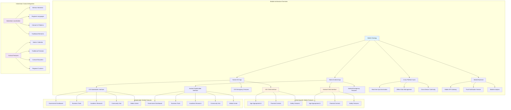
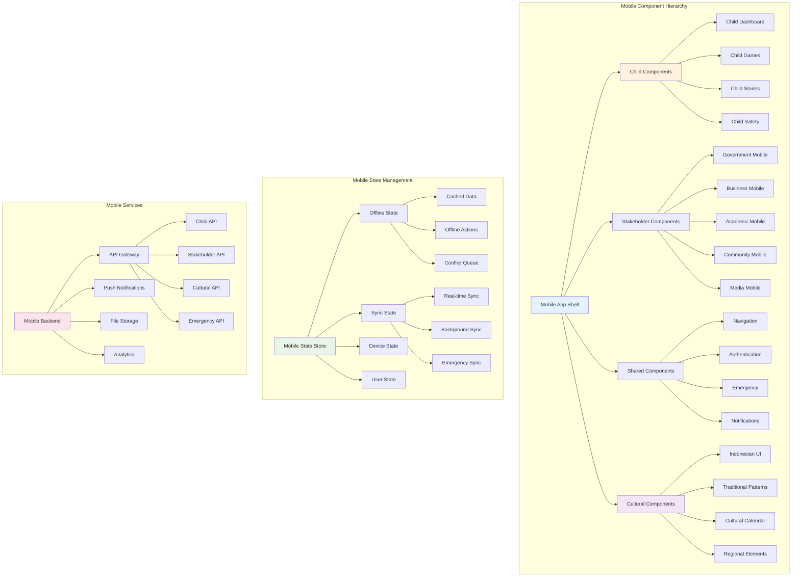
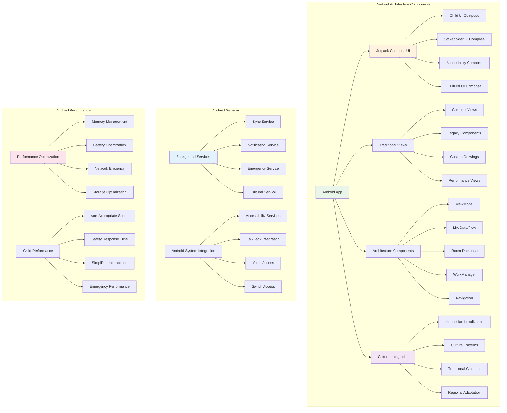
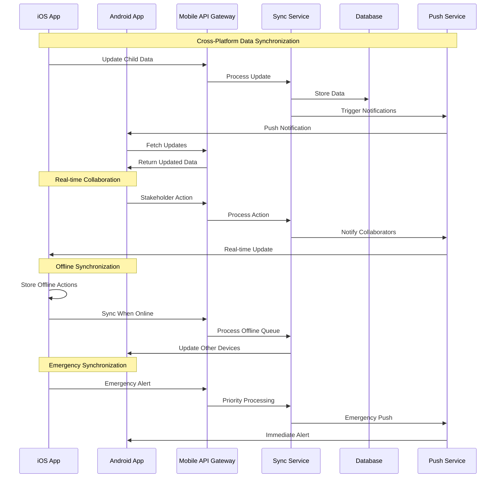
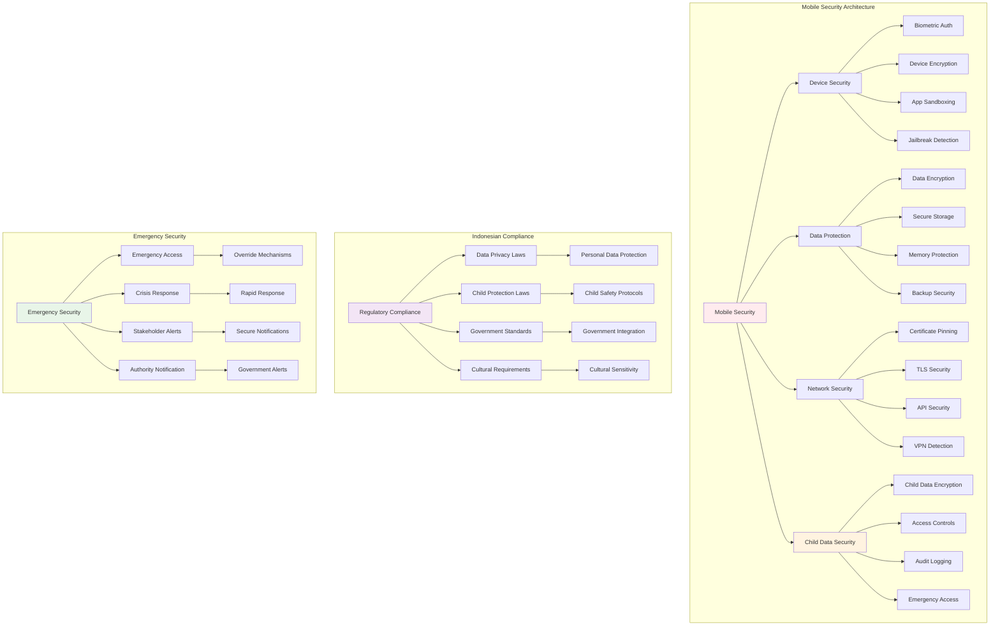

# Mobile Architecture Documentation
## MerajutASA Platform - Comprehensive Mobile Strategy

> **Mobile Architecture Mission**: "Creating a seamless, secure, and culturally-adaptive mobile experience that empowers all stakeholders to engage with child welfare initiatives through native iOS and Android applications while maintaining the highest standards of child protection, accessibility excellence, and Indonesian cultural integration across all mobile interactions."

---

## 📱 Mobile Architecture Philosophy

### Mobile-First Child Welfare Design
Every mobile architecture decision prioritizes child safety, stakeholder collaboration, and cultural sensitivity:

```yaml
Mobile Principles:
  Child-Centric Design: Mobile interfaces optimized for child safety and engagement
  Stakeholder Mobility: Full-featured mobile access for all stakeholder types
  Offline-First: Essential features available without internet connectivity
  Cultural Adaptation: Indonesian mobile usage patterns and preferences
  Security-by-Design: Mobile-specific security and privacy protections
  
Mobile Standards:
  Native Performance: Platform-optimized user experiences
  Cross-Platform Consistency: Unified experience across iOS and Android
  Accessibility Excellence: Mobile accessibility beyond platform standards
  Emergency Readiness: Instant emergency response capabilities
  Indonesian Compliance: Mobile regulatory compliance and cultural norms
```

### Academic Research Foundation
Mobile architecture based on mobile UX research and child interaction studies:

```yaml
Research Foundation:
  Mobile UX Principles: Google Material Design and Apple Human Interface Guidelines
  Child Mobile Interaction: Age-appropriate mobile interaction research
  Indonesian Mobile Usage: Local mobile behavior and preference studies
  Accessibility Standards: Mobile accessibility best practices and standards
  Security Research: Mobile security frameworks and child protection protocols
  
Mobile Research Data:
  Indonesian Mobile Penetration: 89.7% smartphone adoption rate
  Child Mobile Usage: 67% of Indonesian children use mobile devices
  Stakeholder Mobile Preference: 78% prefer mobile for daily tasks
  Rural Mobile Access: 82% mobile-only internet access in rural areas
  Mobile Emergency Usage: 94% trust mobile for emergency situations
```

---

## 🏗️ Mobile Architecture Overview

### Multi-Platform Mobile Strategy



#### Core Mobile Architecture
```typescript
// Comprehensive Mobile Architecture
interface MerajutMobileArchitecture {
  // Platform-specific implementations
  platforms: {
    ios: {
      architecture: iOSArchitectureStrategy;
      framework: 'Swift UI + UIKit';
      deployment: iOSDeploymentStrategy;
      accessibility: iOSAccessibilityStrategy;
      culturalAdaptation: iOSCulturalStrategy;
    };
    
    android: {
      architecture: AndroidArchitectureStrategy;
      framework: 'Jetpack Compose + Views';
      deployment: AndroidDeploymentStrategy;
      accessibility: AndroidAccessibilityStrategy;
      culturalAdaptation: AndroidCulturalStrategy;
    };
    
    crossPlatform: {
      sharedLogic: SharedMobileLogic;
      dataSync: CrossPlatformDataSync;
      analytics: UnifiedMobileAnalytics;
      performance: CrossPlatformPerformance;
    };
  };
  
  // Child-specific mobile features
  childMobileFeatures: {
    ageAppropriateUI: AgeBasedMobileUI;
    safetyControls: MobileSafetyControls;
    parentalIntegration: ParentalControlMobile;
    emergencyFeatures: MobileEmergencyFeatures;
    educationalContent: MobileEducationalContent;
  };
  
  // Stakeholder mobile optimization
  stakeholderMobile: {
    government: GovernmentMobileFeatures;
    business: BusinessMobileFeatures;
    academia: AcademicMobileFeatures;
    community: CommunityMobileFeatures;
    media: MediaMobileFeatures;
  };
  
  // Indonesian mobile optimization
  indonesianMobile: {
    localization: IndonesianMobileLocalization;
    culturalPatterns: MobileCulturalPatterns;
    networkOptimization: IndonesianNetworkOptimization;
    paymentIntegration: IndonesianMobilePayments;
    governmentIntegration: IndonesianGovMobileIntegration;
  };
  
  // Mobile security architecture
  mobileSecurity: {
    deviceSecurity: MobileDeviceSecurity;
    dataProtection: MobileDataProtection;
    childDataSecurity: ChildDataMobileSecurity;
    biometricAuthentication: MobileBiometricAuth;
    emergencySecurity: EmergencyMobileSecurity;
  };
  
  // Offline capabilities
  offlineArchitecture: {
    dataSync: OfflineDataSynchronization;
    conflictResolution: OfflineConflictResolution;
    emergencyOffline: OfflineEmergencyCapabilities;
    culturalContentOffline: OfflineCulturalContent;
    stakeholderOffline: OfflineStakeholderFeatures;
  };
}

// Mobile UI Architecture Configuration
interface MobileUIArchitecture {
  designSystem: {
    childInterface: {
      colorPalette: ChildFriendlyMobileColors;
      typography: ChildMobileTypography;
      spacing: ChildMobileSpacing;
      animations: ChildSafeMobileAnimations;
      interactions: ChildMobileInteractions;
    };
    
    stakeholderInterface: {
      adaptiveDesign: StakeholderAdaptiveMobileDesign;
      professionalUI: ProfessionalMobileInterface;
      collaborationUI: MobileCollaborationInterface;
      analyticsUI: MobileAnalyticsInterface;
      reportingUI: MobileReportingInterface;
    };
    
    culturalInterface: {
      indonesianPatterns: IndonesianMobilePatterns;
      traditionalElements: MobileTraditionalElements;
      culturalNavigation: CulturalMobileNavigation;
      regionalAdaptation: RegionalMobileAdaptation;
      festivalIntegration: MobileFestivalIntegration;
    };
  };
  
  navigationArchitecture: {
    childNavigation: {
      simplifiedStructure: 'linear-intuitive-navigation';
      visualBreadcrumbs: 'picture-based-navigation-aids';
      safetyEscapes: 'always-visible-safe-exit-options';
      parentalOverride: 'parental-navigation-control';
    };
    
    stakeholderNavigation: {
      roleBasedMenus: 'stakeholder-specific-navigation';
      quickActions: 'context-aware-shortcuts';
      collaboration: 'multi-stakeholder-navigation';
      emergency: 'emergency-escalation-paths';
    };
    
    culturalNavigation: {
      languageSwitching: 'seamless-language-transitions';
      culturalMetaphors: 'indonesian-navigation-metaphors';
      traditionalPatterns: 'cultural-navigation-patterns';
      regionalCustomization: 'regional-navigation-preferences';
    };
  };
}
```

#### Mobile Component Architecture



---

## 🍎 iOS Architecture Implementation

### Native iOS Development Strategy

#### iOS Architecture Components
```typescript
// iOS-Specific Architecture
class iOSMobileArchitecture {
  private swiftUIManager: SwiftUIManager;
  private uikitBridge: UIKitBridge;
  private accessibilityManager: iOSAccessibilityManager;
  private culturalAdapter: iOSCulturalAdapter;
  
  constructor() {
    this.swiftUIManager = new SwiftUIManager();
    this.uikitBridge = new UIKitBridge();
    this.accessibilityManager = new iOSAccessibilityManager();
    this.culturalAdapter = new iOSCulturalAdapter();
  }
  
  async implementiOSArchitecture(): Promise<iOSArchitectureImplementation> {
    return {
      // SwiftUI + UIKit hybrid architecture
      uiFramework: {
        swiftUI: {
          components: [
            'ChildDashboardView',
            'StakeholderHomeView',
            'CulturalElementsView',
            'EmergencyActionView',
            'AccessibilityControlsView'
          ],
          
          features: {
            declarativeUI: 'SwiftUI declarative syntax for rapid development',
            stateManagement: '@StateObject and @ObservableObject patterns',
            animations: 'SwiftUI native animation system',
            accessibility: 'Built-in VoiceOver and accessibility support',
            culturalAdaptation: 'Dynamic Indonesian localization'
          },
          
          childOptimization: {
            ageBasedViews: 'Age-appropriate SwiftUI view modifiers',
            safetyControls: 'Child-safety embedded in SwiftUI components',
            parentalControls: 'Parental override SwiftUI integration',
            emergencyAccess: 'Emergency SwiftUI alert systems'
          }
        },
        
        uiKit: {
          components: [
            'AdvancedDataVisualization',
            'ComplexTableViews',
            'CustomCameraInterface',
            'MediaPlaybackControls',
            'AccessibilityCustomControls'
          ],
          
          features: {
            performanceOptimized: 'UIKit for performance-critical components',
            customDrawing: 'Core Graphics integration for cultural patterns',
            advancedGestures: 'UIGestureRecognizer for complex interactions',
            legacySupport: 'iOS version compatibility bridge',
            accessibilityCustomization: 'Advanced accessibility customization'
          },
          
          culturalIntegration: {
            traditionalPatterns: 'Core Graphics rendering of batik patterns',
            calendarIntegration: 'Custom Islamic calendar UI components',
            textRendering: 'Indonesian text rendering optimization',
            culturalAnimations: 'Traditional Indonesian motion patterns'
          }
        },
        
        bridging: {
          swiftUIUIKitBridge: 'UIViewRepresentable for UIKit in SwiftUI',
          uikitSwiftUIBridge: 'UIHostingController for SwiftUI in UIKit',
          dataFlow: 'Unified data flow between frameworks',
          stateSync: 'Synchronized state management across frameworks'
        }
      },
      
      // iOS-specific features
      iOSFeatures: {
        voiceOverOptimization: {
          customRotor: 'Custom VoiceOver rotor controls for stakeholder navigation',
          gestureCustomization: 'Indonesian-friendly VoiceOver gestures',
          childVoiceOver: 'Child-appropriate VoiceOver announcements',
          emergencyVoiceOver: 'Emergency VoiceOver priority announcements'
        },
        
        shortcutsIntegration: {
          siriShortcuts: 'Siri shortcuts for emergency access and daily tasks',
          widgetSupport: 'iOS widgets for quick stakeholder information',
          intentExtensions: 'Custom intents for child safety and stakeholder actions',
          spotlightSearch: 'Spotlight integration for content discovery'
        },
        
        backgroundProcessing: {
          backgroundAppRefresh: 'Stakeholder data synchronization',
          pushNotifications: 'Emergency alerts and collaboration updates',
          backgroundTasks: 'Offline data processing and cultural content updates',
          silentPushUpdates: 'Real-time collaboration synchronization'
        },
        
        securityIntegration: {
          faceIDTouchID: 'Biometric authentication for child data access',
          keychainServices: 'Secure credential and child data storage',
          appTransportSecurity: 'Enhanced network security for sensitive data',
          dataProtection: 'iOS data protection for child information'
        }
      },
      
      // iOS accessibility excellence
      iOSAccessibility: {
        voiceOverSupport: {
          customActions: 'VoiceOver custom actions for complex interactions',
          rotor: 'Custom rotor controls for efficient navigation',
          hints: 'Contextual VoiceOver hints for child and stakeholder guidance',
          announcements: 'Priority announcements for emergency situations'
        },
        
        dynamicType: {
          textScaling: 'Full Dynamic Type support for all text elements',
          customFonts: 'Indonesian font scaling optimization',
          layoutAdaptation: 'Responsive layout for text size changes',
          childTextSizing: 'Age-appropriate text sizing for children'
        },
        
        motorAccessibility: {
          switchControl: 'iOS Switch Control optimization',
          assistiveTouch: 'AssistiveTouch integration',
          voiceControl: 'iOS Voice Control commands',
          customGestures: 'Alternative gesture support'
        },
        
        visualAccessibility: {
          highContrast: 'iOS High Contrast mode support',
          reducedMotion: 'Respect for Reduce Motion preferences',
          colorFilters: 'Color filter accommodation',
          smartInvert: 'Smart Invert color support'
        }
      },
      
      // iOS cultural adaptation
      iOSCulturalFeatures: {
        localizationSupport: {
          rightToLeft: 'RTL layout support for Arabic text in Islamic content',
          dateFormatting: 'Islamic calendar integration with iOS Calendar',
          numberFormatting: 'Indonesian number and currency formatting',
          textInput: 'Indonesian keyboard and input method optimization'
        },
        
        culturalUI: {
          hapticFeedback: 'Culturally-appropriate haptic patterns',
          soundDesign: 'Indonesian traditional sound integration',
          visualElements: 'iOS-optimized batik and traditional patterns',
          navigationPatterns: 'Indonesian-familiar navigation metaphors'
        }
      }
    };
  }
}

// iOS Performance Optimization
class iOSPerformanceOptimizer {
  async optimizeiOSPerformance(): Promise<iOSPerformanceOptimization> {
    return {
      // SwiftUI performance optimization
      swiftUIOptimization: {
        viewOptimization: {
          lazyLoading: 'LazyVStack and LazyHStack for large datasets',
          viewModifiers: 'Efficient view modifier chaining',
          stateManagement: 'Optimized @State and @Binding usage',
          identifiableData: 'Proper Identifiable implementation for lists'
        },
        
        animationOptimization: {
          nativeAnimations: 'SwiftUI native animation system usage',
          performanceAnimations: 'GPU-accelerated animation preferences',
          childFriendlyAnimations: 'Smooth animations for child interfaces',
          culturalAnimations: 'Traditional Indonesian motion patterns'
        },
        
        memoryOptimization: {
          imageOptimization: 'Async image loading and caching',
          dataBinding: 'Efficient data binding patterns',
          viewLifecycle: 'Proper view lifecycle management',
          weakReferences: 'Memory leak prevention strategies'
        }
      },
      
      // UIKit performance optimization
      uikitOptimization: {
        tableViewOptimization: {
          cellReuse: 'Advanced UITableViewCell reuse patterns',
          prefetching: 'UITableViewDataSourcePrefetching implementation',
          heightCalculation: 'Efficient cell height calculation caching',
          asyncLoading: 'Asynchronous content loading for cells'
        },
        
        drawingOptimization: {
          coreGraphics: 'Optimized Core Graphics drawing for cultural patterns',
          metalIntegration: 'Metal framework for complex visual effects',
          imageProcessing: 'Efficient image processing for user content',
          caching: 'Drawing result caching for repeated elements'
        },
        
        navigationOptimization: {
          viewControllerLifecycle: 'Optimized view controller management',
          memoryManagement: 'Proper view controller memory cleanup',
          transitionAnimations: 'Smooth navigation transitions',
          backgroundPreparation: 'Background view preparation'
        }
      },
      
      // iOS-specific optimizations
      iOSSpecificOptimizations: {
        backgroundOptimization: {
          backgroundAppRefresh: 'Efficient background refresh implementation',
          backgroundTasks: 'Background task management',
          pushNotifications: 'Optimized push notification handling',
          dataSync: 'Background data synchronization'
        },
        
        batteryOptimization: {
          networkRequests: 'Batched network request optimization',
          locationServices: 'Efficient location service usage',
          backgroundProcessing: 'Battery-conscious background processing',
          displayOptimization: 'Display brightness and refresh rate optimization'
        },
        
        storageOptimization: {
          coreData: 'Core Data performance optimization',
          fileSystem: 'Efficient file system usage',
          caching: 'Intelligent caching strategies',
          dataCompression: 'Data compression for storage efficiency'
        }
      }
    };
  }
}
```

---

## 🤖 Android Architecture Implementation

### Native Android Development Strategy

#### Android Architecture Components



```typescript
// Android-Specific Architecture
class AndroidMobileArchitecture {
  private composeManager: JetpackComposeManager;
  private viewSystemBridge: AndroidViewBridge;
  private accessibilityManager: AndroidAccessibilityManager;
  private culturalAdapter: AndroidCulturalAdapter;
  
  constructor() {
    this.composeManager = new JetpackComposeManager();
    this.viewSystemBridge = new AndroidViewBridge();
    this.accessibilityManager = new AndroidAccessibilityManager();
    this.culturalAdapter = new AndroidCulturalAdapter();
  }
  
  async implementAndroidArchitecture(): Promise<AndroidArchitectureImplementation> {
    return {
      // Jetpack Compose + Views hybrid architecture
      uiFramework: {
        jetpackCompose: {
          components: [
            'ChildDashboardComposable',
            'StakeholderHomeComposable',
            'CulturalElementsComposable',
            'EmergencyActionComposable',
            'AccessibilityControlsComposable'
          ],
          
          features: {
            declarativeUI: 'Compose declarative UI for rapid development',
            stateManagement: 'Compose State and MutableState patterns',
            animations: 'Compose Animation API for smooth interactions',
            theming: 'Material Design 3 with Indonesian customizations',
            accessibility: 'Built-in TalkBack and accessibility support'
          },
          
          childOptimization: {
            ageBasedComposables: 'Age-appropriate Compose functions',
            safetyControls: 'Child-safety embedded in Composables',
            parentalControls: 'Parental override Compose integration',
            emergencyAccess: 'Emergency Compose alert systems'
          },
          
          culturalIntegration: {
            indonesianTheming: 'Indonesian Material Design adaptations',
            traditionalPatterns: 'Compose Canvas for batik pattern rendering',
            culturalAnimations: 'Traditional Indonesian motion in Compose',
            rtlSupport: 'Right-to-left layout support for Arabic text'
          }
        },
        
        traditionalViews: {
          components: [
            'AdvancedRecyclerViews',
            'CustomCameraViews',
            'ComplexDataVisualization',
            'MediaPlaybackViews',
            'AccessibilityCustomViews'
          ],
          
          features: {
            performanceOptimized: 'Views for performance-critical components',
            customDrawing: 'Canvas API for cultural pattern rendering',
            advancedGestures: 'GestureDetector for complex interactions',
            legacySupport: 'Android version compatibility support',
            accessibilityServices: 'Advanced accessibility service integration'
          },
          
          optimization: {
            recyclerViewOptimization: 'DiffUtil and ViewHolder optimization',
            customViewOptimization: 'Efficient onDraw implementations',
            memoryManagement: 'View recycling and memory optimization',
            backgroundProcessing: 'Background thread view preparation'
          }
        },
        
        interoperability: {
          composeInViews: 'ComposeView for Compose in traditional Views',
          viewsInCompose: 'AndroidView for Views in Compose',
          dataFlow: 'Unified data flow between UI systems',
          stateSync: 'Synchronized state management across frameworks'
        }
      },
      
      // Android Architecture Components
      architectureComponents: {
        viewModel: {
          childViewModels: 'Age-appropriate ViewModel implementations',
          stakeholderViewModels: 'Role-specific ViewModel patterns',
          culturalViewModels: 'Indonesian localization ViewModels',
          emergencyViewModels: 'Emergency response ViewModel patterns'
        },
        
        liveDataFlow: {
          realtimeUpdates: 'LiveData for real-time collaboration updates',
          offlineFlow: 'Flow for offline data management',
          childDataFlow: 'Secure child data observation patterns',
          culturalFlow: 'Cultural content update streams'
        },
        
        roomDatabase: {
          childDataEncryption: 'Encrypted Room database for child information',
          offlineStorage: 'Room for offline stakeholder data',
          culturalContent: 'Room for Indonesian cultural content storage',
          emergencyCache: 'Emergency information local caching'
        },
        
        workManager: {
          backgroundSync: 'WorkManager for data synchronization',
          contentUpdates: 'Cultural content background updates',
          notifications: 'Scheduled notification delivery',
          emergencyTasks: 'Emergency response background tasks'
        },
        
        navigation: {
          childNavigation: 'Safe navigation for child interfaces',
          stakeholderNavigation: 'Role-based navigation patterns',
          culturalNavigation: 'Indonesian navigation metaphors',
          emergencyNavigation: 'Emergency escalation navigation'
        }
      },
      
      // Android-specific features
      androidFeatures: {
        accessibilityServices: {
          talkBackOptimization: 'TalkBack custom gesture and announcement support',
          voiceAccess: 'Voice Access command optimization',
          switchAccess: 'Switch Access navigation optimization',
          selectToSpeak: 'Select to Speak integration'
        },
        
        systemIntegration: {
          shortcuts: 'Android App Shortcuts for quick access',
          widgets: 'Home screen widgets for stakeholder information',
          notifications: 'Rich notification support with actions',
          intentFilters: 'Custom intent handling for external integration'
        },
        
        backgroundProcessing: {
          foregroundServices: 'Emergency monitoring foreground services',
          jobScheduler: 'Efficient background task scheduling',
          broadcastReceivers: 'System event integration',
          contentProviders: 'Secure data sharing with other apps'
        },
        
        securityIntegration: {
          biometricPrompt: 'Fingerprint and face authentication',
          keyStore: 'Android Keystore for secure key management',
          encryptedSharedPreferences: 'Encrypted preference storage',
          networkSecurity: 'Network security configuration'
        }
      },
      
      // Android accessibility excellence
      androidAccessibility: {
        talkBackSupport: {
          customActions: 'TalkBack custom actions for complex interactions',
          gestureNavigation: 'Indonesian-friendly TalkBack gestures',
          announcements: 'Priority announcements for emergency situations',
          contentDescriptions: 'Comprehensive content descriptions'
        },
        
        voiceAccessSupport: {
          voiceCommands: 'Custom voice commands for stakeholder actions',
          indonesianCommands: 'Indonesian voice command recognition',
          childCommands: 'Age-appropriate voice commands',
          emergencyCommands: 'Emergency voice activation'
        },
        
        switchAccessSupport: {
          switchNavigation: 'Optimized switch navigation patterns',
          customScanTiming: 'Adjustable scan timing for different abilities',
          groupingStrategy: 'Logical switch navigation grouping',
          emergencySwitch: 'Emergency switch access shortcuts'
        },
        
        visualAccessibility: {
          highContrast: 'High contrast theme support',
          colorCorrection: 'Color vision deficiency accommodation',
          fontScaling: 'Dynamic font scaling support',
          reducedAnimations: 'Reduced animation support'
        }
      },
      
      // Android cultural adaptation
      androidCulturalFeatures: {
        localizationSupport: {
          multiLanguage: 'Indonesian, Javanese, and English support',
          dateFormatting: 'Islamic and traditional calendar integration',
          numberFormatting: 'Indonesian number formatting',
          textRendering: 'Indonesian text rendering optimization'
        },
        
        culturalUI: {
          materialDesign: 'Indonesian Material Design adaptations',
          traditionalPatterns: 'Batik and traditional pattern integration',
          culturalColors: 'Indonesian cultural color meanings',
          hapticPatterns: 'Culturally-appropriate haptic feedback'
        },
        
        regionalAdaptation: {
          regionalContent: 'Regional Indonesian content adaptation',
          localCustoms: 'Local custom integration',
          traditionalCalendars: 'Traditional calendar system support',
          festivalIntegration: 'Indonesian festival and holiday integration'
        }
      }
    };
  }
}

// Android Performance Optimization
class AndroidPerformanceOptimizer {
  async optimizeAndroidPerformance(): Promise<AndroidPerformanceOptimization> {
    return {
      // Jetpack Compose performance optimization
      composeOptimization: {
        recomposition: {
          stableClasses: 'Stable and immutable class design',
          derivedState: 'Efficient derived state calculations',
          keyedComposition: 'Proper key usage for list compositions',
          skippableComposables: 'Skippable Composable design patterns'
        },
        
        lazyLoading: {
          lazyColumn: 'LazyColumn optimization for large datasets',
          lazyGrid: 'LazyVerticalGrid for grid layouts',
          contentPadding: 'Efficient content padding for lazy layouts',
          itemAnimations: 'Smooth item animations in lazy layouts'
        },
        
        memoryOptimization: {
          imageLoading: 'Efficient image loading with Coil',
          compositionLocal: 'Efficient CompositionLocal usage',
          sideEffects: 'Proper side effect management',
          disposableEffects: 'Resource cleanup in Compose'
        }
      },
      
      // Traditional View performance optimization
      viewOptimization: {
        recyclerView: {
          viewHolders: 'Efficient ViewHolder pattern implementation',
          diffUtil: 'DiffUtil for efficient list updates',
          prefetching: 'RecyclerView prefetching optimization',
          itemDecorations: 'Efficient ItemDecoration implementation'
        },
        
        customViews: {
          onDrawOptimization: 'Efficient onDraw method implementation',
          measurementCaching: 'View measurement result caching',
          clipBounds: 'Proper clipping for performance',
          layerOptimization: 'Hardware layer usage optimization'
        },
        
        layoutOptimization: {
          constraintLayout: 'ConstraintLayout for flat hierarchies',
          viewStubUsage: 'ViewStub for conditional view inflation',
          mergeLayouts: 'Layout merge for hierarchy reduction',
          includeOptimization: 'Efficient layout include usage'
        }
      },
      
      // Android-specific optimizations
      androidSpecificOptimizations: {
        backgroundOptimization: {
          workManager: 'WorkManager for background task optimization',
          jobScheduler: 'Efficient JobScheduler usage',
          dozeOptimization: 'Android Doze mode compatibility',
          backgroundLimits: 'Background execution limit compliance'
        },
        
        batteryOptimization: {
          wakeOptimization: 'WakeLock usage optimization',
          networkBatching: 'Network request batching',
          locationOptimization: 'Battery-efficient location services',
          sensorOptimization: 'Sensor usage optimization'
        },
        
        memoryOptimization: {
          bitmapOptimization: 'Bitmap memory usage optimization',
          leakPrevention: 'Memory leak prevention strategies',
          garbageCollection: 'GC-friendly coding patterns',
          profilerIntegration: 'Android Profiler integration'
        },
        
        storageOptimization: {
          roomOptimization: 'Room database query optimization',
          sharedPreferences: 'SharedPreferences usage optimization',
          fileAccess: 'Efficient file system access',
          cacheManagement: 'Intelligent cache management'
        }
      }
    };
  }
}
```

---

## 🔄 Cross-Platform Synchronization

### Mobile Data Synchronization Strategy



#### Cross-Platform Synchronization Implementation
```typescript
// Cross-Platform Mobile Synchronization
class MobileSynchronizationManager {
  private iOSSync: iOSSynchronizationService;
  private androidSync: AndroidSynchronizationService;
  private conflictResolver: MobileConflictResolver;
  private emergencySync: EmergencyMobileSyncService;
  
  constructor() {
    this.iOSSync = new iOSSynchronizationService();
    this.androidSync = new AndroidSynchronizationService();
    this.conflictResolver = new MobileConflictResolver();
    this.emergencySync = new EmergencyMobileSyncService();
  }
  
  async implementCrossPlatformSync(): Promise<CrossPlatformSyncImplementation> {
    return {
      // Real-time synchronization
      realtimeSync: {
        webSocketConnection: {
          connection: 'persistent-websocket-connection',
          fallback: 'polling-based-fallback',
          reconnection: 'automatic-reconnection-strategy',
          childDataSecurity: 'end-to-end-encrypted-websocket'
        },
        
        dataSync: {
          childData: 'immediate-sync-priority',
          stakeholderData: 'collaborative-sync-strategy',
          culturalContent: 'batch-sync-optimization',
          emergencyData: 'instant-priority-sync'
        },
        
        conflictResolution: {
          childSafety: 'child-safety-priority-resolution',
          stakeholderConsensus: 'stakeholder-voting-resolution',
          temporalPrecedence: 'timestamp-based-resolution',
          emergencyOverride: 'emergency-automatic-resolution'
        }
      },
      
      // Offline synchronization
      offlineSync: {
        offlineStorage: {
          iOSStorage: 'Core Data + SQLite for offline data',
          androidStorage: 'Room + SQLite for offline data',
          encryption: 'offline-data-encryption',
          compression: 'offline-data-compression'
        },
        
        offlineActions: {
          actionQueue: 'offline-action-queueing-system',
          conflictDetection: 'offline-conflict-prediction',
          prioritization: 'child-safety-action-priority',
          batchProcessing: 'efficient-batch-sync-processing'
        },
        
        syncStrategies: {
          incrementalSync: 'delta-sync-for-efficiency',
          fullSync: 'periodic-full-synchronization',
          emergencySync: 'immediate-emergency-sync',
          backgroundSync: 'background-sync-optimization'
        }
      },
      
      // Platform-specific optimizations
      platformOptimizations: {
        iOSOptimizations: {
          backgroundAppRefresh: 'iOS background sync optimization',
          pushNotifications: 'iOS push notification integration',
          siriShortcuts: 'Siri shortcuts for sync actions',
          widgetSync: 'iOS widget data synchronization'
        },
        
        androidOptimizations: {
          workManager: 'Android WorkManager sync scheduling',
          firebaseMessaging: 'FCM push notification integration',
          shortcuts: 'Android shortcuts for sync actions',
          widgetSync: 'Android widget data synchronization'
        },
        
        crossPlatformConsistency: {
          dataFormat: 'unified-cross-platform-data-format',
          apiInterface: 'consistent-api-interface',
          errorHandling: 'unified-error-handling-strategy',
          analytics: 'cross-platform-analytics-tracking'
        }
      },
      
      // Emergency synchronization
      emergencySync: {
        prioritySync: {
          childSafety: 'immediate-child-safety-sync',
          emergencyAlerts: 'instant-emergency-alert-propagation',
          stakeholderNotification: 'emergency-stakeholder-notification',
          authorityEscalation: 'automatic-authority-notification'
        },
        
        reliabilityMeasures: {
          multiChannelSync: 'multiple-sync-channel-redundancy',
          fallbackMechanisms: 'emergency-sync-fallback-options',
          retryStrategies: 'intelligent-emergency-retry-logic',
          offlineEmergency: 'offline-emergency-handling'
        }
      }
    };
  }
  
  async handleMobileDataConflict(
    conflict: MobileDataConflict,
    platformOrigin: 'iOS' | 'Android',
    userContext: MobileUserContext
  ): Promise<ConflictResolutionResult> {
    // Analyze conflict type and priority
    const conflictAnalysis = await this.analyzeConflict(conflict, userContext);
    
    // Apply resolution strategy based on conflict type
    let resolutionStrategy: ConflictResolutionStrategy;
    
    if (conflictAnalysis.involvesChildData) {
      resolutionStrategy = 'child-safety-priority';
    } else if (conflictAnalysis.isEmergency) {
      resolutionStrategy = 'emergency-override';
    } else if (conflictAnalysis.requiresStakeholderConsensus) {
      resolutionStrategy = 'stakeholder-consensus';
    } else {
      resolutionStrategy = 'temporal-precedence';
    }
    
    // Resolve conflict using chosen strategy
    const resolution = await this.conflictResolver.resolveConflict(
      conflict,
      resolutionStrategy,
      userContext
    );
    
    // Propagate resolution to all platforms
    await this.propagateResolution(resolution, platformOrigin);
    
    // Log conflict and resolution for audit
    await this.logConflictResolution(conflict, resolution, userContext);
    
    return {
      success: resolution.success,
      resolvedData: resolution.resolvedData,
      strategy: resolutionStrategy,
      propagated: true,
      auditLogged: true,
      platformOrigin,
      timestamp: new Date()
    };
  }
}
```

---

## 🔒 Mobile Security Architecture

### Child Data Protection on Mobile

#### Mobile Security Implementation



```typescript
// Mobile Security Architecture
class MobileSecurityArchitecture {
  private deviceSecurity: MobileDeviceSecurityManager;
  private dataProtection: MobileDataProtectionManager;
  private childDataSecurity: ChildDataMobileSecurityManager;
  private indonesianCompliance: IndonesianMobileComplianceManager;
  
  constructor() {
    this.deviceSecurity = new MobileDeviceSecurityManager();
    this.dataProtection = new MobileDataProtectionManager();
    this.childDataSecurity = new ChildDataMobileSecurityManager();
    this.indonesianCompliance = new IndonesianMobileComplianceManager();
  }
  
  async implementMobileSecurity(): Promise<MobileSecurityImplementation> {
    return {
      // Device-level security
      deviceSecurity: {
        authentication: {
          biometricAuth: {
            iOS: 'Face ID and Touch ID integration',
            android: 'Fingerprint and Face authentication',
            fallback: 'PIN and password backup authentication',
            childAdaptation: 'age-appropriate authentication methods'
          },
          
          multiFactorAuth: {
            biometric: 'primary-biometric-authentication',
            pin: 'backup-pin-authentication',
            pattern: 'android-pattern-authentication',
            emergency: 'emergency-override-authentication'
          },
          
          sessionManagement: {
            timeout: 'automatic-session-timeout',
            background: 'background-app-locking',
            inactivity: 'inactivity-based-locking',
            emergency: 'emergency-session-extension'
          }
        },
        
        deviceIntegrity: {
          jailbreakDetection: {
            iOS: 'jailbreak-detection-and-prevention',
            android: 'root-detection-and-prevention',
            response: 'security-degradation-response',
            childProtection: 'enhanced-child-data-protection'
          },
          
          appSandboxing: {
            iOS: 'iOS-app-sandbox-utilization',
            android: 'Android-app-sandbox-enforcement',
            dataIsolation: 'app-data-isolation',
            processIsolation: 'process-level-isolation'
          },
          
          secureElements: {
            iOS: 'Secure Enclave utilization',
            android: 'Hardware Security Module usage',
            keyStorage: 'secure-key-storage',
            cryptoOperations: 'hardware-crypto-operations'
          }
        }
      },
      
      // Data protection
      dataProtection: {
        encryption: {
          dataAtRest: {
            algorithm: 'AES-256-GCM',
            keyManagement: 'platform-keystore-integration',
            childData: 'enhanced-child-data-encryption',
            culturalData: 'cultural-content-encryption'
          },
          
          dataInTransit: {
            protocol: 'TLS 1.3 with certificate pinning',
            endToEnd: 'end-to-end-encryption-for-sensitive-data',
            childData: 'child-data-transport-encryption',
            emergencyData: 'emergency-data-secure-transport'
          },
          
          dataInMemory: {
            protection: 'memory-protection-techniques',
            clearance: 'secure-memory-clearance',
            childData: 'child-data-memory-protection',
            debugging: 'debug-protection-measures'
          }
        },
        
        secureStorage: {
          localStorage: {
            iOS: 'iOS-Keychain-Services-integration',
            android: 'Android-Keystore-integration',
            backup: 'secure-backup-exclusion',
            childData: 'child-data-secure-storage'
          },
          
          databaseSecurity: {
            encryption: 'database-level-encryption',
            accessControl: 'database-access-control',
            childData: 'child-data-database-protection',
            auditLogging: 'database-audit-logging'
          },
          
          fileSystem: {
            protection: 'file-system-level-protection',
            permissions: 'restrictive-file-permissions',
            childFiles: 'child-file-protection',
            temporaryFiles: 'secure-temporary-file-handling'
          }
        }
      },
      
      // Network security
      networkSecurity: {
        certificatePinning: {
          implementation: 'certificate-and-public-key-pinning',
          backup: 'backup-certificate-handling',
          updates: 'secure-certificate-update-mechanism',
          childData: 'child-data-certificate-requirements'
        },
        
        apiSecurity: {
          authentication: 'OAuth-2.0-with-PKCE',
          authorization: 'role-based-API-access-control',
          rateLimit: 'API-rate-limiting',
          childAPI: 'child-data-API-security'
        },
        
        vpnDetection: {
          detection: 'VPN-and-proxy-detection',
          policy: 'VPN-usage-policy-enforcement',
          childProtection: 'child-VPN-protection-measures',
          emergency: 'emergency-VPN-override'
        }
      },
      
      // Child-specific security
      childDataSecurity: {
        accessControl: {
          ageBasedAccess: 'age-appropriate-access-controls',
          parentalConsent: 'parental-consent-verification',
          timeBasedAccess: 'time-based-access-restrictions',
          emergencyAccess: 'emergency-access-protocols'
        },
        
        dataMinimization: {
          collection: 'minimal-child-data-collection',
          retention: 'age-appropriate-data-retention',
          processing: 'limited-child-data-processing',
          sharing: 'restricted-child-data-sharing'
        },
        
        auditLogging: {
          childDataAccess: 'comprehensive-child-data-access-logging',
          parentalActions: 'parental-action-audit-trail',
          emergencyAccess: 'emergency-access-audit-logging',
          complianceReporting: 'regulatory-compliance-reporting'
        }
      },
      
      // Indonesian compliance security
      indonesianCompliance: {
        dataPrivacyLaws: {
          personalDataProtection: 'Indonesian-personal-data-protection-compliance',
          childDataProtection: 'Indonesian-child-data-protection-compliance',
          crossBorderTransfer: 'data-localization-compliance',
          governmentAccess: 'government-data-access-protocols'
        },
        
        childProtectionLaws: {
          ageVerification: 'Indonesian-age-verification-requirements',
          parentalConsent: 'Indonesian-parental-consent-standards',
          contentFiltering: 'Indonesian-content-filtering-requirements',
          reportingObligations: 'mandatory-reporting-compliance'
        },
        
        culturalSensitivity: {
          religiousConsiderations: 'Islamic-data-handling-requirements',
          culturalValues: 'Indonesian-cultural-value-compliance',
          traditionalRights: 'traditional-community-data-rights',
          languageRequirements: 'Indonesian-language-data-requirements'
        }
      },
      
      // Emergency security protocols
      emergencySecurity: {
        emergencyAccess: {
          overrideMechanisms: 'emergency-security-override-protocols',
          authenticationBypass: 'emergency-authentication-bypass',
          dataAccess: 'emergency-child-data-access',
          auditTrail: 'emergency-action-audit-trail'
        },
        
        crisisResponse: {
          automaticAlerts: 'automatic-crisis-alert-generation',
          stakeholderNotification: 'emergency-stakeholder-notification',
          authorityEscalation: 'automatic-authority-escalation',
          dataPreservation: 'emergency-data-preservation'
        },
        
        securityDegradation: {
          gracefulDegradation: 'graceful-security-degradation',
          essentialFunctions: 'essential-function-preservation',
          childSafety: 'child-safety-priority-maintenance',
          recoveryProcedures: 'security-recovery-procedures'
        }
      }
    };
  }
}
```

---

## 📊 Mobile Analytics and Performance Monitoring

### Comprehensive Mobile Monitoring Strategy

#### Mobile Analytics Implementation
```yaml
Mobile Analytics and Monitoring:
  Performance Monitoring:
    Core Metrics:
      - App Launch Time: "Cold start < 2s, Warm start < 1s"
      - Screen Load Time: "< 1.5s for child interfaces, < 2s for stakeholder interfaces"
      - Memory Usage: "< 150MB peak, < 100MB average"
      - Battery Impact: "< 5% per hour active usage"
      - Network Efficiency: "< 10MB per hour average data usage"
    
    Child-Specific Metrics:
      - Child Interface Response: "< 500ms for child interactions"
      - Safety Feature Speed: "< 200ms for emergency features"
      - Age-Appropriate Load Time: "< 1s for age-appropriate content"
      - Parental Control Speed: "< 1s for parental control actions"
    
    Platform-Specific Metrics:
      - iOS Performance: "60fps consistency, Metal rendering optimization"
      - Android Performance: "Smooth 60fps, GPU acceleration usage"
      - Cross-Platform Sync: "< 500ms sync time between platforms"
      - Offline Performance: "Full functionality in offline mode"
  
  User Experience Analytics:
    Engagement Metrics:
      - Session Duration: "Average session length by stakeholder type"
      - Feature Usage: "Most used features by user role and age"
      - Navigation Patterns: "User flow analysis and optimization"
      - Accessibility Usage: "Accessibility feature adoption rates"
    
    Child Analytics:
      - Age-Appropriate Engagement: "Engagement metrics by child age group"
      - Safety Feature Usage: "Emergency and safety feature utilization"
      - Educational Progress: "Learning and development tracking"
      - Parent-Child Interaction: "Family engagement pattern analysis"
    
    Cultural Analytics:
      - Language Usage: "Indonesian, Javanese, English usage patterns"
      - Cultural Feature Adoption: "Traditional element usage rates"
      - Regional Preferences: "Regional customization preferences"
      - Festival Engagement: "Cultural event participation metrics"
  
  Security and Compliance Monitoring:
    Security Metrics:
      - Authentication Success: "Biometric and traditional auth rates"
      - Security Incident Detection: "Real-time security threat monitoring"
      - Child Data Access: "Child data access pattern monitoring"
      - Emergency Response Time: "Emergency feature response metrics"
    
    Compliance Tracking:
      - GDPR Compliance: "Data protection regulation adherence"
      - Indonesian Law Compliance: "Local regulation compliance tracking"
      - Child Protection Compliance: "Child safety regulation adherence"
      - Accessibility Compliance: "WCAG 2.1 AAA compliance monitoring"
    
    Privacy Monitoring:
      - Data Minimization: "Child data collection minimization tracking"
      - Consent Management: "Parental consent tracking and management"
      - Data Retention: "Age-appropriate data retention compliance"
      - Cross-Border Transfer: "Data localization compliance monitoring"
  
  Stakeholder Analytics:
    Government Stakeholder:
      - Policy Implementation: "Government policy usage and effectiveness"
      - Compliance Reporting: "Automated compliance report generation"
      - Inter-Agency Collaboration: "Cross-agency collaboration metrics"
      - Public Service Delivery: "Public service efficiency metrics"
    
    Business Stakeholder:
      - CSR Impact: "Corporate social responsibility impact measurement"
      - Donation Tracking: "Donation efficiency and impact analytics"
      - Employee Engagement: "Corporate volunteer engagement metrics"
      - Partnership ROI: "Business partnership return on investment"
    
    Academic Stakeholder:
      - Research Productivity: "Academic research output and impact"
      - Data Usage: "Research data utilization patterns"
      - Publication Impact: "Academic publication and citation tracking"
      - Student Engagement: "Student participation and learning outcomes"
    
    Community Stakeholder:
      - Volunteer Engagement: "Community volunteer participation metrics"
      - Local Impact: "Community-level impact measurement"
      - Cultural Preservation: "Traditional culture preservation tracking"
      - Family Support: "Family support service effectiveness"
    
    Media Stakeholder:
      - Content Impact: "Media content reach and engagement"
      - Story Effectiveness: "Story impact and audience response"
      - Brand Awareness: "Platform brand awareness tracking"
      - Social Impact: "Media-driven social impact measurement"
  
  Real-Time Monitoring:
    Alert Systems:
      - Performance Degradation: "Real-time performance issue alerts"
      - Security Incidents: "Immediate security threat notifications"
      - Child Safety Alerts: "Emergency child safety notifications"
      - System Outages: "Service availability monitoring and alerts"
    
    Dashboard Integration:
      - Stakeholder Dashboards: "Role-specific real-time dashboards"
      - Executive Overview: "High-level platform health overview"
      - Technical Monitoring: "Technical team monitoring interfaces"
      - Compliance Dashboard: "Real-time compliance status monitoring"
    
    Automated Response:
      - Auto-Scaling: "Automatic resource scaling based on demand"
      - Security Response: "Automated security incident response"
      - Performance Optimization: "Automatic performance optimization"
      - Emergency Protocols: "Automated emergency response activation"
```

---

> **Mobile Architecture Mission**: "Through comprehensive native mobile architecture, we enable all stakeholders to engage meaningfully with child welfare initiatives while maintaining the highest standards of security, accessibility, and cultural sensitivity that serves the diverse needs of Indonesian communities and ensures child protection across all mobile interactions."

---

**Navigation**: **[← Accessibility Architecture](accessibility-architecture.md)** | **[→ PWA Strategy](pwa-strategy.md)** | **[← Frontend README](README.md)**

*This mobile architecture documentation provides comprehensive guidance for implementing native iOS and Android applications that serve all stakeholders in the MerajutASA platform while maintaining unwavering commitment to child protection, accessibility excellence, and Indonesian cultural values across all mobile experiences.*
