# Progressive Web App Strategy
## Comprehensive PWA Implementation for Child Welfare Platform

> **Mission**: Deliver an exceptional Progressive Web App experience that provides native-like functionality while maintaining the highest standards of child safety, security, and accessibility across all devices and network conditions.

---

## 🎯 PWA Strategy Overview

### Child-Centric PWA Design
Progressive Web App optimized for child welfare stakeholders:

```yaml
PWA Priorities:
  Child Safety First: Offline child data protection
  Multi-Stakeholder Support: Role-based PWA experiences
  
PWA Goals:
  Universal Access: Works on any device, any network
  Performance Excellence: Fast, reliable, engaging
```

### PWA Architecture Overview

```mermaid
graph TB
    A[🌐 Web Browser] --> B[📱 PWA Shell]
    B --> C[🔄 Service Worker]
    B --> D[💾 Cache Layer]
    B --> E[🗄️ IndexedDB Storage]
    
    C --> F[📡 Background Sync]
    C --> G[📧 Push Notifications]
    C --> H[⚡ Network Management]
    
    D --> I[🎨 Static Assets Cache]
    D --> J[📊 API Response Cache]
    D --> K[🖼️ Media Cache]
    
    E --> L[👤 User Data]
    E --> M[👶 Child Profiles]
    E --> N[🔒 Encrypted Storage]
    
    F --> O[☁️ Cloud Sync]
    G --> P[🚨 Emergency Alerts]
    H --> Q[📱 Offline Mode]
    
    style B fill:#e1f5fe
    style C fill:#f3e5f5
    style E fill:#fff3e0
    style P fill:#ffebee
```



---

## 📱 PWA Core Features

### 1. Installation and App-Like Experience

#### App Installation Strategy
```yaml
Installation Triggers:
  Automatic Prompts:
    - After 3 meaningful interactions
    - When offline functionality is needed
    
  Manual Installation:
    - Prominent install button in header
    - Stakeholder-specific onboarding
    
Installation Benefits:
  Enhanced Performance: Direct device access
  Better User Experience: Native-like interactions
  Improved Engagement: Home screen presence
```

#### App Shell Architecture
```yaml
Shell Components:
  Navigation Shell:
    - Persistent navigation bar
    - Stakeholder-specific menu items
    
  Content Shell:
    - Dynamic content area
    - Progressive loading indicators
    
  Notification Shell:
    - Emergency alert system
    - Background update notifications
```

### 2. Offline-First Architecture

#### Offline Data Strategy
```yaml
Critical Offline Data:
  Child Profiles:
    - Basic demographic information
    - Emergency contact details
    
  Emergency Procedures:
    - Crisis response protocols
    - Contact information
    
  User Authentication:
    - Cached authentication tokens
    - Offline login capabilities
```

#### Service Worker Implementation


### 3. Background Synchronization

#### Sync Strategy
```yaml
Background Sync Priorities:
  Emergency Data (Immediate):
    - Child safety incidents
    - Medical emergencies
    
  Critical Updates (Within 1 hour):
    - Child profile changes
    - Care plan updates
    
  Standard Updates (Daily):
    - Activity logs
    - Media uploads
    
  Analytics Data (Weekly):
    - Usage statistics
    - Performance metrics
```

#### Conflict Resolution
```yaml
Data Conflict Resolution:
  Child Safety Data:
    Strategy: Always prioritize latest safety information
    Validation: Automatic safety checks
    
  User Preferences:
    Strategy: Last-write-wins with user notification
    Backup: Maintain version history
    
  Collaborative Data:
    Strategy: Merge compatible changes
    Escalation: Manual review for conflicts
```

---

## 🔔 Push Notifications Strategy

### 1. Notification Categories

#### Emergency Notifications
```yaml
Emergency Alerts:
  Child Safety:
    - Missing child alerts
    - Medical emergencies
    
  System Critical:
    - Security breaches
    - System maintenance
    
  Delivery Requirements:
    - Immediate delivery (<30 seconds)
    - Multiple delivery channels
    - Read receipt tracking
```

#### Standard Notifications
```yaml
Daily Operations:
  Task Reminders:
    - Medication schedules
    - Appointment reminders
    
  Updates:
    - New messages
    - Document uploads
    
  Engagement:
    - Weekly progress reports
    - Success stories
```

### 2. Notification Implementation

#### Push Notification Architecture

```mermaid
graph TD
    A[📧 Notification Trigger] --> B[🎯 Targeting Engine]
    B --> C[🏛️ Government Notifications]
    B --> D[🏢 Business Notifications]
    B --> E[🎓 Academic Notifications]
    B --> F[👥 Community Notifications]
    B --> G[📰 Media Notifications]
    
    C --> H[📋 Compliance Alerts]
    C --> I[📊 Report Deadlines]
    
    D --> J[💰 Funding Opportunities]
    D --> K[📈 Impact Reports]
    
    E --> L[📚 Research Updates]
    E --> M[📝 Publication Opportunities]
    
    F --> N[🤝 Volunteer Matches]
    F --> O[🎉 Success Stories]
    
    G --> P[📰 Press Releases]
    G --> Q[🎬 Media Assets]
    
    H --> R[📱 Push Service]
    I --> R
    J --> R
    K --> R
    L --> R
    M --> R
    N --> R
    O --> R
    P --> R
    Q --> R
    
    R --> S[📲 Device Delivery]
    
    style A fill:#e8f5e8
    style B fill:#fff3e0
    style R fill:#e1f5fe
    style S fill:#f3e5f5
```



#### Privacy-Respecting Notifications
```yaml
Privacy Protection:
  Content Filtering:
    - No child names in notifications
    - Generic emergency language
    
  Opt-in Requirements:
    - Explicit consent for each category
    - Easy unsubscribe options
    
  Data Minimization:
    - Only essential information
    - Automatic expiration
```

---

## ⚡ Performance Optimization

### 1. Loading Performance

#### Progressive Loading Strategy
```yaml
Loading Priorities:
  Critical Path (< 1 second):
    - App shell and navigation
    - Emergency contact information
    
  Important Content (< 2 seconds):
    - Main dashboard content
    - Recent activity updates
    
  Nice-to-Have (< 5 seconds):
    - Historical data
    - Media content
```

#### Resource Optimization
```yaml
Asset Optimization:
  Images:
    - WebP format with JPEG fallback
    - Responsive image sizes
    - Lazy loading for non-critical images
    
  Code Splitting:
    - Route-based splitting
    - Component-based splitting
    - Dynamic imports for large features
    
  Caching Strategy:
    - App shell: Cache first
    - API data: Network first with cache fallback
    - Static assets: Cache first with network update
```

### 2. Runtime Performance

#### Performance Monitoring

```mermaid
graph TB
    A[🔍 Performance Monitoring] --> B[📊 Core Web Vitals]
    A --> C[📱 Device Metrics]
    A --> D[🌐 Network Metrics]
    
    B --> E[⚡ LCP - Largest Contentful Paint]
    B --> F[🎯 FID - First Input Delay]
    B --> G[📐 CLS - Cumulative Layout Shift]
    
    C --> H[🔋 Battery Usage]
    C --> I[💾 Memory Usage]
    C --> J[📱 Device Type Detection]
    
    D --> K[🌐 Connection Type]
    D --> L[📶 Signal Strength]
    D --> M[⏱️ Request Timing]
    
    E --> N[📈 Performance Dashboard]
    F --> N
    G --> N
    H --> N
    I --> N
    J --> N
    K --> N
    L --> N
    M --> N
    
    N --> O[🚨 Alert System]
    N --> P[📊 Analytics Reports]
    N --> Q[🔧 Auto-optimization]
    
    style A fill:#e8f5e8
    style B fill:#fff3e0
    style N fill:#e1f5fe
    style O fill:#ffebee
```



#### Child-Specific Performance Considerations
```yaml
Child-Friendly Performance:
  Interaction Responsiveness:
    - Touch targets ≥ 44px
    - Visual feedback within 100ms
    - Error prevention mechanisms
    
  Content Loading:
    - Progressive image loading
    - Skeleton screens during loading
    - Engaging loading animations
    
  Accessibility Performance:
    - Screen reader optimization
    - High contrast mode support
    - Reduced motion preferences
```

---

## 🔒 Security Architecture

### 1. PWA Security Model

#### Client-Side Security
```yaml
Data Protection:
  Encryption at Rest:
    - IndexedDB encryption for sensitive data
    - Secure storage APIs
    
  Encryption in Transit:
    - HTTPS enforcement
    - Certificate pinning
    
  Content Security Policy:
    - Strict CSP headers
    - Nonce-based script execution
    - Resource integrity validation
```

#### Authentication Security
```yaml
Auth Implementation:
  Multi-Factor Authentication:
    - Biometric authentication (when available)
    - SMS/Email verification
    - Hardware security keys
    
  Session Management:
    - Secure token storage
    - Automatic session refresh
    - Suspicious activity detection
    
  Child Data Access:
    - Role-based permissions
    - Audit logging
    - Data access alerts
```

### 2. Privacy Protection

#### Data Minimization
```yaml
Privacy by Design:
  Data Collection:
    - Only essential data cached offline
    - Automatic data expiration
    - User consent for each data type
    
  Data Sharing:
    - No third-party analytics in child areas
    - Anonymized usage statistics
    - Opt-in for all sharing
```

#### Indonesian Privacy Compliance
```yaml
Local Regulations:
  Indonesian Law Compliance:
    - Data localization requirements
    - Child protection regulations
    - Cross-border data transfer rules
    
  International Standards:
    - GDPR compatibility
    - COPPA compliance
    - ISO 27001 alignment
```

---

## 🌐 Cross-Platform Integration

### 1. Platform Consistency

#### Design System Integration
```yaml
Consistent Experience:
  Visual Design:
    - Shared design tokens
    - Platform-specific adaptations
    - Accessibility standards
    
  Interaction Patterns:
    - Platform conventions
    - Gesture consistency
    - Navigation patterns
```

#### Data Synchronization


### 2. Native Integration

#### Device API Access
```yaml
Progressive Enhancement:
  Core Features (All Devices):
    - Basic CRUD operations
    - Text-based communication
    - Document viewing
    
  Enhanced Features (Modern Devices):
    - Camera integration
    - Geolocation services
    - Biometric authentication
    
  Native Features (Capable Devices):
    - Background app refresh
    - System notifications
    - File system access
```

---

## 📊 Analytics and Monitoring

### 1. PWA Performance Analytics

#### User Experience Metrics
```yaml
UX Metrics:
  Engagement:
    - Session duration
    - Feature usage patterns
    - Return visit frequency
    
  Performance:
    - Load times by connection type
    - Offline usage patterns
    - Error rates and recovery
    
  Child Safety:
    - Emergency feature usage
    - Response time to alerts
    - Safety protocol adherence
```

#### Technical Performance Metrics
```yaml
Technical Metrics:
  Service Worker Performance:
    - Cache hit rates
    - Background sync success
    - Update installation rates
    
  Network Efficiency:
    - Data usage optimization
    - Offline capability usage
    - Bandwidth adaptation
    
  Security Monitoring:
    - Authentication success rates
    - Suspicious activity detection
    - Data access patterns
```

### 2. Stakeholder-Specific Analytics

#### Analytics Dashboard Integration

```mermaid
graph TD
    A[📊 PWA Analytics Engine] --> B[🏛️ Government Analytics]
    A --> C[🏢 Business Analytics]
    A --> D[🎓 Academic Analytics]
    A --> E[👥 Community Analytics]
    A --> F[📰 Media Analytics]
    
    B --> G[📋 Compliance Tracking]
    B --> H[📈 Service Delivery Metrics]
    
    C --> I[💰 ROI Measurement]
    C --> J[🎯 Impact Assessment]
    
    D --> K[📚 Research Data]
    D --> L[📊 Evidence Collection]
    
    E --> M[🤝 Engagement Metrics]
    E --> N[🌟 Success Stories]
    
    F --> O[📰 Story Performance]
    F --> P[🎬 Media Engagement]
    
    G --> Q[🔔 Real-time Dashboards]
    H --> Q
    I --> Q
    J --> Q
    K --> Q
    L --> Q
    M --> Q
    N --> Q
    O --> Q
    P --> Q
    
    Q --> R[📱 Mobile Dashboard]
    Q --> S[🌐 Web Dashboard]
    Q --> T[📧 Email Reports]
    
    style A fill:#e8f5e8
    style Q fill:#e1f5fe
    style R fill:#fff3e0
    style S fill:#fff3e0
    style T fill:#f3e5f5
```



---

## 🚀 Deployment and Distribution

### 1. PWA Deployment Strategy

#### Multi-Environment Deployment
```yaml
Deployment Environments:
  Development (dev-pwa.merajutasa.id):
    - Feature testing
    - Integration validation
    
  Staging (staging-pwa.merajutasa.id):
    - Stakeholder preview
    - Performance testing
    
  Production (app.merajutasa.id):
    - Live user experience
    - A/B testing capabilities
```

#### Progressive Rollout
```yaml
Rollout Strategy:
  Phase 1 (Beta Users):
    - Internal stakeholders
    - Power users
    - Feedback collection
    
  Phase 2 (Gradual Release):
    - 25% of users
    - Monitor performance metrics
    - Address immediate issues
    
  Phase 3 (Full Release):
    - All users
    - Complete feature set
    - Performance optimization
```

### 2. App Store Integration

#### Web App Manifest Optimization
```yaml
Manifest Configuration:
  Basic Information:
    name: "MerajutASA - Child Welfare Platform"
    short_name: "MerajutASA"
    description: "Comprehensive child welfare collaboration platform"
    
  Display Configuration:
    display: "standalone"
    orientation: "portrait-primary"
    theme_color: "#1976d2"
    background_color: "#ffffff"
    
  Icons:
    - 192x192 PNG icon
    - 512x512 PNG icon
    - Maskable icons for Android
    - SVG icon for modern browsers
```

#### Platform-Specific Optimizations
```yaml
iOS Optimizations:
  Apple Touch Icons:
    - Multiple sizes (180x180, 152x152, 120x120)
    - Device-specific optimizations
    
  Safari Pinned Tab:
    - SVG monochrome icon
    - Theme color configuration
    
Android Optimizations:
  Chrome Custom Tabs:
    - Brand color integration
    - Smooth transitions
    
  Samsung Internet:
    - Enhanced features support
    - Device-specific adaptations
```

---

## 🔄 Maintenance and Updates

### 1. Update Strategy

#### Automatic Updates
```yaml
Update Management:
  Service Worker Updates:
    - Background download
    - User notification for major updates
    - Seamless activation
    
  Content Updates:
    - Real-time data refresh
    - Cache invalidation
    - Offline queue sync
    
  Security Updates:
    - Immediate deployment
    - Forced refresh for critical issues
    - Security notification system
```

#### User Communication
```yaml
Update Communication:
  Proactive Notifications:
    - New feature announcements
    - Performance improvements
    - Security enhancements
    
  User Control:
    - Update postponing options
    - Feature opt-out capabilities
    - Rollback mechanisms
```

### 2. Monitoring and Support

#### Health Monitoring
```yaml
System Health Metrics:
  Service Worker Health:
    - Registration success rates
    - Update completion rates
    - Error tracking and resolution
    
  User Experience:
    - Feature adoption rates
    - Support ticket analysis
    - User satisfaction surveys
```

#### Support Infrastructure
```yaml
User Support:
  In-App Help:
    - Contextual help system
    - Video tutorials
    - Step-by-step guides
    
  Technical Support:
    - Error reporting system
    - Remote diagnostic capabilities
    - Stakeholder-specific support channels
```

---

## 📚 Future Enhancements

### 1. Advanced PWA Features

#### Emerging Technologies
```yaml
Future Capabilities:
  Web Assembly:
    - Performance-critical features
    - Advanced data processing
    - Offline AI capabilities
    
  Web Streams:
    - Real-time data processing
    - Large file handling
    - Memory-efficient operations
    
  Payment Request API:
    - Donation processing
    - Simplified payments
    - Security enhancements
```

#### Indonesian Market Adaptations
```yaml
Local Enhancements:
  Regional Banking Integration:
    - Indonesian payment gateways
    - Mobile money platforms
    - Cryptocurrency support
    
  Cultural Features:
    - Indonesian calendar integration
    - Religious observance reminders
    - Local language support
```

### 2. Accessibility Enhancements

#### Advanced Accessibility
```yaml
Future Accessibility:
  AI-Powered Features:
    - Voice interaction
    - Automated alt-text generation
    - Smart content summarization
    
  Assistive Technology:
    - Eye tracking support
    - Switch control integration
    - Brain-computer interfaces
```

---

## 📞 Support and Resources

### 📚 Documentation
- [PWA Development Guide](../../development/pwa-development.md)
- [Service Worker Patterns](../../development/service-worker-patterns.md)
- [Performance Optimization](./performance-optimization.md)
- [Security Architecture](../security/README.md)

### 🛠️ Tools and Resources
- [PWA Builder](https://www.pwabuilder.com/)
- [Workbox Documentation](https://developers.google.com/web/tools/workbox)
- [Web App Manifest Generator](https://app-manifest.firebaseapp.com/)

### 🤝 Community Support
- **Technical Questions**: [GitHub Discussions](https://github.com/wahyumumtazsyah04/MerajutASA/discussions)
- **PWA Issues**: Create issue with `pwa` label
- **Performance Issues**: Contact performance team at performance@merajutasa.id

---

*This PWA strategy documentation ensures our Progressive Web App delivers exceptional user experiences while maintaining the highest standards of child safety, security, and stakeholder collaboration. Last updated: August 6, 2025*
