# Cost Optimization Architecture
## Strategic Cost Management for Sustainable Child Welfare Platform

> **Mission**: Implement comprehensive cost optimization strategies that maximize value delivery for vulnerable children while ensuring financial sustainability of the MerajutASA platform through intelligent resource management, stakeholder-aligned cost allocation, and impact-driven budget optimization.

---

## 💰 Cost Optimization Philosophy

### Child-Centered Financial Stewardship
Cost optimization prioritizing maximum impact for children and communities:

```yaml
Financial Principles:
  Impact First: Every dollar spent must serve child welfare
  Transparency: Clear cost allocation to all stakeholders
  Sustainability: Long-term platform viability
  
Value Optimization:
  Cost Efficiency: Maximum impact per rupiah invested
  Resource Allocation: Priority-based spending decisions
  Stakeholder Value: ROI measurement for all participants
```

### Penta-Helix Cost Model
Financial framework supporting multi-stakeholder value creation:


---

## 📊 Cost Architecture Overview

### 1. Cost Management Framework

#### Multi-Dimensional Cost Model
```yaml
Cost Dimensions:
  Infrastructure Costs:
    - Cloud compute and storage
    - Network and bandwidth
    - Security and compliance
    - Monitoring and observability
  
  Operational Costs:
    - Platform development and maintenance
    - Support and customer success
    - Training and documentation
    - Legal and regulatory compliance
  
  Stakeholder Value Costs:
    - Government integration and reporting
    - Business partnership development
    - Academic research support
    - Community program coordination
    - Media and communications
  
  Child Impact Costs:
    - Direct child services support
    - Safety and protection measures
    - Educational program delivery
    - Emergency response capabilities
```

#### Cost Allocation Strategy

```mermaid
graph TD
    A[💰 Total Platform Budget] --> B[🏗️ Infrastructure Costs 40%]
    A --> C[👥 Operations Costs 30%]
    A --> D[🎯 Stakeholder Value 20%]
    A --> E[👶 Direct Child Impact 10%]
    
    B --> F[Cloud Services 25%]
    B --> G[Security Systems 8%]
    B --> H[Monitoring & Analytics 5%]
    B --> I[Network & CDN 2%]
    
    C --> J[Development Team 18%]
    C --> K[Support Operations 7%]
    C --> L[Training & Documentation 3%]
    C --> M[Compliance & Legal 2%]
    
    D --> N[Government Integration 8%]
    D --> O[Business Partnerships 5%]
    D --> P[Academic Support 4%]
    D --> Q[Community Programs 2%]
    D --> R[Media & Communications 1%]
    
    E --> S[Emergency Response 4%]
    E --> T[Safety Monitoring 3%]
    E --> U[Educational Resources 2%]
    E --> V[Direct Services 1%]
    
    style E fill:#FFE4E1
    style S fill:#FFE4E1
    style T fill:#FFE4E1
    style U fill:#FFE4E1
    style V fill:#FFE4E1
```


### 2. Financial Sustainability Model

#### Revenue and Cost Balance
```yaml
Revenue Streams:
  Government Contracts:
    Percentage: 40% of total revenue
    Model: Service contracts for compliance monitoring
    Growth: 15% annual increase
    Risk: Medium (policy changes)
  
  Business Partnerships:
    Percentage: 35% of total revenue
    Model: CSR program management fees
    Growth: 20% annual increase
    Risk: Low (diversified portfolio)
  
  Academic Grants:
    Percentage: 15% of total revenue
    Model: Research collaboration funding
    Growth: 10% annual increase
    Risk: High (grant dependency)
  
  Community Fundraising:
    Percentage: 7% of total revenue
    Model: Crowdfunding and donations
    Growth: 25% annual increase
    Risk: Medium (economic conditions)
  
  Media and Licensing:
    Percentage: 3% of total revenue
    Model: Content licensing and partnerships
    Growth: 30% annual increase
    Risk: Low (growing market)
```

---

## ☁️ Infrastructure Cost Optimization

### 1. Cloud Infrastructure Efficiency

#### AWS Cost Optimization Strategy
```yaml
Compute Optimization:
  EC2 Right-Sizing:
    Strategy: Automated instance type optimization
    Tools: AWS Compute Optimizer
    Target Savings: 25-30% on compute costs
    Implementation: Monthly review and adjustment
  
  Reserved Instances:
    Coverage: 70% of predictable workloads
    Term: 1-year convertible RIs for flexibility
    Savings: 40-60% compared to on-demand
    Management: Quarterly RI utilization review
  
  Spot Instances:
    Use Cases: Development environments, batch processing
    Coverage: 20% of non-critical workloads
    Savings: 70-90% compared to on-demand
    Risk Management: Multi-AZ spot fleet configuration
  
  Auto-Scaling:
    Implementation: Predictive and reactive scaling
    Metrics: CPU, memory, request count, custom metrics
    Savings: 30-50% during low-traffic periods
    Optimization: ML-based scaling predictions
```

#### Storage Cost Management
```yaml
Storage Tiering Strategy:
  Hot Storage (S3 Standard):
    Use Case: Frequently accessed child data
    Cost: $0.023 per GB/month
    Optimization: Lifecycle policies for aging data
  
  Warm Storage (S3 Standard-IA):
    Use Case: Infrequently accessed reports
    Cost: $0.0125 per GB/month
    Transition: After 30 days of no access
  
  Cold Storage (S3 Glacier):
    Use Case: Compliance and audit logs
    Cost: $0.004 per GB/month
    Transition: After 90 days of no access
  
  Archive Storage (S3 Glacier Deep Archive):
    Use Case: Long-term backup retention
    Cost: $0.00099 per GB/month
    Transition: After 365 days of no access
```

### 2. Kubernetes Cost Optimization

#### Container Resource Efficiency

```mermaid
graph TB
    subgraph "🎯 Resource Optimization"
        A[Pod Resource Requests] --> B[Vertical Pod Autoscaler]
        C[Horizontal Pod Autoscaler] --> D[Cluster Autoscaler]
        E[Resource Quotas] --> F[Limit Ranges]
    end
    
    subgraph "📊 Cost Monitoring"
        G[Kubecost Integration] --> H[Resource Attribution]
        I[Cost Allocation] --> J[Budget Alerts]
        K[Rightsizing Recommendations] --> L[Optimization Actions]
    end
    
    subgraph "💡 Intelligent Scheduling"
        M[Node Affinity] --> N[Pod Priority Classes]
        O[Preemptible Instances] --> P[Workload Distribution]
        Q[Multi-Zone Balancing] --> R[Cost-Performance Optimization]
    end
    
    A --> G
    C --> I
    M --> K
    
    style A fill:#E6F7FF
    style G fill:#F6FFED
    style M fill:#FFF7E6
```


#### Workload Optimization Strategies
```yaml
Pod Scheduling Optimization:
  Priority Classes:
    Critical: Child safety and emergency services
    High: Core platform functionality
    Medium: Stakeholder-specific features
    Low: Analytics and reporting
  
  Resource Requests and Limits:
    Strategy: Right-size based on historical usage
    Tools: Kubernetes Resource Recommender
    Target: 70-80% resource utilization
    Review: Weekly optimization cycles
  
  Node Pool Strategy:
    General Purpose: t3.medium for standard workloads
    Compute Optimized: c5.large for CPU-intensive tasks
    Memory Optimized: r5.large for data processing
    Spot Nodes: 30% of non-critical workloads
```

---

## 📈 Performance vs. Cost Optimization

### 1. Application Performance Efficiency

#### Database Cost Optimization
```yaml
Database Tiering:
  Production (RDS Multi-AZ):
    Instance: db.r5.xlarge
    Storage: gp3 with IOPS optimization
    Cost: $1,200/month
    Optimization: Read replicas for query distribution
  
  Staging (RDS Single-AZ):
    Instance: db.t3.large
    Storage: gp2 standard
    Cost: $300/month
    Schedule: Auto-stop during non-business hours
  
  Development (RDS Single-AZ):
    Instance: db.t3.medium
    Storage: gp2 minimal allocation
    Cost: $120/month
    Schedule: Auto-stop evenings and weekends
  
  Cache Layer (ElastiCache):
    Instance: cache.r5.large
    Cost: $200/month
    Benefit: 50% reduction in database load
```

#### CDN and Caching Strategy
```yaml
Content Delivery Optimization:
  CloudFront Distribution:
    Strategy: Global edge locations for Indonesian users
    Cost: $0.085 per GB in Asia Pacific
    Savings: 60% reduction in origin server load
    Cache Hit Ratio: Target 85%+ for static content
  
  Application Caching:
    Redis Cluster: In-memory caching for session data
    Cost: $200/month
    Performance Gain: 80% faster response times
    Cache Efficiency: 90%+ hit ratio for user sessions
  
  Database Query Caching:
    Query Result Caching: Frequently accessed child data
    TTL Strategy: 15 minutes for dynamic data
    Performance Improvement: 70% query response improvement
    Cost Savings: 40% reduction in database compute
```

### 2. Monitoring and Observability Cost Management

#### Observability Cost Optimization
```yaml
Logging Strategy:
  Critical Logs (CloudWatch):
    Retention: 30 days
    Cost: $5 per GB ingested
    Volume: 100 GB/month
    Use Case: Security and compliance auditing
  
  Operational Logs (S3):
    Retention: 90 days
    Cost: $0.023 per GB stored
    Volume: 500 GB/month
    Use Case: Application debugging and monitoring
  
  Archive Logs (S3 Glacier):
    Retention: 7 years
    Cost: $0.004 per GB stored
    Volume: 2 TB/month
    Use Case: Long-term compliance requirements
  
Metrics and Monitoring:
  Essential Metrics (CloudWatch):
    Custom Metrics: 100 metrics
    Cost: $0.30 per metric per month
    Total: $30/month
  
  Extended Metrics (Prometheus):
    Self-hosted on EKS
    Cost: $200/month (infrastructure)
    Benefit: Unlimited custom metrics
```

---

## 🎯 Stakeholder-Specific Cost Optimization

### 1. Government Cost Efficiency

#### Public Sector Value Optimization
```yaml
Government Service Costs:
  Compliance Monitoring:
    Current Cost: $50,000/month
    Optimization Target: 30% reduction
    Strategy: Automated reporting and AI-driven insights
    Value Created: Real-time compliance dashboards
  
  Inter-Agency Integration:
    Development Cost: $200,000 one-time
    Maintenance: $15,000/month
    ROI: 40% reduction in manual coordination
    Scalability: Reusable integration patterns
  
  Data Reporting:
    Infrastructure: $10,000/month
    Personnel: $25,000/month
    Automation Savings: 60% reduction in manual work
    Quality Improvement: 95% accuracy vs. 75% manual
```

### 2. Business Partnership Cost Management

#### Corporate Engagement ROI
```yaml
CSR Program Management:
  Platform Development: $300,000 one-time
  Monthly Operations: $40,000/month
  Partner Acquisition Cost: $5,000 per partner
  Average Partner Value: $50,000/year
  
  ROI Metrics:
    Partner Retention: 85% annual retention
    Platform Efficiency: 50% reduction in CSR admin costs
    Impact Measurement: Real-time ROI tracking
    Brand Value: Measurable social impact reporting
  
Partnership Integration:
  API Development: $100,000 one-time
  Maintenance: $8,000/month
  Integration Efficiency: 75% faster partner onboarding
  Cost per Integration: $2,000 vs. $8,000 manual
```

### 3. Academic Research Cost Efficiency

#### Research Platform Economics
```yaml
Research Data Platform:
  Infrastructure: $25,000/month
  Data Processing: $15,000/month
  Anonymization Tools: $5,000/month
  Total Monthly Cost: $45,000
  
  Value Generation:
    Research Projects Supported: 25 active studies
    Cost per Research Project: $1,800/month
    Traditional Research Cost: $5,000/month per project
    Platform Savings: 64% cost reduction for researchers
  
Data Management:
  Storage Optimization: Intelligent tiering saves 40%
  Processing Efficiency: Batch processing reduces costs 50%
  Access Control: Automated systems reduce admin overhead 60%
```

### 4. Community Program Cost Optimization

#### Grassroots Efficiency
```yaml
Community Platform Costs:
  Mobile App Development: $150,000 one-time
  Monthly Operations: $20,000/month
  User Acquisition: $10 per active volunteer
  Retention Programs: $5,000/month
  
  Community Value:
    Active Volunteers: 5,000 users
    Cost per Volunteer: $4/month
    Traditional Coordination Cost: $15/volunteer/month
    Efficiency Gain: 73% cost reduction
  
Volunteer Management:
  Background Check Integration: $8,000/month
  Training Platform: $5,000/month
  Coordination Tools: $3,000/month
  Impact: 80% faster volunteer onboarding
```

---

## 📊 Cost Analytics and Intelligence

### 1. AI-Powered Cost Optimization

#### Machine Learning Cost Management
```yaml
Predictive Cost Analytics:
  Infrastructure Forecasting:
    Model: Time series analysis with seasonality
    Accuracy: 85% for 3-month forecasts
    Cost Savings: 25% through predictive scaling
    Implementation: AWS Forecast integration
  
  Usage Pattern Analysis:
    Algorithm: Clustering analysis for user behavior
    Optimization: 40% improvement in resource allocation
    Insights: Stakeholder-specific usage patterns
    Action: Dynamic resource provisioning
  
  Anomaly Detection:
    Technology: AWS Cost Anomaly Detection
    Threshold: 20% deviation from expected costs
    Response Time: Real-time alerts
    Savings: $5,000/month in prevented overruns
```

#### Real-Time Cost Monitoring Dashboard

```mermaid
graph TD
    A[📊 Real-Time Cost Data] --> B[🧠 AI Cost Analytics Engine]
    
    subgraph "📈 Cost Intelligence"
        C[Predictive Modeling]
        D[Anomaly Detection]
        E[Optimization Recommendations]
        F[Budget Forecasting]
    end
    
    subgraph "🎯 Stakeholder Dashboards"
        G[Government Cost View]
        H[Business ROI Dashboard]
        I[Academic Budget Tracker]
        J[Community Cost Efficiency]
        K[Media Investment Analytics]
    end
    
    subgraph "⚡ Automated Actions"
        L[Resource Scaling]
        M[Alert Generation]
        N[Budget Enforcement]
        O[Optimization Implementation]
    end
    
    B --> C
    B --> D
    B --> E
    B --> F
    
    C --> G
    D --> H
    E --> I
    F --> J
    E --> K
    
    G --> L
    H --> M
    I --> N
    J --> O
    K --> O
```


### 2. Financial Performance Metrics

#### Key Cost Performance Indicators
```yaml
Infrastructure Efficiency:
  Cost per Child Served: $2.50/month (target: $2.00)
  Infrastructure ROI: 300% (revenue vs. infrastructure cost)
  Resource Utilization: 75% average (target: 80%)
  Cost Growth Rate: 15% annual (target: <12%)
  
Operational Efficiency:
  Cost per Stakeholder: $15/month (target: $12)
  Support Cost Ratio: 5% of revenue (target: 4%)
  Development Efficiency: $100 per feature point
  Maintenance Cost Ratio: 20% of development cost
  
Value Creation Metrics:
  Child Impact per Dollar: 2.5 children per $1 spent
  Stakeholder Satisfaction ROI: 4.5/5.0 rating
  Platform Efficiency Gain: 60% vs. traditional methods
  Social Impact Multiplier: 3x direct investment value
```

---

## 💡 Optimization Strategies and Recommendations

### 1. Short-Term Cost Optimizations (0-6 months)

#### Immediate Cost Reductions
```yaml
Quick Wins:
  Reserved Instance Purchase:
    Savings: $15,000/month
    Investment: $120,000 upfront
    Payback: 8 months
    Risk: Low
  
  Storage Lifecycle Policies:
    Savings: $5,000/month
    Implementation: 2 weeks
    Investment: $5,000 setup
    Risk: Minimal
  
  Auto-Scaling Optimization:
    Savings: $8,000/month
    Implementation: 1 month
    Investment: $10,000 development
    Risk: Low
  
  Development Environment Schedule:
    Savings: $3,000/month
    Implementation: 1 week
    Investment: $2,000 automation
    Risk: None
```

### 2. Medium-Term Optimizations (6-18 months)

#### Strategic Cost Improvements
```yaml
Infrastructure Modernization:
  Kubernetes Migration:
    Savings: $25,000/month
    Implementation: 6 months
    Investment: $150,000
    ROI: 400% over 2 years
  
  Database Optimization:
    Savings: $12,000/month
    Implementation: 4 months
    Investment: $80,000
    Benefits: Performance + cost reduction
  
  CDN Optimization:
    Savings: $8,000/month
    Implementation: 3 months
    Investment: $40,000
    Additional Benefits: 50% faster load times
```

### 3. Long-Term Strategic Optimizations (18+ months)

#### Transformational Cost Strategies
```yaml
Multi-Region Optimization:
  Edge Computing Implementation:
    Savings: $40,000/month at scale
    Implementation: 12 months
    Investment: $500,000
    Benefits: Improved performance + cost efficiency
  
  AI-Driven Resource Management:
    Savings: $30,000/month
    Implementation: 18 months
    Investment: $300,000
    Innovation: Predictive auto-scaling
  
  Stakeholder Cost Sharing Model:
    Revenue Increase: $100,000/month
    Implementation: 24 months
    Investment: $200,000 platform development
    Sustainability: Long-term financial model
```

---

## 🔄 Continuous Cost Optimization

### 1. Monthly Cost Review Process

#### Cost Governance Framework
```yaml
Monthly Activities:
  Cost Analysis:
    - Infrastructure spend review
    - Usage pattern analysis
    - Budget variance investigation
    - Optimization opportunity identification
  
  Stakeholder Reporting:
    - Cost allocation transparency
    - ROI measurement updates
    - Value creation assessment
    - Budget forecasting updates
  
  Optimization Implementation:
    - Quick win identification
    - Resource right-sizing
    - Policy adjustments
    - Performance monitoring
```

### 2. Quarterly Strategic Reviews

#### Financial Strategy Assessment
```yaml
Quarterly Reviews:
  Budget Planning:
    - Next quarter budget allocation
    - Stakeholder funding commitments
    - Growth investment planning
    - Risk assessment and mitigation
  
  Performance Analysis:
    - Cost efficiency trends
    - Value creation metrics
    - Stakeholder satisfaction correlation
    - Platform impact measurement
  
  Strategic Adjustments:
    - Technology roadmap alignment
    - Resource allocation optimization
    - Partnership financial models
    - Sustainability planning
```

---

## 📞 Cost Management Support

### 1. Financial Operations Team

#### Cost Management Organization
```yaml
Financial Leadership:
  Chief Financial Officer:
    - Overall financial strategy
    - Stakeholder financial relationships
    - Budget planning and allocation
    - Financial risk management
  
  Cost Optimization Manager:
    - Daily cost monitoring
    - Optimization implementation
    - Vendor negotiations
    - ROI analysis
  
  Financial Analyst:
    - Cost reporting and analysis
    - Budget forecasting
    - Performance metrics
    - Stakeholder financial support
```

### 2. Cost Optimization Tools and Resources

#### Financial Management Technology Stack
```yaml
Cost Management Tools:
  AWS Cost Explorer: Cloud cost analysis and forecasting
  Kubecost: Kubernetes cost allocation and optimization
  CloudHealth: Multi-cloud cost management
  Custom Analytics: Stakeholder-specific cost dashboards
  
Financial Planning:
  Excel/Google Sheets: Budget planning and modeling
  Tableau: Financial dashboard and reporting
  Slack Integration: Real-time cost alerts
  API Integration: Automated cost data collection
```

---

## 🎯 Child-Centric Cost Allocation

### 1. Direct Child Impact Investment

#### Child Welfare Budget Prioritization
```yaml
Direct Child Services (10% of budget):
  Emergency Response System: $15,000/month
    - 24/7 crisis intervention capability
    - Direct support for child safety emergencies
    - Coordination with local authorities
    - Impact: 500+ children protected annually
  
  Safety Monitoring Technology: $12,000/month
    - AI-powered safety detection systems
    - Automated alert mechanisms
    - Caregiver support tools
    - Impact: 95% faster safety issue detection
  
  Educational Resource Platform: $8,000/month
    - Digital learning content
    - Skill development programs
    - Career guidance systems
    - Impact: 2,000+ children accessing education
  
  Healthcare Coordination: $5,000/month
    - Medical record management
    - Health monitoring systems
    - Provider coordination tools
    - Impact: 100% health record coverage
```

### 2. Indirect Child Impact Through Stakeholder Efficiency

#### Multiplier Effect Investments
```yaml
Stakeholder Efficiency Gains (Creating Child Value):
  Government Efficiency: $50,000/month investment
    - 40% faster case processing
    - 60% reduction in administrative overhead
    - Real-time compliance monitoring
    - Child Impact: 3x more children served per dollar
  
  Business Partnership Optimization: $35,000/month
    - 50% reduction in CSR program administration
    - Real-time impact measurement
    - Streamlined giving processes
    - Child Impact: 2.5x increase in corporate giving
  
  Community Volunteer Efficiency: $20,000/month
    - 75% faster volunteer onboarding
    - Improved matching algorithms
    - Enhanced training platforms
    - Child Impact: 4x more volunteer hours per child
```

---

*This cost optimization architecture ensures sustainable financial stewardship while maximizing impact for vulnerable children across Indonesia. Every optimization decision prioritizes child welfare outcomes and stakeholder value creation.*

**Contact**: finance-optimization@merajutasa.id | Updated: August 2025
