# Disaster Recovery and Business Continuity
## Comprehensive DR Strategy for Child Welfare Platform

> **Mission**: Design and implement a robust disaster recovery and business continuity framework that ensures uninterrupted child welfare services, protects sensitive data, and maintains stakeholder trust during any crisis or emergency situation while prioritizing child safety above all else.

---

## 🎯 Disaster Recovery Philosophy

### Child-Centered Resilience Strategy
Our disaster recovery approach prioritizes child safety and service continuity:

```yaml
DR Principles:
  Child Safety First: Continuous protection even during disasters
  Zero Data Loss: Complete preservation of child welfare data
  Rapid Recovery: Minimal service interruption for critical functions
  
Stakeholder Continuity:
  Government: Uninterrupted compliance and reporting
  Business: Maintained partnership and donation processing
  Academia: Protected research data and ongoing studies
  Community: Sustained volunteer coordination and support
  Media: Continuous communication and awareness campaigns
```

### Multi-Tier Recovery Architecture

```mermaid
graph TD
    subgraph "🔥 Disaster Scenarios"
        A[🌊 Natural Disasters]
        B[🔌 Infrastructure Failures]
        C[🚨 Security Incidents]
        D[👥 Human Errors]
    end
    
    subgraph "⚡ Immediate Response (0-15 minutes)"
        E[🚨 Alert Systems]
        F[🔄 Automated Failover]
        G[📞 Emergency Contacts]
        H[🛡️ Data Protection]
    end
    
    subgraph "🔄 Short-Term Recovery (15 minutes - 4 hours)"
        I[☁️ Cloud Failover]
        J[💾 Backup Restoration]
        K[🌐 Network Rerouting]
        L[👥 Team Mobilization]
    end
    
    subgraph "🏗️ Long-Term Recovery (4-24 hours)"
        M[🏢 Alternate Site Activation]
        N[📊 Full System Restoration]
        O[🔍 Data Integrity Validation]
        P[📋 Business Operations Resume]
    end
    
    subgraph "👶 Child Safety Protection"
        Q[🚨 Emergency Services Continuity]
        R[🔐 Child Data Security]
        S[📞 Crisis Communication]
        T[🛡️ Legal Compliance]
    end
    
    subgraph "📊 Recovery Monitoring"
        U[📈 Recovery Progress Tracking]
        V[🎯 SLA Compliance]
        W[📋 Stakeholder Communication]
        X[🔍 Post-Recovery Analysis]
    end
    
    A --> E
    B --> F
    C --> G
    D --> H
    
    E --> I
    F --> J
    G --> K
    H --> L
    
    I --> M
    J --> N
    K --> O
    L --> P
    
    M --> Q
    N --> R
    O --> S
    P --> T
    
    Q --> U
    R --> V
    S --> W
    T --> X
    
    style A fill:#ffebee
    style E fill:#e8f5e8
    style I fill:#fff3e0
    style Q fill:#f3e5f5
    style U fill:#e3f2fd
```



---

## 🚨 Risk Assessment and Business Impact Analysis

### 1. Threat Landscape Analysis

#### Natural Disaster Risks
```yaml
Geographic Risk Assessment:
  Indonesia Seismic Activity:
    Risk Level: High
    Impact Areas: Java, Sumatra, Sulawesi
    Mitigation: Multi-region deployment
    Recovery Time: 2-4 hours
    
    Specific Threats:
      - Earthquakes (magnitude 6.0+)
      - Tsunamis (coastal areas)
      - Volcanic activity (Ring of Fire)
      - Flooding (monsoon seasons)
  
  Climate-Related Risks:
    Risk Level: Medium-High
    Impact: Seasonal infrastructure stress
    Mitigation: Predictive scaling, regional backup
    Recovery Time: 1-2 hours
    
    Specific Threats:
      - Severe weather events
      - Power grid instability
      - Internet connectivity issues
      - Transportation disruptions
  
  Regional Dependencies:
    Primary Data Centers:
      Singapore: Low natural disaster risk
      Jakarta: Medium earthquake/flood risk
      Tokyo: Medium earthquake risk
    
    Risk Mitigation:
      - Real-time cross-region replication
      - Automated failover mechanisms
      - Emergency communication protocols
      - Local emergency response teams
```

#### Technical Infrastructure Risks
```yaml
Infrastructure Failure Analysis:
  Cloud Provider Outages:
    Risk Level: Medium
    Historical Data: 99.95% availability (AWS)
    Impact: Multi-service disruption
    Mitigation: Multi-cloud strategy
    
    Failure Scenarios:
      - Regional AWS outage
      - Availability Zone failures
      - Service-specific outages
      - Network connectivity issues
  
  Database Failures:
    Risk Level: Low-Medium
    Impact: Data access interruption
    Mitigation: Multi-AZ deployment + read replicas
    Recovery Time: <30 minutes
    
    Failure Types:
      - Primary database corruption
      - Replica synchronization failures
      - Connection pool exhaustion
      - Storage capacity issues
  
  Application Failures:
    Risk Level: Medium
    Impact: Service-specific disruption
    Mitigation: Microservices + auto-scaling
    Recovery Time: <15 minutes
    
    Failure Modes:
      - Memory leaks and crashes
      - Infinite loops and deadlocks
      - Third-party API failures
      - Code deployment issues
```

#### Security and Cyber Threats
```yaml
Cybersecurity Risk Matrix:
  Child Data Targeting:
    Risk Level: High
    Impact: Severe - child safety compromise
    Mitigation: Zero-trust architecture
    Recovery Time: <1 hour (containment)
    
    Threat Vectors:
      - Targeted phishing attacks
      - Ransomware campaigns
      - Insider threats
      - Supply chain attacks
  
  State-Sponsored Attacks:
    Risk Level: Medium-High
    Impact: Platform-wide disruption
    Mitigation: Advanced threat detection
    Recovery Time: 2-6 hours
    
    Attack Methods:
      - Advanced persistent threats (APT)
      - Infrastructure infiltration
      - Data exfiltration attempts
      - Service disruption campaigns
  
  Denial of Service:
    Risk Level: Medium
    Impact: Service availability
    Mitigation: DDoS protection + CDN
    Recovery Time: <30 minutes
    
    Attack Types:
      - Volumetric attacks
      - Application-layer attacks
      - Protocol attacks
      - Botnet coordination
```

### 2. Business Impact Assessment

#### Critical Service Classification

```mermaid
graph TD
    subgraph "🔴 Tier 1 - Critical (RTO: 15 minutes)"
        A[👶 Child Emergency Services]
        B[🔐 Authentication Systems]
        C[🚨 Alert & Notification]
        D[📱 Mobile Emergency App]
    end
    
    subgraph "🟡 Tier 2 - Essential (RTO: 1 hour)"
        E[📊 Core Platform Services]
        F[💰 Donation Processing]
        G[📋 Orphanage Management]
        H[👥 Volunteer Coordination]
    end
    
    subgraph "🟢 Tier 3 - Important (RTO: 4 hours)"
        I[📈 Analytics & Reporting]
        J[📝 Content Management]
        K[🎓 Training Systems]
        L[📞 Support Services]
    end
    
    subgraph "🔵 Tier 4 - Standard (RTO: 24 hours)"
        M[📊 Business Intelligence]
        N[🔍 Advanced Search]
        O[📱 Marketing Tools]
        P[🎯 Optimization Systems]
    end
    
    subgraph "👶 Child Safety Dependencies"
        Q[🚨 Emergency Response Chain]
        R[🔐 Data Access Controls]
        S[📞 Crisis Communication]
        T[🛡️ Legal Compliance Tools]
    end
    
    A --> Q
    B --> R
    C --> S
    D --> T
    
    E --> Q
    F --> R
    G --> S
    H --> T
    
    style A fill:#ffebee
    style Q fill:#f3e5f5
    style E fill:#fff3e0
    style I fill:#e8f5e8
```



```yaml
Service Priority Framework:
  Tier 1 - Critical Services (RTO: 15 minutes, RPO: 1 minute):
    Child Emergency Services:
      Business Impact: Child safety at risk
      Revenue Impact: N/A (mission-critical)
      Stakeholder Impact: All stakeholders affected
      Compliance Impact: Legal liability
      
      Dependencies:
        - Real-time alert systems
        - Emergency contact databases
        - Geographic location services
        - Communication channels
    
    Authentication & Authorization:
      Business Impact: Complete platform inaccessibility
      Revenue Impact: 100% service disruption
      Stakeholder Impact: All user access blocked
      Compliance Impact: Audit trail interruption
      
      Dependencies:
        - Identity provider services
        - Session management
        - Multi-factor authentication
        - Role-based access control
  
  Tier 2 - Essential Services (RTO: 1 hour, RPO: 15 minutes):
    Core Platform Operations:
      Business Impact: Major service degradation
      Revenue Impact: 60-80% functionality loss
      Stakeholder Impact: Primary workflow disruption
      Compliance Impact: Reporting delays
      
      Dependencies:
        - Database connectivity
        - API gateway services
        - File storage access
        - External integrations
    
    Donation Processing:
      Business Impact: Revenue stream interruption
      Revenue Impact: Direct financial loss
      Stakeholder Impact: Donor engagement issues
      Compliance Impact: Financial audit concerns
      
      Dependencies:
        - Payment gateways
        - Financial reconciliation
        - Fraud detection
        - Compliance reporting
  
  Tier 3 - Important Services (RTO: 4 hours, RPO: 1 hour):
    Analytics & Reporting:
      Business Impact: Decision-making delays
      Revenue Impact: Indirect efficiency loss
      Stakeholder Impact: Management visibility reduced
      Compliance Impact: Regulatory reporting delays
    
    Content Management:
      Business Impact: Communication limitations
      Revenue Impact: Marketing effectiveness reduced
      Stakeholder Impact: Information access limited
      Compliance Impact: Policy dissemination delays
```

---

## 🏗️ Recovery Architecture and Strategy

### 1. Multi-Region Disaster Recovery

#### Geographic Distribution Strategy
```yaml
Regional DR Architecture:
  Primary Region: ap-southeast-1 (Singapore)
    Role: Active production environment
    Capacity: 100% platform load
    Data Replication: Real-time to secondary
    Failover Target: Jakarta region
    
    Infrastructure:
      - EKS clusters: 3 AZs, auto-scaling enabled
      - RDS Multi-AZ: Primary + read replicas
      - S3 cross-region replication
      - ElastiCache cluster replication
  
  Secondary Region: ap-southeast-3 (Jakarta)
    Role: Hot standby environment
    Capacity: 100% platform load (ready)
    Data Replication: Real-time from primary
    Failover Time: <15 minutes automated
    
    Infrastructure:
      - EKS clusters: 3 AZs, warm standby
      - RDS read replicas: Promotion-ready
      - S3 bucket replication: Active
      - ElastiCache: Warm standby
  
  Tertiary Region: ap-northeast-1 (Tokyo)
    Role: Cold backup environment
    Capacity: 50% platform load (scalable)
    Data Replication: Daily snapshots + log shipping
    Failover Time: 2-4 hours manual
    
    Infrastructure:
      - EKS clusters: 1 AZ, manual scaling
      - RDS snapshots: Daily + transaction logs
      - S3 backup storage: Glacier Deep Archive
      - ElastiCache: On-demand deployment
  
  Data Synchronization:
    Real-Time Replication:
      - Child data: Cross-region RDS replication
      - User sessions: ElastiCache replication
      - File uploads: S3 cross-region replication
      - Application logs: Kinesis cross-region
    
    Batch Synchronization:
      - Analytics data: Daily ETL processes
      - Backup verification: Hourly checksums
      - Configuration updates: Manual sync
      - Archive data: Weekly transfers
```

#### Automated Failover Framework

```mermaid
graph TD
    subgraph "🔍 Health Monitoring"
        A[⚡ Real-time Health Checks]
        B[📊 Performance Metrics]
        C[🚨 Alert Thresholds]
        D[🔄 Automated Testing]
    end
    
    subgraph "🎯 Failover Decision Engine"
        E[🧠 ML-based Assessment]
        F[📋 Rule-based Logic]
        G[👥 Human Validation]
        H[⚖️ Impact Analysis]
    end
    
    subgraph "🔄 Failover Execution"
        I[🌐 DNS Switching]
        J[⚖️ Load Balancer Update]
        K[🗄️ Database Promotion]
        L[📱 Service Activation]
    end
    
    subgraph "📞 Communication"
        M[🚨 Stakeholder Alerts]
        N[📊 Status Page Updates]
        O[📱 Mobile Notifications]
        P[📧 Email Communications]
    end
    
    subgraph "✅ Validation & Monitoring"
        Q[🔍 Service Verification]
        R[📊 Performance Validation]
        S[👶 Child Safety Checks]
        T[📋 Compliance Verification]
    end
    
    A --> E
    B --> F
    C --> G
    D --> H
    
    E --> I
    F --> J
    G --> K
    H --> L
    
    I --> M
    J --> N
    K --> O
    L --> P
    
    M --> Q
    N --> R
    O --> S
    P --> T
    
    style A fill:#e8f5e8
    style E fill:#fff3e0
    style I fill:#f3e5f5
    style Q fill:#ffebee
```



```yaml
Automated Failover Configuration:
  Trigger Conditions:
    Critical System Failure:
      - Primary region unavailability >5 minutes
      - Database failure with replication lag >1 minute
      - Application error rate >5% for 3 minutes
      - Child safety system unresponsive >30 seconds
    
    Performance Degradation:
      - Response time >5x baseline for 10 minutes
      - Error rate >1% for 15 minutes
      - Resource exhaustion >90% for 5 minutes
      - Network latency >2 seconds for 5 minutes
  
  Failover Process:
    Phase 1 - Assessment (0-2 minutes):
      1. Validate failure conditions
      2. Check secondary region readiness
      3. Assess data consistency
      4. Estimate recovery impact
      5. Generate failover plan
    
    Phase 2 - Execution (2-10 minutes):
      1. Stop traffic to primary region
      2. Promote secondary database to primary
      3. Update DNS records (Route 53)
      4. Activate standby services
      5. Validate service availability
    
    Phase 3 - Validation (10-15 minutes):
      1. Verify all critical services
      2. Test child safety workflows
      3. Confirm data integrity
      4. Validate stakeholder access
      5. Monitor performance metrics
    
    Phase 4 - Communication (Throughout):
      1. Alert internal teams immediately
      2. Update status page within 5 minutes
      3. Notify key stakeholders within 10 minutes
      4. Send user communications within 15 minutes
      5. Provide regular updates every 30 minutes
```

### 2. Data Backup and Recovery Strategy

#### Comprehensive Backup Framework
```yaml
Backup Strategy Implementation:
  Child Data Backups (Tier 1):
    Frequency: Continuous replication + hourly snapshots
    Retention: 7 years (legal requirement)
    Encryption: AES-256 with customer-managed keys
    Testing: Daily automated recovery tests
    
    Backup Types:
      - Real-time replication: Cross-region RDS
      - Point-in-time recovery: 1-minute granularity
      - Snapshot backups: Hourly automated
      - Archive backups: Daily to Glacier Deep Archive
    
    Recovery Objectives:
      RTO: <15 minutes for critical data
      RPO: <1 minute for ongoing transactions
      Integrity: 100% data consistency required
      Validation: Automated and manual verification
  
  Operational Data Backups (Tier 2):
    Frequency: Every 4 hours + daily full backup
    Retention: 90 days active + 2 years archive
    Encryption: AES-256 with service-managed keys
    Testing: Weekly automated recovery tests
    
    Backup Components:
      - Application databases
      - Configuration data
      - User session data
      - Audit logs
    
    Recovery Objectives:
      RTO: <1 hour
      RPO: <4 hours
      Integrity: 99.9% consistency
      Validation: Weekly full recovery test
  
  Media and Content Backups (Tier 3):
    Frequency: Daily incremental + weekly full
    Retention: 30 days active + 1 year archive
    Encryption: Server-side encryption
    Testing: Monthly recovery validation
    
    Content Types:
      - User-uploaded media
      - Platform documentation
      - Training materials
      - Marketing assets
    
    Recovery Objectives:
      RTO: <4 hours
      RPO: <24 hours
      Integrity: 99% consistency acceptable
      Validation: Monthly spot checks
```

#### Backup Verification and Testing

```mermaid
graph TD
    subgraph "🔄 Backup Process"
        A[📊 Data Collection]
        B[🔐 Encryption]
        C[💾 Storage]
        D[🔍 Verification]
    end
    
    subgraph "🧪 Testing Framework"
        E[🤖 Automated Tests]
        F[📋 Manual Validation]
        G[🎯 Disaster Simulation]
        H[📊 Recovery Metrics]
    end
    
    subgraph "✅ Validation Process"
        I[🔍 Data Integrity Checks]
        J[📊 Performance Testing]
        K[🔒 Security Validation]
        L[👶 Child Data Verification]
    end
    
    subgraph "📋 Reporting & Documentation"
        M[📈 Test Results]
        N[📊 Compliance Reports]
        O[🔧 Improvement Plans]
        P[📚 Knowledge Updates]
    end
    
    A --> E
    B --> F
    C --> G
    D --> H
    
    E --> I
    F --> J
    G --> K
    H --> L
    
    I --> M
    J --> N
    K --> O
    L --> P
    
    style A fill:#e8f5e8
    style E fill:#fff3e0
    style I fill:#f3e5f5
    style M fill:#ffebee
```



```yaml
Backup Testing Protocol:
  Daily Automated Tests:
    Child Data Recovery:
      - Random sample restoration (1% of data)
      - Integrity hash verification
      - Cross-region consistency check
      - Recovery time measurement
    
    Results Validation:
      - Data completeness verification
      - Application functionality testing
      - Performance benchmark comparison
      - Error rate monitoring
  
  Weekly Comprehensive Tests:
    Full System Recovery:
      - Complete database restoration
      - Application stack deployment
      - End-to-end functionality testing
      - User acceptance simulation
    
    Child Safety Specific:
      - Emergency system restoration
      - Critical data access validation
      - Compliance requirement verification
      - Security control testing
  
  Monthly Disaster Simulation:
    Realistic Scenario Testing:
      - Simulated regional outage
      - Complete failover execution
      - Stakeholder communication test
      - Recovery process validation
    
    Business Continuity:
      - Critical service availability
      - Data consistency validation
      - Performance impact assessment
      - User experience verification
  
  Quarterly DR Exercises:
    Full-Scale DR Testing:
      - Complete regional failover
      - All-hands emergency response
      - Stakeholder coordination test
      - Post-exercise improvement planning
```

---

## 🚨 Incident Response and Crisis Management

### 1. Emergency Response Framework

#### Crisis Classification and Response
```yaml
Incident Classification:
  P1 - Critical (Child Safety Emergency):
    Response Time: <5 minutes
    Escalation: Immediate C-level notification
    Team Size: 10+ responders
    Communication: All channels activated
    
    Examples:
      - Child data security breach
      - Emergency services system failure
      - Child safety information compromise
      - Legal compliance violation
    
    Response Protocol:
      1. Immediate containment (0-5 minutes)
      2. Child safety officer activation
      3. Legal team notification
      4. Regulatory body alert preparation
      5. Crisis communication initiation
  
  P2 - High (Platform-Wide Impact):
    Response Time: <15 minutes
    Escalation: Management team notification
    Team Size: 5-8 responders
    Communication: Internal + key stakeholders
    
    Examples:
      - Multi-service outage
      - Data center failure
      - Major security incident
      - Critical infrastructure compromise
    
    Response Protocol:
      1. Impact assessment (0-10 minutes)
      2. Failover decision evaluation
      3. Technical team mobilization
      4. Stakeholder communication
      5. Recovery plan execution
  
  P3 - Medium (Service-Specific Impact):
    Response Time: <1 hour
    Escalation: Service owner notification
    Team Size: 3-5 responders
    Communication: Internal teams
    
    Examples:
      - Single service failure
      - Performance degradation
      - Third-party integration issues
      - Non-critical security events
    
    Response Protocol:
      1. Service isolation
      2. Impact containment
      3. Root cause investigation
      4. Repair implementation
      5. Service restoration
```

#### Crisis Communication Strategy

```mermaid
graph TD
    subgraph "🚨 Crisis Detection"
        A[🔍 Monitoring Systems]
        B[👥 Human Reports]
        C[🤖 Automated Alerts]
        D[🔒 Security Events]
    end
    
    subgraph "📞 Internal Communication"
        E[👑 Leadership Team]
        F[🔧 Technical Teams]
        G[👶 Child Safety Officer]
        H[⚖️ Legal Compliance]
    end
    
    subgraph "🌐 External Communication"
        I[🏛️ Government Stakeholders]
        J[🏢 Business Partners]
        K[🎓 Academic Institutions]
        L[👥 Community Leaders]
    end
    
    subgraph "📱 Public Communication"
        M[📊 Status Page Updates]
        N[📧 Email Notifications]
        O[📱 Mobile App Alerts]
        P[🌐 Social Media Updates]
    end
    
    subgraph "📋 Documentation"
        Q[📝 Incident Reports]
        R[📊 Impact Analysis]
        S[🔍 Root Cause Analysis]
        T[📚 Lessons Learned]
    end
    
    A --> E
    B --> F
    C --> G
    D --> H
    
    E --> I
    F --> J
    G --> K
    H --> L
    
    I --> M
    J --> N
    K --> O
    L --> P
    
    M --> Q
    N --> R
    O --> S
    P --> T
    
    style A fill:#e8f5e8
    style E fill:#fff3e0
    style I fill:#f3e5f5
    style Q fill:#ffebee
```



```yaml
Crisis Communication Protocol:
  Internal Communication (0-15 minutes):
    Immediate Notifications:
      - Incident commander assignment
      - C-level executive alert
      - Child safety officer activation
      - Legal team notification
    
    Communication Channels:
      - Emergency hotline activation
      - Slack incident channel creation
      - Video conference bridge setup
      - Email distribution list activation
    
    Information Flow:
      - Real-time status updates every 15 minutes
      - Formal briefings every hour
      - Executive summaries every 4 hours
      - Post-incident comprehensive report
  
  External Stakeholder Communication (15-60 minutes):
    Government Notifications:
      - Regulatory compliance officer contact
      - Ministry of Social Affairs notification
      - Local government coordination
      - International partner alerts (if applicable)
    
    Business Partner Communication:
      - Key sponsor notification
      - Corporate partner alerts
      - Vendor/supplier coordination
      - Financial institution updates
    
    Academic and Research Community:
      - University partnership coordination
      - Research project impact assessment
      - Data access continuity planning
      - Publication timeline adjustments
    
    Community and Media:
      - Community leader briefings
      - Media liaison coordination
      - Volunteer coordinator updates
      - Public communication strategy
  
  Public Communication (30 minutes - 2 hours):
    Status Page Management:
      - Real-time service status updates
      - Incident timeline documentation
      - Expected resolution timeframes
      - Workaround instructions
    
    User Notifications:
      - In-app notification banners
      - Email blast to affected users
      - Mobile push notifications
      - SMS alerts for critical issues
    
    Social Media Management:
      - Official statement preparation
      - Community management response
      - Misinformation monitoring
      - Stakeholder sentiment tracking
```

### 2. Post-Incident Recovery and Learning

#### Recovery Validation Framework
```yaml
Recovery Verification Process:
  Technical Validation:
    System Health Checks:
      - All services operational status
      - Performance metric verification
      - Data integrity confirmation
      - Security control validation
    
    Child Safety Verification:
      - Emergency system functionality
      - Child data access controls
      - Compliance requirement adherence
      - Legal obligation fulfillment
    
    Stakeholder Impact Assessment:
      - Service availability confirmation
      - Data access restoration
      - Feature functionality verification
      - User experience validation
  
  Business Continuity Validation:
    Operational Readiness:
      - Critical process functionality
      - Staff productivity restoration
      - Partner integration status
      - Revenue stream continuity
    
    Compliance and Legal:
      - Regulatory requirement compliance
      - Audit trail integrity
      - Data protection validation
      - Legal obligation fulfillment
  
  Performance and Quality:
    Service Level Achievement:
      - SLA compliance verification
      - Performance benchmark achievement
      - Error rate normalization
      - User satisfaction measurement
    
    Capacity and Scalability:
      - Resource utilization optimization
      - Scaling capability verification
      - Load handling confirmation
      - Future capacity planning
```

#### Continuous Improvement Process
```yaml
Post-Incident Learning:
  Immediate Actions (0-24 hours):
    - Incident timeline documentation
    - Key decision point analysis
    - Communication effectiveness review
    - Stakeholder feedback collection
  
  Short-term Analysis (1-7 days):
    - Root cause analysis completion
    - Process gap identification
    - Tool effectiveness evaluation
    - Training need assessment
  
  Long-term Improvements (1-4 weeks):
    - Policy and procedure updates
    - Technology enhancement planning
    - Training program development
    - Exercise schedule adjustment
  
  Knowledge Management:
    Documentation Updates:
      - Playbook refinement
      - Decision tree enhancement
      - Contact list maintenance
      - Procedure optimization
    
    Training and Development:
      - Team skill enhancement
      - Simulation exercise planning
      - Cross-training implementation
      - Knowledge sharing sessions
    
    Technology Enhancement:
      - Monitoring system improvements
      - Automation capability expansion
      - Tool integration optimization
      - Infrastructure resilience enhancement
```

---

## 📊 Recovery Time and Point Objectives

### 1. Service-Level Recovery Targets

#### RTO/RPO Matrix by Service Tier
```yaml
Recovery Objectives Framework:
  Tier 1 - Child Safety Critical:
    Services:
      - Emergency alert systems
      - Child data access
      - Authentication services
      - Crisis communication
    
    Recovery Targets:
      RTO: 15 minutes maximum
      RPO: 1 minute maximum
      Availability: 99.999% (26.3 seconds/month)
      Data Loss: Zero tolerance
    
    Validation Requirements:
      - Real-time health monitoring
      - Continuous backup verification
      - Instant failover capability
      - 24/7 support coverage
  
  Tier 2 - Platform Essential:
    Services:
      - Core application services
      - Donation processing
      - Orphanage management
      - Volunteer coordination
    
    Recovery Targets:
      RTO: 1 hour maximum
      RPO: 15 minutes maximum
      Availability: 99.99% (4.3 minutes/month)
      Data Loss: <0.01% acceptable
    
    Validation Requirements:
      - Hourly backup verification
      - Automated failover testing
      - Daily recovery drills
      - Business hours support
  
  Tier 3 - Business Important:
    Services:
      - Analytics and reporting
      - Content management
      - Training systems
      - Support services
    
    Recovery Targets:
      RTO: 4 hours maximum
      RPO: 1 hour maximum
      Availability: 99.9% (43.8 minutes/month)
      Data Loss: <0.1% acceptable
    
    Validation Requirements:
      - Daily backup verification
      - Weekly recovery testing
      - Quarterly DR exercises
      - Standard support hours
  
  Tier 4 - Standard Operations:
    Services:
      - Business intelligence
      - Advanced analytics
      - Marketing tools
      - Optimization systems
    
    Recovery Targets:
      RTO: 24 hours maximum
      RPO: 4 hours maximum
      Availability: 99.5% (3.6 hours/month)
      Data Loss: <1% acceptable
    
    Validation Requirements:
      - Weekly backup verification
      - Monthly recovery testing
      - Semi-annual DR exercises
      - Best-effort support
```

### 2. Stakeholder-Specific Recovery Requirements

#### Recovery Impact by Stakeholder Group
```yaml
Stakeholder Recovery Requirements:
  Government Stakeholders:
    Critical Dependencies:
      - Compliance reporting systems
      - Audit trail availability
      - Real-time monitoring dashboards
      - Emergency coordination tools
    
    Recovery Priorities:
      1. Child safety systems (15 minutes)
      2. Compliance monitoring (1 hour)
      3. Reporting systems (4 hours)
      4. Administrative tools (24 hours)
    
    Communication Requirements:
      - Immediate notification of P1 incidents
      - Hourly updates during recovery
      - Regulatory compliance confirmation
      - Post-incident detailed reporting
  
  Business Partners:
    Critical Dependencies:
      - Donation processing systems
      - Partnership portals
      - Analytics dashboards
      - API integrations
    
    Recovery Priorities:
      1. Payment processing (30 minutes)
      2. Partnership portals (2 hours)
      3. Analytics access (8 hours)
      4. API services (24 hours)
    
    Communication Requirements:
      - Business impact notifications
      - Recovery timeline updates
      - Service restoration confirmation
      - Financial impact assessment
  
  Academic Institutions:
    Critical Dependencies:
      - Research data access
      - Anonymized datasets
      - Publication systems
      - Collaboration tools
    
    Recovery Priorities:
      1. Data integrity verification (1 hour)
      2. Research data access (4 hours)
      3. Collaboration tools (12 hours)
      4. Publishing systems (48 hours)
    
    Communication Requirements:
      - Research impact assessment
      - Data availability confirmation
      - Timeline adjustment coordination
      - Collaboration continuity planning
  
  Community Organizations:
    Critical Dependencies:
      - Volunteer coordination systems
      - Community portals
      - Event management tools
      - Communication platforms
    
    Recovery Priorities:
      1. Emergency coordination (30 minutes)
      2. Volunteer systems (2 hours)
      3. Community portals (8 hours)
      4. Event management (24 hours)
    
    Communication Requirements:
      - Community impact updates
      - Volunteer coordination continuity
      - Event planning adjustments
      - Resource availability confirmation
  
  Media Partners:
    Critical Dependencies:
      - Content management systems
      - Asset libraries
      - Publication tools
      - Distribution channels
    
    Recovery Priorities:
      1. Crisis communication tools (1 hour)
      2. Content access (4 hours)
      3. Publishing systems (12 hours)
      4. Asset management (48 hours)
    
    Communication Requirements:
      - Media impact assessment
      - Content availability updates
      - Publication timeline adjustments
      - Distribution channel status
```

---

## 🛠️ DR Testing and Validation

### 1. Comprehensive Testing Framework

#### Testing Schedule and Methodology

```mermaid
graph TD
    subgraph "📅 Regular Testing Schedule"
        A[🔄 Daily Automated Tests]
        B[📊 Weekly System Tests]
        C[🎯 Monthly DR Simulations]
        D[🏢 Quarterly Full Exercises]
    end
    
    subgraph "🧪 Testing Types"
        E[🤖 Automated Validation]
        F[👥 Manual Verification]
        G[🎭 Scenario Simulation]
        H[🌍 End-to-End Testing]
    end
    
    subgraph "📊 Validation Areas"
        I[💾 Data Recovery]
        J[⚡ Service Restoration]
        K[🔐 Security Validation]
        L[👶 Child Safety Checks]
    end
    
    subgraph "📋 Results & Improvement"
        M[📈 Performance Metrics]
        N[📊 Gap Analysis]
        O[🔧 Process Improvements]
        P[📚 Knowledge Updates]
    end
    
    A --> E
    B --> F
    C --> G
    D --> H
    
    E --> I
    F --> J
    G --> K
    H --> L
    
    I --> M
    J --> N
    K --> O
    L --> P
    
    style A fill:#e8f5e8
    style E fill:#fff3e0
    style I fill:#f3e5f5
    style M fill:#ffebee
```



```yaml
DR Testing Protocol:
  Daily Automated Testing:
    Backup Verification:
      - Database backup integrity checks
      - File system backup validation
      - Cross-region replication verification
      - Recovery point consistency testing
    
    System Health Monitoring:
      - Service availability checks
      - Performance benchmark validation
      - Security control verification
      - Child data access testing
    
    Results Processing:
      - Automated pass/fail reporting
      - Performance metric trending
      - Anomaly detection and alerting
      - Compliance status tracking
  
  Weekly Comprehensive Testing:
    Service Recovery Testing:
      - Individual service failover
      - Database promotion testing
      - Application stack restoration
      - Integration point validation
    
    Data Consistency Verification:
      - Cross-region data synchronization
      - Transaction log consistency
      - Backup-to-production comparison
      - Child data integrity validation
    
    Performance Impact Assessment:
      - Recovery time measurement
      - Service quality validation
      - User experience testing
      - Capacity utilization analysis
  
  Monthly Disaster Simulation:
    Realistic Scenario Testing:
      - Regional outage simulation
      - Multi-service failure scenarios
      - Network partition testing
      - Security incident response
    
    End-to-End Validation:
      - Complete failover execution
      - User workflow testing
      - Stakeholder access verification
      - Communication system testing
    
    Business Continuity Assessment:
      - Critical process validation
      - Revenue impact simulation
      - Compliance requirement testing
      - Legal obligation verification
  
  Quarterly Full-Scale Exercises:
    Organization-Wide DR Testing:
      - Complete regional failover
      - All-hands emergency response
      - Stakeholder coordination testing
      - Media and communication drills
    
    Comprehensive Validation:
      - Multi-tier service recovery
      - Cross-functional team coordination
      - External partner integration
      - Regulatory compliance verification
    
    Strategic Assessment:
      - DR strategy effectiveness
      - Resource allocation optimization
      - Technology roadmap alignment
      - Investment priority setting
```

### 2. Performance Measurement and Improvement

#### DR Metrics and KPIs
```yaml
Disaster Recovery Metrics:
  Recovery Performance:
    Time-Based Metrics:
      - Mean Time to Detection (MTTD): <2 minutes
      - Mean Time to Response (MTTR): <10 minutes
      - Mean Time to Recovery (MTTRec): <30 minutes
      - Mean Time Between Failures (MTBF): >8760 hours
    
    Quality Metrics:
      - Recovery Success Rate: >99.5%
      - Data Integrity Rate: 100%
      - Service Availability During DR: >95%
      - Stakeholder Satisfaction: >4.5/5.0
  
  Child Safety Specific:
    Safety Metrics:
      - Emergency System Availability: 99.999%
      - Child Data Recovery Success: 100%
      - Crisis Communication Speed: <5 minutes
      - Compliance Maintenance: 100%
    
    Impact Metrics:
      - Child Services Interruption: <1 minute
      - Emergency Response Delay: 0 seconds
      - Data Protection Violations: 0 incidents
      - Legal Compliance Gaps: 0 occurrences
  
  Business Continuity:
    Financial Metrics:
      - Revenue Loss During Outages: <0.1%
      - DR Investment ROI: >300%
      - Cost Per Recovery Event: <$10,000
      - Insurance Premium Reduction: 15%
    
    Operational Metrics:
      - Staff Productivity During DR: >80%
      - Partner Relationship Impact: Minimal
      - User Retention Rate: >99%
      - Brand Reputation Score: Maintained
  
  Continuous Improvement:
    Learning Metrics:
      - Post-Incident Action Items: 100% completion
      - Process Improvement Rate: >10% per quarter
      - Training Effectiveness: >90% pass rate
      - Knowledge Retention: >95% after 6 months
```

---

## 📚 DR Documentation and Training

### 1. Comprehensive Documentation Framework

#### DR Playbooks and Procedures
```yaml
Documentation Library:
  Executive Playbooks:
    Crisis Leadership Guide:
      - Decision-making frameworks
      - Escalation procedures
      - Communication templates
      - Legal and compliance checklists
    
    Business Continuity Manual:
      - Service prioritization matrices
      - Stakeholder impact assessments
      - Resource allocation guidelines
      - Recovery investment decisions
  
  Technical Playbooks:
    Infrastructure Recovery Procedures:
      - Cloud failover automation
      - Database recovery processes
      - Network reconfiguration steps
      - Security system restoration
    
    Application Recovery Guides:
      - Service-specific recovery steps
      - Data validation procedures
      - Performance optimization
      - User acceptance testing
  
  Stakeholder Communication:
    Government Relations:
      - Regulatory notification procedures
      - Compliance reporting templates
      - Crisis coordination protocols
      - Legal requirement checklists
    
    Business Partner Communication:
      - Partner notification procedures
      - Service impact assessments
      - Revenue protection strategies
      - Relationship management protocols
  
  Child Safety Specific:
    Emergency Response Procedures:
      - Child safety system restoration
      - Emergency contact protocols
      - Crisis communication templates
      - Legal protection measures
    
    Data Protection Protocols:
      - Child data recovery procedures
      - Privacy protection validation
      - Compliance verification steps
      - Incident reporting requirements
```

### 2. Training and Preparedness Programs

#### Comprehensive Training Framework
```yaml
Training Program Structure:
  Role-Based Training:
    Executive Leadership:
      - Crisis decision-making
      - Stakeholder communication
      - Business continuity planning
      - Legal and compliance awareness
      
      Training Schedule:
        - Quarterly tabletop exercises
        - Annual crisis simulation
        - Monthly briefing updates
        - Semi-annual strategy reviews
    
    Technical Teams:
      - System recovery procedures
      - Troubleshooting methodologies
      - Performance optimization
      - Security incident response
      
      Training Schedule:
        - Monthly hands-on drills
        - Weekly knowledge sessions
        - Quarterly cross-training
        - Annual certification renewal
    
    Child Safety Officers:
      - Emergency response protocols
      - Data protection procedures
      - Crisis communication
      - Legal compliance requirements
      
      Training Schedule:
        - Monthly scenario training
        - Weekly procedure updates
        - Quarterly certification
        - Annual advanced training
  
  Organization-Wide Training:
    General Awareness:
      - DR concepts and importance
      - Individual responsibilities
      - Communication procedures
      - Basic response protocols
      
      Training Delivery:
        - Annual mandatory training
        - Quarterly refresher sessions
        - Monthly awareness campaigns
        - Just-in-time micro-learning
    
    Specialized Skills:
      - Crisis communication
      - Stakeholder management
      - Technical problem-solving
      - Legal and compliance
      
      Training Methods:
        - Simulation exercises
        - Hands-on workshops
        - Mentoring programs
        - External expert sessions
  
  Training Effectiveness:
    Assessment Methods:
      - Practical skill demonstrations
      - Written knowledge tests
      - Simulation performance
      - Real incident evaluation
    
    Continuous Improvement:
      - Training feedback analysis
      - Skill gap identification
      - Program content updates
      - Delivery method optimization
```

---

## 📞 DR Support and Contacts

### 🚨 Emergency Contacts
- **DR Coordinator**: dr-coordinator@merajutasa.id (24/7 hotline)
- **Child Safety Officer**: child-safety@merajutasa.id (Priority 1)
- **Technical Lead**: tech-emergency@merajutasa.id (Infrastructure)
- **Business Continuity**: business-continuity@merajutasa.id (Operations)

### 📖 DR Resources
- [AWS Disaster Recovery Guide](https://docs.aws.amazon.com/whitepapers/latest/disaster-recovery-workloads-on-aws/)
- [Business Continuity Planning](https://www.ready.gov/business/implementation/continuity)
- [NIST Cybersecurity Framework](https://www.nist.gov/cyberframework)
- [Child Data Protection Standards](https://www.unicef.org/privacy-policy)

### 🛠️ DR Tools and Systems
- [AWS CloudFormation](https://aws.amazon.com/cloudformation/) - Infrastructure as code
- [Terraform](https://www.terraform.io/) - Multi-cloud infrastructure
- [Ansible](https://www.ansible.com/) - Configuration management
- [PagerDuty](https://www.pagerduty.com/) - Incident response orchestration

### 🤝 Stakeholder Coordination
- **Government Liaison**: Contact through official channels during P1 incidents
- **Business Partners**: Dedicated partner support during recovery events
- **Academic Partners**: Research continuity coordination team
- **Community Leaders**: Volunteer coordination emergency contacts

---

*This disaster recovery and business continuity architecture ensures our platform can withstand any crisis while maintaining uninterrupted child welfare services and protecting sensitive data across all stakeholder groups. Last updated: August 6, 2025*
