# Kubernetes Architecture
## Container Orchestration for Child Welfare at Scale

> **Mission**: Implement a robust, secure, and scalable Kubernetes architecture that enables reliable delivery of child welfare services while maintaining the highest standards of security, performance, and cost-efficiency for social impact.

---

## 🎯 Kubernetes Strategy Overview

### Child-Centric Container Orchestration
Kubernetes architecture optimized for social impact and child welfare services:

```yaml
Container Strategy:
  Child Safety First: Security-by-design in all container configurations
  Service Reliability: High availability for critical child welfare services
  
Scalability Goals:
  Horizontal Scaling: Auto-scaling based on demand and impact metrics
  Cost Optimization: Resource efficiency maximizing donation impact
```

### Kubernetes Architecture Overview

```mermaid
graph TB
    subgraph "🌐 External Access"
        A[📱 Mobile Apps]
        B[🌐 Web Applications]
        C[🔌 API Integrations]
        D[🏛️ Government Systems]
    end
    
    subgraph "🔒 Load Balancer & Ingress"
        E[⚖️ AWS Application Load Balancer]
        F[🚪 NGINX Ingress Controller]
        G[🛡️ WAF & DDoS Protection]
    end
    
    subgraph "🏗️ Kubernetes Control Plane (EKS)"
        H[🧠 API Server]
        I[📋 etcd Cluster]
        J[📊 Controller Manager]
        K[⏰ Scheduler]
        L[☁️ Cloud Controller Manager]
    end
    
    subgraph "👥 Worker Node Groups"
        subgraph "🎯 Application Nodes"
            M[🐳 Pod: Frontend Services]
            N[🐳 Pod: Backend Services]
            O[🐳 Pod: API Gateway]
        end
        
        subgraph "💾 Data Nodes"
            P[🐳 Pod: Database Proxies]
            Q[🐳 Pod: Cache Services]
            R[🐳 Pod: Message Queues]
        end
        
        subgraph "📊 Monitoring Nodes"
            S[🐳 Pod: Prometheus]
            T[🐳 Pod: Grafana]
            U[🐳 Pod: ELK Stack]
        end
    end
    
    subgraph "🗄️ External Services"
        V[🗃️ RDS PostgreSQL]
        W[⚡ ElastiCache Redis]
        X[📦 S3 Storage]
        Y[🔐 AWS Secrets Manager]
    end
    
    A --> E
    B --> E
    C --> E
    D --> E
    
    E --> F
    F --> G
    G --> H
    
    H --> I
    H --> J
    H --> K
    H --> L
    
    H --> M
    H --> N
    H --> O
    H --> P
    H --> Q
    H --> R
    H --> S
    H --> T
    H --> U
    
    P --> V
    Q --> W
    N --> X
    O --> Y
    
    style A fill:#e8f5e8
    style E fill:#fff3e0
    style H fill:#e1f5fe
    style M fill:#f3e5f5
    style V fill:#fce4ec
```



---

## 🏗️ EKS Cluster Configuration

### 1. Cluster Design Principles

#### Amazon EKS Setup
```yaml
EKS Cluster Configuration:
  Cluster Name: merajutasa-prod
  Kubernetes Version: 1.28
  Region: ap-southeast-1 (Singapore)
  
Control Plane Configuration:
  High Availability: Multi-AZ deployment
  API Server Endpoint: Private and public access
  Logging Enabled:
    - API server
    - Audit
    - Authenticator
    - Controller manager
    - Scheduler
  
Networking:
  VPC: Custom VPC with private and public subnets
  CNI Plugin: Amazon VPC CNI
  Service Mesh: Istio (for advanced traffic management)
```

#### Multi-Environment Strategy
```yaml
Environment Separation:
  Development Cluster: merajutasa-dev
    - Single AZ deployment
    - Smaller instance types
    - Development workloads only
    
  Staging Cluster: merajutasa-staging
    - Multi-AZ deployment
    - Production-like configuration
    - Pre-production testing
    
  Production Cluster: merajutasa-prod
    - Full multi-AZ deployment
    - High-performance instances
    - Production workloads
```

### 2. Node Group Architecture

#### Worker Node Groups Configuration

```mermaid
graph TD
    subgraph "🏗️ EKS Cluster: merajutasa-prod"
        subgraph "🎯 Application Node Group"
            A[💻 Instance Type: m5.large]
            B[📊 Min Size: 2]
            C[📈 Max Size: 10]
            D[🎯 Desired: 3]
            A --> B --> C --> D
        end
        
        subgraph "💾 Data Node Group"
            E[💾 Instance Type: r5.xlarge]
            F[📊 Min Size: 1]
            G[📈 Max Size: 5]
            H[🎯 Desired: 2]
            E --> F --> G --> H
        end
        
        subgraph "📊 Monitoring Node Group"
            I[📊 Instance Type: c5.large]
            J[📊 Min Size: 1]
            K[📈 Max Size: 3]
            L[🎯 Desired: 2]
            I --> J --> K --> L
        end
        
        subgraph "🔒 Security Node Group"
            M[🔒 Instance Type: t3.medium]
            N[📊 Min Size: 1]
            O[📈 Max Size: 2]
            P[🎯 Desired: 1]
            M --> N --> O --> P
        end
    end
    
    subgraph "🏷️ Node Labels & Taints"
        Q[🏷️ workload=application]
        R[🏷️ workload=data]
        S[🏷️ workload=monitoring]
        T[🏷️ workload=security]
    end
    
    A -.-> Q
    E -.-> R
    I -.-> S
    M -.-> T
    
    style A fill:#e8f5e8
    style E fill:#fff3e0
    style I fill:#e1f5fe
    style M fill:#ffebee
```



#### Node Group Specifications
```yaml
Application Node Group:
  Instance Types: ["m5.large", "m5.xlarge"]
  Scaling Configuration:
    Min Size: 2
    Max Size: 10
    Desired Capacity: 3
  
  Node Labels:
    workload: application
    zone: multi-az
  
  Taints: []
  
  AMI Type: AL2_x86_64
  Capacity Type: ON_DEMAND
  Disk Size: 50 GB
  
Data Node Group:
  Instance Types: ["r5.large", "r5.xlarge"]
  Scaling Configuration:
    Min Size: 1
    Max Size: 5
    Desired Capacity: 2
  
  Node Labels:
    workload: data
    storage: optimized
  
  Taints:
    - Key: data-workload
      Value: "true"
      Effect: NoSchedule
  
  AMI Type: AL2_x86_64
  Capacity Type: ON_DEMAND
  Disk Size: 100 GB

Monitoring Node Group:
  Instance Types: ["c5.large", "c5.xlarge"]
  Scaling Configuration:
    Min Size: 1
    Max Size: 3
    Desired Capacity: 2
  
  Node Labels:
    workload: monitoring
    observability: enabled
  
  Taints:
    - Key: monitoring-workload
      Value: "true"
      Effect: NoSchedule
```

---

## 🚀 Workload Organization

### 1. Namespace Strategy

#### Multi-Tenant Namespace Design
```yaml
Namespace Organization:
  System Namespaces:
    - kube-system: Kubernetes system components
    - kube-public: Public cluster information
    - istio-system: Service mesh components
    - monitoring: Observability stack
    - security: Security tools and policies
  
  Application Namespaces:
    - frontend: Web applications and PWA
    - backend: Core business logic services
    - api-gateway: API management and routing
    - data: Database proxies and data services
    - integration: External integrations
  
  Environment Namespaces:
    - development: Development workloads
    - staging: Pre-production testing
    - production: Live production services
  
  Stakeholder Namespaces:
    - government: Government-specific services
    - business: Corporate partnership services
    - community: Community engagement services
    - research: Academic research services
    - media: Media and communication services
```

#### Namespace Resource Quotas
```yaml
Resource Quota Configuration:
  Frontend Namespace:
    Compute Resources:
      requests.cpu: "2"
      requests.memory: 4Gi
      limits.cpu: "8"
      limits.memory: 16Gi
    
    Storage Resources:
      persistentvolumeclaims: "5"
      requests.storage: 100Gi
    
    Network Resources:
      services: "10"
      services.loadbalancers: "3"
  
  Backend Namespace:
    Compute Resources:
      requests.cpu: "4"
      requests.memory: 8Gi
      limits.cpu: "16"
      limits.memory: 32Gi
    
    Storage Resources:
      persistentvolumeclaims: "10"
      requests.storage: 500Gi
  
  Data Namespace:
    Compute Resources:
      requests.cpu: "2"
      requests.memory: 8Gi
      limits.cpu: "8"
      limits.memory: 32Gi
    
    Storage Resources:
      persistentvolumeclaims: "15"
      requests.storage: 1Ti
```

### 2. Pod Deployment Patterns

#### Deployment Strategy Overview

```mermaid
sequenceDiagram
    participant Dev as 👨‍💻 Developer
    participant Git as 📚 Git Repository
    participant CI as 🔄 CI/CD Pipeline
    participant Registry as 📦 Container Registry
    participant K8s as ☸️ Kubernetes
    participant Monitor as 📊 Monitoring
    
    Dev->>Git: Push Code Changes
    Git->>CI: Trigger Build Pipeline
    CI->>CI: Run Tests & Security Scans
    CI->>Registry: Build & Push Container Image
    CI->>K8s: Deploy to Development
    K8s->>Monitor: Health Check & Metrics
    
    alt Staging Deployment
        CI->>K8s: Deploy to Staging
        K8s->>Monitor: Integration Testing
        Monitor->>CI: Test Results
    end
    
    alt Production Deployment
        CI->>K8s: Blue-Green Deployment
        K8s->>K8s: Traffic Switching
        K8s->>Monitor: Production Health Check
        Monitor->>CI: Deployment Success
    end
    
    Note over Dev,Monitor: Child safety validation at each stage
```



#### Container Security Configuration
```yaml
Pod Security Standards:
  Security Context:
    runAsNonRoot: true
    runAsUser: 1000
    runAsGroup: 3000
    fsGroup: 2000
    seccompProfile:
      type: RuntimeDefault
  
  Container Security Context:
    allowPrivilegeEscalation: false
    readOnlyRootFilesystem: true
    capabilities:
      drop:
        - ALL
      add:
        - NET_BIND_SERVICE
  
  Resource Limits:
    Frontend Containers:
      requests:
        cpu: 100m
        memory: 128Mi
      limits:
        cpu: 500m
        memory: 512Mi
    
    Backend Containers:
      requests:
        cpu: 200m
        memory: 256Mi
      limits:
        cpu: 1000m
        memory: 1Gi
    
    Database Proxy Containers:
      requests:
        cpu: 250m
        memory: 512Mi
      limits:
        cpu: 1000m
        memory: 2Gi
```

---

## 🔒 Security Architecture

### 1. Pod Security Policies

#### Comprehensive Security Framework
```yaml
Pod Security Policy Configuration:
  Privileged: false
  AllowPrivilegeEscalation: false
  RequiredDropCapabilities:
    - ALL
  AllowedCapabilities:
    - NET_BIND_SERVICE
  
  RunAsUser:
    Rule: MustRunAsNonRoot
  
  FSGroup:
    Rule: RunAsAny
  
  Volumes:
    - configMap
    - emptyDir
    - projected
    - secret
    - downwardAPI
    - persistentVolumeClaim
  
  HostNetwork: false
  HostIPC: false
  HostPID: false
```

#### Network Security Policies
```yaml
Network Policy Configuration:
  Default Deny All:
    apiVersion: networking.k8s.io/v1
    kind: NetworkPolicy
    metadata:
      name: default-deny-all
    spec:
      podSelector: {}
      policyTypes:
      - Ingress
      - Egress
  
  Frontend to Backend:
    apiVersion: networking.k8s.io/v1
    kind: NetworkPolicy
    metadata:
      name: frontend-to-backend
      namespace: frontend
    spec:
      podSelector:
        matchLabels:
          app: frontend
      policyTypes:
      - Egress
      egress:
      - to:
        - namespaceSelector:
            matchLabels:
              name: backend
        ports:
        - protocol: TCP
          port: 8080
  
  Backend to Database:
    apiVersion: networking.k8s.io/v1
    kind: NetworkPolicy
    metadata:
      name: backend-to-database
      namespace: backend
    spec:
      podSelector:
        matchLabels:
          app: backend
      policyTypes:
      - Egress
      egress:
      - to:
        - namespaceSelector:
            matchLabels:
              name: data
        ports:
        - protocol: TCP
          port: 5432
```

### 2. RBAC Configuration

#### Role-Based Access Control

```mermaid
graph TD
    subgraph "👥 User Groups"
        A[👨‍💻 Developers]
        B[🔧 DevOps Engineers]
        C[🛡️ Security Team]
        D[📊 SRE Team]
        E[👑 Platform Admins]
    end
    
    subgraph "🔑 ClusterRoles"
        F[📖 Developer Role]
        G[🚀 DevOps Role]
        H[🔒 Security Role]
        I[📊 SRE Role]
        J[👑 Admin Role]
    end
    
    subgraph "📋 Permissions"
        K[📝 Read Applications]
        L[🚀 Deploy Applications]
        M[🔒 Manage Security Policies]
        N[📊 Full Monitoring Access]
        O[👑 Full Cluster Access]
    end
    
    A --> F
    B --> G
    C --> H
    D --> I
    E --> J
    
    F --> K
    G --> L
    H --> M
    I --> N
    J --> O
    
    style A fill:#e8f5e8
    style F fill:#fff3e0
    style K fill:#e1f5fe
```



#### RBAC Policy Definitions
```yaml
ClusterRole Definitions:
  Developer Role:
    apiVersion: rbac.authorization.k8s.io/v1
    kind: ClusterRole
    metadata:
      name: developer
    rules:
    - apiGroups: [""]
      resources: ["pods", "services", "configmaps"]
      verbs: ["get", "list", "watch"]
    - apiGroups: ["apps"]
      resources: ["deployments", "replicasets"]
      verbs: ["get", "list", "watch"]
    - apiGroups: [""]
      resources: ["pods/log"]
      verbs: ["get", "list"]
  
  DevOps Role:
    apiVersion: rbac.authorization.k8s.io/v1
    kind: ClusterRole
    metadata:
      name: devops
    rules:
    - apiGroups: [""]
      resources: ["*"]
      verbs: ["*"]
    - apiGroups: ["apps"]
      resources: ["*"]
      verbs: ["*"]
    - apiGroups: ["networking.k8s.io"]
      resources: ["*"]
      verbs: ["*"]
  
  Security Role:
    apiVersion: rbac.authorization.k8s.io/v1
    kind: ClusterRole
    metadata:
      name: security
    rules:
    - apiGroups: ["policy"]
      resources: ["podsecuritypolicies"]
      verbs: ["*"]
    - apiGroups: ["networking.k8s.io"]
      resources: ["networkpolicies"]
      verbs: ["*"]
    - apiGroups: ["rbac.authorization.k8s.io"]
      resources: ["*"]
      verbs: ["*"]
```

---

## 📊 Service Mesh Integration

### 1. Istio Service Mesh Architecture

#### Service Mesh Overview
```yaml
Istio Configuration:
  Control Plane:
    Components:
      - Pilot: Service discovery and traffic management
      - Citadel: Certificate management and security
      - Galley: Configuration validation and distribution
    
  Data Plane:
    Sidecar Proxy: Envoy proxy injected into each pod
    Traffic Management: Load balancing, circuit breaking
    Security: mTLS, authentication, authorization
    Observability: Metrics, logging, tracing
  
  Service Mesh Features:
    Traffic Management:
      - Intelligent routing
      - Load balancing
      - Canary deployments
      - Circuit breaking
    
    Security:
      - Automatic mTLS
      - Policy enforcement
      - Audit logging
    
    Observability:
      - Distributed tracing
      - Metrics collection
      - Service topology
```

#### Traffic Management Configuration

```mermaid
graph TB
    subgraph "🌐 External Traffic"
        A[📱 Mobile Client]
        B[🌐 Web Client]
        C[🔌 API Client]
    end
    
    subgraph "🚪 Istio Gateway"
        D[🌐 Public Gateway]
        E[🔒 Internal Gateway]
    end
    
    subgraph "📍 Virtual Services"
        F[🎯 Frontend Routing]
        G[🎯 API Routing]
        H[🎯 Backend Routing]
    end
    
    subgraph "🎛️ Destination Rules"
        I[⚖️ Load Balancing]
        J[🔄 Circuit Breaker]
        K[🛡️ TLS Settings]
    end
    
    subgraph "🏗️ Application Services"
        L[🎨 Frontend Service]
        M[🔌 API Gateway Service]
        N[🛠️ Backend Services]
    end
    
    A --> D
    B --> D
    C --> E
    
    D --> F
    D --> G
    E --> H
    
    F --> I
    G --> J
    H --> K
    
    I --> L
    J --> M
    K --> N
    
    style A fill:#e8f5e8
    style D fill:#fff3e0
    style F fill:#e1f5fe
    style I fill:#f3e5f5
    style L fill:#fce4ec
```



#### Security Policies in Service Mesh
```yaml
mTLS Configuration:
  apiVersion: security.istio.io/v1beta1
  kind: PeerAuthentication
  metadata:
    name: default
    namespace: production
  spec:
    mtls:
      mode: STRICT

Authorization Policies:
  Frontend Access:
    apiVersion: security.istio.io/v1beta1
    kind: AuthorizationPolicy
    metadata:
      name: frontend-access
      namespace: frontend
    spec:
      selector:
        matchLabels:
          app: frontend
      rules:
      - from:
        - source:
            namespaces: ["istio-system"]
      - to:
        - operation:
            methods: ["GET", "POST"]
  
  Backend Access:
    apiVersion: security.istio.io/v1beta1
    kind: AuthorizationPolicy
    metadata:
      name: backend-access
      namespace: backend
    spec:
      selector:
        matchLabels:
          app: backend
      rules:
      - from:
        - source:
            namespaces: ["frontend", "api-gateway"]
        - source:
            principals: ["cluster.local/ns/frontend/sa/frontend-service"]
```

---

## 📈 Auto-Scaling Configuration

### 1. Horizontal Pod Autoscaler (HPA)

#### HPA Configuration for Child Welfare Services
```yaml
HPA Metrics Configuration:
  Frontend Services:
    apiVersion: autoscaling/v2
    kind: HorizontalPodAutoscaler
    metadata:
      name: frontend-hpa
      namespace: frontend
    spec:
      scaleTargetRef:
        apiVersion: apps/v1
        kind: Deployment
        name: frontend
      minReplicas: 2
      maxReplicas: 10
      metrics:
      - type: Resource
        resource:
          name: cpu
          target:
            type: Utilization
            averageUtilization: 70
      - type: Resource
        resource:
          name: memory
          target:
            type: Utilization
            averageUtilization: 80
      behavior:
        scaleUp:
          stabilizationWindowSeconds: 60
          policies:
          - type: Percent
            value: 100
            periodSeconds: 15
        scaleDown:
          stabilizationWindowSeconds: 300
          policies:
          - type: Percent
            value: 50
            periodSeconds: 60
  
  Backend Services:
    apiVersion: autoscaling/v2
    kind: HorizontalPodAutoscaler
    metadata:
      name: backend-hpa
      namespace: backend
    spec:
      scaleTargetRef:
        apiVersion: apps/v1
        kind: Deployment
        name: backend
      minReplicas: 3
      maxReplicas: 15
      metrics:
      - type: Resource
        resource:
          name: cpu
          target:
            type: Utilization
            averageUtilization: 60
      - type: Pods
        pods:
          metric:
            name: child_welfare_requests_per_second
          target:
            type: AverageValue
            averageValue: "10"
```

### 2. Vertical Pod Autoscaler (VPA)

#### VPA for Resource Optimization
```yaml
VPA Configuration:
  Database Proxy VPA:
    apiVersion: autoscaling.k8s.io/v1
    kind: VerticalPodAutoscaler
    metadata:
      name: database-proxy-vpa
      namespace: data
    spec:
      targetRef:
        apiVersion: apps/v1
        kind: Deployment
        name: database-proxy
      updatePolicy:
        updateMode: "Auto"
      resourcePolicy:
        containerPolicies:
        - containerName: proxy
          maxAllowed:
            cpu: 2
            memory: 4Gi
          minAllowed:
            cpu: 100m
            memory: 128Mi
          controlledResources: ["cpu", "memory"]
```

### 3. Cluster Autoscaler

#### Node Group Auto-Scaling
```yaml
Cluster Autoscaler Configuration:
  Node Group Scaling:
    Application Nodes:
      Min Size: 2
      Max Size: 10
      Target Utilization: 70%
      Scale Down Delay: 10m
      Scale Down Unneeded Time: 10m
    
    Data Nodes:
      Min Size: 1
      Max Size: 5
      Target Utilization: 80%
      Scale Down Delay: 15m
      Scale Down Unneeded Time: 15m
    
    Monitoring Nodes:
      Min Size: 1
      Max Size: 3
      Target Utilization: 75%
      Scale Down Delay: 20m
      Scale Down Unneeded Time: 20m
  
  Scaling Policies:
    Scale Up Trigger:
      - CPU utilization > 70% for 3 minutes
      - Memory utilization > 80% for 5 minutes
      - Pending pods for more than 30 seconds
    
    Scale Down Trigger:
      - CPU utilization < 50% for 10 minutes
      - Memory utilization < 60% for 10 minutes
      - No pending pods for 10 minutes
```

---

## 🔄 GitOps Integration

### 1. ArgoCD Configuration

#### GitOps Workflow Architecture

```mermaid
sequenceDiagram
    participant Dev as 👨‍💻 Developer
    participant Git as 📚 Git Repository
    participant ArgoCD as 🔄 ArgoCD
    participant K8s as ☸️ Kubernetes
    participant Monitor as 📊 Monitoring
    
    Dev->>Git: Push Application Code
    Git->>Git: CI Pipeline Builds & Tests
    Git->>Git: Update Manifest Repository
    
    ArgoCD->>Git: Poll for Changes
    Git-->>ArgoCD: Manifest Changes Detected
    ArgoCD->>ArgoCD: Validate Manifests
    ArgoCD->>K8s: Apply Kubernetes Manifests
    K8s-->>ArgoCD: Deployment Status
    ArgoCD->>Monitor: Sync Status & Health
    Monitor-->>Dev: Deployment Notifications
    
    Note over Dev,Monitor: Child welfare service continuity maintained
```



#### ArgoCD Application Configuration
```yaml
ArgoCD Application Definitions:
  Frontend Application:
    apiVersion: argoproj.io/v1alpha1
    kind: Application
    metadata:
      name: frontend
      namespace: argocd
    spec:
      project: merajutasa
      source:
        repoURL: https://github.com/wahyumumtazsyah04/MerajutASA-manifests
        targetRevision: HEAD
        path: frontend/overlays/production
      destination:
        server: https://kubernetes.default.svc
        namespace: frontend
      syncPolicy:
        syncOptions:
        - CreateNamespace=true
        automated:
          prune: true
          selfHeal: true
        retry:
          limit: 5
          backoff:
            duration: 5s
            factor: 2
            maxDuration: 3m
  
  Backend Application:
    apiVersion: argoproj.io/v1alpha1
    kind: Application
    metadata:
      name: backend
      namespace: argocd
    spec:
      project: merajutasa
      source:
        repoURL: https://github.com/wahyumumtazsyah04/MerajutASA-manifests
        targetRevision: HEAD
        path: backend/overlays/production
      destination:
        server: https://kubernetes.default.svc
        namespace: backend
      syncPolicy:
        syncOptions:
        - CreateNamespace=true
        automated:
          prune: true
          selfHeal: true
```

---

## 📦 Storage Integration

### 1. Persistent Volume Strategy

#### Storage Classes Configuration
```yaml
Storage Class Definitions:
  High Performance SSD:
    apiVersion: storage.k8s.io/v1
    kind: StorageClass
    metadata:
      name: high-performance-ssd
    provisioner: ebs.csi.aws.com
    parameters:
      type: gp3
      iops: "3000"
      throughput: "125"
      encrypted: "true"
    allowVolumeExpansion: true
    volumeBindingMode: WaitForFirstConsumer
    reclaimPolicy: Retain
  
  Standard Performance:
    apiVersion: storage.k8s.io/v1
    kind: StorageClass
    metadata:
      name: standard-performance
    provisioner: ebs.csi.aws.com
    parameters:
      type: gp3
      encrypted: "true"
    allowVolumeExpansion: true
    volumeBindingMode: WaitForFirstConsumer
    reclaimPolicy: Delete
  
  Archive Storage:
    apiVersion: storage.k8s.io/v1
    kind: StorageClass
    metadata:
      name: archive-storage
    provisioner: efs.csi.aws.com
    parameters:
      provisioningMode: efs-utils
      fileSystemId: fs-archive-merajutasa
      directoryPerms: "700"
    volumeBindingMode: Immediate
    reclaimPolicy: Retain
```

#### Persistent Volume Claims
```yaml
Database Storage:
  apiVersion: v1
  kind: PersistentVolumeClaim
  metadata:
    name: database-storage
    namespace: data
  spec:
    accessModes:
    - ReadWriteOnce
    storageClassName: high-performance-ssd
    resources:
      requests:
        storage: 100Gi

Media Storage:
  apiVersion: v1
  kind: PersistentVolumeClaim
  metadata:
    name: media-storage
    namespace: backend
  spec:
    accessModes:
    - ReadWriteMany
    storageClassName: archive-storage
    resources:
      requests:
        storage: 500Gi
```

---

## 📚 Supporting Resources

### 📖 Documentation
- [EKS Best Practices Guide](https://aws.github.io/aws-eks-best-practices/)
- [Kubernetes Security Best Practices](https://kubernetes.io/docs/concepts/security/)
- [Istio Service Mesh Documentation](https://istio.io/latest/docs/)
- [ArgoCD User Guide](https://argo-cd.readthedocs.io/en/stable/)

### 🛠️ Tools and Resources
- [kubectl](https://kubernetes.io/docs/reference/kubectl/) - Kubernetes command-line tool
- [Helm](https://helm.sh/) - Kubernetes package manager
- [Kustomize](https://kustomize.io/) - Kubernetes configuration management
- [Istioctl](https://istio.io/latest/docs/reference/commands/istioctl/) - Istio command-line tool

### 🤝 Community Support
- **Kubernetes Questions**: Use `kubernetes` label in GitHub issues
- **Security Concerns**: Contact security-k8s@merajutasa.id
- **Performance Issues**: Contact sre-team@merajutasa.id

---

*This Kubernetes architecture documentation ensures our container orchestration platform delivers reliable, secure, and scalable child welfare services while maintaining cost-efficiency and operational excellence. Last updated: August 6, 2025*
