# Monitoring and Observability Architecture
## Comprehensive Observability Strategy for Child Welfare Platform

> **Mission**: Design and implement a robust, proactive, and intelligent monitoring architecture that ensures optimal platform performance, early issue detection, and comprehensive insights while maintaining privacy and security standards for sensitive child welfare data.

---

## 🎯 Observability Architecture Overview

### Child-Centered Monitoring Philosophy
Our monitoring strategy prioritizes child safety and service availability:

```yaml
Monitoring Principles:
  Child Safety First: Monitor child data access patterns and anomalies
  Proactive Detection: Identify issues before they impact children
  Privacy Protection: Monitor without exposing sensitive information
  
Stakeholder Integration:
  Government: Compliance monitoring and reporting
  Business: Performance metrics and SLA tracking
  Academia: Research data quality and availability
  Community: Service availability and user experience
  Media: Content delivery and engagement metrics
```

### Comprehensive Observability Stack

```mermaid
graph TD
    subgraph "📊 Data Collection Layer"
        A[🔍 Application Metrics]
        B[📋 System Logs]
        C[📈 Infrastructure Metrics]
        D[🌐 Network Monitoring]
    end
    
    subgraph "🔄 Processing & Storage"
        E[⚡ Real-time Processing]
        F[🗄️ Time-Series Database]
        G[🔍 Log Aggregation]
        H[📊 Analytics Engine]
    end
    
    subgraph "📱 Visualization & Alerting"
        I[📈 Grafana Dashboards]
        J[🚨 Alert Manager]
        K[📱 Mobile Notifications]
        L[📋 Reporting Engine]
    end
    
    subgraph "🤖 AI & Intelligence"
        M[🧠 Anomaly Detection]
        N[🔮 Predictive Analytics]
        O[🎯 Root Cause Analysis]
        P[📊 Performance Optimization]
    end
    
    subgraph "👶 Child Safety Monitoring"
        Q[🔐 Data Access Monitoring]
        R[🚨 Emergency Alert System]
        S[📝 Audit Trail Monitoring]
        T[🛡️ Security Event Correlation]
    end
    
    A --> E
    B --> G
    C --> F
    D --> H
    
    E --> I
    F --> I
    G --> J
    H --> L
    
    I --> M
    J --> N
    K --> O
    L --> P
    
    M --> Q
    N --> R
    O --> S
    P --> T
    
    style A fill:#e8f5e8
    style Q fill:#f3e5f5
    style M fill:#fff3e0
    style I fill:#ffebee
```



---

## 📊 Metrics Collection Framework

### 1. Application Performance Monitoring (APM)

#### Distributed Tracing Architecture
```yaml
APM Stack Configuration:
  Primary APM: Datadog APM
  Backup APM: AWS X-Ray
  Custom Metrics: Prometheus + Grafana
  
  Instrumentation Strategy:
    Auto-instrumentation:
      - Java applications: Datadog Java agent
      - Node.js applications: dd-trace library
      - Python services: ddtrace
      - Go services: dd-trace-go
    
    Custom Instrumentation:
      - Business metrics tracking
      - User journey monitoring
      - Child data access patterns
      - Emergency response times
  
  Trace Sampling:
    Production Environment:
      - High-priority services: 100% sampling
      - Child safety operations: 100% sampling
      - Standard operations: 10% sampling
      - Batch processes: 1% sampling
    
    Development Environment:
      - All services: 100% sampling
      - Debug mode enabled
      - Extended retention period
```

#### Application Metrics Framework

```mermaid
graph TD
    subgraph "🎯 Business Metrics"
        A[👶 Child Profile Access Time]
        B[📞 Emergency Response Time]
        C[💰 Donation Processing Time]
        D[📝 Volunteer Registration Time]
    end
    
    subgraph "⚡ Technical Metrics"
        E[🔄 Request Rate (RPS)]
        F[⏱️ Response Time (P95/P99)]
        G[❌ Error Rate (%)]
        H[📊 Throughput (TPS)]
    end
    
    subgraph "🏗️ Infrastructure Metrics"
        I[💾 Memory Utilization]
        J[🖥️ CPU Usage]
        K[💿 Disk I/O]
        L[🌐 Network Latency]
    end
    
    subgraph "👥 User Experience Metrics"
        M[📱 Page Load Time]
        N[🎯 Core Web Vitals]
        O[📊 User Satisfaction Score]
        P[🔄 Session Duration]
    end
    
    subgraph "🛡️ Security Metrics"
        Q[🔐 Authentication Success Rate]
        R[🚨 Failed Login Attempts]
        S[📝 Audit Log Completeness]
        T[🔍 Anomaly Detection Alerts]
    end
    
    A --> E
    B --> F
    C --> G
    D --> H
    
    E --> I
    F --> J
    G --> K
    H --> L
    
    I --> M
    J --> N
    K --> O
    L --> P
    
    M --> Q
    N --> R
    O --> S
    P --> T
    
    style A fill:#f3e5f5
    style B fill:#ffebee
    style Q fill:#e8f5e8
    style T fill:#fff3e0
```

```yaml
Application Metrics Configuration:
  Core Performance Metrics:
    Response Time Targets:
      Child Data Access: <200ms (P95)
      Emergency Operations: <100ms (P95)
      Standard Operations: <500ms (P95)
      Batch Operations: <30 seconds
    
    Availability Targets:
      Critical Services: 99.99% uptime
      Child Safety Systems: 99.999% uptime
      Standard Services: 99.9% uptime
      Development Services: 99% uptime
    
    Error Rate Thresholds:
      Critical Operations: <0.01% error rate
      Child Data Operations: <0.001% error rate
      Standard Operations: <0.1% error rate
      Non-critical Operations: <1% error rate
  
  Business Metrics:
    Child Welfare KPIs:
      - Average child profile completion time
      - Emergency response coordination time
      - Data access compliance rate
      - Child safety alert response time
    
    Platform Engagement:
      - Daily active users by stakeholder type
      - Feature adoption rates
      - User session quality scores
      - Content engagement metrics
    
    Operational Efficiency:
      - System resource utilization
      - Cost per transaction
      - Automated vs manual processes
      - Support ticket resolution time
```

### 2. Infrastructure Monitoring

#### Kubernetes Cluster Monitoring
```yaml
Kubernetes Monitoring Stack:
  Core Components:
    Metrics Server: Resource utilization metrics
    Prometheus: Time-series metrics collection
    Node Exporter: Node-level system metrics
    cAdvisor: Container metrics collection
    
    Cluster-Level Metrics:
      - Pod resource utilization
      - Node health and capacity
      - Persistent volume usage
      - Network policy effectiveness
      - Service mesh performance
    
    Application-Level Metrics:
      - Deployment health status
      - Service discovery performance
      - Ingress controller metrics
      - Auto-scaling effectiveness
      - Resource quota utilization
  
  Custom Resource Monitoring:
    Child Data Workloads:
      - Pod security context validation
      - Secrets and ConfigMap access
      - RBAC policy compliance
      - Network policy enforcement
    
    Critical Service Monitoring:
      - Database connection pools
      - Message queue processing
      - Cache hit/miss ratios
      - API gateway performance
  
  Monitoring Configuration:
    Collection Intervals:
      - High-frequency metrics: 15 seconds
      - Standard metrics: 1 minute
      - Resource metrics: 5 minutes
      - Long-term trends: 1 hour
    
    Retention Policies:
      - Real-time data: 24 hours
      - Detailed metrics: 7 days
      - Aggregated data: 90 days
      - Historical trends: 2 years
```

#### AWS Infrastructure Monitoring
```yaml
CloudWatch Configuration:
  Enhanced Monitoring:
    EC2 Instances:
      - Detailed monitoring enabled
      - Custom metrics for child data systems
      - Auto-scaling group metrics
      - Spot instance utilization
    
    RDS Databases:
      - Performance Insights enabled
      - Query performance monitoring
      - Connection pool tracking
      - Backup completion monitoring
    
    ELB/ALB:
      - Target group health monitoring
      - Request/response metrics
      - Error rate tracking
      - Geographic performance data
    
    EKS Clusters:
      - Control plane logging
      - Worker node metrics
      - Pod-level resource usage
      - Security group effectiveness
  
  Custom Metrics:
    Child Safety Metrics:
      - Child data access patterns
      - Emergency alert processing time
      - Data encryption validation
      - Compliance audit completeness
    
    Business Metrics:
      - Stakeholder portal usage
      - Donation processing success
      - Volunteer activity tracking
      - Media content engagement
  
  CloudWatch Logs:
    Log Groups Configuration:
      /aws/eks/merajutasa/cluster: EKS control plane logs
      /aws/rds/merajutasa/audit: Database audit logs
      /aws/lambda/child-safety: Child safety function logs
      /aws/apigateway/access: API Gateway access logs
    
    Log Retention:
      Security logs: 7 years (legal requirement)
      Audit logs: 5 years
      Application logs: 90 days
      Debug logs: 7 days
```

### 3. Application Logging Strategy

#### Structured Logging Framework

```mermaid
graph TD
    subgraph "📝 Log Sources"
        A[🎯 Application Logs]
        B[🔒 Security Events]
        C[📊 Audit Trails]
        D[🚨 Error Tracking]
    end
    
    subgraph "🔄 Log Processing"
        E[📥 Log Ingestion]
        F[🔍 Parsing & Enrichment]
        G[🏷️ Tagging & Classification]
        H[📊 Aggregation & Analytics]
    end
    
    subgraph "🗄️ Storage & Indexing"
        I[⚡ Hot Storage (Elasticsearch)]
        J[❄️ Warm Storage (S3 IA)]
        K[🏔️ Cold Storage (Glacier)]
        L[🔍 Search Indexing]
    end
    
    subgraph "📈 Analysis & Alerting"
        M[🔍 Real-time Search]
        N[📊 Dashboard Visualization]
        O[🚨 Alert Generation]
        P[📋 Report Generation]
    end
    
    subgraph "👶 Child Safety Logs"
        Q[🔐 Data Access Logs]
        R[🚨 Emergency Event Logs]
        S[📝 Compliance Audit Logs]
        T[🛡️ Security Incident Logs]
    end
    
    A --> E
    B --> F
    C --> G
    D --> H
    
    E --> I
    F --> I
    G --> J
    H --> K
    
    I --> M
    J --> N
    K --> O
    L --> P
    
    M --> Q
    N --> R
    O --> S
    P --> T
    
    style A fill:#e8f5e8
    style Q fill:#f3e5f5
    style I fill:#fff3e0
    style O fill:#ffebee
```

```yaml
Logging Architecture:
  Log Aggregation Stack:
    Primary: ELK Stack (Elasticsearch, Logstash, Kibana)
    Secondary: AWS CloudWatch Logs
    Backup: Fluentd + S3
    
    Log Levels:
      TRACE: Detailed execution flow (development only)
      DEBUG: Diagnostic information (development/staging)
      INFO: General application flow
      WARN: Potentially harmful situations
      ERROR: Error events that might still allow application to run
      FATAL: Very severe error events that might abort application
  
  Structured Logging Format:
    JSON Log Structure:
      {
        "timestamp": "2025-08-06T14:30:00.000Z",
        "level": "INFO",
        "service": "child-profile-service",
        "traceId": "abc123def456",
        "spanId": "span789",
        "userId": "user123",
        "sessionId": "session456",
        "action": "child_profile_access",
        "resource": "child_profile_123",
        "result": "success",
        "duration": 245,
        "metadata": {
          "stakeholder_type": "orphanage_admin",
          "child_id_hash": "hash789",
          "compliance_context": "routine_access"
        }
      }
  
  Child Safety Logging:
    Sensitive Data Handling:
      - Never log actual child personal data
      - Use cryptographic hashes for identifiers
      - Implement automatic data masking
      - Maintain detailed access audit trails
    
    Critical Events Logging:
      - All child data access attempts
      - Emergency alert activations
      - Security policy violations
      - Data export/sharing activities
    
    Compliance Logging:
      - GDPR consent tracking
      - Data processing lawful basis
      - Cross-border data transfers
      - Retention policy enforcement
```

### 4. Error Tracking and Exception Monitoring

#### Error Management Framework
```yaml
Error Tracking Configuration:
  Primary Tool: Sentry
  Secondary: Datadog Error Tracking
  Custom: Internal error aggregation
  
  Error Classification:
    P1 - Critical (Child Safety Impact):
      - Child data exposure incidents
      - Emergency system failures
      - Authentication bypasses
      - Data corruption events
      
      Response: Immediate notification to on-call team
      SLA: 15-minute response time
    
    P2 - High (Service Impact):
      - Core service outages
      - Database connection failures
      - Payment processing errors
      - User authentication issues
      
      Response: Alert development team
      SLA: 1-hour response time
    
    P3 - Medium (Feature Impact):
      - Non-critical feature failures
      - Third-party integration issues
      - Performance degradation
      - UI rendering problems
      
      Response: Create ticket for next sprint
      SLA: 24-hour acknowledgment
    
    P4 - Low (Minor Issues):
      - Cosmetic UI issues
      - Non-essential feature bugs
      - Documentation errors
      - Enhancement requests
      
      Response: Backlog prioritization
      SLA: Weekly review
  
  Error Enrichment:
    Context Information:
      - User session details
      - Request/response data (sanitized)
      - Environment information
      - Stack trace analysis
      - Related error patterns
    
    Child Safety Context:
      - Stakeholder type involved
      - Data sensitivity level
      - Compliance requirements
      - Impact assessment
      - Remediation steps
```

---

## 📈 Real-Time Dashboards and Visualization

### 1. Executive Dashboard Architecture

#### Stakeholder-Specific Dashboards

```mermaid
graph TD
    subgraph "🏛️ Government Dashboard"
        A[📊 Compliance Metrics]
        B[📈 Service Performance]
        C[🚨 Incident Reports]
        D[📋 Audit Status]
    end
    
    subgraph "🏢 Business Dashboard"
        E[💰 ROI Metrics]
        F[📊 Usage Analytics]
        G[🎯 KPI Tracking]
        H[📈 Growth Metrics]
    end
    
    subgraph "🎓 Academic Dashboard"
        I[📊 Research Data Quality]
        J[📈 Platform Usage Stats]
        K[🔍 Data Access Patterns]
        L[📋 Publication Metrics]
    end
    
    subgraph "👥 Community Dashboard"
        M[🤝 Volunteer Engagement]
        N[📊 Community Growth]
        O[🎯 Impact Stories]
        P[📈 Activity Trends]
    end
    
    subgraph "📰 Media Dashboard"
        Q[📊 Content Performance]
        R[📈 Engagement Metrics]
        S[🎯 Reach Analytics]
        T[📋 Story Pipeline]
    end
    
    subgraph "🔒 Operations Dashboard"
        U[⚡ System Health]
        V[🚨 Alert Status]
        W[📊 Performance Metrics]
        X[🛡️ Security Overview]
    end
    
    A --> U
    E --> V
    I --> W
    M --> X
    Q --> U
    
    style A fill:#e8f5e8
    style U fill:#f3e5f5
    style V fill:#ffebee
    style W fill:#fff3e0
```



```yaml
Dashboard Configuration:
  Government Stakeholder Dashboard:
    Key Metrics:
      Compliance Score: >95% regulatory adherence
      Service Availability: 99.99% uptime
      Data Protection: Zero privacy violations
      Emergency Response: <30 second alert time
    
    Visualizations:
      - Real-time compliance status map
      - Service performance heatmap
      - Incident timeline and impact
      - Audit completion progress
    
    Refresh Rate: Every 30 seconds
    Data Retention: 24 months
    Access Control: Government role required
  
  Business Stakeholder Dashboard:
    Key Metrics:
      Partnership ROI: Revenue impact tracking
      User Engagement: Daily/monthly active users
      Service Adoption: Feature usage rates
      Cost Efficiency: Cost per transaction
    
    Visualizations:
      - Revenue impact charts
      - User growth trends
      - Feature adoption funnels
      - Cost optimization opportunities
    
    Refresh Rate: Every 5 minutes
    Data Retention: 12 months
    Access Control: Business partner role required
  
  Operations Team Dashboard:
    Key Metrics:
      System Health: Overall platform status
      Performance: Response time trends
      Error Rates: Application error tracking
      Resource Usage: Infrastructure utilization
    
    Visualizations:
      - Service dependency map
      - Performance trend analysis
      - Error pattern identification
      - Capacity planning charts
    
    Refresh Rate: Every 15 seconds
    Data Retention: 6 months
    Access Control: Operations team access
```

### 2. Technical Monitoring Dashboards

#### Infrastructure Health Dashboard
```yaml
Infrastructure Dashboard Components:
  Kubernetes Cluster Health:
    Visualizations:
      - Node resource utilization heatmap
      - Pod status and restart counts
      - Persistent volume usage
      - Network policy compliance
    
    Key Metrics:
      - Cluster CPU/Memory utilization
      - Pod scheduling success rate
      - Service mesh latency
      - Auto-scaling effectiveness
    
    Alerts Integration:
      - Node resource exhaustion
      - Pod crash loops
      - Network connectivity issues
      - Storage capacity warnings
  
  Database Performance:
    Visualizations:
      - Query performance trends
      - Connection pool utilization
      - Replication lag monitoring
      - Backup success tracking
    
    Key Metrics:
      - Query response times (P50, P95, P99)
      - Active connection count
      - Database CPU/Memory usage
      - Transaction throughput
    
    Child Data Specific:
      - Child profile access patterns
      - Data encryption validation
      - Audit log completeness
      - Compliance query performance
  
  Application Performance:
    Visualizations:
      - Service dependency graph
      - Request flow tracing
      - Error rate heatmaps
      - User journey analysis
    
    Key Metrics:
      - API response times
      - Service availability
      - Error rate by endpoint
      - User session quality
```

### 3. Child Safety Monitoring Dashboard

#### Specialized Child Protection Metrics
```yaml
Child Safety Dashboard:
  Real-Time Monitoring:
    Critical Metrics:
      Emergency Alert Response: <30 seconds
      Child Data Access: All accesses logged
      Authentication Anomalies: Real-time detection
      Data Export Tracking: Complete audit trail
    
    Visualizations:
      - Emergency response timeline
      - Data access pattern analysis
      - Security event correlation
      - Compliance status overview
    
    Alert Triggers:
      - Unauthorized child data access
      - Emergency system unavailability
      - Data protection policy violations
      - Suspicious user behavior patterns
  
  Compliance Monitoring:
    Regulatory Metrics:
      GDPR Compliance: >99% policy adherence
      Data Retention: Automated lifecycle management
      Consent Management: Complete tracking
      Cross-Border Transfers: Full documentation
    
    Audit Trail Visualization:
      - Data processing activities
      - Consent status tracking
      - Access control effectiveness
      - Incident response timeliness
  
  Security Event Correlation:
    Advanced Analytics:
      - Behavioral anomaly detection
      - Threat pattern recognition
      - Risk assessment automation
      - Incident impact analysis
    
    Integration Points:
      - SIEM system connectivity
      - Threat intelligence feeds
      - Automated response triggers
      - Forensic data collection
```

---

## 🚨 Alerting and Incident Management

### 1. Multi-Tiered Alerting Framework

#### Alert Severity and Escalation

```mermaid
graph TD
    subgraph "🚨 Alert Generation"
        A[📊 Metric Thresholds]
        B[🔍 Log Pattern Detection]
        C[🤖 AI Anomaly Detection]
        D[👥 Manual Triggers]
    end
    
    subgraph "⚡ Alert Processing"
        E[🔄 Alert Aggregation]
        F[🎯 Severity Classification]
        G[📋 Context Enrichment]
        H[🚨 Escalation Logic]
    end
    
    subgraph "📱 Notification Channels"
        I[📧 Email Notifications]
        J[📱 SMS/Push Alerts]
        K[💬 Slack Integration]
        L[📞 PagerDuty Escalation]
    end
    
    subgraph "🎯 Response Teams"
        M[👶 Child Safety Team]
        N[🔧 Operations Team]
        O[🛡️ Security Team]
        P[👥 Management Team]
    end
    
    subgraph "📊 Alert Analytics"
        Q[📈 Alert Volume Trends]
        R[⏱️ Response Time Analysis]
        S[🔄 Resolution Patterns]
        T[📋 Post-Incident Learning]
    end
    
    A --> E
    B --> F
    C --> G
    D --> H
    
    E --> I
    F --> J
    G --> K
    H --> L
    
    I --> M
    J --> N
    K --> O
    L --> P
    
    M --> Q
    N --> R
    O --> S
    P --> T
    
    style A fill:#e8f5e8
    style M fill:#f3e5f5
    style E fill:#fff3e0
    style Q fill:#ffebee
```



```yaml
Alerting Configuration:
  Alert Severity Levels:
    P1 - Critical (Child Safety):
      Response Time: 5 minutes
      Escalation: Immediate management notification
      Channels: Phone call + SMS + Email + Slack
      
      Triggers:
        - Child data security breach
        - Emergency system downtime
        - Authentication system failure
        - Data corruption detection
      
      Response Team:
        - On-call engineer (primary)
        - Child safety officer (immediate)
        - Security team lead
        - Platform manager
    
    P2 - High (Service Impact):
      Response Time: 15 minutes
      Escalation: Team lead notification
      Channels: SMS + Email + Slack
      
      Triggers:
        - Core service outage
        - Database connectivity issues
        - High error rates (>1%)
        - Performance degradation (>2x baseline)
      
      Response Team:
        - On-call engineer
        - Service owner
        - Operations lead
    
    P3 - Medium (Degraded Performance):
      Response Time: 1 hour
      Escalation: Business hours only
      Channels: Email + Slack
      
      Triggers:
        - Non-critical service issues
        - Performance warnings
        - Capacity planning alerts
        - Third-party integration failures
      
      Response Team:
        - Service owner
        - Development team
    
    P4 - Low (Informational):
      Response Time: Next business day
      Escalation: None
      Channels: Email notification
      
      Triggers:
        - Maintenance reminders
        - Backup completion status
        - Usage threshold notifications
        - License expiration warnings
  
  Alert Routing Logic:
    Child Safety Alerts:
      Primary: Child safety on-call rotation
      Secondary: Security team escalation
      Tertiary: Executive notification
      Geographic: Local emergency contacts
    
    Technical Alerts:
      Primary: Engineering on-call
      Secondary: Team lead escalation
      Tertiary: Management notification
      Skill-based: Specialized team routing
    
    Business Alerts:
      Primary: Business stakeholder notification
      Secondary: Account management
      Tertiary: Partnership team
      Impact-based: Revenue impact escalation
```

### 2. Intelligent Alert Management

#### AI-Powered Alert Optimization
```yaml
Machine Learning Integration:
  Anomaly Detection:
    Models:
      - Time-series forecasting for capacity planning
      - Behavioral analysis for security threats
      - Pattern recognition for error clustering
      - Predictive maintenance for infrastructure
    
    Implementation:
      - AWS SageMaker for model training
      - Real-time inference endpoints
      - Automated model retraining
      - A/B testing for model effectiveness
    
    Child Safety Applications:
      - Unusual data access patterns
      - Emergency system degradation prediction
      - Compliance violation early warning
      - Threat behavior identification
  
  Alert Noise Reduction:
    Techniques:
      - Intelligent alert grouping
      - Temporal correlation analysis
      - Severity auto-adjustment
      - False positive learning
    
    Benefits:
      - 60% reduction in alert volume
      - 40% faster incident resolution
      - 80% improvement in signal-to-noise ratio
      - 90% reduction in alert fatigue
  
  Predictive Alerting:
    Capabilities:
      - Proactive capacity management
      - Performance degradation prediction
      - Security threat forecasting
      - Maintenance window optimization
    
    Business Impact:
      - 50% reduction in unplanned downtime
      - 30% improvement in user experience
      - 25% cost optimization
      - 70% faster problem resolution
```

### 3. Incident Response Integration

#### Automated Incident Management
```yaml
Incident Management Workflow:
  Incident Detection:
    Automated Triggers:
      - Threshold-based alerting
      - Pattern-based detection
      - Anomaly identification
      - Manual escalation
    
    Initial Response:
      - Automatic ticket creation
      - Stakeholder notification
      - Resource allocation
      - Communication initiation
  
  Incident Classification:
    Impact Assessment:
      - Child safety impact (highest priority)
      - Service availability impact
      - Performance degradation level
      - Stakeholder affected count
    
    Urgency Determination:
      - Time-sensitive operations affected
      - Business continuity risk
      - Regulatory compliance impact
      - Reputation risk assessment
  
  Response Orchestration:
    Team Assembly:
      - Incident commander assignment
      - Subject matter expert identification
      - Stakeholder liaison designation
      - Communication coordinator role
    
    Resource Mobilization:
      - Emergency access provisioning
      - Additional infrastructure scaling
      - External vendor engagement
      - Backup system activation
  
  Communication Management:
    Internal Communication:
      - Real-time status updates
      - Progress milestone reporting
      - Escalation notifications
      - Resolution confirmations
    
    External Communication:
      - Stakeholder impact notifications
      - Status page updates
      - Media response coordination
      - Regulatory body reporting
```

---

## 🤖 AI-Powered Analytics and Insights

### 1. Predictive Analytics Framework

#### Capacity Planning and Optimization

```mermaid
graph TD
    subgraph "📊 Data Sources"
        A[📈 Historical Metrics]
        B[📊 Real-time Data]
        C[📅 Seasonal Patterns]
        D[🎯 Business Forecasts]
    end
    
    subgraph "🧠 ML Models"
        E[📈 Time Series Forecasting]
        F[🔍 Anomaly Detection]
        G[📊 Pattern Recognition]
        H[🎯 Predictive Modeling]
    end
    
    subgraph "💡 Insights Generation"
        I[📊 Capacity Recommendations]
        J[⚡ Performance Optimization]
        K[💰 Cost Optimization]
        L[🔮 Proactive Scaling]
    end
    
    subgraph "🎯 Automated Actions"
        M[⚖️ Auto-scaling Triggers]
        N[🔄 Resource Reallocation]
        O[📋 Maintenance Scheduling]
        P[🚨 Preventive Alerting]
    end
    
    subgraph "👶 Child Safety Intelligence"
        Q[🔍 Access Pattern Analysis]
        R[🚨 Risk Assessment]
        S[📊 Compliance Monitoring]
        T[🛡️ Threat Prediction]
    end
    
    A --> E
    B --> F
    C --> G
    D --> H
    
    E --> I
    F --> J
    G --> K
    H --> L
    
    I --> M
    J --> N
    K --> O
    L --> P
    
    M --> Q
    N --> R
    O --> S
    P --> T
    
    style A fill:#e8f5e8
    style E fill:#fff3e0
    style I fill:#f3e5f5
    style Q fill:#ffebee
```



```yaml
Predictive Analytics Configuration:
  Machine Learning Pipeline:
    Data Preparation:
      - Multi-source data aggregation
      - Feature engineering automation
      - Data quality validation
      - Privacy-preserving transformations
    
    Model Training:
      - Automated model selection
      - Hyperparameter optimization
      - Cross-validation testing
      - Performance benchmarking
    
    Model Deployment:
      - Real-time inference endpoints
      - Batch prediction workflows
      - A/B testing framework
      - Continuous model monitoring
  
  Use Cases:
    Infrastructure Optimization:
      - Server capacity planning
      - Database performance tuning
      - Network bandwidth optimization
      - Storage growth prediction
    
    Child Safety Analytics:
      - Emergency response optimization
      - Data access risk assessment
      - Compliance violation prediction
      - Security threat identification
    
    Business Intelligence:
      - User engagement forecasting
      - Stakeholder satisfaction prediction
      - Resource utilization optimization
      - Cost trend analysis
  
  Model Performance Metrics:
    Accuracy Targets:
      - Capacity predictions: >90% accuracy
      - Anomaly detection: <5% false positive rate
      - Security threats: >95% detection rate
      - Performance degradation: >85% early detection
    
    Business Impact:
      - 40% reduction in unplanned outages
      - 30% improvement in resource efficiency
      - 50% faster issue resolution
      - 25% cost optimization
```

### 2. Advanced Analytics for Child Protection

#### Child Safety Intelligence Platform
```yaml
Child Protection Analytics:
  Data Access Intelligence:
    Pattern Analysis:
      - Normal access pattern baseline
      - Anomalous behavior detection
      - Risk scoring algorithm
      - Automated threat assessment
    
    Compliance Monitoring:
      - Real-time policy compliance
      - Regulatory requirement tracking
      - Audit trail completeness
      - Data retention compliance
    
    Privacy Protection:
      - Differential privacy implementation
      - Data anonymization validation
      - Consent status monitoring
      - Cross-border transfer compliance
  
  Emergency Response Optimization:
    Response Time Analysis:
      - Alert processing efficiency
      - Stakeholder notification speed
      - Resource mobilization time
      - Resolution effectiveness
    
    Predictive Emergency Management:
      - Risk factor identification
      - Resource demand forecasting
      - Optimal response planning
      - Continuous improvement learning
  
  Quality Assurance Intelligence:
    Service Quality Metrics:
      - Child care quality indicators
      - Educational outcome tracking
      - Health and wellness metrics
      - Social development progress
    
    Stakeholder Satisfaction:
      - User experience analytics
      - Feedback sentiment analysis
      - Service adoption patterns
      - Continuous improvement insights
```

---

## 📊 Performance Monitoring and SLA Management

### 1. Service Level Objectives (SLOs)

#### Comprehensive SLA Framework
```yaml
Service Level Agreements:
  Child Safety Systems:
    Availability SLA: 99.999% (26.3 seconds downtime/month)
    Response Time SLA: <100ms (P95)
    Error Rate SLA: <0.001% (1 error per 100,000 requests)
    Data Protection SLA: Zero tolerance for breaches
    
    Measurement Windows:
      - Real-time monitoring: 1-minute intervals
      - SLA calculations: 4-hour windows
      - Reporting periods: Daily and monthly
      - Compliance audits: Quarterly
  
  Core Platform Services:
    Availability SLA: 99.99% (4.3 minutes downtime/month)
    Response Time SLA: <500ms (P95)
    Error Rate SLA: <0.1% (1 error per 1,000 requests)
    Data Integrity SLA: 100% consistency
    
    Performance Targets:
      - Page load time: <2 seconds
      - API response time: <200ms
      - Database query time: <50ms
      - File upload time: <30 seconds
  
  Stakeholder Portal Services:
    Availability SLA: 99.9% (43.8 minutes downtime/month)
    Response Time SLA: <1 second (P95)
    Error Rate SLA: <1% (1 error per 100 requests)
    User Experience SLA: >4.5/5.0 satisfaction
    
    Business Metrics:
      - User registration time: <2 minutes
      - Report generation time: <10 seconds
      - Data synchronization time: <5 minutes
      - Mobile app performance: Native-like experience
```

### 2. Performance Optimization Monitoring

#### Continuous Performance Improvement
```yaml
Performance Optimization Strategy:
  Real-Time Optimization:
    Auto-Scaling Configuration:
      - CPU threshold: 70% for scale-up
      - Memory threshold: 80% for scale-up
      - Request queue: 100 requests for scale-up
      - Response time: >1 second for scale-up
    
    Caching Strategy:
      - CDN cache hit ratio: >90%
      - Application cache efficiency: >85%
      - Database query cache: >80%
      - Static asset optimization: <100KB average
  
  Database Performance:
    Query Optimization:
      - Slow query detection: >1 second execution
      - Index effectiveness monitoring
      - Connection pool optimization
      - Read replica utilization
    
    Child Data Performance:
      - Child profile access: <200ms
      - Search query response: <500ms
      - Report generation: <10 seconds
      - Data export: <2 minutes
  
  Frontend Performance:
    Core Web Vitals:
      - Largest Contentful Paint: <2.5 seconds
      - First Input Delay: <100ms
      - Cumulative Layout Shift: <0.1
      - First Contentful Paint: <1.8 seconds
    
    Mobile Performance:
      - App launch time: <3 seconds
      - Screen transition: <200ms
      - Offline functionality: Full feature set
      - Battery optimization: Minimal impact
```

---

## 🔧 Monitoring Tools and Integration

### 1. Monitoring Technology Stack

#### Comprehensive Tool Integration
```yaml
Primary Monitoring Stack:
  Metrics Collection:
    Prometheus: Time-series metrics storage
    Grafana: Visualization and dashboards
    AlertManager: Alert routing and management
    Jaeger: Distributed tracing
    
    Configuration:
      - Retention: 30 days high-resolution, 1 year aggregated
      - Collection interval: 15 seconds
      - Alert evaluation: 1 minute
      - Dashboard refresh: Real-time
  
  Log Management:
    ELK Stack:
      Elasticsearch: Log storage and search
      Logstash: Log processing and enrichment
      Kibana: Log visualization and analysis
      Beats: Log collection agents
    
    Configuration:
      - Index strategy: Daily rotation
      - Retention: 90 days active, 2 years archived
      - Search performance: <500ms
      - Storage optimization: 70% compression
  
  APM and Tracing:
    Datadog APM: Application performance monitoring
    AWS X-Ray: Distributed tracing
    New Relic: End-user monitoring
    Sentry: Error tracking and performance
    
    Integration:
      - Automatic instrumentation: 95% coverage
      - Custom metrics: Business KPIs
      - Error correlation: Cross-service
      - Performance profiling: Continuous
  
  Infrastructure Monitoring:
    AWS CloudWatch: Native AWS monitoring
    Datadog Infrastructure: Unified monitoring
    Kubernetes Dashboard: Cluster management
    Nagios: Legacy system monitoring
    
    Coverage:
      - AWS services: Complete integration
      - Kubernetes: Full stack monitoring
      - Network devices: SNMP monitoring
      - Security systems: SIEM integration
```

### 2. Integration Architecture

#### Unified Monitoring Platform

```mermaid
graph TD
    subgraph "📊 Data Collection"
        A[🎯 Application Metrics]
        B[🏗️ Infrastructure Metrics]
        C[📋 Application Logs]
        D[🔍 Traces & Spans]
    end
    
    subgraph "🔄 Data Processing"
        E[📊 Prometheus Server]
        F[🔍 Elasticsearch Cluster]
        G[📈 Jaeger Collector]
        H[🤖 ML Processing]
    end
    
    subgraph "📱 Visualization Layer"
        I[📊 Grafana Dashboards]
        J[🔍 Kibana Interface]
        K[📱 Mobile Apps]
        L[🌐 Web Portals]
    end
    
    subgraph "🚨 Alerting & Response"
        M[🔔 AlertManager]
        N[📱 PagerDuty]
        O[💬 Slack Integration]
        P[📧 Email Notifications]
    end
    
    subgraph "🎯 Business Intelligence"
        Q[📊 Executive Dashboards]
        R[📈 Stakeholder Reports]
        S[📋 Compliance Reports]
        T[🔍 Analytics Platform]
    end
    
    A --> E
    B --> E
    C --> F
    D --> G
    
    E --> I
    F --> J
    G --> K
    H --> L
    
    I --> M
    J --> N
    K --> O
    L --> P
    
    M --> Q
    N --> R
    O --> S
    P --> T
    
    style A fill:#e8f5e8
    style E fill:#fff3e0
    style I fill:#f3e5f5
    style Q fill:#ffebee
```



```yaml
Integration Configuration:
  Data Flow Architecture:
    Collection Agents:
      - Prometheus exporters on all services
      - Fluentd agents for log collection
      - OpenTelemetry for distributed tracing
      - Custom agents for business metrics
    
    Data Routing:
      - High-priority data: Direct streaming
      - Standard data: Batched collection
      - Archive data: Scheduled transfers
      - Emergency data: Immediate processing
    
    Storage Strategy:
      - Hot data: SSD storage for real-time access
      - Warm data: Standard storage for analysis
      - Cold data: Archive storage for compliance
      - Backup data: Cross-region replication
  
  API Integration:
    External Systems:
      - Government reporting APIs
      - Business intelligence platforms
      - Academic research systems
      - Community engagement tools
    
    Data Export:
      - REST API endpoints
      - GraphQL interfaces
      - Webhook notifications
      - Scheduled reports
    
    Security Integration:
      - SIEM system connectivity
      - Threat intelligence feeds
      - Identity management systems
      - Compliance monitoring tools
```

---

## 📚 Monitoring Operations and Maintenance

### 1. Operational Procedures

#### Daily Operations Checklist
```yaml
Daily Monitoring Tasks:
  System Health Checks:
    - Review overnight alerts and incidents
    - Validate backup completion status
    - Check resource utilization trends
    - Verify security monitoring systems
    
    Child Safety Focus:
      - Emergency system availability check
      - Child data access audit review
      - Compliance monitoring validation
      - Security event correlation
  
  Performance Reviews:
    - SLA adherence verification
    - Performance trend analysis
    - Capacity planning updates
    - Cost optimization opportunities
    
    Dashboard Reviews:
      - Executive dashboard accuracy
      - Stakeholder portal performance
      - Technical metrics validation
      - Alert noise assessment
  
  Incident Management:
    - Active incident status review
    - Post-incident action tracking
    - Knowledge base updates
    - Process improvement identification
```

### 2. Continuous Improvement Framework

#### Monitoring Evolution Strategy
```yaml
Improvement Processes:
  Monthly Reviews:
    Metrics Analysis:
      - Alert effectiveness assessment
      - Dashboard usage analytics
      - Performance trend evaluation
      - Cost-benefit analysis
    
    Process Optimization:
      - Workflow efficiency review
      - Tool integration assessment
      - Team productivity analysis
      - Stakeholder feedback integration
  
  Quarterly Assessments:
    Technology Evaluation:
      - New tool assessment
      - Platform upgrade planning
      - Integration optimization
      - Security enhancement review
    
    Business Alignment:
      - Stakeholder requirement review
      - Compliance requirement updates
      - Performance target adjustment
      - Resource allocation optimization
  
  Annual Strategy Review:
    Strategic Planning:
      - Monitoring roadmap development
      - Technology modernization plan
      - Team capability development
      - Budget planning and allocation
```

---

## 📚 Monitoring Resources and Support

### 🛠️ Monitoring Tools
- [Prometheus Documentation](https://prometheus.io/docs/) - Metrics collection and storage
- [Grafana Guides](https://grafana.com/docs/) - Dashboard creation and visualization
- [ELK Stack Documentation](https://www.elastic.co/guide/) - Log management and analysis
- [Datadog Resources](https://docs.datadoghq.com/) - APM and infrastructure monitoring

### 📖 Best Practices Documentation
- [SRE Workbook](https://sre.google/workbook/) - Site reliability engineering practices
- [Monitoring Best Practices](https://docs.aws.amazon.com/AmazonCloudWatch/latest/monitoring/) - AWS monitoring guidelines
- [Observability Patterns](https://microservices.io/patterns/observability/) - Microservices observability
- [Child Data Protection Guidelines](https://www.unicef.org/privacy-policy) - Privacy and safety standards

### 🤝 Support Channels
- **Monitoring Issues**: Use `monitoring` label in GitHub issues
- **Performance Problems**: Contact performance-team@merajutasa.id
- **Child Safety Alerts**: Contact child-safety@merajutasa.id
- **Emergency Response**: Contact emergency-response@merajutasa.id

---

*This monitoring and observability architecture ensures our platform maintains the highest standards of performance, availability, and child safety while providing comprehensive insights for continuous improvement and stakeholder value creation. Last updated: August 6, 2025*
