# Network Topology and Security
## Comprehensive Network Architecture for Child Welfare Platform

> **Mission**: Implement a secure, scalable, and resilient network architecture that protects sensitive child welfare data while enabling seamless collaboration among penta-helix stakeholders across multiple environments and regions.

---

## 🎯 Network Strategy Overview

### Child-Centric Network Security
Network architecture prioritizing child data protection and service availability:

```yaml
Network Priorities:
  Child Safety First: Zero-trust network security for child data
  Multi-Stakeholder Support: Segmented networks for different stakeholder groups
  
Network Goals:
  Security Excellence: Defense-in-depth network security
  Performance Optimization: Low-latency connections for critical services
```

### Network Architecture Overview

```mermaid
graph TB
    subgraph "🌐 Internet & External Users"
        A[📱 Mobile Users]
        B[🌐 Web Users]
        C[🏛️ Government Systems]
        D[🏢 Business Partners]
        E[🎓 Research Institutions]
    end
    
    subgraph "🔒 Edge Security Layer"
        F[🛡️ AWS WAF]
        G[🔐 DDoS Protection]
        H[📊 CloudFlare CDN]
    end
    
    subgraph "⚖️ Load Balancing Tier"
        I[🔀 Application Load Balancer]
        J[🌐 Network Load Balancer]
        K[🎯 Target Groups]
    end
    
    subgraph "🌐 VPC: merajutasa-prod (10.0.0.0/16)"
        subgraph "🌍 Public Subnets (10.0.1.0/24, 10.0.2.0/24)"
            L[🚪 NAT Gateways]
            M[🔗 Internet Gateway]
            N[⚖️ Load Balancer Nodes]
        end
        
        subgraph "🔒 Private App Subnets (10.0.10.0/24, 10.0.11.0/24)"
            O[🎨 Frontend Services]
            P[🔌 API Gateway]
            Q[🛠️ Backend Services]
        end
        
        subgraph "🗄️ Private Data Subnets (10.0.20.0/24, 10.0.21.0/24)"
            R[🐘 RDS PostgreSQL]
            S[⚡ ElastiCache Redis]
            T[🔍 OpenSearch]
        end
        
        subgraph "🛡️ Private Security Subnets (10.0.30.0/24, 10.0.31.0/24)"
            U[🔒 Bastion Hosts]
            V[📊 Monitoring Tools]
            W[🔐 Secrets Manager]
        end
    end
    
    subgraph "🔗 Network Connectivity"
        X[🌐 VPC Peering]
        Y[📡 VPN Gateway]
        Z[🚀 Transit Gateway]
    end
    
    A --> F
    B --> F
    C --> G
    D --> H
    E --> H
    
    F --> I
    G --> I
    H --> I
    
    I --> J
    J --> K
    
    K --> O
    K --> P
    K --> Q
    
    O --> R
    P --> S
    Q --> T
    
    M --> L
    L --> O
    L --> P
    L --> Q
    
    U --> V
    V --> W
    
    X --> Y
    Y --> Z
    
    style A fill:#e8f5e8
    style F fill:#ffebee
    style I fill:#fff3e0
    style O fill:#e1f5fe
    style R fill:#f3e5f5
    style U fill:#fce4ec
```



---

## 🏗️ VPC Architecture Design

### 1. Virtual Private Cloud Configuration

#### Multi-Region VPC Strategy
```yaml
Primary VPC (ap-southeast-1):
  VPC Name: merajutasa-prod-singapore
  CIDR Block: 10.0.0.0/16
  DNS Hostnames: Enabled
  DNS Resolution: Enabled
  
  Availability Zones:
    - ap-southeast-1a (Primary)
    - ap-southeast-1b (Secondary)
    - ap-southeast-1c (Tertiary)
  
Secondary VPC (ap-southeast-3):
  VPC Name: merajutasa-prod-jakarta
  CIDR Block: 10.1.0.0/16
  DNS Hostnames: Enabled
  DNS Resolution: Enabled
  
  Availability Zones:
    - ap-southeast-3a (Primary)
    - ap-southeast-3b (Secondary)
    - ap-southeast-3c (Tertiary)

Disaster Recovery VPC (ap-northeast-1):
  VPC Name: merajutasa-dr-tokyo
  CIDR Block: 10.2.0.0/16
  DNS Hostnames: Enabled
  DNS Resolution: Enabled
```

#### Subnet Design Strategy
```yaml
Subnet Architecture Pattern:
  Public Subnets (DMZ):
    Purpose: Internet-facing resources
    CIDR: 10.0.1.0/24, 10.0.2.0/24, 10.0.3.0/24
    Resources:
      - Application Load Balancers
      - NAT Gateways
      - Bastion Hosts (if needed)
  
  Private Application Subnets:
    Purpose: Application tier resources
    CIDR: 10.0.10.0/24, 10.0.11.0/24, 10.0.12.0/24
    Resources:
      - EKS Worker Nodes
      - Application Servers
      - API Gateways
  
  Private Data Subnets:
    Purpose: Data tier resources
    CIDR: 10.0.20.0/24, 10.0.21.0/24, 10.0.22.0/24
    Resources:
      - RDS Instances
      - ElastiCache Clusters
      - OpenSearch Domains
  
  Private Security Subnets:
    Purpose: Security and monitoring
    CIDR: 10.0.30.0/24, 10.0.31.0/24, 10.0.32.0/24
    Resources:
      - Security tools
      - Monitoring infrastructure
      - Backup services
```

### 2. Network Connectivity Architecture

#### Inter-VPC Connectivity

```mermaid
graph TD
    subgraph "🇸🇬 Singapore Region (Primary)"
        A[🏗️ VPC: 10.0.0.0/16]
        B[🔌 Transit Gateway SG]
    end
    
    subgraph "🇮🇩 Jakarta Region (Secondary)"
        C[🏗️ VPC: 10.1.0.0/16]
        D[🔌 Transit Gateway JKT]
    end
    
    subgraph "🇯🇵 Tokyo Region (DR)"
        E[🏗️ VPC: 10.2.0.0/16]
        F[🔌 Transit Gateway TYO]
    end
    
    subgraph "🏢 Corporate Networks"
        G[🏛️ Government VPN]
        H[🏢 Business Partners]
        I[🎓 Research Institutions]
    end
    
    subgraph "☁️ Inter-Region Connectivity"
        J[🌐 TGW Peering SG-JKT]
        K[🌐 TGW Peering SG-TYO]
        L[🔐 VPN Gateway]
        M[🚀 Direct Connect]
    end
    
    A --> B
    C --> D
    E --> F
    
    B --> J
    B --> K
    D --> J
    F --> K
    
    B --> L
    B --> M
    
    G --> L
    H --> M
    I --> L
    
    style A fill:#e8f5e8
    style B fill:#fff3e0
    style J fill:#e1f5fe
    style L fill:#f3e5f5
    style G fill:#fce4ec
```



#### Connectivity Configuration
```yaml
Transit Gateway Configuration:
  Singapore TGW:
    Name: merajutasa-tgw-sg
    Amazon Side ASN: 64512
    Auto Accept Shared Attachments: Disable
    Default Route Table Association: Disable
    Default Route Table Propagation: Disable
  
  Jakarta TGW:
    Name: merajutasa-tgw-jkt
    Amazon Side ASN: 64513
    Auto Accept Shared Attachments: Disable
    Default Route Table Association: Disable
    Default Route Table Propagation: Disable

VPN Gateway Configuration:
  Customer Gateway:
    BGP ASN: 65000
    IP Address: Dynamic (provided by partner)
    Device: AWS VPN
    
  VPN Connection:
    Type: Site-to-Site VPN
    Routing: Dynamic (BGP)
    Tunnel Options:
      - Pre-shared Key: Auto-generated
      - Encryption: AES256
      - Integrity: SHA256
      - DH Group: 14-24
```

---

## 🔒 Security Groups and NACLs

### 1. Security Group Strategy

#### Tiered Security Group Architecture
```yaml
Frontend Security Groups:
  web-tier-sg:
    Description: Security group for web tier
    Inbound Rules:
      - Port 80 (HTTP): 0.0.0.0/0
      - Port 443 (HTTPS): 0.0.0.0/0
      - Port 8080 (App): alb-sg
    Outbound Rules:
      - All traffic: backend-tier-sg
      - HTTPS: 0.0.0.0/0 (for external APIs)
  
  alb-sg:
    Description: Security group for Application Load Balancer
    Inbound Rules:
      - Port 80: 0.0.0.0/0
      - Port 443: 0.0.0.0/0
    Outbound Rules:
      - Port 8080: web-tier-sg
      - Port 3000: web-tier-sg

Backend Security Groups:
  api-tier-sg:
    Description: Security group for API services
    Inbound Rules:
      - Port 8080: web-tier-sg
      - Port 3000: web-tier-sg
      - Port 8443: alb-sg
    Outbound Rules:
      - Port 5432: database-sg
      - Port 6379: cache-sg
      - Port 443: 0.0.0.0/0
  
  backend-tier-sg:
    Description: Security group for backend services
    Inbound Rules:
      - Port 8080: api-tier-sg
      - Port 9090: monitoring-sg
    Outbound Rules:
      - Port 5432: database-sg
      - Port 6379: cache-sg
      - Port 443: 0.0.0.0/0

Data Security Groups:
  database-sg:
    Description: Security group for RDS instances
    Inbound Rules:
      - Port 5432: api-tier-sg
      - Port 5432: backend-tier-sg
      - Port 5432: bastion-sg
    Outbound Rules: None
  
  cache-sg:
    Description: Security group for ElastiCache
    Inbound Rules:
      - Port 6379: api-tier-sg
      - Port 6379: backend-tier-sg
    Outbound Rules: None
```

#### Child Safety Security Groups
```yaml
Child Data Protection:
  child-data-sg:
    Description: Extra security for child-sensitive services
    Inbound Rules:
      - Port 8443: Only verified-services-sg
      - Port 9443: Only audit-services-sg
    Outbound Rules:
      - Port 443: audit-logging-sg
      - Port 5432: child-database-sg
    
    Special Configurations:
      - Audit Logging: All connections logged
      - Connection Throttling: Rate limited
      - Geographic Restrictions: Indonesia + approved countries only

Emergency Access:
  emergency-access-sg:
    Description: Emergency access for child safety incidents
    Inbound Rules:
      - Port 22: emergency-response-team IPs only
      - Port 3389: emergency-response-team IPs only
    Outbound Rules:
      - All traffic: child-data-sg (for emergency access)
    
    Conditions:
      - Time-based: Configurable emergency windows
      - Approval Required: Multi-factor authentication
      - Full Audit: Complete session recording
```

### 2. Network Access Control Lists (NACLs)

#### Subnet-Level Network Security

```mermaid
graph TD
    subgraph "🌐 Internet Gateway"
        A[📡 External Traffic]
    end
    
    subgraph "🛡️ Public Subnet NACL"
        B[✅ HTTPS In: 443]
        C[✅ HTTP In: 80] 
        D[✅ Ephemeral Out: 32768-65535]
        E[❌ All Other Traffic]
    end
    
    subgraph "🔒 Private App Subnet NACL"
        F[✅ App Traffic In: 8080, 3000]
        G[✅ HTTPS Out: 443]
        H[✅ Database Out: 5432]
        I[❌ Direct Internet Access]
    end
    
    subgraph "🗄️ Private Data Subnet NACL"
        J[✅ Database In: 5432]
        K[✅ Cache In: 6379]
        L[❌ All Outbound Traffic]
        M[✅ Backup Traffic: 443 (to S3)]
    end
    
    subgraph "🚨 Security Subnet NACL"
        N[✅ Monitoring In: 9090, 3000]
        O[✅ SSH In: 22 (from bastion)]
        P[✅ All Out: For monitoring]
        Q[❌ Direct External Access]
    end
    
    A --> B
    B --> C
    C --> D
    D --> F
    F --> G
    G --> H
    H --> J
    J --> K
    K --> L
    
    F --> N
    N --> O
    O --> P
    
    style A fill:#e8f5e8
    style B fill:#ffebee
    style F fill:#fff3e0
    style J fill:#e1f5fe
    style N fill:#f3e5f5
```

#### NACL Rule Configuration
```yaml
Public Subnet NACL Rules:
  Inbound Rules:
    100: HTTP (80) from 0.0.0.0/0 - ALLOW
    110: HTTPS (443) from 0.0.0.0/0 - ALLOW
    120: Custom TCP (32768-65535) from 0.0.0.0/0 - ALLOW
    *: All other traffic - DENY
  
  Outbound Rules:
    100: HTTP (80) to 0.0.0.0/0 - ALLOW
    110: HTTPS (443) to 0.0.0.0/0 - ALLOW
    120: Custom TCP (32768-65535) to 0.0.0.0/0 - ALLOW
    *: All other traffic - DENY

Private Application Subnet NACL Rules:
  Inbound Rules:
    100: Custom TCP (8080) from 10.0.1.0/24 - ALLOW
    110: Custom TCP (3000) from 10.0.1.0/24 - ALLOW
    120: Custom TCP (32768-65535) from 0.0.0.0/0 - ALLOW
    130: SSH (22) from 10.0.30.0/24 - ALLOW
    *: All other traffic - DENY
  
  Outbound Rules:
    100: PostgreSQL (5432) to 10.0.20.0/24 - ALLOW
    110: Redis (6379) to 10.0.20.0/24 - ALLOW
    120: HTTPS (443) to 0.0.0.0/0 - ALLOW
    130: Custom TCP (32768-65535) to 0.0.0.0/0 - ALLOW
    *: All other traffic - DENY

Private Data Subnet NACL Rules:
  Inbound Rules:
    100: PostgreSQL (5432) from 10.0.10.0/24 - ALLOW
    110: Redis (6379) from 10.0.10.0/24 - ALLOW
    120: Custom TCP (32768-65535) from 10.0.0.0/16 - ALLOW
    *: All other traffic - DENY
  
  Outbound Rules:
    100: HTTPS (443) to 0.0.0.0/0 - ALLOW (for backups)
    110: Custom TCP (32768-65535) to 10.0.0.0/16 - ALLOW
    *: All other traffic - DENY
```

---

## 🔄 DNS and Service Discovery

### 1. DNS Architecture Strategy

#### Route 53 Configuration
```yaml
DNS Hierarchy:
  Primary Domain: merajutasa.id
  Hosted Zone: Z123456789 (merajutasa.id)
  
  Subdomain Strategy:
    Production:
      - www.merajutasa.id (Web Application)
      - app.merajutasa.id (PWA Application)
      - api.merajutasa.id (API Gateway)
    
    Stakeholder Portals:
      - gov.merajutasa.id (Government Portal)
      - business.merajutasa.id (Business Portal)
      - research.merajutasa.id (Academic Portal)
      - community.merajutasa.id (Community Portal)
      - media.merajutasa.id (Media Portal)
    
    Environment-Specific:
      - dev.merajutasa.id (Development)
      - staging.merajutasa.id (Staging)
      - test.merajutasa.id (Testing)
    
    Infrastructure:
      - monitoring.merajutasa.id (Monitoring Dashboard)
      - status.merajutasa.id (Status Page)
      - docs.merajutasa.id (Documentation)

DNS Record Configuration:
  A Records:
    www.merajutasa.id:
      Type: Alias
      Target: ALB DNS name
      Routing: Weighted (90% Singapore, 10% Jakarta)
      Health Check: Enabled
    
    api.merajutasa.id:
      Type: Alias
      Target: NLB DNS name
      Routing: Geolocation (Indonesia → Jakarta, Others → Singapore)
      Health Check: Enabled
  
  CNAME Records:
    app.merajutasa.id:
      Target: CloudFront distribution
      TTL: 300 seconds
    
    *.merajutasa.id:
      Target: wildcard-lb.merajutasa.id
      TTL: 300 seconds
  
  MX Records:
    merajutasa.id:
      Priority: 10
      Target: mx1.google.com
      TTL: 3600 seconds
```

### 2. Internal Service Discovery

#### Kubernetes Service Discovery

```mermaid
graph TD
    subgraph "🌐 External DNS (Route 53)"
        A[🌍 merajutasa.id]
        B[🔌 api.merajutasa.id]
        C[📱 app.merajutasa.id]
    end
    
    subgraph "⚖️ Load Balancer Layer"
        D[🔀 Application LB]
        E[🌐 Network LB]
        F[☁️ CloudFront CDN]
    end
    
    subgraph "☸️ Kubernetes Internal DNS"
        G[🏷️ Service: frontend.frontend.svc.cluster.local]
        H[🏷️ Service: backend.backend.svc.cluster.local]
        I[🏷️ Service: api-gateway.api.svc.cluster.local]
    end
    
    subgraph "🗄️ Database Service Discovery"
        J[🐘 RDS Endpoint: prod-db.cluster-xyz.ap-southeast-1.rds.amazonaws.com]
        K[⚡ ElastiCache: cache.xyz.cache.amazonaws.com]
        L[🔍 OpenSearch: search-domain.es.amazonaws.com]
    end
    
    subgraph "🔍 Service Mesh Discovery (Istio)"
        M[📍 Pilot (Service Discovery)]
        N[🎯 Destination Rules]
        O[🔀 Virtual Services]
    end
    
    A --> D
    B --> E
    C --> F
    
    D --> G
    E --> I
    F --> G
    
    G --> H
    H --> I
    
    H --> J
    H --> K
    I --> L
    
    M --> N
    N --> O
    O --> G
    O --> H
    O --> I
    
    style A fill:#e8f5e8
    style D fill:#fff3e0
    style G fill:#e1f5fe
    style J fill:#f3e5f5
    style M fill:#fce4ec
```

#### Service Discovery Configuration
```yaml
Kubernetes Service Discovery:
  CoreDNS Configuration:
    Cluster Domain: cluster.local
    DNS Policy: ClusterFirst
    
    Custom DNS Records:
      database.data.svc.cluster.local: RDS Proxy endpoint
      cache.data.svc.cluster.local: ElastiCache endpoint
      monitoring.monitoring.svc.cluster.local: Prometheus endpoint
  
  Service Types:
    ClusterIP Services:
      - frontend-service (Port 3000)
      - backend-service (Port 8080)
      - api-gateway-service (Port 8443)
    
    NodePort Services:
      - monitoring-service (NodePort 30090)
      - logging-service (NodePort 30080)
    
    LoadBalancer Services:
      - external-api-service (Port 443)
      - stakeholder-portal-service (Port 443)

Istio Service Discovery:
  Service Registry:
    Source: Kubernetes API Server
    Service Mesh: Istio
    
  Traffic Management:
    Virtual Services: Route traffic based on headers, paths
    Destination Rules: Load balancing, circuit breaker policies
    Gateways: Ingress and egress traffic management
```

---

## 🛡️ Network Security Implementation

### 1. Zero Trust Network Architecture

#### Micro-Segmentation Strategy
```yaml
Zero Trust Principles:
  Never Trust, Always Verify:
    - Every network request authenticated
    - Least privilege access enforcement
    - Continuous verification and validation
  
  Micro-Segmentation:
    Frontend Segment:
      - Isolated from backend systems
      - Limited to necessary API calls
      - User authentication required
    
    Backend Segment:
      - Service-to-service authentication
      - API rate limiting
      - Database connection pooling
    
    Data Segment:
      - Encrypted connections only
      - Database-level access controls
      - Audit logging for all access
  
  Child Data Protection:
    Extra Security Layer:
      - Additional encryption
      - Biometric authentication where possible
      - Mandatory audit trails
      - Geographic access restrictions
```

#### Network Monitoring and Intrusion Detection
```yaml
Network Monitoring Stack:
  VPC Flow Logs:
    Destination: CloudWatch Logs + S3
    Traffic Type: ALL
    Log Format: Custom (includes child safety tags)
    
    Analysis:
      - Real-time anomaly detection
      - Geographic access patterns
      - Unusual data transfer volumes
      - After-hours access attempts
  
  AWS GuardDuty:
    Threat Detection: Enabled
    Finding Types:
      - Malicious IP communications
      - Cryptocurrency mining
      - Data exfiltration attempts
      - Compromised instances
    
    Custom Rules:
      - Child data access patterns
      - Stakeholder-specific access violations
      - Geographic access anomalies
  
  Network Access Analyzer:
    Analysis Scope: VPC and connected networks
    Findings:
      - Unintended network access paths
      - Security group misconfigurations
      - NACL rule conflicts
    
    Child Safety Focus:
      - Child data pathway analysis
      - Unauthorized access route detection
      - Emergency access validation
```

### 2. DDoS Protection and WAF

#### AWS Shield and WAF Configuration

```mermaid
graph TD
    subgraph "🌍 Internet Threats"
        A[⚔️ DDoS Attacks]
        B[🕷️ Web Application Attacks]
        C[🎯 Targeted Child Safety Threats]
    end
    
    subgraph "🛡️ AWS Shield Advanced"
        D[📊 DDoS Monitoring]
        E[🚫 Automatic Mitigation]
        F[📞 24/7 DDoS Response Team]
    end
    
    subgraph "🔥 AWS WAF Protection"
        G[🚫 SQL Injection Protection]
        H[🚫 XSS Protection]
        I[🚫 Child Data Access Validation]
        J[🌍 Geographic Blocking]
    end
    
    subgraph "⚖️ Load Balancer"
        K[🔀 Application Load Balancer]
        L[📊 Health Checks]
    end
    
    subgraph "🎯 Application Tier"
        M[🎨 Frontend Services]
        N[🔌 API Gateway]
        O[🛠️ Backend Services]
    end
    
    A --> D
    B --> G
    C --> I
    
    D --> E
    E --> F
    
    G --> H
    H --> I
    I --> J
    
    F --> K
    J --> K
    
    K --> L
    L --> M
    L --> N
    L --> O
    
    style A fill:#ffebee
    style D fill:#fff3e0
    style G fill:#e1f5fe
    style K fill:#f3e5f5
    style M fill:#e8f5e8
```



#### WAF Rules Configuration
```yaml
AWS WAF Web ACL Configuration:
  Web ACL Name: MerajutASA-Protection
  Scope: CloudFront Distribution
  
  Rule Groups:
    Core Rule Set (AWS Managed):
      - AWSManagedRulesCommonRuleSet
      - AWSManagedRulesKnownBadInputsRuleSet
      - AWSManagedRulesSQLiRuleSet
      - AWSManagedRulesUnixRuleSet
    
    Child Safety Rules (Custom):
      Rule 1 - Geographic Restriction:
        Type: Geographic match
        Countries: Allow Indonesia, Singapore, approved countries
        Action: Block others with logging
      
      Rule 2 - Child Data Access Rate Limiting:
        Type: Rate-based rule
        Rate Limit: 100 requests per 5 minutes per IP
        Scope: Paths containing /children/ or /child-data/
        Action: Block with CAPTCHA challenge
      
      Rule 3 - Suspicious Child Data Patterns:
        Type: String match
        Patterns: Known child data extraction patterns
        Action: Block and alert security team
    
    Business Logic Rules:
      API Rate Limiting:
        Rate: 1000 requests per minute per IP
        Burst: 200 requests per second
        Action: Throttle with HTTP 429
      
      Stakeholder Portal Protection:
        gov.merajutasa.id: Government IP ranges only
        business.merajutasa.id: Corporate partner validation
        research.merajutasa.id: Academic institution verification

Shield Advanced Configuration:
  Protected Resources:
    - CloudFront Distributions
    - Application Load Balancers
    - Route 53 Hosted Zones
    - Elastic IP Addresses
  
  DDoS Response Team:
    Contact: 24/7 AWS Support
    Escalation: Immediate for child safety impacts
    Response Time: <15 minutes for critical issues
  
  Cost Protection:
    DDoS-Related Scaling: Covered
    Data Transfer Charges: Protected
    Maximum Protection: $10,000/month
```

---

## 📊 Network Performance Optimization

### 1. Content Delivery Network (CDN)

#### CloudFront Distribution Strategy
```yaml
CloudFront Configuration:
  Distribution Settings:
    Price Class: Use All Edge Locations
    Origin Domain: app.merajutasa.id
    Viewer Protocol Policy: Redirect HTTP to HTTPS
    Allowed HTTP Methods: GET, HEAD, OPTIONS, PUT, POST, PATCH, DELETE
  
  Cache Behaviors:
    Static Assets (/assets/*):
      Cache Policy: Optimized
      TTL: 31536000 (1 year)
      Compress Objects: Yes
      Viewer Protocol Policy: HTTPS Only
    
    API Calls (/api/*):
      Cache Policy: Disabled
      Origin Request Policy: CORS-S3Origin
      Viewer Protocol Policy: HTTPS Only
      Real-time Logs: Enabled
    
    Child Data Endpoints (/child-data/*):
      Cache Policy: Disabled
      Origin Request Policy: Custom-ChildSafety
      Viewer Protocol Policy: HTTPS Only
      Geographic Restrictions: Indonesia + approved countries
      Additional Security: WAF integration
  
  Geographic Optimizations:
    Indonesia Edge Locations:
      - Jakarta
      - Singapore (backup)
      - Mumbai (secondary backup)
    
    Cache Strategies:
      Static Content: Aggressive caching
      Dynamic Content: Edge-side includes
      Child Data: No caching, direct origin
```

### 2. Network Performance Monitoring

#### Real-Time Network Metrics

```mermaid
graph TD
    subgraph "📊 Network Performance Monitoring"
        A[⚡ CloudWatch Network Metrics]
        B[📈 Custom Performance Metrics]
        C[🌐 Global Performance Dashboard]
    end
    
    subgraph "🔍 Monitoring Sources"
        D[⚖️ Load Balancer Metrics]
        E[☸️ Kubernetes Network Metrics]
        F[🌍 CloudFront Performance]
        G[🔗 VPC Flow Logs Analysis]
    end
    
    subgraph "📊 Key Performance Indicators"
        H[⏱️ Response Time < 500ms]
        I[📶 Throughput > 1000 RPS]
        J[🎯 Success Rate > 99.9%]
        K[👶 Child Data Access Latency < 200ms]
    end
    
    subgraph "🚨 Alerting & Response"
        L[📧 PagerDuty Integration]
        M[💬 Slack Notifications]
        N[📱 SMS for Critical Issues]
        O[🚨 Emergency Response Team]
    end
    
    D --> A
    E --> A
    F --> B
    G --> B
    
    A --> C
    B --> C
    
    C --> H
    C --> I
    C --> J
    C --> K
    
    H --> L
    I --> M
    J --> N
    K --> O
    
    style A fill:#e8f5e8
    style H fill:#fff3e0
    style L fill:#ffebee
    style K fill:#f3e5f5
```



#### Performance Optimization Configuration
```yaml
Network Performance Targets:
  Application Performance:
    Response Time: <500ms (95th percentile)
    Throughput: >1000 requests/second
    Availability: 99.95% uptime
    Error Rate: <0.1%
  
  Child Safety Performance:
    Child Data Access: <200ms response time
    Emergency Endpoints: <100ms response time
    Authentication: <1 second
    Data Synchronization: <5 seconds
  
  Geographic Performance:
    Indonesia Users: <300ms average response
    Southeast Asia: <500ms average response
    Global Users: <1000ms average response
  
Performance Monitoring:
  Real-Time Metrics:
    - Request/Response metrics per service
    - Database query performance
    - Cache hit/miss ratios
    - Network latency measurements
  
  Synthetic Testing:
    - End-to-end user journey testing
    - API endpoint availability checks
    - Child safety workflow validation
    - Multi-region connectivity tests
  
  Optimization Triggers:
    Auto-Scaling:
      CPU > 70% for 2 minutes
      Memory > 80% for 2 minutes
      Request queue > 100 for 1 minute
    
    CDN Optimization:
      Cache hit ratio < 80%
      Origin response time > 1 second
      Geographic performance degradation
```

---

## 🔧 Network Troubleshooting

### 1. Common Network Issues and Solutions

#### Troubleshooting Framework
```yaml
Network Issue Categories:
  Connectivity Issues:
    Symptoms:
      - Timeouts to specific services
      - Intermittent connection failures
      - High latency
    
    Troubleshooting Steps:
      1. Check security group rules
      2. Verify NACL configurations
      3. Validate route table entries
      4. Test DNS resolution
      5. Check target group health
    
    Tools:
      - VPC Reachability Analyzer
      - Network Access Analyzer
      - CloudWatch Logs
      - AWS X-Ray tracing
  
  Performance Issues:
    Symptoms:
      - Slow response times
      - High CPU/memory usage
      - Database connection timeouts
    
    Troubleshooting Steps:
      1. Review CloudWatch metrics
      2. Analyze VPC Flow Logs
      3. Check application logs
      4. Validate load balancer health
      5. Review auto-scaling policies
    
    Tools:
      - CloudWatch dashboards
      - Application performance monitoring
      - Database performance insights
      - Load balancer access logs
  
  Security Issues:
    Symptoms:
      - Unauthorized access attempts
      - Unusual traffic patterns
      - Child data access violations
    
    Troubleshooting Steps:
      1. Review GuardDuty findings
      2. Analyze WAF logs
      3. Check audit trails
      4. Validate access patterns
      5. Review security group changes
    
    Tools:
      - AWS GuardDuty
      - AWS Config
      - CloudTrail logs
      - Security group analyzer
```

### 2. Emergency Response Procedures

#### Child Safety Network Emergencies
```yaml
Emergency Response Protocol:
  Child Data Breach Response:
    Immediate Actions (0-15 minutes):
      1. Isolate affected network segments
      2. Enable emergency access restrictions
      3. Notify child safety team
      4. Document incident timeline
      5. Implement emergency WAF rules
    
    Short-term Actions (15-60 minutes):
      1. Complete forensic data collection
      2. Assess data exposure scope
      3. Implement additional security measures
      4. Coordinate with legal team
      5. Prepare stakeholder communications
    
    Recovery Actions (1-24 hours):
      1. Remediate security vulnerabilities
      2. Restore normal operations
      3. Update security procedures
      4. Submit incident reports
      5. Conduct post-incident review
  
  Network Outage Response:
    Critical Service Restoration:
      Priority 1: Child emergency services
      Priority 2: Core platform functionality
      Priority 3: Stakeholder portals
      Priority 4: Non-essential features
    
    Communication Protocol:
      Internal: Slack #incidents channel
      External: Status page updates
      Stakeholders: Direct notification for P1 issues
      Media: Coordinated through media team
```

---

## 📚 Supporting Resources

### 📖 Documentation
- [AWS VPC User Guide](https://docs.aws.amazon.com/vpc/latest/userguide/)
- [AWS WAF Developer Guide](https://docs.aws.amazon.com/waf/latest/developerguide/)
- [Kubernetes Networking Concepts](https://kubernetes.io/docs/concepts/services-networking/)
- [Istio Traffic Management](https://istio.io/latest/docs/concepts/traffic-management/)

### 🛠️ Network Tools
- [VPC Reachability Analyzer](https://aws.amazon.com/vpc/reachability-analyzer/)
- [AWS Network Access Analyzer](https://aws.amazon.com/vpc/network-access-analyzer/)
- [kubectl networking commands](https://kubernetes.io/docs/reference/kubectl/cheatsheet/#networking)
- [istioctl proxy commands](https://istio.io/latest/docs/reference/commands/istioctl/)

### 🤝 Community Support
- **Network Issues**: Use `networking` label in GitHub issues
- **Security Concerns**: Contact network-security@merajutasa.id
- **Performance Issues**: Contact network-performance@merajutasa.id

---

*This network architecture documentation ensures our platform maintains the highest standards of security, performance, and reliability while protecting sensitive child welfare data across all network layers. Last updated: August 6, 2025*
