# Security Infrastructure Architecture
## Defense-in-Depth Strategy for Child Protection Platform

> **Mission**: Implement comprehensive, multi-layered security infrastructure that protects vulnerable children's data while enabling secure collaboration among penta-helix stakeholders through zero-trust architecture, advanced threat detection, and privacy-by-design principles.

---

## 🛡️ Security Infrastructure Philosophy

### Child-Centered Security Design
Security infrastructure prioritizing child protection and data sovereignty:

```yaml
Security Principles:
  Child Safety First: Every security control protects vulnerable children
  Privacy by Design: Data protection built into infrastructure foundation
  Zero Trust: Never trust, always verify access requests
  
Defense Strategy:
  Layered Protection: Multiple security controls at every level
  Proactive Defense: Threat hunting and prevention over reaction
  Stakeholder Trust: Security transparency for community confidence
```

### Penta-Helix Security Model
Security framework supporting multi-stakeholder collaboration:

```mermaid
graph TB
    subgraph "🏛️ Government Security Layer"
        A[Compliance Monitoring] --> B[Audit Logging]
        C[Regulatory Controls] --> D[Policy Enforcement]
    end
    
    subgraph "🏢 Business Security Layer"
        E[Partner API Security] --> F[Contract Enforcement]
        G[CSR Data Protection] --> H[Brand Safety]
    end
    
    subgraph "🎓 Academic Security Layer"
        I[Research Data Anonymization] --> J[Ethical Access Controls]
        K[Publication Controls] --> L[IP Protection]
    end
    
    subgraph "👥 Community Security Layer"
        M[Volunteer Verification] --> N[Background Checks]
        O[Safe Communication] --> P[Content Moderation]
    end
    
    subgraph "📺 Media Security Layer"
        Q[Content Verification] --> R[Source Protection]
        S[Publication Guidelines] --> T[Child Image Protection]
    end
    
    subgraph "🔒 Core Security Infrastructure"
        U[Zero Trust Gateway] --> V[Identity & Access Management]
        W[Threat Detection] --> X[Incident Response]
        Y[Data Encryption] --> Z[Privacy Controls]
    end
    
    A --> U
    E --> U
    I --> U
    M --> U
    Q --> U
    
    V --> AA[Child Data Protection]
    X --> AA
    Z --> AA
```



---

## 🏗️ Security Architecture Overview

### 1. Defense-in-Depth Strategy

#### Multi-Layer Security Model
```yaml
Layer 1 - Perimeter Security:
  Purpose: External threat prevention
  Components:
    - AWS Shield Advanced (DDoS protection)
    - AWS WAF (Web Application Firewall)
    - CloudFront security headers
    - DNS security (Route 53 Resolver)
  
Layer 2 - Network Security:
  Purpose: Internal network protection
  Components:
    - VPC security groups
    - Network ACLs
    - NAT Gateway protection
    - VPC Flow Logs monitoring
  
Layer 3 - Platform Security:
  Purpose: Container and service protection
  Components:
    - Kubernetes Network Policies
    - Istio service mesh security
    - Pod Security Standards
    - Container image scanning
  
Layer 4 - Application Security:
  Purpose: Application-level protection
  Components:
    - OAuth 2.0 + OIDC authentication
    - JWT token validation
    - API rate limiting
    - Input validation and sanitization
  
Layer 5 - Data Security:
  Purpose: Data protection at rest and in transit
  Components:
    - AES-256 encryption at rest
    - TLS 1.3 for data in transit
    - Database encryption
    - Backup encryption
```

### 2. Zero Trust Architecture Implementation

#### Zero Trust Principles Application

```mermaid
graph TD
    A[🌐 User Request] --> B[🔍 Identity Verification]
    B --> C[📍 Device Trust Assessment]
    C --> D[🎯 Context Analysis]
    D --> E[🛡️ Risk Evaluation]
    E --> F{🔒 Access Decision}
    
    F -->|Allow| G[📊 Continuous Monitoring]
    F -->|Deny| H[🚫 Access Blocked]
    F -->|Conditional| I[🔐 Additional Authentication]
    
    G --> J[📝 Activity Logging]
    I --> K[🔄 Re-evaluation]
    K --> F
    
    subgraph "🧠 AI-Powered Risk Assessment"
        L[User Behavior Analytics]
        M[Anomaly Detection]
        N[Threat Intelligence]
    end
    
    E --> L
    E --> M
    E --> N
```


#### Zero Trust Implementation Components
```yaml
Identity and Access Management (IAM):
  Primary: AWS IAM + Keycloak
  Features:
    - Multi-factor authentication (MFA)
    - Single sign-on (SSO) across platforms
    - Role-based access control (RBAC)
    - Attribute-based access control (ABAC)
  
Device Trust Management:
  Components:
    - Device registration and attestation
    - Mobile device management (MDM)
    - Certificate-based device authentication
    - Device compliance monitoring
  
Network Microsegmentation:
  Implementation:
    - Kubernetes Network Policies
    - Istio security policies
    - AWS Security Groups
    - Calico network policies
  
Continuous Verification:
  Monitoring:
    - Real-time behavior analysis
    - Session risk scoring
    - Adaptive authentication
    - Automated response triggers
```

---

## 🔐 Identity and Access Management

### 1. Authentication Infrastructure

#### Multi-Factor Authentication Framework
```yaml
Authentication Methods:
  Primary Factor:
    - Username/password (minimum 12 characters)
    - OAuth 2.0 social login (Google, Microsoft)
    - SAML 2.0 for enterprise integration
  
  Second Factor:
    - TOTP (Time-based One-Time Password)
    - SMS OTP (for areas with limited smartphone access)
    - Hardware security keys (FIDO2/WebAuthn)
    - Biometric authentication (mobile apps)
  
  Risk-Based Authentication:
    - Location-based verification
    - Device fingerprinting
    - Behavioral biometrics
    - Time-based access patterns
```

#### Identity Provider Architecture


### 2. Authorization and Access Control

#### Role-Based Access Control (RBAC) Matrix
```yaml
System Roles:
  Super Administrator:
    Permissions:
      - Full system access
      - User management
      - Security configuration
      - Audit log access
    Stakeholders: Platform operations team
  
  Government Administrator:
    Permissions:
      - Compliance monitoring
      - Report generation
      - Policy enforcement
      - Inter-agency coordination
    Stakeholders: Government oversight agencies
  
  Orphanage Administrator:
    Permissions:
      - Child profile management
      - Staff management
      - Resource coordination
      - Local reporting
    Stakeholders: Orphanage directors and managers
  
  Case Worker:
    Permissions:
      - Child assessment
      - Care plan updates
      - Progress documentation
      - Emergency notifications
    Stakeholders: Social workers and caregivers
  
  Research Coordinator:
    Permissions:
      - Anonymized data access
      - Research protocol management
      - Study coordination
      - Publication oversight
    Stakeholders: Academic researchers
  
  Volunteer Coordinator:
    Permissions:
      - Volunteer management
      - Activity coordination
      - Background check oversight
      - Training management
    Stakeholders: Community organizers
  
  Media Liaison:
    Permissions:
      - Press kit access
      - Story coordination
      - Brand asset access
      - Publication approval
    Stakeholders: Communications professionals
```

#### Attribute-Based Access Control (ABAC) Policies
```yaml
Access Control Attributes:
  User Attributes:
    - Role and clearance level
    - Organization affiliation
    - Training certifications
    - Background check status
  
  Resource Attributes:
    - Data classification level
    - Geographic scope
    - Stakeholder ownership
    - Sensitivity rating
  
  Environmental Attributes:
    - Time of access
    - Location of request
    - Network security level
    - Device trust score
  
  Action Attributes:
    - Operation type (read/write/delete)
    - Bulk operation flags
    - Export capabilities
    - Sharing permissions
```

---

## 🔥 Threat Detection and Response

### 1. Security Monitoring Infrastructure

#### Comprehensive Monitoring Stack
```yaml
Log Aggregation:
  Primary: ELK Stack (Elasticsearch, Logstash, Kibana)
  Sources:
    - Application logs
    - Security events
    - Network traffic logs
    - System performance metrics
  
Security Information and Event Management (SIEM):
  Platform: AWS Security Hub + Splunk
  Capabilities:
    - Real-time threat detection
    - Correlation analysis
    - Automated alerting
    - Incident orchestration
  
User and Entity Behavior Analytics (UEBA):
  Solution: Custom ML models + AWS Macie
  Features:
    - Baseline behavior establishment
    - Anomaly detection
    - Risk scoring
    - Predictive threat analysis
```

#### AI-Powered Threat Detection

```mermaid
graph TD
    A[📊 Data Collection] --> B[🧠 ML Processing Engine]
    
    subgraph "📡 Data Sources"
        C[Network Traffic]
        D[Application Logs]
        E[User Behavior]
        F[System Metrics]
    end
    
    subgraph "🤖 Detection Models"
        G[Anomaly Detection]
        H[Pattern Recognition]
        I[Threat Intelligence]
        J[Behavioral Analysis]
    end
    
    subgraph "⚡ Response Actions"
        K[Automated Blocking]
        L[Alert Generation]
        M[Incident Creation]
        N[Stakeholder Notification]
    end
    
    C --> A
    D --> A
    E --> A
    F --> A
    
    B --> G
    B --> H
    B --> I
    B --> J
    
    G --> K
    H --> L
    I --> M
    J --> N
    
    O[🎯 Child Safety Priority] --> G
    O --> H
    O --> I
    O --> J
```


### 2. Incident Response Framework

#### Automated Response Capabilities
```yaml
Threat Response Automation:
  Level 1 - Automated Response:
    Triggers:
      - Known malicious IP access
      - Brute force attack detection
      - Unusual data access patterns
      - Suspicious file uploads
    Actions:
      - IP blocking
      - Account lockout
      - Session termination
      - Alert generation
  
  Level 2 - Semi-Automated Response:
    Triggers:
      - Privilege escalation attempts
      - Mass data export
      - Off-hours administrative access
      - Geographic anomalies
    Actions:
      - Security team notification
      - Additional authentication required
      - Activity logging enhancement
      - Management escalation
  
  Level 3 - Manual Investigation:
    Triggers:
      - Child safety concerns
      - Data breach indicators
      - Advanced persistent threats
      - Insider threat patterns
    Actions:
      - Incident response team activation
      - Forensic investigation
      - Law enforcement notification
      - Stakeholder communication
```

#### Crisis Communication Framework
```yaml
Internal Communication:
  Immediate (0-15 minutes):
    - Security team notification
    - Incident commander assignment
    - Initial containment actions
    - Executive briefing
  
  Short-term (15 minutes - 2 hours):
    - Detailed impact assessment
    - Stakeholder notification
    - Resource allocation
    - Media monitoring
  
  Medium-term (2-24 hours):
    - Public communication (if required)
    - Regulatory notification
    - Partner coordination
    - Recovery planning
  
External Communication:
  Stakeholder Notification:
    Government: Within 2 hours for data breaches
    Business Partners: Within 4 hours for service impacts
    Academic Partners: Within 8 hours for research data
    Community: Within 12 hours for safety concerns
    Media: Coordinated response through communications team
```

---

## 🔒 Data Protection Infrastructure

### 1. Encryption Architecture

#### Data Encryption Strategy
```yaml
Encryption at Rest:
  Database Encryption:
    - Amazon RDS encryption (AES-256)
    - MongoDB encryption at rest
    - Redis encryption
    - Search index encryption
  
  File Storage Encryption:
    - S3 server-side encryption (SSE-S3)
    - EBS volume encryption
    - EFS encryption
    - Backup encryption
  
  Application-Level Encryption:
    - Field-level encryption for PII
    - Column-level database encryption
    - Search-compatible encryption
    - Key rotation automation
  
Encryption in Transit:
  Network Encryption:
    - TLS 1.3 for all communications
    - VPN tunnels for admin access
    - Service mesh encryption (Istio)
    - Database connection encryption
  
  API Security:
    - HTTPS enforcement
    - Certificate pinning
    - Perfect forward secrecy
    - HSTS implementation
```

#### Key Management Infrastructure

```mermaid
graph TB
    subgraph "🔐 AWS Key Management Service"
        A[Customer Master Keys] --> B[Data Encryption Keys]
        C[Key Rotation] --> D[Audit Logging]
    end
    
    subgraph "🏢 Application Layer Keys"
        E[JWT Signing Keys] --> F[API Encryption Keys]
        G[Session Keys] --> H[Field Encryption Keys]
    end
    
    subgraph "🔄 Key Lifecycle Management"
        I[Key Generation] --> J[Key Distribution]
        K[Key Rotation] --> L[Key Revocation]
        M[Key Backup] --> N[Key Recovery]
    end
    
    subgraph "👶 Child Data Protection"
        O[Special Encryption Keys]
        P[Enhanced Key Security]
        Q[Restricted Key Access]
        R[Audit Trail Requirements]
    end
    
    A --> E
    B --> F
    I --> A
    K --> C
    
    E --> O
    F --> P
    G --> Q
    H --> R
```


### 2. Privacy and Compliance Controls

#### Data Classification and Handling
```yaml
Data Classification Levels:
  Public Data:
    Examples: Marketing materials, public reports
    Protection: Standard encryption, access logging
    Retention: Indefinite
    Sharing: Unrestricted
  
  Internal Data:
    Examples: Operational metrics, training materials
    Protection: Role-based access, encryption
    Retention: 7 years
    Sharing: Internal stakeholders only
  
  Confidential Data:
    Examples: Partner agreements, financial data
    Protection: Enhanced encryption, need-to-know
    Retention: Contract-specified
    Sharing: Authorized personnel only
  
  Restricted Data:
    Examples: Child personal information, health records
    Protection: Maximum security, audit trail
    Retention: Legal minimum
    Sharing: Court order or legal guardian consent
```

#### Privacy-by-Design Implementation
```yaml
Privacy Controls:
  Data Minimization:
    - Collect only necessary data
    - Purpose limitation enforcement
    - Regular data audits
    - Automatic data purging
  
  Consent Management:
    - Granular consent options
    - Consent withdrawal mechanisms
    - Age-appropriate consent processes
    - Legal guardian approval workflows
  
  Anonymization and Pseudonymization:
    - Research data anonymization
    - Statistical disclosure control
    - K-anonymity implementation
    - Differential privacy techniques
  
  Rights Management:
    - Data access requests
    - Data correction mechanisms
    - Data portability
    - Right to be forgotten
```

---

## 🌐 Network Security Architecture

### 1. Network Segmentation Strategy

#### Microsegmentation Implementation
```yaml
Network Zones:
  DMZ (Demilitarized Zone):
    Purpose: External-facing services
    Components:
      - Load balancers
      - Web application firewalls
      - API gateways
      - Content delivery networks
    Security: High monitoring, restricted access
  
  Application Zone:
    Purpose: Application services
    Components:
      - Microservices containers
      - Application servers
      - API services
      - Background workers
    Security: Service-to-service encryption, network policies
  
  Data Zone:
    Purpose: Data storage and processing
    Components:
      - Database servers
      - Data warehouses
      - Cache layers
      - Backup systems
    Security: Maximum encryption, strict access controls
  
  Management Zone:
    Purpose: Administrative functions
    Components:
      - Monitoring systems
      - Logging infrastructure
      - Security tools
      - Backup management
    Security: Multi-factor authentication, privileged access
```

#### Network Security Controls

```mermaid
graph TB
    subgraph "🌐 Internet"
        A[User Requests]
    end
    
    subgraph "🛡️ Perimeter Security"
        B[AWS CloudFront] --> C[AWS WAF]
        C --> D[DDoS Protection]
        D --> E[Load Balancer]
    end
    
    subgraph "🔥 Network Firewalls"
        F[Security Groups] --> G[Network ACLs]
        G --> H[VPC Flow Logs]
    end
    
    subgraph "🔒 Application Security"
        I[API Gateway] --> J[Service Mesh]
        J --> K[Network Policies]
    end
    
    subgraph "💾 Data Security"
        L[Database Firewalls] --> M[Encryption Gateways]
        M --> N[Data Loss Prevention]
    end
    
    A --> B
    E --> F
    F --> I
    I --> L
    
    O[🎯 Child Data Priority] --> L
    O --> I
    O --> F
```


### 2. Secure Communication Protocols

#### Communication Security Standards
```yaml
Inter-Service Communication:
  Service Mesh Security:
    - Istio service mesh with mTLS
    - Automatic certificate rotation
    - Traffic encryption and authentication
    - Policy-based communication control
  
  API Security:
    - OAuth 2.0 authorization
    - JWT token validation
    - API rate limiting
    - Request/response validation
  
External Communication:
  Partner Integration:
    - API key management
    - IP whitelisting
    - Webhook signature verification
    - SLA monitoring
  
  Third-Party Services:
    - Vendor security assessments
    - Data processing agreements
    - Encryption requirements
    - Audit trail maintenance
```

---

## 📊 Security Monitoring and Metrics

### 1. Security Performance Indicators

#### Key Security Metrics
```yaml
Preventive Metrics:
  Vulnerability Management:
    - Time to patch critical vulnerabilities: <24 hours
    - Vulnerability scan coverage: 100%
    - Security training completion: >95%
    - Access review completion: Quarterly
  
  Access Control:
    - Multi-factor authentication adoption: >99%
    - Privileged account reviews: Monthly
    - Failed login attempts: <1% of total
    - Session timeout compliance: 100%
  
Detective Metrics:
  Threat Detection:
    - Mean time to detection: <15 minutes
    - False positive rate: <5%
    - Threat intelligence coverage: 100%
    - Log analysis coverage: 100%
  
  Incident Response:
    - Mean time to response: <30 minutes
    - Incident resolution time: <4 hours
    - Communication timeliness: 100%
    - Lessons learned documentation: 100%
```

### 2. Continuous Security Improvement

#### Security Maturity Enhancement
```yaml
Monthly Activities:
  - Security metrics review
  - Threat landscape assessment
  - Vulnerability management
  - Access control audits
  
Quarterly Activities:
  - Security architecture review
  - Penetration testing
  - Security awareness training
  - Compliance assessment
  
Annual Activities:
  - Comprehensive security audit
  - Disaster recovery testing
  - Security strategy planning
  - Vendor security reviews
```

---

## 🎯 Child-Specific Security Measures

### 1. Enhanced Child Data Protection

#### Special Protection Protocols
```yaml
Child Data Handling:
  Enhanced Encryption:
    - Additional encryption layer for child records
    - Specialized key management
    - Restricted decryption capabilities
    - Audit trail for all access
  
  Access Controls:
    - Dual authorization required
    - Time-limited access tokens
    - Purpose-specific permissions
    - Background check requirements
  
  Data Lifecycle:
    - Automatic data minimization
    - Age-based data purging
    - Consent management
    - Guardian notification systems
```

### 2. Child Safety Monitoring

#### Proactive Safety Measures
```yaml
Content Monitoring:
  AI-Powered Detection:
    - Inappropriate content scanning
    - Communication pattern analysis
    - Risk behavior identification
    - Emergency alert systems
  
  Human Oversight:
    - Trained moderators
    - Child safety specialists
    - Escalation protocols
    - Law enforcement coordination
```

---

## 📞 Security Support and Governance

### 1. Security Governance Structure

#### Security Team Organization
```yaml
Security Leadership:
  Chief Information Security Officer (CISO):
    - Overall security strategy
    - Risk management
    - Board reporting
    - Regulatory compliance
  
  Security Operations Center (SOC):
    - 24/7 monitoring
    - Incident response
    - Threat hunting
    - Alert triage
  
  Security Engineering:
    - Security architecture
    - Tool development
    - Integration support
    - Automation development
```

### 2. Emergency Security Procedures

#### Critical Security Contacts
```yaml
Emergency Response Team:
  Primary Contact: security@merajutasa.id
  SOC Hotline: +62-21-SECURITY (24/7)
  
Escalation Procedures:
  Level 1: Security team response (0-15 minutes)
  Level 2: Management notification (15-30 minutes)
  Level 3: Executive escalation (30-60 minutes)
  Level 4: Board notification (1-4 hours)
```

---

*This security infrastructure documentation provides comprehensive protection for the MerajutASA platform while enabling secure multi-stakeholder collaboration in service of child welfare. For implementation details, see the Security Engineering Guide.*

**Next Steps**: Continue with cost-optimization.md to complete infrastructure architecture documentation.

**Contact**: infrastructure-security@merajutasa.id | Updated: August 2025
