# Storage Strategy and Architecture
## Comprehensive Data Storage Design for Child Welfare Platform

> **Mission**: Design and implement a robust, secure, and scalable storage architecture that prioritizes child data protection, ensures high availability, and supports multi-stakeholder data requirements while maintaining compliance with Indonesian data sovereignty and international child safety standards.

---

## 🎯 Storage Architecture Overview

### Child-Centered Storage Design
Our storage strategy prioritizes child safety and data protection across all layers:

```yaml
Storage Principles:
  Child Safety First: All storage decisions prioritize child data protection
  Data Sovereignty: Indonesian data remains within national boundaries
  Zero-Trust Storage: Encrypt everything, verify all access
  
Stakeholder Integration:
  Government: Compliance and audit-ready storage
  Business: Performance and reliability metrics
  Academia: Research data anonymization and access
  Community: Volunteer data protection
  Media: Asset management and content delivery
```

### Multi-Layered Storage Architecture

```mermaid
graph TD
    subgraph "🌐 Global CDN Layer"
        A[📦 CloudFront CDN]
        B[🖼️ Static Assets Cache]
        C[🎥 Media Content Cache]
    end
    
    subgraph "🛡️ Application Storage Layer"
        D[🗄️ Amazon RDS Multi-AZ]
        E[📊 Amazon DocumentDB]
        F[⚡ Amazon ElastiCache]
        G[🔍 Amazon OpenSearch]
    end
    
    subgraph "🏗️ Infrastructure Storage Layer"
        H[💾 Amazon EBS]
        I[📁 Amazon EFS]
        J[🗃️ Amazon S3]
        K[❄️ Amazon S3 Glacier]
    end
    
    subgraph "👶 Child Data Protection Zone"
        L[🔐 Encrypted Child Profiles]
        M[🏥 Medical Records Store]
        N[📋 Case Management Data]
        O[🔒 Emergency Contact Info]
    end
    
    subgraph "🌏 Indonesian Data Centers"
        P[🏢 Jakarta Primary]
        Q[🏭 Surabaya Secondary]
        R[🏗️ Bandung Backup]
    end
    
    A --> D
    A --> E
    B --> J
    C --> J
    
    D --> L
    E --> M
    F --> N
    G --> O
    
    H --> P
    I --> Q
    J --> R
    K --> R
    
    L --> P
    M --> P
    N --> Q
    O --> R
    
    style A fill:#e8f5e8
    style L fill:#f3e5f5
    style P fill:#fff3e0
    style M fill:#ffebee
```



---

## 🗄️ Database Architecture

### 1. Primary Database Strategy

#### PostgreSQL Multi-Master Configuration
```yaml
Amazon RDS for PostgreSQL:
  Configuration:
    Engine Version: PostgreSQL 15.x
    Instance Class: db.r6g.2xlarge (production)
    Multi-AZ: true
    Read Replicas: 3 (across different AZs)
  
  Child Data Database (Primary):
    Database Name: merajutasa_child_data
    Encryption: AES-256 encryption at rest
    Backup Retention: 35 days
    Point-in-Time Recovery: Enabled
    
    Core Tables:
      - child_profiles (encrypted PII)
      - medical_records (HIPAA-equivalent protection)
      - case_notes (audit-logged)
      - emergency_contacts (high-security tier)
      - educational_records (academic privacy)
  
  Operational Database (Secondary):
    Database Name: merajutasa_operations
    Encryption: AES-256 encryption at rest
    Backup Retention: 7 days
    
    Core Tables:
      - orphanage_profiles
      - stakeholder_accounts
      - volunteer_registrations
      - donation_transactions
      - system_audit_logs
  
  Performance Configuration:
    Connection Pooling: PgBouncer with max 1000 connections
    Query Optimization: Automatic vacuum and analyze
    Monitoring: CloudWatch Performance Insights
    Backup Strategy: Daily automated + on-demand backups
```

#### Database Security Framework
```yaml
Data Protection Layers:
  Application Level:
    - Row-Level Security (RLS) policies
    - Column-level encryption for PII
    - Parameterized queries only
    - SQL injection prevention
  
  Database Level:
    - Transparent Data Encryption (TDE)
    - Database activity monitoring
    - Failed login attempt tracking
    - Privilege escalation detection
  
  Network Level:
    - VPC-only access (no public endpoints)
    - SSL/TLS encryption in transit
    - Database subnet isolation
    - Security group restrictions
  
  Access Control:
    - Multi-factor authentication required
    - Role-based database access
    - Temporary elevated privileges
    - Regular access reviews
```

### 2. NoSQL Document Storage

#### Amazon DocumentDB Configuration
```yaml
DocumentDB Cluster:
  Configuration:
    Instance Type: db.r6g.xlarge
    Cluster Size: 3 instances (Multi-AZ)
    Backup Retention: 7 days
    Encryption: AES-256 at rest and in transit
  
  Use Cases:
    Content Management:
      - Blog posts and articles
      - User-generated content
      - Media metadata
      - Translation versions
    
    Analytics Data:
      - User behavior tracking
      - Performance metrics
      - A/B testing results
      - Feature usage statistics
    
    Configuration Storage:
      - Application settings
      - Feature flags
      - User preferences
      - System configurations
  
  Performance Optimization:
    - Index strategy for common queries
    - Sharding based on organization ID
    - Read preference for analytics
    - Write concern for critical data
```

### 3. In-Memory Caching Strategy

#### Redis Cache Architecture

```mermaid
graph TD
    subgraph "⚡ ElastiCache for Redis"
        A[🔄 Session Store Cluster]
        B[📊 Application Cache Cluster]
        C[🔍 Search Results Cache]
        D[👶 Child Data Cache]
    end
    
    subgraph "🎯 Cache Usage Patterns"
        E[🏠 User Sessions<br/>TTL: 24 hours]
        F[📈 Dashboard Data<br/>TTL: 5 minutes]
        G[🔍 Search Results<br/>TTL: 1 hour]
        H[🔐 Authorization Cache<br/>TTL: 15 minutes]
    end
    
    subgraph "🛡️ Security Controls"
        I[🔒 Redis AUTH]
        J[🌐 VPC Isolation]
        K[📝 Audit Logging]
        L[🔄 Automatic Failover]
    end
    
    A --> E
    B --> F
    C --> G
    D --> H
    
    E --> I
    F --> J
    G --> K
    H --> L
    
    style A fill:#e8f5e8
    style D fill:#f3e5f5
    style I fill:#ffebee
```



```yaml
ElastiCache Configuration:
  Session Storage:
    Node Type: cache.r6g.large
    Number of Nodes: 3 (Multi-AZ)
    Encryption: In-transit and at-rest
    
    Session Data:
      - User authentication tokens
      - Temporary file uploads
      - Form state preservation
      - Shopping cart contents
  
  Application Cache:
    Node Type: cache.r6g.xlarge
    Number of Nodes: 6 (across all AZs)
    Replication Groups: 2
    
    Cached Data Types:
      - Frequently accessed orphanage profiles
      - Aggregated dashboard metrics
      - API response caching
      - Database query results
  
  Cache Policies:
    Child Data Caching:
      - Never cache sensitive child information
      - Cache only aggregated, anonymized metrics
      - Immediate eviction on data updates
      - Separate cache namespace
    
    Performance Caching:
      - Cache frequently accessed static data
      - Implement cache warming strategies
      - Monitor cache hit/miss ratios
      - Optimize TTL based on usage patterns
```

---

## 📁 File Storage Architecture

### 1. Object Storage Strategy

#### Amazon S3 Multi-Tier Storage
```yaml
S3 Bucket Architecture:
  Primary Buckets:
    merajutasa-child-documents:
      Storage Class: S3 Standard
      Encryption: SSE-KMS with customer-managed keys
      Versioning: Enabled
      MFA Delete: Required
      
      Content Types:
        - Child profile photos (encrypted)
        - Medical documents (HIPAA-compliant)
        - Educational certificates
        - Legal guardianship documents
    
    merajutasa-media-assets:
      Storage Class: S3 Standard-IA
      Encryption: SSE-S3
      CDN Integration: CloudFront distribution
      
      Content Types:
        - Platform media assets
        - Training videos
        - Public awareness materials
        - Website static content
    
    merajutasa-backups:
      Storage Class: S3 Glacier Deep Archive
      Encryption: SSE-KMS
      Cross-Region Replication: Singapore region
      
      Content Types:
        - Database backups
        - Application logs
        - System snapshots
        - Compliance archives
  
  Lifecycle Management:
    Intelligent Tiering:
      - Automatic transition to IA after 30 days
      - Glacier transition after 90 days
      - Deep Archive after 180 days
    
    Child Document Retention:
      - Active documents: S3 Standard
      - Historical documents: S3 Glacier
      - Legal requirement: 25-year retention
      - Automatic deletion after legal period
```

#### File Access Control Framework
```yaml
S3 Security Configuration:
  Bucket Policies:
    Child Document Bucket:
      - Deny all public access
      - Require MFA for object deletion
      - VPC endpoint access only
      - CloudTrail logging enabled
    
    Media Asset Bucket:
      - Public read for approved content
      - Authenticated write access
      - Content moderation pipeline
      - Automatic malware scanning
  
  Access Patterns:
    Child Data Access:
      - Pre-signed URLs with 15-minute expiry
      - IP address restrictions
      - User context validation
      - Full audit trail logging
    
    Media Content Access:
      - CloudFront CDN delivery
      - Geographic content filtering
      - Bandwidth optimization
      - Cache-control headers
  
  Data Protection:
    Encryption Strategy:
      - Client-side encryption for child data
      - Server-side encryption for media
      - Key rotation every 90 days
      - Multi-region key backup
    
    Compliance Controls:
      - GDPR right to be forgotten
      - Data residency requirements
      - Audit trail preservation
      - Legal hold capabilities
```

### 2. Shared File System

#### Amazon EFS Configuration
```yaml
Elastic File System Setup:
  Performance Mode: General Purpose
  Throughput Mode: Provisioned (500 MiB/s)
  Encryption: AES-256 in transit and at rest
  Backup: AWS Backup daily snapshots
  
  Mount Targets:
    - Jakarta AZ-1a: Private subnet
    - Jakarta AZ-1b: Private subnet
    - Jakarta AZ-1c: Private subnet
  
  Use Cases:
    Shared Application Data:
      - Configuration files
      - Shared libraries
      - Template repositories
      - Log aggregation
    
    Kubernetes Persistent Volumes:
      - Pod shared storage
      - StatefulSet data
      - Job output storage
      - Backup staging area
  
  Access Control:
    POSIX Permissions: Enforced
    Access Points: Role-based restrictions
    Security Groups: Network-level filtering
    Backup Strategy: Daily incremental
```

---

## 🔍 Search and Analytics Storage

### 1. Search Infrastructure

#### Amazon OpenSearch Configuration

```mermaid
graph TD
    subgraph "🔍 OpenSearch Cluster"
        A[🎯 Master Nodes x3]
        B[💾 Data Nodes x6]
        C[🔄 Ingest Nodes x2]
    end
    
    subgraph "📊 Search Indices"
        D[👶 Child Profiles Index<br/>(Encrypted)]
        E[🏠 Orphanage Index]
        F[📝 Content Index]
        G[📈 Analytics Index]
    end
    
    subgraph "🛡️ Security Layer"
        H[🔐 Fine-Grained Access Control]
        I[📝 Audit Logging]
        J[🔒 Field-Level Security]
        K[🌐 VPC Isolation]
    end
    
    subgraph "🎯 Use Cases"
        L[🔍 Global Search]
        M[📊 Analytics Dashboard]
        N[📈 Reporting Engine]
        O[🔔 Alert System]
    end
    
    A --> D
    B --> E
    C --> F
    A --> G
    
    D --> H
    E --> I
    F --> J
    G --> K
    
    H --> L
    I --> M
    J --> N
    K --> O
    
    style A fill:#e8f5e8
    style D fill:#f3e5f5
    style H fill:#ffebee
    style L fill:#fff3e0
```

```yaml
OpenSearch Cluster Configuration:
  Cluster Setup:
    Version: OpenSearch 2.x
    Instance Types:
      Master Nodes: m6g.medium.search (3 nodes)
      Data Nodes: r6g.large.search (6 nodes)
      Ingest Nodes: c6g.large.search (2 nodes)
    
    Storage Configuration:
      EBS Volume Type: gp3
      Volume Size: 1TB per data node
      IOPS: 10,000 per volume
      Encryption: AES-256
  
  Index Strategy:
    Child Data Index:
      Settings:
        Number of Shards: 6
        Number of Replicas: 2
        Refresh Interval: 30s
      
      Security:
        Field-level encryption for PII
        Access control by role
        Audit logging for all access
        Data masking for non-authorized users
    
    Orphanage Index:
      Settings:
        Number of Shards: 3
        Number of Replicas: 1
        Refresh Interval: 5s
      
      Fields:
        - Orphanage name and description
        - Location and contact information
        - Capacity and current occupancy
        - Services and programs offered
    
    Content Index:
      Settings:
        Number of Shards: 2
        Number of Replicas: 1
        Refresh Interval: 60s
      
      Fields:
        - Blog posts and articles
        - Training materials
        - Policy documents
        - Media descriptions
  
  Search Features:
    Auto-Complete: Real-time suggestions
    Faceted Search: Multi-dimensional filtering
    Geo-Search: Location-based queries
    Full-Text Search: Natural language processing
    Analytics: Search pattern analysis
```

### 2. Data Analytics Storage

#### Data Lake Architecture
```yaml
Analytics Data Lake:
  Raw Data Storage (S3):
    Bucket: merajutasa-analytics-raw
    Structure:
      /year=2025/month=08/day=06/hour=14/
      └── data-type/
          ├── user-interactions/
          ├── system-metrics/
          ├── application-logs/
          └── business-events/
    
    Data Types:
      User Behavior Data:
        - Click streams (anonymized)
        - Page view metrics
        - Feature usage statistics
        - Error rate tracking
      
      Platform Metrics:
        - Performance measurements
        - Resource utilization
        - System health indicators
        - Security event logs
      
      Business Intelligence:
        - Donation patterns (anonymized)
        - Volunteer engagement metrics
        - Orphanage performance indicators
        - Stakeholder satisfaction scores
  
  Processed Data (Amazon Redshift):
    Cluster Configuration:
      Node Type: ra3.2xlarge
      Number of Nodes: 6
      Compression: AZ64, LZO
      Encryption: AES-256
    
    Data Warehouse Schema:
      Fact Tables:
        - daily_metrics
        - user_activities
        - donation_events
        - volunteer_hours
      
      Dimension Tables:
        - date_dimension
        - user_dimension (anonymized)
        - geographic_dimension
        - orphanage_dimension
```

---

## 💾 Backup and Recovery Strategy

### 1. Comprehensive Backup Framework

#### Multi-Layered Backup Strategy

```mermaid
graph TD
    subgraph "📊 Data Sources"
        A[🗄️ PostgreSQL Databases]
        B[📄 DocumentDB Collections]
        C[📁 S3 Object Storage]
        D[💾 EBS Volumes]
    end
    
    subgraph "🔄 Backup Types"
        E[⚡ Real-time Replication]
        F[📅 Daily Automated Backups]
        G[📊 Weekly Full Backups]
        H[🗓️ Monthly Archive Backups]
    end
    
    subgraph "🏗️ Backup Storage"
        I[🌊 S3 Standard-IA]
        J[❄️ S3 Glacier]
        K[🏔️ S3 Glacier Deep Archive]
        L[🌏 Cross-Region Replication]
    end
    
    subgraph "🎯 Recovery Objectives"
        M[⚡ RTO: <1 hour critical]
        N[📊 RPO: <15 minutes data]
        O[🔄 Automated Recovery]
        P[🧪 Regular Testing]
    end
    
    A --> E
    B --> F
    C --> G
    D --> H
    
    E --> I
    F --> I
    G --> J
    H --> K
    
    I --> L
    J --> L
    K --> L
    
    L --> M
    L --> N
    L --> O
    L --> P
    
    style A fill:#e8f5e8
    style E fill:#fff3e0
    style M fill:#f3e5f5
    style O fill:#ffebee
```



```yaml
Backup Strategy Configuration:
  Critical Data (Child Information):
    Backup Frequency: Real-time replication + hourly snapshots
    Retention Policy: 7 years minimum (legal requirement)
    Storage Tiers:
      - Real-time: Multi-AZ replication
      - Daily: S3 Standard-IA
      - Monthly: S3 Glacier
      - Yearly: S3 Glacier Deep Archive
    
    Recovery Objectives:
      RTO (Recovery Time): <30 minutes
      RPO (Recovery Point): <5 minutes
      Testing Schedule: Weekly automated tests
      Documentation: Detailed recovery procedures
  
  Operational Data:
    Backup Frequency: Daily automated backups
    Retention Policy: 30 days rolling
    Storage Tiers:
      - Daily: S3 Standard-IA
      - Weekly: S3 Glacier
    
    Recovery Objectives:
      RTO: <2 hours
      RPO: <1 hour
      Testing Schedule: Monthly tests
  
  Media and Static Content:
    Backup Frequency: Real-time versioning
    Retention Policy: All versions for 90 days
    Storage Strategy:
      - Active versions: S3 Standard
      - Previous versions: S3 IA
      - Archived versions: S3 Glacier
    
    Recovery Objectives:
      RTO: <4 hours
      RPO: Real-time
      Testing Schedule: Quarterly tests
```

### 2. Disaster Recovery Architecture

#### Multi-Region DR Strategy
```yaml
Disaster Recovery Configuration:
  Primary Region: ap-southeast-1 (Singapore)
  Secondary Region: ap-southeast-3 (Jakarta)
  DR Region: ap-northeast-1 (Tokyo)
  
  Data Replication:
    Database Replication:
      - Cross-region read replicas
      - Automated failover capabilities
      - Data consistency monitoring
      - Geographic load distribution
    
    Object Storage Replication:
      - Cross-region replication (CRR)
      - Version control preservation
      - Metadata synchronization
      - Access control replication
    
    Search Index Replication:
      - Cross-cluster replication
      - Index snapshot backups
      - Automated re-indexing
      - Search performance monitoring
  
  Failover Procedures:
    Automatic Failover:
      - Database: Amazon RDS Multi-AZ
      - Application: Auto Scaling Groups
      - DNS: Route 53 health checks
      - Load Balancing: Application Load Balancer
    
    Manual Failover:
      - Regional service outage
      - Data center evacuation
      - Extended maintenance
      - Security incident response
  
  Recovery Testing:
    Monthly Tests: Database failover
    Quarterly Tests: Complete application stack
    Annual Tests: Full disaster recovery simulation
    Documentation: Updated procedures and contacts
```

---

## 📊 Storage Performance Optimization

### 1. Performance Monitoring and Tuning

#### Storage Performance Metrics
```yaml
Key Performance Indicators:
  Database Performance:
    Query Response Time: <100ms (95th percentile)
    Connection Pool Utilization: <80%
    Read Replica Lag: <1 second
    Transaction Throughput: >1000 TPS
  
  Object Storage Performance:
    Upload Speed: >50 MB/s average
    Download Speed: >100 MB/s average
    First Byte Latency: <200ms
    Cache Hit Ratio: >90%
  
  Search Performance:
    Search Query Response: <500ms
    Index Update Latency: <30 seconds
    Cluster Health: Green status
    Memory Utilization: <80%
  
  Child Safety Metrics:
    Child Data Access Time: <200ms
    Emergency Data Retrieval: <30 seconds
    Audit Log Latency: <5 seconds
    Security Scan Duration: <1 minute
```

#### Optimization Strategies
```yaml
Database Optimization:
  Query Optimization:
    - Index strategy based on query patterns
    - Query plan analysis and tuning
    - Connection pooling optimization
    - Read replica distribution
  
  Capacity Planning:
    - Auto-scaling based on metrics
    - Peak load preparation
    - Resource allocation optimization
    - Cost efficiency analysis
  
Storage Optimization:
  S3 Performance:
    - Transfer acceleration for global users
    - Multipart upload for large files
    - CloudFront CDN for static content
    - Request rate optimization
  
  EBS Optimization:
    - gp3 volumes for cost-effectiveness
    - IOPS provisioning based on workload
    - EBS-optimized instances
    - Snapshot scheduling optimization
```

### 2. Cost Optimization Strategy

#### Storage Cost Management

```mermaid
graph TD
    subgraph "💰 Cost Optimization Framework"
        A[📊 Usage Monitoring]
        B[🔄 Lifecycle Management]
        C[📈 Capacity Planning]
        D[💡 Optimization Recommendations]
    end
    
    subgraph "🎯 Cost Optimization Targets"
        E[📉 Reduce Storage Costs 20%]
        F[⚡ Maintain Performance SLAs]
        G[🔒 Preserve Security Standards]
        H[👶 Prioritize Child Data Access]
    end
    
    subgraph "🛠️ Optimization Strategies"
        I[📦 Intelligent Tiering]
        J[🗜️ Data Compression]
        K[🔄 Deduplication]
        L[📅 Automated Cleanup]
    end
    
    subgraph "📊 Monitoring & Alerts"
        M[💲 Cost Anomaly Detection]
        N[📈 Usage Trend Analysis]
        O[🚨 Budget Alerts]
        P[📋 Monthly Reviews]
    end
    
    A --> E
    B --> F
    C --> G
    D --> H
    
    E --> I
    F --> J
    G --> K
    H --> L
    
    I --> M
    J --> N
    K --> O
    L --> P
    
    style A fill:#e8f5e8
    style E fill:#fff3e0
    style I fill:#f3e5f5
    style M fill:#ffebee
```



```yaml
Cost Optimization Configuration:
  Storage Lifecycle Management:
    S3 Intelligent Tiering:
      - Automatic optimization based on access patterns
      - Cost reduction without performance impact
      - Archive tier for long-term storage
      - Delete marker cleanup
    
    EBS Volume Optimization:
      - Right-sizing based on utilization
      - Snapshot lifecycle management
      - gp3 migration for cost savings
      - Unused volume identification
    
    Database Cost Management:
      - Reserved instance planning
      - Read replica optimization
      - Backup retention tuning
      - Performance monitoring alerts
  
  Cost Monitoring:
    Budget Alerts:
      - Monthly budget thresholds
      - Service-specific cost tracking
      - Anomaly detection alerts
      - Cost attribution by stakeholder
    
    Optimization Reviews:
      - Weekly cost analysis
      - Monthly optimization recommendations
      - Quarterly architecture reviews
      - Annual cost optimization planning
```

---

## 🔒 Storage Security and Compliance

### 1. Data Protection Framework

#### Encryption Strategy
```yaml
Encryption Implementation:
  Encryption at Rest:
    Database Encryption:
      - TDE (Transparent Data Encryption)
      - Column-level encryption for PII
      - Key rotation every 90 days
      - Customer-managed KMS keys
    
    Object Storage Encryption:
      - SSE-KMS for child documents
      - SSE-S3 for general content
      - Client-side encryption for critical data
      - Envelope encryption for large files
    
    File System Encryption:
      - EFS encryption in transit and at rest
      - POSIX-compliant permissions
      - Access point restrictions
      - Audit trail logging
  
  Encryption in Transit:
    Network Encryption:
      - TLS 1.3 for all communications
      - VPN encryption for admin access
      - API gateway SSL termination
      - Database SSL connections
    
    Application Encryption:
      - End-to-end encryption for child data
      - Message queue encryption
      - Cache encryption
      - Log data encryption
  
  Key Management:
    AWS KMS Configuration:
      - Customer-managed keys
      - Key rotation automation
      - Cross-region key replication
      - Audit logging enabled
    
    Key Usage Policies:
      - Principle of least privilege
      - Role-based key access
      - Temporary key permissions
      - Emergency key recovery
```

### 2. Compliance and Governance

#### Data Governance Framework
```yaml
Data Classification:
  Highly Sensitive (Child PII):
    Protection Level: Maximum security
    Access Control: Multi-factor authentication required
    Audit Requirements: Full activity logging
    Retention Period: Legal minimum (25 years Indonesia)
    
    Examples:
      - Child personal information
      - Medical records
      - Guardian contact details
      - Case management notes
  
  Sensitive (Operational Data):
    Protection Level: High security
    Access Control: Role-based access
    Audit Requirements: Access logging
    Retention Period: 7 years
    
    Examples:
      - Volunteer personal information
      - Donation records
      - Staff employment records
      - Financial transactions
  
  Internal (Business Data):
    Protection Level: Standard security
    Access Control: Department-based
    Audit Requirements: Summary logging
    Retention Period: 3 years
    
    Examples:
      - Internal communications
      - Training materials
      - Process documentation
      - Performance metrics
  
  Public (Marketing Content):
    Protection Level: Basic security
    Access Control: Public with approval
    Audit Requirements: Change logging
    Retention Period: Indefinite
    
    Examples:
      - Website content
      - Public awareness materials
      - Press releases
      - General information
```

#### Compliance Monitoring
```yaml
Regulatory Compliance:
  Indonesian Data Protection:
    Personal Data Protection Law:
      - Data minimization principles
      - Consent management
      - Right to be forgotten
      - Cross-border transfer restrictions
    
    Child Protection Laws:
      - Mandatory reporting requirements
      - Data sharing restrictions
      - Access control requirements
      - Audit trail preservation
  
  International Standards:
    GDPR Compliance:
      - Privacy by design
      - Data portability
      - Breach notification
      - Regular privacy assessments
    
    ISO 27001 Alignment:
      - Information security management
      - Risk assessment procedures
      - Incident response planning
      - Continuous improvement
  
  Audit and Reporting:
    Internal Audits:
      - Monthly security reviews
      - Quarterly compliance assessments
      - Annual penetration testing
      - Continuous monitoring alerts
    
    External Audits:
      - Annual third-party security audit
      - Compliance certification reviews
      - Regulatory inspection readiness
      - Stakeholder transparency reports
```

---

## 🛠️ Storage Operations and Maintenance

### 1. Operational Procedures

#### Routine Maintenance Tasks
```yaml
Daily Operations:
  Database Maintenance:
    - Health check monitoring
    - Performance metric review
    - Backup validation
    - Security alert review
  
  Storage Monitoring:
    - Capacity utilization review
    - Performance threshold checks
    - Error rate monitoring
    - Cost optimization alerts
  
  Security Operations:
    - Access log review
    - Failed authentication analysis
    - Encryption key status check
    - Compliance violation alerts

Weekly Operations:
  System Optimization:
    - Query performance analysis
    - Index maintenance
    - Cache hit ratio review
    - Storage lifecycle execution
  
  Backup Testing:
    - Random restore testing
    - Recovery time validation
    - Data integrity verification
    - Documentation updates

Monthly Operations:
  Capacity Planning:
    - Growth trend analysis
    - Resource scaling decisions
    - Cost optimization review
    - Architecture assessment
  
  Security Reviews:
    - Access control audit
    - Permission right-sizing
    - Security policy updates
    - Incident response testing
```

### 2. Emergency Procedures

#### Incident Response Framework
```yaml
Child Data Emergency Response:
  Severity Levels:
    P1 - Critical (Child Safety):
      Response Time: <15 minutes
      Escalation: Immediate management notification
      Communication: All stakeholders
      
      Examples:
        - Child data exposure
        - Unauthorized access to sensitive records
        - System compromise affecting child safety
    
    P2 - High (Data Loss):
      Response Time: <1 hour
      Escalation: Technical lead notification
      Communication: Affected stakeholders
      
      Examples:
        - Database corruption
        - Backup failure
        - Performance degradation
    
    P3 - Medium (Service Impact):
      Response Time: <4 hours
      Escalation: Team lead notification
      Communication: Internal teams
      
      Examples:
        - Non-critical service outage
        - Storage capacity issues
        - Network connectivity problems
  
  Response Procedures:
    Immediate Actions:
      1. Assess impact scope
      2. Implement containment measures
      3. Notify appropriate stakeholders
      4. Begin investigation process
      5. Document all actions taken
    
    Recovery Actions:
      1. Execute recovery procedures
      2. Verify data integrity
      3. Test system functionality
      4. Gradually restore services
      5. Monitor for recurring issues
    
    Post-Incident:
      1. Conduct root cause analysis
      2. Update procedures and documentation
      3. Implement preventive measures
      4. Train staff on lessons learned
      5. Report to regulatory bodies if required
```

---

## 📚 Storage Tools and Resources

### 🛠️ Management Tools
- [AWS RDS Console](https://console.aws.amazon.com/rds/) - Database management
- [S3 Console](https://console.aws.amazon.com/s3/) - Object storage management
- [CloudWatch Dashboards](https://console.aws.amazon.com/cloudwatch/) - Performance monitoring
- [AWS Backup Console](https://console.aws.amazon.com/backup/) - Backup management

### 📖 Documentation References
- [RDS Best Practices](https://docs.aws.amazon.com/AmazonRDS/latest/UserGuide/CHAP_BestPractices.html)
- [S3 Security Best Practices](https://docs.aws.amazon.com/AmazonS3/latest/userguide/security-best-practices.html)
- [OpenSearch Service Guide](https://docs.aws.amazon.com/opensearch-service/latest/developerguide/)
- [EBS Performance Guide](https://docs.aws.amazon.com/AWSEC2/latest/UserGuide/ebs-performance.html)

### 🤝 Support Channels
- **Storage Issues**: Use `storage` label in GitHub issues
- **Database Problems**: Contact db-admin@merajutasa.id
- **Backup Issues**: Contact backup-support@merajutasa.id
- **Security Concerns**: Contact storage-security@merajutasa.id

---

*This storage architecture documentation ensures our platform maintains the highest standards of data protection, performance, and availability while providing secure and efficient access to child welfare information across all stakeholder groups. Last updated: August 6, 2025*
