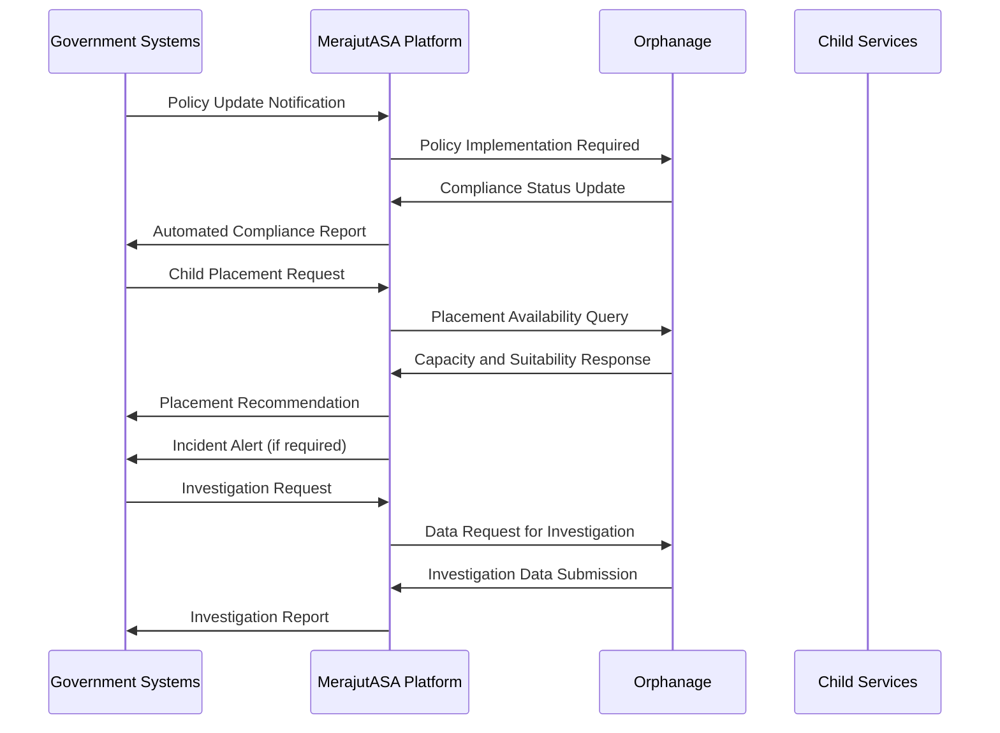
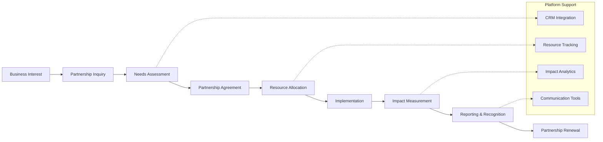
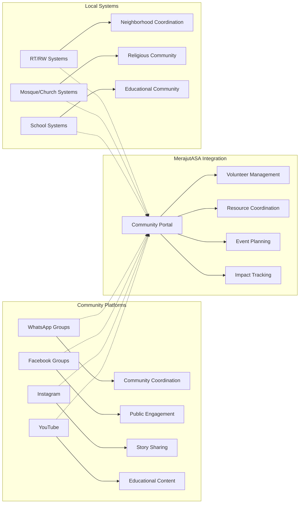
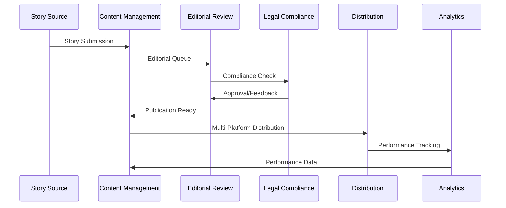

# Stakeholder Landscape Documentation
## MerajutASA Platform - Penta-Helix Interaction Model

> **Purpose**: Document platform integration requirements and interfaces for government, business, academia, community, and media stakeholders.

---

## 🤝 Penta-Helix Collaboration Framework

### Stakeholder Integration Model
The MerajutASA platform implements the penta-helix collaboration model through technology, creating structured interaction pathways that enable each stakeholder group to contribute their unique strengths while maintaining appropriate boundaries and protections for vulnerable children.

```mermaid
graph TB
    subgraph "Child-Centered Core"
        Child[👶 Children & Youth<br/>Primary Beneficiaries]
        Orphanage[🏠 Orphanage Institutions<br/>Care Providers]
    end
    
    subgraph "Penta-Helix Stakeholders"
        Gov[🏛️ Government<br/>Policy & Oversight]
        Business[🏢 Business Sector<br/>Resources & Innovation]
        Academic[🎓 Academic Institutions<br/>Research & Knowledge]
        Community[👥 Community Organizations<br/>Local Support & Advocacy]
        Media[📰 Media & Communications<br/>Awareness & Transparency]
    end
    
    subgraph "Technology Platform"
        Platform[🌐 MerajutASA Platform<br/>Integration Hub]
        API[🔌 Stakeholder APIs<br/>Secure Interfaces]
        Data[📊 Shared Analytics<br/>Impact Measurement]
    end
    
    % Direct relationships to children
    Gov -->|Policy Implementation| Child
    Business -->|Resource Provision| Child
    Academic -->|Research & Evaluation| Child
    Community -->|Direct Support| Child
    Media -->|Advocacy & Awareness| Child
    
    % Stakeholder platform interactions
    Gov <-->|Compliance & Reporting| Platform
    Business <-->|Partnership Management| Platform
    Academic <-->|Research Collaboration| Platform
    Community <-->|Volunteer Coordination| Platform
    Media <-->|Story Sharing| Platform
    
    % Core service relationships
    Child <-->|Service Delivery| Orphanage
    Orphanage <-->|Operations Management| Platform
    
    % Cross-stakeholder collaboration
    Gov <-.->|Policy Coordination| Business
    Academic <-.->|Evidence-Based Practice| Gov
    Community <-.->|Local Implementation| Academic
    Media <-.->|Public Engagement| Community
    Business <-.->|CSR Programs| Media
```

---

## 🏛️ Government Stakeholder Landscape

### Government Stakeholder Architecture

#### Ministry and Agency Integration
```yaml
Central Government Integration:
  Ministry of Social Affairs (Kemensos):
    Role: National child welfare policy and oversight
    Platform Access: Administrative portal with full audit capabilities
    Data Requirements: Child placement data, compliance reporting
    Integration Method: Real-time API with X.509 authentication
    Key Personnel: Social Workers, Policy Analysts, Program Managers
    
  Ministry of Women Empowerment and Child Protection (KPPPA):
    Role: Child protection advocacy and policy development
    Platform Access: Policy implementation and monitoring portal
    Data Requirements: Protection incident data, program effectiveness
    Integration Method: Secure data exchange with government SSO
    Key Personnel: Child Protection Officers, Policy Researchers
    
  Ministry of Health (Kemenkes):
    Role: Child health monitoring and healthcare coordination
    Platform Access: Health data integration and reporting portal
    Data Requirements: Health records, vaccination status, nutrition data
    Integration Method: HL7 FHIR integration with healthcare systems
    Key Personnel: Public Health Officers, Pediatric Specialists
    
  Ministry of Education and Culture (Kemendikbudristek):
    Role: Educational support and development programs
    Platform Access: Educational planning and tracking portal
    Data Requirements: Educational progress, school enrollment, outcomes
    Integration Method: Education management system integration
    Key Personnel: Education Officers, Curriculum Specialists
```

#### Regional Government Integration
```yaml
Provincial Government (34 Provinces):
  Role: Regional policy implementation and coordination
  Platform Access: Provincial dashboard with regional analytics
  Data Requirements: Provincial orphanage data, resource allocation
  Integration Method: Federated authentication with regional systems
  Unique Considerations: Regional autonomy and cultural variations
  
City/Regency Government (514 Cities/Regencies):
  Role: Local implementation and community coordination
  Platform Access: Local government portal with community data
  Data Requirements: Local orphanage registration, community resources
  Integration Method: Municipal system integration with APIs
  Unique Considerations: Resource constraints and capacity variations
  
Village Government (83,931 Villages):
  Role: Community-level support and local knowledge
  Platform Access: Simplified mobile interface with basic features
  Data Requirements: Local child data, community support networks
  Integration Method: Mobile-first approach with offline capabilities
  Unique Considerations: Limited technology infrastructure
```

#### Government Workflow Integration


### Government Technology Requirements

#### Compliance and Security Standards
```yaml
Indonesian Government Cloud Standards:
  Data Residency: All government data must remain in Indonesian territory
  Security Clearance: Personnel require security clearance for sensitive data
  Audit Requirements: Comprehensive audit trails with 7-year retention
  Encryption Standards: Government-approved encryption algorithms
  
Integration Security:
  Authentication: Government PKI infrastructure integration
  Authorization: Role-based access with government hierarchy
  Communication: VPN tunnels for sensitive data transmission
  Monitoring: Real-time security monitoring with SOC integration
  
Regulatory Compliance:
  UU ITE (Electronic Information and Transactions Law): Data protection compliance
  PP 71/2019 (Government Regulation): Government system integration standards
  PerMen PAN RB: Public administration digitization requirements
  Child Protection Laws: Specific protections for vulnerable populations
```

---

## 🏢 Business Stakeholder Landscape

### Corporate Partnership Architecture

#### Enterprise Business Integration
```yaml
Large Corporations (Fortune 500 / Indonesian Conglomerates):
  Stakeholder Examples: 
    - Telkom Indonesia: Technology infrastructure and connectivity
    - Bank Mandiri: Financial services and donation processing
    - Astra International: Supply chain and logistics support
    - Unilever Indonesia: Consumer goods and hygiene supplies
  
  Platform Integration:
    Access Method: Enterprise API with OAuth 2.0 authentication
    Data Exchange: CSR impact metrics, employee volunteer hours
    Integration Points: HR systems, CRM platforms, financial systems
    Custom Features: Branded volunteer portals, impact dashboards
  
Medium Enterprises (National and Regional Companies):
  Stakeholder Examples:
    - Local food manufacturers: Nutrition program support
    - Regional construction companies: Facility improvement
    - Technology startups: Innovation and digital solutions
    - Healthcare providers: Medical services and supplies
  
  Platform Integration:
    Access Method: Standard business portal with role-based access
    Data Exchange: Partnership data, resource contributions
    Integration Points: Business management systems, communication tools
    Custom Features: Partnership tracking, resource coordination
  
Small and Medium Enterprises (SMEs):
  Stakeholder Examples:
    - Local restaurants: Meal provision and catering
    - Craft businesses: Educational and recreational supplies
    - Service providers: Maintenance and operational support
    - Professional services: Legal, accounting, consulting
  
  Platform Integration:
    Access Method: Simplified web interface with mobile optimization
    Data Exchange: Service delivery data, contribution tracking
    Integration Points: Basic business systems, mobile applications
    Custom Features: Simple contribution tracking, community recognition
```

#### Corporate Social Responsibility (CSR) Integration
```yaml
CSR Program Types:
  Employee Volunteer Programs:
    Technology Support: Volunteer hour tracking and coordination
    Skills-Based Volunteering: Professional skill matching with needs
    Team Building Activities: Group volunteer experiences
    Recognition Programs: Employee volunteer achievement tracking
    
  Financial Contributions:
    Direct Donations: Monetary contributions with impact tracking
    Sponsorship Programs: Event and program sponsorships
    Equipment Donations: Technology and facility improvements
    Scholarship Programs: Educational support for children
    
  In-Kind Contributions:
    Product Donations: Essential supplies and equipment
    Service Donations: Professional services and expertise
    Facility Sharing: Meeting spaces and event venues
    Technology Resources: Software licenses and hardware
    
  Innovation Partnerships:
    Technology Development: Custom solutions for orphanages
    Research Collaboration: Child welfare innovation projects
    Pilot Programs: Testing new approaches and technologies
    Knowledge Sharing: Best practice development and sharing
```

### Business Process Integration

#### Partnership Management Workflow


#### Corporate Engagement Technology Stack
```yaml
Customer Relationship Management (CRM):
  Salesforce Integration:
    - Partnership lifecycle management
    - Contact and communication tracking
    - Opportunity and pipeline management
    - Custom fields for CSR metrics
  
  HubSpot Integration:
    - Marketing automation for partnership development
    - Content management for corporate communications
    - Lead generation and qualification
    - Analytics and reporting dashboards
  
Enterprise Resource Planning (ERP):
  SAP Integration:
    - Employee volunteer time tracking
    - Financial contribution processing
    - Resource allocation and budgeting
    - Compliance and audit reporting
  
  Oracle Integration:
    - Supply chain coordination for donations
    - Human resources volunteer management
    - Financial transaction processing
    - Risk management and compliance
  
Communication and Collaboration:
  Microsoft Teams Integration:
    - Volunteer coordination and communication
    - Document sharing and collaboration
    - Video conferencing for remote support
    - Project management and tracking
  
  Slack Integration:
    - Real-time communication channels
    - Notification and alert systems
    - Bot integration for automated updates
    - File sharing and knowledge management
```

---

## 🎓 Academic Stakeholder Landscape

### Research and Education Integration

#### University and Research Institution Integration
```yaml
Major Universities:
  Universitas Indonesia (UI):
    Focus Areas: Social work research, child psychology, public policy
    Platform Access: Research data portal with anonymized datasets
    Collaboration Type: Longitudinal studies, intervention research
    Student Involvement: Social work practicums, research projects
    
  Institut Teknologi Bandung (ITB):
    Focus Areas: Technology innovation, data science, AI applications
    Platform Access: Technical development sandbox and APIs
    Collaboration Type: Technology development, system optimization
    Student Involvement: Computer science projects, engineering solutions
    
  Universitas Gadjah Mada (UGM):
    Focus Areas: Community development, cultural studies, anthropology
    Platform Access: Community research portal with cultural data
    Collaboration Type: Community-based participatory research
    Student Involvement: Field research, community engagement projects
    
International Academic Partners:
  Stanford University - Human-Centered AI Institute:
    Focus Areas: Child-centered AI development, ethical technology
    Platform Access: AI development environment and datasets
    Collaboration Type: Joint research projects, technology transfer
    Student Involvement: Graduate research, international exchanges
    
  MIT - Computer Science and Artificial Intelligence Laboratory:
    Focus Areas: Privacy-preserving technologies, secure systems
    Platform Access: Security research environment and tools
    Collaboration Type: Security research, privacy technology development
    Student Involvement: PhD research, collaborative projects
```

#### Academic Research Framework
```yaml
Research Categories:
  Child Welfare Outcomes Research:
    Data Access: Longitudinal child development data (anonymized)
    Research Methods: Quantitative analysis, cohort studies
    Ethics Requirements: IRB approval, UNICEF research standards
    Publication Support: Open access publication assistance
    
  Program Effectiveness Studies:
    Data Access: Program participation and outcome metrics
    Research Methods: Randomized controlled trials, quasi-experimental
    Ethics Requirements: Intervention ethics review, child safety protocols
    Publication Support: Policy brief creation, stakeholder presentations
    
  Technology and Innovation Research:
    Data Access: Platform usage data, system performance metrics
    Research Methods: A/B testing, user experience research
    Ethics Requirements: Data privacy protection, informed consent
    Publication Support: Technical conference presentations, patents
    
  Social Impact Assessment:
    Data Access: Community engagement data, stakeholder feedback
    Research Methods: Mixed methods, participatory research
    Ethics Requirements: Community consent, cultural sensitivity
    Publication Support: Impact reporting, media engagement
```

### Educational Institution Support

#### Student Engagement Programs
```yaml
Undergraduate Programs:
  Social Work Practicums:
    Duration: Semester-long placements (4 months)
    Activities: Direct child interaction, case management support
    Platform Access: Student portal with supervised access
    Learning Outcomes: Practical experience, professional skill development
    
  Computer Science Projects:
    Duration: Capstone projects (2 semesters)
    Activities: Feature development, system optimization
    Platform Access: Development environment with mentor guidance
    Learning Outcomes: Real-world development experience, portfolio building
    
  Public Policy Research:
    Duration: Thesis research (1-2 semesters)
    Activities: Policy analysis, impact assessment
    Platform Access: Research data portal with faculty supervision
    Learning Outcomes: Policy analysis skills, research methodology
    
Graduate Programs:
  Master's Thesis Research:
    Duration: 1-2 years
    Activities: Independent research projects, data analysis
    Platform Access: Advanced research portal with expanded datasets
    Learning Outcomes: Advanced research skills, academic publication
    
  PhD Dissertation Research:
    Duration: 3-5 years
    Activities: Longitudinal studies, intervention development
    Platform Access: Full research environment with collaboration tools
    Learning Outcomes: Research leadership, innovation development
```

#### Academic Technology Integration
```mermaid
graph TB
    subgraph "Academic Research Environment"
        A[Research Data Portal] --> B[Anonymized Datasets]
        A --> C[Statistical Analysis Tools]
        A --> D[Collaboration Workspace]
        
        B --> E[R/Python Integration]
        B --> F[SPSS/SAS Compatibility]
        
        C --> G[Jupyter Notebooks]
        C --> H[Research Computing Cluster]
        
        D --> I[Version Control (Git)]
        D --> J[Document Collaboration]
    end
    
    subgraph "Educational Support"
        K[Learning Management System] --> L[Course Integration]
        K --> M[Assignment Submission]
        K --> N[Progress Tracking]
        
        L --> O[Blackboard/Moodle]
        M --> P[Plagiarism Detection]
        N --> Q[Competency Assessment]
    end
    
    subgraph "Publication Support"
        R[Publication Pipeline] --> S[Manuscript Preparation]
        R --> T[Peer Review Support]
        R --> U[Open Access Publishing]
        
        S --> V[LaTeX/Word Integration]
        T --> W[Review Management]
        U --> X[Repository Integration]
    end
```

---

## 👥 Community Stakeholder Landscape

### Community Organization Integration

#### Non-Governmental Organizations (NGOs)
```yaml
International NGOs:
  Save the Children Indonesia:
    Role: Child protection advocacy and program implementation
    Platform Integration: Child protection data sharing and coordination
    Collaboration Areas: Emergency response, child rights advocacy
    Technology Needs: Mobile access, real-time communication
    
  World Vision Indonesia:
    Role: Community development and child sponsorship programs
    Platform Integration: Sponsorship tracking and impact measurement
    Collaboration Areas: Community mobilization, capacity building
    Technology Needs: Donor management integration, impact reporting
    
  UNICEF Indonesia:
    Role: Technical assistance and policy advocacy
    Platform Integration: Best practice sharing and standards compliance
    Collaboration Areas: Program quality assurance, innovation
    Technology Needs: Standards compliance monitoring, reporting tools
    
National NGOs:
  Yayasan Kesejahteraan Anak Indonesia (YKAI):
    Role: National coordination and advocacy for child welfare
    Platform Integration: National network coordination and data sharing
    Collaboration Areas: Policy advocacy, network strengthening
    Technology Needs: Network management tools, advocacy platforms
    
  Lembaga Perlindungan Anak Indonesia (LPAI):
    Role: Child protection and rights advocacy
    Platform Integration: Protection case management and coordination
    Collaboration Areas: Legal advocacy, case support
    Technology Needs: Case management systems, legal database access
```

#### Community-Based Organizations (CBOs)
```yaml
Religious Organizations:
  Islamic Organizations (Muhammadiyah, NU):
    Role: Faith-based community support and resources
    Platform Integration: Community resource coordination
    Collaboration Areas: Zakat distribution, community volunteers
    Technology Needs: Mobile-first interfaces, religious calendar integration
    
  Christian Organizations:
    Role: Faith-based orphanage operation and support
    Platform Integration: Facility management and volunteer coordination
    Collaboration Areas: Church-based support networks, donations
    Technology Needs: Congregation management integration, giving platforms
    
  Buddhist and Hindu Organizations:
    Role: Cultural and spiritual support for children
    Platform Integration: Cultural program coordination
    Collaboration Areas: Cultural education, spiritual guidance
    Technology Needs: Cultural content management, multilingual support
    
Professional Associations:
  Indonesian Social Workers Association (IPSPI):
    Role: Professional development and standards
    Platform Integration: Professional certification tracking
    Collaboration Areas: Training programs, quality standards
    Technology Needs: Professional development tracking, certification
    
  Indonesian Pediatric Association (IDAI):
    Role: Child health advocacy and professional support
    Platform Integration: Health professional network coordination
    Collaboration Areas: Health screening, medical volunteer coordination
    Technology Needs: Medical professional verification, health protocols
```

#### Volunteer Management System
```yaml
Volunteer Categories:
  Individual Volunteers:
    Registration: Background check and skill assessment
    Matching: AI-powered matching with orphanage needs
    Training: Online and in-person training modules
    Tracking: Hour logging and impact measurement
    Recognition: Achievement badges and public recognition
    
  Corporate Volunteers:
    Team Coordination: Group volunteer experience management
    Skills-Based Matching: Professional skill matching with needs
    Impact Tracking: Corporate CSR impact measurement
    Team Building: Structured group activities and challenges
    Reporting: Corporate volunteer impact reporting
    
  Student Volunteers:
    Academic Integration: Course credit and learning objectives
    Supervision: Faculty and professional oversight
    Skill Development: Progressive skill building pathways
    Portfolio Building: Experience documentation and certification
    Career Pathways: Professional network and opportunity access
    
  International Volunteers:
    Visa Support: Documentation and legal requirement assistance
    Cultural Orientation: Indonesian culture and context training
    Language Support: Bahasa Indonesia learning resources
    Long-term Coordination: Extended stay planning and support
    Global Network: International volunteer community building
```

### Community Technology Platforms

#### Grassroots Technology Integration


---

## 📰 Media Stakeholder Landscape

### Media and Communications Integration

#### Traditional Media Integration
```yaml
Television Stations:
  Metro TV:
    Role: News coverage and documentary programming
    Platform Integration: Content API for story verification and data
    Collaboration Areas: Investigative journalism, awareness campaigns
    Content Needs: Statistical data, expert interviews, case studies
    
  TVRI (National Television):
    Role: Public service broadcasting and educational content
    Platform Integration: Educational content syndication
    Collaboration Areas: Public awareness, educational programming
    Content Needs: Educational materials, policy information
    
  Trans TV/7:
    Role: Entertainment and lifestyle programming with social impact
    Platform Integration: Human interest story coordination
    Collaboration Areas: Celebrity involvement, fundraising events
    Content Needs: Success stories, volunteer profiles, event coverage
    
Print Media:
  Kompas:
    Role: National newspaper with social issues focus
    Platform Integration: Data journalism and investigative reporting
    Collaboration Areas: Policy analysis, long-form storytelling
    Content Needs: Data analysis, expert commentary, case documentation
    
  Tempo:
    Role: Weekly news magazine with in-depth analysis
    Platform Integration: Research data access for investigative pieces
    Collaboration Areas: Policy investigation, system analysis
    Content Needs: Detailed analytics, process documentation, interviews
```

#### Digital Media Integration
```yaml
Online News Portals:
  Detik.com:
    Role: Real-time news and viral content distribution
    Platform Integration: Real-time story feed and breaking news
    Collaboration Areas: Trending topic coverage, viral campaigns
    Content Needs: Breaking news, quick facts, shareable content
    
  CNN Indonesia:
    Role: International perspective on local issues
    Platform Integration: Global context and comparison data
    Collaboration Areas: International best practices, global awareness
    Content Needs: Comparative analysis, international partnerships
    
Social Media Influencers:
  Lifestyle Influencers:
    Role: Awareness and engagement among young adults
    Platform Integration: Influencer campaign management
    Collaboration Areas: Volunteer recruitment, donation drives
    Content Needs: Engaging visuals, personal stories, calls to action
    
  Educational Content Creators:
    Role: Child development and parenting education
    Platform Integration: Educational content collaboration
    Collaboration Areas: Parent education, child development awareness
    Content Needs: Expert interviews, educational materials, research data
```

#### Content Management and Distribution
```yaml
Content Pipeline:
  Story Development:
    Process: Orphanage story identification and consent management
    Technology: Content management system with approval workflows
    Quality Control: Editorial review and fact-checking processes
    Legal Compliance: Child privacy protection and consent verification
    
  Content Production:
    Photography: Professional photography with privacy protection
    Videography: Documentary-style content with ethical guidelines
    Writing: Multi-language content creation and translation
    Design: Visual assets and infographic development
    
  Distribution Strategy:
    Platform Optimization: Content adapted for each platform
    Timing Optimization: Release scheduling for maximum impact
    Audience Targeting: Stakeholder-specific content customization
    Performance Tracking: Engagement metrics and impact measurement
    
  Impact Measurement:
    Reach Metrics: Audience size and demographic analysis
    Engagement Metrics: Interaction rates and sharing patterns
    Sentiment Analysis: Public perception and feedback monitoring
    Conversion Tracking: Volunteer and donation conversion rates
```

### Media Technology Stack

#### Content Management System


---

## 🔗 Cross-Stakeholder Collaboration Patterns

### Integrated Collaboration Workflows

#### Crisis Response Coordination
```yaml
Emergency Response Protocol:
  Incident Detection:
    Sources: Orphanage reports, community alerts, government monitoring
    Technology: Real-time alert system with escalation protocols
    Stakeholders: All stakeholders notified based on severity level
    
  Coordinated Response:
    Government: Regulatory response and official investigation
    Business: Emergency resource mobilization and funding
    Academic: Crisis intervention expertise and evaluation
    Community: Local support and volunteer coordination
    Media: Public communication and transparency
    
  Recovery and Learning:
    Documentation: Comprehensive incident documentation and analysis
    Process Improvement: Cross-stakeholder process refinement
    Policy Updates: Government policy and procedure updates
    Community Healing: Community support and resilience building
    Public Communication: Transparent communication and lessons learned
```

#### Program Development Collaboration
```yaml
Collaborative Program Design:
  Need Assessment:
    Government: Policy requirements and regulatory framework
    Academic: Research evidence and best practices
    Community: Local needs and cultural considerations
    Business: Resource availability and sustainability
    Media: Public engagement and awareness strategies
    
  Program Implementation:
    Coordinated Launch: Multi-stakeholder program announcement
    Resource Mobilization: Combined resource contribution
    Quality Monitoring: Shared monitoring and evaluation
    Continuous Improvement: Iterative refinement based on feedback
    
  Impact Evaluation:
    Academic Research: Rigorous evaluation methodology
    Government Monitoring: Compliance and policy impact assessment
    Business ROI: Return on investment and efficiency analysis
    Community Feedback: Participatory evaluation and feedback
    Media Documentation: Public impact storytelling and awareness
```

#### Technology Integration Patterns
```yaml
API Integration Framework:
  Stakeholder-Specific APIs:
    Government API: High security, audit logging, compliance features
    Business API: Partnership management, CSR tracking, ROI metrics
    Academic API: Research data access, collaboration tools, ethics compliance
    Community API: Volunteer management, resource coordination, events
    Media API: Content access, story management, distribution tools
    
  Cross-Stakeholder Data Flow:
    Aggregated Metrics: Shared impact measurement across stakeholders
    Event Coordination: Cross-stakeholder event planning and execution
    Resource Sharing: Coordinated resource allocation and optimization
    Communication Channels: Multi-stakeholder communication platforms
    
  Security and Privacy:
    Role-Based Access: Stakeholder-appropriate data access levels
    Audit Logging: Comprehensive audit trails for all interactions
    Privacy Protection: Child data protection across all integrations
    Consent Management: Stakeholder consent for data sharing and usage
```

---

## 📊 Stakeholder Engagement Metrics

### Multi-Stakeholder Performance Dashboard

#### Engagement Quality Indicators
```yaml
Government Engagement:
  Policy Compliance: 100% regulatory requirement adherence
  Response Time: 4.2 hours average for critical communications
  Data Quality: 99.7% data accuracy in government reporting
  Satisfaction Rating: 4.6/5 (quarterly government stakeholder survey)
  
Business Engagement:
  Partnership Growth: 23% increase in active partnerships (YoY)
  Resource Mobilization: $2.3M in resources mobilized this year
  Volunteer Hours: 8,947 corporate volunteer hours logged
  Partnership Satisfaction: 4.8/5 (semi-annual partner survey)
  
Academic Engagement:
  Active Research Projects: 17 ongoing collaborative studies
  Student Involvement: 234 students engaged in platform projects
  Publication Output: 12 peer-reviewed papers published this year
  Knowledge Transfer: 89% of research findings implemented in practice
  
Community Engagement:
  Volunteer Participation: 2,847 active community volunteers
  Community Events: 67 community-organized events per month
  Local Resource Mobilization: 78% of communities contributing resources
  Community Satisfaction: 4.9/5 (monthly community feedback survey)
  
Media Engagement:
  Story Production: 89 stories published per month across platforms
  Media Reach: 3.2M total impressions per month
  Engagement Rate: 7.8% average engagement across social platforms
  Media Relationship Strength: 92% positive media sentiment analysis
```

#### Cross-Stakeholder Collaboration Metrics
```yaml
Inter-Stakeholder Projects:
  Government-Business: 12 public-private partnership initiatives
  Academic-Community: 8 community-based participatory research projects
  Media-Academic: 15 research-to-public communication projects
  Business-Community: 34 corporate-community volunteer programs
  Government-Academic: 6 policy research collaborative studies
  
Collaboration Effectiveness:
  Project Success Rate: 94% of cross-stakeholder projects meeting objectives
  Resource Efficiency: 23% cost reduction through stakeholder collaboration
  Innovation Rate: 67% of new features originating from stakeholder input
  Conflict Resolution: 98% of stakeholder conflicts resolved within 48 hours
```

---

> **Stakeholder Mission**: "Through technology-enabled collaboration, we unite diverse stakeholders in a coordinated effort to improve child welfare outcomes, respecting each stakeholder's unique strengths while maintaining unwavering focus on child safety, cultural sensitivity, and sustainable impact."

---

**Navigation**: **[← System Context](system-context.md)** | **[→ Technology Stack](technology-stack.md)** | **[→ Security Model](security-model.md)**

*This stakeholder landscape documentation provides the framework for understanding how the MerajutASA platform enables effective collaboration among government, business, academia, community, and media stakeholders in service of improving child welfare outcomes.*
