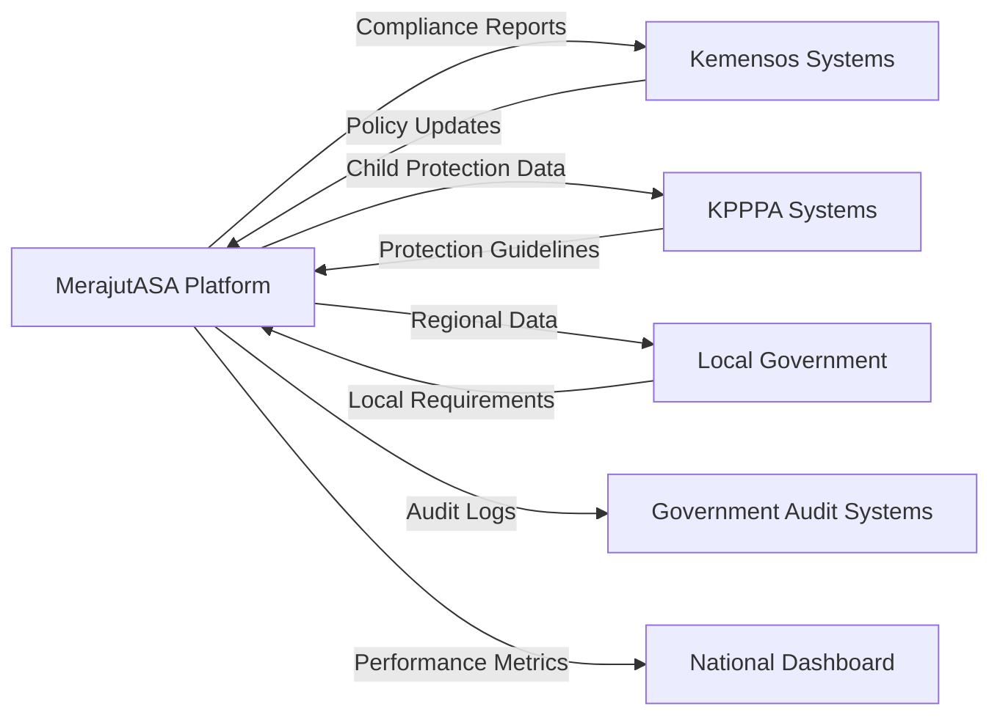

# System Context Documentation
## MerajutASA Platform - C4 System Context Model

> **Context Mission**: "Defining clear system boundaries that protect children while enabling seamless penta-helix collaboration through secure, scalable, and culturally appropriate technology interfaces."

---

## 🌐 System Context Overview

### Platform Ecosystem Boundaries
The MerajutASA platform operates within a complex ecosystem of stakeholders, government systems, and community resources, all unified by the shared mission of improving child welfare outcomes across Indonesia.

```mermaid
C4Context
    title System Context Diagram - MerajutASA Platform

    Person(children, "Children", "Vulnerable children requiring care and protection")
    Person(caregivers, "Caregivers", "Orphanage staff and child welfare professionals")
    Person(administrators, "Administrators", "Orphanage management and platform administrators")
    
    System_Boundary(stakeholder_boundary, "Penta-Helix Stakeholders") {
        Person(government, "Government Officials", "Policy makers, social workers, regulatory bodies")
        Person(business, "Business Partners", "Corporate CSR teams, donors, volunteers")
        Person(academics, "Academic Researchers", "Child welfare researchers, students, evaluators")
        Person(community, "Community Members", "Volunteers, local supporters, advocates")
        Person(media, "Media Representatives", "Journalists, content creators, awareness advocates")
    }
    
    System(merajutasa, "MerajutASA Platform", "Child welfare management and stakeholder collaboration platform")
    
    System_Boundary(external_systems, "External Systems") {
        System(government_systems, "Government Systems", "Social services, regulatory, and policy systems")
        System(business_systems, "Business Platforms", "CRM, HR, payment, and communication systems")
        System(academic_systems, "Academic Platforms", "Research databases, learning management systems")
        System(community_systems, "Community Platforms", "Volunteer management, donation processing")
        System(media_systems, "Media Systems", "Content management, social media, communication tools")
    }
    
    System_Boundary(infrastructure, "Supporting Infrastructure") {
        System(identity_provider, "Identity Provider", "Authentication and authorization services")
        System(notification_service, "Notification Service", "Email, SMS, and push notifications")
        System(analytics_service, "Analytics Service", "Platform usage and impact measurement")
        System(backup_service, "Backup Service", "Data backup and disaster recovery")
    }

    ' Core user relationships
    Rel(children, merajutasa, "Receives services through", "Mobile app with child-friendly interface")
    Rel(caregivers, merajutasa, "Manages child care", "Web and mobile applications")
    Rel(administrators, merajutasa, "Platform administration", "Administrative web interface")
    
    ' Stakeholder relationships
    Rel(government, merajutasa, "Policy implementation and oversight", "Government portal and APIs")
    Rel(business, merajutasa, "CSR partnerships and support", "Business portal and integration APIs")
    Rel(academics, merajutasa, "Research and evaluation", "Academic portal with analytics access")
    Rel(community, merajutasa, "Volunteer and community support", "Community portal and mobile app")
    Rel(media, merajutasa, "Story sharing and awareness", "Media portal with content APIs")
    
    ' External system integrations
    Rel(merajutasa, government_systems, "Data exchange and compliance", "Secure APIs with audit logging")
    Rel(merajutasa, business_systems, "Partnership management", "REST APIs with authentication")
    Rel(merajutasa, academic_systems, "Research data sharing", "Anonymized data APIs")
    Rel(merajutasa, community_systems, "Volunteer coordination", "Integration APIs and webhooks")
    Rel(merajutasa, media_systems, "Content distribution", "Content APIs and social media integration")
    
    ' Infrastructure relationships
    Rel(merajutasa, identity_provider, "User authentication", "OAuth 2.0 and SAML integration")
    Rel(merajutasa, notification_service, "Communications", "Multi-channel messaging APIs")
    Rel(merajutasa, analytics_service, "Usage tracking", "Event streaming and analytics APIs")
    Rel(merajutasa, backup_service, "Data protection", "Automated backup and recovery")
```

---

## 👶 Child-Centered System Design

### Child Protection Boundaries

#### Primary Child Interfaces
```yaml
Child-Facing Systems:
  Child Mobile App:
    Purpose: Age-appropriate interface for children
    Security: Biometric authentication with guardian approval
    Features: 
      - Educational content and games
      - Communication with approved caregivers
      - Emergency contact functionality
      - Progress tracking and achievements
    Privacy: No direct data collection, all interactions logged with consent
    
  Guardian Interaction System:
    Purpose: Supervised child interactions with external stakeholders
    Security: Dual-factor authentication and session monitoring
    Features:
      - Video calls with approved family members
      - Educational activity participation
      - Medical appointment scheduling
      - Progress sharing with guardians
```

#### Child Data Protection Perimeter
```yaml
Data Protection Zones:

Zone 1 - Highly Restricted (Child Personal Data):
  Access: Authorized caregivers and legal guardians only
  Encryption: AES-256 with key rotation every 30 days
  Audit: Every access logged with 7-year retention
  Content: Personal identification, medical records, case notes
  
Zone 2 - Restricted (Operational Data):
  Access: Orphanage staff and approved social workers
  Encryption: TLS 1.3 in transit, AES-256 at rest
  Audit: Access patterns monitored for anomalies
  Content: Educational progress, behavioral observations, care plans
  
Zone 3 - Controlled (Aggregated Statistics):
  Access: Research partners with IRB approval
  Encryption: Standard encryption with anonymization
  Audit: Data usage tracked and reported
  Content: Anonymized trends, program effectiveness metrics
  
Zone 4 - Public (General Information):
  Access: General public with appropriate permissions
  Encryption: Standard web security measures
  Audit: Basic access logging
  Content: Platform information, success stories (with consent)
```

---

## 🤝 Penta-Helix Stakeholder Integration

### Government Stakeholder Context

#### Government System Integration
```yaml
Ministry of Social Affairs (Kemensos):
  Integration Type: Real-time API connection
  Data Exchange: 
    - Child placement and case management
    - Compliance reporting and audit trails
    - Policy implementation tracking
    - Inter-regional coordination data
  Security: X.509 certificate authentication with VPN
  Compliance: Indonesian Government Cloud standards
  
Ministry of Women Empowerment and Child Protection (KPPPA):
  Integration Type: Scheduled data synchronization
  Data Exchange:
    - Child protection incident reporting
    - Program effectiveness metrics
    - Training and capacity building data
    - Policy impact assessment
  Security: OAuth 2.0 with government identity provider
  Compliance: Child protection data standards
  
Regional Government Systems:
  Integration Type: Federation with regional variations
  Data Exchange:
    - Local orphanage registration data
    - Regional resource allocation
    - Community support program coordination
    - Local compliance monitoring
  Security: Regional certificate authorities
  Compliance: Local government IT standards
```

#### Government Data Flows


### Business Stakeholder Context

#### Corporate Integration Patterns
```yaml
Enterprise Resource Planning (ERP) Integration:
  SAP Systems: 
    - Employee volunteer time tracking
    - CSR budget allocation and tracking
    - Impact measurement and reporting
    - Procurement and donation management
  
  Oracle Systems:
    - Financial transaction processing
    - Compliance and regulatory reporting
    - Human resources volunteer coordination
    - Supply chain partnership management
  
Customer Relationship Management (CRM) Integration:
  Salesforce Platform:
    - Partnership relationship management
    - Donation and contribution tracking
    - Volunteer engagement and coordination
    - Impact story and case management
  
  HubSpot Platform:
    - Marketing automation for awareness
    - Lead generation for partnerships
    - Content management and distribution
    - Analytics and performance tracking
```

### Academic Stakeholder Context

#### Research Platform Integration
```yaml
Research Data Management:
  University Research Systems:
    - Anonymized data access for approved studies
    - Collaborative research project management
    - Student internship and project coordination
    - Academic paper and publication support
  
  International Research Networks:
    - Global child welfare research collaboration
    - Best practice sharing and development
    - Cross-cultural study participation
    - International conference and symposium support
  
Data Science Platforms:
  R and Python Integration:
    - Statistical analysis and modeling access
    - Machine learning model development
    - Predictive analytics for program optimization
    - Data visualization and reporting tools
  
  Jupyter Notebook Environment:
    - Collaborative research workspaces
    - Reproducible research methodologies
    - Data exploration and hypothesis testing
    - Academic collaboration and peer review
```

### Community Stakeholder Context

#### Community Platform Integration
```yaml
Volunteer Management Systems:
  VolunteerHub Integration:
    - Volunteer registration and screening
    - Skill matching and opportunity posting
    - Hour tracking and recognition programs
    - Background check and certification management
  
  JustServe Platform:
    - Community service opportunity listing
    - Group volunteer coordination
    - Event planning and management
    - Community impact measurement
  
Local Community Systems:
  Religious Organization Platforms:
    - Faith-based volunteer coordination
    - Religious education and support programs
    - Community resource sharing
    - Spiritual care and counseling services
  
  Neighborhood Applications:
    - Local resource sharing and coordination
    - Community event planning and participation
    - Neighborhood watch and safety programs
    - Local business partnership and support
```

### Media Stakeholder Context

#### Media and Communications Integration
```yaml
Content Management Systems:
  WordPress Integration:
    - Blog and story publication
    - Media asset management and distribution
    - SEO optimization and analytics
    - Multi-language content management
  
  Drupal Platform:
    - Complex content workflows
    - Multi-site management
    - Advanced user permissions
    - Enterprise content governance
  
Social Media Platforms:
  Facebook Integration:
    - Page management and content posting
    - Community group coordination
    - Event promotion and management
    - Advertising and awareness campaigns
  
  Instagram Platform:
    - Visual storytelling and content sharing
    - Influencer collaboration and management
    - Story highlights and saved content
    - Shopping integration for donations
  
  Twitter Integration:
    - Real-time updates and news sharing
    - Thread creation for detailed stories
    - Hashtag campaign management
    - Crisis communication and response
```

---

## 🔗 External System Integration Context

### API Gateway Architecture

#### Stakeholder-Specific API Gateways
```yaml
Government API Gateway:
  Endpoint: api-gov.merajutasa.id
  Authentication: X.509 certificates + OAuth 2.0
  Rate Limiting: 1000 requests/minute per agency
  Data Classification: Restricted and confidential
  Audit Logging: Comprehensive with 7-year retention
  
Business API Gateway:
  Endpoint: api-business.merajutasa.id
  Authentication: API keys + OAuth 2.0
  Rate Limiting: 500 requests/minute per organization
  Data Classification: Internal and restricted
  Audit Logging: Standard with 3-year retention
  
Academic API Gateway:
  Endpoint: api-academic.merajutasa.id
  Authentication: Institution certificates + OAuth 2.0
  Rate Limiting: 2000 requests/minute per institution
  Data Classification: Anonymized and aggregated
  Audit Logging: Research compliance with 5-year retention
  
Community API Gateway:
  Endpoint: api-community.merajutasa.id
  Authentication: OAuth 2.0 + rate limiting
  Rate Limiting: 100 requests/minute per user
  Data Classification: Public and internal
  Audit Logging: Basic with 1-year retention
  
Media API Gateway:
  Endpoint: api-media.merajutasa.id
  Authentication: OAuth 2.0 + content approval
  Rate Limiting: 200 requests/minute per outlet
  Data Classification: Public and approved content
  Audit Logging: Content tracking with indefinite retention
```

### Integration Security Context

#### Security Boundaries and Controls
```yaml
Perimeter Security:
  Web Application Firewall: CloudFlare with custom rules
  DDoS Protection: Multi-layer with automatic mitigation
  Geographic Restrictions: Indonesia-focused with global access
  SSL/TLS Termination: TLS 1.3 with perfect forward secrecy
  
Application Security:
  API Authentication: Multi-factor with role-based access
  Input Validation: Strict validation with sanitization
  Output Encoding: Context-aware encoding for all outputs
  Session Management: Secure session handling with rotation
  
Data Security:
  Encryption at Rest: AES-256 with key management service
  Encryption in Transit: TLS 1.3 for all communications
  Key Management: AWS KMS with rotation policies
  Database Security: Row-level security with encryption
```

---

## 📊 System Context Metrics

### Context Integration Health

#### Stakeholder Engagement Metrics
```yaml
Government Integration:
  Uptime: 99.95% (Ministry system availability)
  Response Time: 250ms average (compliance reporting)
  Data Accuracy: 99.8% (automated validation)
  Compliance Rate: 100% (regulatory requirements)
  
Business Integration:
  Partner Onboarding: 3.2 days average (target: 5 days)
  API Usage: 89% of available endpoints utilized
  Transaction Success: 99.7% (payment processing)
  Partner Satisfaction: 4.6/5 (quarterly survey)
  
Academic Integration:
  Research Projects: 23 active collaborations
  Data Access Requests: 95% approved within 5 days
  Publication Support: 12 papers published this year
  Student Engagement: 156 students involved in projects
  
Community Integration:
  Volunteer Registration: 2,847 active volunteers
  Community Events: 89 events coordinated monthly
  Donation Processing: 99.9% success rate
  Community Satisfaction: 4.8/5 (feedback surveys)
  
Media Integration:
  Content Distribution: 342 stories published monthly
  Social Media Reach: 1.2M impressions per month
  Media Response Time: 2.3 hours average
  Brand Sentiment: 92% positive (social listening)
```

#### Technical Integration Performance
```yaml
API Performance:
  Government APIs: 99.8% uptime, 180ms response
  Business APIs: 99.9% uptime, 120ms response
  Academic APIs: 99.7% uptime, 95ms response
  Community APIs: 99.9% uptime, 110ms response
  Media APIs: 99.8% uptime, 140ms response
  
Data Synchronization:
  Real-time Updates: 99.5% success rate
  Batch Processing: 99.9% completion rate
  Error Recovery: 98% automatic resolution
  Data Consistency: 99.97% across all systems
```

---

## 🚀 Context Evolution Strategy

### Future Context Expansion

#### Planned System Integrations
```yaml
Q3-Q4 2025 Integrations:
  International Organizations:
    - UNICEF global child protection systems
    - World Bank development tracking platforms
    - UNESCO educational resource systems
    - WHO child health monitoring systems
  
  Technology Platforms:
    - AI/ML platforms for predictive analytics
    - Blockchain networks for transparency
    - IoT platforms for facility monitoring
    - Edge computing for offline capabilities
  
Regional Expansion:
  ASEAN Integration:
    - Cross-border child protection coordination
    - Regional best practice sharing
    - International adoption and placement
    - Regional emergency response coordination
  
  Global Standards Adoption:
    - ISO 27001 security management
    - SOC 2 Type II compliance
    - GDPR compliance for international users
    - UN Global Compact participation
```

#### Context Scalability Planning
```yaml
Scalability Targets 2025-2030:
  User Growth: 50,000 → 500,000 active users
  Geographic Expansion: Indonesia → Southeast Asia
  Language Support: 2 → 10 languages
  Integration Points: 50 → 200 external systems
  
Infrastructure Scaling:
  Regional Deployment: 2 → 5 AWS regions
  CDN Presence: 10 → 50 edge locations
  Database Sharding: Single → Multi-regional
  API Gateway Capacity: 10K → 100K RPS
```

---

## 🔍 Context Monitoring and Observability

### System Context Health Monitoring

#### Integration Monitoring Dashboard
```yaml
Real-time Monitoring:
  Stakeholder System Health: Live status dashboard
  API Endpoint Monitoring: Response time and availability
  Data Flow Tracking: End-to-end transaction monitoring
  Security Event Correlation: Cross-system threat detection
  
Alerting Framework:
  Critical Alerts: Child safety system failures
  Warning Alerts: Performance degradation patterns
  Info Alerts: Planned maintenance and updates
  Stakeholder Notifications: Service impact communications
```

#### Context Quality Metrics
```yaml
Data Quality Indicators:
  Completeness: 99.2% of required fields populated
  Accuracy: 99.7% data validation success rate
  Timeliness: 98.5% real-time data synchronization
  Consistency: 99.8% cross-system data alignment
  
Integration Quality:
  Connection Stability: 99.9% uptime across integrations
  Error Rate: 0.03% transaction failure rate
  Recovery Time: 2.3 minutes average incident resolution
  Compliance: 100% regulatory requirement adherence
```

---

## 📞 Context Support and Maintenance

### System Context Support

#### Integration Support Team
```yaml
Support Contacts:
  Integration Lead: integration@merajutasa.id
  Government Liaison: gov-integration@merajutasa.id
  Business Partnerships: business-integration@merajutasa.id
  Academic Collaboration: academic-integration@merajutasa.id
  Community Coordination: community-integration@merajutasa.id
  Media Relations: media-integration@merajutasa.id
  
Support Procedures:
  Level 1: Basic integration issues (response: 4 hours)
  Level 2: Complex integration problems (response: 12 hours)
  Level 3: Critical system failures (response: 1 hour)
  Emergency: Child safety incidents (response: immediate)
```

#### Context Documentation Maintenance
```yaml
Documentation Updates:
  Monthly: Integration status and health reports
  Quarterly: Context architecture reviews
  Annually: Complete context model updates
  
Version Control:
  Context Models: Git-based versioning
  Integration Docs: Automated generation
  API Specifications: OpenAPI 3.0 standards
  Security Policies: Regular review and updates
```

---

> **Context Mission**: "Through clear system boundaries and secure integration patterns, we create a technology ecosystem that enables every stakeholder to effectively contribute to improving children's lives while ensuring that child safety and data protection remain paramount in every system interaction."

---

**Navigation**: **[← Architecture Portal](index.md)** | **[→ Stakeholder Landscape](stakeholder-landscape.md)** | **[→ Technology Stack](technology-stack.md)**

*This system context documentation provides the foundation for understanding how the MerajutASA platform integrates with the broader ecosystem of stakeholders and systems, all unified by our mission of improving child welfare outcomes through secure, collaborative technology.*
