# Security Architecture Documentation
## Defense-in-Depth Strategy for Child Protection Platform

> **Mission**: Implement comprehensive, multi-layered security architecture that protects vulnerable children's data while enabling secure collaboration among penta-helix stakeholders through zero-trust principles, privacy-by-design, and security-first development practices.

---

## 🛡️ Security Architecture Philosophy

### Child-Centered Security Design
Security architecture prioritizing child protection and data sovereignty:

```yaml
Security Principles:
  Child Safety First: Every security control protects vulnerable children
  Privacy by Design: Data protection built into architecture foundation
  Zero Trust: Never trust, always verify access requests
  
Defense Strategy:
  Layered Protection: Multiple security controls at every level
  Proactive Defense: Threat hunting and prevention over reaction
  Stakeholder Trust: Security transparency for community confidence
```

### Penta-Helix Security Model
Security framework supporting multi-stakeholder collaboration:

```mermaid
graph TB
    subgraph "🏛️ Government Security Requirements"
        A[Regulatory Compliance] --> B[Audit & Transparency]
        C[Data Sovereignty] --> D[Inter-agency Secure Sharing]
    end
    
    subgraph "🏢 Business Security Needs"
        E[Brand Protection] --> F[Secure API Access]
        G[CSR Data Integrity] --> H[Partner Trust Assurance]
    end
    
    subgraph "🎓 Academic Security Framework"
        I[Research Data Anonymization] --> J[Ethical Data Access]
        K[IP Protection] --> L[Publication Security]
    end
    
    subgraph "👥 Community Security Protection"
        M[Volunteer Safety Verification] --> N[Safe Communication Channels]
        O[Child Interaction Safety] --> P[Background Check Integration]
    end
    
    subgraph "📺 Media Security Controls"
        Q[Content Verification] --> R[Source Protection]
        S[Child Image Protection] --> T[Ethical Publication Guidelines]
    end
    
    subgraph "🔒 Unified Security Architecture"
        U[Zero Trust Gateway] --> V[Identity & Access Management]
        W[Threat Detection & Response] --> X[Data Protection Controls]
        Y[Compliance Automation] --> Z[Security Monitoring]
    end
    
    A --> U
    E --> U
    I --> U
    M --> U
    Q --> U
    
    V --> AA[👶 Child Data Protection]
    X --> AA
    Z --> AA
```



---

## 🏗️ Security Architecture Overview

### 1. Multi-Layer Security Framework

#### Defense-in-Depth Strategy
```yaml
Layer 1 - Perimeter Security:
  Purpose: External threat prevention and DDoS protection
  Components:
    - AWS Shield Advanced (DDoS protection)
    - AWS WAF (Web Application Firewall)
    - CloudFront security headers and geo-blocking
    - DNS security with Route 53 Resolver
  
Layer 2 - Network Security:
  Purpose: Internal network protection and segmentation
  Components:
    - VPC security groups with least privilege
    - Network ACLs for subnet-level protection
    - NAT Gateway for secure outbound access
    - VPC Flow Logs for network monitoring
  
Layer 3 - Platform Security:
  Purpose: Container and service protection
  Components:
    - Kubernetes Network Policies
    - Istio service mesh security (mTLS)
    - Pod Security Standards (Restricted)
    - Container image scanning and signing
  
Layer 4 - Application Security:
  Purpose: Application-level protection and authentication
  Components:
    - OAuth 2.0 + OIDC authentication
    - JWT token validation and management
    - API rate limiting and throttling
    - Input validation and sanitization
  
Layer 5 - Data Security:
  Purpose: Data protection at rest and in transit
  Components:
    - AES-256 encryption at rest
    - TLS 1.3 for data in transit
    - Database field-level encryption
    - Secure backup encryption
```

### 2. Zero Trust Architecture Implementation

#### Core Zero Trust Principles
```yaml
Never Trust, Always Verify:
  Identity Verification: Multi-factor authentication required
  Device Trust: Device registration and attestation
  Network Verification: No implicit network trust
  Application Access: Continuous authorization checks
  
Principle of Least Privilege:
  Role-Based Access: Minimum required permissions
  Just-in-Time Access: Temporary elevated permissions
  Regular Access Reviews: Quarterly permission audits
  Automated Deprovisioning: Immediate access revocation
  
Assume Breach Mentality:
  Continuous Monitoring: Real-time threat detection
  Lateral Movement Prevention: Network microsegmentation
  Rapid Response: Automated incident containment
  Recovery Planning: Comprehensive disaster recovery
```

---

## 🔐 Security Domains and Components

### 1. Identity and Access Management
Comprehensive IAM strategy supporting all stakeholder types:

```yaml
Authentication Systems:
  Primary: Keycloak Identity Server
  Secondary: AWS Cognito (backup/failover)
  Integration: SAML 2.0, OAuth 2.0, OIDC
  
Authorization Framework:
  RBAC: Role-based access control
  ABAC: Attribute-based access control
  Policy Engine: Open Policy Agent (OPA)
  
Multi-Factor Authentication:
  TOTP: Time-based one-time passwords
  SMS: For areas with limited smartphone access
  Hardware Keys: FIDO2/WebAuthn support
  Biometric: Mobile app biometric authentication
```

**📚 [Authentication Architecture →](authentication-architecture.md)**

### 2. Authorization and Access Control
Fine-grained permission management for stakeholder-specific access:

```yaml
Access Control Models:
  Stakeholder-Based: Penta-helix role definitions
  Resource-Based: Child data protection levels
  Context-Aware: Location and time-based access
  Risk-Adaptive: Behavioral analysis integration
  
Permission Frameworks:
  Government: Compliance and oversight permissions
  Business: Partnership and CSR access rights
  Academic: Research data access controls
  Community: Volunteer and engagement permissions
  Media: Content and story access rights
```

**📚 [Authorization Model →](authorization-model.md)**

### 3. Data Protection and Privacy
Comprehensive data protection strategy for child welfare data:

```yaml
Data Classification:
  Public: Marketing materials, public reports
  Internal: Operational data, training materials
  Confidential: Partner agreements, financial data
  Restricted: Child PII, health records, safety data
  
Privacy Controls:
  Data Minimization: Collect only necessary data
  Purpose Limitation: Use data only for stated purpose
  Consent Management: Granular consent tracking
  Right to Erasure: Automated data deletion
```

**📚 [Data Protection →](data-protection.md)**

### 4. Network Security
Secure network architecture with microsegmentation:

```yaml
Network Architecture:
  VPC Design: Multi-tier subnet architecture
  Microsegmentation: Service-to-service isolation
  Zero Trust Networking: No implicit trust zones
  
Security Controls:
  Firewalls: Multi-layer firewall protection
  Intrusion Detection: Real-time threat monitoring
  Traffic Analysis: Behavioral anomaly detection
  Secure Protocols: End-to-end encryption
```

**📚 [Network Security →](network-security.md)**

### 5. Threat Detection and Response
Proactive threat hunting and incident response:

```yaml
Threat Detection:
  SIEM Integration: Centralized security monitoring
  AI/ML Analytics: Behavioral anomaly detection
  Threat Intelligence: External threat feed integration
  User Behavior Analytics: Insider threat detection
  
Incident Response:
  Automated Response: Immediate threat containment
  Investigation Tools: Forensic analysis capabilities
  Communication Plans: Stakeholder notification procedures
  Recovery Procedures: Business continuity planning
```

**📚 [Incident Response →](incident-response.md)**

### 6. Compliance and Regulatory
Comprehensive compliance framework for child protection:

```yaml
Regulatory Compliance:
  GDPR: EU data protection regulations
  COPPA: Children's online privacy protection
  Indonesian DPA: Local data protection laws
  UNICEF Standards: Child protection guidelines
  
Compliance Automation:
  Policy Enforcement: Automated compliance checking
  Audit Trails: Comprehensive activity logging
  Reporting: Real-time compliance dashboards
  Assessment: Continuous compliance monitoring
```

**📚 [Compliance Architecture →](compliance-architecture.md)**

### 7. Threat Modeling
Comprehensive threat analysis and risk assessment:

```yaml
Threat Assessment:
  Child-Specific Threats: Unique vulnerabilities for children
  Stakeholder Risks: Penta-helix specific threat vectors
  Technical Threats: Infrastructure and application risks
  Social Engineering: Human-factor security risks
  
Risk Mitigation:
  Preventive Controls: Proactive security measures
  Detective Controls: Threat monitoring and alerting
  Corrective Controls: Incident response and recovery
  Compensating Controls: Alternative security measures
```

**📚 [Threat Model →](threat-model.md)**

---

## 🎯 Child-Specific Security Measures

### 1. Enhanced Child Data Protection

#### Special Protection Protocols
```yaml
Child Data Handling:
  Enhanced Encryption: Additional encryption layer for child records
  Access Restrictions: Dual authorization required for child data
  Audit Trails: Comprehensive logging of all child data access
  Time Limits: Automatic session timeouts for child data
  
Child Safety Monitoring:
  Content Filtering: AI-powered inappropriate content detection
  Communication Monitoring: Safe messaging environment
  Emergency Protocols: Immediate escalation for safety concerns
  Background Checks: Automated verification for child contact
```

### 2. Age-Appropriate Security

#### Developmental Security Considerations
```yaml
Age-Based Controls:
  Toddlers (0-3): No direct platform access, caregiver mediated
  Children (4-12): Simplified interfaces with high supervision
  Adolescents (13-17): Guided independence with safety controls
  Young Adults (18+): Full access with transition support
  
Safety Features:
  Simplified Authentication: Picture-based login for younger children
  Guardian Oversight: Real-time monitoring capabilities
  Emergency Buttons: One-touch safety alert system
  Educational Components: Integrated digital safety learning
```

---

## 📊 Security Metrics and Monitoring

### 1. Security Performance Indicators

#### Key Security Metrics
```yaml
Preventive Metrics:
  Vulnerability Management: Time to patch critical vulnerabilities
  Access Control: Failed authentication attempts rate
  Training Effectiveness: Security awareness completion rates
  Compliance Score: Regulatory requirement adherence
  
Detective Metrics:
  Threat Detection: Mean time to detection (MTTD)
  Incident Response: Mean time to response (MTTR)
  False Positive Rate: Security alert accuracy
  Coverage Metrics: Monitoring scope effectiveness
  
Corrective Metrics:
  Recovery Time: Mean time to recovery (MTTR)
  Business Impact: Service availability during incidents
  Lessons Learned: Post-incident improvement implementation
  Stakeholder Communication: Response communication effectiveness
```

### 2. Security Dashboard Integration

#### Real-Time Security Monitoring
```yaml
Executive Dashboard:
  Security Posture: Overall security health score
  Compliance Status: Real-time regulatory compliance
  Threat Landscape: Current threat levels and trends
  Incident Summary: Active and resolved security incidents
  
Technical Dashboard:
  System Health: Infrastructure security status
  Vulnerability Status: Current vulnerability landscape
  Access Patterns: User behavior and access analytics
  Performance Impact: Security controls performance impact
  
Stakeholder Dashboards:
  Government: Compliance and audit trail access
  Business: Partner security assurance metrics
  Academic: Research data access security status
  Community: Volunteer safety verification status
  Media: Content security and verification metrics
```

---

## 🛠️ Security Tools and Technologies

### 1. Security Technology Stack

#### Core Security Platforms
```yaml
Identity Management:
  Primary: Keycloak (Open Source Identity Server)
  Cloud: AWS Cognito (Backup and mobile)
  Directory: OpenLDAP integration for enterprise
  
Security Monitoring:
  SIEM: AWS Security Hub + Splunk Enterprise
  UEBA: Custom ML models + AWS Macie
  Vulnerability Management: AWS Inspector + Nessus
  
Encryption and PKI:
  Key Management: AWS KMS + HashiCorp Vault
  Certificate Management: Let's Encrypt + AWS ACM
  Secrets Management: AWS Secrets Manager
  
Network Security:
  Firewall: AWS WAF + pfSense
  DDoS Protection: AWS Shield Advanced
  Network Monitoring: VPC Flow Logs + Suricata
```

### 2. Security Automation

#### Automated Security Operations
```yaml
Security Orchestration:
  SOAR Platform: Phantom/Splunk SOAR
  Automation Framework: Ansible security playbooks
  CI/CD Integration: Security scanning in pipelines
  
Compliance Automation:
  Policy as Code: Open Policy Agent (OPA)
  Compliance Monitoring: AWS Config Rules
  Audit Automation: CloudTrail + custom analytics
  
Incident Response Automation:
  Alert Triage: Machine learning-based prioritization
  Response Orchestration: Automated containment actions
  Communication: Automated stakeholder notifications
```

---

## 🔄 Security Governance and Operations

### 1. Security Governance Framework

#### Security Organization Structure
```yaml
Security Leadership:
  Chief Information Security Officer (CISO):
    - Overall security strategy and governance
    - Board and stakeholder security reporting
    - Regulatory compliance oversight
    - Security investment and budget management
  
  Security Operations Manager:
    - Daily security operations oversight
    - Incident response coordination
    - Security team management
    - Vendor and partner security relations
  
  Security Architect:
    - Security architecture design and evolution
    - Technology security assessment
    - Security standard development
    - Cross-functional security integration
```

### 2. Security Processes and Procedures

#### Security Lifecycle Management
```yaml
Security Planning:
  Annual Security Assessment: Comprehensive security review
  Threat Modeling Updates: Quarterly threat landscape analysis
  Security Architecture Review: Continuous architecture evolution
  Budget Planning: Annual security investment planning
  
Security Implementation:
  Security Control Implementation: New security measure deployment
  Security Testing: Regular penetration testing and assessment
  Vulnerability Management: Systematic vulnerability remediation
  Security Training: Ongoing stakeholder security education
  
Security Monitoring:
  Continuous Monitoring: 24/7 security operations
  Incident Response: Rapid security incident handling
  Compliance Monitoring: Real-time regulatory compliance
  Performance Monitoring: Security control effectiveness measurement
```

---

## 📞 Security Support and Contact

### 1. Security Team Contact Information

#### Security Emergency Contacts
```yaml
Critical Security Incidents:
  Primary: security-emergency@merajutasa.id
  Phone: +62-21-SECURITY (24/7)
  Escalation: CISO direct line (leadership team)
  
Security Operations Center (SOC):
  Email: soc@merajutasa.id
  Monitoring: 24/7 security monitoring
  Response: <15 minutes for critical incidents
  
Security Architecture:
  Email: security-architecture@merajutasa.id
  Consultation: Security design and review
  Assessment: Security technology evaluation
```

### 2. Security Reporting and Communication

#### Security Communication Channels
```yaml
Internal Communication:
  Security Team: Daily security operations sync
  Leadership: Weekly security posture reporting
  Stakeholders: Monthly security updates
  Board: Quarterly security governance reporting
  
External Communication:
  Regulatory: Compliance and incident reporting
  Partners: Security assurance and coordination
  Community: Security awareness and education
  Media: Security incident public communication
```

---

## 🎯 Security Roadmap and Evolution

### 1. Security Maturity Journey

#### Security Maturity Levels
```yaml
Current State (Level 3 - Defined):
  - Documented security processes
  - Standardized security controls
  - Regular security assessments
  - Compliance framework implementation
  
Target State (Level 4 - Managed):
  - Quantitative security metrics
  - Predictive security analytics
  - Automated security operations
  - Continuous security improvement
  
Future Vision (Level 5 - Optimizing):
  - Self-healing security systems
  - AI-driven threat prevention
  - Zero-touch security operations
  - Continuous innovation integration
```

### 2. Strategic Security Initiatives

#### Security Enhancement Priorities
```yaml
Short-term (0-6 months):
  - Zero Trust architecture completion
  - Advanced threat detection implementation
  - Security automation enhancement
  - Stakeholder security training expansion
  
Medium-term (6-18 months):
  - AI/ML security analytics deployment
  - Advanced compliance automation
  - Security orchestration platform
  - Extended security ecosystem integration
  
Long-term (18+ months):
  - Quantum-resistant cryptography preparation
  - Advanced biometric authentication
  - Autonomous security operations
  - Security innovation laboratory
```

---

**Contact**: security@merajutasa.id | Updated: August 2025
