# Authentication Architecture
## Comprehensive Identity and Access Management for Child Protection Platform

> **Mission**: Design and implement a robust, scalable, and secure authentication architecture that protects vulnerable children while enabling seamless access for all penta-helix stakeholders through zero-trust principles, multi-factor authentication, and privacy-preserving identity management.

---

## 🎯 Authentication Architecture Philosophy

### Child-Centered Identity Protection
Authentication design prioritizing child safety and privacy across all access scenarios:

```yaml
Authentication Principles:
  Child Safety First: Every authentication decision protects vulnerable children
  Privacy by Design: Minimal data collection with maximum protection
  Zero Trust: Continuous verification of all identity claims
  
Identity Protection Framework:
  Stakeholder-Aware: Different security requirements for each stakeholder type
  Risk-Adaptive: Authentication strength based on risk assessment
  Child-Specific: Enhanced protection for child-related data access
```

### Penta-Helix Authentication Model
Identity and access management supporting multi-stakeholder collaboration:

```mermaid
graph TB
    subgraph "🌐 External Identity Providers"
        A[🏛️ Government SSO<br/>SAML/OIDC] --> B[🔐 Identity Federation Gateway]
        C[🏢 Corporate IdPs<br/>Azure AD/Okta] --> B
        D[🎓 Academic SSO<br/>SAFIRE/eduroam] --> B
        E[👥 Social Providers<br/>Google/Facebook] --> B
        F[📺 Media Credentials<br/>Press/Journalist IDs] --> B
    end
    
    subgraph "🔒 MerajutASA Identity Core"
        B --> G[Keycloak Identity Server]
        G --> H[Multi-Realm Architecture]
        H --> I[🏛️ Government Realm]
        H --> J[🏢 Business Realm]
        H --> K[🎓 Academic Realm]
        H --> L[👥 Community Realm]
        H --> M[📺 Media Realm]
        H --> N[🧑‍💼 Internal Staff Realm]
    end
    
    subgraph "🛡️ Authentication Services"
        O[Multi-Factor Authentication] --> P[Risk-Based Authentication]
        Q[Biometric Authentication] --> P
        R[Hardware Security Keys] --> P
        S[Behavioral Analytics] --> P
    end
    
    subgraph "🎯 Access Control Integration"
        T[Role-Based Access Control] --> U[Attribute-Based Access Control]
        V[Just-in-Time Access] --> U
        W[Privileged Access Management] --> U
    end
    
    subgraph "👶 Child Protection Controls"
        X[Child Data Access Verification] --> Y[Enhanced Background Checks]
        Z[Child Contact Monitoring] --> Y
        AA[Safety Alert Integration] --> Y
    end
    
    G --> O
    P --> T
    U --> X
    Y --> BB[🏆 Secure Child Welfare Platform Access]
```



---

## 🔐 Core Authentication Components

### 1. Identity Provider Architecture

#### Primary Identity Server
```yaml
Keycloak Identity and Access Management:
  Version: Keycloak 22+ with security updates
  Deployment: High-availability cluster on Kubernetes
  Database: PostgreSQL with encryption and replication
  
Core Capabilities:
  - Multi-realm architecture for stakeholder separation
  - SAML 2.0, OAuth 2.0, and OpenID Connect support
  - Identity federation with external providers
  - Advanced authentication flows and customization
  - Comprehensive audit logging and monitoring
  
Security Features:
  - Brute force protection with progressive delays
  - Account lockout policies with admin override
  - Password policy enforcement and rotation
  - Session management with timeout controls
  - Device registration and trusted device management
```

#### Multi-Realm Strategy
```yaml
Realm Architecture Design:
  Stakeholder Separation: Each stakeholder group has dedicated realm
  Security Isolation: Cross-realm access requires explicit permission
  Policy Customization: Realm-specific authentication and authorization policies
  
Government Realm (gov-merajutasa):
  Purpose: Government officials, social workers, regulatory staff
  Authentication Requirements:
    - Government-issued credentials (mandatory)
    - Multi-factor authentication (mandatory)
    - Device certificates for secure access
    - Regular re-authentication (every 4 hours)
  
  Integration:
    - SAML federation with Indonesian government SSO
    - Integration with civil service identity systems
    - Compliance with government security standards
    - Audit trail for all government user activities
  
Business Realm (business-merajutasa):
  Purpose: Corporate partners, CSR coordinators, donors
  Authentication Requirements:
    - Corporate email verification (mandatory)
    - Multi-factor authentication (mandatory)
    - Company domain validation
    - Due diligence verification for large donors
  
  Integration:
    - Azure AD and Okta federation
    - Corporate directory synchronization
    - Enterprise SSO integration
    - Corporate security policy enforcement
  
Academic Realm (academic-merajutasa):
  Purpose: Researchers, university partners, students
  Authentication Requirements:
    - Academic institution verification (mandatory)
    - Research ethics approval verification
    - Institutional Review Board (IRB) clearance
    - Data access agreement compliance
  
  Integration:
    - SAFIRE (South African Federation) integration
    - eduroam authentication support
    - University SSO federation
    - Research data access controls
  
Community Realm (community-merajutasa):
  Purpose: Volunteers, local organizations, community leaders
  Authentication Requirements:
    - Background check verification (mandatory for child contact)
    - Multi-factor authentication (mandatory)
    - Community reference validation
    - Volunteer training completion verification
  
  Integration:
    - Social provider integration (Google, Facebook)
    - Community organization verification
    - Volunteer management system integration
    - Safety training compliance tracking
  
Media Realm (media-merajutasa):
  Purpose: Journalists, content creators, communication professionals
  Authentication Requirements:
    - Press credential verification (mandatory)
    - Media organization validation
    - Ethical journalism training completion
    - Content access agreement compliance
  
  Integration:
    - Press credential validation services
    - Media organization directory integration
    - Content management system integration
    - Publication approval workflow integration
  
Internal Staff Realm (staff-merajutasa):
  Purpose: MerajutASA employees, contractors, administrators
  Authentication Requirements:
    - Enhanced background checks (mandatory)
    - Hardware security keys (mandatory for privileged access)
    - Biometric authentication for sensitive operations
    - Continuous security monitoring
  
  Integration:
    - Employee directory synchronization
    - HR system integration for role management
    - Privileged access management integration
    - Security incident response integration
```

### 2. Multi-Factor Authentication Framework

#### MFA Implementation Strategy
```yaml
Risk-Based MFA Requirements:
  Low Risk Access (Public content, general information):
    Primary Factor: Username/password or SSO
    Secondary Factor: SMS or email verification
    
  Medium Risk Access (Stakeholder portals, operational data):
    Primary Factor: Strong password or federated identity
    Secondary Factor: TOTP authenticator app (mandatory)
    Device Registration: Trusted device enrollment
    
  High Risk Access (Child data, financial information):
    Primary Factor: Hardware security key or biometric
    Secondary Factor: TOTP authenticator app
    Additional Verification: Supervisor approval for first access
    Continuous Monitoring: Behavioral analysis during session
    
  Critical Risk Access (Child safety alerts, emergency response):
    Primary Factor: Hardware security key (mandatory)
    Secondary Factor: Biometric authentication
    Additional Verification: Multiple stakeholder approval
    Real-time Monitoring: Immediate supervisor notification
```

#### MFA Technology Stack
```yaml
Primary MFA Methods:
  Hardware Security Keys:
    Standards: FIDO2/WebAuthn with CTAP2
    Devices: YubiKey 5 series, Google Titan Security Keys
    Use Cases: Privileged access, child data access, administrative functions
    
  Time-Based One-Time Passwords (TOTP):
    Standards: RFC 6238 with 30-second intervals
    Applications: Google Authenticator, Authy, Microsoft Authenticator
    Backup Codes: Encrypted recovery codes for account recovery
    
  Biometric Authentication:
    Mobile Devices: Fingerprint, face recognition, voice recognition
    Desktop Applications: Windows Hello, macOS Touch ID
    Security: Local biometric processing, no biometric data transmission
    
  SMS and Email Verification:
    Use Cases: Account recovery, low-risk access, initial enrollment
    Security: Rate limiting, geographic validation, carrier verification
    Limitations: Not accepted for high-risk access scenarios

Secondary MFA Methods:
  Push Notifications:
    Applications: Custom MerajutASA Authenticator app
    Features: Rich notifications with context and location
    Security: End-to-end encryption, certificate pinning
    
  Voice Calls:
    Use Cases: Accessibility support, backup authentication
    Security: Voice pattern recognition, callback verification
    Availability: 24/7 automated system with human escalation
    
  Physical Tokens:
    Standards: OATH HOTP for offline scenarios
    Use Cases: Remote areas with limited connectivity
    Management: Token lifecycle management and replacement
```

### 3. Identity Federation and SSO

#### Federation Architecture
```yaml
Identity Federation Strategy:
  Standards Compliance:
    SAML 2.0: Government and enterprise identity providers
    OAuth 2.0/OIDC: Modern applications and mobile clients
    WS-Federation: Legacy enterprise systems integration
    
  Trust Relationships:
    Government Federation:
      Indonesian Government SSO (Single Sign-On)
      Ministry of Social Affairs identity systems
      Regional government authentication services
      
    Academic Federation:
      International academic federation networks
      University and research institution SSO
      Student information system integration
      
    Enterprise Federation:
      Major cloud identity providers (Azure AD, Okta)
      Corporate directory services integration
      Partner organization SSO connectivity
      
    Social Federation:
      Google Workspace and Google accounts
      Microsoft 365 and Azure AD B2C
      Facebook Workplace (for NGO partnerships)

Federation Security Controls:
  Assertion Security:
    Digital signatures for all SAML assertions
    Encryption of sensitive attributes in transit
    Assertion replay protection with timestamps
    
  Trust Establishment:
    Mutual certificate validation for federation partners
    Metadata exchange and regular updates
    Security contact verification and communication
    
  Attribute Release:
    Minimal attribute release principle
    Consent management for attribute sharing
    Data processing agreement compliance
```

#### Single Sign-On Implementation
```yaml
SSO User Experience:
  Seamless Access:
    Single authentication for all authorized applications
    Session management across multiple domains
    Automatic re-authentication for expired sessions
    
  Cross-Domain SSO:
    SAML-based SSO for web applications
    OAuth 2.0 for API access and mobile applications
    Custom token exchange for legacy systems
    
  Session Management:
    Global session timeout policies
    Concurrent session limits by user role
    Session termination cascade across all applications
    
SSO Security Features:
  Session Protection:
    Session tokens with cryptographic signatures
    Session binding to client IP and device fingerprint
    Anomaly detection for unusual session patterns
    
  Logout Security:
    Global logout terminating all active sessions
    Application notification for session termination
    Secure session cleanup and token revocation
```

---

## 🛡️ Advanced Authentication Features

### 1. Risk-Based Authentication

#### Adaptive Authentication Engine
```yaml
Risk Assessment Factors:
  User Behavior Analysis:
    Login patterns: Time, location, device consistency
    Navigation patterns: Application usage and data access
    Typing dynamics: Keystroke patterns and timing
    
  Environmental Factors:
    Geographic location: IP geolocation and travel patterns
    Device characteristics: Browser fingerprinting and device ID
    Network analysis: Connection type and security assessment
    
  Contextual Information:
    Data sensitivity: Level of information being accessed
    Time-based risks: Access during unusual hours
    Stakeholder role: Risk profile based on user permissions
    
Risk Scoring Algorithm:
  Low Risk (0-3): Standard authentication requirements
  Medium Risk (4-6): Additional verification steps required
  High Risk (7-8): Enhanced authentication and monitoring
  Critical Risk (9-10): Manual approval and supervisor notification

Adaptive Responses:
  Authentication Strengthening:
    Additional MFA factors for elevated risk
    Biometric verification for high-risk access
    Supervisor approval for critical operations
    
  Session Monitoring:
    Increased logging and audit trail detail
    Real-time behavior analysis and anomaly detection
    Automatic session termination for suspicious activity
    
  Access Limitations:
    Restricted access to sensitive data
    Time-limited sessions with frequent re-authentication
    Read-only access until risk assessment completion
```

### 2. Privileged Access Management

#### Privileged Account Security
```yaml
Privileged User Categories:
  System Administrators:
    Access Requirements: Hardware security key + biometric
    Approval Process: Multi-person authorization required
    Session Monitoring: Complete session recording and analysis
    
  Database Administrators:
    Access Requirements: Hardware key + supervisor approval
    Time Restrictions: Limited access windows with justification
    Query Monitoring: All database queries logged and reviewed
    
  Child Data Administrators:
    Access Requirements: Enhanced background check + hardware key
    Approval Process: Child protection officer approval required
    Monitoring: Real-time supervision during child data access
    
  Security Administrators:
    Access Requirements: Dual-person control for changes
    Change Management: All security changes require peer review
    Audit Trail: Comprehensive logging with external monitoring

Just-in-Time Access (JIT):
  Access Provisioning:
    Temporary elevated permissions for specific tasks
    Automatic access revocation after time expiration
    Task-specific permission sets with minimal scope
    
  Approval Workflows:
    Risk-based approval requirements
    Emergency access procedures with audit
    Supervisor notification and oversight
    
  Session Management:
    Recorded sessions for privileged access
    Real-time monitoring and intervention capability
    Session analytics for compliance reporting
```

### 3. Child Protection Authentication

#### Enhanced Child Data Access Controls
```yaml
Child Data Access Authentication:
  Mandatory Requirements:
    Enhanced background check verification (completed within 6 months)
    Child protection training certification (annual renewal)
    Legal agreement acknowledgment (digital signature)
    Supervisor approval for initial access (documented)
    
  Additional Verification Steps:
    Biometric authentication for child record access
    Real-time supervisor notification and monitoring
    Purpose declaration for each child data access
    Time-limited access with automatic revocation
    
  Continuous Monitoring:
    Behavioral analysis during child data sessions
    Anomaly detection for unusual access patterns
    Immediate alert for suspicious activities
    Regular access reviews and re-certification

Child Contact Personnel Authentication:
  Physical Access Integration:
    Badge-based authentication for facility access
    Biometric verification for child area entry
    Visitor management system integration
    
  Mobile Authentication:
    Location-based authentication for field work
    Photo verification for child interaction sessions
    Real-time check-in and safety reporting
    
  Emergency Procedures:
    Panic button integration with authentication system
    Emergency contact verification and notification
    Law enforcement integration for safety incidents

Special Protection Measures:
  Child Advocate Access:
    Court-appointed guardian authentication
    Legal representation verification
    Confidential communication protection
    
  Medical Personnel Access:
    Medical license verification and validation
    HIPAA compliance training certification
    Emergency medical access procedures
    
  Legal Investigator Access:
    Law enforcement credential verification
    Court order validation and scope limitation
    Chain of custody protection for evidence
```

---

## 🔧 Technical Implementation

### 1. Authentication Service Architecture

#### Microservices Authentication Design
```yaml
Authentication Service Components:
  Identity Service (identity-service):
    Responsibilities:
      - User registration and profile management
      - Credential validation and verification
      - Password policy enforcement and rotation
      - Account lifecycle management
      
    Technology Stack:
      Runtime: Node.js with TypeScript
      Database: PostgreSQL with encryption
      Cache: Redis for session management
      Security: Argon2 password hashing, bcrypt fallback
      
  Multi-Factor Service (mfa-service):
    Responsibilities:
      - MFA enrollment and configuration
      - TOTP generation and validation
      - Hardware security key management
      - Biometric authentication coordination
      
    Technology Stack:
      Runtime: Node.js with TypeScript
      Database: PostgreSQL with encrypted storage
      External APIs: FIDO2 server integration
      Security: Hardware security module (HSM) integration
      
  Session Management Service (session-service):
    Responsibilities:
      - Session creation and lifecycle management
      - Cross-domain session coordination
      - Session security and anomaly detection
      - Global logout and session termination
      
    Technology Stack:
      Runtime: Node.js with TypeScript
      Cache: Redis Cluster for session storage
      Security: JWT with RSA256 signatures
      Monitoring: Real-time session analytics
      
  Risk Assessment Service (risk-service):
    Responsibilities:
      - Real-time risk scoring and analysis
      - Behavioral pattern analysis
      - Fraud detection and prevention
      - Adaptive authentication decision engine
      
    Technology Stack:
      Runtime: Python with machine learning libraries
      Database: ClickHouse for analytics data
      ML Framework: TensorFlow for behavioral analysis
      API: GraphQL for risk score queries
```

#### API Design and Integration
```yaml
Authentication API Endpoints:
  Identity Management APIs:
    POST /api/v1/auth/register - User registration with verification
    POST /api/v1/auth/login - Primary authentication
    POST /api/v1/auth/logout - Session termination
    GET /api/v1/auth/profile - User profile information
    PUT /api/v1/auth/profile - Profile updates with verification
    
  Multi-Factor Authentication APIs:
    POST /api/v1/mfa/enroll - MFA method enrollment
    POST /api/v1/mfa/verify - MFA verification
    GET /api/v1/mfa/methods - Available MFA methods
    DELETE /api/v1/mfa/revoke - MFA method removal
    POST /api/v1/mfa/backup-codes - Backup code generation
    
  Session Management APIs:
    POST /api/v1/session/refresh - Token refresh
    GET /api/v1/session/status - Session validation
    POST /api/v1/session/terminate - Session termination
    GET /api/v1/session/active - Active session listing
    
  Risk Assessment APIs:
    POST /api/v1/risk/assess - Real-time risk assessment
    GET /api/v1/risk/score - Current user risk score
    POST /api/v1/risk/report - Security event reporting

Security Controls for APIs:
  Rate Limiting:
    Authentication attempts: 5 per minute per IP
    Registration attempts: 3 per hour per IP
    Password reset: 3 per day per user
    
  Input Validation:
    Schema validation for all request bodies
    Parameter sanitization and encoding
    File upload restrictions and scanning
    
  Response Security:
    Minimal error information disclosure
    Consistent response timing to prevent enumeration
    Security headers for all responses
```

### 2. Database Design and Security

#### User Identity Schema
```yaml
User Management Tables:
  users:
    Columns:
      id: UUID primary key
      email: Encrypted email address (unique)
      username: Username (unique, optional)
      password_hash: Argon2 hashed password
      realm_id: Foreign key to realm
      status: Account status (active, suspended, disabled)
      created_at: Account creation timestamp
      updated_at: Last profile update timestamp
      last_login_at: Last successful login timestamp
      failed_login_count: Consecutive failed login attempts
      locked_until: Account lockout expiration time
      
    Security Features:
      Row-level security for data isolation
      Audit triggers for all modifications
      Encrypted sensitive columns (email, personal data)
      
  user_profiles:
    Columns:
      user_id: Foreign key to users table
      first_name: Encrypted first name
      last_name: Encrypted last name
      phone_number: Encrypted phone number
      organization: User's organization or affiliation
      role_context: Stakeholder-specific role information
      
  user_mfa_methods:
    Columns:
      id: UUID primary key
      user_id: Foreign key to users table
      method_type: MFA method (totp, sms, hardware_key, biometric)
      method_data: Encrypted method-specific data
      enrolled_at: Enrollment timestamp
      last_used_at: Last usage timestamp
      backup_codes: Encrypted backup codes
      
Session Management Tables:
  user_sessions:
    Columns:
      session_id: UUID primary key
      user_id: Foreign key to users table
      device_id: Device identifier
      ip_address: Client IP address
      user_agent: Browser/application identifier
      risk_score: Session risk assessment
      created_at: Session creation timestamp
      expires_at: Session expiration timestamp
      last_activity_at: Last session activity
      
  authentication_events:
    Columns:
      id: UUID primary key
      user_id: Foreign key to users table
      event_type: Authentication event type
      ip_address: Client IP address
      device_info: Device fingerprint information
      risk_factors: JSON array of risk factors
      success: Authentication success/failure
      mfa_used: MFA methods used
      timestamp: Event timestamp
```

#### Data Encryption and Protection
```yaml
Encryption Strategy:
  Application-Level Encryption:
    Algorithm: AES-256-GCM for sensitive data
    Key Management: AWS KMS with key rotation
    Scope: PII, credentials, and session data
    
  Database Encryption:
    Transparent Data Encryption (TDE): PostgreSQL encryption
    Column-Level Encryption: Sensitive user data columns
    Key Rotation: Automatic quarterly rotation
    
  Backup Encryption:
    Full backup encryption with separate keys
    Point-in-time recovery with encrypted logs
    Cross-region backup replication with encryption
    
Data Retention and Deletion:
  Authentication Logs:
    Retention Period: 7 years for compliance
    Anonymization: Remove PII after 2 years
    Secure Deletion: Cryptographic erasure methods
    
  Session Data:
    Active Session: Duration-based cleanup
    Historical Sessions: 90-day retention
    Analytics Data: Anonymized aggregation
    
  User Data:
    Account Deletion: Right to erasure compliance
    Data Minimization: Regular data review and cleanup
    Consent Management: Granular consent tracking
```

---

## 🔍 Monitoring and Analytics

### 1. Authentication Monitoring

#### Real-Time Security Monitoring
```yaml
Security Event Detection:
  Failed Authentication Attempts:
    Threshold: 5 failed attempts in 15 minutes
    Response: Account temporary lockout with notification
    Escalation: Security team alert for persistent attacks
    
  Unusual Location Access:
    Detection: Geographic anomaly analysis
    Response: Additional MFA requirement
    Notification: User and security team alerting
    
  Concurrent Session Anomalies:
    Detection: Multiple simultaneous sessions from different locations
    Response: Session challenge and verification
    Escalation: Immediate security team notification
    
  Privileged Access Monitoring:
    Real-time monitoring: All privileged account activities
    Behavioral analysis: Deviation from normal patterns
    Immediate alerting: Unusual privileged access attempts

Authentication Analytics Dashboard:
  Key Metrics:
    Authentication success/failure rates by stakeholder group
    MFA adoption rates and method preferences
    Geographic authentication patterns and anomalies
    Session duration and activity patterns
    Risk score distributions and trends
    
  Security Intelligence:
    Threat landscape analysis with external intelligence
    Attack pattern recognition and prevention
    User behavior baselines and anomaly detection
    Compliance metrics and reporting automation
```

### 2. Audit Logging and Compliance

#### Comprehensive Audit Framework
```yaml
Audit Log Requirements:
  Authentication Events:
    Logged Information:
      User identity and realm information
      Authentication method and MFA details
      Client IP address and geographic location
      Device fingerprint and browser information
      Risk assessment scores and factors
      Session creation and termination events
      
  Access Control Events:
    Authorization decisions and permission grants
    Role and permission changes
    Privileged access usage and modifications
    Child data access with purpose and duration
    
  Administrative Events:
    User account lifecycle events (creation, modification, deletion)
    Security policy changes and updates
    System configuration modifications
    Incident response and security actions
    
Audit Log Security:
  Tamper Protection:
    Cryptographic signing of audit records
    Immutable storage with blockchain verification
    Hash chain validation for log integrity
    
  Access Controls:
    Read-only access for auditors and compliance officers
    Administrative access with dual-person control
    External audit system integration
    
  Retention and Archive:
    7-year retention for regulatory compliance
    Quarterly archive to long-term storage
    Secure deletion after retention period

Compliance Reporting:
  Automated Reports:
    Monthly authentication security posture
    Quarterly compliance assessment reports
    Annual security audit preparation
    Real-time regulatory notification capabilities
    
  Manual Reports:
    Incident response documentation
    Forensic analysis and investigation reports
    Compliance gap analysis and remediation plans
    Risk assessment and mitigation documentation
```

---

## 🚀 Performance and Scalability

### 1. High Availability Architecture

#### Multi-Region Deployment
```yaml
Global Authentication Infrastructure:
  Primary Region (ap-southeast-1 - Singapore):
    Role: Primary authentication processing
    Components: Full Keycloak cluster with all realms
    Database: Primary PostgreSQL cluster with read replicas
    
  Secondary Region (ap-southeast-3 - Jakarta):
    Role: Local Indonesian user processing
    Components: Keycloak cluster with Indonesian realms
    Database: Regional read replicas with local write capability
    
  Disaster Recovery Region (us-west-2 - Oregon):
    Role: Global disaster recovery
    Components: Standby Keycloak cluster
    Database: Cross-region backup and recovery
    
Load Balancing and Failover:
  Global Load Balancer:
    Technology: AWS Global Accelerator with health checks
    Routing: Geographic and latency-based routing
    Failover: Automatic failover with 30-second detection
    
  Regional Load Balancers:
    Technology: Application Load Balancer (ALB)
    Health Checks: Comprehensive application health monitoring
    Session Affinity: Sticky sessions for authentication flows
```

#### Performance Optimization
```yaml
Caching Strategy:
  Session Cache:
    Technology: Redis Cluster with persistence
    TTL: Session-based expiration with sliding window
    Replication: Multi-zone replication for availability
    
  Authentication Cache:
    User profile caching: 15-minute TTL with invalidation
    Permission cache: 5-minute TTL with real-time updates
    Risk score cache: 1-minute TTL for real-time assessment
    
Database Optimization:
  Connection Pooling:
    Technology: PgBouncer with connection limiting
    Pool Size: Dynamic scaling based on load
    Health Monitoring: Connection health and performance tracking
    
  Query Optimization:
    Indexing: Optimized indexes for authentication queries
    Partitioning: Time-based partitioning for audit logs
    Read Replicas: Geographic read replicas for query distribution
    
Performance Targets:
  Authentication Response Time: <200ms (95th percentile)
  Session Validation: <50ms (99th percentile)
  Risk Assessment: <100ms (95th percentile)
  MFA Verification: <500ms (95th percentile)
  
Scalability Metrics:
  Concurrent Users: 100,000+ simultaneous sessions
  Authentication Rate: 10,000+ authentications per minute
  Global Distribution: <300ms response time globally
  Availability: 99.99% uptime with planned maintenance
```

---

## 🔧 Implementation Roadmap

### 1. Phase 1: Foundation (Months 1-3)

#### Core Authentication Infrastructure
```yaml
Infrastructure Setup:
  Week 1-2: Kubernetes cluster setup and configuration
  Week 3-4: Keycloak deployment and initial configuration
  Week 5-6: Database setup with encryption and replication
  Week 7-8: Basic realm configuration and testing
  Week 9-10: API gateway integration and security
  Week 11-12: Monitoring and logging infrastructure

Basic Authentication Features:
  Week 1-4: User registration and basic login functionality
  Week 5-8: Password policies and account management
  Week 9-12: Basic MFA implementation (TOTP)
  
Testing and Validation:
  Week 10-12: Security testing and vulnerability assessment
  Week 11-12: Performance testing and optimization
  Week 12: User acceptance testing with stakeholder groups
```

### 2. Phase 2: Advanced Features (Months 4-6)

#### Enhanced Security Implementation
```yaml
Advanced Authentication:
  Month 4: Hardware security key integration
  Month 4: Biometric authentication implementation
  Month 5: Risk-based authentication engine
  Month 5: Advanced session management
  Month 6: Privileged access management
  Month 6: Child protection authentication controls
  
Federation and Integration:
  Month 4: SAML federation with government systems
  Month 5: OAuth integration with business systems
  Month 5: Academic federation implementation
  Month 6: Social provider integration
  Month 6: Legacy system integration
  
Testing and Optimization:
  Month 5-6: Comprehensive security testing
  Month 6: Performance optimization and tuning
  Month 6: Compliance validation and certification
```

### 3. Phase 3: Production and Enhancement (Months 7-12)

#### Production Deployment and Operations
```yaml
Production Rollout:
  Month 7: Staging environment full testing
  Month 7: Production deployment with limited users
  Month 8: Gradual rollout to all stakeholder groups
  Month 8: Performance monitoring and optimization
  Month 9: Full production deployment
  
Continuous Improvement:
  Month 9-10: User feedback integration and improvements
  Month 10-11: Advanced analytics and reporting
  Month 11-12: Additional security features and enhancements
  Month 12: Annual security assessment and planning

Maintenance and Support:
  Ongoing: 24/7 monitoring and incident response
  Monthly: Security updates and patch management
  Quarterly: Performance reviews and optimization
  Annually: Security audit and compliance certification
```

---

## 📞 Authentication Support and Resources

### 1. Emergency Authentication Procedures

#### Account Recovery and Emergency Access
```yaml
Emergency Access Protocols:
  Child Safety Emergencies:
    Emergency Contact: child-safety-auth@merajutasa.id
    Response Time: Immediate (24/7)
    Procedure: Emergency authentication bypass with supervisor approval
    
  System Administrator Emergency:
    Emergency Contact: admin-emergency@merajutasa.id
    Response Time: 15 minutes (24/7)
    Procedure: Emergency privileged access with dual approval
    
  Business Continuity:
    Emergency Contact: business-continuity@merajutasa.id
    Response Time: 30 minutes (business hours)
    Procedure: Alternative authentication methods during outages

Account Recovery Procedures:
  Password Reset:
    Self-Service: Automated password reset with MFA verification
    Assisted: Help desk support with identity verification
    Emergency: Supervisor-assisted reset with documentation
    
  MFA Device Loss:
    Backup Codes: Pre-generated encrypted backup codes
    Alternative Methods: Secondary MFA method verification
    Identity Verification: In-person or video call verification
    
  Account Lockout:
    Automatic Unlock: Time-based unlock for failed attempts
    Manual Unlock: Administrator unlock with justification
    Security Review: Investigation for repeated lockouts
```

### 2. Authentication Resources and Documentation

#### Support Resources
```yaml
User Documentation:
  Authentication Guide: Comprehensive user authentication guide
  MFA Setup Guide: Step-by-step MFA configuration
  Troubleshooting Guide: Common authentication issues and solutions
  Security Best Practices: User security awareness and training
  
Administrator Documentation:
  Installation Guide: Complete authentication system setup
  Configuration Reference: Detailed configuration options
  Troubleshooting Manual: System-level issue resolution
  Security Operations Guide: Security monitoring and response
  
Developer Documentation:
  API Reference: Complete authentication API documentation
  Integration Guide: Third-party system integration
  SDK Documentation: Client library usage and examples
  Security Guidelines: Secure development practices

Training Materials:
  Stakeholder Training: Role-specific authentication training
  Security Awareness: General security training for all users
  Administrator Training: Technical training for system administrators
  Incident Response: Security incident handling procedures
```

---

*This authentication architecture provides comprehensive identity and access management that protects vulnerable children while enabling secure collaboration among all penta-helix stakeholders. The multi-layered approach ensures security, usability, and compliance with international child protection standards.*

**Contact**: auth-support@merajutasa.id | Updated: August 2025
