# Communication Security Architecture
## Secure Multi-Channel Communication Framework for Child Protection Platform

> **Mission**: Implement comprehensive communication security architecture that protects vulnerable children's data while enabling secure, reliable, and compliant multi-channel communication among penta-helix stakeholders through end-to-end encryption, access controls, and emergency response capabilities.

---

## 🎯 Communication Security Philosophy

### Child-Centered Communication Protection
Communication security architecture prioritizing child safety across all channels:

```yaml
Communication Security Principles:
  Child Data Protection: All communications containing child information encrypted and audited
  Emergency Response: Critical alert delivery with security compliance maintained
  Stakeholder Access: Secure channels tailored to each stakeholder type
  Privacy by Design: Default privacy settings with minimal data exposure

Protection Framework:
  End-to-End Encryption: All sensitive communications encrypted in transit and at rest
  Access Control: Role-based communication access with comprehensive audit trails
  Emergency Procedures: Secure emergency communication with rapid response capabilities
  Compliance Assurance: Regulatory compliance across all communication channels
```

### Penta-Helix Communication Security Model
Secure communication architecture supporting multi-stakeholder collaboration:

```mermaid
graph TB
    subgraph "🌐 Communication Channels"
        A[📧 Email Communication<br/>Encrypted SMTP/TLS]
        B[📱 SMS/Voice Alerts<br/>Secure Messaging Gateway]
        C[🔔 Push Notifications<br/>Device-to-Cloud Encryption]
        D[💬 In-App Messaging<br/>Real-time Encrypted Chat]
        E[📞 Emergency Alerts<br/>Multi-Channel Delivery]
    end
    
    subgraph "🔒 Security Layer"
        F[🛡️ Encryption Gateway<br/>TLS 1.3 + E2E Encryption]
        G[🔐 Authentication Service<br/>Multi-Factor Verification]
        H[📋 Access Control<br/>Role-Based Permissions]
        I[📊 Audit Engine<br/>Real-time Logging]
    end
    
    subgraph "🏛️ Government Communications"
        J[🚨 Emergency Coordination<br/>Priority Alert System]
        K[📄 Compliance Reporting<br/>Automated Secure Delivery]
        L[🤝 Inter-Agency Messaging<br/>Government-Grade Encryption]
    end
    
    subgraph "🏢 Business Communications"
        M[💰 Partnership Alerts<br/>Business Process Integration]
        N[📈 Impact Reports<br/>Automated Delivery]
        O[🔔 CSR Notifications<br/>Brand-Safe Communication]
    end
    
    subgraph "🎓 Academic Communications"
        P[🔬 Research Updates<br/>IRB-Compliant Messaging]
        Q[📚 Publication Alerts<br/>Academic Collaboration]
        R[🔐 Participant Communication<br/>Privacy-Preserving Channels]
    end
    
    subgraph "👥 Community Communications"
        S[🤝 Volunteer Coordination<br/>Background-Verified Access]
        T[📢 Community Updates<br/>Local Language Support]
        U[🚨 Emergency Response<br/>Community Alert System]
    end
    
    subgraph "📰 Media Communications"
        V[📸 Content Coordination<br/>Editorial Workflow Security]
        W[📢 Press Releases<br/>Distribution Security]
        X[🔔 Breaking News Alerts<br/>Verified Journalist Access]
    end
    
    subgraph "👶 Child Data Protection Core"
        Y[🛡️ Child Communication Filter<br/>Content Analysis & Protection]
        Z[🔒 Guardian Consent System<br/>Authorization Verification]
        AA[📋 Privacy Compliance<br/>Data Minimization]
    end
    
    A --> F
    B --> F
    C --> F
    D --> F
    E --> F
    
    F --> G
    G --> H
    H --> I
    
    I --> J
    I --> M
    I --> P
    I --> S
    I --> V
    
    J --> K
    J --> L
    M --> N
    M --> O
    P --> Q
    P --> R
    S --> T
    S --> U
    V --> W
    V --> X
    
    I --> Y
    Y --> Z
    Z --> AA
    
    style A fill:#E3F2FD,stroke:#1976D2,stroke-width:2px
    style B fill:#E8F5E8,stroke:#388E3C,stroke-width:2px
    style C fill:#FFF3E0,stroke:#F57C00,stroke-width:2px
    style D fill:#F3E5F5,stroke:#7B1FA2,stroke-width:2px
    style E fill:#FFEBEE,stroke:#D32F2F,stroke-width:2px
    
    style F fill:#FFCDD2,stroke:#D32F2F,stroke-width:3px
    style G fill:#FFCDD2,stroke:#D32F2F,stroke-width:3px
    style H fill:#FFCDD2,stroke:#D32F2F,stroke-width:3px
    style I fill:#FFCDD2,stroke:#D32F2F,stroke-width:3px
    
    style Y fill:#FF6B6B,stroke:#333,stroke-width:4px,color:#fff
    style Z fill:#FF6B6B,stroke:#333,stroke-width:4px,color:#fff
    style AA fill:#FF6B6B,stroke:#333,stroke-width:4px,color:#fff
```



---

## 🔐 Communication Encryption Framework

### Multi-Layer Encryption Architecture
Comprehensive encryption protecting child data across all communication channels:

#### Transport Layer Security
```yaml
Email Security:
  Protocol: TLS 1.3 with Perfect Forward Secrecy
  Encryption: AES-256-GCM for message content
  Authentication: SPF, DKIM, DMARC implementation
  Key Management: Automatic certificate rotation every 90 days
  
  Child Data Protection:
    - All emails containing child data require encryption at rest
    - Automatic content analysis and classification
    - Guardian consent verification for child-related communications
    - Comprehensive audit trails for all child data email access

SMS/Voice Security:
  Protocol: End-to-end encryption via secure messaging gateway
  Delivery: Encrypted transmission to Indonesian telecommunications providers
  Authentication: Sender verification and recipient confirmation
  Emergency Override: Secure emergency communication channels
  
  Child Safety Features:
    - Emergency alert priority delivery for child safety incidents
    - Automated escalation for failed critical message delivery
    - Child protection officer notification for emergency communications
    - Real-time delivery confirmation for urgent child welfare alerts

Push Notification Security:
  Protocol: Device-to-cloud encryption with platform-specific security
  Content: Minimal sensitive data in notification payload
  Authentication: Device registration and identity verification
  Privacy: No child identifiable information in notification content
  
  Protection Measures:
    - Child data never included in push notification content
    - Generic alerts for child-related updates requiring app access
    - Guardian device registration verification for child updates
    - Automatic notification opt-out for child privacy protection
```

#### Application Layer Encryption
```yaml
In-App Messaging Security:
  Protocol: Signal Protocol for end-to-end encryption
  Key Exchange: Elliptic Curve Diffie-Hellman (ECDH)
  Forward Secrecy: Automatic key rotation for each message session
  Identity Verification: Cryptographic identity verification for participants
  
  Child Protection Features:
    - Enhanced encryption for all child welfare conversations
    - Automatic message deletion after configured retention period
    - Child protection officer access for emergency investigation
    - Comprehensive audit logging for child-related message threads

Content Security:
  Data Classification: Automatic content analysis and security labeling
  Encryption: Field-level encryption for sensitive child data
  Access Control: Role-based decryption keys for different stakeholder types
  Audit: Complete access logging with tamper-evident storage
  
  Child Data Handling:
    - Zero-knowledge encryption for highly sensitive child information
    - Guardian consent verification before content access
    - Automatic anonymization for research and analytics purposes
    - Emergency access procedures with legal authorization requirements
```

---

## 🔑 Access Control and Authentication

### Communication Access Management
Comprehensive access control protecting child data across all communication channels:

#### Stakeholder Communication Permissions
```yaml
Government Stakeholder Access:
  Emergency Communications:
    - Child safety alert reception and response coordination
    - Inter-agency emergency communication channels
    - Priority access to critical child welfare information
    - Legal authorization for emergency contact access
  
  Compliance Communications:
    - Automated regulatory reporting delivery
    - Government oversight and audit communication
    - Policy update distribution and acknowledgment
    - Cross-border data transfer notification and approval
  
  Security Measures:
    - Government identity federation integration
    - Multi-factor authentication with government credentials
    - Comprehensive audit logging for all government communications
    - Emergency access controls with legal authorization verification

Business Stakeholder Access:
  Partnership Communications:
    - CSR program updates and impact reporting
    - Corporate donation acknowledgment and impact measurement
    - Partnership coordination and collaboration messaging
    - Brand-safe communication with child privacy protection
  
  Business Intelligence:
    - Anonymized impact analytics and reporting
    - Partnership performance metrics and optimization
    - Corporate social responsibility measurement and reporting
    - Investment effectiveness and outcome tracking
  
  Protection Measures:
    - Corporate identity provider integration and verification
    - Business partner agreement compliance verification
    - No direct access to child personal information
    - Comprehensive audit trail for all business communications

Academic Stakeholder Access:
  Research Communications:
    - Research project updates and collaboration messaging
    - Institutional Review Board (IRB) compliance communication
    - Academic publication coordination and approval workflows
    - Research participant communication with privacy protection
  
  Institutional Coordination:
    - University partnership updates and collaboration messaging
    - Academic ethics committee communication and reporting
    - Research data access coordination and approval workflows
    - Publication and knowledge dissemination coordination
  
  Compliance Requirements:
    - Institutional identity federation integration
    - Research ethics committee authorization verification
    - Complete anonymization for research participant communication
    - Academic integrity and plagiarism prevention measures

Community Stakeholder Access:
  Volunteer Communications:
    - Volunteer opportunity coordination and scheduling
    - Training session updates and certification tracking
    - Community event coordination and emergency response
    - Local organization partnership and collaboration messaging
  
  Community Engagement:
    - Community impact stories and success celebration
    - Local program updates and resource coordination
    - Emergency response coordination and community mobilization
    - Cultural adaptation and local language communication support
  
  Safety Measures:
    - Background check verification before communication access
    - Community leader approval for sensitive communications
    - Child safety training completion verification
    - Comprehensive monitoring for inappropriate communication

Media Stakeholder Access:
  Editorial Communications:
    - Content coordination and editorial workflow messaging
    - Press release distribution and media kit delivery
    - Interview coordination and content approval workflows
    - Breaking news alert delivery and fact verification
  
  Content Management:
    - Brand guideline compliance verification and approval
    - Child privacy protection in media content coordination
    - Editorial calendar coordination and deadline management
    - Content performance analytics and optimization messaging
  
  Protection Framework:
    - Media ethics committee verification and approval
    - Child consent and guardian authorization for media content
    - Content review and fact-checking workflow integration
    - Brand protection and reputation management controls
```

#### Emergency Communication Access
```yaml
Child Safety Emergency Procedures:
  Immediate Response Team:
    - Child protection officers with emergency access authorization
    - Medical emergency responders with health information access
    - Legal authorities with court-authorized information access
    - Emergency coordinators with multi-stakeholder communication access
  
  Emergency Access Controls:
    - Biometric authentication for emergency access activation
    - Emergency access audit with real-time monitoring
    - Automatic notification to relevant authorities and oversight
    - Time-limited emergency access with automatic expiration
  
  Emergency Communication Workflows:
    - Automated emergency alert distribution to authorized personnel
    - Multi-channel delivery with delivery confirmation requirements
    - Emergency escalation procedures for communication failures
    - Crisis communication coordination with stakeholder notification
```

---

## 📊 Communication Monitoring and Compliance

### Real-Time Communication Security Monitoring
Comprehensive monitoring ensuring child data protection across all channels:

#### Security Event Detection
```yaml
Threat Detection:
  Unauthorized Access Attempts:
    - Real-time detection of unauthorized communication access
    - Behavioral analysis for anomalous communication patterns
    - Automated blocking of suspicious communication attempts
    - Immediate alert generation for security team investigation
  
  Content Security Monitoring:
    - Automatic detection of child data in unauthorized communications
    - Content analysis for inappropriate or harmful material
    - Real-time filtering of sensitive information disclosure
    - Automated content redaction and privacy protection
  
  Emergency Response Monitoring:
    - Communication delivery confirmation for emergency alerts
    - Automatic escalation for failed emergency communications
    - Real-time monitoring of emergency response coordination
    - Comprehensive logging of emergency communication workflows

Communication Analytics:
  Delivery Performance:
    - Real-time monitoring of communication delivery success rates
    - Channel performance analysis and optimization recommendations
    - Stakeholder engagement metrics and communication effectiveness
    - Emergency communication response time measurement and optimization
  
  Security Compliance:
    - Encryption coverage verification for all communication channels
    - Access control compliance monitoring and violation detection
    - Audit trail completeness verification and integrity protection
    - Regulatory compliance reporting and automated violation alerts
```

#### Compliance Reporting and Audit
```yaml
Regulatory Compliance:
  Indonesian Telecommunications Law:
    - Communication provider registration and compliance verification
    - Data localization requirements for domestic communications
    - Emergency access procedures with legal authorization compliance
    - Cross-border communication compliance and reporting
  
  International Privacy Standards:
    - GDPR compliance for European stakeholder communications
    - COPPA compliance for child-related communications
    - UN Convention on Rights of Child digital communication compliance
    - International data transfer compliance and safeguard verification
  
  Audit Trail Management:
    - Comprehensive logging of all communication access and delivery
    - Tamper-evident audit trail storage with blockchain verification
    - Long-term audit trail retention with legal compliance verification
    - Emergency audit access procedures with legal authorization
  
  Compliance Reporting:
    - Automated regulatory reporting with real-time compliance verification
    - Stakeholder compliance dashboard with performance metrics
    - Emergency compliance reporting for child safety incidents
    - Regular compliance audit and certification with third-party verification
```

---

## 🚨 Emergency Communication Procedures

### Critical Alert System Architecture
Specialized emergency communication ensuring rapid child safety response:

#### Emergency Alert Classification
```yaml
Critical Child Safety Alerts (Response: Immediate):
  Child in Immediate Danger:
    Description: Child facing immediate physical or emotional harm
    Response Time: <30 seconds multi-channel alert delivery
    Recipients: Emergency responders, child protection officers, legal authorities
    Channels: SMS, voice call, push notification, in-app alert
    
  Child Missing or Abduction:
    Description: Child reported missing or suspected abduction
    Response Time: <60 seconds coordinated alert delivery
    Recipients: Law enforcement, community coordinators, emergency response team
    Channels: Multi-channel alert with photo and description (where authorized)

High-Priority Child Welfare Alerts (Response: <5 minutes):
  Medical Emergency:
    Description: Child requiring immediate medical attention
    Response Time: <2 minutes healthcare provider notification
    Recipients: Medical staff, caregivers, emergency medical services
    Channels: Secure medical communication with health record access
    
  Child Protection Investigation:
    Description: Formal child protection investigation initiated
    Response Time: <5 minutes relevant authority notification
    Recipients: Child protection services, legal counsel, case managers
    Channels: Secure investigation communication with case file access

Medium-Priority Welfare Alerts (Response: <15 minutes):
  Child Welfare Concern:
    Description: Concern about child welfare requiring assessment
    Response Time: <15 minutes case worker notification
    Recipients: Case workers, supervisors, child welfare coordinators
    Channels: Standard secure communication with assessment workflow
```

#### Emergency Communication Protocols
```yaml
Alert Delivery Procedures:
  Multi-Channel Delivery:
    - Simultaneous delivery across SMS, voice, push, and in-app channels
    - Delivery confirmation requirement with automatic retry for failures
    - Emergency channel failover for primary communication system failures
    - Real-time delivery status tracking with emergency team notification
  
  Escalation Procedures:
    - Automatic escalation for failed emergency alert delivery
    - Secondary contact activation for unresponsive primary recipients
    - Cross-stakeholder notification for coordinated emergency response
    - Emergency communication override for system maintenance or failures
  
  Security Compliance:
    - Emergency access audit with real-time security monitoring
    - Child data protection maintenance during emergency communications
    - Legal authorization verification for emergency information disclosure
    - Comprehensive emergency communication logging with integrity protection

Recovery and Follow-up:
  Post-Emergency Communication:
    - Emergency resolution notification to all involved stakeholders
    - Post-incident communication analysis and improvement identification
    - Emergency response evaluation and procedure optimization
    - Stakeholder debrief coordination and lesson learned documentation
  
  Communication Security Review:
    - Emergency communication security assessment and audit
    - Privacy protection verification during emergency response
    - Communication protocol effectiveness evaluation and improvement
    - Stakeholder feedback collection and emergency procedure enhancement
```

---

## 🔧 Implementation Architecture

### Communication Infrastructure Components
Technical implementation ensuring secure, reliable stakeholder communication:

#### Message Delivery Infrastructure
```yaml
Email Service Configuration:
  Primary Service: AWS SES with DKIM/SPF/DMARC
    Features:
      - TLS 1.3 encryption for all email transmission
      - Automatic bounce and complaint handling
      - High deliverability with reputation management
      - Integration with identity and access management
    
    Child Protection Features:
      - Automatic content analysis for child data detection
      - Guardian consent verification before child-related email delivery
      - Comprehensive audit logging for all child data email communications
      - Emergency email delivery with priority routing and confirmation
  
  Backup Service: Twilio SendGrid Enterprise
    Features:
      - Global email infrastructure with Indonesian optimization
      - Advanced template management and personalization
      - Real-time analytics and engagement tracking
      - Integration with customer relationship management
    
    Security Features:
      - End-to-end encryption for sensitive email content
      - Advanced spam protection and content filtering
      - Comprehensive delivery analytics and optimization
      - Emergency backup delivery for critical communications

SMS/Voice Service Configuration:
  Primary Service: Twilio with Indonesian Carrier Integration
    Features:
      - Global SMS delivery with local Indonesian phone numbers
      - Voice call capabilities for emergency alert delivery
      - Real-time delivery tracking and confirmation
      - Integration with customer communication platform
    
    Emergency Features:
      - Priority delivery for child safety alert communications
      - Automatic retry and escalation for failed emergency deliveries
      - Multi-language support for Indonesian and regional dialects
      - Emergency voice call cascade for critical alert delivery
  
  Backup Service: AWS SNS with Local Carrier Integration
    Features:
      - Cost-effective SMS delivery for high-volume communications
      - Integration with AWS security and monitoring infrastructure
      - Automatic scaling for emergency mass communication
      - Local carrier integration for optimal Indonesian delivery

Push Notification Configuration:
  Mobile Platform Integration:
    - Firebase Cloud Messaging (FCM) for Android devices
    - Apple Push Notification service (APNs) for iOS devices
    - Progressive Web App (PWA) push notifications for web access
    - Cross-platform notification consistency and delivery tracking
  
  Security Configuration:
    - Device registration verification and identity confirmation
    - Notification payload encryption for sensitive information
    - Child data protection with minimal information disclosure
    - Emergency notification priority delivery and confirmation
```

#### Security Integration Architecture
```yaml
Authentication Integration:
  Identity Provider Integration:
    - Keycloak integration for centralized identity management
    - Multi-factor authentication for sensitive communication access
    - Role-based access control for communication channel permissions
    - Emergency access procedures with enhanced authentication requirements
  
  Access Control Implementation:
    - Attribute-based access control (ABAC) for communication permissions
    - Just-in-time access provisioning for emergency communications
    - Comprehensive access logging with tamper-evident storage
    - Regular access review and certification for communication privileges

Encryption Implementation:
  Transport Encryption:
    - TLS 1.3 for all communication channel transmission
    - Certificate pinning for mobile application communication
    - Perfect Forward Secrecy for all encrypted communication sessions
    - Automatic certificate rotation and renewal procedures
  
  Application Encryption:
    - End-to-end encryption for sensitive communication content
    - Field-level encryption for child data in communication workflows
    - Key management with Hardware Security Module (HSM) integration
    - Encryption key rotation and lifecycle management automation

Monitoring and Audit:
  Security Information and Event Management (SIEM):
    - Real-time communication security event monitoring
    - Behavioral analysis for anomalous communication patterns
    - Automated threat detection and response for communication security
    - Integration with incident response procedures and escalation workflows
  
  Audit and Compliance:
    - Comprehensive audit logging for all communication access and delivery
    - Tamper-evident audit trail storage with blockchain verification
    - Automated compliance reporting and regulatory submission
    - Regular security assessment and penetration testing procedures
```

---

## 📈 Performance and Reliability Metrics

### Communication Service Level Objectives
Measurable targets ensuring reliable child welfare communication:

#### Delivery Performance Metrics
```yaml
Emergency Communication SLOs:
  Critical Child Safety Alerts:
    - Delivery Time: <30 seconds from alert generation
    - Delivery Success Rate: >99.99% for emergency communications
    - Multi-Channel Confirmation: <60 seconds for delivery verification
    - Emergency Escalation: <2 minutes for failed delivery response
  
  High-Priority Welfare Alerts:
    - Delivery Time: <5 minutes from alert generation
    - Delivery Success Rate: >99.9% for high-priority communications
    - Recipient Confirmation: <10 minutes for acknowledgment
    - Stakeholder Coordination: <15 minutes for multi-party communication

Standard Communication SLOs:
  Regular Stakeholder Communication:
    - Email Delivery: <15 minutes for standard messages
    - SMS Delivery: <5 minutes for text message communication
    - Push Notification: <2 minutes for app-based alerts
    - In-App Messaging: <30 seconds for real-time communication
  
  Bulk Communication:
    - Mass Email: <1 hour for stakeholder newsletter delivery
    - Community Updates: <30 minutes for community-wide messaging
    - Volunteer Coordination: <15 minutes for volunteer communication
    - Media Distribution: <10 minutes for press release delivery
```

#### Security and Compliance Metrics
```yaml
Security Performance:
  Encryption Coverage:
    - Transport Encryption: 100% for all communication channels
    - End-to-End Encryption: 100% for child data communications
    - Key Rotation: Automated every 90 days with zero downtime
    - Certificate Management: Automated renewal with 30-day advance notice
  
  Access Control Effectiveness:
    - Unauthorized Access Attempts: <0.01% of total communication access
    - Access Control Violations: Zero tolerance with immediate investigation
    - Emergency Access Audit: 100% audit coverage with real-time monitoring
    - Access Review Compliance: 100% quarterly access certification completion

Compliance Metrics:
  Regulatory Compliance:
    - Indonesian Telecommunications Law: 100% compliance verification
    - GDPR Privacy Requirements: 100% compliance for European communications
    - Child Protection Standards: 100% compliance for child-related communications
    - Audit Trail Completeness: 100% coverage with tamper-evident verification
  
  Data Protection:
    - Child Data Exposure Incidents: Zero tolerance target
    - Privacy Violation Reports: <24 hour investigation initiation
    - Data Breach Response: <1 hour containment for communication security incidents
    - Guardian Consent Compliance: 100% verification for child-related communications
```

---

## 📚 Integration and Cross-References

### Architecture Integration
Communication security alignment with platform security architecture:

#### Related Security Documentation
- [Network Security Architecture](network-security.md) - Secure communication infrastructure and network controls
- [Data Protection Architecture](data-protection.md) - Child data protection throughout communication workflows
- [Authentication Architecture](authentication-architecture.md) - Identity verification for communication access
- [Authorization Model](authorization-model.md) - Access control for stakeholder communication permissions
- [Incident Response](incident-response.md) - Communication security incident response procedures
- [Compliance Architecture](compliance-architecture.md) - Regulatory compliance for communication systems

#### ADR Implementation Support
- [ADR-028: Notification Service Platform Selection](../decisions/028-notification-service-platform-selection.md) - Twilio implementation for multi-channel communication
- [ADR-006: Authentication Provider Selection](../decisions/006-authentication-provider-selection.md) - Identity integration for communication access
- [ADR-025: Secrets Management Platform](../decisions/025-secrets-management-platform-selection.md) - API key and encryption key management

#### Policy and Procedure Integration
- [Communication Security Policy](../../security/policies/communication-security.md) - Operational communication security procedures
- [Data Classification](../../security/policies/data-classification.md) - Communication content classification and handling
- [Access Control Policy](../../security/policies/access-control.md) - Communication access control procedures

### Stakeholder Implementation Guides
- [Government Communication Framework](../stakeholders/government/communication-framework.md) - Government-specific communication security
- [Business Partnership Communication](../stakeholders/business/partnership-communication.md) - Corporate communication security
- [Academic Research Communication](../stakeholders/academia/research-communication.md) - Academic communication compliance
- [Community Volunteer Communication](../stakeholders/community/volunteer-communication.md) - Community communication security
- [Media Editorial Communication](../stakeholders/media/editorial-communication.md) - Media communication workflow security

---

## 🔄 Continuous Improvement and Maintenance

### Communication Security Evolution
Ongoing enhancement ensuring continued child protection effectiveness:

#### Regular Assessment and Review
```yaml
Security Assessment Schedule:
  Weekly Security Monitoring:
    - Communication security event analysis and threat detection
    - Delivery performance monitoring and optimization identification
    - Emergency communication testing and procedure validation
    - Stakeholder communication satisfaction and effectiveness assessment
  
  Monthly Security Review:
    - Communication security policy compliance verification
    - Access control effectiveness assessment and optimization
    - Encryption implementation review and key management validation
    - Emergency response procedure testing and improvement identification
  
  Quarterly Comprehensive Audit:
    - Third-party communication security assessment and penetration testing
    - Regulatory compliance verification and gap analysis
    - Stakeholder communication security training and awareness assessment
    - Communication infrastructure security configuration review

Annual Strategic Review:
  Communication Security Strategy:
    - Emerging threat landscape analysis and communication security adaptation
    - Technology evolution assessment and communication platform optimization
    - Stakeholder requirement changes and communication security enhancement
    - Child protection standard evolution and communication security alignment
```

#### Innovation and Technology Integration
```yaml
Emerging Technology Evaluation:
  Advanced Encryption Standards:
    - Post-quantum cryptography preparation and communication security readiness
    - Zero-knowledge proof integration for enhanced child data protection
    - Homomorphic encryption evaluation for privacy-preserving communication analytics
    - Blockchain integration for tamper-evident communication audit trails
  
  Communication Platform Evolution:
    - Artificial intelligence integration for communication security enhancement
    - Machine learning for communication threat detection and prevention
    - Advanced analytics for communication effectiveness optimization
    - Real-time communication security monitoring and automated response

Child Protection Technology:
  Advanced Child Safety Features:
    - Behavioral analysis for communication safety assessment
    - Content analysis for child protection and safety verification
    - Emergency response automation and coordination enhancement
    - Guardian communication consent and authorization automation
```

---

*Last Updated: August 2025 | Next Review: November 2025*
*Contact: security@merajutasa.id | Emergency: +62-xxx-xxx-xxxx*