# Compliance Architecture
## Regulatory Framework for Child Protection Platform

> **Mission**: Implement comprehensive compliance architecture that ensures adherence to international child protection standards, data protection regulations, and Indonesian legal requirements while enabling transparent governance and accountability across all penta-helix stakeholders.

---

## 🎯 Compliance Philosophy

### Child-Centered Regulatory Compliance
Compliance architecture prioritizing child rights and protection:

```yaml
Compliance Principles:
  Child Rights First: All compliance measures protect children's fundamental rights
  Best Interests Standard: UN Convention on Rights of Child Article 3 implementation
  Cultural Respect: Indonesian legal and cultural framework integration
  
Regulatory Strategy:
  Proactive Compliance: Exceed minimum regulatory requirements
  Stakeholder Accountability: Transparent compliance for all collaborators
  Continuous Improvement: Evolving standards and international best practices
  Risk-Based Approach: Enhanced controls for high-risk child protection areas
```

### Penta-Helix Compliance Framework
Multi-stakeholder compliance architecture supporting collaborative governance:

```mermaid
graph TB
    subgraph "🌍 International Compliance Framework"
        A[🇺🇳 UN Convention on Rights of Child<br/>Fundamental Rights & Protection]
        B[🇪🇺 GDPR & EU Data Protection<br/>Privacy & Data Rights]
        C[🇺🇸 COPPA & International Standards<br/>Child Online Protection]
        D[🌐 UNICEF Digital Standards<br/>Child Digital Rights]
    end
    
    subgraph "🇮🇩 Indonesian Legal Framework"
        E[📜 UU No. 35/2014<br/>Child Protection Law]
        F[🔒 UU No. 27/2022<br/>Personal Data Protection]
        G[🏛️ Ministry Regulations<br/>Social Services & Tech]
        H[⚖️ Local Jurisdiction<br/>Provincial & Municipal]
    end
    
    subgraph "🎯 MerajutASA Compliance Core"
        I[📋 Policy Management Engine<br/>Automated Compliance Monitoring]
        J[🔍 Audit & Assessment Framework<br/>Continuous Compliance Verification]
        K[📊 Reporting & Documentation<br/>Stakeholder Transparency]
        L[🚨 Incident & Breach Response<br/>Regulatory Notification Automation]
    end
    
    subgraph "🏛️ Government Compliance Zone"
        M[📋 Regulatory Reporting<br/>Automated Government Filings]
        N[🤝 Inter-Agency Coordination<br/>Data Sharing Compliance]
        O[⚖️ Legal Compliance<br/>Court & Custody Procedures]
    end
    
    subgraph "🏢 Business Compliance Zone"
        P[💰 Financial Compliance<br/>Anti-Money Laundering & PCI DSS]
        Q[📈 ESG Reporting<br/>Sustainability & Impact Metrics]
        R[🤝 Partnership Compliance<br/>Vendor & Contract Management]
    end
    
    subgraph "🎓 Academic Compliance Zone"
        S[🔬 Research Ethics<br/>IRB & Ethics Committee Compliance]
        T[📚 Publication Standards<br/>Academic Integrity & Child Privacy]
        U[🎯 Data Access Governance<br/>Research Data Protection]
    end
    
    subgraph "👥 Community Compliance Zone"
        V[✅ Background Check Systems<br/>Volunteer Safety Verification]
        W[🛡️ Child Safety Protocols<br/>Community Protection Standards]
        X[📢 Transparency Reporting<br/>Public Accountability]
    end
    
    subgraph "📰 Media Compliance Zone"
        Y[📺 Content Standards<br/>Child Privacy & Ethics]
        Z[📸 Image Rights Management<br/>Consent & Usage Tracking]
        AA[📝 Editorial Guidelines<br/>Responsible Reporting]
    end
    
    A --> I
    B --> I
    C --> I
    D --> I
    E --> I
    F --> I
    G --> I
    H --> I
    
    I --> J
    I --> K
    I --> L
    J --> K
    K --> L
    L --> J
    
    J --> M
    J --> P
    J --> S
    J --> V
    J --> Y
    
    K --> N
    K --> Q
    K --> T
    K --> W
    K --> Z
    
    L --> O
    L --> R
    L --> U
    L --> X
    L --> AA
    
    style A fill:#E3F2FD,stroke:#1976D2,stroke-width:2px
    style B fill:#E8F5E8,stroke:#388E3C,stroke-width:2px
    style C fill:#FFF3E0,stroke:#F57C00,stroke-width:2px
    style D fill:#F3E5F5,stroke:#7B1FA2,stroke-width:2px
    
    style E fill:#FFEBEE,stroke:#D32F2F,stroke-width:3px
    style F fill:#FFEBEE,stroke:#D32F2F,stroke-width:3px
    style G fill:#FFEBEE,stroke:#D32F2F,stroke-width:3px
    style H fill:#FFEBEE,stroke:#D32F2F,stroke-width:3px
    
    style I fill:#4ECDC4,stroke:#333,stroke-width:4px,color:#fff
    style J fill:#45B7D1,stroke:#333,stroke-width:4px,color:#fff
    style K fill:#96CEB4,stroke:#333,stroke-width:4px,color:#fff
    style L fill:#FFEAA7,stroke:#333,stroke-width:4px,color:#000
```



---

## 📜 International Compliance Framework

### United Nations Convention on Rights of Child Implementation
Comprehensive implementation of international child rights standards:

#### Core Child Rights Integration
```yaml
Article 3 - Best Interests Standard:
  Platform Implementation:
    - All platform decisions prioritize child welfare and development
    - Automated best interests assessment in system design
    - Child impact assessment for all new features
    - Regular review of platform decisions against child welfare outcomes
  
  Technical Controls:
    - Algorithm bias testing for child fairness
    - Age-appropriate interface design with developmental considerations
    - Accessibility features for children with disabilities
    - Cultural sensitivity in platform interactions

Article 12 - Child Participation Rights:
  Platform Implementation:
    - Age-appropriate mechanisms for child input on platform development
    - Child advisory committee with representation in governance
    - Regular surveys and feedback collection from children
    - Child-friendly complaint and suggestion systems
  
  Technical Controls:
    - Secure, anonymous feedback mechanisms
    - Child-appropriate communication interfaces
    - Digital literacy and safety education integration
    - Graduated participation based on age and capacity

Article 16 - Privacy and Protection:
  Platform Implementation:
    - Enhanced privacy protections exceeding adult standards
    - Automatic privacy-by-default settings for all child accounts
    - Regular privacy impact assessments with child focus
    - Guardian involvement in privacy decision-making
  
  Technical Controls:
    - Advanced encryption for all child-related data
    - Automatic data minimization and retention limits
    - Privacy dashboard with child-friendly explanations
    - Real-time privacy breach detection and notification

Article 17 - Access to Information:
  Platform Implementation:
    - Age-appropriate access to information about services
    - Educational content about rights and safety
    - Multilingual support for Indonesian cultural diversity
    - Digital inclusion programs for underserved communities
  
  Technical Controls:
    - Content filtering and age-appropriate recommendations
    - Accessibility features for diverse learning needs
    - Offline access capabilities for limited connectivity areas
    - Cultural and linguistic adaptation for Indonesian contexts
```

### European GDPR Compliance for Child Data
Enhanced data protection for vulnerable populations:

#### GDPR Article 8 - Child-Specific Protections
```yaml
Enhanced Consent Requirements:
  Age Verification Systems:
    - Multi-modal age verification with parental confirmation
    - Biometric age estimation with privacy preservation
    - Documentary verification for legal proceedings
    - Regular re-verification for long-term platform use
  
  Parental Consent Framework:
    - Verifiable parental consent with multiple verification methods
    - Ongoing consent management with renewal mechanisms
    - Emergency access procedures with legal authorization
    - Consent withdrawal automation with data deletion
  
  Information Society Service Restrictions:
    - Limited profiling and behavioral analysis for children
    - No targeted advertising to children under any circumstances
    - Educational content prioritization over commercial content
    - Enhanced moderation and safety features for child interactions

Data Subject Rights Enhancement:
  Child-Friendly Rights Exercise:
    - Simplified language and visual explanations of rights
    - Assisted rights exercise with guardian involvement
    - Priority processing for child data subject requests
    - Legal advocate involvement for complex cases
  
  Right to Erasure (Right to be Forgotten):
    - Automatic data deletion at age of majority with child choice
    - Enhanced erasure rights for sensitive child information
    - Cross-system data deletion verification and confirmation
    - Legal preservation exceptions with transparent documentation
```

#### GDPR Cross-Border Data Transfer Compliance
```yaml
Adequacy Decisions and Standard Contractual Clauses:
  Indonesian Data Residency:
    - Primary data storage in Indonesian data centers
    - Cross-border transfer minimization with local processing
    - Government approval for international research collaboration
    - Emergency data access procedures with legal authorization
  
  Standard Contractual Clauses (SCCs):
    - Enhanced SCCs for child data with additional protections
    - Regular review and update of transfer agreements
    - Technical and organizational measures verification
    - Data importer obligations with child protection focus
  
  Transfer Impact Assessments (TIAs):
    - Comprehensive assessment of destination country laws
    - Child protection law analysis and comparison
    - Risk mitigation measures for international transfers
    - Alternative processing mechanisms for high-risk transfers
```

### US COPPA and International Child Online Protection
```yaml
COPPA Compliance Framework:
  Verifiable Parental Consent:
    - Multiple consent verification methods with fraud prevention
    - Ongoing consent management with regular renewal
    - Clear consent withdrawal mechanisms with immediate effect
    - Emergency override procedures with legal documentation
  
  Safe Harbor Provisions:
    - Educational content exemptions with clear boundaries
    - School-authorized access with enhanced protections
    - Limited data collection with educational purpose limitation
    - Regular compliance review and certification
  
  Third-Party Data Sharing Restrictions:
    - Prohibition on third-party data sharing for children
    - Enhanced due diligence for service providers
    - Contractual protections with child-specific clauses
    - Regular auditing of third-party compliance

International Child Online Protection Standards:
  UNICEF Digital Child Protection:
    - Digital rights framework implementation
    - Online safety education and training programs
    - Digital divide mitigation with accessibility focus
    - Cultural adaptation for Indonesian online safety norms
  
  Global Partnership to End Violence Against Children:
    - Online violence prevention and detection systems
    - Rapid response mechanisms for child safety threats
    - Cross-platform collaboration for child protection
    - Research and development for emerging online risks
```

---

## 🇮🇩 Indonesian Legal Framework Compliance

### Child Protection Law (UU No. 35/2014) Implementation
Comprehensive compliance with Indonesian child protection regulations:

#### Child Welfare and Protection Standards
```yaml
Article 4 - Child Rights and Welfare:
  Platform Implementation:
    - Right to survival with healthcare and nutrition tracking
    - Right to development with educational progress monitoring
    - Right to protection with comprehensive safety measures
    - Right to participation with age-appropriate engagement mechanisms
  
  Technical Controls:
    - Health and nutrition data integration with healthcare systems
    - Educational milestone tracking with privacy protection
    - Safety incident reporting with immediate response protocols
    - Participation metrics with child feedback integration

Article 20 - State Protection Obligations:
  Government Integration:
    - Direct integration with Ministry of Social Affairs systems
    - Automated reporting to child protection agencies
    - Emergency notification systems for government authorities
    - Cross-jurisdictional coordination for child safety
  
  Compliance Monitoring:
    - Real-time compliance dashboard for government oversight
    - Regular audit and assessment with government participation
    - Public reporting on child protection outcomes
    - Policy recommendation based on platform data insights

Article 59 - Special Protection for Vulnerable Children:
  Enhanced Protection Measures:
    - Orphaned children with comprehensive support tracking
    - Children with disabilities with accessibility accommodation
    - Children in conflict zones with emergency response protocols
    - Children victims of violence with sensitive data handling
  
  Technical Implementation:
    - Risk assessment algorithms for vulnerable child identification
    - Priority resource allocation for special protection cases
    - Enhanced security measures for high-risk children
    - Specialized reporting and case management workflows
```

#### Indonesian Data Protection Law (UU No. 27/2022) Compliance
```yaml
Personal Data Protection Implementation:
  Data Controller Responsibilities:
    - Legal basis establishment for child data processing
    - Data protection impact assessment with child focus
    - Data breach notification within 72 hours to authorities
    - Regular compliance audit and certification
  
  Individual Rights Protection:
    - Indonesian citizen data rights with enhanced child protections
    - Right to access with simplified child-friendly interfaces
    - Right to rectification with guardian involvement when appropriate
    - Right to data portability with security and safety considerations
  
  Cross-Border Data Transfer Restrictions:
    - Indonesian data localization for sensitive child information
    - Government approval for international research collaboration
    - Enhanced protection for data exported outside Indonesia
    - Regular review of international data sharing agreements

Ministry of Communication and Information Technology Regulations:
  Digital Platform Compliance:
    - Platform registration and certification with enhanced child protection
    - Content moderation requirements with child safety focus
    - Data localization compliance with child data priority
    - Cybersecurity standards with child protection enhancement
  
  Child Online Safety Regulations:
    - Age verification systems with multiple verification methods
    - Parental control integration with platform safety features
    - Content filtering with cultural and religious sensitivity
    - Digital literacy promotion with child safety education
```

---

## 🔍 Compliance Monitoring and Automation

### Automated Compliance Management System
Real-time compliance monitoring and enforcement:

#### Policy Management Engine
```yaml
Regulatory Rule Implementation:
  Automated Policy Translation:
    - Legal requirement parsing with natural language processing
    - Technical control mapping to regulatory obligations
    - Automated policy update with legal change detection
    - Cross-jurisdictional requirement harmonization
  
  Real-time Compliance Monitoring:
    - Continuous compliance score calculation and tracking
    - Automated non-compliance detection with immediate alerting
    - Risk-based compliance prioritization with child safety focus
    - Predictive compliance analytics with trend analysis
  
  Policy Enforcement Automation:
    - Automated control implementation with technical verification
    - Real-time policy violation detection and response
    - Graduated enforcement with escalation procedures
    - Emergency override with legal authorization and logging

Stakeholder Compliance Coordination:
  Government Compliance Interface:
    - Automated regulatory reporting with real-time data feeds
    - Government audit support with comprehensive documentation
    - Inter-agency coordination with secure data sharing
    - Policy recommendation with evidence-based insights
  
  Business Partner Compliance:
    - Vendor compliance verification with automated assessment
    - Partnership agreement monitoring with performance tracking
    - Third-party audit coordination with standardized procedures
    - Contract compliance automation with penalty enforcement
  
  Academic Research Compliance:
    - Institutional Review Board integration with approval tracking
    - Research ethics compliance with ongoing monitoring
    - Publication review with child privacy protection
    - Data access governance with automated permission management
  
  Community Volunteer Compliance:
    - Background check automation with continuous monitoring
    - Training completion verification with certification tracking
    - Activity monitoring with safety protocol compliance
    - Incident reporting with investigation and resolution tracking
  
  Media Content Compliance:
    - Editorial guideline enforcement with automated content review
    - Child privacy protection with consent verification
    - Image rights management with usage tracking and expiration
    - Responsible reporting standards with fact-checking integration
```

### Audit and Assessment Framework
```yaml
Continuous Compliance Assessment:
  Internal Audit Automation:
    - Daily compliance health checks with trend analysis
    - Weekly detailed compliance assessment with stakeholder reporting
    - Monthly comprehensive audit with external verification
    - Quarterly strategic compliance review with policy updates
  
  External Audit Coordination:
    - Government audit support with real-time data access
    - Third-party compliance certification with independent verification
    - International standard assessment with global best practice comparison
    - Stakeholder audit requests with transparent documentation
  
  Risk Assessment and Mitigation:
    - Compliance risk identification with impact analysis
    - Mitigation strategy development with implementation tracking
    - Risk monitoring with early warning systems
    - Emergency response planning with stakeholder coordination

Compliance Reporting and Documentation:
  Automated Report Generation:
    - Regulatory compliance reports with real-time data
    - Stakeholder compliance dashboards with role-based access
    - Public transparency reports with privacy protection
    - Executive compliance summaries with strategic insights
  
  Documentation Management:
    - Compliance evidence collection with automated verification
    - Legal document version control with change tracking
    - Audit trail maintenance with tamper-evident logging
    - Knowledge base management with search and discovery
```

---

## 📊 Stakeholder-Specific Compliance Requirements

### Government Stakeholder Compliance
Comprehensive government integration and oversight:

#### Regulatory Reporting and Transparency
```yaml
Ministry of Social Affairs Integration:
  Child Welfare Reporting:
    - Real-time child welfare metrics with outcome tracking
    - Orphanage performance monitoring with quality indicators
    - Resource allocation tracking with impact measurement
    - Emergency situation reporting with immediate notification
  
  Policy Development Support:
    - Evidence-based policy recommendation with data insights
    - Program effectiveness analysis with outcome evaluation
    - Resource optimization suggestions with cost-benefit analysis
    - Stakeholder feedback compilation with sentiment analysis

Ministry of Communication and Information Technology:
  Platform Compliance Reporting:
    - Technical compliance verification with automated testing
    - Data protection compliance with privacy impact assessment
    - Cybersecurity posture reporting with threat intelligence
    - Digital inclusion metrics with accessibility measurement
  
  Child Online Safety Coordination:
    - Online threat detection with intelligence sharing
    - Digital literacy program coordination with educational outcomes
    - Platform safety feature effectiveness with user feedback
    - Cross-platform collaboration with industry coordination
```

### Business Stakeholder Compliance
Corporate governance and ESG compliance:

#### Financial and ESG Compliance
```yaml
Anti-Money Laundering (AML) and Financial Crimes:
  Transaction Monitoring:
    - Real-time transaction analysis with suspicious activity detection
    - Donor verification with enhanced due diligence
    - Cross-border payment compliance with regulatory reporting
    - Cryptocurrency donation monitoring with blockchain analysis
  
  Know Your Customer (KYC) Procedures:
    - Corporate donor verification with beneficial ownership identification
    - Enhanced due diligence for high-value donations
    - Ongoing monitoring with risk-based assessment
    - Sanctions screening with global watchlist integration

Environmental, Social, and Governance (ESG) Reporting:
  Social Impact Measurement:
    - Child welfare outcome tracking with standardized metrics
    - Community development impact with longitudinal analysis
    - Educational outcome measurement with academic performance tracking
    - Healthcare improvement monitoring with health indicator analysis
  
  Environmental Impact Assessment:
    - Carbon footprint calculation with offset program integration
    - Sustainable technology adoption with green computing metrics
    - Environmental education program effectiveness with behavior change tracking
    - Community environmental project coordination with impact measurement
  
  Governance and Ethics:
    - Corporate partnership ethics with conflict of interest monitoring
    - Board diversity and inclusion with representation tracking
    - Executive compensation alignment with social impact outcomes
    - Stakeholder engagement effectiveness with satisfaction measurement
```

### Academic Stakeholder Compliance
Research ethics and data governance:

#### Research Ethics and Publication Standards
```yaml
Institutional Review Board (IRB) Integration:
  Research Protocol Approval:
    - Automated IRB submission with comprehensive documentation
    - Ethics review coordination with multi-institutional collaboration
    - Ongoing compliance monitoring with protocol adherence tracking
    - Amendment processing with change impact assessment
  
  Data Access and Privacy Protection:
    - Researcher verification with institutional affiliation confirmation
    - Data anonymization with re-identification risk assessment
    - Access control with time-limited permissions
    - Usage monitoring with research purpose compliance verification

Academic Integrity and Publication Ethics:
  Research Data Management:
    - Data sharing protocols with privacy preservation
    - Version control with collaborative research support
    - Citation tracking with intellectual property protection
    - Plagiarism detection with originality verification
  
  Publication Review and Approval:
    - Child privacy protection in academic publications
    - Community consent for research dissemination
    - Policy impact assessment with recommendation tracking
    - Knowledge translation with accessible communication
```

---

## 🚨 Incident Response and Regulatory Notification

### Compliance Incident Management
Automated incident detection and regulatory notification:

#### Incident Classification and Response
```yaml
Critical Compliance Incidents (Immediate Response):
  Child Safety Violations:
    - Immediate child protection authority notification
    - Emergency services coordination with law enforcement
    - Guardian notification with support service connection
    - Platform lockdown procedures with investigation preservation
  
  Data Protection Breaches:
    - 72-hour regulatory notification with comprehensive documentation
    - Affected individual notification with support and remediation
    - International authority coordination for cross-border incidents
    - Media response coordination with crisis communication
  
  Legal and Regulatory Violations:
    - Legal counsel engagement with litigation preparation
    - Regulatory authority cooperation with investigation support
    - Stakeholder communication with transparency and accountability
    - Remediation planning with compliance restoration

High-Priority Compliance Issues (4-Hour Response):
  Policy Violations:
    - Internal investigation with evidence preservation
    - Affected stakeholder notification with impact assessment
    - Corrective action implementation with monitoring
    - Process improvement with system enhancement
  
  Audit Findings:
    - Finding validation with evidence review
    - Remediation planning with timeline and resource allocation
    - Implementation monitoring with progress tracking
    - Effectiveness verification with follow-up assessment
```

#### Regulatory Communication and Coordination
```yaml
Government Authority Coordination:
  Proactive Communication:
    - Regular compliance status reporting with trend analysis
    - Policy consultation participation with expert contribution
    - Best practice sharing with industry leadership
    - Research collaboration with academic partnerships
  
  Incident Communication:
    - Immediate notification with preliminary assessment
    - Detailed reporting with comprehensive investigation results
    - Ongoing updates with remediation progress
    - Lesson learned sharing with prevention focus

International Regulatory Coordination:
  Cross-Border Incident Management:
    - Multi-jurisdictional notification with coordination protocols
    - Information sharing with privacy protection
    - Joint investigation support with resource coordination
    - Harmonized response with consistent messaging
  
  Global Best Practice Integration:
    - International standard adoption with local adaptation
    - Regulatory innovation with pilot program development
    - Knowledge sharing with global child protection community
    - Research collaboration with evidence-based improvement
```

---

## 📈 Compliance Performance and Continuous Improvement

### Compliance Excellence Program
Continuous improvement and innovation in regulatory compliance:

#### Performance Metrics and KPIs
```yaml
Compliance Effectiveness Metrics:
  Regulatory Adherence:
    - Compliance score: >99% target across all regulations
    - Audit finding resolution: <30 days average
    - Regulatory notification timeliness: 100% within required timeframes
    - Stakeholder satisfaction with compliance transparency: >95%
  
  Child Protection Outcomes:
    - Child safety incident reduction: Year-over-year improvement
    - Privacy breach incidents: Zero tolerance target
    - Child participation in platform governance: Increasing engagement
    - Guardian satisfaction with child protection measures: >98%
  
  Operational Excellence:
    - Compliance automation rate: >85% of routine compliance tasks
    - Manual intervention reduction: 20% year-over-year
    - Cost per compliance action: Decreasing efficiency
    - Stakeholder compliance onboarding time: <48 hours

Innovation and Improvement:
  Emerging Regulation Preparation:
    - Regulatory trend analysis with early adoption planning
    - Technology innovation with compliance enhancement
    - Stakeholder feedback integration with continuous improvement
    - Global best practice research with local implementation
  
  Compliance Technology Development:
    - Automated compliance monitoring enhancement
    - Artificial intelligence integration with human oversight
    - Blockchain technology adoption with transparency improvement
    - Mobile-first compliance interface with accessibility focus
```

#### Stakeholder Compliance Education and Support
```yaml
Compliance Training and Awareness:
  Government Stakeholder Education:
    - Regulatory framework training with practical application
    - Technology literacy with digital government integration
    - Child protection best practices with evidence-based approaches
    - Cross-agency collaboration with coordination improvement
  
  Business Partner Compliance Support:
    - ESG reporting training with standardized metrics
    - Child protection awareness with corporate responsibility
    - Financial compliance education with risk management
    - Partnership ethics with conflict resolution procedures
  
  Academic Research Compliance:
    - Research ethics training with child protection focus
    - Data privacy education with technical implementation
    - Publication ethics with responsible research dissemination
    - International collaboration with cross-cultural sensitivity
  
  Community Volunteer Support:
    - Child safety training with practical scenarios
    - Privacy protection education with personal responsibility
    - Platform compliance with user responsibility
    - Incident reporting with community protection
  
  Media Professional Education:
    - Child privacy protection with editorial responsibility
    - Ethical reporting with cultural sensitivity
    - Image rights management with legal compliance
    - Crisis communication with community support
```

---

*Last Updated: August 2025 | Next Review: November 2025*
*Contact: compliance@merajutasa.id | Emergency: +62-xxx-xxx-xxxx*
