# Data Pipeline Security Architecture
## Secure Data Processing Framework for Child Protection Analytics

> **Mission**: Implement comprehensive data pipeline security architecture that protects vulnerable children's data throughout all processing stages while enabling valuable analytics, evidence-based decision making, and stakeholder insights through privacy-preserving technologies, end-to-end encryption, and zero-trust data processing.

---

## 🎯 Data Pipeline Security Philosophy

### Child-Centered Data Processing Protection
Data pipeline security architecture prioritizing child safety throughout analytics workflows:

```yaml
Pipeline Security Principles:
  Child Data Protection: All child information encrypted and anonymized throughout processing
  Privacy Preservation: Differential privacy and anonymization protecting child identities
  Zero Trust Processing: Continuous verification of data access and processing authorization
  Evidence-Based Analytics: Secure analytics enabling improved child welfare outcomes

Protection Framework:
  End-to-End Encryption: Child data encrypted throughout entire pipeline lifecycle
  Access Control: Role-based pipeline access with comprehensive audit trails
  Privacy Engineering: Built-in anonymization and differential privacy techniques
  Compliance Assurance: Regulatory compliance across all data processing stages
```

### Penta-Helix Data Pipeline Security Model
Secure data processing architecture supporting multi-stakeholder analytics:

```mermaid
graph TB
    subgraph "📥 Data Sources"
        A[👶 Child Records<br/>Personal & Medical Data]
        B[🏠 Orphanage Operations<br/>Care & Resource Data]
        C[🤝 Volunteer Activities<br/>Engagement & Training Data]
        D[💰 Donation Tracking<br/>Financial & Impact Data]
        E[📊 External APIs<br/>Government & Partner Data]
    end
    
    subgraph "🔒 Ingestion Security Layer"
        F[🛡️ Data Classification<br/>Automatic Sensitivity Detection]
        G[🔐 Encryption Gateway<br/>Field-Level Encryption]
        H[📋 Access Validation<br/>Source Authentication]
        I[🔍 Content Analysis<br/>PII Detection & Protection]
    end
    
    subgraph "⚙️ Processing Security Engine"
        J[🔄 ETL Security Controller<br/>Secure Transformation]
        K[🎭 Anonymization Engine<br/>Privacy-Preserving Processing]
        L[🔐 Compute Isolation<br/>Secure Processing Environment]
        M[📊 Quality Validation<br/>Data Integrity Verification]
    end
    
    subgraph "🏛️ Government Analytics"
        N[📈 Compliance Reporting<br/>Regulatory Analytics]
        O[🚨 Emergency Response<br/>Child Safety Alerts]
        P[📊 Policy Impact<br/>Evidence-Based Analytics]
    end
    
    subgraph "🏢 Business Analytics"
        Q[💼 CSR Impact<br/>Partnership Analytics]
        R[💰 Donation Analytics<br/>Impact Measurement]
        S[📈 ROI Tracking<br/>Investment Effectiveness]
    end
    
    subgraph "🎓 Academic Analytics"
        T[🔬 Research Datasets<br/>Anonymized Analytics]
        U[📚 Longitudinal Studies<br/>Outcome Tracking]
        V[📊 Evidence Generation<br/>Statistical Analysis]
    end
    
    subgraph "👥 Community Analytics"
        W[🤝 Volunteer Metrics<br/>Engagement Analytics]
        X[📍 Local Impact<br/>Community Dashboards]
        Y[🎯 Resource Optimization<br/>Program Effectiveness]
    end
    
    subgraph "📰 Media Analytics"
        Z[📈 Story Impact<br/>Content Analytics]
        AA[📊 Campaign Metrics<br/>Awareness Measurement]
        BB[🎯 Audience Analysis<br/>Engagement Optimization]
    end
    
    subgraph "🛡️ Child Data Protection Core"
        CC[🔒 Zero-Knowledge Processing<br/>Maximum Privacy Protection]
        DD[👨‍👩‍👧‍👦 Guardian Consent<br/>Processing Authorization]
        EE[📋 Audit Engine<br/>Comprehensive Logging]
        FF[🚨 Privacy Alert<br/>Violation Detection]
    end
    
    A --> F
    B --> F
    C --> F
    D --> F
    E --> F
    
    F --> G
    G --> H
    H --> I
    
    I --> J
    J --> K
    K --> L
    L --> M
    
    M --> N
    M --> Q
    M --> T
    M --> W
    M --> Z
    
    N --> O
    N --> P
    Q --> R
    Q --> S
    T --> U
    T --> V
    W --> X
    W --> Y
    Z --> AA
    Z --> BB
    
    J --> CC
    CC --> DD
    DD --> EE
    EE --> FF
    
    style A fill:#FF6B6B,stroke:#333,stroke-width:3px,color:#fff
    style F fill:#FFCDD2,stroke:#D32F2F,stroke-width:3px
    style G fill:#FFCDD2,stroke:#D32F2F,stroke-width:3px
    style H fill:#FFCDD2,stroke:#D32F2F,stroke-width:3px
    style I fill:#FFCDD2,stroke:#D32F2F,stroke-width:3px
    
    style J fill:#E1F5FE,stroke:#0277BD,stroke-width:3px
    style K fill:#E8F5E8,stroke:#2E7D32,stroke-width:3px
    style L fill:#FFF3E0,stroke:#F57C00,stroke-width:3px
    style M fill:#F3E5F5,stroke:#7B1FA2,stroke-width:3px
    
    style CC fill:#FF6B6B,stroke:#333,stroke-width:4px,color:#fff
    style DD fill:#FF6B6B,stroke:#333,stroke-width:4px,color:#fff
    style EE fill:#FF6B6B,stroke:#333,stroke-width:4px,color:#fff
    style FF fill:#FF6B6B,stroke:#333,stroke-width:4px,color:#fff
```



---

## 🔐 Data Pipeline Encryption Framework

### Multi-Stage Encryption Architecture
Comprehensive encryption protecting child data throughout all pipeline processing stages:

#### Data Ingestion Security
```yaml
Source Data Protection:
  Child Records Ingestion:
    Encryption: AES-256-GCM for all child personal data
    Key Management: Separate encryption keys per child record
    Transport Security: TLS 1.3 with certificate pinning
    Access Control: Multi-factor authentication for data ingestion
    
    Child Protection Features:
      - Automatic PII detection and enhanced encryption
      - Guardian consent verification before data processing
      - Real-time data classification and sensitivity scoring
      - Comprehensive audit logging for all child data ingestion

  External API Integration:
    Authentication: OAuth 2.0 with client certificate authentication
    Rate Limiting: API throttling to prevent data extraction attacks
    Data Validation: Schema validation and integrity verification
    Error Handling: Secure error logging without sensitive data exposure
    
    Security Measures:
      - API endpoint authentication and authorization verification
      - Request and response encryption for sensitive API calls
      - API abuse detection and automatic blocking procedures
      - Comprehensive API access logging and monitoring

Processing Environment Security:
  Compute Isolation:
    Environment: Kubernetes pods with network isolation
    Resource Limits: CPU and memory limits preventing resource exhaustion
    Container Security: Minimal container images with security scanning
    Runtime Protection: Real-time container behavior monitoring
    
    Child Data Processing:
      - Dedicated processing nodes for child data workflows
      - Memory encryption for in-transit data processing
      - Automatic data purging after processing completion
      - Emergency processing termination for security incidents
```

#### Data Transformation Security
```yaml
ETL Security Controls:
  Transformation Pipeline:
    Data Flow: Encrypted data movement between transformation stages
    Processing Logic: Secure code execution with input validation
    Error Handling: Secure error logging and exception management
    Quality Assurance: Data integrity verification and validation
    
    Privacy Protection:
      - Automatic anonymization during transformation processing
      - Differential privacy application for statistical analytics
      - K-anonymity implementation for child demographic data
      - Secure multi-party computation for cross-organizational analytics

  Anonymization Engine:
    Child Identity Protection:
      - Cryptographic pseudonymization with key separation
      - Dynamic anonymization based on data usage context
      - Statistical disclosure control for aggregate analytics
      - Re-identification risk assessment and mitigation
    
    Privacy Techniques:
      - K-anonymity (k≥5) for child demographic data processing
      - L-diversity for sensitive attribute protection
      - T-closeness for geographic and demographic distribution
      - Differential privacy for research and analytics datasets

Data Quality and Validation:
  Integrity Verification:
    - Cryptographic hash verification for data integrity
    - Digital signatures for data authenticity verification
    - Version control and lineage tracking for data provenance
    - Automated data quality scoring and validation
  
  Security Validation:
    - Automatic security policy compliance verification
    - Real-time privacy violation detection and prevention
    - Data classification consistency verification
    - Access control compliance validation throughout processing
```

---

## 🔑 Pipeline Access Control and Authorization

### Zero-Trust Data Processing Access Management
Comprehensive access control protecting child data throughout all processing workflows:

#### Processing Authorization Framework
```yaml
Government Stakeholder Pipeline Access:
  Compliance Analytics:
    Access Level: Aggregated child welfare metrics with privacy protection
    Processing Rights: 
      - Regulatory reporting dataset generation
      - Child protection compliance analytics
      - Inter-agency coordination data processing
      - Emergency response analytics and alerting
    
    Security Controls:
      - Government identity federation with multi-factor authentication
      - Processing authorization with legal basis verification
      - Real-time audit logging for all government data access
      - Emergency access procedures with legal authorization compliance
    
    Data Protection:
      - No direct access to individual child records
      - Aggregate analytics with statistical disclosure control
      - Emergency access with court authorization for child protection
      - Comprehensive audit trail for all government analytics access

Business Stakeholder Pipeline Access:
  CSR Impact Analytics:
    Access Level: Anonymized impact metrics and partnership analytics
    Processing Rights:
      - Corporate social responsibility impact measurement
      - Partnership effectiveness analytics and optimization
      - Donation impact tracking and ROI analytics
      - Brand-safe analytics with child privacy protection
    
    Protection Measures:
      - Corporate identity provider integration and verification
      - Data processing agreement compliance verification
      - Complete anonymization with re-identification prevention
      - Business intelligence analytics with privacy preservation
    
    Security Requirements:
      - No access to child personal information or identifiable data
      - Automated data anonymization with verification procedures
      - Regular security assessment and compliance verification
      - Comprehensive audit logging for all business analytics access

Academic Stakeholder Pipeline Access:
  Research Data Processing:
    Access Level: De-identified research datasets with IRB approval
    Processing Rights:
      - Longitudinal child welfare outcome research
      - Evidence-based program effectiveness analytics
      - Academic publication dataset generation
      - Cross-institutional research collaboration analytics
    
    Compliance Requirements:
      - Institutional Review Board (IRB) approval verification
      - Research ethics committee authorization and oversight
      - Academic integrity verification and plagiarism prevention
      - Long-term data retention with privacy protection compliance
    
    Privacy Protection:
      - Complete de-identification with expert verification
      - Differential privacy application for research analytics
      - Research participant consent verification and management
      - Academic ethics compliance monitoring and reporting

Community Stakeholder Pipeline Access:
  Community Impact Analytics:
    Access Level: Local community metrics with geographic aggregation
    Processing Rights:
      - Volunteer engagement analytics and optimization
      - Community resource allocation and effectiveness measurement
      - Local program impact assessment and improvement identification
      - Community success story identification and celebration
    
    Safety Measures:
      - Community leader authorization for analytics access
      - Background check verification for community analytics access
      - Local cultural sensitivity verification and compliance
      - Community consent and approval for analytics processing
    
    Protection Framework:
      - Geographic aggregation preventing individual identification
      - Community-level analytics with privacy protection
      - Local volunteer coordination with background verification
      - Comprehensive monitoring for inappropriate data use

Media Stakeholder Pipeline Access:
  Content Analytics Processing:
    Access Level: Public impact stories and awareness metrics
    Processing Rights:
      - Media campaign effectiveness measurement and optimization
      - Public awareness analytics and engagement tracking
      - Content performance analysis and optimization
      - Brand-safe content analytics with child privacy protection
    
    Editorial Security:
      - Media ethics committee verification and approval
      - Child consent and guardian authorization for content analytics
      - Editorial review and fact-checking workflow integration
      - Brand protection and reputation management controls
    
    Content Protection:
      - No access to child personal information or identifiable content
      - Public information analytics with privacy verification
      - Content approval workflow integration and compliance
      - Comprehensive audit trail for all media analytics access
```

#### Emergency Processing Authorization
```yaml
Child Safety Emergency Access:
  Emergency Analytics Processing:
    Immediate Response Analytics:
      - Real-time child safety risk assessment and alerting
      - Emergency resource allocation and coordination analytics
      - Crisis response effectiveness measurement and optimization
      - Multi-stakeholder emergency coordination analytics
    
    Emergency Authorization:
      - Emergency access with biometric authentication verification
      - Child protection officer authorization for emergency analytics
      - Legal authority approval for emergency data processing
      - Time-limited emergency access with automatic expiration
    
    Emergency Security:
      - Enhanced audit logging for all emergency analytics access
      - Real-time monitoring of emergency data processing activities
      - Emergency access violation detection and immediate response
      - Post-emergency access review and compliance verification

Emergency Data Processing Procedures:
  Crisis Response Analytics:
    - Automated emergency alert generation from real-time analytics
    - Emergency resource allocation optimization and coordination
    - Crisis communication analytics and stakeholder coordination
    - Emergency response effectiveness measurement and improvement
  
  Emergency Access Controls:
    - Multi-factor authentication with emergency access verification
    - Emergency processing authorization with legal basis documentation
    - Time-limited emergency access with comprehensive monitoring
    - Post-emergency processing review and compliance verification
```

---

## 🛡️ Privacy-Preserving Analytics Framework

### Advanced Privacy Protection Technologies
Comprehensive privacy engineering protecting child identities throughout analytics:

#### Differential Privacy Implementation
```yaml
Child Data Differential Privacy:
  Privacy Budget Management:
    Child Demographics: ε = 0.1 for high privacy protection
    Aggregate Outcomes: ε = 0.5 for moderate privacy with utility
    Research Analytics: ε = 1.0 for academic research with consent
    Public Statistics: ε = 2.0 for public reporting with anonymization
  
  Privacy Mechanisms:
    Statistical Queries:
      - Laplace mechanism for numerical aggregate queries
      - Exponential mechanism for categorical data analysis
      - Gaussian mechanism for advanced statistical analysis
      - Private multiplicative weights for iterative analysis
    
    Child Protection Features:
      - Enhanced privacy budget allocation for child data
      - Automatic privacy budget tracking and enforcement
      - Privacy budget depletion alerts and automatic protection
      - Research ethics committee review for privacy budget allocation

Anonymization and Pseudonymization:
  Child Identity Protection:
    Pseudonymization Framework:
      - Cryptographic pseudonym generation with key separation
      - Consistent pseudonyms across different analytics contexts
      - Regular pseudonym rotation with forward secrecy
      - Cross-system pseudonym consistency with privacy protection
    
    Anonymization Techniques:
      - K-anonymity (k≥5) for child demographic data
      - L-diversity for sensitive attribute protection
      - T-closeness for geographic and temporal distribution
      - δ-presence for membership privacy protection
  
  Re-identification Risk Assessment:
    - Automated risk scoring for all anonymized datasets
    - Regular external privacy audit and assessment
    - Stakeholder-specific re-identification risk evaluation
    - Continuous monitoring for privacy drift and degradation
```

#### Secure Multi-Party Computation
```yaml
Cross-Organizational Analytics:
  Federated Learning Implementation:
    Child Welfare Outcome Prediction:
      - Distributed machine learning without data sharing
      - Local model training with global model aggregation
      - Differential privacy application to federated learning
      - Secure aggregation with homomorphic encryption
    
    Cross-Institution Research:
      - Academic research collaboration without data movement
      - Statistical analysis across multiple orphanages
      - Comparative effectiveness research with privacy protection
      - Evidence-based program evaluation across institutions
  
  Secure Computation Protocols:
    Multi-Party Analytics:
      - Secret sharing for secure distributed computation
      - Garbled circuits for complex analytical functions
      - Homomorphic encryption for privacy-preserving calculations
      - Zero-knowledge proofs for computation verification
    
    Child Protection Applications:
      - Cross-organizational child welfare outcome analysis
      - Multi-stakeholder program effectiveness measurement
      - Secure benchmarking and performance comparison
      - Privacy-preserving resource allocation optimization
```

---

## 📊 Data Pipeline Monitoring and Compliance

### Real-Time Pipeline Security Monitoring
Comprehensive monitoring ensuring child data protection throughout processing:

#### Security Event Detection and Response
```yaml
Threat Detection:
  Unauthorized Processing Detection:
    - Real-time monitoring of data pipeline access and execution
    - Behavioral analysis for anomalous processing patterns
    - Automated detection of unauthorized child data access
    - Machine learning-based threat detection and classification
  
  Privacy Violation Detection:
    - Automatic detection of privacy policy violations
    - Real-time monitoring of anonymization effectiveness
    - Privacy budget violation detection and automatic protection
    - Re-identification risk monitoring and mitigation
  
  Data Exfiltration Protection:
    - Real-time monitoring of data movement and export
    - Automated detection of bulk data extraction attempts
    - Network traffic analysis for unauthorized data transmission
    - Data loss prevention (DLP) integration and enforcement

Processing Integrity Monitoring:
  Data Quality Assurance:
    - Real-time data integrity verification and validation
    - Processing logic integrity monitoring and verification
    - Output data quality assessment and validation
    - Automated data corruption detection and response
  
  Security Compliance Verification:
    - Continuous security policy compliance monitoring
    - Access control effectiveness verification and validation
    - Encryption implementation monitoring and verification
    - Audit trail completeness verification and integrity protection

Emergency Response Integration:
  Incident Detection and Response:
    - Automated security incident detection and classification
    - Real-time alert generation for security team notification
    - Emergency processing termination and isolation procedures
    - Comprehensive incident response coordination and management
  
  Child Safety Alert Integration:
    - Real-time child safety risk detection from analytics processing
    - Automated emergency alert generation and stakeholder notification
    - Emergency response coordination with child protection authorities
    - Crisis communication and stakeholder coordination integration
```

#### Compliance Monitoring and Reporting
```yaml
Regulatory Compliance:
  Indonesian Data Protection Law:
    - Data localization compliance verification and monitoring
    - Cross-border data transfer compliance and authorization
    - Child data protection compliance verification and reporting
    - Legal basis verification for all child data processing
  
  International Privacy Standards:
    - GDPR compliance for European data subject rights
    - COPPA compliance for child-specific data protection
    - UN Convention on Rights of Child digital rights compliance
    - International research ethics compliance and verification
  
  Academic Ethics Compliance:
    - Institutional Review Board (IRB) compliance monitoring
    - Research ethics committee oversight and reporting
    - Academic integrity verification and plagiarism prevention
    - Long-term data retention compliance and verification

Audit Trail Management:
  Comprehensive Audit Logging:
    - Complete audit trail for all data processing activities
    - Tamper-evident audit log storage with blockchain verification
    - Real-time audit log analysis and anomaly detection
    - Long-term audit retention with legal compliance verification
  
  Compliance Reporting:
    - Automated regulatory reporting with compliance verification
    - Stakeholder compliance dashboard with performance metrics
    - Regular compliance audit and certification procedures
    - Emergency compliance reporting for child protection incidents

Stakeholder Reporting:
  Government Compliance Reporting:
    - Automated regulatory compliance reporting and submission
    - Child protection compliance verification and documentation
    - Emergency incident reporting with legal compliance
    - Inter-agency coordination and information sharing compliance
  
  Academic Research Reporting:
    - Research ethics compliance reporting and verification
    - Institutional Review Board reporting and oversight
    - Academic integrity verification and documentation
    - Research publication compliance and approval workflow
```

---

## ⚡ Emergency Data Processing Procedures

### Critical Analytics and Emergency Response
Specialized emergency processing ensuring rapid child safety analytics:

#### Emergency Processing Classification
```yaml
Critical Child Safety Analytics (Response: Immediate):
  Child Risk Assessment:
    Description: Real-time analytics identifying children at immediate risk
    Processing Time: <30 seconds for risk score calculation
    Response Team: Child protection officers, emergency responders, case managers
    Authorization: Emergency access with biometric authentication
    
  Child Safety Alert Generation:
    Description: Automated alert generation from real-time risk analytics
    Processing Time: <60 seconds for alert processing and delivery
    Response Team: Emergency coordinators, law enforcement, medical services
    Authorization: Emergency processing with child protection officer approval

High-Priority Welfare Analytics (Response: <5 minutes):
  Program Effectiveness Emergency Analysis:
    Description: Rapid analysis of program effectiveness during crisis situations
    Processing Time: <5 minutes for comprehensive analysis
    Response Team: Program managers, emergency coordinators, stakeholders
    Authorization: Emergency analytics access with supervisor approval
    
  Resource Allocation Emergency Analytics:
    Description: Emergency resource allocation optimization during crisis
    Processing Time: <10 minutes for resource optimization analysis
    Response Team: Operations managers, emergency coordinators, logistics
    Authorization: Emergency access with operations manager authorization

Medium-Priority Emergency Analytics (Response: <15 minutes):
  Stakeholder Coordination Analytics:
    Description: Emergency stakeholder coordination and communication analytics
    Processing Time: <15 minutes for coordination optimization
    Response Team: Communications team, stakeholder liaisons, coordinators
    Authorization: Emergency communication access with team lead approval
```

#### Emergency Processing Protocols
```yaml
Emergency Analytics Procedures:
  Rapid Processing Activation:
    - Emergency processing environment activation and scaling
    - Priority resource allocation for emergency analytics workflows
    - Emergency data access authorization and verification
    - Real-time processing monitoring and optimization
  
  Emergency Security Compliance:
    - Enhanced security monitoring during emergency processing
    - Emergency access audit with real-time compliance verification
    - Child data protection maintenance during emergency analytics
    - Legal authorization verification for emergency data access
  
  Emergency Output Generation:
    - Real-time emergency report generation and delivery
    - Emergency dashboard activation and stakeholder access
    - Automated emergency communication and alert generation
    - Emergency response coordination analytics and optimization

Post-Emergency Processing:
  Emergency Response Evaluation:
    - Emergency response effectiveness analytics and assessment
    - Post-emergency processing performance evaluation
    - Emergency procedure optimization and improvement identification
    - Stakeholder feedback collection and emergency process enhancement
  
  Security Review and Compliance:
    - Emergency processing security assessment and audit
    - Emergency access compliance verification and documentation
    - Privacy protection verification during emergency processing
    - Emergency response communication analysis and optimization
```

---

## 🔧 Technical Implementation Architecture

### Data Pipeline Infrastructure Components
Technical implementation ensuring secure, scalable child welfare analytics:

#### Apache Airflow Security Configuration
```yaml
Airflow Security Hardening:
  Authentication and Authorization:
    Identity Provider: Keycloak integration with role-based access
    Multi-Factor Authentication: Required for all pipeline access
    API Security: OAuth 2.0 with client certificate authentication
    Web Interface: HTTPS with certificate pinning and HSTS
    
    Child Data Access Controls:
      - Enhanced authentication for child data processing workflows
      - Biometric authentication for sensitive child analytics
      - Emergency access procedures with comprehensive audit logging
      - Role-based pipeline access with child protection verification

  Encryption Implementation:
    Transport Security: TLS 1.3 for all Airflow communications
    Database Encryption: PostgreSQL with transparent data encryption
    Connection Security: Encrypted connection strings and credentials
    Log Encryption: Encrypted audit logs with tamper-evident storage
    
    Child Data Protection:
      - Field-level encryption for child data in Airflow metadata
      - Encrypted task execution environment for child data processing
      - Secure inter-task communication with child data protection
      - Encrypted backup and disaster recovery for child data workflows

Processing Environment Security:
  Kubernetes Security:
    Pod Security: Security contexts with least privilege principles
    Network Isolation: Network policies for pod communication control
    Resource Limits: CPU and memory limits preventing resource exhaustion
    Image Security: Container image scanning and vulnerability assessment
    
    Child Data Processing Isolation:
      - Dedicated worker nodes for child data processing workflows
      - Secure container runtime with enhanced isolation
      - Memory encryption for child data processing tasks
      - Automatic container cleanup after child data processing
  
  Data Storage Security:
    PostgreSQL Security:
      - Database encryption at rest with automatic key rotation
      - Connection encryption with certificate-based authentication
      - Database audit logging with comprehensive monitoring
      - Backup encryption with secure key management
    
    Child Data Storage:
      - Separate encrypted database for child data processing metadata
      - Enhanced backup procedures with geographic distribution
      - Long-term retention with legal compliance verification
      - Emergency access procedures with legal authorization
```

#### Data Processing Security Integration
```yaml
ETL Security Framework:
  Data Ingestion Security:
    Source Authentication: Multi-factor authentication for data sources
    Transport Encryption: TLS 1.3 with certificate pinning
    Data Validation: Schema validation and integrity verification
    Rate Limiting: API throttling and abuse prevention
    
    Child Data Ingestion:
      - Enhanced encryption for child data ingestion workflows
      - Guardian consent verification before child data processing
      - Real-time data classification and sensitivity detection
      - Comprehensive audit logging for child data ingestion

  Transformation Security:
    Processing Isolation: Containerized processing with security controls
    Code Security: Secure code execution with input validation
    Memory Protection: Memory encryption during data transformation
    Error Handling: Secure error logging without sensitive data exposure
    
    Child Data Transformation:
      - Privacy-preserving transformation with anonymization
      - Differential privacy application during transformation
      - Secure multi-party computation for cross-organizational analytics
      - Emergency transformation termination for security incidents

  Output Security:
    Data Classification: Automatic output data classification and labeling
    Access Control: Role-based access to processed analytics outputs
    Encryption: Encrypted storage and transmission of analytics results
    Audit Logging: Comprehensive audit trail for analytics output access
    
    Child Analytics Output:
      - Enhanced encryption for child welfare analytics outputs
      - Stakeholder-specific access control with child protection verification
      - Anonymous analytics delivery with privacy protection
      - Emergency analytics access with legal authorization

Monitoring and Alerting:
  Security Monitoring:
    SIEM Integration: Real-time security event monitoring and analysis
    Behavioral Analysis: Machine learning-based anomaly detection
    Threat Detection: Automated threat identification and response
    Incident Response: Comprehensive incident response coordination
    
    Child Data Monitoring:
      - Enhanced monitoring for child data processing activities
      - Real-time privacy violation detection and prevention
      - Child safety alert generation from analytics processing
      - Emergency response integration with child protection authorities
```

---

## 📈 Performance and Reliability Metrics

### Data Pipeline Service Level Objectives
Measurable targets ensuring reliable child welfare analytics:

#### Processing Performance Metrics
```yaml
Emergency Analytics SLOs:
  Critical Child Safety Analytics:
    - Processing Time: <30 seconds for real-time risk assessment
    - Alert Generation: <60 seconds for emergency alert processing
    - Data Availability: 99.99% uptime for emergency analytics
    - Response Accuracy: >95% accuracy for child safety risk detection
  
  High-Priority Welfare Analytics:
    - Processing Time: <5 minutes for program effectiveness analysis
    - Resource Allocation: <10 minutes for emergency resource optimization
    - Stakeholder Reporting: <15 minutes for emergency stakeholder analytics
    - Coordination Analytics: <20 minutes for multi-stakeholder coordination

Standard Analytics SLOs:
  Regular Stakeholder Analytics:
    - Batch Processing: <4 hours for daily stakeholder reporting
    - Real-time Analytics: <15 minutes for dashboard updates
    - Research Analytics: <24 hours for academic research processing
    - Compliance Reporting: <12 hours for regulatory reporting generation
  
  Performance Optimization:
    - Processing Efficiency: 90% resource utilization optimization
    - Cost Optimization: 30% cost reduction through efficient processing
    - Scalability: Linear scaling for increased data processing requirements
    - Reliability: 99.9% processing success rate for all analytics workflows
```

#### Security and Privacy Metrics
```yaml
Data Protection Performance:
  Encryption Coverage:
    - Child Data Encryption: 100% encryption for all child data processing
    - Transport Security: 100% TLS 1.3 coverage for data transmission
    - Storage Encryption: 100% encryption at rest for all sensitive data
    - Key Management: Automated key rotation every 90 days
  
  Privacy Protection:
    - Anonymization Success: 100% successful anonymization for stakeholder analytics
    - Re-identification Risk: <0.1% risk score for all anonymized datasets
    - Differential Privacy: Effective privacy budget management and enforcement
    - Privacy Violation Detection: <5 second detection for privacy violations

Access Control Effectiveness:
  Authorization Compliance:
    - Unauthorized Access: Zero tolerance for unauthorized data processing
    - Access Audit: 100% audit coverage for all data processing access
    - Emergency Access: Complete audit trail for emergency processing access
    - Compliance Verification: 100% regulatory compliance for data processing
  
  Child Protection Compliance:
    - Child Data Access: 100% authorization verification for child data processing
    - Guardian Consent: 100% consent verification for child data analytics
    - Emergency Processing: Complete legal authorization for emergency access
    - Privacy Compliance: Zero privacy violations for child data processing
```

#### Stakeholder Value Metrics
```yaml
Government Analytics Value:
  Compliance Reporting:
    - Reporting Timeliness: 100% on-time regulatory reporting delivery
    - Compliance Accuracy: >99% accuracy for government compliance analytics
    - Emergency Response: <30 second emergency analytics delivery
    - Policy Impact: Real-time policy impact assessment and reporting
  
  Child Protection Support:
    - Risk Detection: >95% accuracy for child safety risk identification
    - Emergency Coordination: <5 minute emergency response coordination
    - Inter-agency Collaboration: Secure multi-agency analytics coordination
    - Legal Compliance: 100% compliance with child protection regulations

Business Partner Analytics Value:
  CSR Impact Measurement:
    - Impact Accuracy: >95% accuracy for corporate social responsibility analytics
    - ROI Measurement: Comprehensive return on investment analytics
    - Partnership Optimization: Data-driven partnership effectiveness measurement
    - Brand Protection: Child-safe analytics with brand reputation protection
  
  Investment Effectiveness:
    - Donation Impact: Real-time donation impact measurement and reporting
    - Program Effectiveness: Evidence-based program effectiveness analytics
    - Resource Optimization: Data-driven resource allocation optimization
    - Stakeholder Satisfaction: >90% satisfaction with business analytics quality

Academic Research Analytics Value:
  Research Support:
    - Research Quality: >95% data quality for academic research analytics
    - Privacy Protection: 100% privacy compliance for research datasets
    - Collaboration Support: Secure multi-institutional research analytics
    - Publication Support: Evidence-based research publication analytics
  
  Evidence Generation:
    - Statistical Significance: Robust statistical analysis with privacy protection
    - Longitudinal Analysis: Long-term child welfare outcome tracking
    - Comparative Effectiveness: Cross-program effectiveness comparison
    - Knowledge Dissemination: Secure academic knowledge sharing analytics
```

---

## 📚 Integration and Cross-References

### Architecture Integration
Data pipeline security alignment with platform security architecture:

#### Related Security Documentation
- [Communication Security Architecture](communication-security.md) - Secure stakeholder notification from analytics
- [Network Security Architecture](network-security.md) - Secure data pipeline network infrastructure
- [Data Protection Architecture](data-protection.md) - Child data protection throughout pipeline processing
- [Authentication Architecture](authentication-architecture.md) - Identity verification for pipeline access
- [Authorization Model](authorization-model.md) - Access control for data processing permissions
- [Incident Response](incident-response.md) - Data pipeline security incident response procedures

#### ADR Implementation Support
- [ADR-027: Data Pipeline Platform Selection](../decisions/027-data-pipeline-platform-selection.md) - Apache Airflow implementation for secure analytics
- [ADR-008: Data Architecture Selection](../decisions/008-data-architecture-selection.md) - Database integration for pipeline processing
- [ADR-025: Secrets Management Platform](../decisions/025-secrets-management-platform-selection.md) - API key and encryption key management

#### Technical Implementation Guides
- [Apache Airflow Kubernetes Deployment](../infrastructure/airflow-kubernetes.md) - Secure Airflow deployment architecture
- [Data Processing Environment Setup](../infrastructure/data-processing-environment.md) - Secure processing environment configuration
- [Analytics Output Security](../infrastructure/analytics-output-security.md) - Secure analytics delivery and access

### Stakeholder Implementation Guides
- [Government Data Analytics Framework](../stakeholders/government/data-analytics-framework.md) - Government-specific analytics security
- [Business Intelligence Security](../stakeholders/business/business-intelligence-security.md) - Corporate analytics security
- [Academic Research Data Security](../stakeholders/academia/research-data-security.md) - Academic research analytics compliance
- [Community Analytics Security](../stakeholders/community/community-analytics-security.md) - Community analytics security
- [Media Analytics Security](../stakeholders/media/media-analytics-security.md) - Media analytics workflow security

---

## 🔄 Continuous Improvement and Maintenance

### Data Pipeline Security Evolution
Ongoing enhancement ensuring continued child protection effectiveness:

#### Regular Assessment and Review
```yaml
Security Assessment Schedule:
  Daily Security Monitoring:
    - Real-time data pipeline security event analysis
    - Processing performance monitoring and optimization
    - Privacy protection effectiveness assessment
    - Emergency analytics capability testing and validation
  
  Weekly Security Review:
    - Data pipeline security policy compliance verification
    - Access control effectiveness assessment and optimization
    - Encryption implementation review and key management validation
    - Emergency processing procedure testing and improvement
  
  Monthly Comprehensive Assessment:
    - Third-party data pipeline security assessment
    - Privacy protection audit and re-identification risk evaluation
    - Stakeholder analytics security training and awareness assessment
    - Data processing infrastructure security configuration review

Quarterly Strategic Review:
  Pipeline Security Strategy:
    - Emerging threat landscape analysis and pipeline security adaptation
    - Technology evolution assessment and analytics platform optimization
    - Stakeholder requirement changes and pipeline security enhancement
    - Child protection standard evolution and analytics security alignment
```

#### Innovation and Technology Integration
```yaml
Emerging Technology Evaluation:
  Advanced Privacy Technologies:
    - Homomorphic encryption evaluation for computation on encrypted data
    - Secure multi-party computation enhancement for cross-organizational analytics
    - Zero-knowledge proof integration for privacy verification
    - Federated learning advancement for distributed analytics

  Analytics Platform Evolution:
    - Artificial intelligence integration for enhanced child protection analytics
    - Machine learning for predictive child welfare analytics
    - Advanced statistical analysis with privacy preservation
    - Real-time analytics optimization and performance enhancement

Child Protection Technology:
  Advanced Child Safety Analytics:
    - Predictive analytics for child safety risk assessment
    - Real-time monitoring for child welfare outcome optimization
    - Evidence-based program improvement with privacy protection
    - Multi-stakeholder coordination analytics with security compliance
```

---

*Last Updated: August 2025 | Next Review: November 2025*
*Contact: data-engineering@merajutasa.id | Emergency: +62-xxx-xxx-xxxx*