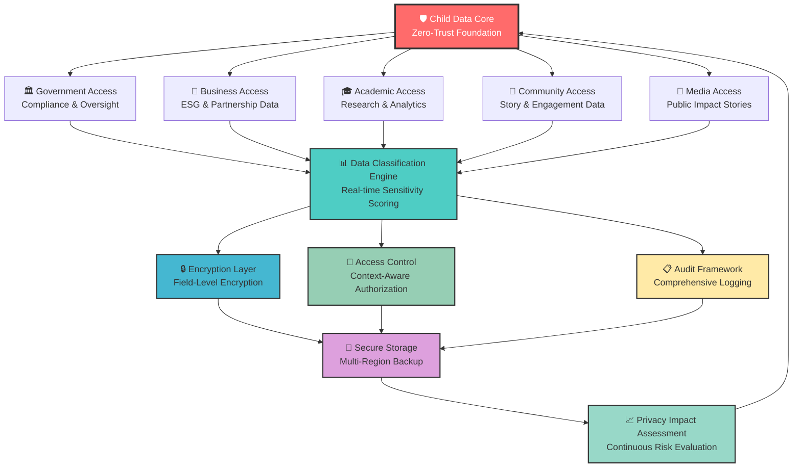

# Data Protection Architecture
## Comprehensive Privacy and Protection Framework for Vulnerable Children

> **Mission**: Implement a comprehensive data protection architecture that prioritizes child safety through privacy-by-design principles, compliance with international data protection standards, and stakeholder-appropriate data access controls while enabling effective social impact measurement and collaboration.

---

## 🎯 Data Protection Philosophy

### Child-Centered Privacy Framework
All data protection measures prioritize the rights and safety of vulnerable children:

```yaml
Core Protection Principles:
  Privacy by Design: Default privacy settings for all child data
  Data Minimization: Collect only essential information for child welfare
  Purpose Limitation: Use data exclusively for child protection and welfare
  Age-Appropriate Controls: Special protections for children under 18

Child Welfare Integration:
  Best Interests Standard: UN Convention on Rights of the Child Article 3
  Evolving Capacities: Age-appropriate consent and participation
  Protection Priority: Safety takes precedence over convenience
  Cultural Sensitivity: Indonesian cultural values in privacy decisions
```

### Penta-Helix Data Governance Model
Collaborative data protection supporting multi-stakeholder engagement:



---

## 🔐 Data Classification Framework

### Child-Specific Data Classification
Comprehensive data sensitivity classification protecting vulnerable populations:

#### Classification Levels
```yaml
Level 1 - Public Child Impact Data:
  Description: Aggregated, anonymized impact metrics
  Examples:
    - Number of children served (no individual identification)
    - General geographic distribution (province level)
    - Program outcome statistics (anonymized)
    - Public success stories (with explicit consent)
  
  Protection Requirements:
    - No direct child identification possible
    - Statistical disclosure control applied
    - Regular review for inference risks
    - Public domain release approved by ethics board

Level 2 - Internal Program Data:
  Description: Operational data for program management
  Examples:
    - Orphanage capacity and resources (no child details)
    - Staff training records and certifications
    - Volunteer background check status (not details)
    - Budget and financial allocation data
  
  Protection Requirements:
    - Access limited to authorized staff
    - Encryption in transit and at rest
    - Regular access review and approval
    - Business continuity protection

Level 3 - Sensitive Child Welfare Data:
  Description: Identifiable information about children and families
  Examples:
    - Child profile information and photos
    - Health records and medical history
    - Educational progress and assessments
    - Family contact information and relationships
  
  Protection Requirements:
    - Field-level encryption with HSM key management
    - Multi-factor authentication required
    - Role-based access with approval workflows
    - Comprehensive audit logging with integrity protection

Level 4 - Highly Sensitive Protection Data:
  Description: Information requiring maximum protection
  Examples:
    - Child abuse or neglect case details
    - Legal custody and court documents
    - Psychological assessment reports
    - Emergency contact and safety procedures
  
  Protection Requirements:
    - Zero-knowledge encryption architecture
    - Air-gapped backup systems
    - Legal authority approval required for access
    - Tamper-evident storage with blockchain verification
```

### Data Handling Matrix by Stakeholder
```yaml
Government Stakeholders:
  Access Levels: Levels 1-4 (with legal authorization)
  Data Types:
    - Compliance and regulatory reporting (Level 2-3)
    - Child protection case coordination (Level 4)
    - Public policy impact assessment (Level 1-2)
  
  Special Protections:
    - Inter-agency data sharing agreements required
    - Legal framework compliance verification
    - Emergency access procedures for child safety
    - Cross-border data transfer protocols

Business Stakeholders:
  Access Levels: Levels 1-2 (strictly limited)
  Data Types:
    - CSR impact measurement and reporting (Level 1)
    - Partnership outcome assessment (Level 2)
    - Brand safety and reputation management (Level 1)
  
  Special Protections:
    - No direct child identification ever permitted
    - Contractual data protection obligations
    - Regular third-party security assessments
    - Data processing agreement compliance

Academic Stakeholders:
  Access Levels: Levels 1-3 (with IRB approval)
  Data Types:
    - Research datasets with anonymization (Level 1-2)
    - Longitudinal outcome studies (Level 3, de-identified)
    - Policy effectiveness research (Level 2-3)
  
  Special Protections:
    - Institutional Review Board approval required
    - Research ethics committee oversight
    - Publication review and approval process
    - Data destruction timelines and verification

Community Stakeholders:
  Access Levels: Levels 1-2 (highly restricted)
  Data Types:
    - Volunteer opportunity matching (Level 1)
    - Community impact stories (Level 1)
    - Local program coordination (Level 2)
  
  Special Protections:
    - Community leader approval for data access
    - Local cultural sensitivity review
    - Volunteer background check integration
    - Story consent and approval workflows

Media Stakeholders:
  Access Levels: Level 1 only (public information)
  Data Types:
    - Public impact stories and statistics (Level 1)
    - Press kit materials and resources (Level 1)
    - Campaign and awareness content (Level 1)
  
  Special Protections:
    - Media ethics committee review
    - Child consent and guardian approval
    - Image rights and usage restrictions
    - Fact-checking and verification processes
```

---

## 🛡️ Privacy-by-Design Implementation

### Technical Privacy Controls
Comprehensive technical implementation of privacy principles:

#### Data Minimization Engine
```yaml
Collection Minimization:
  Purpose-Driven Collection:
    - Data collection forms specify exact usage purpose
    - Optional vs. required field identification
    - Regular review of data collection necessity
    - Automated data purging for expired purposes
  
  Storage Minimization:
    - Automatic data lifecycle management
    - Retention policy automation with legal review
    - Secure data disposal with verification
    - Cross-system data synchronization controls

Processing Minimization:
  Access Control Integration:
    - Just-in-time access provisioning
    - Temporary access with automatic expiration
    - Context-aware data exposure limits
    - Real-time privacy impact scoring
```

#### Anonymization and Pseudonymization
```yaml
Child Identity Protection:
  Pseudonymization Framework:
    - Cryptographic pseudonym generation
    - Key separation with HSM protection
    - Regular pseudonym rotation schedules
    - Cross-system pseudonym consistency

  Anonymization Pipeline:
    - K-anonymity implementation (k≥5 for child data)
    - L-diversity for sensitive attributes
    - T-closeness for demographic protection
    - Differential privacy for research datasets

  Re-identification Risk Assessment:
    - Automated risk scoring algorithms
    - Regular external privacy audits
    - Stakeholder access impact assessment
    - Continuous monitoring for privacy drift
```

### Consent Management Framework
```yaml
Age-Appropriate Consent:
  Child Consent (Under 13):
    - Guardian consent required for all data processing
    - Visual and simple language consent forms
    - Regular consent reconfirmation (annually)
    - Easy withdrawal mechanisms with child-friendly interface
  
  Adolescent Consent (13-17):
    - Shared consent model (child + guardian)
    - Evolving capacity assessment framework
    - Independent consent for appropriate services
    - Privacy education and awareness programs
  
  Adult Consent (18+):
    - Full autonomy with comprehensive information
    - Granular consent for different data uses
    - Regular consent review and update options
    - Clear benefit communication and choice preservation

Dynamic Consent Management:
  Consent Tracking:
    - Blockchain-based consent ledger
    - Version control for consent changes
    - Cross-platform consent synchronization
    - Audit trail with tamper-evident logging
  
  Consent Withdrawal:
    - One-click withdrawal mechanisms
    - Automated data processing cessation
    - Data deletion with verification
    - Impact notification to relevant stakeholders
```

---

## 🌐 Compliance Architecture

### Multi-Jurisdictional Compliance Framework
Comprehensive compliance with international and local data protection laws:

#### Indonesian Data Protection Compliance
```yaml
Indonesian Legal Framework:
  UU No. 27/2022 (Personal Data Protection):
    - Legal basis establishment for child data processing
    - Data controller and processor responsibilities
    - Cross-border data transfer restrictions and safeguards
    - Individual rights implementation and response procedures
  
  Ministry of Communication Regulations:
    - Data localization requirements for sensitive data
    - Security standards and certification requirements
    - Incident notification timelines and procedures
    - Regular compliance audit and reporting obligations

Child Protection Specific:
  UU No. 35/2014 (Child Protection):
    - Best interests standard implementation
    - Child participation rights in data decisions
    - Protection from exploitation in data use
    - Cultural sensitivity in data handling practices
```

#### International Compliance Standards
```yaml
GDPR Compliance (European Data Protection):
  Article 8 (Child-Specific Protections):
    - Enhanced consent requirements for children
    - Information society service restrictions
    - Parental responsibility verification systems
    - Age verification mechanisms and privacy controls
  
  Data Subject Rights:
    - Right of access with child-appropriate presentation
    - Right to rectification with guardian involvement
    - Right to erasure (right to be forgotten)
    - Right to data portability with security considerations

COPPA Compliance (US Children's Privacy):
  Parental Consent Framework:
    - Verifiable parental consent mechanisms
    - Safe harbor compliance for educational content
    - Data sharing restrictions with third parties
    - Regular deletion of unnecessary child data

UN Convention on Rights of Child:
  Digital Rights Implementation:
    - Article 3 (Best interests standard)
    - Article 12 (Participation rights in digital decisions)
    - Article 16 (Privacy protection in digital environments)
    - Article 17 (Access to appropriate digital information)
```

### Regulatory Reporting and Transparency
```yaml
Compliance Monitoring:
  Real-time Compliance Dashboard:
    - GDPR compliance score with trend analysis
    - Indonesian law adherence monitoring
    - Child protection standard verification
    - Cross-border data flow tracking and approval
  
  Automated Reporting:
    - Data protection authority notifications
    - Breach notification with timeline compliance
    - Regular compliance attestation reports
    - Stakeholder transparency reporting

Privacy Impact Assessments:
  Continuous DPIA Process:
    - New feature privacy impact assessment
    - Regular system-wide privacy audits
    - Stakeholder involvement in privacy decisions
    - Child welfare impact consideration in all assessments
```

---

## 🔒 Data Security Implementation

### Encryption and Key Management
```yaml
Field-Level Encryption:
  Child Data Encryption:
    - AES-256 encryption for all child-identifiable data
    - Separate encryption keys per data classification level
    - Hardware Security Module (HSM) key protection
    - Regular key rotation with zero-downtime procedures
  
  Key Management Architecture:
    - Multi-region key distribution with geo-fencing
    - Role-based key access with approval workflows
    - Key escrow for legal compliance and emergency access
    - Cryptographic key lifecycle management automation

Transport Security:
  API Communication:
    - TLS 1.3 for all data transmission
    - Certificate pinning for mobile applications
    - Perfect Forward Secrecy implementation
    - Mutual TLS authentication for sensitive endpoints
```

### Data Loss Prevention (DLP)
```yaml
Content Monitoring:
  Child Data Detection:
    - Machine learning models for child data identification
    - Real-time scanning of data movements
    - Policy enforcement with automatic blocking
    - Alert generation for potential data exposure

  Cross-Border Data Transfer Controls:
    - Automated data classification before transfer
    - Legal basis verification for international transfers
    - Adequacy decision compliance checking
    - Standard contractual clauses automation
```

---

## 📊 Privacy Monitoring and Analytics

### Privacy Metrics and KPIs
```yaml
Technical Privacy Metrics:
  Data Protection Effectiveness:
    - Privacy policy compliance rate: >99%
    - Data breach incidents: Zero tolerance target
    - Consent withdrawal processing time: <24 hours
    - Privacy rights response time: <72 hours
  
  Child-Specific Metrics:
    - Age-appropriate consent success rate
    - Guardian involvement in consent decisions
    - Child privacy education engagement metrics
    - Privacy-friendly feature adoption rates

Stakeholder Privacy Satisfaction:
  Privacy Experience Metrics:
    - Stakeholder privacy satisfaction scores
    - Privacy control usability ratings
    - Trust metrics through regular surveys
    - Privacy transparency effectiveness measures
```

### Incident Response and Privacy Breach Management
```yaml
Privacy Incident Classification:
  Severity Levels:
    Level 1 (Critical - Child Safety Risk):
      - Unauthorized access to Level 4 child data
      - External data breach with child identification risk
      - Response Time: Immediate (within 1 hour)
      - Notification: Data protection authorities, guardians, management
    
    Level 2 (High - Compliance Risk):
      - Unauthorized internal access to sensitive data
      - System vulnerability with potential data exposure
      - Response Time: Within 4 hours
      - Notification: Compliance team, affected stakeholders
    
    Level 3 (Medium - Process Risk):
      - Consent processing errors or delays
      - Privacy policy violations without data exposure
      - Response Time: Within 24 hours
      - Notification: Privacy team, relevant stakeholders

Incident Response Procedures:
  Immediate Response:
    - Automated containment and isolation procedures
    - Forensic data collection with chain of custody
    - Impact assessment with child welfare consideration
    - Legal notification compliance automation
  
  Recovery and Improvement:
    - Root cause analysis with privacy focus
    - Process improvement implementation
    - Stakeholder communication and rebuilding trust
    - Regular incident response training and simulation
```

---

## 🤝 Stakeholder Privacy Collaboration

### Privacy by Default for Stakeholders
```yaml
Government Privacy Integration:
  Data Sharing Protocols:
    - Bilateral data sharing agreements with privacy safeguards
    - Regular privacy compliance verification
    - Secure government integration with privacy controls
    - Emergency access procedures with audit logging

Business Privacy Framework:
  Corporate Data Responsibilities:
    - Data processing agreements with strict privacy controls
    - Regular privacy compliance audits and certification
    - Privacy-aware business intelligence and reporting
    - Brand protection through privacy excellence

Academic Privacy Standards:
  Research Privacy Controls:
    - Institutional Review Board privacy assessment integration
    - Research data anonymization with verification
    - Publication privacy review and approval
    - Long-term research data retention with privacy safeguards

Community Privacy Empowerment:
  Community Privacy Education:
    - Digital literacy programs with privacy focus
    - Community leader privacy training and certification
    - Local privacy advocate development
    - Cultural privacy norm integration and respect

Media Privacy Ethics:
  Ethical Reporting Framework:
    - Child privacy protection in media coverage
    - Story consent with ongoing guardian involvement
    - Image rights management with expiration controls
    - Privacy-aware social media integration and guidelines
```

---

## 📞 Data Protection Support and Governance

### Data Protection Organization
```yaml
Privacy Team Structure:
  Data Protection Officer (DPO):
    - Legal compliance oversight and strategic guidance
    - Stakeholder privacy rights coordination
    - Regular privacy training and awareness programs
    - Data protection authority liaison and communication
  
  Privacy Engineering Team:
    - Technical privacy controls implementation
    - Privacy-by-design architecture development
    - Privacy impact assessment technical support
    - Continuous privacy monitoring and improvement

  Child Privacy Advocate:
    - Child-specific privacy needs assessment
    - Age-appropriate privacy education development
    - Guardian and child privacy rights support
    - Cultural sensitivity in privacy implementation
```

### Continuous Privacy Improvement
```yaml
Privacy Excellence Program:
  Regular Assessment:
    - Monthly privacy metrics review and analysis
    - Quarterly stakeholder privacy satisfaction surveys
    - Annual comprehensive privacy audit and certification
    - Continuous privacy training and capability development
  
  Innovation Integration:
    - Emerging privacy technology evaluation and adoption
    - Privacy research collaboration with academic institutions
    - Industry privacy best practice integration
    - Child privacy standard evolution and leadership
```

---

*Last Updated: August 2025 | Next Review: November 2025*
*Contact: privacy@merajutasa.id | Emergency: +62-xxx-xxx-xxxx*
