# Security Incident Response
## Emergency Response Framework for Child Protection Platform

> **Mission**: Implement comprehensive security incident response procedures that prioritize child safety, ensure rapid threat containment, and maintain stakeholder trust while providing transparent communication and continuous improvement in the face of security challenges.

---

## 🎯 Incident Response Philosophy

### Child-Centered Security Response
Security incident response prioritizing child safety and protection:

```yaml
Response Principles:
  Child Safety First: All incident response prioritizes vulnerable children's protection
  Rapid Response: Immediate action for child safety-related incidents
  Stakeholder Communication: Transparent, age-appropriate incident disclosure
  
Response Strategy:
  Zero Tolerance: No compromise on child safety incidents
  Continuous Learning: Every incident improves child protection
  Community Trust: Maintain stakeholder confidence through transparency
  Cultural Sensitivity: Response respecting Indonesian cultural context
```

### Penta-Helix Incident Response Model
Collaborative incident response supporting multi-stakeholder engagement:

```mermaid
graph TB
    subgraph "🚨 Incident Detection & Classification"
        A[🔍 Automated Detection<br/>AI/ML Threat Monitoring]
        B[👤 Human Reporting<br/>Stakeholder & Staff Reports]
        C[🔒 Security Tools<br/>SIEM, IDS, Vulnerability Scanners]
        D[🌐 External Intelligence<br/>Threat Feeds & Partner Alerts]
    end
    
    subgraph "⚡ Immediate Response Core"
        E[🎯 Incident Commander<br/>24/7 Response Leadership]
        F[🚨 Child Safety Assessment<br/>Risk Evaluation & Protection]
        G[🔒 Containment Engine<br/>Automated Threat Isolation]
        H[📞 Stakeholder Notification<br/>Real-time Communication]
    end
    
    subgraph "🏛️ Government Response Zone"
        I[📋 Regulatory Notification<br/>72-hour Compliance Reporting]
        J[⚖️ Law Enforcement<br/>Criminal Activity Coordination]
        K[🤝 Inter-Agency Coordination<br/>Cross-Government Response]
    end
    
    subgraph "🏢 Business Response Zone"
        L[📈 Business Continuity<br/>Service Restoration Priority]
        M[💰 Financial Impact<br/>Loss Assessment & Recovery]
        N[🤝 Partner Communication<br/>Vendor & Client Notification]
    end
    
    subgraph "🎓 Academic Response Zone"
        O[🔬 Research Data Protection<br/>Academic Asset Security]
        P[📚 Institutional Coordination<br/>University Partnership Security]
        Q[📖 Publication Impact<br/>Research Integrity Protection]
    end
    
    subgraph "👥 Community Response Zone"
        R[🛡️ Volunteer Safety<br/>Community Member Protection]
        S[📢 Public Communication<br/>Transparent Community Updates]
        T[🤝 Local Coordination<br/>Regional Response Support]
    end
    
    subgraph "📰 Media Response Zone"
        U[📺 Crisis Communication<br/>Media Relations & Messaging]
        V[📸 Content Protection<br/>Child Image & Story Security]
        W[📝 Public Relations<br/>Reputation Management]
    end
    
    subgraph "👶 Child Safety Emergency Core"
        X[🚨 Emergency Response<br/>Immediate Child Protection]
        Y[🏥 Healthcare Coordination<br/>Medical Emergency Response]
        Z[⚖️ Legal Protection<br/>Custody & Court Procedures]
        AA[🛡️ Guardian Notification<br/>Family Emergency Communication]
    end
    
    subgraph "🔄 Recovery & Learning"
        BB[📊 Forensic Analysis<br/>Evidence Collection & Preservation]
        CC[🔧 System Recovery<br/>Service Restoration & Hardening]
        DD[📚 Lessons Learned<br/>Process Improvement Integration]
        EE[🎯 Stakeholder Debrief<br/>Community Trust Rebuilding]
    end
    
    A --> E
    B --> E
    C --> E
    D --> E
    
    E --> F
    E --> G
    E --> H
    F --> G
    G --> H
    H --> F
    
    F --> I
    F --> L
    F --> O
    F --> R
    F --> U
    F --> X
    
    G --> J
    G --> M
    G --> P
    G --> S
    G --> V
    G --> Y
    
    H --> K
    H --> N
    H --> Q
    H --> T
    H --> W
    H --> Z
    H --> AA
    
    I --> BB
    L --> BB
    O --> BB
    R --> BB
    U --> BB
    X --> BB
    
    BB --> CC
    BB --> DD
    BB --> EE
    CC --> DD
    DD --> EE
    EE --> CC
    
    style A fill:#FFCDD2,stroke:#D32F2F,stroke-width:2px
    style B fill:#FFCDD2,stroke:#D32F2F,stroke-width:2px
    style C fill:#FFCDD2,stroke:#D32F2F,stroke-width:2px
    style D fill:#FFCDD2,stroke:#D32F2F,stroke-width:2px
    
    style E fill:#4ECDC4,stroke:#333,stroke-width:4px,color:#fff
    style F fill:#FF6B6B,stroke:#333,stroke-width:4px,color:#fff
    style G fill:#45B7D1,stroke:#333,stroke-width:4px,color:#fff
    style H fill:#96CEB4,stroke:#333,stroke-width:4px,color:#fff
    
    style X fill:#FF1744,stroke:#333,stroke-width:5px,color:#fff
    style Y fill:#FF1744,stroke:#333,stroke-width:5px,color:#fff
    style Z fill:#FF1744,stroke:#333,stroke-width:5px,color:#fff
    style AA fill:#FF1744,stroke:#333,stroke-width:5px,color:#fff
```



---

## 🚨 Incident Classification and Severity

### Child Safety-Focused Incident Classification
Comprehensive incident taxonomy prioritizing child protection:

#### Severity Level 1 - Critical Child Safety (Response: Immediate)
```yaml
Child Physical Safety Threats:
  Description: Immediate physical danger to children in orphanage care
  Examples:
    - Direct threats or violence against children
    - Unauthorized access to orphanage physical premises
    - Medical emergencies requiring immediate intervention
    - Natural disaster or emergency evacuation scenarios
  
  Response Time: <5 minutes detection, <15 minutes full response
  Response Team: Incident Commander, Child Protection Officer, Emergency Services
  Notifications: Local authorities, emergency services, guardians, management
  
  Immediate Actions:
    - Emergency services activation (police, medical, fire)
    - Child safety verification and protection protocols
    - Guardian and family immediate notification
    - Media communication strategy activation

Child Digital Safety Breaches:
  Description: Unauthorized access to sensitive child data or child exploitation content
  Examples:
    - Child personal data breach with identity exposure risk
    - Unauthorized photography or video of children
    - Attempted child exploitation through platform
    - Child abuse content discovered on platform
  
  Response Time: <10 minutes detection, <30 minutes containment
  Response Team: Security Lead, Child Protection Officer, Legal Counsel
  Notifications: Data protection authorities, law enforcement, affected families
  
  Immediate Actions:
    - Law enforcement notification and collaboration
    - Immediate data access restriction and audit
    - Child and family support service activation
    - Legal investigation and evidence preservation

Platform Security Compromise:
  Description: Complete or significant platform security breach affecting child data
  Examples:
    - Database breach exposing child personal information
    - Ransomware attack affecting child services delivery
    - Advanced persistent threat targeting child data
    - Insider threat with privileged access to child information
  
  Response Time: <15 minutes detection, <1 hour containment
  Response Team: Full incident response team activation
  Notifications: All stakeholders, regulatory authorities, international partners
  
  Immediate Actions:
    - Complete platform lockdown and isolation
    - Emergency backup system activation
    - International law enforcement coordination
    - Crisis communication plan implementation
```

#### Severity Level 2 - High Impact Security (Response: <1 hour)
```yaml
Data Protection Violations:
  Description: Significant data protection law violations or privacy breaches
  Examples:
    - GDPR compliance violation with potential fines
    - Indonesian data protection law breach
    - Unauthorized data transfer outside Indonesia
    - Privacy policy violation affecting multiple families
  
  Response Time: <30 minutes detection, <1 hour response
  Response Team: Compliance Officer, Security Team, Legal Counsel
  Notifications: Data protection authorities, affected individuals, partners
  
  Response Actions:
    - 72-hour regulatory notification preparation
    - Affected individual notification and support
    - Legal risk assessment and mitigation
    - Compliance remediation planning

Stakeholder System Compromise:
  Description: Security incidents affecting stakeholder systems or integration
  Examples:
    - Government system integration breach
    - Business partner data compromise
    - Academic research data unauthorized access
    - Community volunteer personal information exposure
  
  Response Time: <45 minutes detection, <2 hours response
  Response Team: Integration Lead, Security Team, Stakeholder Representatives
  Notifications: Affected stakeholders, integration partners, management
  
  Response Actions:
    - Stakeholder system isolation and assessment
    - Partnership agreement security review
    - Multi-party incident coordination
    - Integration security hardening

Operational Service Disruption:
  Description: Significant disruption to child welfare services delivery
  Examples:
    - Critical service unavailability affecting child care
    - Payment system compromise affecting donations
    - Communication system failure during emergency
    - Backup system failure during recovery
  
  Response Time: <1 hour detection, <4 hours restoration
  Response Team: Operations Lead, Technical Team, Business Continuity
  Notifications: Service users, stakeholders, management
  
  Response Actions:
    - Emergency service restoration procedures
    - Alternative service delivery activation
    - Stakeholder communication and coordination
    - Business continuity plan implementation
```

#### Severity Level 3 - Medium Impact Security (Response: <4 hours)
```yaml
Policy and Procedure Violations:
  Description: Security policy violations or procedure non-compliance
  Examples:
    - Staff access policy violation without data exposure
    - Vendor security standard non-compliance
    - Audit finding requiring immediate attention
    - Training requirement violation by staff
  
  Response Time: <2 hours detection, <4 hours response
  Response Team: Security Manager, HR Team, Compliance Officer
  Notifications: Affected departments, management, audit team
  
  Response Actions:
    - Policy violation investigation and documentation
    - Staff retraining and disciplinary action if needed
    - Process improvement and control enhancement
    - Compliance verification and reporting

Technical Vulnerability Exploitation:
  Description: Successful exploitation of technical vulnerabilities
  Examples:
    - Web application vulnerability exploitation
    - Network security control bypass
    - Social engineering attack success
    - Phishing attack affecting staff credentials
  
  Response Time: <4 hours detection, <8 hours mitigation
  Response Team: Technical Security Team, IT Operations
  Notifications: Technical team, security management, affected users
  
  Response Actions:
    - Vulnerability assessment and patching
    - Security control effectiveness review
    - User awareness and training enhancement
    - Technical monitoring and detection improvement

Third-Party Security Incidents:
  Description: Security incidents involving third-party services or vendors
  Examples:
    - Cloud service provider security incident
    - Software vendor vulnerability disclosure
    - Payment processor security notification
    - External audit security finding
  
  Response Time: <6 hours assessment, <12 hours response
  Response Team: Vendor Management, Security Team, Legal
  Notifications: Vendor representatives, affected services, management
  
  Response Actions:
    - Third-party incident impact assessment
    - Contract and SLA security review
    - Alternative vendor evaluation if needed
    - Service continuity and contingency planning
```

#### Severity Level 4 - Low Impact Security (Response: <24 hours)
```yaml
Minor Security Events:
  Description: Low-impact security events requiring documentation and review
  Examples:
    - Failed login attempts within normal thresholds
    - Routine security scan findings
    - Minor configuration drift detection
    - Standard security alert investigation
  
  Response Time: <12 hours detection, <24 hours documentation
  Response Team: Security Operations, System Administrators
  Notifications: Security team, relevant technical staff
  
  Response Actions:
    - Event documentation and analysis
    - Trend analysis and pattern recognition
    - Preventive measure evaluation
    - Security awareness and training updates
```

---

## ⚡ Immediate Response Procedures

### 24/7 Incident Response Operations
Round-the-clock incident response capability:

#### Incident Response Team Structure
```yaml
Incident Commander (24/7 Availability):
  Primary Role: Overall incident coordination and decision authority
  Responsibilities:
    - Incident severity assessment and classification
    - Response team activation and coordination
    - Stakeholder communication approval and oversight
    - Emergency decision-making authority for child safety
  
  Backup Coverage:
    - Primary: Chief Information Security Officer
    - Secondary: Chief Technology Officer
    - Emergency: Chief Executive Officer

Child Protection Officer (24/7 Availability):
  Primary Role: Child safety assessment and protection coordination
  Responsibilities:
    - Child safety risk assessment and mitigation
    - Guardian and family communication coordination
    - Child welfare service continuity assurance
    - Legal protection and advocacy coordination
  
  Backup Coverage:
    - Primary: Director of Child Services
    - Secondary: Licensed Social Worker
    - Emergency: Board Child Protection Committee Chair

Security Response Lead (24/7 Availability):
  Primary Role: Technical security response and containment
  Responsibilities:
    - Technical threat assessment and containment
    - Security tool activation and monitoring
    - Forensic evidence collection and preservation
    - Security recovery and hardening coordination
  
  Backup Coverage:
    - Primary: Senior Security Engineer
    - Secondary: DevOps Security Lead
    - Emergency: External Security Consultant

Communications Lead:
  Primary Role: Stakeholder communication and media relations
  Responsibilities:
    - Internal and external communication coordination
    - Media relations and public communications
    - Crisis communication plan implementation
    - Stakeholder notification and updates
  
  Backup Coverage:
    - Primary: Marketing Director
    - Secondary: External Relations Manager
    - Emergency: External PR Consultant
```

#### Emergency Contact and Escalation
```yaml
Primary Emergency Contacts:
  Incident Commander: +62-XXX-XXX-1001 (SMS, Call, WhatsApp)
  Child Protection Officer: +62-XXX-XXX-1002 (SMS, Call, WhatsApp)
  Security Response Lead: +62-XXX-XXX-1003 (SMS, Call, WhatsApp)
  
  Emergency Escalation Chain:
    Level 1: Incident Response Team (0-15 minutes)
    Level 2: Senior Management (15-30 minutes)
    Level 3: Board Emergency Committee (30-60 minutes)
    Level 4: External Emergency Services (As needed)

External Emergency Services:
  Indonesian National Police: 110
  Medical Emergency Services: 118
  Fire and Rescue Services: 113
  Child Protection Services: +62-XXX-XXX-2001
  
  International Emergency Contacts:
    UNICEF Indonesia Emergency: +62-XXX-XXX-3001
    Embassy Emergency Services: +62-XXX-XXX-4001
    International Child Protection: +1-XXX-XXX-5001

Regulatory and Legal Contacts:
  Indonesian Data Protection Authority: +62-XXX-XXX-6001
  Ministry of Social Affairs Emergency: +62-XXX-XXX-7001
  Legal Counsel Emergency: +62-XXX-XXX-8001
  Insurance Emergency Claims: +62-XXX-XXX-9001
```

### Automated Incident Detection and Response
```yaml
Automated Detection Systems:
  Security Information and Event Management (SIEM):
    - Real-time log analysis with machine learning anomaly detection
    - Child data access pattern monitoring with behavioral analysis
    - Automated threat hunting with international threat intelligence
    - Multi-source correlation with risk-based alerting
  
  Child Safety Monitoring:
    - Content analysis for inappropriate child-related material
    - Automated background check verification and alerts
    - Suspicious child interaction pattern detection
    - Emergency keyword and phrase monitoring
  
  Infrastructure Monitoring:
    - System performance and availability monitoring
    - Network intrusion detection and prevention
    - Malware and ransomware detection with sandboxing
    - Cloud security posture management and alerting

Automated Response Capabilities:
  Immediate Containment:
    - Automatic user account suspension for suspicious activity
    - Network traffic blocking and IP address blacklisting
    - Service isolation and quarantine procedures
    - Emergency system shutdown and backup activation
  
  Evidence Preservation:
    - Automated forensic image creation and preservation
    - Log file backup and integrity verification
    - Chain of custody documentation and timestamping
    - Legal hold activation and data preservation
  
  Notification Automation:
    - Incident response team automated notification
    - Stakeholder alert system with escalation rules
    - Regulatory notification preparation and submission
    - Media monitoring and alert coordination
```

---

## 👥 Stakeholder-Specific Incident Response

### Government Stakeholder Response Coordination
Specialized response procedures for government integration:

#### Regulatory Compliance Response
```yaml
Data Protection Authority Coordination:
  Indonesian Personal Data Protection Authority:
    - 72-hour breach notification compliance
    - Detailed incident report preparation and submission
    - Ongoing investigation cooperation and support
    - Remediation plan development and implementation
  
  International Data Protection Coordination:
    - GDPR compliance for European stakeholder data
    - Cross-border incident notification and coordination
    - International law enforcement cooperation
    - Multi-jurisdictional legal compliance management

Ministry Coordination:
  Ministry of Social Affairs:
    - Child welfare incident immediate notification
    - Social service delivery impact assessment
    - Emergency child protection service coordination
    - Policy compliance and regulatory reporting
  
  Ministry of Communication and Information Technology:
    - Platform security incident notification
    - Cybersecurity threat intelligence sharing
    - National cybersecurity coordination
    - Digital infrastructure protection collaboration

Law Enforcement Coordination:
  Indonesian National Police:
    - Criminal activity investigation cooperation
    - Digital evidence collection and preservation
    - Child exploitation case coordination
    - Cross-border law enforcement collaboration
  
  International Law Enforcement:
    - INTERPOL coordination for international incidents
    - Embassy and consulate notification procedures
    - Extradition and legal assistance coordination
    - International child protection agency collaboration
```

### Business Stakeholder Response Support
Corporate partner incident response coordination:

#### Business Continuity and Partner Communication
```yaml
Corporate Partner Notification:
  ESG and CSR Partner Communication:
    - Impact assessment on corporate social responsibility goals
    - Brand protection and reputation management support
    - Media relations coordination and crisis communication
    - Partnership agreement review and compliance verification
  
  Financial Partner Coordination:
    - Payment processor incident notification and coordination
    - Banking relationship management during incidents
    - Insurance claim preparation and submission
    - Financial audit and compliance during recovery

Vendor and Supplier Management:
  Third-Party Security Incident Coordination:
    - Vendor security incident assessment and response
    - Service level agreement enforcement during incidents
    - Alternative vendor activation and coordination
    - Contract renegotiation and security enhancement

Business Impact Assessment:
  Financial Impact Analysis:
    - Direct cost assessment and documentation
    - Indirect impact evaluation and quantification
    - Revenue protection and loss mitigation
    - Insurance coverage evaluation and claim preparation
  
  Operational Impact Management:
    - Service delivery continuity planning and execution
    - Customer and stakeholder communication
    - Business process modification and adaptation
    - Performance metric tracking and reporting
```

### Academic Stakeholder Research Protection
Research integrity and academic collaboration during incidents:

#### Research Data and Collaboration Security
```yaml
Institutional Review Board (IRB) Coordination:
  Research Ethics Compliance:
    - IRB incident notification and consultation
    - Research participant protection during incidents
    - Data anonymization and privacy protection verification
    - Research integrity maintenance and documentation
  
  Academic Collaboration Security:
    - University partnership incident notification
    - Collaborative research project impact assessment
    - Academic publication timeline and impact management
    - International research collaboration coordination

Research Data Protection:
  Data Integrity and Availability:
    - Research dataset backup and recovery procedures
    - Data version control and integrity verification
    - Collaborative research platform security maintenance
    - Academic data sharing agreement compliance

Publication and Dissemination Impact:
  Academic Publication Management:
    - Research publication timeline impact assessment
    - Peer review process security and integrity
    - Conference presentation modification and coordination
    - Academic reputation and institutional protection
```

### Community Stakeholder Safety and Communication
Community engagement and volunteer protection during incidents:

#### Community Safety and Communication
```yaml
Volunteer Safety and Coordination:
  Background Check and Safety Verification:
    - Volunteer safety assessment and verification during incidents
    - Background check system integrity and validation
    - Community volunteer communication and coordination
    - Local safety protocol activation and enforcement
  
  Community Engagement Continuity:
    - Community service delivery during incidents
    - Local volunteer coordination and safety management
    - Community leader notification and collaboration
    - Cultural sensitivity and local adaptation during response

Public Communication and Transparency:
  Community Information and Updates:
    - Transparent incident communication with privacy protection
    - Community meeting and information session coordination
    - Local media relations and communication management
    - Stakeholder feedback collection and response integration
  
  Community Trust and Confidence:
    - Trust rebuilding and confidence restoration activities
    - Community feedback integration and response improvement
    - Local partnership strengthening and collaboration
    - Cultural adaptation and sensitivity in communication
```

### Media Stakeholder Crisis Communication
Professional media relations and crisis communication:

#### Crisis Communication and Media Relations
```yaml
Media Relations Coordination:
  Press and Media Communication:
    - Crisis communication plan activation and execution
    - Press release preparation and distribution
    - Media interview coordination and spokesperson training
    - Social media monitoring and response coordination
  
  Content and Story Protection:
    - Child privacy protection in media coverage
    - Story and content review during crisis situations
    - Image rights and usage restriction during incidents
    - Editorial guideline enforcement and compliance

Public Relations and Reputation Management:
  Brand Protection and Reputation:
    - Brand protection strategy during crisis situations
    - Reputation monitoring and damage assessment
    - Public opinion tracking and sentiment analysis
    - Stakeholder perception management and improvement
  
  Crisis Communication Excellence:
    - Message consistency and accuracy across all channels
    - Cultural sensitivity and appropriate tone management
    - Multilingual communication and translation coordination
    - Long-term reputation recovery and rebuilding planning
```

---

## 🔄 Recovery and Post-Incident Activities

### Comprehensive Recovery Operations
Systematic recovery and improvement procedures:

#### Technical Recovery and Hardening
```yaml
System Recovery Procedures:
  Service Restoration:
    - Priority service restoration based on child welfare impact
    - Data integrity verification and validation
    - Security hardening and control enhancement
    - Performance testing and optimization after recovery
  
  Infrastructure Hardening:
    - Vulnerability assessment and remediation
    - Security configuration review and enhancement
    - Monitoring and detection capability improvement
    - Backup and disaster recovery testing and validation

Data Recovery and Integrity:
  Data Restoration:
    - Data backup restoration with integrity verification
    - Database consistency checking and repair
    - Data migration and synchronization procedures
    - Cross-system data integrity validation
  
  Privacy and Protection Enhancement:
    - Data classification review and enhancement
    - Privacy control effectiveness assessment
    - Encryption and protection upgrade implementation
    - Access control review and tightening
```

#### Forensic Analysis and Evidence Management
```yaml
Digital Forensics and Investigation:
  Evidence Collection and Analysis:
    - Digital evidence collection with chain of custody
    - Forensic imaging and analysis procedures
    - Timeline reconstruction and incident analysis
    - Root cause analysis and contributing factor identification
  
  Legal and Compliance Support:
    - Legal evidence preparation and documentation
    - Regulatory investigation support and cooperation
    - Expert testimony preparation and coordination
    - International legal assistance and cooperation

Incident Documentation:
  Comprehensive Incident Record:
    - Detailed incident timeline and chronology
    - Response action documentation and effectiveness assessment
    - Decision-making rationale and authority documentation
    - Stakeholder communication record and feedback compilation
  
  Lessons Learned Integration:
    - Incident response effectiveness analysis
    - Process improvement identification and implementation
    - Training and awareness enhancement based on lessons learned
    - Policy and procedure update and refinement
```

### Stakeholder Debrief and Trust Rebuilding
```yaml
Stakeholder Communication and Rebuilding:
  Government Stakeholder Debrief:
    - Regulatory compliance assessment and improvement
    - Government partnership strengthening and collaboration
    - Policy recommendation and regulatory feedback
    - International cooperation and coordination enhancement
  
  Business Partner Confidence Restoration:
    - Business partnership review and strengthening
    - Corporate security standard alignment and improvement
    - ESG and CSR impact assessment and communication
    - Financial and insurance relationship management
  
  Academic Collaboration Continuation:
    - Research collaboration security enhancement
    - Academic partnership review and improvement
    - Research integrity verification and assurance
    - Publication and dissemination impact management
  
  Community Trust and Engagement:
    - Community meeting and feedback session organization
    - Volunteer safety and security enhancement
    - Local partnership strengthening and collaboration
    - Cultural sensitivity and adaptation improvement
  
  Media Relations and Reputation:
    - Media relationship rebuilding and improvement
    - Crisis communication effectiveness assessment
    - Brand protection and reputation management
    - Long-term public relations strategy development

Continuous Improvement Integration:
  Process Enhancement:
    - Incident response procedure improvement and refinement
    - Security control effectiveness enhancement
    - Training and awareness program improvement
    - Technology and tool capability advancement
  
  Organizational Learning:
    - Organizational resilience assessment and improvement
    - Crisis leadership and decision-making enhancement
    - Cross-functional collaboration and coordination improvement
    - Cultural and sensitivity awareness enhancement
```

---

## 📊 Incident Response Metrics and Reporting

### Performance Measurement and Improvement
Comprehensive metrics for incident response effectiveness:

#### Child Safety Response Metrics
```yaml
Child Protection Effectiveness:
  Response Time Metrics:
    - Child safety incident detection: <5 minutes target
    - Emergency response activation: <15 minutes target
    - Child safety verification: <30 minutes target
    - Guardian notification: <1 hour target
  
  Child Welfare Outcomes:
    - Zero child safety incidents with preventable harm
    - 100% child safety verification during incidents
    - Guardian satisfaction >95% with incident communication
    - Child welfare service continuity >99% during incidents

Security Response Performance:
  Technical Response Effectiveness:
    - Mean Time to Detection (MTTD): <15 minutes
    - Mean Time to Containment (MTTC): <1 hour
    - Mean Time to Recovery (MTTR): <4 hours
    - False Positive Rate: <5% for critical alerts
  
  Stakeholder Communication:
    - Stakeholder notification timeliness: 100% within SLA
    - Communication accuracy and completeness: >98%
    - Stakeholder satisfaction with communication: >90%
    - Media relations effectiveness during crisis: >85%

Compliance and Legal Metrics:
  Regulatory Compliance:
    - Regulatory notification timeliness: 100% within legal requirements
    - Compliance violation resolution: <30 days average
    - Legal investigation cooperation: 100% compliance
    - International coordination effectiveness: >90% success rate
```

#### Continuous Improvement Tracking
```yaml
Learning and Development:
  Incident Response Training:
    - Staff incident response training completion: 100% annually
    - Simulation exercise participation: 100% quarterly
    - Training effectiveness assessment: >90% competency
    - Cultural sensitivity training: 100% with annual refresh
  
  Process Improvement:
    - Lessons learned implementation: 100% within 90 days
    - Process enhancement based on incidents: Continuous improvement
    - Technology and tool advancement: Annual capability assessment
    - Stakeholder feedback integration: 100% consideration and response

Financial and Business Impact:
  Cost Management:
    - Incident response cost tracking and optimization
    - Insurance coverage effectiveness and claim success
    - Business continuity cost assessment and improvement
    - Long-term financial impact mitigation and management
  
  Operational Excellence:
    - Service availability during incidents: >99.5%
    - Business process continuity: >95% during major incidents
    - Stakeholder confidence and trust maintenance: >90%
    - Reputation protection and recovery effectiveness: Measurable improvement
```

---

## 📞 Emergency Contacts and Resources

### 24/7 Emergency Response Resources
Comprehensive emergency contact directory:

#### Internal Emergency Contacts
```yaml
Primary Response Team:
  Incident Commander: incident-commander@merajutasa.id | +62-XXX-XXX-1001
  Child Protection Officer: child-safety@merajutasa.id | +62-XXX-XXX-1002
  Security Response Lead: security-emergency@merajutasa.id | +62-XXX-XXX-1003
  Communications Lead: crisis-comms@merajutasa.id | +62-XXX-XXX-1004

Executive Leadership:
  Chief Executive Officer: ceo-emergency@merajutasa.id | +62-XXX-XXX-2001
  Chief Information Security Officer: ciso@merajutasa.id | +62-XXX-XXX-2002
  Chief Technology Officer: cto-emergency@merajutasa.id | +62-XXX-XXX-2003
  Legal Counsel: legal-emergency@merajutasa.id | +62-XXX-XXX-2004
```

#### External Emergency Resources
```yaml
Government and Regulatory:
  Indonesian National Police: 110
  Child Protection Services: +62-XXX-XXX-3001
  Data Protection Authority: +62-XXX-XXX-3002
  Ministry of Social Affairs: +62-XXX-XXX-3003

International Organizations:
  UNICEF Indonesia: +62-XXX-XXX-4001
  International Child Protection: +1-XXX-XXX-4002
  Embassy Emergency Services: +62-XXX-XXX-4003
  INTERPOL Indonesia: +62-XXX-XXX-4004

Technical and Security Support:
  Cloud Provider Emergency: 24/7 Enterprise Support
  Security Vendor Emergency: +1-XXX-XXX-5001
  Forensics Specialist: +62-XXX-XXX-5002
  Legal Technology Support: +62-XXX-XXX-5003
```

---

*Last Updated: August 2025 | Next Review: November 2025*
*Emergency Contact: security-incident@merajutasa.id | +62-XXX-XXX-9999*
