# Network Security Architecture
## Zero-Trust Network Infrastructure for Child Protection Platform

> **Mission**: Implement comprehensive network security architecture that creates secure communication channels for vulnerable children's data while enabling seamless collaboration among penta-helix stakeholders through zero-trust networking, microsegmentation, and defense-in-depth network controls.

---

## 🎯 Network Security Philosophy

### Child-Centered Network Protection
Network security architecture prioritizing child safety and data sovereignty:

```yaml
Network Security Principles:
  Zero Trust Network: Never trust, always verify network access
  Child Data Protection: Enhanced security for vulnerable population data
  Microsegmentation: Isolate child data from general platform traffic
  
Network Defense Strategy:
  Layered Protection: Multiple security controls at every network layer
  Stakeholder Access: Secure communication channels for all collaborators
  Real-time Monitoring: Continuous network threat detection and response
  Cultural Sensitivity: Network design respecting Indonesian infrastructure
```

### Penta-Helix Network Security Model
Secure network architecture supporting multi-stakeholder collaboration:

```mermaid
graph TB
    subgraph "🌐 Internet & External Networks"
        A[🏛️ Government Networks<br/>Secure Government Gateways]
        B[🏢 Business Networks<br/>Corporate VPN Connections]
        C[🎓 Academic Networks<br/>Research Institution Access]
        D[👥 Community Networks<br/>Public Internet & Mobile]
        E[📰 Media Networks<br/>Press & Communication Channels]
    end
    
    subgraph "🔒 Perimeter Security Layer"
        F[🛡️ Web Application Firewall<br/>DDoS Protection & Content Filtering]
        G[🔐 VPN Gateway<br/>Encrypted Stakeholder Connections]
        H[📡 API Gateway<br/>Rate Limiting & Authentication]
    end
    
    subgraph "🌐 Zero-Trust Network Core"
        I[🔍 Network Access Control<br/>Identity-Based Routing]
        J[🎯 Microsegmentation Engine<br/>Child Data Isolation]
        K[📊 Traffic Analysis<br/>Behavioral Monitoring]
    end
    
    subgraph "🏛️ Government Secure Zone"
        L[📋 Compliance Services<br/>Encrypted Communication]
        M[🚨 Emergency Response<br/>Priority Network Access]
    end
    
    subgraph "🏢 Business Secure Zone"
        N[💰 Payment Processing<br/>PCI DSS Compliance]
        O[📈 Analytics Services<br/>Business Intelligence]
    end
    
    subgraph "🎓 Academic Research Zone"
        P[🔬 Research Data Access<br/>Anonymized Datasets]
        Q[📚 Publication Services<br/>Secure Collaboration]
    end
    
    subgraph "👥 Community Engagement Zone"
        R[🤝 Volunteer Platform<br/>Background Check Integration]
        S[💝 Donation System<br/>Secure Transaction Processing]
    end
    
    subgraph "📰 Media Communication Zone"
        T[📸 Content Management<br/>Child Privacy Protection]
        U[📢 Public Relations<br/>Story Distribution]
    end
    
    subgraph "👶 Child Data Core"
        V[🛡️ Child Profile Service<br/>Maximum Security Zone]
        W[🏥 Healthcare Records<br/>Medical Data Protection]
        X[📚 Education Records<br/>Academic Progress Tracking]
        Y[⚖️ Legal Documents<br/>Custody & Court Records]
    end
    
    A --> F
    B --> F
    C --> F
    D --> F
    E --> F
    
    F --> G
    F --> H
    G --> I
    H --> I
    
    I --> J
    I --> K
    J --> K
    
    K --> L
    K --> N
    K --> P
    K --> R
    K --> T
    
    L --> M
    N --> O
    P --> Q
    R --> S
    T --> U
    
    J --> V
    J --> W
    J --> X
    J --> Y
    
    style A fill:#E8F4FD,stroke:#1E88E5,stroke-width:2px
    style B fill:#E8F5E8,stroke:#43A047,stroke-width:2px
    style C fill:#FFF3E0,stroke:#FB8C00,stroke-width:2px
    style D fill:#F3E5F5,stroke:#8E24AA,stroke-width:2px
    style E fill:#FFEBEE,stroke:#E53935,stroke-width:2px
    
    style F fill:#FFCDD2,stroke:#D32F2F,stroke-width:3px
    style G fill:#FFCDD2,stroke:#D32F2F,stroke-width:3px
    style H fill:#FFCDD2,stroke:#D32F2F,stroke-width:3px
    
    style I fill:#E1F5FE,stroke:#0277BD,stroke-width:3px
    style J fill:#E8F5E8,stroke:#2E7D32,stroke-width:3px
    style K fill:#FFF9C4,stroke:#F57F17,stroke-width:3px
    
    style V fill:#FF6B6B,stroke:#333,stroke-width:4px,color:#fff
    style W fill:#FF6B6B,stroke:#333,stroke-width:4px,color:#fff
    style X fill:#FF6B6B,stroke:#333,stroke-width:4px,color:#fff
    style Y fill:#FF6B6B,stroke:#333,stroke-width:4px,color:#fff
```



---

## 🌐 Zero-Trust Network Architecture

### Core Zero-Trust Principles Implementation
Comprehensive zero-trust networking specifically designed for child welfare:

#### Identity-Centric Network Security
```yaml
Network Identity Framework:
  Device Authentication:
    - Certificate-based device identification
    - Hardware security module (HSM) integration
    - Continuous device posture assessment
    - Mobile device management (MDM) enforcement
  
  User Identity Integration:
    - Multi-factor authentication for network access
    - Biometric authentication for sensitive data access
    - Risk-based authentication with behavioral analysis
    - Session management with automatic timeout controls
  
  Service Identity:
    - Mutual TLS (mTLS) for all service communication
    - Service mesh identity with automatic certificate rotation
    - API-level authentication and authorization
    - Microservices zero-trust communication patterns

Network Access Control:
  Adaptive Access:
    - Context-aware access decisions based on user role and risk
    - Geographic access restrictions for child data
    - Time-based access controls for enhanced security
    - Emergency access procedures with enhanced logging
  
  Continuous Verification:
    - Real-time security posture assessment
    - Behavioral anomaly detection and response
    - Regular re-authentication and authorization checks
    - Automated threat response with access revocation
```

#### Network Microsegmentation Strategy
```yaml
Child Data Protection Zones:
  Maximum Security Zone (Child Core):
    Purpose: Child personal data, medical records, legal documents
    Access: Extremely restricted, multi-approval required
    Controls:
      - Air-gapped network segments where possible
      - Hardware security module encryption
      - Biometric authentication required
      - Real-time monitoring with instant alerting
      - Zero lateral movement allowed
  
  High Security Zone (Child Services):
    Purpose: Child welfare services, case management, educational records
    Access: Role-based with approval workflows
    Controls:
      - Network segmentation with strict firewall rules
      - Encrypted communication channels only
      - Multi-factor authentication required
      - Regular access reviews and certifications
      - Limited lateral movement with monitoring
  
  Medium Security Zone (Operations):
    Purpose: Orphanage operations, volunteer coordination, general administration
    Access: Standard authentication with monitoring
    Controls:
      - Standard network segmentation
      - Encrypted communications preferred
      - Single sign-on integration
      - Regular security training requirements
      - Monitored lateral movement
  
  Controlled Public Zone (Community):
    Purpose: Public information, community engagement, media content
    Access: Public with registration and moderation
    Controls:
      - Rate limiting and DDoS protection
      - Content filtering and moderation
      - Basic authentication for contributors
      - Public content approval workflows
      - No access to internal networks

Stakeholder Network Segmentation:
  Government Secure Enclave:
    Network Characteristics:
      - Dedicated VPN tunnels with government-grade encryption
      - Compliance-focused network monitoring and logging
      - Inter-agency secure communication channels
      - Emergency access protocols for child protection
    
    Security Controls:
      - Government identity federation integration
      - Compliance reporting and audit trail automation
      - Cross-border data transfer compliance enforcement
      - Legal hold and data preservation capabilities
  
  Business Partner Network:
    Network Characteristics:
      - Secure API gateways with rate limiting
      - Business intelligence data access controls
      - Corporate VPN integration support
      - Brand protection and reputation monitoring
    
    Security Controls:
      - Corporate identity provider integration
      - Financial transaction security (PCI DSS)
      - Intellectual property protection measures
      - Partnership agreement enforcement automation
  
  Academic Research Network:
    Network Characteristics:
      - Research data access with anonymization
      - Institutional VPN and federation support
      - Collaborative research platform integration
      - Publication and peer review workflow support
    
    Security Controls:
      - Institutional Review Board (IRB) integration
      - Research ethics compliance monitoring
      - Data anonymization and de-identification
      - Academic integrity and plagiarism protection
  
  Community Engagement Network:
    Network Characteristics:
      - Public internet access with security controls
      - Mobile-optimized communication channels
      - Social media integration with privacy protection
      - Volunteer coordination and background check integration
    
    Security Controls:
      - Background check verification before network access
      - Community moderation and content filtering
      - Child safety reporting and response mechanisms
      - Digital literacy and safety education integration
  
  Media Communication Network:
    Network Characteristics:
      - Content distribution network (CDN) integration
      - Press kit and media asset access controls
      - Real-time communication and collaboration tools
      - Social media publishing and monitoring integration
    
    Security Controls:
      - Media ethics compliance monitoring
      - Child privacy protection in content distribution
      - Brand and reputation management controls
      - Crisis communication and emergency response protocols
```

---

## 🔒 Perimeter Security Controls

### Multi-Layer Perimeter Defense
Comprehensive perimeter protection adapted for Indonesian infrastructure:

#### Web Application Firewall (WAF) Implementation
```yaml
WAF Configuration:
  Primary WAF: Cloudflare Enterprise
    Features:
      - DDoS protection with 100+ Tbps capacity
      - Bot management with machine learning detection
      - Rate limiting with stakeholder-specific rules
      - Geographic access controls for Indonesian focus
      - Real-time threat intelligence integration
    
    Child Protection Rules:
      - Content filtering for child safety compliance
      - Automated blocking of known child exploitation threats
      - Image and video content analysis for inappropriate material
      - Social engineering attack prevention and detection
  
  Secondary WAF: AWS WAF
    Features:
      - Application-specific protection rules
      - SQL injection and XSS prevention
      - Custom rule sets for orphanage management workflows
      - Integration with AWS Shield for enhanced DDoS protection
    
    Compliance Rules:
      - GDPR compliance enforcement for European users
      - Indonesian data protection law compliance
      - COPPA compliance for child-specific protections
      - UNICEF digital child protection standard implementation

Traffic Analysis and Filtering:
  Real-time Traffic Monitoring:
    - Machine learning-based anomaly detection
    - Behavioral analysis for user and application traffic
    - Automated threat response with immediate blocking
    - Integration with threat intelligence feeds for proactive protection
  
  Content Security Controls:
    - Deep packet inspection for child safety compliance
    - Malware detection and prevention in uploaded content
    - Data loss prevention (DLP) for sensitive child information
    - Encrypted communication enforcement with fallback protection
```

#### VPN and Secure Access Gateway
```yaml
VPN Infrastructure:
  Government VPN Connections:
    Technology: IPsec VPN with AES-256 encryption
    Authentication: Certificate-based with hardware tokens
    Monitoring: Real-time connection monitoring and logging
    Compliance: Government security standards and audit requirements
  
  Business Partner VPN:
    Technology: SSL VPN with multi-factor authentication
    Access Control: Role-based access with time restrictions
    Monitoring: Business activity monitoring and reporting
    Integration: Corporate identity provider federation support
  
  Remote Worker Access:
    Technology: Zero Trust Network Access (ZTNA) solution
    Security: Device compliance verification and posture assessment
    User Experience: Single sign-on with seamless access
    Mobile Support: Mobile device VPN with automatic connection

Secure Access Service Edge (SASE):
  Network Architecture:
    - Cloud-native security service delivery
    - Global point of presence (PoP) for Indonesian optimization
    - Software-defined perimeter (SDP) implementation
    - Secure web gateway (SWG) integration
  
  Security Services:
    - Cloud access security broker (CASB) integration
    - Data loss prevention (DLP) for cloud applications
    - Secure DNS with threat intelligence integration
    - Zero-day threat protection with sandboxing
```

---

## 🔍 Network Monitoring and Detection

### Comprehensive Network Observability
Real-time network monitoring focused on child data protection:

#### Security Information and Event Management (SIEM)
```yaml
SIEM Architecture:
  Primary SIEM: Splunk Enterprise Security
    Data Sources:
      - Network device logs (firewalls, routers, switches)
      - Application logs from all microservices
      - Security tool logs (WAF, IDS/IPS, antivirus)
      - User behavior analytics and authentication logs
    
    Child Protection Monitoring:
      - Unauthorized access attempts to child data
      - Unusual data access patterns and bulk downloads
      - Failed authentication attempts with geographic analysis
      - Data exfiltration detection and automatic response
  
  Threat Intelligence Integration:
    - Real-time threat feed consumption and correlation
    - Child exploitation threat database integration
    - Geopolitical threat monitoring for Indonesian context
    - Automated threat hunting with machine learning
  
  Incident Response Integration:
    - Automated alert prioritization based on child data risk
    - Incident escalation workflows with stakeholder notification
    - Forensic data collection and preservation
    - Compliance reporting and regulatory notification automation

Network Detection and Response (NDR):
  Traffic Analysis:
    - Deep packet inspection for anomaly detection
    - Machine learning-based behavior analysis
    - Lateral movement detection and prevention
    - Command and control (C2) communication blocking
  
  Automated Response:
    - Real-time threat isolation and quarantine
    - Automatic firewall rule updates and blocking
    - User account suspension for suspicious activity
    - Emergency response team notification and escalation
```

#### Network Performance and Security Metrics
```yaml
Key Performance Indicators (KPIs):
  Security Metrics:
    - Mean Time to Detection (MTTD): <5 minutes for critical threats
    - Mean Time to Response (MTTR): <15 minutes for child data threats
    - False Positive Rate: <2% for security alerts
    - Security Incident Escalation: <1 hour for high-severity incidents
  
  Network Performance:
    - Network Latency: <100ms within Indonesia
    - Throughput: 99.9% of expected performance
    - Availability: 99.99% uptime for child services
    - Error Rate: <0.1% for critical child welfare operations
  
  Compliance Metrics:
    - Audit Log Completeness: 100% for child data access
    - Compliance Reporting Accuracy: >99.5%
    - Data Protection Compliance: 100% for GDPR and local laws
    - Security Standard Adherence: ISO 27001 and NIST compliance

Child-Specific Monitoring:
  Enhanced Child Data Protection:
    - Real-time monitoring of all child data access
    - Automated detection of policy violations
    - Enhanced logging for child-related activities
    - Priority response for child safety incidents
  
  Stakeholder Activity Monitoring:
    - Government access monitoring with compliance reporting
    - Business partner activity tracking with contract compliance
    - Academic research access with ethics committee oversight
    - Community volunteer activity with background check verification
    - Media access with child privacy protection enforcement
```

---

## 🚀 Network Infrastructure and Scalability

### Cloud-Native Network Architecture
Scalable network infrastructure optimized for Indonesian deployment:

#### Multi-Region Network Design
```yaml
Primary Region: ap-southeast-1 (Singapore)
  Purpose: Primary production environment with lowest latency to Indonesia
  Network Configuration:
    - Three Availability Zones for high availability
    - Dedicated VPC with public and private subnets
    - NAT Gateway for secure outbound internet access
    - VPC Endpoints for AWS service access without internet routing
  
  Security Configuration:
    - Private subnet isolation for sensitive workloads
    - Network ACLs for subnet-level security controls
    - Security groups for instance-level firewall rules
    - VPC Flow Logs for comprehensive network monitoring

Secondary Region: ap-southeast-3 (Jakarta)
  Purpose: Data residency compliance and disaster recovery
  Network Configuration:
    - Hot standby environment with automatic failover
    - Cross-region VPC peering for secure data replication
    - Local internet gateway for Indonesian traffic optimization
    - Regional CDN integration for content delivery
  
  Compliance Configuration:
    - Indonesian data localization compliance
    - Local regulatory reporting and monitoring
    - Cultural adaptation for local user experience
    - Government integration with local infrastructure

Disaster Recovery Region: ap-northeast-1 (Tokyo)
  Purpose: Business continuity and additional data protection
  Network Configuration:
    - Cold standby with rapid activation capabilities
    - Automated backup and replication systems
    - Regional isolation for maximum protection
    - Emergency access and communication channels
```

#### Content Delivery Network (CDN) Strategy
```yaml
CDN Architecture:
  Primary CDN: CloudFlare Global Network
    Indonesian Optimization:
      - Edge servers in Jakarta, Surabaya, and Medan
      - Bandwidth optimization for mobile connections
      - Image and video optimization for diverse device capabilities
      - Caching strategies optimized for Indonesian user behavior
    
    Security Integration:
      - DDoS protection at the edge
      - Web application firewall integration
      - Bot management and fraud detection
      - Child safety content filtering at the edge
  
  Backup CDN: AWS CloudFront
    Features:
      - Global edge network with Asian optimization
      - Integration with AWS services and security tools
      - Real-time analytics and performance monitoring
      - Cost optimization with intelligent caching

Media and Content Security:
  Child-Safe Content Delivery:
    - Automated content analysis and filtering
    - Age-appropriate content optimization
    - Parental control integration and support
    - Safe search and browsing enforcement
  
  Stakeholder Content Optimization:
    - Government document secure delivery
    - Business presentation and report optimization
    - Academic research paper secure distribution
    - Community story and media asset delivery
    - Press kit and media content distribution
```

---

## 🛡️ Network Security Incident Response

### Network-Specific Incident Response Framework
Specialized incident response procedures for network security threats:

#### Network Incident Classification
```yaml
Critical Network Incidents (Response: Immediate):
  Child Data Network Breach:
    Description: Unauthorized access to child data network segments
    Response Time: <5 minutes detection, <15 minutes containment
    Response Team: Security team, child protection officer, legal counsel
    Notifications: Data protection authorities, affected guardians, management
  
  Infrastructure Compromise:
    Description: Compromise of core network infrastructure
    Response Time: <10 minutes detection, <30 minutes containment
    Response Team: Network operations, security team, infrastructure lead
    Notifications: All stakeholders, regulatory authorities, service providers

High-Priority Network Incidents (Response: <1 hour):
  Stakeholder Network Intrusion:
    Description: Unauthorized access to stakeholder network segments
    Response Time: <15 minutes detection, <1 hour containment
    Response Team: Security team, affected stakeholder representatives
    Notifications: Affected stakeholders, compliance team, management
  
  DDoS Attack:
    Description: Distributed denial of service affecting platform availability
    Response Time: <5 minutes detection, <30 minutes mitigation
    Response Team: Network operations, security team, CDN provider
    Notifications: Operations team, affected stakeholders, service providers

Medium-Priority Network Incidents (Response: <4 hours):
  Policy Violation:
    Description: Network policy violations or unauthorized network changes
    Response Time: <30 minutes detection, <4 hours resolution
    Response Team: Network operations, compliance team
    Notifications: Network team, compliance officer, affected departments
```

#### Automated Network Response Procedures
```yaml
Immediate Automated Response:
  Threat Detection Response:
    - Automatic firewall rule creation and IP blocking
    - Traffic redirection through enhanced security controls
    - User session termination for suspicious activity
    - Emergency network isolation for compromised systems
  
  Child Data Protection:
    - Immediate access revocation for child data networks
    - Enhanced monitoring activation for child-related traffic
    - Automated backup and data preservation procedures
    - Emergency notification to child protection authorities

Recovery and Forensic Procedures:
  Network Forensics:
    - Automated network traffic capture and preservation
    - Log collection and analysis for incident investigation
    - Chain of custody maintenance for legal proceedings
    - Digital evidence preservation with integrity verification
  
  Recovery Planning:
    - Network service restoration with security verification
    - Stakeholder communication and trust rebuilding
    - Lesson learned integration and procedure improvement
    - Regular incident response training and simulation
```

---

## 📊 Network Security Governance

### Network Security Organization and Responsibilities
Comprehensive governance framework for network security management:

#### Network Security Team Structure
```yaml
Network Security Leadership:
  Chief Information Security Officer (CISO):
    Responsibilities:
      - Overall network security strategy and governance
      - Stakeholder security communication and reporting
      - Regulatory compliance and audit coordination
      - Emergency response and crisis management
  
  Network Security Manager:
    Responsibilities:
      - Day-to-day network security operations management
      - Security tool implementation and maintenance
      - Team coordination and incident response leadership
      - Network security metrics and reporting

Technical Network Security Team:
  Network Security Engineer:
    Responsibilities:
      - Network security architecture design and implementation
      - Security tool configuration and maintenance
      - Threat analysis and vulnerability assessment
      - Technical documentation and procedure development
  
  Security Operations Center (SOC) Analyst:
    Responsibilities:
      - 24/7 network monitoring and threat detection
      - Security incident initial response and escalation
      - Log analysis and security event investigation
      - Regular security reports and trend analysis
  
  Network Forensics Specialist:
    Responsibilities:
      - Digital forensics and incident investigation
      - Evidence collection and legal procedure compliance
      - Advanced threat hunting and analysis
      - Expert testimony and legal support when required
```

#### Continuous Network Security Improvement
```yaml
Network Security Excellence Program:
  Regular Assessment and Improvement:
    - Monthly network security metrics review and analysis
    - Quarterly stakeholder security satisfaction surveys
    - Annual comprehensive network security audit
    - Continuous security training and certification programs
  
  Innovation and Technology Integration:
    - Emerging network security technology evaluation
    - Security research collaboration with academic institutions
    - Industry best practice integration and adaptation
    - Child protection technology leadership and innovation
  
  Stakeholder Collaboration:
    - Government security requirement integration
    - Business partner security standard alignment
    - Academic research security framework collaboration
    - Community security awareness and education
    - Media security and privacy protection enhancement
```

---

*Last Updated: August 2025 | Next Review: November 2025*
*Contact: network-security@merajutasa.id | Emergency: +62-xxx-xxx-xxxx*
