# Service Mesh Security Policies
## Zero-Trust Microservices Communication Framework for Child Protection Platform

> **Mission**: Implement comprehensive service mesh security policies that protect vulnerable children's data through zero-trust networking, automatic mTLS encryption, fine-grained access controls, and policy-driven microservices communication while enabling secure stakeholder collaboration and emergency response capabilities.

---

## 🎯 Service Mesh Security Philosophy

### Child-Centered Microservices Protection
Service mesh security policies prioritizing child safety across all service communications:

```yaml
Service Mesh Security Principles:
  Zero Trust Communication: Never trust, always verify service-to-service interactions
  Child Data Protection: Enhanced security for services handling child information
  Service Isolation: Strict isolation preventing unauthorized cross-service access
  Emergency Response: Secure service communication during child safety incidents

Protection Framework:
  Automatic mTLS: Mandatory mutual TLS for all service communications
  Policy Enforcement: Declarative security policies with automatic enforcement
  Traffic Management: Secure traffic routing with comprehensive monitoring
  Incident Response: Emergency service communication with security compliance
```

### Penta-Helix Service Mesh Security Model
Zero-trust service communication architecture supporting multi-stakeholder microservices:

```mermaid
graph TB
    subgraph "🌐 External Access Layer"
        A[🏛️ Government Gateway<br/>Secure API Access]
        B[🏢 Business Portal<br/>Partner API Gateway]
        C[🎓 Academic Interface<br/>Research API Access]
        D[👥 Community Platform<br/>Public API Gateway]
        E[📰 Media Interface<br/>Content API Access]
    end
    
    subgraph "🔒 Service Mesh Control Plane"
        F[🛡️ Istio Control Plane<br/>Policy Management]
        G[🔐 Certificate Authority<br/>mTLS Certificate Management]
        H[📋 Policy Engine<br/>Authorization Decisions]
        I[📊 Telemetry Collection<br/>Observability & Monitoring]
    end
    
    subgraph "⚙️ Data Plane - Government Services"
        J[🏛️ Compliance Service<br/>Regulatory Reporting]
        K[🚨 Emergency Response<br/>Child Safety Coordination]
        L[📊 Government Analytics<br/>Policy Impact Assessment]
    end
    
    subgraph "⚙️ Data Plane - Business Services"
        M[💼 Partnership Management<br/>CSR Coordination]
        N[💰 Donation Processing<br/>Financial Transactions]
        O[📈 Impact Measurement<br/>ROI Analytics]
    end
    
    subgraph "⚙️ Data Plane - Academic Services"
        P[🔬 Research Platform<br/>Data Analysis]
        Q[📚 Publication Service<br/>Knowledge Sharing]
        R[🎓 Collaboration Platform<br/>Institutional Coordination]
    end
    
    subgraph "⚙️ Data Plane - Community Services"
        S[🤝 Volunteer Management<br/>Community Coordination]
        T[📍 Local Programs<br/>Community Services]
        U[📢 Community Engagement<br/>Awareness & Education]
    end
    
    subgraph "⚙️ Data Plane - Media Services"
        V[📸 Content Management<br/>Editorial Workflow]
        W[📢 Distribution Service<br/>Content Publishing]
        X[📊 Media Analytics<br/>Engagement Tracking]
    end
    
    subgraph "👶 Child Data Protection Services"
        Y[🛡️ Child Profile Service<br/>Personal Data Management]
        Z[🏥 Health Records<br/>Medical Information]
        AA[📚 Education Service<br/>Academic Progress]
        BB[⚖️ Legal Documents<br/>Custody & Court Records]
        CC[🔒 Guardian Consent<br/>Authorization Management]
    end
    
    subgraph "🔧 Platform Services"
        DD[🔐 Authentication Service<br/>Identity Verification]
        EE[📋 Authorization Service<br/>Access Control]
        FF[📊 Audit Service<br/>Comprehensive Logging]
        GG[🚨 Alert Service<br/>Emergency Notifications]
    end
    
    A --> F
    B --> F
    C --> F
    D --> F
    E --> F
    
    F --> G
    F --> H
    F --> I
    
    H --> J
    H --> M
    H --> P
    H --> S
    H --> V
    
    J --> K
    J --> L
    M --> N
    M --> O
    P --> Q
    P --> R
    S --> T
    S --> U
    V --> W
    V --> X
    
    H --> Y
    Y --> Z
    Y --> AA
    Y --> BB
    Y --> CC
    
    H --> DD
    DD --> EE
    EE --> FF
    FF --> GG
    
    style A fill:#E3F2FD,stroke:#1976D2,stroke-width:2px
    style B fill:#E8F5E8,stroke:#388E3C,stroke-width:2px
    style C fill:#FFF3E0,stroke:#F57C00,stroke-width:2px
    style D fill:#F3E5F5,stroke:#7B1FA2,stroke-width:2px
    style E fill:#FFEBEE,stroke:#D32F2F,stroke-width:2px
    
    style F fill:#FFCDD2,stroke:#D32F2F,stroke-width:4px
    style G fill:#FFCDD2,stroke:#D32F2F,stroke-width:4px
    style H fill:#FFCDD2,stroke:#D32F2F,stroke-width:4px
    style I fill:#FFCDD2,stroke:#D32F2F,stroke-width:4px
    
    style Y fill:#FF6B6B,stroke:#333,stroke-width:4px,color:#fff
    style Z fill:#FF6B6B,stroke:#333,stroke-width:4px,color:#fff
    style AA fill:#FF6B6B,stroke:#333,stroke-width:4px,color:#fff
    style BB fill:#FF6B6B,stroke:#333,stroke-width:4px,color:#fff
    style CC fill:#FF6B6B,stroke:#333,stroke-width:4px,color:#fff
```



---

## 🔐 Zero-Trust Service Communication Policies

### Mutual TLS (mTLS) Enforcement Policies
Comprehensive mTLS policies ensuring encrypted service-to-service communication:

#### Global mTLS Configuration
```yaml
apiVersion: security.istio.io/v1beta1
kind: PeerAuthentication
metadata:
  name: default-mtls-policy
  namespace: istio-system
spec:
  mtls:
    mode: STRICT
---
# Child Data Protection Services - Enhanced mTLS
apiVersion: security.istio.io/v1beta1
kind: PeerAuthentication
metadata:
  name: child-data-mtls-strict
  namespace: child-services
spec:
  mtls:
    mode: STRICT
  portLevelMtls:
    8080:
      mode: STRICT
    8443:
      mode: STRICT
---
# Emergency Services - Priority mTLS
apiVersion: security.istio.io/v1beta1
kind: PeerAuthentication
metadata:
  name: emergency-services-mtls
  namespace: emergency
spec:
  mtls:
    mode: STRICT
  selector:
    matchLabels:
      app: emergency-response
```

#### Service-Specific mTLS Policies
```yaml
# Government Services mTLS Configuration
apiVersion: security.istio.io/v1beta1
kind: PeerAuthentication
metadata:
  name: government-services-mtls
  namespace: government
spec:
  selector:
    matchLabels:
      tier: government
  mtls:
    mode: STRICT
  portLevelMtls:
    9090:  # Compliance reporting port
      mode: STRICT
    9443:  # Secure government API port
      mode: STRICT
---
# Business Services mTLS Configuration
apiVersion: security.istio.io/v1beta1
kind: PeerAuthentication
metadata:
  name: business-services-mtls
  namespace: business
spec:
  selector:
    matchLabels:
      tier: business
  mtls:
    mode: STRICT
  portLevelMtls:
    8080:  # Partnership API port
      mode: STRICT
    8443:  # Secure business API port
      mode: STRICT
---
# Academic Services mTLS Configuration
apiVersion: security.istio.io/v1beta1
kind: PeerAuthentication
metadata:
  name: academic-services-mtls
  namespace: academia
spec:
  selector:
    matchLabels:
      tier: academic
  mtls:
    mode: STRICT
  portLevelMtls:
    7080:  # Research API port
      mode: STRICT
    7443:  # Secure academic API port
      mode: STRICT
```

### Service-to-Service Authorization Policies
Fine-grained authorization controlling service communication access:

#### Child Data Protection Authorization
```yaml
# Child Profile Service - Maximum Protection
apiVersion: security.istio.io/v1beta1
kind: AuthorizationPolicy
metadata:
  name: child-profile-access-policy
  namespace: child-services
spec:
  selector:
    matchLabels:
      app: child-profile-service
  rules:
  - from:
    - source:
        principals: ["cluster.local/ns/child-services/sa/child-profile-client"]
        namespaces: ["child-services", "emergency"]
    to:
    - operation:
        methods: ["GET", "POST", "PUT"]
        paths: ["/api/v1/child/*"]
    when:
    - key: source.certificate_fingerprint
      values: ["*"]  # Verified certificate required
    - key: request.headers[x-child-access-reason]
      values: ["emergency", "care-coordination", "medical-emergency"]
  - from:
    - source:
        principals: ["cluster.local/ns/emergency/sa/emergency-response"]
    to:
    - operation:
        methods: ["GET", "POST"]
        paths: ["/api/v1/child/emergency/*"]
    when:
    - key: request.headers[x-emergency-authorization]
      values: ["verified"]
---
# Health Records Service - Medical Access Control
apiVersion: security.istio.io/v1beta1
kind: AuthorizationPolicy
metadata:
  name: health-records-access-policy
  namespace: child-services
spec:
  selector:
    matchLabels:
      app: health-records-service
  rules:
  - from:
    - source:
        principals: ["cluster.local/ns/child-services/sa/medical-staff"]
        namespaces: ["child-services", "medical", "emergency"]
    to:
    - operation:
        methods: ["GET", "POST", "PUT"]
        paths: ["/api/v1/health/*"]
    when:
    - key: source.certificate_fingerprint
      values: ["*"]  # Medical staff certificate required
    - key: request.headers[x-medical-license]
      values: ["verified"]
  - from:
    - source:
        principals: ["cluster.local/ns/emergency/sa/medical-emergency"]
    to:
    - operation:
        methods: ["GET", "POST"]
        paths: ["/api/v1/health/emergency/*"]
    when:
    - key: request.headers[x-emergency-medical-access]
      values: ["authorized"]
```

#### Stakeholder Service Authorization
```yaml
# Government Services Authorization
apiVersion: security.istio.io/v1beta1
kind: AuthorizationPolicy
metadata:
  name: government-service-access-policy
  namespace: government
spec:
  selector:
    matchLabels:
      app: compliance-reporting-service
  rules:
  - from:
    - source:
        principals: ["cluster.local/ns/government/sa/government-official"]
        namespaces: ["government"]
    to:
    - operation:
        methods: ["GET", "POST"]
        paths: ["/api/v1/compliance/*"]
    when:
    - key: source.certificate_fingerprint
      values: ["*"]  # Government certificate required
    - key: request.headers[x-government-authorization]
      values: ["verified"]
  - from:
    - source:
        principals: ["cluster.local/ns/child-services/sa/compliance-reporter"]
    to:
    - operation:
        methods: ["POST"]
        paths: ["/api/v1/compliance/report"]
    when:
    - key: request.headers[x-compliance-report-type]
      values: ["child-welfare", "safety-incident", "regulatory-update"]
---
# Business Services Authorization
apiVersion: security.istio.io/v1beta1
kind: AuthorizationPolicy
metadata:
  name: business-service-access-policy
  namespace: business
spec:
  selector:
    matchLabels:
      app: partnership-management-service
  rules:
  - from:
    - source:
        principals: ["cluster.local/ns/business/sa/business-partner"]
        namespaces: ["business"]
    to:
    - operation:
        methods: ["GET", "POST", "PUT"]
        paths: ["/api/v1/partnership/*"]
    when:
    - key: source.certificate_fingerprint
      values: ["*"]  # Business partner certificate required
    - key: request.headers[x-partnership-agreement]
      values: ["active", "verified"]
  - from:
    - source:
        principals: ["cluster.local/ns/analytics/sa/impact-measurement"]
    to:
    - operation:
        methods: ["GET"]
        paths: ["/api/v1/partnership/analytics"]
    when:
    - key: request.headers[x-analytics-purpose]
      values: ["impact-measurement", "csr-reporting"]
---
# Academic Services Authorization
apiVersion: security.istio.io/v1beta1
kind: AuthorizationPolicy
metadata:
  name: academic-service-access-policy
  namespace: academia
spec:
  selector:
    matchLabels:
      app: research-platform-service
  rules:
  - from:
    - source:
        principals: ["cluster.local/ns/academia/sa/researcher"]
        namespaces: ["academia"]
    to:
    - operation:
        methods: ["GET", "POST"]
        paths: ["/api/v1/research/*"]
    when:
    - key: source.certificate_fingerprint
      values: ["*"]  # Academic institution certificate required
    - key: request.headers[x-irb-approval]
      values: ["approved"]
    - key: request.headers[x-research-ethics]
      values: ["verified"]
  - from:
    - source:
        principals: ["cluster.local/ns/analytics/sa/research-analytics"]
    to:
    - operation:
        methods: ["GET"]
        paths: ["/api/v1/research/datasets/anonymized"]
    when:
    - key: request.headers[x-data-anonymization]
      values: ["verified"]
```

#### Emergency Access Authorization
```yaml
# Emergency Services - Priority Access
apiVersion: security.istio.io/v1beta1
kind: AuthorizationPolicy
metadata:
  name: emergency-access-policy
  namespace: emergency
spec:
  selector:
    matchLabels:
      app: emergency-response-service
  rules:
  - from:
    - source:
        principals: ["cluster.local/ns/emergency/sa/emergency-responder"]
        namespaces: ["emergency"]
    to:
    - operation:
        methods: ["GET", "POST", "PUT"]
        paths: ["/api/v1/emergency/*"]
    when:
    - key: source.certificate_fingerprint
      values: ["*"]  # Emergency responder certificate required
    - key: request.headers[x-emergency-authorization]
      values: ["verified"]
    - key: request.headers[x-emergency-type]
      values: ["child-safety", "medical-emergency", "security-incident"]
  - from:
    - source:
        principals: ["cluster.local/ns/child-services/sa/child-protection-officer"]
    to:
    - operation:
        methods: ["POST"]
        paths: ["/api/v1/emergency/child-safety/*"]
    when:
    - key: request.headers[x-child-protection-authorization]
      values: ["verified"]
    - key: request.headers[x-emergency-severity]
      values: ["critical", "high"]
---
# Emergency Override Policy - Break Glass Access
apiVersion: security.istio.io/v1beta1
kind: AuthorizationPolicy
metadata:
  name: emergency-override-policy
  namespace: emergency
spec:
  selector:
    matchLabels:
      emergency-override: "true"
  rules:
  - from:
    - source:
        principals: ["cluster.local/ns/emergency/sa/emergency-override"]
    to:
    - operation:
        methods: ["GET", "POST"]
        paths: ["/*"]
    when:
    - key: request.headers[x-emergency-override-authorization]
      values: ["legal-authority", "court-order", "child-protection-emergency"]
    - key: request.headers[x-emergency-override-reason]
      values: ["immediate-child-danger", "life-threatening-emergency"]
    - key: request.headers[x-emergency-override-duration]
      values: ["15-minutes", "30-minutes", "1-hour"]  # Time-limited access
```

---

## 🛡️ Traffic Management and Security Policies

### Secure Traffic Routing Policies
Comprehensive traffic management ensuring secure service communication:

#### Child Data Service Traffic Policies
```yaml
# Child Profile Service - Enhanced Security Routing
apiVersion: networking.istio.io/v1beta1
kind: VirtualService
metadata:
  name: child-profile-service-routing
  namespace: child-services
spec:
  hosts:
  - child-profile-service
  http:
  - match:
    - headers:
        x-child-access-reason:
          exact: emergency
    route:
    - destination:
        host: child-profile-service
        subset: emergency
      weight: 100
    fault:
      delay:
        percentage:
          value: 0  # No delay for emergency access
    retries:
      attempts: 3
      perTryTimeout: 10s
      retryOn: 5xx,reset,connect-failure,refused-stream
  - match:
    - headers:
        x-child-access-reason:
          exact: care-coordination
    route:
    - destination:
        host: child-profile-service
        subset: standard
      weight: 100
    timeout: 30s
    retries:
      attempts: 2
      perTryTimeout: 15s
  - route:  # Default route for authenticated access
    - destination:
        host: child-profile-service
        subset: standard
      weight: 100
    timeout: 60s
---
# Child Profile Service Destination Rules
apiVersion: networking.istio.io/v1beta1
kind: DestinationRule
metadata:
  name: child-profile-service-destination
  namespace: child-services
spec:
  host: child-profile-service
  trafficPolicy:
    tls:
      mode: ISTIO_MUTUAL  # Enforce mTLS
    connectionPool:
      tcp:
        maxConnections: 10
      http:
        http1MaxPendingRequests: 10
        http2MaxRequests: 100
        maxRequestsPerConnection: 5
        maxRetries: 3
        h2UpgradePolicy: UPGRADE
    circuitBreaker:
      consecutiveErrors: 3
      interval: 30s
      baseEjectionTime: 30s
      maxEjectionPercent: 50
      minHealthPercent: 50
  subsets:
  - name: emergency
    labels:
      version: v1
      priority: emergency
    trafficPolicy:
      connectionPool:
        tcp:
          maxConnections: 50  # Higher capacity for emergency
        http:
          http1MaxPendingRequests: 50
          http2MaxRequests: 500
  - name: standard
    labels:
      version: v1
      priority: standard
    trafficPolicy:
      connectionPool:
        tcp:
          maxConnections: 20
        http:
          http1MaxPendingRequests: 20
          http2MaxRequests: 200
```

#### Stakeholder Service Traffic Management
```yaml
# Government Services Traffic Policy
apiVersion: networking.istio.io/v1beta1
kind: VirtualService
metadata:
  name: government-services-routing
  namespace: government
spec:
  hosts:
  - compliance-reporting-service
  - emergency-coordination-service
  http:
  - match:
    - headers:
        x-government-priority:
          exact: emergency
    route:
    - destination:
        host: emergency-coordination-service
        subset: emergency
      weight: 100
    timeout: 10s  # Fast response for emergency
    retries:
      attempts: 5
      perTryTimeout: 2s
  - match:
    - headers:
        x-report-type:
          exact: compliance
    route:
    - destination:
        host: compliance-reporting-service
        subset: compliance
      weight: 100
    timeout: 120s  # Longer timeout for compliance reports
    retries:
      attempts: 3
      perTryTimeout: 40s
---
# Business Services Traffic Policy
apiVersion: networking.istio.io/v1beta1
kind: VirtualService
metadata:
  name: business-services-routing
  namespace: business
spec:
  hosts:
  - partnership-management-service
  - donation-processing-service
  http:
  - match:
    - headers:
        x-transaction-type:
          exact: donation
    route:
    - destination:
        host: donation-processing-service
        subset: secure
      weight: 100
    timeout: 45s
    retries:
      attempts: 3
      perTryTimeout: 15s
      retryOn: 5xx,reset,connect-failure
  - match:
    - headers:
        x-partnership-action:
          exact: management
    route:
    - destination:
        host: partnership-management-service
        subset: standard
      weight: 100
    timeout: 60s
---
# Academic Services Traffic Policy
apiVersion: networking.istio.io/v1beta1
kind: VirtualService
metadata:
  name: academic-services-routing
  namespace: academia
spec:
  hosts:
  - research-platform-service
  - publication-service
  http:
  - match:
    - headers:
        x-research-type:
          exact: longitudinal
    route:
    - destination:
        host: research-platform-service
        subset: research
      weight: 100
    timeout: 300s  # Longer timeout for research queries
    retries:
      attempts: 2
      perTryTimeout: 150s
  - match:
    - headers:
        x-publication-action:
          exact: submit
    route:
    - destination:
        host: publication-service
        subset: publication
      weight: 100
    timeout: 180s
```

### Circuit Breaker and Fault Tolerance Policies
```yaml
# Child Services - Enhanced Fault Tolerance
apiVersion: networking.istio.io/v1beta1
kind: DestinationRule
metadata:
  name: child-services-fault-tolerance
  namespace: child-services
spec:
  host: "*.child-services.svc.cluster.local"
  trafficPolicy:
    circuitBreaker:
      consecutiveErrors: 2  # Sensitive to errors for child services
      interval: 10s
      baseEjectionTime: 30s
      maxEjectionPercent: 25  # Conservative ejection for child services
      minHealthPercent: 75   # High availability required
    connectionPool:
      tcp:
        maxConnections: 100
        connectTimeout: 10s
        keepAlive:
          time: 7200s
          interval: 60s
      http:
        http1MaxPendingRequests: 50
        http2MaxRequests: 1000
        maxRequestsPerConnection: 10
        maxRetries: 5  # Higher retry count for child services
        consecutiveGatewayErrors: 3
        interval: 30s
        baseEjectionTime: 30s
---
# Emergency Services - Maximum Availability
apiVersion: networking.istio.io/v1beta1
kind: DestinationRule
metadata:
  name: emergency-services-fault-tolerance
  namespace: emergency
spec:
  host: "*.emergency.svc.cluster.local"
  trafficPolicy:
    circuitBreaker:
      consecutiveErrors: 5  # Higher tolerance for emergency services
      interval: 5s
      baseEjectionTime: 10s  # Quick recovery for emergency
      maxEjectionPercent: 10  # Minimal ejection for emergency
      minHealthPercent: 90   # Maximum availability required
    connectionPool:
      tcp:
        maxConnections: 500  # High capacity for emergency
        connectTimeout: 5s
      http:
        http1MaxPendingRequests: 200
        http2MaxRequests: 2000
        maxRequestsPerConnection: 50
        maxRetries: 10  # Maximum retry count for emergency
```

---

## 📊 Service Mesh Observability and Monitoring Policies

### Comprehensive Service Communication Monitoring
Advanced observability ensuring secure service mesh operations:

#### Telemetry Configuration for Child Data Services
```yaml
# Child Services Enhanced Telemetry
apiVersion: telemetry.istio.io/v1alpha1
kind: Telemetry
metadata:
  name: child-services-telemetry
  namespace: child-services
spec:
  metrics:
  - providers:
    - name: prometheus
  - overrides:
    - match:
        metric: ALL_METRICS
      tagOverrides:
        child_service: "true"
        security_level: "maximum"
        data_classification: "child_personal_data"
    - match:
        metric: REQUEST_COUNT
      tagOverrides:
        child_access_reason: "%{REQUEST_HEADERS[x-child-access-reason]}"
        guardian_consent: "%{REQUEST_HEADERS[x-guardian-consent]}"
    - match:
        metric: REQUEST_DURATION
      tagOverrides:
        emergency_access: "%{REQUEST_HEADERS[x-emergency-authorization]}"
  accessLogging:
  - providers:
    - name: child-services-audit-log
  - overrides:
    - match:
        mode: CLIENT
      disabled: false
    - match:
        mode: SERVER
      disabled: false
      format: |
        {
          "timestamp": "%START_TIME%",
          "method": "%REQ(:METHOD)%",
          "path": "%REQ(X-ENVOY-ORIGINAL-PATH?:PATH)%",
          "protocol": "%PROTOCOL%",
          "response_code": "%RESPONSE_CODE%",
          "duration": "%DURATION%",
          "upstream_service": "%UPSTREAM_CLUSTER%",
          "request_id": "%REQ(X-REQUEST-ID)%",
          "child_access_reason": "%REQ(X-CHILD-ACCESS-REASON)%",
          "guardian_consent": "%REQ(X-GUARDIAN-CONSENT)%",
          "emergency_authorization": "%REQ(X-EMERGENCY-AUTHORIZATION)%",
          "source_workload": "%{FILTER_STATE(wasm.source_workload)}%",
          "destination_service": "%{FILTER_STATE(wasm.destination_service)}%",
          "child_data_accessed": "%{FILTER_STATE(wasm.child_data_accessed)}%"
        }
---
# Emergency Services Priority Telemetry
apiVersion: telemetry.istio.io/v1alpha1
kind: Telemetry
metadata:
  name: emergency-services-telemetry
  namespace: emergency
spec:
  metrics:
  - providers:
    - name: prometheus
  - overrides:
    - match:
        metric: ALL_METRICS
      tagOverrides:
        emergency_service: "true"
        priority_level: "critical"
        response_time_sla: "30_seconds"
    - match:
        metric: REQUEST_COUNT
      tagOverrides:
        emergency_type: "%{REQUEST_HEADERS[x-emergency-type]}"
        emergency_severity: "%{REQUEST_HEADERS[x-emergency-severity]}"
    - match:
        metric: REQUEST_DURATION
      tagOverrides:
        child_safety_incident: "%{REQUEST_HEADERS[x-child-safety-incident]}"
  accessLogging:
  - providers:
    - name: emergency-services-audit-log
  - overrides:
    - match:
        mode: CLIENT
      disabled: false
    - match:
        mode: SERVER
      disabled: false
      format: |
        {
          "timestamp": "%START_TIME%",
          "method": "%REQ(:METHOD)%",
          "path": "%REQ(X-ENVOY-ORIGINAL-PATH?:PATH)%",
          "protocol": "%PROTOCOL%",
          "response_code": "%RESPONSE_CODE%",
          "duration": "%DURATION%",
          "emergency_type": "%REQ(X-EMERGENCY-TYPE)%",
          "emergency_severity": "%REQ(X-EMERGENCY-SEVERITY)%",
          "child_safety_incident": "%REQ(X-CHILD-SAFETY-INCIDENT)%",
          "emergency_authorization": "%REQ(X-EMERGENCY-AUTHORIZATION)%",
          "response_time_ms": "%DURATION%",
          "upstream_service": "%UPSTREAM_CLUSTER%",
          "request_id": "%REQ(X-REQUEST-ID)%"
        }
```

#### Distributed Tracing Configuration
```yaml
# Global Tracing Configuration
apiVersion: v1
kind: ConfigMap
metadata:
  name: istio-tracing-config
  namespace: istio-system
data:
  mesh: |
    defaultConfig:
      tracing:
        sampling: 100.0  # 100% sampling for child data services
        custom_tags:
          child_data_access:
            header:
              name: x-child-data-access
          stakeholder_type:
            header:
              name: x-stakeholder-type
          emergency_access:
            header:
              name: x-emergency-authorization
          guardian_consent:
            header:
              name: x-guardian-consent
      proxyStatsMatcher:
        inclusionRegexps:
        - ".*circuit_breakers.*"
        - ".*upstream_rq_retry.*"
        - ".*upstream_rq_pending.*"
        - ".*_cx_.*"
        - ".*child_data.*"
        - ".*emergency.*"
        exclusionRegexps:
        - ".*osconfig.*"
---
# Child Services Tracing Enhancement
apiVersion: telemetry.istio.io/v1alpha1
kind: Telemetry
metadata:
  name: child-services-tracing
  namespace: child-services
spec:
  tracing:
  - providers:
    - name: jaeger
  - customTags:
      child_service_accessed:
        header:
          name: x-child-service-accessed
      data_classification:
        literal:
          value: "child_personal_data"
      security_level:
        literal:
          value: "maximum"
      access_justification:
        header:
          name: x-child-access-reason
      guardian_authorization:
        header:
          name: x-guardian-consent
```

### Security Event Detection and Alerting
```yaml
# Security Event Detection Rules
apiVersion: security.istio.io/v1beta1
kind: AuthorizationPolicy
metadata:
  name: security-monitoring-policy
  namespace: istio-system
spec:
  rules:
  - from:
    - source:
        principals: ["cluster.local/ns/monitoring/sa/security-monitor"]
    to:
    - operation:
        methods: ["GET"]
        paths: ["/stats/prometheus", "/metrics"]
    when:
    - key: source.certificate_fingerprint
      values: ["*"]  # Monitoring certificate required
---
# Audit Log Configuration
apiVersion: v1
kind: ConfigMap
metadata:
  name: security-audit-config
  namespace: istio-system
data:
  audit-policy.yaml: |
    rules:
    - level: Metadata
      resources:
      - group: "security.istio.io"
        resources: ["authorizationpolicies", "peerauthentications"]
      namespaces: ["child-services", "emergency", "government", "business", "academia"]
    - level: RequestResponse
      resources:
      - group: ""
        resources: ["services", "endpoints"]
      namespaces: ["child-services", "emergency"]
      omitStages:
      - RequestReceived
    - level: Request
      users: ["system:serviceaccount:child-services:*"]
      verbs: ["get", "list", "create", "update", "patch", "delete"]
      resources:
      - group: ""
        resources: ["*"]
```

---

## 🚨 Emergency Service Mesh Policies

### Emergency Response Service Communication
Specialized policies ensuring rapid emergency response while maintaining security:

#### Emergency Access Policies
```yaml
# Emergency Override Service Mesh Policy
apiVersion: security.istio.io/v1beta1
kind: AuthorizationPolicy
metadata:
  name: emergency-override-mesh-policy
  namespace: istio-system
spec:
  selector:
    matchLabels:
      emergency-access: "enabled"
  rules:
  - from:
    - source:
        principals: ["cluster.local/ns/emergency/sa/emergency-coordinator"]
    to:
    - operation:
        methods: ["GET", "POST", "PUT"]
        paths: ["/*"]
    when:
    - key: request.headers[x-emergency-authorization]
      values: ["court-order", "child-protection-emergency", "medical-emergency"]
    - key: request.headers[x-emergency-duration]
      values: ["15-minutes", "30-minutes", "1-hour", "4-hours"]
    - key: request.headers[x-emergency-justification]
      values: ["immediate-child-danger", "life-threatening", "court-mandated"]
---
# Emergency Service Discovery Policy
apiVersion: networking.istio.io/v1beta1
kind: ServiceEntry
metadata:
  name: emergency-external-services
  namespace: emergency
spec:
  hosts:
  - emergency-response.government.id
  - child-protection.ministry.id
  - medical-emergency.health.id
  ports:
  - number: 443
    name: https
    protocol: HTTPS
  - number: 80
    name: http
    protocol: HTTP
  location: MESH_EXTERNAL
  resolution: DNS
---
# Emergency Traffic Priority
apiVersion: networking.istio.io/v1beta1
kind: VirtualService
metadata:
  name: emergency-priority-routing
  namespace: emergency
spec:
  hosts:
  - "*"
  gateways:
  - emergency-gateway
  http:
  - match:
    - headers:
        x-emergency-priority:
          exact: "critical"
    route:
    - destination:
        host: emergency-response-service
        subset: critical
      weight: 100
    timeout: 10s
    retries:
      attempts: 10
      perTryTimeout: 1s
      retryOn: 5xx,reset,connect-failure,refused-stream
  - match:
    - headers:
        x-child-safety-emergency:
          exact: "true"
    route:
    - destination:
        host: child-protection-service
        subset: emergency
      weight: 100
    timeout: 5s
    retries:
      attempts: 15
      perTryTimeout: 500ms
```

#### Emergency Circuit Breaker Bypass
```yaml
# Emergency Services - Circuit Breaker Override
apiVersion: networking.istio.io/v1beta1
kind: DestinationRule
metadata:
  name: emergency-circuit-breaker-override
  namespace: emergency
spec:
  host: "*.emergency.svc.cluster.local"
  trafficPolicy:
    circuitBreaker:
      consecutiveErrors: 50  # High tolerance for emergency
      interval: 1s
      baseEjectionTime: 1s   # Immediate recovery
      maxEjectionPercent: 0  # No ejection during emergency
      minHealthPercent: 0    # Continue even with unhealthy instances
    connectionPool:
      tcp:
        maxConnections: 1000  # Maximum capacity
        connectTimeout: 1s
      http:
        http1MaxPendingRequests: 1000
        http2MaxRequests: 10000
        maxRequestsPerConnection: 100
        maxRetries: 20  # Maximum retry attempts
        consecutiveGatewayErrors: 100
        interval: 1s
        baseEjectionTime: 1s
  portLevelSettings:
  - port:
      number: 8080
    circuitBreaker:
      consecutiveErrors: 100  # Even higher tolerance
      interval: 500ms
      baseEjectionTime: 500ms
      maxEjectionPercent: 0
---
# Emergency Failover Policy
apiVersion: networking.istio.io/v1beta1
kind: DestinationRule
metadata:
  name: emergency-failover-policy
  namespace: emergency
spec:
  host: emergency-response-service
  trafficPolicy:
    outlierDetection:
      consecutiveErrors: 100
      interval: 1s
      baseEjectionTime: 1s
      maxEjectionPercent: 0
      minHealthPercent: 0
    loadBalancer:
      simple: LEAST_CONN  # Optimal for emergency response
  subsets:
  - name: critical
    labels:
      priority: critical
    trafficPolicy:
      connectionPool:
        tcp:
          maxConnections: 500
        http:
          http1MaxPendingRequests: 500
          http2MaxRequests: 5000
  - name: emergency
    labels:
      priority: emergency
    trafficPolicy:
      connectionPool:
        tcp:
          maxConnections: 300
        http:
          http1MaxPendingRequests: 300
          http2MaxRequests: 3000
```

---

## 🔧 Service Mesh Policy Management and Governance

### Policy Lifecycle Management
Comprehensive governance ensuring consistent policy application:

#### Policy Validation and Testing
```yaml
# Policy Validation Webhook
apiVersion: admissionregistration.k8s.io/v1
kind: ValidatingAdmissionWebhook
metadata:
  name: istio-policy-validator
webhooks:
- name: policy.validation.istio.io
  clientConfig:
    service:
      name: istio-policy-validator
      namespace: istio-system
      path: /validate
  rules:
  - operations: ["CREATE", "UPDATE"]
    apiGroups: ["security.istio.io"]
    apiVersions: ["v1beta1"]
    resources: ["authorizationpolicies", "peerauthentications"]
  - operations: ["CREATE", "UPDATE"]
    apiGroups: ["networking.istio.io"]
    apiVersions: ["v1beta1"]
    resources: ["virtualservices", "destinationrules"]
  admissionReviewVersions: ["v1", "v1beta1"]
  sideEffects: None
  failurePolicy: Fail
---
# Child Services Policy Validation Rules
apiVersion: v1
kind: ConfigMap
metadata:
  name: child-services-policy-rules
  namespace: istio-system
data:
  validation-rules.yaml: |
    rules:
    - name: "child-services-mtls-required"
      description: "All child services must enforce strict mTLS"
      selector:
        namespace: "child-services"
      required:
        mtls: "STRICT"
    - name: "child-services-authorization-required"
      description: "All child services must have authorization policies"
      selector:
        namespace: "child-services"
      required:
        authorizationPolicy: true
    - name: "emergency-services-high-availability"
      description: "Emergency services must have high availability configuration"
      selector:
        namespace: "emergency"
      required:
        circuitBreaker:
          maxEjectionPercent: 10
          minHealthPercent: 90
```

#### Policy Deployment and Rollback
```yaml
# Policy Deployment Strategy
apiVersion: argoproj.io/v1alpha1
kind: Rollout
metadata:
  name: service-mesh-policy-rollout
  namespace: istio-system
spec:
  replicas: 3
  strategy:
    canary:
      steps:
      - setWeight: 10
      - pause:
          duration: 300s  # 5 minute pause for policy validation
      - setWeight: 25
      - pause:
          duration: 600s  # 10 minute pause for impact assessment
      - setWeight: 50
      - pause:
          duration: 900s  # 15 minute pause for comprehensive testing
      - setWeight: 75
      - pause:
          duration: 600s  # 10 minute pause before full deployment
      canaryService: istio-policy-canary
      stableService: istio-policy-stable
      trafficRouting:
        istio:
          virtualService:
            name: istio-policy-routing
          destinationRule:
            name: istio-policy-destination
            canarySubsetName: canary
            stableSubsetName: stable
      analysis:
        templates:
        - templateName: policy-impact-analysis
        args:
        - name: service-name
          value: istio-policy-service
        - name: namespace
          value: istio-system
        successCondition: result[0] == "passed"
        failureLimit: 3
        interval: 60s
        count: 5
---
# Policy Rollback Automation
apiVersion: v1
kind: ConfigMap
metadata:
  name: policy-rollback-automation
  namespace: istio-system
data:
  rollback-triggers.yaml: |
    triggers:
    - name: "child-service-access-failure"
      condition: "child_service_error_rate > 5%"
      action: "immediate_rollback"
      notification: ["security-team", "child-protection-officer"]
    - name: "emergency-service-latency"
      condition: "emergency_response_latency > 30s"
      action: "immediate_rollback"
      notification: ["emergency-coordinator", "platform-team"]
    - name: "security-policy-violation"
      condition: "unauthorized_access_attempts > 0"
      action: "immediate_rollback"
      notification: ["security-team", "compliance-officer"]
```

### Policy Compliance and Audit
```yaml
# Policy Compliance Scanner
apiVersion: batch/v1
kind: CronJob
metadata:
  name: service-mesh-policy-compliance-scan
  namespace: istio-system
spec:
  schedule: "0 */4 * * *"  # Every 4 hours
  jobTemplate:
    spec:
      template:
        spec:
          containers:
          - name: policy-compliance-scanner
            image: merajutasa/policy-compliance-scanner:v1.0.0
            env:
            - name: SCAN_NAMESPACES
              value: "child-services,emergency,government,business,academia"
            - name: COMPLIANCE_STANDARDS
              value: "child-protection,emergency-response,stakeholder-access"
            - name: ALERT_WEBHOOK
              value: "https://alerts.merajutasa.id/policy-compliance"
            command:
            - /bin/sh
            - -c
            - |
              echo "Starting policy compliance scan..."
              /app/scan-policies.sh
              echo "Policy compliance scan completed"
            volumeMounts:
            - name: scan-results
              mountPath: /app/results
          volumes:
          - name: scan-results
            persistentVolumeClaim:
              claimName: policy-scan-results
          restartPolicy: OnFailure
---
# Policy Audit Configuration
apiVersion: v1
kind: ConfigMap
metadata:
  name: service-mesh-audit-config
  namespace: istio-system
data:
  audit-rules.yaml: |
    auditRules:
    - name: "child-services-access-audit"
      namespace: "child-services"
      resources: ["authorizationpolicies", "peerauthentications"]
      verbs: ["get", "list", "create", "update", "delete"]
      level: "RequestResponse"
      retention: "7 years"  # Long-term retention for child data access
    - name: "emergency-services-audit"
      namespace: "emergency"
      resources: ["virtualservices", "destinationrules"]
      verbs: ["get", "list", "create", "update", "delete"]
      level: "Request"
      retention: "5 years"
    - name: "policy-changes-audit"
      namespaces: ["istio-system"]
      resources: ["authorizationpolicies", "peerauthentications", "virtualservices"]
      verbs: ["create", "update", "delete"]
      level: "RequestResponse"
      retention: "10 years"  # Permanent retention for policy changes
```

---

## 📈 Service Mesh Performance and Security Metrics

### Service Communication Performance Monitoring
Comprehensive metrics ensuring optimal service mesh performance:

#### Key Performance Indicators
```yaml
# Service Mesh Performance SLOs
apiVersion: v1
kind: ConfigMap
metadata:
  name: service-mesh-slos
  namespace: istio-system
data:
  performance-slos.yaml: |
    slos:
      child_services:
        latency_p99: "100ms"     # 99th percentile latency
        latency_p95: "50ms"      # 95th percentile latency
        latency_p50: "25ms"      # Median latency
        error_rate: "0.1%"       # Maximum error rate
        availability: "99.99%"   # Service availability
        mtls_coverage: "100%"    # mTLS encryption coverage
      
      emergency_services:
        latency_p99: "30ms"      # Faster response for emergency
        latency_p95: "15ms"      
        latency_p50: "10ms"      
        error_rate: "0.01%"      # Lower error tolerance
        availability: "99.999%"  # Higher availability requirement
        response_time: "30s"     # Emergency response time SLA
      
      stakeholder_services:
        government:
          latency_p99: "200ms"
          error_rate: "0.5%"
          availability: "99.9%"
        business:
          latency_p99: "500ms"
          error_rate: "1%"
          availability: "99.5%"
        academic:
          latency_p99: "1000ms"  # Longer timeout for research queries
          error_rate: "2%"
          availability: "99%"
        community:
          latency_p99: "300ms"
          error_rate: "1%"
          availability: "99%"
        media:
          latency_p99: "250ms"
          error_rate: "0.5%"
          availability: "99.5%"
---
# Security Metrics Configuration
apiVersion: v1
kind: ConfigMap
metadata:
  name: service-mesh-security-metrics
  namespace: istio-system
data:
  security-metrics.yaml: |
    securityMetrics:
      encryption:
        mtls_connections_total:
          description: "Total number of mTLS connections"
          labels: ["source_service", "destination_service", "namespace"]
        certificate_expiry_days:
          description: "Days until certificate expiry"
          labels: ["service", "namespace", "certificate_type"]
        
      authorization:
        authorization_policy_evaluations_total:
          description: "Total authorization policy evaluations"
          labels: ["policy", "result", "service", "namespace"]
        unauthorized_access_attempts_total:
          description: "Total unauthorized access attempts"
          labels: ["source_service", "destination_service", "reason"]
        
      child_data_protection:
        child_data_access_total:
          description: "Total child data access requests"
          labels: ["service", "access_reason", "guardian_consent", "authorized"]
        emergency_access_total:
          description: "Total emergency access requests"
          labels: ["service", "emergency_type", "authorization_level"]
        
      compliance:
        policy_violations_total:
          description: "Total policy violations detected"
          labels: ["violation_type", "service", "namespace", "severity"]
        audit_events_total:
          description: "Total audit events generated"
          labels: ["event_type", "service", "namespace", "data_classification"]
```

#### Alerting Rules and Thresholds
```yaml
# Service Mesh Security Alerts
apiVersion: monitoring.coreos.com/v1
kind: PrometheusRule
metadata:
  name: service-mesh-security-alerts
  namespace: istio-system
spec:
  groups:
  - name: child-services-security
    interval: 30s
    rules:
    - alert: ChildServiceUnauthorizedAccess
      expr: increase(unauthorized_access_attempts_total{namespace="child-services"}[5m]) > 0
      for: 0s  # Immediate alert for child service unauthorized access
      labels:
        severity: critical
        service_type: child_protection
      annotations:
        summary: "Unauthorized access attempt to child services"
        description: "Detected {{ $value }} unauthorized access attempts to child services in the last 5 minutes"
        
    - alert: ChildServiceHighLatency
      expr: histogram_quantile(0.99, rate(istio_request_duration_milliseconds_bucket{destination_namespace="child-services"}[5m])) > 100
      for: 2m
      labels:
        severity: warning
        service_type: child_protection
      annotations:
        summary: "High latency detected in child services"
        description: "99th percentile latency is {{ $value }}ms for child services"
        
    - alert: ChildServiceMTLSFailure
      expr: rate(istio_requests_total{destination_namespace="child-services",security_policy!="mutual_tls"}[5m]) > 0
      for: 0s
      labels:
        severity: critical
        service_type: child_protection
      annotations:
        summary: "mTLS failure detected in child services"
        description: "Non-mTLS communication detected in child services"

  - name: emergency-services-security
    interval: 15s  # More frequent monitoring for emergency services
    rules:
    - alert: EmergencyServiceDown
      expr: up{namespace="emergency"} == 0
      for: 30s
      labels:
        severity: critical
        service_type: emergency_response
      annotations:
        summary: "Emergency service is down"
        description: "Emergency service {{ $labels.instance }} has been down for more than 30 seconds"
        
    - alert: EmergencyServiceHighLatency
      expr: histogram_quantile(0.95, rate(istio_request_duration_milliseconds_bucket{destination_namespace="emergency"}[1m])) > 30
      for: 1m
      labels:
        severity: critical
        service_type: emergency_response
      annotations:
        summary: "High latency in emergency services"
        description: "95th percentile latency is {{ $value }}ms for emergency services, exceeding 30ms SLA"

  - name: policy-compliance
    interval: 60s
    rules:
    - alert: ServiceMeshPolicyViolation
      expr: increase(policy_violations_total[5m]) > 0
      for: 0s
      labels:
        severity: warning
        service_type: policy_compliance
      annotations:
        summary: "Service mesh policy violation detected"
        description: "{{ $value }} policy violations detected in the last 5 minutes"
        
    - alert: CertificateExpiringSoon
      expr: certificate_expiry_days < 30
      for: 0s
      labels:
        severity: warning
        service_type: certificate_management
      annotations:
        summary: "Service mesh certificate expiring soon"
        description: "Certificate for {{ $labels.service }} expires in {{ $value }} days"
```

---

## 📚 Integration and Cross-References

### Service Mesh Integration Architecture
Service mesh security policy alignment with platform security architecture:

#### Related Security Documentation
- [Network Security Architecture](network-security.md) - Network infrastructure supporting service mesh security
- [Communication Security Architecture](communication-security.md) - Secure communication integration with service mesh
- [Data Protection Architecture](data-protection.md) - Child data protection within service mesh communications
- [Authentication Architecture](authentication-architecture.md) - Identity verification for service mesh access
- [Authorization Model](authorization-model.md) - Access control policies for service communications
- [Incident Response](incident-response.md) - Service mesh security incident response procedures

#### ADR Implementation Support
- [ADR-026: Service Mesh Selection](../decisions/026-service-mesh-selection.md) - Istio implementation for secure microservices communication
- [ADR-004: Container Orchestration](../decisions/004-container-orchestration.md) - Kubernetes platform integration
- [ADR-008: Monitoring Stack](../decisions/008-monitoring-stack.md) - Observability integration with service mesh

#### Technical Implementation Guides
- [Istio Security Configuration](../infrastructure/istio-security-config.md) - Detailed Istio security setup
- [Service Mesh Monitoring](../infrastructure/service-mesh-monitoring.md) - Comprehensive monitoring configuration
- [Certificate Management](../infrastructure/certificate-management.md) - mTLS certificate lifecycle management

### Stakeholder Implementation Guides
- [Government Service Integration](../stakeholders/government/service-integration.md) - Government-specific service mesh policies
- [Business Service Security](../stakeholders/business/service-security.md) - Corporate service communication security
- [Academic Service Policies](../stakeholders/academia/service-policies.md) - Academic research service security
- [Community Service Access](../stakeholders/community/service-access.md) - Community service communication policies
- [Media Service Security](../stakeholders/media/service-security.md) - Media workflow service security

---

## 🔄 Continuous Improvement and Policy Evolution

### Service Mesh Security Policy Lifecycle
Ongoing enhancement ensuring continued child protection effectiveness:

#### Regular Policy Assessment and Review
```yaml
Policy Review Schedule:
  Daily Security Monitoring:
    - Real-time service mesh security event analysis
    - Policy effectiveness assessment and optimization
    - Emergency service communication testing
    - Child data protection policy compliance verification
  
  Weekly Policy Review:
    - Service mesh security policy compliance verification
    - mTLS effectiveness assessment and certificate management
    - Authorization policy optimization and access pattern analysis
    - Emergency response procedure testing and improvement
  
  Monthly Comprehensive Assessment:
    - Third-party service mesh security assessment
    - Policy impact analysis and stakeholder feedback integration
    - Service communication performance optimization
    - Security policy training and awareness assessment

Quarterly Strategic Review:
  Service Mesh Security Strategy:
    - Emerging threat landscape analysis and policy adaptation
    - Technology evolution assessment and service mesh optimization
    - Stakeholder requirement changes and policy enhancement
    - Child protection standard evolution and policy alignment
```

#### Innovation and Technology Integration
```yaml
Emerging Technology Evaluation:
  Advanced Service Mesh Security:
    - Zero-trust networking enhancement and identity verification
    - Service mesh security automation and policy management
    - Advanced threat detection and automated response
    - Service communication encryption advancement

  Policy Management Evolution:
    - Artificial intelligence integration for policy optimization
    - Machine learning for anomaly detection and prevention
    - Automated policy generation and deployment
    - Real-time policy adaptation and optimization

Child Protection Technology:
  Advanced Child Safety Service Policies:
    - Behavioral analysis for service communication security
    - Predictive analytics for child safety risk assessment
    - Enhanced emergency response automation
    - Multi-stakeholder coordination optimization
```

---

*Last Updated: August 2025 | Next Review: November 2025*
*Contact: platform-architecture@merajutasa.id | Emergency: +62-xxx-xxx-xxxx*