# Threat Model and Risk Assessment
## Comprehensive Security Threat Analysis for Child Protection Platform

> **Mission**: Identify, analyze, and mitigate security threats specific to vulnerable children and multi-stakeholder environments through systematic threat modeling, risk assessment, and proactive defense strategies aligned with child protection standards and international security frameworks.

---

## 🎯 Threat Modeling Philosophy

### Child-Centered Threat Assessment
Threat modeling prioritizing unique vulnerabilities of children and child welfare systems:

```yaml
Threat Modeling Principles:
  Child Safety First: Threats to children receive highest priority
  Vulnerability-Focused: Address child-specific attack vectors
  Stakeholder-Aware: Consider penta-helix threat landscape
  
Risk Assessment Framework:
  Impact-Driven: Measure risk by potential child harm
  Prevention-Focused: Proactive threat mitigation strategies
  Continuous Evolution: Adaptive threat model updates
```

### Penta-Helix Threat Landscape
Threat analysis considering all stakeholder environments and interactions:

```mermaid
graph TB
    subgraph "🏛️ Government Threat Vectors"
        A[Nation-State Attacks] --> B[Data Breach Regulations]
        C[Political Targeting] --> D[Compliance Violations]
    end
    
    subgraph "🏢 Business Threat Vectors"
        E[Corporate Espionage] --> F[Brand Reputation Attacks]
        G[Financial Fraud] --> H[Partnership Manipulation]
    end
    
    subgraph "🎓 Academic Threat Vectors"
        I[Research Data Theft] --> J[IP Violations]
        K[Academic Misconduct] --> L[Publication Manipulation]
    end
    
    subgraph "👥 Community Threat Vectors"
        M[Social Engineering] --> N[Volunteer Impersonation]
        O[Community Disruption] --> P[False Information Spread]
    end
    
    subgraph "📺 Media Threat Vectors"
        Q[Misinformation Campaigns] --> R[Story Manipulation]
        S[Source Exposure] --> T[Content Hijacking]
    end
    
    subgraph "👶 Child-Specific Threats"
        U[Child Predators] --> V[Identity Theft]
        W[Privacy Violations] --> X[Emotional Manipulation]
        Y[Data Exploitation] --> Z[Safety Compromises]
    end
    
    A --> U
    E --> U
    I --> U
    M --> U
    Q --> U
    
    V --> AA[🛡️ Comprehensive Defense Strategy]
    X --> AA
    Z --> AA
```



---

## 🔍 Threat Identification and Analysis

### 1. Child-Specific Threat Categories

#### Primary Child Protection Threats
```yaml
Child Predator Threats:
  Threat Vector: Unauthorized access to child data and contact information
  Attack Methods:
    - Social engineering of staff and volunteers
    - Credential stuffing and brute force attacks
    - Insider threats from compromised accounts
    - Physical security breaches
  
  Impact Assessment:
    - Severity: CRITICAL (10/10)
    - Likelihood: MEDIUM (4/10)
    - Risk Score: 8.0 (CRITICAL)
  
  Child Safety Impact:
    - Direct physical harm to children
    - Psychological trauma and exploitation
    - Long-term safety and trust issues
    - Family and community disruption
  
  Mitigation Strategies:
    - Multi-factor authentication mandatory for child data access
    - Comprehensive background checks for all personnel
    - Zero-trust architecture with continuous verification
    - AI-powered anomaly detection for access patterns
    - Real-time monitoring and immediate alert systems
```

#### Child Data Privacy Violations
```yaml
Unauthorized Data Collection:
  Threat Vector: Excessive or inappropriate data gathering about children
  Attack Methods:
    - Hidden data collection through tracking
    - Consent bypass and manipulation
    - Third-party data aggregation
    - Cookie and device fingerprinting
  
  Impact Assessment:
    - Severity: HIGH (8/10)
    - Likelihood: MEDIUM (5/10)
    - Risk Score: 6.5 (HIGH)
  
  Compliance Risks:
    - GDPR violations (up to 4% of global revenue)
    - COPPA violations (up to $43,280 per child)
    - Indonesian Data Protection Law penalties
    - UNICEF Child Protection Standard violations
  
  Mitigation Strategies:
    - Data minimization and purpose limitation enforcement
    - Privacy-by-design architecture implementation
    - Granular consent management systems
    - Regular privacy impact assessments
    - Automated data retention and deletion policies
```

#### Child Identity Theft and Impersonation
```yaml
Identity Exploitation:
  Threat Vector: Misuse of child identity information for fraud or harm
  Attack Methods:
    - Database breaches exposing child PII
    - Social engineering to obtain documents
    - Account takeover and impersonation
    - Synthetic identity creation using child data
  
  Impact Assessment:
    - Severity: HIGH (8/10)
    - Likelihood: LOW (3/10)
    - Risk Score: 5.5 (MEDIUM-HIGH)
  
  Long-term Consequences:
    - Financial fraud affecting future opportunities
    - Criminal activity attributed to child identities
    - Educational and healthcare record corruption
    - Difficulty obtaining services as adults
  
  Mitigation Strategies:
    - Advanced encryption for all child identity data
    - Digital identity verification and biometric controls
    - Credit monitoring services for children
    - Regular identity theft monitoring and alerts
    - Secure document management systems
```

### 2. Stakeholder-Specific Threat Analysis

#### Government Stakeholder Threats
```yaml
Nation-State and Political Threats:
  Advanced Persistent Threats (APTs):
    Threat Actors: Foreign intelligence services
    Motivation: Political intelligence and influence operations
    Methods: Sophisticated malware, zero-day exploits, supply chain attacks
    Targets: Government integration points, policy data, citizen information
  
  Risk Assessment:
    - Severity: CRITICAL (9/10)
    - Likelihood: LOW (2/10)
    - Risk Score: 5.5 (MEDIUM-HIGH)
  
  Regulatory Compliance Threats:
    Compliance Violations:
      Sources: Complex regulatory requirements, changing laws
      Impact: Legal penalties, service shutdown, reputation damage
      Examples: GDPR violations, local data protection law breaches
  
    Mitigation Framework:
      - Automated compliance monitoring and reporting
      - Legal review integration in development lifecycle
      - Regular regulatory update tracking and implementation
      - Government liaison and communication protocols
```

#### Business Stakeholder Threats
```yaml
Corporate and Financial Threats:
  Business Email Compromise (BEC):
    Attack Vector: Email-based social engineering targeting executives
    Financial Impact: Average loss of $1.8 million per incident
    Target: Financial transactions, sensitive partnership data
  
  Brand and Reputation Attacks:
    Threat Types: Social media manipulation, fake news campaigns
    Impact: Partner withdrawal, donation reduction, public trust loss
    Amplification: Viral spread through social networks
  
  Intellectual Property Theft:
    Targets: Platform source code, business strategies, donor lists
    Competitors: Other social impact organizations, for-profit competitors
    Methods: Insider threats, corporate espionage, cyber attacks
  
  Risk Mitigation:
    - Executive security awareness training
    - Social media monitoring and response protocols
    - IP protection through legal and technical controls
    - Partner security assessment and verification
```

#### Academic Stakeholder Threats
```yaml
Research and Data Threats:
  Research Data Manipulation:
    Attack Vector: Unauthorized modification of research datasets
    Impact: Invalid research conclusions, policy misinformation
    Motivation: Academic fraud, political influence, commercial interests
  
  Intellectual Property Violations:
    Threat: Unauthorized use of research methodologies and findings
    Sources: Competitors, foreign researchers, commercial entities
    Protection: Publication timing, patent applications, access controls
  
  Academic Misconduct:
    Internal Threats: Researchers with inappropriate access or motivations
    Data Misuse: Using child data beyond approved research scope
    Privacy Violations: De-anonymization and re-identification attempts
  
  Protection Strategies:
    - Research data access controls and audit logging
    - Ethical review board oversight and monitoring
    - Data anonymization and differential privacy techniques
    - Regular research integrity training and assessment
```

#### Community Stakeholder Threats
```yaml
Social Engineering and Manipulation:
  Volunteer Impersonation:
    Attack Method: Fake volunteer applications and background check bypass
    Target: Direct access to children and sensitive information
    Detection: Enhanced background verification, ongoing monitoring
  
  Community Disruption:
    Threat Types: False information campaigns, volunteer coordination attacks
    Impact: Reduced community participation, service disruption
    Sources: Competing organizations, ideological opponents
  
  Donation and Fundraising Fraud:
    Attack Vectors: Fake donation campaigns, payment system compromise
    Financial Impact: Lost donations, reduced community trust
    Legal Implications: Fraud charges, regulatory investigations
  
  Defense Mechanisms:
    - Multi-stage volunteer verification process
    - Community reporting and feedback systems
    - Financial transaction monitoring and verification
    - Regular community engagement and transparency reporting
```

#### Media Stakeholder Threats
```yaml
Information Warfare and Manipulation:
  Misinformation Campaigns:
    Attack Types: False stories, manipulated statistics, fake testimonials
    Distribution: Social media, fake news websites, coordinated networks
    Impact: Reduced public support, policy opposition, funding cuts
  
  Source Protection Threats:
    Risk: Exposure of confidential sources and informants
    Consequences: Personal safety risks, information source loss
    Attack Methods: Network infiltration, communication interception
  
  Content Hijacking and Deepfakes:
    Technology Threats: AI-generated fake content using platform assets
    Brand Damage: Unauthorized use of logos, images, and stories
    Legal Issues: Copyright violations, defamation claims
  
  Media Security Framework:
    - Source protection protocols and secure communication channels
    - Content verification and digital signature systems
    - Media training on security best practices
    - Legal framework for content protection and response
```

---

## 🏗️ Technical Threat Analysis

### 1. Infrastructure and Platform Threats

#### Cloud Infrastructure Attacks
```yaml
Cloud Service Provider Attacks:
  Shared Infrastructure Risks:
    Multi-tenancy vulnerabilities in AWS services
    Side-channel attacks on shared hardware
    Cross-tenant data leakage possibilities
  
  Service Disruption Attacks:
    DDoS attacks targeting AWS infrastructure
    Region-level service outages and dependencies
    Supply chain attacks on cloud providers
  
  Configuration and Access Threats:
    Misconfigured S3 buckets exposing sensitive data
    Over-privileged IAM roles and access keys
    Insecure network configurations and security groups
  
  Risk Mitigation:
    - Multi-cloud architecture for critical services
    - Infrastructure as Code with security scanning
    - Regular cloud security posture assessments
    - Automated configuration compliance monitoring
```

#### Kubernetes and Container Security Threats
```yaml
Container Runtime Attacks:
  Container Escape Vulnerabilities:
    Kernel exploits allowing host system access
    Privileged container misconfigurations
    Container runtime vulnerabilities (Docker, containerd)
  
  Image Supply Chain Attacks:
    Malicious base images with embedded backdoors
    Compromised package repositories and dependencies
    Unsigned or unverified container images
  
  Orchestration Attacks:
    Kubernetes API server compromise
    RBAC bypass and privilege escalation
    Network policy misconfigurations
  
  Security Controls:
    - Pod Security Standards enforcement (Restricted)
    - Image scanning and signature verification
    - Network policies for microsegmentation
    - Runtime security monitoring and anomaly detection
```

#### Database and Data Storage Threats
```yaml
Database Security Threats:
  SQL Injection and NoSQL Injection:
    Application-level vulnerabilities in query construction
    Stored procedure and function exploitation
    Second-order injection through data contamination
  
  Database Privilege Escalation:
    Excessive database user permissions
    Stored procedure and function abuse
    Database administrator account compromise
  
  Data Exfiltration Techniques:
    Large data export anomalies
    Slow data extraction to avoid detection
    Database backup and log file compromise
  
  Data Protection Measures:
    - Parameterized queries and ORM usage
    - Database activity monitoring and alerting
    - Column-level encryption for sensitive data
    - Regular database security assessments
```

### 2. Application and API Security Threats

#### Web Application Attacks
```yaml
OWASP Top 10 Threats (2023):
  A01 - Broken Access Control:
    Horizontal privilege escalation (accessing other users' data)
    Vertical privilege escalation (gaining admin privileges)
    Direct object reference vulnerabilities
  
  A02 - Cryptographic Failures:
    Weak encryption algorithms and key management
    Plaintext storage of sensitive data
    Insufficient transport layer protection
  
  A03 - Injection Attacks:
    SQL injection in database queries
    Command injection in system calls
    LDAP injection in authentication systems
  
  A04 - Insecure Design:
    Missing security controls in design phase
    Insufficient threat modeling during development
    Business logic flaws and abuse cases
  
  Child-Specific Application Threats:
    Age verification bypass attempts
    Child account takeover and impersonation
    Inappropriate content exposure to children
  
  Protection Framework:
    - Secure coding standards and training
    - Regular penetration testing and code review
    - Web Application Firewall (WAF) implementation
    - Runtime Application Self-Protection (RASP)
```

#### API Security Threats
```yaml
API-Specific Attack Vectors:
  API1:2023 - Broken Object Level Authorization:
    Accessing child records without proper authorization
    Horizontal privilege escalation through object manipulation
    Mass assignment vulnerabilities in data updates
  
  API2:2023 - Broken Authentication:
    JWT token manipulation and forgery
    Session management vulnerabilities
    Weak password policies and account lockout bypass
  
  API3:2023 - Broken Object Property Level Authorization:
    Excessive data exposure in API responses
    Mass assignment allowing unauthorized property modification
    Insufficient input validation on sensitive properties
  
  API4:2023 - Unrestricted Resource Consumption:
    Rate limiting bypass causing service degradation
    Resource exhaustion attacks (CPU, memory, storage)
    Economic denial of service through cost amplification
  
  API Security Controls:
    - OAuth 2.0 with PKCE for public clients
    - API rate limiting and throttling
    - Input validation and output encoding
    - Comprehensive API monitoring and logging
```

---

## 🔒 Risk Assessment and Prioritization

### 1. Risk Scoring Methodology

#### Risk Calculation Framework
```yaml
Risk Score = (Impact × Likelihood × Asset Criticality) / Control Effectiveness

Impact Scoring (1-10):
  10: Critical threat to child safety, life-threatening
  8-9: Significant harm to children, legal/regulatory violations
  6-7: Privacy breaches, service disruption, moderate harm
  4-5: Minor privacy issues, temporary service degradation
  1-3: Minimal impact, easily recoverable damage

Likelihood Scoring (1-10):
  10: Attack happening continuously, exploit available
  8-9: Active exploitation in the wild, easy to execute
  6-7: Known vulnerabilities, moderate skill required
  4-5: Difficult to exploit, specialized knowledge needed
  1-3: Theoretical threat, extremely difficult to exploit

Asset Criticality (1-3):
  3: Child safety systems, identity data, emergency services
  2: Operational systems, financial data, partner information
  1: Public information, marketing content, general documentation

Control Effectiveness (1-3):
  3: Comprehensive controls, regularly tested, proven effective
  2: Good controls in place, some gaps or testing needed
  1: Basic or missing controls, significant improvement needed
```

### 2. Top Priority Threat Scenarios

#### Critical Risk Scenarios (Risk Score 8.0+)
```yaml
Scenario 1: Child Predator Database Access
  Risk Score: 9.0
  Description: Unauthorized access to child personal information
  Attack Path: Social engineering → Credential compromise → Database access
  Potential Impact: Physical harm to children, legal liability
  
  Current Controls:
    - Multi-factor authentication required
    - Role-based access control
    - Database activity monitoring
    - Background checks for staff
  
  Additional Mitigations:
    - Behavioral analytics for access patterns
    - Just-in-time access for sensitive data
    - Enhanced monitoring for child data queries
    - Regular access reviews and certification

Scenario 2: Mass Child Data Breach
  Risk Score: 8.5
  Description: Large-scale exposure of child personal information
  Attack Path: Application vulnerability → Database compromise → Data exfiltration
  Potential Impact: Identity theft, regulatory fines, loss of trust
  
  Current Controls:
    - Database encryption at rest
    - Application security testing
    - Network segmentation
    - Data loss prevention
  
  Additional Mitigations:
    - Advanced threat detection systems
    - Zero-trust network architecture
    - Enhanced encryption for child data
    - Regular penetration testing
```

#### High Risk Scenarios (Risk Score 6.0-7.9)
```yaml
Scenario 3: Ransomware Attack on Operations
  Risk Score: 7.2
  Description: Ransomware encryption of critical systems
  Attack Path: Phishing email → Malware execution → Lateral movement → Encryption
  Potential Impact: Service disruption, data loss, financial demands
  
Scenario 4: Government System Integration Compromise
  Risk Score: 6.8
  Description: Breach through government system integration
  Attack Path: Government system compromise → API abuse → Data access
  Potential Impact: Regulatory violations, loss of government partnership

Scenario 5: Volunteer Background Check Bypass
  Risk Score: 6.5
  Description: Inadequate screening allowing predator access
  Attack Path: False identity → Background check evasion → Child access
  Potential Impact: Direct child harm, legal liability, trust loss
```

---

## 🛡️ Threat Mitigation Strategies

### 1. Preventive Security Controls

#### Access Control and Authentication
```yaml
Zero Trust Implementation:
  Identity Verification:
    - Multi-factor authentication for all users
    - Behavioral biometrics for anomaly detection
    - Device trust verification and management
    - Regular access recertification processes
  
  Network Security:
    - Microsegmentation with network policies
    - East-west traffic encryption and monitoring
    - DNS filtering and threat intelligence integration
    - Software-defined perimeter implementation
  
  Application Security:
    - Just-in-time access provisioning
    - Attribute-based access control (ABAC)
    - API security gateways with threat protection
    - Runtime application self-protection (RASP)
```

#### Data Protection Controls
```yaml
Child Data Protection Framework:
  Encryption Strategy:
    - AES-256 encryption for data at rest
    - TLS 1.3 for all data in transit
    - Application-level encryption for sensitive fields
    - Homomorphic encryption for privacy-preserving analytics
  
  Data Access Controls:
    - Field-level access controls for child data
    - Data masking and tokenization for non-production
    - Audit logging for all data access and modifications
    - Automated data classification and labeling
  
  Privacy Engineering:
    - Differential privacy for research data sharing
    - K-anonymity and l-diversity implementation
    - Pseudonymization for operational analytics
    - Right to erasure automation and verification
```

### 2. Detective Security Controls

#### Security Monitoring and Analytics
```yaml
Threat Detection Framework:
  Security Information and Event Management (SIEM):
    - Real-time log aggregation and correlation
    - Machine learning-based anomaly detection
    - Threat intelligence feed integration
    - Automated incident triage and escalation
  
  User and Entity Behavior Analytics (UEBA):
    - Baseline behavior establishment for users
    - Anomaly detection for access patterns
    - Risk scoring for user activities
    - Automated response to suspicious behavior
  
  Network Detection and Response (NDR):
    - Deep packet inspection and analysis
    - Lateral movement detection
    - Command and control communication identification
    - Encrypted traffic analysis and monitoring
```

#### Child-Specific Monitoring
```yaml
Child Safety Monitoring:
  Content Analysis:
    - AI-powered inappropriate content detection
    - Communication pattern analysis for grooming
    - Image and video content scanning
    - Automated content moderation and filtering
  
  Access Pattern Monitoring:
    - Child data access frequency analysis
    - Time-based access pattern evaluation
    - Geographic access anomaly detection
    - Cross-reference with approved personnel lists
  
  Emergency Response Integration:
    - Real-time alert systems for safety concerns
    - Automated escalation to child protection services
    - Integration with law enforcement reporting systems
    - Crisis communication and coordination protocols
```

### 3. Responsive Security Controls

#### Incident Response Framework
```yaml
Child Safety Incident Response:
  Immediate Response (0-15 minutes):
    - Automated containment of suspected threats
    - Child safety team notification and activation
    - Preservation of evidence and audit trails
    - Initial damage assessment and documentation
  
  Short-term Response (15 minutes - 2 hours):
    - Detailed forensic analysis and investigation
    - Stakeholder notification and communication
    - Legal and regulatory notification procedures
    - Media response and crisis communication
  
  Recovery and Lessons Learned (2+ hours):
    - System restoration and service resumption
    - Post-incident analysis and documentation
    - Process improvement and control enhancement
    - Training updates and awareness programs
```

#### Business Continuity and Disaster Recovery
```yaml
Continuity Planning:
  Critical Service Identification:
    - Emergency child services (24/7 availability)
    - Safety reporting and alert systems
    - Communication and coordination platforms
    - Essential stakeholder access and functionality
  
  Recovery Objectives:
    - Recovery Time Objective (RTO): <4 hours for critical services
    - Recovery Point Objective (RPO): <1 hour for child safety data
    - Maximum Tolerable Downtime: 24 hours for non-critical services
  
  Alternative Operations:
    - Manual processes for critical child safety functions
    - Backup communication channels and contact methods
    - Alternative data access and reporting mechanisms
    - Coordinated response with external partners
```

---

## 📊 Threat Model Maintenance and Evolution

### 1. Continuous Threat Assessment

#### Regular Threat Model Updates
```yaml
Monthly Activities:
  - New threat intelligence integration
  - Vulnerability assessment review
  - Control effectiveness evaluation
  - Risk score recalculation and prioritization
  
Quarterly Activities:
  - Comprehensive threat landscape analysis
  - Stakeholder threat assessment review
  - Attack simulation and testing
  - Threat model documentation updates
  
Annual Activities:
  - Complete threat model overhaul
  - External threat assessment engagement
  - Regulatory and compliance review
  - Strategic security planning alignment
```

### 2. Threat Intelligence Integration

#### External Threat Intelligence Sources
```yaml
Commercial Threat Intelligence:
  - Threat intelligence platforms (ThreatConnect, Anomali)
  - Vulnerability databases (CVE, NVD)
  - Dark web monitoring and analysis
  - Industry-specific threat sharing communities
  
Government and NGO Sources:
  - National cybersecurity center advisories
  - Child protection organization threat sharing
  - International security organization reports
  - Law enforcement threat briefings
  
Open Source Intelligence:
  - Security research community findings
  - Bug bounty program discoveries
  - Academic research on emerging threats
  - Security conference presentations and papers
```

---

## 📞 Threat Response and Communication

### 1. Emergency Threat Response

#### Critical Threat Communication
```yaml
Internal Communication:
  Immediate (0-15 minutes):
    - Security operations center activation
    - Incident commander designation
    - Executive leadership notification
    - Technical response team mobilization
  
  Short-term (15 minutes - 2 hours):
    - Detailed situation assessment and briefing
    - Stakeholder impact analysis and notification
    - Resource allocation and coordination
    - Progress updates and status reporting
  
External Communication:
  Regulatory Notification:
    - Data protection authority reporting (24-72 hours)
    - Law enforcement coordination (immediate for child safety)
    - Government partner notification procedures
    - Legal counsel engagement and guidance
  
  Stakeholder Communication:
    - Partner and vendor security notifications
    - Community and volunteer updates
    - Media response and public communication
    - Customer and beneficiary notifications
```

### 2. Threat Assessment Resources

#### Security Team Contacts
```yaml
Emergency Security Response:
  Primary Contact: threat-response@merajutasa.id
  24/7 Hotline: +62-21-THREATS (24/7)
  Escalation: CISO and security leadership team
  
Threat Intelligence:
  Email: threat-intel@merajutasa.id
  Analysis: threat-analysis@merajutasa.id
  Research: security-research@merajutasa.id
  
Child Safety Emergencies:
  Primary: child-safety-emergency@merajutasa.id
  Coordination: child-protection@merajutasa.id
  Legal Support: legal-security@merajutasa.id
```

---

## 📚 Security Controls and Policies

### Key Facts (Grounded)
This threat model is implemented through security controls and policies:

- **Acceptable Use Controls**: [security/policies/acceptable-use.md](../../../security/policies/acceptable-use.md) — User behavior guidelines and access restrictions
- **Communication Security**: [security/policies/communication-security.md](../../../security/policies/communication-security.md) — Secure communication channels and practices
- **Data Classification**: [security/policies/data-classification.md](../../../security/policies/data-classification.md) — Information handling and protection requirements
- **Security Framework**: [docs/architecture/decisions/013-security-framework.md](../decisions/013-security-framework.md) — Overall security architecture decisions
- **Access Control Policy**: [security/policies/access-control.md](../../../security/policies/access-control.md) — Authentication and authorization controls

### Implementation Guidance
- All threat mitigation strategies must align with established security policies
- Child data protection measures follow data classification requirements
- Communication about security threats follows communication security protocols
- Emergency response procedures integrate with acceptable use enforcement

## Accessibility & Child Safety
- Threat model considers accessibility requirements for all stakeholders
- Child safety principles prioritized in all threat assessment and mitigation
- Accommodations provided for users with disabilities in security procedures
- Multi-language support available for critical security communications

## Validation & Monitoring
- Threat model effectiveness reviewed quarterly
- Security metrics tracked per monitoring/dashboards/security/threat-metrics.md
- Continuous threat intelligence integration and assessment
- Regular penetration testing validates threat model assumptions

## Changelog
- **2025-08-08**: Enhanced from comprehensive analysis to include front matter, policy references, and structured sections per acceptance criteria
- **Previous**: Initial comprehensive threat model with detailed threat analysis and mitigation strategies

---

*This threat model provides comprehensive analysis and mitigation strategies for protecting the MerajutASA platform and the vulnerable children it serves. Regular updates and continuous improvement ensure ongoing protection against evolving threats.*

**Contact**: threat-analysis@merajutasa.id | Updated: August 2025
