# MerajutASA Platform Documentation Portal
## Weaving Together Hope for Indonesia's Children

> **Mission**: Building a comprehensive digital ecosystem that connects orphanages, stakeholders, and communities to create sustainable support networks for vulnerable children across Indonesia.

---

## 🌟 Welcome to MerajutASA

### Platform Vision
MerajutASA ("Weaving Hope" in Indonesian) is a transformative social impact platform that implements the **Penta-helix collaboration model** to revolutionize child welfare services in Indonesia. By connecting Government, Business, Academia, Community, and Media stakeholders, we create a sustainable ecosystem of support for orphanages and the children they serve.

### 🏛️ Penta-Helix Collaboration Model

```mermaid
graph TD
    A[🏛️ Government] --> F[👑 MerajutASA Platform]
    B[🏢 Business] --> F
    C[🎓 Academia] --> F
    D[👥 Community] --> F
    E[📰 Media] --> F
    
    F --> G[🏠 Orphanages]
    F --> H[👶 Children]
    
    G --> I[📊 Impact Measurement]
    H --> I
    I --> A
    I --> B
    I --> C
    I --> D
    I --> E
```



---

## 🎯 Quick Navigation by Stakeholder

### 🏛️ Government Stakeholders
**For policy makers, regulators, and social service agencies**

```yaml
Quick Access:
  Portal: gov.merajutasa.id
  Documentation: /docs/stakeholders/government/
  
Key Features:
  - Real-time compliance monitoring
  - Policy implementation tracking
  - Regulatory reporting automation
  - Inter-agency collaboration tools
  
Primary Use Cases:
  - Monitor orphanage compliance
  - Track budget allocation effectiveness
  - Generate regulatory reports
  - Coordinate social services
```

**🚀 [Access Government Portal →](stakeholders/government/README.md)**

### 🏢 Business Stakeholders
**For corporate partners, donors, and CSR programs**

```yaml
Quick Access:
  Portal: business.merajutasa.id
  Documentation: /docs/stakeholders/business/
  
Key Features:
  - ESG impact measurement
  - Corporate giving management
  - Employee volunteering coordination
  - Brand partnership opportunities
  
Primary Use Cases:
  - Track CSR investment ROI
  - Manage employee volunteer programs
  - Measure ESG impact
  - Coordinate corporate giving
```

**🚀 [Access Business Portal →](stakeholders/business/README.md)**

### 🎓 Academic Stakeholders
**For researchers, universities, and educational institutions**

```yaml
Quick Access:
  Portal: research.merajutasa.id
  Documentation: /docs/stakeholders/academia/
  
Key Features:
  - Anonymized research data access
  - Student project collaboration
  - Academic publication support
  - Evidence-based intervention tracking
  
Primary Use Cases:
  - Conduct child welfare research
  - Access anonymized datasets
  - Collaborate on social innovation
  - Publish impact studies
```

**🚀 [Access Academic Portal →](stakeholders/academia/README.md)**

### 👥 Community Stakeholders
**For volunteers, local organizations, and community groups**

```yaml
Quick Access:
  Portal: community.merajutasa.id
  Documentation: /docs/stakeholders/community/
  
Key Features:
  - Volunteer matching system
  - Community donation platform
  - Local resource coordination
  - Story sharing network
  
Primary Use Cases:
  - Find volunteer opportunities
  - Coordinate community support
  - Share success stories
  - Organize local initiatives
```

**🚀 [Access Community Portal →](stakeholders/community/README.md)**

### 📰 Media Stakeholders
**For journalists, content creators, and communication professionals**

```yaml
Quick Access:
  Portal: media.merajutasa.id
  Documentation: /docs/stakeholders/media/
  
Key Features:
  - Press kit access
  - Impact story database
  - Real-time statistics
  - Media asset library
  
Primary Use Cases:
  - Access verified impact stories
  - Download media assets
  - Track platform statistics
  - Coordinate awareness campaigns
```

**🚀 [Access Media Portal →](stakeholders/media/README.md)**

---

## 🧭 Technical Documentation

### 🏗️ Architecture & Development

#### System Architecture
```yaml
Architecture Overview:
  Design: Microservices with Kubernetes orchestration
  Frontend: React (Web) + React Native (Mobile)
  Backend: Node.js with TypeScript
  Database: PostgreSQL with encryption
  Infrastructure: AWS Well-Architected Framework
  
Security Features:
  - End-to-end encryption for child data
  - Multi-factor authentication
  - Role-based access control
  - Comprehensive audit logging
```

**📚 [Architecture Documentation →](architecture/README.md)**

#### Development Guide
```yaml
Development Stack:
  Languages: TypeScript, JavaScript, SQL
  Frameworks: React, React Native, Express.js
  Tools: Docker, Kubernetes, Terraform
  Testing: Jest, Cypress, Playwright
  
Development Approach:
  - Documentation-first development
  - Security-by-design principles
  - Accessibility-first UI/UX
  - Child protection by default
```

**🛠️ [Development Guide →](development/README.md)**

### 🚀 Operations & Deployment

#### Infrastructure Management
```yaml
Infrastructure:
  Cloud Provider: AWS (Multi-region)
  Orchestration: Kubernetes (EKS)
  Monitoring: Prometheus + Grafana
  Logging: ELK Stack
  
Deployment Strategy:
  - Blue-green deployments
  - Canary releases
  - Automated rollbacks
  - Zero-downtime updates
```

**☁️ [Infrastructure Documentation →](infrastructure/README.md)**

#### Deployment Procedures
```yaml
Deployment Environments:
  Development: dev.merajutasa.id
  Staging: staging.merajutasa.id
  Production: www.merajutasa.id
  
Deployment Methods:
  - Progressive delivery
  - Feature flag management
  - A/B testing capability
  - Performance monitoring
```

**🚀 [Deployment Guide →](operations/deployment/README.md)**

### 🔒 Security & Compliance

#### Security Framework
```yaml
Security Standards:
  - OWASP ASVS Level 2
  - UNICEF Child Protection Standards
  - GDPR Compliance
  - ISO 27001 Alignment
  
Child Protection Features:
  - Data minimization
  - Consent management
  - Age verification
  - Privacy by design
```

**🛡️ [Security Documentation →](../SECURITY.md)**

#### Testing & Quality Assurance
```yaml
Testing Strategy:
  - Google's Testing Pyramid
  - Kent C. Dodds' Testing Trophy
  - WCAG 2.1 AA Compliance
  - Child-friendly interface testing
  
Quality Metrics:
  - Code coverage >90%
  - Security scan passing
  - Performance benchmarks
  - Accessibility compliance
```

**🧪 [Testing Framework →](testing/README.md)**

---

## 📱 User Interfaces

### 🌐 Web Application (www.merajutasa.id)
```yaml
Web Platform Features:
  - Responsive design for all devices
  - Multi-language support (Indonesian, English)
  - Accessibility compliance (WCAG 2.1 AA)
  - Progressive Web App capabilities
  
Target Users:
  - Orphanage administrators
  - Government officials
  - Corporate partners
  - Academic researchers
```

### 📱 Mobile Applications
```yaml
Mobile Apps:
  - iOS App Store
  - Google Play Store
  - Cross-platform React Native
  - Offline-first architecture
  
Mobile-Specific Features:
  - Biometric authentication
  - Offline data synchronization
  - Push notifications
  - Camera integration for documentation
```

**📱 [Mobile Documentation →](mobile/README.md)**

---

## 🎯 Platform Impact

### 📊 Real-Time Impact Dashboard

#### Child Welfare Metrics
```yaml
Current Impact (Live):
  Children Served: 12,847 children
  Orphanages Connected: 156 facilities
  Volunteers Active: 3,245 volunteers
  Donations Facilitated: Rp 2.1 billion
  
Quality Metrics:
  - Average response time: <500ms
  - Platform uptime: 99.97%
  - Data security incidents: 0
  - User satisfaction: 4.8/5.0
```

### 🌍 Geographic Coverage
```yaml
Coverage Areas:
  Provinces: 18 of 34 Indonesian provinces
  Cities: 89 municipalities
  Rural Areas: 234 villages
  
Expansion Plan:
  - Q3 2025: 25 provinces
  - Q4 2025: 150 cities
  - 2026: National coverage
```

---

## 📚 Learning Resources

### 🎓 Training Materials

#### For Orphanage Staff
```yaml
Training Modules:
  - Platform basics and navigation
  - Child data protection
  - Documentation best practices
  - Emergency procedures
  
Training Format:
  - Interactive online modules
  - Video tutorials (Indonesian)
  - Hands-on workshops
  - Certification programs
```

#### For Stakeholders
```yaml
Stakeholder Training:
  Government: Policy implementation training
  Business: CSR impact measurement
  Academia: Research methodology
  Community: Volunteer coordination
  Media: Ethical reporting guidelines
```

### 📖 User Guides
```yaml
Documentation Types:
  - Quick start guides
  - Feature-specific tutorials
  - Troubleshooting guides
  - Best practice documentation
  
Accessibility Features:
  - Screen reader compatible
  - Multiple language options
  - Video with subtitles
  - Audio descriptions
```

**📚 [User Guides →](user-guides/README.md)**

---

## 🔧 Developer Resources

### 🛠️ API Documentation
```yaml
API Features:
  - RESTful API design
  - GraphQL endpoint
  - Real-time WebSocket connections
  - Comprehensive OpenAPI documentation
  
Developer Tools:
  - Interactive API explorer
  - SDK for major languages
  - Postman collections
  - Testing environments
```

**🔌 [API Documentation →](api/README.md)**

### 🧩 Integration Guides
```yaml
Integration Options:
  - Webhook notifications
  - SSO authentication
  - Data export/import
  - Custom dashboard embedding
  
Partner Integrations:
  - Government systems
  - Banking platforms
  - Educational tools
  - Healthcare systems
```

---

## 📞 Support & Community

### 🆘 Getting Help

#### Technical Support
```yaml
Support Channels:
  Email: support@merajutasa.id
  Phone: +62-XXX-XXXX-XXXX
  Live Chat: Available 24/7
  
Response Times:
  Critical Issues: <1 hour
  High Priority: <4 hours
  Normal Issues: <24 hours
```

#### Community Support
```yaml
Community Channels:
  - Community Forum
  - Slack Workspace
  - Monthly Webinars
  - User Groups
  
Knowledge Base:
  - FAQ Database
  - Troubleshooting Guides
  - Video Tutorials
  - Best Practices
```

### 🤝 Contributing to the Platform

#### Open Source Contributions
```yaml
Contribution Areas:
  - Documentation improvements
  - Translation support
  - Feature development
  - Bug fixes
  
Contribution Process:
  - GitHub issue creation
  - Pull request workflow
  - Code review process
  - Community recognition
```

**🤝 [Contributing Guide →](CONTRIBUTING.md)**

---

## 🌟 Success Stories

### 🏆 Impact Highlights

#### Orphanage Transformation
> **"MerajutASA has revolutionized how we operate. From manual paperwork to digital efficiency, we can now focus more on the children and less on administration."**
> 
> — *Ibu Sarah, Director of Panti Asuhan Harapan Bangsa, Jakarta*

#### Corporate Partnership Success
> **"Through MerajutASA, we've been able to track the real impact of our CSR investments and engage our employees in meaningful volunteer work."**
> 
> — *Mr. Budi Santoso, CSR Director, PT. Semangat Nusantara*

#### Government Efficiency
> **"The platform has streamlined our oversight processes and improved transparency in social service delivery across the region."**
> 
> — *Dr. Siti Rahman, Director of Social Services, West Java Province*

### 📈 Growth Metrics
```yaml
Platform Growth (2025):
  User Growth: 320% year-over-year
  Feature Adoption: 85% of available features actively used
  Stakeholder Satisfaction: 4.8/5.0 average rating
  Platform Reliability: 99.97% uptime

Social Impact Growth:
  Children Reached: 400% increase
  Volunteer Engagement: 250% increase
  Donation Volume: 180% increase
  Partnership Growth: 300% increase
```

---

## 🗺️ Roadmap & Future Vision

### 🚀 2025 Development Roadmap

#### Q3 2025 - Enhanced Analytics
```yaml
Features:
  - Advanced impact analytics
  - Predictive intervention models
  - Real-time dashboard improvements
  - Mobile app feature parity
  
Focus Areas:
  - AI-powered insights
  - Automated reporting
  - Enhanced data visualization
  - Performance optimization
```

#### Q4 2025 - Ecosystem Expansion
```yaml
Features:
  - Healthcare system integration
  - Educational platform connections
  - Financial services partnerships
  - IoT device support
  
Focus Areas:
  - Platform interoperability
  - Third-party integrations
  - API ecosystem growth
  - Standards compliance
```

### 🌍 Long-term Vision (2026-2030)
```yaml
Vision Goals:
  - Complete Indonesia coverage
  - Regional expansion (Southeast Asia)
  - AI-powered child welfare predictions
  - Blockchain-based transparency
  
Impact Targets:
  - 100,000+ children served
  - 1,000+ orphanages connected
  - 50,000+ volunteers engaged
  - Rp 10+ billion donations facilitated
```

---

## 🏅 Recognition & Compliance

### 🏆 Awards & Recognition
```yaml
Recent Recognition:
  - UN Innovation Award 2025
  - Indonesia Digital Society Excellence 2025
  - ASEAN Child Protection Innovation 2025
  - World Bank Social Innovation Recognition 2025
  
Certifications:
  - ISO 27001 Information Security
  - SOC 2 Type II Compliance
  - GDPR Compliance Certification
  - WCAG 2.1 AA Accessibility
```

### 🔒 Compliance Framework
```yaml
Regulatory Compliance:
  - Indonesian Data Protection Law
  - GDPR (European Union)
  - COPPA (Children's Online Privacy)
  - UNICEF Child Protection Standards
  
Security Standards:
  - OWASP ASVS Level 2
  - NIST Cybersecurity Framework
  - ISO 27001 Information Security
  - PCI DSS Level 1 (Payment processing)
```

---

## 📈 Platform Statistics

### 📊 Live Platform Metrics

#### Technical Performance
```yaml
System Performance:
  Average Response Time: 347ms
  API Uptime: 99.97%
  Database Performance: 99.95%
  CDN Cache Hit Rate: 94.2%
  
User Experience:
  Page Load Time: 1.8 seconds
  Mobile Performance Score: 96/100
  Accessibility Score: 98/100
  SEO Score: 95/100
```

#### Usage Analytics
```yaml
Daily Active Users: 4,847
Monthly Active Users: 18,234
Feature Utilization: 87%
Support Ticket Resolution: 94% <24hrs

User Satisfaction:
  Platform Usability: 4.7/5.0
  Feature Completeness: 4.6/5.0
  Support Quality: 4.8/5.0
  Overall Experience: 4.8/5.0
```

---

## 🌐 Global Context

### 🌍 Alignment with UN SDGs
```yaml
Sustainable Development Goals:
  SDG 1: No Poverty - Through targeted support systems
  SDG 4: Quality Education - Educational resource access
  SDG 10: Reduced Inequalities - Equal opportunity access
  SDG 16: Peace, Justice, Strong Institutions - Transparency
  SDG 17: Partnerships for Goals - Penta-helix collaboration
```

### 🤝 International Partnerships
```yaml
Global Partnerships:
  - UNICEF Innovation Office
  - World Bank Social Innovation Lab
  - ASEAN Foundation
  - Plan International
  - Save the Children International
  
Knowledge Sharing:
  - Annual impact reports
  - Research publication
  - Conference presentations
  - Best practice documentation
```

---

## 📞 Contact Information

### 🏢 Organizational Contacts
```yaml
Main Office:
  Address: Jl. Sudirman No. 123, Jakarta 10220, Indonesia
  Phone: +62-21-XXXX-XXXX
  Email: info@merajutasa.id
  
Regional Offices:
  Surabaya: +62-31-XXXX-XXXX
  Medan: +62-61-XXXX-XXXX
  Makassar: +62-411-XXXX-XXXX
```

### 💼 Stakeholder Contacts
```yaml
Government Relations:
  Email: government@merajutasa.id
  Phone: +62-21-XXXX-XXXX
  
Business Partnerships:
  Email: partnerships@merajutasa.id
  Phone: +62-21-XXXX-XXXX
  
Academic Collaboration:
  Email: research@merajutasa.id
  Phone: +62-21-XXXX-XXXX
  
Media Relations:
  Email: media@merajutasa.id
  Phone: +62-21-XXXX-XXXX
```

---

> **MerajutASA Mission Statement**: "We believe every child deserves a bright future. Through technology, collaboration, and compassion, we're weaving together a network of support that ensures no child is forgotten and every orphanage has the resources it needs to thrive."

---

*🌟 **Join us in weaving hope for Indonesia's children** - Together, we can create a brighter future for every child in our care.*

**[Start Your Journey →](stakeholders/README.md)** | **[Technical Documentation →](architecture/README.md)** | **[Get Support →](user-guides/README.md)**
