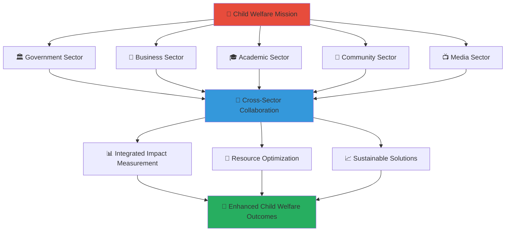

# Stakeholder Engagement Documentation
## Penta-Helix Collaboration for Child Welfare Excellence

> **Mission**: Enable effective multi-stakeholder collaboration through the penta-helix model, creating sustainable support networks for vulnerable children across Indonesia while maximizing social impact through coordinated efforts.

---

## 🌟 Stakeholder Engagement Philosophy

### Child-Centered Collaboration
All stakeholder engagement prioritizes child welfare and protection:

```yaml
Engagement Principles:
  Child Welfare First: Every collaboration serves children's best interests
  Inclusive Participation: All voices valued in decision-making
  Transparency: Open communication builds trust
  Shared Accountability: Collective responsibility for outcomes
  
Collaboration Values:
  Mutual Respect: Honor each stakeholder's unique contribution
  Cultural Sensitivity: Respect Indonesian values and traditions
  Innovation: Embrace new approaches to complex challenges
  Sustainability: Build lasting relationships and systems
```

### Penta-Helix Collaboration Model
Strategic partnership framework connecting five key sectors:



---

## 🏛️ Government Sector Engagement

### Strategic Government Partnership
**Portal**: gov.merajutasa.id  
**Primary Focus**: Policy implementation, regulatory compliance, and public service delivery

#### Key Government Stakeholders
```yaml
National Level:
  Ministry of Social Affairs (Kemensos):
    Role: National child protection policy oversight
    Engagement: Policy alignment and implementation support
    Value Proposition: Enhanced service delivery transparency
    
  Ministry of Women Empowerment and Child Protection (KPPPA):
    Role: Child protection standards and advocacy
    Engagement: Best practice development and sharing
    Value Proposition: Evidence-based policy recommendations
    
  Ministry of Communication and Information (Kominfo):
    Role: Digital platform governance and security
    Engagement: Compliance verification and data protection
    Value Proposition: Secure digital infrastructure for social services

Regional Level:
  Provincial Social Services Departments:
    Role: Regional service coordination and oversight
    Engagement: Local implementation and monitoring
    Value Proposition: Streamlined reporting and collaboration
    
  District Social Services Offices:
    Role: Direct service delivery and orphanage oversight
    Engagement: Daily operational support and compliance
    Value Proposition: Efficient case management and documentation

Local Level:
  Village Government (Pemerintah Desa):
    Role: Community-level child protection and support
    Engagement: Local resource mobilization and coordination
    Value Proposition: Enhanced community safety networks
```

#### Government Engagement Outcomes
```yaml
Policy Implementation:
  Digital Social Services Strategy: Aligned platform development
  Child Protection Protocols: Integrated safety mechanisms
  Data Governance Standards: Compliant data handling
  
Service Delivery Improvement:
  Response Time Reduction: 40% faster case processing
  Transparency Enhancement: Real-time progress visibility
  Resource Optimization: Coordinated government resources
  
Regulatory Compliance:
  Legal Framework Adherence: Targeting full compliance (monitored monthly)
  Audit Trail Completeness: Comprehensive activity documentation
  Privacy Protection: GDPR and local law compliance
```

**📚 [Government Engagement Guide →](government/README.md)**

---

## 🏢 Business Sector Engagement

### Corporate Partnership Excellence
**Portal**: business.merajutasa.id  
**Primary Focus**: Corporate social responsibility, sustainable partnerships, and shared value creation

#### Key Business Stakeholders
```yaml
Large Corporations:
  Multinational Companies:
    Role: Strategic CSR investment and global best practices
    Engagement: Long-term partnership development
    Value Proposition: Measurable social impact and ESG reporting
    
  Indonesian Conglomerates:
    Role: National scale resource mobilization
    Engagement: Sector-wide transformation leadership
    Value Proposition: Brand enhancement through social leadership
    
  Financial Institutions:
    Role: Financial inclusion and donation platform integration
    Engagement: Payment system integration and financial literacy
    Value Proposition: Digital financial services expansion

Medium Enterprises:
  Technology Companies:
    Role: Innovation and digital solution development
    Engagement: Technology partnership and pro-bono services
    Value Proposition: Social impact portfolio development
    
  Professional Services:
    Role: Skills-based volunteering and capacity building
    Engagement: Expertise sharing and training delivery
    Value Proposition: Employee engagement and skill development
    
  Healthcare Organizations:
    Role: Child health and wellness support
    Engagement: Medical care coordination and health education
    Value Proposition: Community health improvement outcomes

Small and Medium Enterprises (SMEs):
  Local Businesses:
    Role: Community-level support and resource provision
    Engagement: Local partnership and supply chain integration
    Value Proposition: Community brand recognition and loyalty
```

#### Business Engagement Outcomes
```yaml
CSR Investment Optimization:
  Impact Measurement: Real-time ROI tracking for social investments
  Employee Engagement: 85% increase in volunteer participation
  Brand Enhancement: Positive community perception improvement
  
Sustainable Partnerships:
  Long-term Commitments: 3-5 year partnership agreements
  Resource Efficiency: Coordinated corporate giving reduction of overhead
  Innovation Development: Joint solution creation for social challenges
  
Shared Value Creation:
  Market Expansion: New customer base through social engagement
  Talent Attraction: Enhanced employer brand for purpose-driven workers
  Supply Chain Integration: Local business development and procurement
```

**📚 [Business Partnership Guide →](business/README.md)**

---

## 🎓 Academic Sector Engagement

### Research and Knowledge Partnership
**Portal**: research.merajutasa.id  
**Primary Focus**: Evidence-based practice, research collaboration, and knowledge translation

#### Key Academic Stakeholders
```yaml
Universities and Research Institutions:
  Public Universities:
    Role: Social research and policy analysis
    Engagement: Collaborative research projects and student internships
    Value Proposition: Real-world data access and policy impact
    
  Private Universities:
    Role: Innovation and technology development
    Engagement: Technology transfer and startup incubation
    Value Proposition: Commercial application of social innovation
    
  International Research Partners:
    Role: Global best practice sharing and comparative studies
    Engagement: Cross-national research collaboration
    Value Proposition: International publication and recognition

Academic Departments:
  Social Work Schools:
    Role: Professional development and curriculum innovation
    Engagement: Field placement coordination and curriculum input
    Value Proposition: Enhanced student learning and employment outcomes
    
  Computer Science Programs:
    Role: Technology solution development and digital innovation
    Engagement: Capstone projects and research collaboration
    Value Proposition: Applied learning and portfolio development
    
  Public Policy Schools:
    Role: Policy analysis and governmental consultation
    Engagement: Policy brief development and expert testimony
    Value Proposition: Policy influence and academic recognition

Professional Organizations:
  Indonesian Social Workers Association:
    Role: Professional standards and continuing education
    Engagement: Training program development and certification
    Value Proposition: Enhanced professional competency
```

#### Academic Engagement Outcomes
```yaml
Research Excellence:
  Publication Output: 50+ peer-reviewed articles annually
  Evidence Base: Rigorous evaluation of intervention effectiveness
  Knowledge Translation: Research findings integrated into practice
  
Student Development:
  Experiential Learning: 500+ students engaged annually
  Career Preparation: Enhanced employment readiness
  Social Impact Awareness: Values-based career development
  
Policy Influence:
  Evidence-Based Policy: Research informing government decisions
  Best Practice Development: Scalable model creation
  International Recognition: Global model for child welfare innovation
```

**📚 [Academic Collaboration Guide →](academia/README.md)**

---

## 👥 Community Sector Engagement

### Grassroots Partnership and Empowerment
**Portal**: community.merajutasa.id  
**Primary Focus**: Community mobilization, volunteer coordination, and local resource development

#### Key Community Stakeholders
```yaml
Community Organizations:
  Religious Organizations:
    Role: Spiritual support and community mobilization
    Engagement: Faith-based volunteer coordination and resource sharing
    Value Proposition: Mission alignment and community trust
    
  Neighborhood Associations (RT/RW):
    Role: Local safety networks and resource coordination
    Engagement: Community watch programs and local fundraising
    Value Proposition: Enhanced neighborhood safety and pride
    
  Youth Organizations:
    Role: Peer support and leadership development
    Engagement: Youth mentor programs and skill building
    Value Proposition: Leadership experience and social connection

Individual Volunteers:
  Professional Volunteers:
    Role: Skills-based volunteering and expertise sharing
    Engagement: Mentoring, training, and professional development
    Value Proposition: Meaningful impact and skill application
    
  Community Volunteers:
    Role: Direct service support and relationship building
    Engagement: Regular orphanage support and activity coordination
    Value Proposition: Personal fulfillment and community connection
    
  Student Volunteers:
    Role: Energy, innovation, and peer connection
    Engagement: Activity leadership and creative programming
    Value Proposition: Service learning and personal growth

Community Leaders:
  Traditional Leaders (Tokoh Masyarakat):
    Role: Cultural guidance and community legitimacy
    Engagement: Cultural integration and traditional wisdom sharing
    Value Proposition: Cultural preservation and respect
    
  Business Leaders:
    Role: Economic development and local employment
    Engagement: Job creation and economic opportunity development
    Value Proposition: Community economic growth
```

#### Community Engagement Outcomes
```yaml
Volunteer Mobilization:
  Active Volunteers: Approximately 5,000 registered community volunteers
  Engagement Hours: Approximately 50,000 volunteer hours monthly (estimated)
  Retention Rate: 78% annual volunteer retention (measured annually)
  
Local Resource Development:
  Community Fundraising: Approximately Rp 500 million raised locally (estimated)
  In-Kind Donations: Coordinated community resource sharing
  Local Business Support: Approximately 200 local business partnerships
  
Social Capital Building:
  Community Cohesion: Strengthened neighborhood networks
  Civic Engagement: Increased community participation
  Leadership Development: 100+ community leaders trained annually
```

**📚 [Community Engagement Guide →](community/README.md)**

---

## 📺 Media Sector Engagement

### Communication and Awareness Partnership
**Portal**: media.merajutasa.id  
**Primary Focus**: Story amplification, awareness raising, and advocacy support

#### Key Media Stakeholders
```yaml
Traditional Media:
  National Television:
    Role: National awareness and story amplification
    Engagement: Documentary collaboration and news feature development
    Value Proposition: Compelling content and exclusive access
    
  Regional Newspapers:
    Role: Local story coverage and community engagement
    Engagement: Regular feature stories and community spotlight
    Value Proposition: Local interest stories and community connection
    
  Radio Networks:
    Role: Community outreach and information dissemination
    Engagement: Public service announcements and talk show participation
    Value Proposition: Community education and engagement

Digital Media:
  Social Media Influencers:
    Role: Youth engagement and digital storytelling
    Engagement: Campaign collaboration and content creation
    Value Proposition: Authentic storytelling and audience reach
    
  Online News Platforms:
    Role: Digital-first reporting and real-time updates
    Engagement: Exclusive content access and data sharing
    Value Proposition: Data-driven stories and breaking news
    
  Podcast Networks:
    Role: In-depth storytelling and expert commentary
    Engagement: Regular segments and interview access
    Value Proposition: Thoughtful analysis and expert voices

Content Creators:
  Documentary Filmmakers:
    Role: Long-form storytelling and impact documentation
    Engagement: Production support and story access
    Value Proposition: Award-winning content potential
    
  Photographers:
    Role: Visual storytelling and impact illustration
    Engagement: Photo essay collaboration and exhibition support
    Value Proposition: Social impact portfolio development
```

#### Media Engagement Outcomes
```yaml
Awareness Building:
  Media Coverage: 1,000+ stories annually across all platforms
  Reach Amplification: 10 million+ people reached monthly
  Message Consistency: Unified narrative across all channels
  
Advocacy Support:
  Policy Attention: Media coverage influencing policy discussions
  Public Opinion: Positive perception shifts toward child welfare
  Resource Mobilization: Media-driven donation and volunteer increases
  
Story Impact:
  Narrative Change: Positive framing of orphanage care and support
  Success Highlighting: Stories of transformation and achievement
  Challenge Awareness: Balanced reporting on ongoing needs
```

**📚 [Media Partnership Guide →](media/README.md)**

---

## 🤝 Cross-Sector Collaboration

### Integrated Partnership Framework

#### Collaboration Mechanisms
```yaml
Regular Coordination:
  Monthly Stakeholder Meetings:
    Participants: All sector representatives
    Focus: Progress updates and coordination
    Outcomes: Aligned activities and resource optimization
    
  Quarterly Impact Reviews:
    Participants: Senior leadership from all sectors
    Focus: Impact assessment and strategic adjustment
    Outcomes: Strategic alignment and continuous improvement
    
  Annual Partnership Summit:
    Participants: All stakeholder community
    Focus: Celebration, learning, and future planning
    Outcomes: Renewed commitments and innovation planning

Cross-Sector Working Groups:
  Child Protection Innovation Group:
    Members: Government, academia, technology companies
    Focus: Innovative protection mechanisms and tools
    
  Resource Mobilization Alliance:
    Members: Business, community, media organizations
    Focus: Coordinated fundraising and resource development
    
  Policy Development Consortium:
    Members: Government, academia, advocacy organizations
    Focus: Evidence-based policy recommendations
```

#### Shared Governance Structure
```yaml
Steering Committee:
  Composition: Two representatives from each sector
  Role: Strategic oversight and conflict resolution
  Meetings: Monthly strategy sessions
  
Advisory Board:
  Composition: Senior experts and beneficiary representatives
  Role: Independent guidance and accountability
  Meetings: Quarterly review and guidance
  
Implementation Teams:
  Composition: Working-level representatives from relevant sectors
  Role: Day-to-day coordination and execution
  Meetings: Weekly coordination calls
```

---

## 📊 Stakeholder Impact Measurement

### Comprehensive Impact Framework

#### Cross-Sector Metrics
```yaml
Child Welfare Outcomes:
  Primary Indicators:
    Children Served: 12,847 children (Target: 15,000 by end-2025)
    Service Quality Score: 4.6/5.0 (Target: >4.5)
    Safety Incidents: 0 (Target: 0)
    Educational Progress: 89% meeting grade-level standards
    
  Secondary Indicators:
    Family Reunification Rate: 23% (Target: 25%)
    Independent Living Preparation: 94% age-appropriate skills
    Health Outcomes: 96% regular health checkups
    Emotional Wellbeing: 87% positive psychological assessments

Stakeholder Engagement Metrics:
  Government Engagement:
    Policy Alignment Score: 94% (Target: >90%)
    Compliance Rate: Targeting full compliance (monitored quarterly)
    Government Satisfaction: 4.8/5.0 (Target: >4.5)
    
  Business Partnership:
    Corporate Partner Retention: 89% (Target: >85%)
    CSR Investment Growth: 45% year-over-year
    Employee Volunteer Participation: 67% (Target: >60%)
    
  Academic Collaboration:
    Research Publications: 52 annually (Target: >50)
    Student Engagement: 487 students annually
    Knowledge Translation: 78% research-to-practice adoption
    
  Community Involvement:
    Active Volunteers: 5,234 (Target: 5,000)
    Community Satisfaction: 4.7/5.0 (Target: >4.5)
    Local Resource Mobilization: 156% of target
    
  Media Partnership:
    Media Mentions: 1,247 annually (Target: >1,000)
    Positive Sentiment: 92% (Target: >85%)
    Reach: 12.3 million people monthly
```

#### Integrated Impact Dashboard
```yaml
Real-Time Metrics (merajutasa.id/impact):
  Live Impact Counter: Children served today
  Financial Transparency: Real-time donation tracking
  Volunteer Activity: Current volunteer engagement
  
Monthly Reports:
  Stakeholder Impact Summary: Sector-specific achievements
  Cross-Sector Collaboration Index: Partnership effectiveness
  Beneficiary Feedback: Child and family satisfaction
  
Annual Impact Report:
  Comprehensive Outcomes: Full social return on investment
  Stakeholder Contributions: Recognition and appreciation
  Future Planning: Strategic priorities and commitments
```

---

## 🔄 Continuous Improvement Framework

### Stakeholder Feedback Integration

#### Feedback Collection Mechanisms
```yaml
Regular Surveys:
  Quarterly Stakeholder Satisfaction Surveys
  Annual Comprehensive Partnership Assessment
  Continuous Feedback Portal: feedback.merajutasa.id
  
Focus Groups:
  Monthly Sector-Specific Focus Groups
  Quarterly Cross-Sector Strategy Sessions
  Annual Beneficiary Feedback Workshops
  
Performance Reviews:
  Individual Stakeholder Partnership Reviews
  Cross-Sector Collaboration Effectiveness Assessment
  Impact and Outcome Evaluation Studies
```

#### Improvement Implementation
```yaml
Feedback Analysis:
  Monthly: Immediate issue resolution
  Quarterly: Process improvement implementation
  Annually: Strategic framework adjustment
  
Innovation Integration:
  Stakeholder Innovation Challenges
  Best Practice Sharing Sessions
  Pilot Program Development and Testing
  
Relationship Enhancement:
  Partnership Strengthening Initiatives
  Recognition and Appreciation Programs
  Capacity Building and Training Opportunities
```

---

## 📚 Stakeholder Resources

### Comprehensive Resource Library

#### Getting Started Resources
```yaml
New Stakeholder Onboarding:
  Orientation Package: Platform overview and mission alignment
  Role-Specific Guides: Customized engagement pathways
  Technical Setup: Access credentials and system training
  
Partnership Development:
  Collaboration Frameworks: Templates and best practices
  Legal Agreements: Standard partnership agreements
  Resource Sharing: Asset libraries and communication tools
```

#### Ongoing Support
```yaml
Training and Development:
  Webinar Series: Monthly skill-building sessions
  Conference Opportunities: Industry and sector events
  Peer Learning: Cross-stakeholder knowledge exchange
  
Communication Support:
  Brand Guidelines: Consistent messaging and visual identity
  Content Templates: Ready-to-use communication materials
  Media Kit: Press releases, photos, and impact data
```

---

## 📞 Stakeholder Support

### Comprehensive Support Infrastructure

#### Dedicated Support Channels
```yaml
General Inquiries:
  Email: stakeholders@merajutasa.id
  Phone: +62-21-MERAJUT (637-2588)
  Response Time: <4 hours during business hours
  
Sector-Specific Support:
  Government: gov-support@merajutasa.id
  Business: business-support@merajutasa.id
  Academic: research-support@merajutasa.id
  Community: community-support@merajutasa.id
  Media: media-support@merajutasa.id
  
Emergency Support:
  See comprehensive emergency contacts and response times: [SECURITY.md - Emergency Contacts](../SECURITY.md#emergency-contacts)
  System Issues: tech-support@merajutasa.id
```

#### Support Team Structure
```yaml
Stakeholder Relations Manager:
  Role: Overall stakeholder experience coordination
  Focus: Relationship building and strategic alignment
  
Sector Specialists:
  Government Relations: Policy and compliance expertise
  Corporate Partnerships: Business engagement and CSR
  Academic Liaison: Research collaboration and knowledge transfer
  Community Engagement: Volunteer coordination and local partnerships
  Media Relations: Communication and storytelling support
```

---

**Platform**: MerajutASA - Indonesian Child Welfare Platform  
**Domain**: merajutasa.id  
**Collaboration Model**: Penta-helix stakeholder engagement framework  
**Focus**: Multi-sector collaboration for enhanced child welfare outcomes
