# Corporate Audit Requirements Guide
## Comprehensive Audit Framework for Child Welfare Partnership Excellence

> **Purpose**: Establish rigorous audit requirements that ensure all corporate partners maintain the highest standards of operational excellence, financial integrity, and child protection compliance through systematic independent verification. This framework protects vulnerable children while enabling authentic corporate social responsibility partnerships through transparent accountability.

---

## 🔍 Audit Requirements Philosophy and Framework

### Child Protection Audit Priority
All audit activities prioritize child safety and welfare verification:

```yaml
Audit Principles:
  Child Safety Verification: Comprehensive audit of child protection measures and outcomes
  Operational Excellence: Systematic verification of operational effectiveness and efficiency
  
Audit Values:
  Independent Verification: Objective assessment by qualified independent auditors
  Continuous Improvement: Audit-driven enhancement of partnership effectiveness
```

### Multi-Dimensional Audit Architecture
Comprehensive audit framework ensuring partnership integrity and excellence:

```mermaid
graph TD
    A[🤝 Corporate Partnership] --> B[🔍 Audit Planning & Scoping]
    B --> C[📊 Financial Audit]
    C --> D[🛡️ Child Protection Audit]
    D --> E[⚙️ Operational Audit]
    E --> F[🌍 Impact Measurement Audit]
    F --> G[⚖️ Compliance Audit]
    G --> H[📋 Audit Reporting & Recommendations]
    H --> I[🔄 Improvement Implementation]
    I --> J[👶 Enhanced Child Welfare Outcomes]
    
    style D fill:#E74C3C
    style J fill:#27AE60
```



---

## 📋 Audit Framework Structure and Requirements

### 1. Audit Planning and Governance Framework

#### Comprehensive Audit Planning Process
```markdown
## Corporate Partnership Audit Framework

### Audit Planning and Governance
**Strategic Audit Planning with Child Protection Priority**:

### Audit Governance Structure
**Independent Audit Oversight and Management**:
```javascript
// Comprehensive audit planning and governance system
class CorporatePartnershipAuditFramework {
  constructor(partnershipProfile) {
    this.partnership = partnershipProfile;
    this.auditPlanner = new StrategicAuditPlanner();
    this.auditGovernance = new AuditGovernanceFramework();
    this.auditorSelection = new IndependentAuditorSelection();
    this.auditCompliance = new AuditComplianceMonitoring();
  }
  
  async establishAuditFramework() {
    try {
      // Configure comprehensive audit governance
      const auditGovernance = await this.configureAuditGovernance();
      
      // Implement audit planning and scheduling
      const auditPlanning = await this.implementAuditPlanning();
      
      // Configure auditor selection and management
      const auditorManagement = await this.configureAuditorManagement();
      
      // Implement audit quality assurance
      const qualityAssurance = await this.implementAuditQualityAssurance();
      
      return {
        audit_governance: auditGovernance,
        audit_planning: auditPlanning,
        auditor_management: auditorManagement,
        quality_assurance: qualityAssurance,
        audit_effectiveness: await this.assessAuditEffectiveness()
      };
      
    } catch (error) {
      await this.auditLogger.logAuditFrameworkError({
        partnership: this.partnership.partnership_id,
        error: error.message,
        framework_component: 'audit_framework_establishment',
        child_protection_impact: 'audit_integrity_verification_required'
      });
      throw error;
    }
  }
  
  async configureAuditGovernance() {
    // Independent audit governance structure
    return {
      audit_oversight_committee: {
        committee_composition: {
          independent_chair: {
            qualification: 'certified_public_accountant_with_social_impact_expertise',
            independence: 'no_financial_relationship_with_corporate_partner_or_merajutasa',
            expertise: 'child_protection_and_social_impact_audit_experience',
            term: '3_year_renewable_term_with_performance_review'
          },
          
          child_protection_expert: {
            qualification: 'child_protection_specialist_with_audit_experience',
            independence: 'independent_child_protection_professional',
            expertise: 'child_safeguarding_audit_and_compliance_verification',
            responsibility: 'child_protection_audit_oversight_and_verification'
          },
          
          financial_audit_expert: {
            qualification: 'certified_public_accountant_with_nonprofit_experience',
            independence: 'independent_financial_audit_professional',
            expertise: 'nonprofit_financial_audit_and_social_impact_measurement',
            responsibility: 'financial_audit_quality_and_methodology_oversight'
          },
          
          social_impact_measurement_expert: {
            qualification: 'social_impact_measurement_specialist',
            independence: 'independent_social_impact_professional',
            expertise: 'social_return_on_investment_and_outcome_measurement',
            responsibility: 'impact_measurement_audit_and_verification_oversight'
          }
        },
        
        committee_responsibilities: {
          audit_strategy_oversight: await this.defineAuditStrategyOversight(),
          auditor_selection_and_evaluation: await this.defineAuditorSelectionOversight(),
          audit_quality_assurance: await this.defineAuditQualityAssuranceOversight(),
          audit_report_review_and_approval: await this.defineAuditReportOversight()
        }
      },
      
      audit_independence_framework: {
        auditor_independence_requirements: {
          financial_independence: 'no_financial_relationship_or_dependency',
          operational_independence: 'no_operational_relationship_or_involvement',
          personal_independence: 'no_personal_relationship_or_conflict_of_interest',
          professional_independence: 'adherence_to_professional_independence_standards'
        },
        
        independence_monitoring: {
          annual_independence_declaration: 'annual_auditor_independence_certification',
          ongoing_independence_monitoring: 'continuous_independence_monitoring_and_verification',
          independence_violation_procedures: 'independence_violation_response_and_remediation',
          independence_enhancement: 'continuous_independence_framework_improvement'
        }
      }
    };
  }
  
  async implementAuditPlanning() {
    // Comprehensive audit planning with child protection focus
    return {
      annual_audit_plan: {
        comprehensive_partnership_audit: {
          audit_scope: 'complete_partnership_operations_and_outcomes',
          audit_frequency: 'annual_comprehensive_audit',
          audit_duration: '6_week_comprehensive_audit_process',
          audit_focus: 'child_protection_financial_integrity_impact_measurement'
        },
        
        quarterly_focused_audits: {
          child_protection_audit: {
            frequency: 'quarterly_child_protection_compliance_audit',
            scope: 'child_protection_policies_procedures_outcomes',
            duration: '2_week_focused_audit',
            reporting: 'immediate_child_protection_audit_reporting'
          },
          
          financial_performance_audit: {
            frequency: 'quarterly_financial_performance_audit',
            scope: 'financial_management_transparency_efficiency',
            duration: '2_week_financial_audit',
            reporting: 'quarterly_financial_audit_reporting'
          },
          
          impact_measurement_audit: {
            frequency: 'quarterly_impact_measurement_verification',
            scope: 'impact_measurement_methodology_and_results_verification',
            duration: '1_week_impact_audit',
            reporting: 'quarterly_impact_measurement_audit_reporting'
          }
        }
      },
      
      risk_based_audit_planning: {
        partnership_risk_assessment: await this.conductPartnershipRiskAssessment(),
        audit_resource_allocation: await this.allocateAuditResources(),
        audit_prioritization: await this.prioritizeAuditFocus(),
        audit_methodology_selection: await this.selectAuditMethodologies()
      }
    };
  }
}
```

### Auditor Selection and Qualification Standards
**Independent Auditor Qualification and Selection Framework**:
```yaml
Auditor Selection Framework:
  Minimum Auditor Qualifications:
    Professional Certification Requirements:
      Primary Certification: Certified Public Accountant (CPA) or equivalent professional certification
      Social Impact Specialization: Certified social impact measurement professional or equivalent expertise
      Child Protection Training: Mandatory child protection audit training and certification
      Continuing Education: Annual continuing education in social impact and child protection auditing
      
    Experience Requirements:
      Social Impact Audit Experience: Minimum 5 years social impact organization audit experience
      Child Protection Audit Experience: Minimum 3 years child protection organization audit experience
      Corporate Partnership Audit: Experience auditing corporate-nonprofit partnerships
      International Standards Knowledge: Knowledge of international audit and child protection standards
      
    Technical Competencies:
      Financial Audit Expertise: Advanced financial audit methodology and standards knowledge
      Impact Measurement Expertise: Social return on investment and outcome measurement expertise
      Risk Assessment Capabilities: Comprehensive risk assessment and mitigation planning expertise
      Technology Audit Skills: Information technology and cybersecurity audit capabilities
  
  Auditor Selection Process:
    Open Competitive Selection:
      Request for Proposal Process: Comprehensive RFP process with clear selection criteria
      Proposal Evaluation: Multi-criteria evaluation of auditor proposals and qualifications
      Reference Verification: Comprehensive reference checking and past performance verification
      Interview and Assessment: In-depth interview and technical competency assessment
      
    Selection Criteria Weighting:
      Child Protection Expertise (30%): Demonstrated child protection audit expertise and experience
      Social Impact Measurement (25%): Social impact measurement and SROI calculation expertise
      Financial Audit Quality (20%): Financial audit methodology and quality track record
      Independence and Objectivity (15%): Demonstrated independence and professional objectivity
      Innovation and Technology (10%): Innovation in audit methodology and technology utilization
  
  Auditor Performance Management:
    Annual Performance Evaluation:
      Audit Quality Assessment: Annual assessment of audit quality and methodology effectiveness
      Stakeholder Satisfaction: Stakeholder feedback on auditor performance and professionalism
      Continuous Improvement: Auditor continuous improvement and professional development
      Performance-Based Renewal: Performance-based auditor contract renewal and evaluation
```
```

---

## 💰 Financial Audit Requirements and Standards

### Comprehensive Financial Audit Framework

#### Financial Audit Scope and Methodology
```markdown
## Financial Audit Requirements Framework

### Financial Audit Standards
**Comprehensive Financial Verification with Child Impact Focus**:

### Financial Audit Scope and Procedures
**Multi-Dimensional Financial Audit with Child Protection Integration**:
```javascript
// Comprehensive financial audit implementation
class FinancialAuditFramework {
  constructor(partnershipFinancials) {
    this.financials = partnershipFinancials;
    this.financialAuditor = new AdvancedFinancialAuditor();
    this.impactAuditor = new SocialImpactAuditor();
    this.complianceAuditor = new ComplianceAuditor();
    this.auditDocumentation = new AuditDocumentationEngine();
  }
  
  async conductComprehensiveFinancialAudit() {
    try {
      // Execute comprehensive financial statement audit
      const financialStatementAudit = await this.auditFinancialStatements();
      
      // Conduct investment utilization audit
      const investmentUtilizationAudit = await this.auditInvestmentUtilization();
      
      // Audit social impact financial measurement
      const impactFinancialAudit = await this.auditImpactFinancialMeasurement();
      
      // Conduct financial controls and governance audit
      const controlsGovernanceAudit = await this.auditFinancialControlsGovernance();
      
      return {
        financial_statement_audit: financialStatementAudit,
        investment_utilization_audit: investmentUtilizationAudit,
        impact_financial_audit: impactFinancialAudit,
        controls_governance_audit: controlsGovernanceAudit,
        overall_financial_audit_opinion: await this.formFinancialAuditOpinion()
      };
      
    } catch (error) {
      await this.auditLogger.logFinancialAuditError({
        partnership: this.financials.partnership_id,
        error: error.message,
        audit_component: 'comprehensive_financial_audit',
        financial_integrity_impact: 'financial_audit_quality_verification_required'
      });
      throw error;
    }
  }
  
  async auditFinancialStatements() {
    // Comprehensive financial statement audit with social impact focus
    return {
      revenue_and_funding_audit: {
        corporate_investment_verification: {
          investment_commitment_verification: await this.verifyInvestmentCommitments(),
          payment_receipt_verification: await this.verifyPaymentReceipts(),
          investment_terms_compliance: await this.verifyInvestmentTermsCompliance(),
          funding_source_verification: await this.verifyFundingSources()
        },
        
        additional_funding_audit: {
          government_funding_verification: await this.verifyGovernmentFunding(),
          community_contribution_verification: await this.verifyCommunityContributions(),
          in_kind_contribution_valuation: await this.auditInKindContributionValuation(),
          volunteer_time_valuation: await this.auditVolunteerTimeValuation()
        }
      },
      
      expenditure_and_program_costs_audit: {
        program_expenditure_verification: {
          direct_child_services_costs: await this.auditDirectChildServicesCosts(),
          program_administration_costs: await this.auditProgramAdministrationCosts(),
          capacity_building_costs: await this.auditCapacityBuildingCosts(),
          infrastructure_development_costs: await this.auditInfrastructureDevelopmentCosts()
        },
        
        operational_expenditure_verification: {
          staff_compensation_audit: await this.auditStaffCompensation(),
          vendor_payment_verification: await this.auditVendorPayments(),
          technology_and_equipment_costs: await this.auditTechnologyEquipmentCosts(),
          administrative_overhead_analysis: await this.auditAdministrativeOverhead()
        }
      },
      
      balance_sheet_and_financial_position_audit: {
        asset_verification: {
          cash_and_cash_equivalents_verification: await this.verifyCashEquivalents(),
          program_assets_verification: await this.verifyProgramAssets(),
          technology_assets_verification: await this.verifyTechnologyAssets(),
          infrastructure_assets_verification: await this.verifyInfrastructureAssets()
        },
        
        liability_and_commitment_verification: {
          program_commitments_verification: await this.verifyProgramCommitments(),
          vendor_liability_verification: await this.verifyVendorLiabilities(),
          staff_benefit_liability_verification: await this.verifyStaffBenefitLiabilities(),
          contingent_liability_assessment: await this.assessContingentLiabilities()
        }
      }
    };
  }
  
  async auditImpactFinancialMeasurement() {
    // Social impact financial measurement audit
    return {
      social_return_on_investment_audit: {
        sroi_methodology_verification: {
          sroi_calculation_methodology_audit: await this.auditSROICalculationMethodology(),
          impact_valuation_methodology_audit: await this.auditImpactValuationMethodology(),
          stakeholder_benefit_valuation_audit: await this.auditStakeholderBenefitValuation(),
          attribution_and_deadweight_analysis_audit: await this.auditAttributionDeadweightAnalysis()
        },
        
        sroi_calculation_verification: {
          quantitative_impact_measurement_verification: await this.verifyQuantitativeImpactMeasurement(),
          qualitative_impact_valuation_verification: await this.verifyQualitativeImpactValuation(),
          long_term_impact_projection_verification: await this.verifyLongTermImpactProjection(),
          comparative_impact_analysis_verification: await this.verifyComparativeImpactAnalysis()
        }
      },
      
      cost_effectiveness_analysis_audit: {
        cost_per_outcome_verification: {
          cost_per_child_served_verification: await this.verifyCostPerChildServed(),
          cost_per_outcome_achieved_verification: await this.verifyCostPerOutcomeAchieved(),
          program_efficiency_measurement_verification: await this.verifyProgramEfficiencyMeasurement(),
          comparative_cost_effectiveness_verification: await this.verifyComparativeCostEffectiveness()
        },
        
        resource_utilization_efficiency_audit: {
          financial_resource_utilization_audit: await this.auditFinancialResourceUtilization(),
          human_resource_utilization_audit: await this.auditHumanResourceUtilization(),
          technology_resource_utilization_audit: await this.auditTechnologyResourceUtilization(),
          infrastructure_resource_utilization_audit: await this.auditInfrastructureResourceUtilization()
        }
      }
    };
  }
}
```

### Financial Controls and Risk Assessment Audit
**Internal Financial Controls and Risk Management Audit Framework**:
```yaml
Financial Controls Audit Framework:
  Internal Financial Controls Assessment:
    Authorization and Approval Controls:
      Expenditure Authorization: Multi-level expenditure authorization and approval procedures
      Budget Management Controls: Budget planning, monitoring, and variance control procedures
      Investment Decision Controls: Investment decision-making and approval control procedures
      Financial Reporting Controls: Financial reporting preparation and review control procedures
      
    Segregation of Duties:
      Financial Transaction Processing: Segregation of transaction initiation, approval, and recording
      Cash Management: Segregation of cash receipt, disbursement, and reconciliation functions
      Vendor Management: Segregation of vendor selection, contract management, and payment processing
      Financial Reporting: Segregation of financial data preparation, review, and approval
      
    Documentation and Record Keeping:
      Financial Documentation Standards: Comprehensive financial documentation and record-keeping standards
      Transaction Documentation: Complete documentation of all financial transactions and decisions
      Audit Trail Maintenance: Comprehensive audit trail for all financial activities and decisions
      Document Retention Policy: Appropriate document retention and disposal policies and procedures
  
  Financial Risk Assessment and Management:
    Financial Risk Identification:
      Credit and Counterparty Risk: Assessment of credit and counterparty risk exposure and management
      Liquidity and Cash Flow Risk: Assessment of liquidity and cash flow risk management procedures
      Foreign Exchange Risk: Assessment of foreign exchange risk exposure and hedging strategies
      Operational Financial Risk: Assessment of operational financial risk and mitigation strategies
      
    Risk Management Framework:
      Risk Assessment Procedures: Systematic financial risk assessment and monitoring procedures
      Risk Mitigation Strategies: Comprehensive financial risk mitigation and management strategies
      Risk Monitoring and Reporting: Ongoing financial risk monitoring and reporting procedures
      Risk Response and Contingency Planning: Financial risk response and contingency planning procedures
  
  Compliance and Regulatory Audit:
    Financial Compliance Assessment:
      Tax Compliance: Assessment of tax compliance and reporting in all relevant jurisdictions
      Regulatory Compliance: Assessment of financial regulatory compliance and reporting requirements
      Grant and Funding Compliance: Assessment of grant and funding compliance and reporting requirements
      International Compliance: Assessment of international financial compliance and reporting requirements
```
```

---

## 🛡️ Child Protection Audit Requirements

### Comprehensive Child Protection Audit Framework

#### Child Protection Audit Scope and Methodology
```markdown
## Child Protection Audit Requirements Framework

### Child Protection Audit Standards
**Comprehensive Child Protection Verification with Zero Tolerance Standards**:

### Child Protection Audit Scope and Procedures
**Multi-Dimensional Child Protection Audit with Safeguarding Priority**:
```javascript
// Comprehensive child protection audit implementation
class ChildProtectionAuditFramework {
  constructor(partnershipProfile) {
    this.partnership = partnershipProfile;
    this.childProtectionAuditor = new SpecializedChildProtectionAuditor();
    this.safeguardingAuditor = new SafeguardingComplianceAuditor();
    this.incidentAuditor = new IncidentResponseAuditor();
    this.cultureAuditor = new OrganizationalCultureAuditor();
  }
  
  async conductComprehensiveChildProtectionAudit() {
    try {
      // Execute child protection policy and procedure audit
      const policyProcedureAudit = await this.auditChildProtectionPoliciesProcedures();
      
      // Conduct safeguarding implementation audit
      const safeguardingImplementationAudit = await this.auditSafeguardingImplementation();
      
      // Audit incident management and response
      const incidentManagementAudit = await this.auditIncidentManagementResponse();
      
      // Conduct organizational culture and commitment audit
      const organizationalCultureAudit = await this.auditOrganizationalCultureCommitment();
      
      return {
        policy_procedure_audit: policyProcedureAudit,
        safeguarding_implementation_audit: safeguardingImplementationAudit,
        incident_management_audit: incidentManagementAudit,
        organizational_culture_audit: organizationalCultureAudit,
        overall_child_protection_audit_opinion: await this.formChildProtectionAuditOpinion()
      };
      
    } catch (error) {
      await this.auditLogger.logChildProtectionAuditError({
        partnership: this.partnership.partnership_id,
        error: error.message,
        audit_component: 'comprehensive_child_protection_audit',
        child_safety_impact: 'immediate_child_protection_review_required'
      });
      throw error;
    }
  }
  
  async auditChildProtectionPoliciesProcedures() {
    // Comprehensive child protection policy and procedure audit
    return {
      policy_framework_audit: {
        policy_existence_and_comprehensiveness: {
          child_protection_policy_audit: await this.auditChildProtectionPolicy(),
          safeguarding_policy_audit: await this.auditSafeguardingPolicy(),
          incident_response_policy_audit: await this.auditIncidentResponsePolicy(),
          training_policy_audit: await this.auditTrainingPolicy()
        },
        
        policy_compliance_and_implementation: {
          policy_implementation_effectiveness: await this.auditPolicyImplementationEffectiveness(),
          policy_compliance_monitoring: await this.auditPolicyComplianceMonitoring(),
          policy_update_and_maintenance: await this.auditPolicyUpdateMaintenance(),
          policy_communication_and_training: await this.auditPolicyCommunicationTraining()
        }
      },
      
      procedure_implementation_audit: {
        recruitment_and_screening_procedures: {
          background_check_procedures_audit: await this.auditBackgroundCheckProcedures(),
          reference_verification_procedures_audit: await this.auditReferenceVerificationProcedures(),
          interview_safeguarding_assessment_audit: await this.auditInterviewSafeguardingAssessment(),
          ongoing_screening_procedures_audit: await this.auditOngoingScreeningProcedures()
        },
        
        operational_safeguarding_procedures: {
          supervision_framework_audit: await this.auditSupervisionFramework(),
          communication_guidelines_audit: await this.auditCommunicationGuidelines(),
          physical_environment_safeguards_audit: await this.auditPhysicalEnvironmentSafeguards(),
          digital_safeguarding_procedures_audit: await this.auditDigitalSafeguardingProcedures()
        }
      },
      
      international_standards_compliance_audit: {
        un_convention_rights_child_compliance: await this.auditUNCRCCompliance(),
        keeping_children_safe_standards_compliance: await this.auditKCSStandardsCompliance(),
        sphere_standards_compliance: await this.auditSphereStandardsCompliance(),
        local_legal_compliance_audit: await this.auditLocalLegalCompliance()
      }
    };
  }
  
  async auditSafeguardingImplementation() {
    // Safeguarding implementation effectiveness audit
    return {
      safeguarding_culture_audit: {
        leadership_commitment_audit: {
          executive_leadership_commitment_assessment: await this.auditExecutiveLeadershipCommitment(),
          board_oversight_commitment_assessment: await this.auditBoardOversightCommitment(),
          resource_allocation_commitment_assessment: await this.auditResourceAllocationCommitment(),
          accountability_framework_assessment: await this.auditAccountabilityFramework()
        },
        
        staff_engagement_and_competency_audit: {
          staff_safeguarding_knowledge_assessment: await this.auditStaffSafeguardingKnowledge(),
          staff_safeguarding_behavior_assessment: await this.auditStaffSafeguardingBehavior(),
          staff_training_effectiveness_assessment: await this.auditStaffTrainingEffectiveness(),
          staff_support_and_supervision_assessment: await this.auditStaffSupportSupervision()
        }
      },
      
      safeguarding_system_effectiveness_audit: {
        prevention_effectiveness_audit: {
          risk_assessment_effectiveness: await this.auditRiskAssessmentEffectiveness(),
          preventive_measure_effectiveness: await this.auditPreventiveMeasureEffectiveness(),
          early_intervention_effectiveness: await this.auditEarlyInterventionEffectiveness(),
          community_engagement_effectiveness: await this.auditCommunityEngagementEffectiveness()
        },
        
        response_effectiveness_audit: {
          incident_response_effectiveness: await this.auditIncidentResponseEffectiveness(),
          support_provision_effectiveness: await this.auditSupportProvisionEffectiveness(),
          external_agency_collaboration_effectiveness: await this.auditExternalAgencyCollaborationEffectiveness(),
          learning_and_improvement_effectiveness: await this.auditLearningImprovementEffectiveness()
        }
      }
    };
  }
}
```

### Child Protection Outcome and Impact Audit
**Child Protection Outcome Measurement and Impact Verification**:
```yaml
Child Protection Impact Audit Framework:
  Child Protection Outcome Measurement Audit:
    Child Safety Outcome Verification:
      Incident Reduction Measurement: Verification of child protection incident reduction and prevention
      Safety Improvement Measurement: Verification of child safety improvement and enhancement
      Risk Mitigation Effectiveness: Verification of child protection risk mitigation effectiveness
      Protection System Strengthening: Verification of child protection system strengthening and improvement
      
    Child Wellbeing Outcome Verification:
      Physical Wellbeing Improvement: Verification of child physical health and wellbeing improvement
      Emotional Wellbeing Enhancement: Verification of child emotional and psychological wellbeing enhancement
      Educational Development Support: Verification of child educational development support and improvement
      Social Development Facilitation: Verification of child social development facilitation and enhancement
      
    Family and Community Protection Enhancement:
      Family Preservation Support: Verification of family preservation and reunification support effectiveness
      Community Protection Strengthening: Verification of community-based child protection strengthening
      Alternative Care Quality Improvement: Verification of alternative care quality improvement and enhancement
      Child Participation and Voice: Verification of child participation and voice in protection decisions
  
  Child Protection System Strengthening Audit:
    Institutional Capacity Building Verification:
      Staff Capacity Development: Verification of child protection staff capacity development and improvement
      System Process Improvement: Verification of child protection system process improvement and enhancement
      Technology and Infrastructure Enhancement: Verification of technology and infrastructure enhancement for child protection
      Quality Assurance System Development: Verification of quality assurance system development and implementation
      
    Partnership and Collaboration Enhancement:
      Multi-Agency Collaboration Improvement: Verification of multi-agency collaboration improvement and coordination
      Community Partnership Development: Verification of community partnership development and engagement
      International Best Practice Integration: Verification of international best practice integration and adaptation
      Innovation and Learning Culture Development: Verification of innovation and learning culture development
```
```

---

## 📊 Impact Measurement and Outcomes Audit

### Comprehensive Impact Measurement Audit Framework

#### Social Impact Measurement Verification
```markdown
## Impact Measurement Audit Requirements Framework

### Impact Measurement Audit Standards
**Comprehensive Social Impact Verification with Evidence-Based Assessment**:

### Impact Measurement Audit Scope and Methodology
**Multi-Dimensional Impact Verification with Rigorous Evidence Standards**:
```javascript
// Comprehensive impact measurement audit implementation
class ImpactMeasurementAuditFramework {
  constructor(partnershipImpactData) {
    this.impactData = partnershipImpactData;
    this.impactMeasurementAuditor = new SocialImpactMeasurementAuditor();
    this.outcomeVerificationAuditor = new OutcomeVerificationAuditor();
    this.methodologyAuditor = new ImpactMethodologyAuditor();
    this.evidenceAuditor = new EvidenceBasedAssessmentAuditor();
  }
  
  async conductComprehensiveImpactMeasurementAudit() {
    try {
      // Execute impact measurement methodology audit
      const methodologyAudit = await this.auditImpactMeasurementMethodology();
      
      // Conduct outcome achievement verification audit
      const outcomeVerificationAudit = await this.auditOutcomeAchievementVerification();
      
      // Audit social return on investment calculation
      const sroiCalculationAudit = await this.auditSROICalculation();
      
      // Conduct long-term impact sustainability audit
      const sustainabilityAudit = await this.auditLongTermImpactSustainability();
      
      return {
        methodology_audit: methodologyAudit,
        outcome_verification_audit: outcomeVerificationAudit,
        sroi_calculation_audit: sroiCalculationAudit,
        sustainability_audit: sustainabilityAudit,
        overall_impact_measurement_audit_opinion: await this.formImpactMeasurementAuditOpinion()
      };
      
    } catch (error) {
      await this.auditLogger.logImpactMeasurementAuditError({
        partnership: this.impactData.partnership_id,
        error: error.message,
        audit_component: 'comprehensive_impact_measurement_audit',
        impact_integrity_verification: 'impact_measurement_quality_verification_required'
      });
      throw error;
    }
  }
  
  async auditImpactMeasurementMethodology() {
    // Impact measurement methodology and framework audit
    return {
      measurement_framework_audit: {
        theory_of_change_verification: {
          theory_of_change_logic_audit: await this.auditTheoryOfChangeLogic(),
          assumption_testing_audit: await this.auditAssumptionTesting(),
          causal_pathway_verification: await this.auditCausalPathwayVerification(),
          external_factor_consideration_audit: await this.auditExternalFactorConsideration()
        },
        
        outcome_indicator_audit: {
          indicator_relevance_and_validity_audit: await this.auditIndicatorRelevanceValidity(),
          indicator_measurement_methodology_audit: await this.auditIndicatorMeasurementMethodology(),
          baseline_establishment_audit: await this.auditBaselineEstablishment(),
          target_setting_and_benchmarking_audit: await this.auditTargetSettingBenchmarking()
        }
      },
      
      data_collection_methodology_audit: {
        data_collection_design_audit: {
          sampling_methodology_audit: await this.auditSamplingMethodology(),
          data_collection_instrument_audit: await this.auditDataCollectionInstrument(),
          data_quality_assurance_audit: await this.auditDataQualityAssurance(),
          bias_mitigation_strategy_audit: await this.auditBiasMitigationStrategy()
        },
        
        data_analysis_methodology_audit: {
          statistical_analysis_methodology_audit: await this.auditStatisticalAnalysisMethodology(),
          attribution_analysis_audit: await this.auditAttributionAnalysis(),
          contribution_analysis_audit: await this.auditContributionAnalysis(),
          sensitivity_analysis_audit: await this.auditSensitivityAnalysis()
        }
      },
      
      measurement_standard_compliance_audit: {
        international_standard_compliance: {
          oecd_dac_criteria_compliance_audit: await this.auditOECDDACCriteriaCompliance(),
          social_value_uk_standard_compliance_audit: await this.auditSocialValueUKStandardCompliance(),
          gri_standard_compliance_audit: await this.auditGRIStandardCompliance(),
          iris_plus_standard_compliance_audit: await this.auditIRISPlusStandardCompliance()
        }
      }
    };
  }
  
  async auditOutcomeAchievementVerification() {
    // Outcome achievement and impact verification audit
    return {
      child_level_outcome_verification: {
        individual_child_outcome_verification: {
          child_development_outcome_verification: await this.verifyChildDevelopmentOutcomes(),
          child_protection_outcome_verification: await this.verifyChildProtectionOutcomes(),
          child_wellbeing_outcome_verification: await this.verifyChildWellbeingOutcomes(),
          child_education_outcome_verification: await this.verifyChildEducationOutcomes()
        },
        
        aggregate_child_outcome_verification: {
          population_level_outcome_verification: await this.verifyPopulationLevelOutcomes(),
          cohort_analysis_verification: await this.verifyCohortAnalysis(),
          longitudinal_outcome_tracking_verification: await this.verifyLongitudinalOutcomeTracking(),
          comparative_outcome_analysis_verification: await this.verifyComparativeOutcomeAnalysis()
        }
      },
      
      system_level_outcome_verification: {
        institutional_strengthening_verification: {
          organizational_capacity_improvement_verification: await this.verifyOrganizationalCapacityImprovement(),
          service_quality_enhancement_verification: await this.verifyServiceQualityEnhancement(),
          staff_competency_development_verification: await this.verifyStaffCompetencyDevelopment(),
          infrastructure_improvement_verification: await this.verifyInfrastructureImprovement()
        },
        
        system_coordination_improvement_verification: {
          inter_agency_collaboration_improvement_verification: await this.verifyInterAgencyCollaborationImprovement(),
          service_coordination_enhancement_verification: await this.verifyServiceCoordinationEnhancement(),
          information_sharing_improvement_verification: await this.verifyInformationSharingImprovement(),
          resource_coordination_enhancement_verification: await this.verifyResourceCoordinationEnhancement()
        }
      }
    };
  }
}
```
```

---

## 📋 Audit Reporting and Follow-Up Framework

### Comprehensive Audit Reporting Standards

#### Audit Report Structure and Content Requirements
```markdown
## Audit Reporting and Follow-Up Framework

### Audit Reporting Standards
**Comprehensive Audit Reporting with Actionable Recommendations**:

### Audit Report Structure and Content
**Multi-Stakeholder Audit Reporting with Clear Action Plans**:
```yaml
Audit Report Framework:
  Executive Summary:
    Audit Overview:
      Audit Scope and Objectives: Clear description of audit scope, objectives, and methodology
      Key Findings Summary: Executive summary of key audit findings and recommendations
      Overall Audit Opinion: Overall audit opinion on partnership performance and compliance
      Critical Issues and Recommendations: Summary of critical issues and immediate action recommendations
      
    Partnership Performance Assessment:
      Child Protection Performance: Assessment of child protection performance and compliance
      Financial Performance: Assessment of financial performance and stewardship
      Impact Achievement: Assessment of social impact achievement and effectiveness
      Operational Excellence: Assessment of operational excellence and efficiency
  
  Detailed Audit Findings:
    Child Protection Audit Results:
      Policy and Procedure Compliance: Detailed assessment of child protection policy and procedure compliance
      Safeguarding Implementation Effectiveness: Assessment of safeguarding implementation and effectiveness
      Incident Management and Response: Assessment of incident management and response effectiveness
      Organizational Culture and Commitment: Assessment of organizational culture and child protection commitment
      
    Financial Audit Results:
      Financial Statement Accuracy: Assessment of financial statement accuracy and completeness
      Investment Utilization Effectiveness: Assessment of investment utilization and effectiveness
      Financial Controls and Governance: Assessment of financial controls and governance effectiveness
      Cost Effectiveness and Efficiency: Assessment of cost effectiveness and operational efficiency
      
    Impact Measurement Audit Results:
      Methodology and Framework Assessment: Assessment of impact measurement methodology and framework
      Outcome Achievement Verification: Verification of outcome achievement and impact claims
      Social Return on Investment Verification: Verification of social return on investment calculation
      Long-term Impact Sustainability: Assessment of long-term impact sustainability and maintenance
  
  Recommendations and Action Plans:
    Immediate Action Recommendations:
      Critical Issue Resolution: Immediate action required for critical issue resolution
      Child Protection Enhancement: Immediate child protection enhancement and improvement actions
      Financial Management Improvement: Immediate financial management improvement actions
      Compliance Correction: Immediate compliance correction and enhancement actions
      
    Medium-term Improvement Recommendations:
      System Enhancement: Medium-term system enhancement and improvement recommendations
      Capacity Building: Medium-term capacity building and development recommendations
      Process Improvement: Medium-term process improvement and optimization recommendations
      Innovation Development: Medium-term innovation development and implementation recommendations
      
    Long-term Strategic Recommendations:
      Strategic Enhancement: Long-term strategic enhancement and development recommendations
      Partnership Evolution: Long-term partnership evolution and improvement recommendations
      Sustainability Development: Long-term sustainability development and enhancement recommendations
      Innovation and Learning: Long-term innovation and learning development recommendations
```

### Audit Follow-Up and Improvement Implementation
**Systematic Audit Follow-Up and Continuous Improvement Framework**:
```javascript
// Comprehensive audit follow-up and improvement implementation
class AuditFollowUpImprovementFramework {
  constructor(auditResults) {
    this.auditResults = auditResults;
    this.improvementPlanner = new ImprovementPlanningEngine();
    this.implementationMonitor = new ImplementationMonitoringEngine();
    this.progressTracker = new ProgressTrackingEngine();
    this.effectivenessAssessment = new EffectivenessAssessmentEngine();
  }
  
  async implementAuditFollowUpFramework() {
    try {
      // Develop comprehensive improvement plan
      const improvementPlan = await this.developImprovementPlan();
      
      // Implement improvement action monitoring
      const implementationMonitoring = await this.implementActionMonitoring();
      
      // Configure progress tracking and reporting
      const progressTracking = await this.configureProgressTracking();
      
      // Implement effectiveness assessment framework
      const effectivenessAssessment = await this.implementEffectivenessAssessment();
      
      return {
        improvement_plan: improvementPlan,
        implementation_monitoring: implementationMonitoring,
        progress_tracking: progressTracking,
        effectiveness_assessment: effectivenessAssessment,
        follow_up_effectiveness: await this.assessFollowUpEffectiveness()
      };
      
    } catch (error) {
      await this.auditLogger.logFollowUpError({
        audit_cycle: this.auditResults.audit_cycle,
        error: error.message,
        follow_up_component: 'audit_follow_up_implementation',
        improvement_impact: 'audit_improvement_implementation_verification_required'
      });
      throw error;
    }
  }
  
  async developImprovementPlan() {
    // Comprehensive improvement plan development
    return {
      improvement_prioritization: {
        critical_priority_actions: {
          child_protection_critical_actions: await this.prioritizeChildProtectionActions(),
          financial_critical_actions: await this.prioritizeFinancialActions(),
          compliance_critical_actions: await this.prioritizeComplianceActions(),
          operational_critical_actions: await this.prioritizeOperationalActions()
        },
        
        high_priority_actions: {
          system_enhancement_actions: await this.prioritizeSystemEnhancementActions(),
          process_improvement_actions: await this.prioritizeProcessImprovementActions(),
          capacity_building_actions: await this.prioritizeCapacityBuildingActions(),
          innovation_development_actions: await this.prioritizeInnovationDevelopmentActions()
        }
      },
      
      implementation_planning: {
        action_plan_development: {
          specific_action_definition: await this.defineSpecificActions(),
          resource_requirement_planning: await this.planResourceRequirements(),
          timeline_and_milestone_planning: await this.planTimelinesMilestones(),
          responsibility_assignment: await this.assignResponsibilities()
        },
        
        success_measurement_framework: {
          success_criteria_definition: await this.defineSuccessCriteria(),
          progress_indicator_establishment: await this.establishProgressIndicators(),
          monitoring_and_evaluation_framework: await this.establishMonitoringEvaluationFramework(),
          reporting_and_communication_plan: await this.developReportingCommunicationPlan()
        }
      }
    };
  }
}
```
```

---

*Comprehensive audit requirements ensure that corporate partnerships maintain the highest standards of excellence in child protection, financial stewardship, and social impact achievement. Through systematic independent verification and continuous improvement, we create accountability frameworks that protect vulnerable children while enabling authentic corporate social responsibility partnerships.*

**Ready to implement comprehensive audit requirements for your child welfare partnership?** Contact our Audit and Compliance Team at audit@merajutasa.id to establish rigorous audit frameworks that ensure excellence and accountability. Together, we can create audit systems that protect vulnerable children while demonstrating authentic corporate commitment to social impact.
