# Data Governance Framework Guide
## Comprehensive Data Governance for Child Protection and Partnership Excellence

> **Purpose**: Establish comprehensive data governance frameworks that ensure the highest standards of data protection, privacy, and security for vulnerable children while enabling effective partnership data management and evidence-based decision making. This framework creates secure data ecosystems that protect child privacy while facilitating meaningful social impact measurement.

---

## 🔒 Data Governance Philosophy and Framework

### Child Data Protection Priority
All data governance prioritizes child privacy, protection, and rights:

```yaml
Data Governance Principles:
  Child Privacy Priority: Absolute protection of child privacy and personal data
  Security-by-Design: Comprehensive security embedded in all data systems and processes
  
Data Governance Values:
  Data Minimization: Collect only necessary data for child protection and service delivery
  Purpose Limitation: Use data only for stated child protection and service purposes
```

### Comprehensive Data Governance Architecture
Multi-layered data governance ensuring child protection and partnership effectiveness:

```mermaid
graph TD
    A[🤝 Corporate Partnership] --> B[📋 Data Governance Framework]
    B --> C[👶 Child Data Protection]
    C --> D[🔐 Data Security & Privacy]
    D --> E[📊 Data Quality & Integrity]
    E --> F[🎯 Data Access & Sharing]
    F --> G[📈 Data Analytics & Insights]
    G --> H[⚖️ Compliance & Audit]
    H --> I[🔄 Continuous Improvement]
    I --> J[🛡️ Enhanced Child Protection]
    
    style C fill:#E74C3C
    style J fill:#27AE60
```



---

## 👶 Child Data Protection and Privacy Framework

### Comprehensive Child Data Protection Standards

#### Child Data Classification and Protection Levels
```markdown
## Child Data Protection Framework

### Child Data Classification
**Multi-Level Data Classification with Maximum Protection Standards**:

### Child Data Security Implementation
**Zero-Tolerance Child Data Security with Comprehensive Protection**:
```javascript
// Comprehensive child data protection implementation
class ChildDataProtectionFramework {
  constructor(partnershipProfile) {
    this.partnership = partnershipProfile;
    this.childDataClassifier = new ChildDataClassificationEngine();
    this.privacyProtectionEngine = new ChildPrivacyProtectionEngine();
    this.accessControlManager = new ChildDataAccessControlManager();
    this.auditLogger = new ChildDataAuditLogger();
  }
  
  async establishChildDataProtectionFramework() {
    try {
      // Implement child data classification system
      const dataClassification = await this.implementChildDataClassification();
      
      // Configure child privacy protection measures
      const privacyProtection = await this.configureChildPrivacyProtection();
      
      // Establish child data access controls
      const accessControls = await this.establishChildDataAccessControls();
      
      // Implement child data monitoring and audit
      const dataMonitoringAudit = await this.implementChildDataMonitoringAudit();
      
      return {
        data_classification: dataClassification,
        privacy_protection: privacyProtection,
        access_controls: accessControls,
        monitoring_audit: dataMonitoringAudit,
        protection_effectiveness: await this.assessChildDataProtectionEffectiveness()
      };
      
    } catch (error) {
      await this.auditLogger.logChildDataProtectionError({
        partnership: this.partnership.partnership_id,
        error: error.message,
        protection_component: 'child_data_protection_framework',
        child_privacy_impact: 'immediate_child_data_protection_review_required'
      });
      throw error;
    }
  }
  
  async implementChildDataClassification() {
    // Comprehensive child data classification with maximum protection
    return {
      data_classification_levels: {
        highly_sensitive_child_data: {
          data_categories: {
            child_identity_information: {
              classification_level: 'highly_sensitive_restricted',
              protection_requirements: 'maximum_encryption_access_control_audit',
              access_restrictions: 'need_to_know_basis_only_with_documented_justification',
              retention_limits: 'minimum_necessary_retention_with_automatic_deletion',
              examples: [
                'child_full_name_and_identification_numbers',
                'child_address_and_location_information',
                'child_family_composition_and_relationships',
                'child_photograph_video_and_biometric_data'
              ]
            },
            
            child_vulnerability_information: {
              classification_level: 'highly_sensitive_restricted',
              protection_requirements: 'maximum_encryption_compartmentalized_access',
              access_restrictions: 'specialized_professional_access_only',
              retention_limits: 'professional_care_duration_only',
              examples: [
                'child_abuse_neglect_history_and_circumstances',
                'child_trauma_and_psychological_assessment',
                'child_medical_and_health_information',
                'child_behavioral_and_developmental_concerns'
              ]
            }
          },
          
          protection_implementation: {
            encryption_requirements: 'AES_256_encryption_with_key_management',
            access_control_requirements: 'multi_factor_authentication_with_biometric_verification',
            audit_requirements: 'real_time_access_logging_with_behavioral_monitoring',
            storage_requirements: 'encrypted_secure_storage_with_geographic_restrictions'
          }
        },
        
        sensitive_child_data: {
          data_categories: {
            child_service_information: {
              classification_level: 'sensitive_controlled',
              protection_requirements: 'strong_encryption_role_based_access_control',
              access_restrictions: 'service_provider_access_with_documented_purpose',
              retention_limits: 'service_provision_duration_plus_legal_requirements',
              examples: [
                'child_service_participation_and_attendance',
                'child_progress_and_development_records',
                'child_educational_and_skill_development_information',
                'child_family_support_service_records'
              ]
            },
            
            child_outcome_measurement: {
              classification_level: 'sensitive_controlled',
              protection_requirements: 'strong_encryption_purpose_based_access',
              access_restrictions: 'evaluation_professional_access_with_anonymization',
              retention_limits: 'evaluation_duration_plus_longitudinal_follow_up',
              examples: [
                'child_wellbeing_and_development_assessments',
                'child_educational_achievement_and_progress',
                'child_social_and_emotional_development_measures',
                'child_family_functioning_and_stability_indicators'
              ]
            }
          }
        }
      },
      
      data_handling_protocols: {
        collection_protocols: {
          informed_consent_requirements: await this.establishInformedConsentRequirements(),
          age_appropriate_consent_procedures: await this.establishAgeAppropriateConsentProcedures(),
          guardian_consent_verification: await this.establishGuardianConsentVerification(),
          consent_withdrawal_procedures: await this.establishConsentWithdrawalProcedures()
        },
        
        processing_protocols: {
          purpose_limitation_enforcement: await this.enforceDataPurposeLimitation(),
          data_minimization_implementation: await this.implementDataMinimization(),
          accuracy_and_quality_assurance: await this.implementDataAccuracyQualityAssurance(),
          retention_and_disposal_management: await this.implementRetentionDisposalManagement()
        }
      }
    };
  }
  
  async configureChildPrivacyProtection() {
    // Child privacy protection with comprehensive safeguards
    return {
      privacy_by_design_implementation: {
        system_architecture_privacy: {
          privacy_embedded_system_design: await this.embedPrivacyInSystemDesign(),
          data_flow_privacy_protection: await this.protectDataFlowPrivacy(),
          interface_privacy_controls: await this.implementInterfacePrivacyControls(),
          integration_privacy_safeguards: await this.implementIntegrationPrivacySafeguards()
        },
        
        data_processing_privacy: {
          pseudonymization_implementation: await this.implementPseudonymization(),
          anonymization_techniques: await this.implementAnonymizationTechniques(),
          differential_privacy_application: await this.applyDifferentialPrivacy(),
          homomorphic_encryption_utilization: await this.utilizeHomomorphicEncryption()
        }
      },
      
      privacy_rights_implementation: {
        child_privacy_rights_framework: {
          right_to_information: await this.implementRightToInformation(),
          right_to_access: await this.implementRightToAccess(),
          right_to_rectification: await this.implementRightToRectification(),
          right_to_erasure: await this.implementRightToErasure(),
          right_to_restrict_processing: await this.implementRightToRestrictProcessing(),
          right_to_data_portability: await this.implementRightToDataPortability(),
          right_to_object: await this.implementRightToObject()
        },
        
        guardian_rights_framework: {
          guardian_information_rights: await this.implementGuardianInformationRights(),
          guardian_consent_management: await this.implementGuardianConsentManagement(),
          guardian_access_and_correction: await this.implementGuardianAccessCorrection(),
          guardian_complaint_procedures: await this.implementGuardianComplaintProcedures()
        }
      }
    };
  }
}
```

### Child Data Consent and Rights Management
**Age-Appropriate Consent and Rights Management Framework**:
```yaml
Child Data Consent Framework:
  Age-Appropriate Consent Management:
    Child Consent Capabilities:
      Children Under 13: Guardian/parent consent required with age-appropriate information provision
      Children 13-16: Joint child and guardian consent with enhanced information and understanding verification
      Children 16-18: Child consent with guardian notification and information provision
      Children 18+: Full autonomous consent with comprehensive information and choice provision
      
    Consent Information Standards:
      Age-Appropriate Communication: Information provided in age-appropriate language and format
      Visual and Interactive Explanation: Use of visual aids, videos, and interactive tools for explanation
      Comprehension Verification: Age-appropriate comprehension verification and understanding confirmation
      Ongoing Consent Management: Regular consent review and reconfirmation procedures
      
    Consent Withdrawal Procedures:
      Easy Withdrawal Mechanism: Simple and accessible consent withdrawal procedures for children and guardians
      Immediate Processing Cessation: Immediate cessation of data processing upon consent withdrawal
      Data Deletion Procedures: Secure and complete data deletion following consent withdrawal
      Service Continuation Assessment: Assessment of service continuation possibilities following consent withdrawal
  
  Child Privacy Rights Implementation:
    Child-Friendly Privacy Information:
      Privacy Notice for Children: Age-appropriate privacy notice explaining data use and protection
      Interactive Privacy Education: Interactive privacy education and awareness programs for children
      Privacy Champions Program: Child privacy champions and peer education program
      Regular Privacy Communication: Regular privacy communication and updates for children and families
      
    Child Privacy Advocacy:
      Child Privacy Advocate: Designated child privacy advocate for privacy rights protection and support
      Privacy Complaint Mechanism: Child-friendly privacy complaint and resolution mechanism
      Privacy Impact Assessment: Child-specific privacy impact assessment for all data processing activities
      Privacy by Default Implementation: Privacy by default settings and configurations for all child-related systems
```
```

---

## 🔐 Data Security and Infrastructure Framework

### Enterprise-Grade Data Security Implementation

#### Comprehensive Data Security Architecture
```markdown
## Data Security Framework

### Data Security Standards
**Enterprise-Grade Security with Child Protection Priority**:

### Data Security Implementation
**Multi-Layered Security with Zero-Tolerance Breach Prevention**:
```javascript
// Comprehensive data security implementation
class DataSecurityFramework {
  constructor(dataEnvironment) {
    this.dataEnvironment = dataEnvironment;
    this.securityArchitect = new EnterpriseSecurityArchitect();
    this.encryptionManager = new AdvancedEncryptionManager();
    this.accessSecurityManager = new AccessSecurityManager();
    this.threatDetectionEngine = new ThreatDetectionEngine();
  }
  
  async implementComprehensiveDataSecurity() {
    try {
      // Implement encryption and data protection
      const encryptionProtection = await this.implementEncryptionDataProtection();
      
      // Configure access security and authentication
      const accessSecurity = await this.configureAccessSecurityAuthentication();
      
      // Establish threat detection and response
      const threatDetectionResponse = await this.establishThreatDetectionResponse();
      
      // Implement security monitoring and audit
      const securityMonitoringAudit = await this.implementSecurityMonitoringAudit();
      
      return {
        encryption_protection: encryptionProtection,
        access_security: accessSecurity,
        threat_detection_response: threatDetectionResponse,
        security_monitoring_audit: securityMonitoringAudit,
        security_effectiveness: await this.assessDataSecurityEffectiveness()
      };
      
    } catch (error) {
      await this.securityLogger.logDataSecurityError({
        environment: this.dataEnvironment.environment_id,
        error: error.message,
        security_component: 'comprehensive_data_security',
        security_impact: 'immediate_security_review_required'
      });
      throw error;
    }
  }
  
  async implementEncryptionDataProtection() {
    // Comprehensive encryption and data protection implementation
    return {
      encryption_implementation: {
        data_at_rest_encryption: {
          database_encryption: {
            encryption_standard: 'AES_256_GCM_encryption',
            key_management: 'hardware_security_module_key_management',
            key_rotation: 'automated_quarterly_key_rotation',
            backup_encryption: 'encrypted_backup_with_separate_key_management'
          },
          
          file_system_encryption: {
            encryption_standard: 'full_disk_encryption_with_AES_256',
            access_control: 'cryptographic_access_control_with_TPM',
            file_level_encryption: 'individual_file_encryption_for_sensitive_data',
            cloud_storage_encryption: 'client_side_encryption_before_cloud_upload'
          }
        },
        
        data_in_transit_encryption: {
          network_communication_encryption: {
            encryption_protocol: 'TLS_1_3_with_perfect_forward_secrecy',
            certificate_management: 'automated_certificate_management_and_renewal',
            api_communication_encryption: 'mutual_TLS_authentication_for_APIs',
            internal_communication_encryption: 'encrypted_internal_network_communication'
          },
          
          application_level_encryption: {
            end_to_end_encryption: 'end_to_end_encryption_for_sensitive_communications',
            message_level_encryption: 'individual_message_encryption_with_unique_keys',
            application_encryption: 'application_layer_encryption_for_data_processing',
            integration_encryption: 'encrypted_integration_with_external_systems'
          }
        }
      },
      
      advanced_protection_techniques: {
        homomorphic_encryption: {
          encrypted_computation: await this.implementEncryptedComputation(),
          privacy_preserving_analytics: await this.implementPrivacyPreservingAnalytics(),
          secure_multi_party_computation: await this.implementSecureMultiPartyComputation(),
          zero_knowledge_proofs: await this.implementZeroKnowledgeProofs()
        },
        
        tokenization_and_masking: {
          data_tokenization: await this.implementDataTokenization(),
          dynamic_data_masking: await this.implementDynamicDataMasking(),
          format_preserving_encryption: await this.implementFormatPreservingEncryption(),
          synthetic_data_generation: await this.implementSyntheticDataGeneration()
        }
      }
    };
  }
  
  async configureAccessSecurityAuthentication() {
    // Access security and authentication configuration
    return {
      identity_and_access_management: {
        multi_factor_authentication: {
          authentication_factors: {
            something_you_know: 'complex_password_with_regular_rotation',
            something_you_have: 'hardware_token_or_mobile_authenticator',
            something_you_are: 'biometric_authentication_fingerprint_or_facial',
            somewhere_you_are: 'geolocation_based_access_control'
          },
          
          adaptive_authentication: {
            risk_based_authentication: await this.implementRiskBasedAuthentication(),
            behavioral_biometrics: await this.implementBehavioralBiometrics(),
            device_fingerprinting: await this.implementDeviceFingerprinting(),
            continuous_authentication: await this.implementContinuousAuthentication()
          }
        },
        
        role_based_access_control: {
          granular_permissions: {
            data_access_permissions: await this.configureDataAccessPermissions(),
            function_access_permissions: await this.configureFunctionAccessPermissions(),
            system_access_permissions: await this.configureSystemAccessPermissions(),
            temporal_access_permissions: await this.configureTemporalAccessPermissions()
          },
          
          access_governance: {
            access_request_workflow: await this.implementAccessRequestWorkflow(),
            access_review_and_certification: await this.implementAccessReviewCertification(),
            privileged_access_management: await this.implementPrivilegedAccessManagement(),
            access_analytics_and_monitoring: await this.implementAccessAnalyticsMonitoring()
          }
        }
      },
      
      zero_trust_architecture: {
        never_trust_always_verify: {
          identity_verification: await this.implementIdentityVerification(),
          device_verification: await this.implementDeviceVerification(),
          application_verification: await this.implementApplicationVerification(),
          data_verification: await this.implementDataVerification()
        },
        
        micro_segmentation: {
          network_segmentation: await this.implementNetworkSegmentation(),
          application_segmentation: await this.implementApplicationSegmentation(),
          data_segmentation: await this.implementDataSegmentation(),
          user_segmentation: await this.implementUserSegmentation()
        }
      }
    };
  }
}
```

### Data Infrastructure Security and Resilience
**Secure and Resilient Data Infrastructure Framework**:
```yaml
Data Infrastructure Security Framework:
  Infrastructure Security Implementation:
    Cloud Security Architecture:
      Cloud Security Posture Management: Continuous cloud security posture monitoring and management
      Container Security: Comprehensive container security with runtime protection and vulnerability scanning
      Serverless Security: Serverless function security with execution monitoring and access control
      Multi-Cloud Security: Multi-cloud security architecture with unified security management
      
    Network Security Implementation:
      Network Segmentation: Comprehensive network segmentation with micro-segmentation for sensitive data
      Network Monitoring: Real-time network monitoring with anomaly detection and threat intelligence
      VPN and Remote Access Security: Secure VPN and remote access with zero-trust verification
      DDoS Protection: Advanced DDoS protection with traffic analysis and mitigation
      
    Endpoint Security Management:
      Endpoint Detection and Response: Advanced endpoint detection and response with behavioral analysis
      Mobile Device Management: Comprehensive mobile device management with security policy enforcement
      Privileged Access Workstation: Secure privileged access workstations for administrative activities
      Endpoint Encryption: Full endpoint encryption with centralized key management
  
  Data Backup and Recovery Framework:
    Backup Security Implementation:
      Encrypted Backup Storage: Comprehensive backup encryption with separate key management
      Immutable Backup Storage: Immutable backup storage to prevent ransomware and data corruption
      Geographically Distributed Backup: Geographically distributed backup storage for disaster recovery
      Regular Backup Testing: Regular backup integrity testing and recovery procedure validation
      
    Disaster Recovery Planning:
      Recovery Time Objectives: Defined recovery time objectives for critical child protection data
      Recovery Point Objectives: Defined recovery point objectives to minimize data loss
      Business Continuity Planning: Comprehensive business continuity planning with child protection priority
      Incident Response Integration: Integration of backup and recovery with incident response procedures
```
```

---

## 📊 Data Quality and Integrity Management

### Comprehensive Data Quality Framework

#### Data Quality Standards and Implementation
```markdown
## Data Quality Framework

### Data Quality Standards
**Enterprise-Grade Data Quality with Child Protection Accuracy Priority**:

### Data Quality Implementation
**Multi-Dimensional Data Quality with Continuous Monitoring**:
```javascript
// Comprehensive data quality implementation
class DataQualityFramework {
  constructor(dataQualityProfile) {
    this.dataProfile = dataQualityProfile;
    this.qualityManager = new DataQualityManager();
    this.integrityValidator = new DataIntegrityValidator();
    this.accuracyEngine = new DataAccuracyEngine();
    this.completenessMonitor = new DataCompletenessMonitor();
  }
  
  async implementComprehensiveDataQuality() {
    try {
      // Implement data quality standards and metrics
      const qualityStandards = await this.implementDataQualityStandards();
      
      // Configure data validation and verification
      const dataValidation = await this.configureDataValidationVerification();
      
      // Establish data quality monitoring and alerting
      const qualityMonitoring = await this.establishDataQualityMonitoringAlerting();
      
      // Implement data quality improvement and remediation
      const qualityImprovement = await this.implementDataQualityImprovementRemediation();
      
      return {
        quality_standards: qualityStandards,
        data_validation: dataValidation,
        quality_monitoring: qualityMonitoring,
        quality_improvement: qualityImprovement,
        quality_effectiveness: await this.assessDataQualityEffectiveness()
      };
      
    } catch (error) {
      await this.qualityLogger.logDataQualityError({
        data_profile: this.dataProfile.profile_id,
        error: error.message,
        quality_component: 'comprehensive_data_quality',
        data_integrity_impact: 'immediate_data_quality_review_required'
      });
      throw error;
    }
  }
  
  async implementDataQualityStandards() {
    // Comprehensive data quality standards and metrics
    return {
      data_quality_dimensions: {
        accuracy: {
          definition: 'data_correctly_represents_real_world_entities_and_events',
          measurement_criteria: {
            child_information_accuracy: await this.measureChildInformationAccuracy(),
            service_data_accuracy: await this.measureServiceDataAccuracy(),
            outcome_measurement_accuracy: await this.measureOutcomeMeasurementAccuracy(),
            reference_data_accuracy: await this.measureReferenceDataAccuracy()
          },
          
          accuracy_standards: {
            child_identity_data: '99.9%_accuracy_with_independent_verification',
            service_delivery_data: '99.5%_accuracy_with_regular_validation',
            outcome_measurement_data: '99%_accuracy_with_methodological_verification',
            administrative_data: '98%_accuracy_with_periodic_review'
          }
        },
        
        completeness: {
          definition: 'all_required_data_elements_present_and_populated',
          measurement_criteria: {
            mandatory_field_completeness: await this.measureMandatoryFieldCompleteness(),
            data_collection_completeness: await this.measureDataCollectionCompleteness(),
            longitudinal_data_completeness: await this.measureLongitudinalDataCompleteness(),
            integration_data_completeness: await this.measureIntegrationDataCompleteness()
          },
          
          completeness_standards: {
            critical_child_data: '100%_completeness_for_safety_critical_information',
            service_delivery_data: '95%_completeness_for_core_service_data',
            outcome_measurement_data: '90%_completeness_for_longitudinal_tracking',
            administrative_data: '85%_completeness_for_operational_data'
          }
        },
        
        consistency: {
          definition: 'data_values_consistent_across_systems_and_time',
          measurement_criteria: {
            cross_system_consistency: await this.measureCrossSystemConsistency(),
            temporal_consistency: await this.measureTemporalConsistency(),
            business_rule_consistency: await this.measureBusinessRuleConsistency(),
            reference_data_consistency: await this.measureReferenceDataConsistency()
          }
        },
        
        timeliness: {
          definition: 'data_available_when_needed_and_up_to_date',
          measurement_criteria: {
            data_freshness: await this.measureDataFreshness(),
            data_latency: await this.measureDataLatency(),
            update_frequency: await this.measureUpdateFrequency(),
            real_time_data_availability: await this.measureRealTimeDataAvailability()
          }
        }
      },
      
      data_quality_metrics: {
        quantitative_metrics: {
          accuracy_rate: await this.calculateAccuracyRate(),
          completeness_rate: await this.calculateCompletenessRate(),
          consistency_score: await this.calculateConsistencyScore(),
          timeliness_score: await this.calculateTimelinessScore()
        },
        
        qualitative_assessments: {
          data_usability_assessment: await this.assessDataUsability(),
          data_relevance_assessment: await this.assessDataRelevance(),
          data_interpretability_assessment: await this.assessDataInterpretability(),
          data_credibility_assessment: await this.assessDataCredibility()
        }
      }
    };
  }
  
  async configureDataValidationVerification() {
    // Data validation and verification configuration
    return {
      real_time_validation: {
        input_validation: {
          data_type_validation: await this.implementDataTypeValidation(),
          format_validation: await this.implementFormatValidation(),
          range_validation: await this.implementRangeValidation(),
          business_rule_validation: await this.implementBusinessRuleValidation()
        },
        
        cross_reference_validation: {
          reference_data_validation: await this.implementReferenceDataValidation(),
          relationship_validation: await this.implementRelationshipValidation(),
          constraint_validation: await this.implementConstraintValidation(),
          dependency_validation: await this.implementDependencyValidation()
        }
      },
      
      batch_verification: {
        data_profiling: {
          statistical_profiling: await this.implementStatisticalProfiling(),
          pattern_analysis: await this.implementPatternAnalysis(),
          anomaly_detection: await this.implementAnomalyDetection(),
          outlier_identification: await this.implementOutlierIdentification()
        },
        
        data_lineage_verification: {
          source_verification: await this.implementSourceVerification(),
          transformation_verification: await this.implementTransformationVerification(),
          integration_verification: await this.implementIntegrationVerification(),
          destination_verification: await this.implementDestinationVerification()
        }
      }
    };
  }
}
```
```

---

## 🎯 Data Access and Sharing Framework

### Controlled Data Access and Sharing Implementation

#### Data Access Governance and Management
```markdown
## Data Access and Sharing Framework

### Data Access Governance
**Principle-Based Data Access with Child Protection Priority**:

### Data Sharing Framework
**Secure and Purposeful Data Sharing with Privacy Protection**:
```yaml
Data Access Governance Framework:
  Access Governance Principles:
    Need-to-Know Basis: Data access granted only on documented need-to-know basis
    Purpose Limitation: Data access limited to specific, documented, and approved purposes
    Minimum Necessary Access: Access granted to minimum necessary data for stated purpose
    Time-Limited Access: Access granted for limited time periods with regular review and reauthorization
    
  Role-Based Access Control Implementation:
    Child Protection Professional Access:
      Access Level: Full access to child protection data relevant to professional responsibilities
      Access Requirements: Professional qualification verification, background screening, confidentiality agreement
      Access Monitoring: Real-time access monitoring with behavioral analysis and anomaly detection
      Access Review: Quarterly access review and annual comprehensive access certification
      
    Service Delivery Staff Access:
      Access Level: Limited access to service delivery data relevant to direct service provision
      Access Requirements: Role-specific training completion, privacy training certification, supervision framework
      Access Monitoring: Session-based access monitoring with automatic session termination
      Access Review: Monthly access review with supervisor approval and quarterly access recertification
      
    Data Analysis and Research Access:
      Access Level: De-identified and aggregated data access for analysis and research purposes
      Access Requirements: Institutional ethics approval, research protocol approval, data use agreement
      Access Monitoring: Query-level monitoring with automatic privacy protection enforcement
      Access Review: Project-based access review with data use compliance monitoring
      
    External Partner Access:
      Access Level: Strictly limited access to partnership-relevant data with comprehensive audit trail
      Access Requirements: Partnership agreement, data sharing agreement, security assessment, compliance verification
      Access Monitoring: Real-time access monitoring with automatic threat detection and response
      Access Review: Weekly access review with immediate revocation capability
  
  Data Sharing Framework Implementation:
    Internal Data Sharing:
      Departmental Data Sharing: Secure internal data sharing with role-based access control and audit trail
      Cross-Functional Data Sharing: Cross-functional data sharing with documented purpose and approval workflow
      Management Reporting: Aggregated and de-identified data sharing for management reporting and decision making
      Quality Assurance Sharing: Data sharing for quality assurance and improvement with privacy protection
      
    External Data Sharing:
      Regulatory Reporting: Compliant data sharing for regulatory reporting with privacy protection and audit trail
      Research Collaboration: Secure data sharing for research collaboration with institutional ethics approval
      Service Coordination: Limited data sharing for service coordination with other child protection agencies
      Emergency Response: Emergency data sharing procedures with documented safeguards and post-incident review
      
    Data Sharing Security Requirements:
      Encryption in Transit: All data sharing encrypted in transit with TLS 1.3 or equivalent security
      Access Authentication: Multi-factor authentication required for all external data sharing access
      Audit Trail: Comprehensive audit trail for all data sharing activities with real-time monitoring
      Data Loss Prevention: Advanced data loss prevention with automatic threat detection and response
```

### Data Integration and Interoperability Framework
**Secure Data Integration with Privacy-Preserving Interoperability**:
```javascript
// Comprehensive data integration and interoperability implementation
class DataIntegrationInteroperabilityFramework {
  constructor(integrationProfile) {
    this.integrationProfile = integrationProfile;
    this.integrationEngine = new SecureDataIntegrationEngine();
    this.interoperabilityManager = new PrivacyPreservingInteroperabilityManager();
    this.federationController = new DataFederationController();
    this.sharingGovernance = new DataSharingGovernanceEngine();
  }
  
  async implementDataIntegrationInteroperability() {
    try {
      // Implement secure data integration architecture
      const integrationArchitecture = await this.implementSecureDataIntegrationArchitecture();
      
      // Configure privacy-preserving interoperability
      const privacyPreservingInteroperability = await this.configurePrivacyPreservingInteroperability();
      
      // Establish data federation and sharing governance
      const federationSharingGovernance = await this.establishDataFederationSharingGovernance();
      
      // Implement integration monitoring and quality assurance
      const integrationMonitoringQuality = await this.implementIntegrationMonitoringQuality();
      
      return {
        integration_architecture: integrationArchitecture,
        privacy_preserving_interoperability: privacyPreservingInteroperability,
        federation_sharing_governance: federationSharingGovernance,
        integration_monitoring_quality: integrationMonitoringQuality,
        integration_effectiveness: await this.assessDataIntegrationEffectiveness()
      };
      
    } catch (error) {
      await this.integrationLogger.logDataIntegrationError({
        integration_profile: this.integrationProfile.profile_id,
        error: error.message,
        integration_component: 'data_integration_interoperability',
        data_sharing_impact: 'immediate_integration_review_required'
      });
      throw error;
    }
  }
  
  async implementSecureDataIntegrationArchitecture() {
    // Secure data integration architecture implementation
    return {
      integration_patterns: {
        api_based_integration: {
          secure_api_gateway: {
            authentication_authorization: await this.implementAPIGatewayAuth(),
            rate_limiting_throttling: await this.implementAPIRateLimitingThrottling(),
            request_response_encryption: await this.implementAPIRequestResponseEncryption(),
            api_monitoring_analytics: await this.implementAPIMonitoringAnalytics()
          },
          
          microservices_integration: {
            service_mesh_security: await this.implementServiceMeshSecurity(),
            container_security: await this.implementContainerSecurity(),
            distributed_tracing: await this.implementDistributedTracing(),
            circuit_breaker_patterns: await this.implementCircuitBreakerPatterns()
          }
        },
        
        event_driven_integration: {
          secure_messaging: {
            message_encryption: await this.implementMessageEncryption(),
            message_authentication: await this.implementMessageAuthentication(),
            message_integrity_verification: await this.implementMessageIntegrityVerification(),
            dead_letter_queue_management: await this.implementDeadLetterQueueManagement()
          },
          
          event_streaming: {
            stream_encryption: await this.implementStreamEncryption(),
            stream_access_control: await this.implementStreamAccessControl(),
            stream_monitoring: await this.implementStreamMonitoring(),
            stream_replay_protection: await this.implementStreamReplayProtection()
          }
        }
      },
      
      data_transformation_privacy: {
        privacy_preserving_transformation: {
          field_level_encryption: await this.implementFieldLevelEncryption(),
          tokenization: await this.implementTokenization(),
          data_masking: await this.implementDataMasking(),
          synthetic_data_generation: await this.implementSyntheticDataGeneration()
        },
        
        secure_data_pipeline: {
          pipeline_encryption: await this.implementPipelineEncryption(),
          pipeline_access_control: await this.implementPipelineAccessControl(),
          pipeline_monitoring: await this.implementPipelineMonitoring(),
          pipeline_error_handling: await this.implementPipelineErrorHandling()
        }
      }
    };
  }
}
```
```

---

## 📈 Data Analytics and Insights Framework

### Privacy-Preserving Analytics Implementation

#### Secure Analytics and Reporting Framework
```markdown
## Data Analytics and Insights Framework

### Privacy-Preserving Analytics
**Advanced Analytics with Child Privacy Protection Priority**:

### Insights Generation Framework
**Evidence-Based Insights with Comprehensive Privacy Safeguards**:
```yaml
Privacy-Preserving Analytics Framework:
  Analytics Architecture:
    Differential Privacy Implementation:
      Statistical Disclosure Control: Advanced statistical disclosure control to prevent individual identification
      Noise Injection Algorithms: Calibrated noise injection to preserve privacy while maintaining data utility
      Privacy Budget Management: Comprehensive privacy budget management to control cumulative privacy loss
      Accuracy-Privacy Trade-off Optimization: Optimization of accuracy-privacy trade-offs for maximum utility
      
    Federated Analytics:
      Distributed Computation: Federated analytics enabling computation without data centralization
      Secure Aggregation: Secure aggregation protocols for privacy-preserving multi-party computation
      Homomorphic Encryption Analytics: Homomorphic encryption for computation on encrypted data
      Secure Multi-Party Computation: Secure multi-party computation for collaborative analytics
      
    Synthetic Data Analytics:
      Synthetic Data Generation: Advanced synthetic data generation preserving statistical properties
      Privacy-Preserving Synthetic Data: Synthetic data generation with formal privacy guarantees
      Utility Preservation: Synthetic data utility preservation for meaningful analytics and insights
      Validation and Verification: Comprehensive validation of synthetic data quality and privacy
  
  Child Protection Analytics:
    Child Safety Analytics:
      Risk Prediction Modeling: Privacy-preserving risk prediction modeling for child safety enhancement
      Intervention Effectiveness Analysis: Analysis of intervention effectiveness with privacy protection
      System Performance Analytics: Child protection system performance analytics with privacy safeguards
      Outcome Measurement Analytics: Child outcome measurement analytics with individual privacy protection
      
    Population-Level Analytics:
      Aggregate Trend Analysis: Population-level trend analysis with individual privacy protection
      Demographic Pattern Analysis: Demographic pattern analysis with statistical disclosure control
      Geographic Analysis: Geographic analysis with location privacy protection and aggregation
      Longitudinal Cohort Analysis: Longitudinal cohort analysis with individual trajectory protection
  
  Real-Time Analytics and Monitoring:
    Real-Time Dashboard Analytics:
      Privacy-Preserving Dashboards: Real-time dashboards with privacy-preserving data visualization
      Aggregate Indicator Monitoring: Real-time monitoring of aggregate indicators with privacy protection
      Alert and Notification Systems: Privacy-preserving alert and notification systems for urgent situations
      Performance Monitoring: Real-time performance monitoring with individual privacy protection
      
    Predictive Analytics:
      Early Warning Systems: Privacy-preserving early warning systems for child protection risks
      Resource Allocation Optimization: Resource allocation optimization with privacy-preserving analytics
      Service Demand Forecasting: Service demand forecasting with privacy-preserving historical analysis
      Impact Prediction Modeling: Impact prediction modeling with privacy-preserving outcome analysis
```

### Evidence-Based Decision Making Framework
**Data-Driven Decision Making with Child Protection Priority**:
```javascript
// Comprehensive evidence-based decision making implementation
class EvidenceBasedDecisionMakingFramework {
  constructor(decisionProfile) {
    this.decisionProfile = decisionProfile;
    this.analyticsEngine = new PrivacyPreservingAnalyticsEngine();
    this.insightsGenerator = new ChildProtectionInsightsGenerator();
    this.decisionSupport = new EvidenceBasedDecisionSupportEngine();
    this.outcomeMeasurement = new OutcomeMeasurementEngine();
  }
  
  async implementEvidenceBasedDecisionMaking() {
    try {
      // Implement privacy-preserving analytics and insights
      const privacyPreservingAnalytics = await this.implementPrivacyPreservingAnalyticsInsights();
      
      // Configure evidence-based decision support
      const evidenceBasedDecisionSupport = await this.configureEvidenceBasedDecisionSupport();
      
      // Establish outcome measurement and evaluation
      const outcomeMeasurementEvaluation = await this.establishOutcomeMeasurementEvaluation();
      
      // Implement continuous learning and improvement
      const continuousLearningImprovement = await this.implementContinuousLearningImprovement();
      
      return {
        privacy_preserving_analytics: privacyPreservingAnalytics,
        evidence_based_decision_support: evidenceBasedDecisionSupport,
        outcome_measurement_evaluation: outcomeMeasurementEvaluation,
        continuous_learning_improvement: continuousLearningImprovement,
        decision_making_effectiveness: await this.assessEvidenceBasedDecisionMakingEffectiveness()
      };
      
    } catch (error) {
      await this.decisionLogger.logDecisionMakingError({
        decision_profile: this.decisionProfile.profile_id,
        error: error.message,
        decision_component: 'evidence_based_decision_making',
        decision_quality_impact: 'immediate_decision_making_review_required'
      });
      throw error;
    }
  }
  
  async implementPrivacyPreservingAnalyticsInsights() {
    // Privacy-preserving analytics and insights implementation
    return {
      child_protection_insights: {
        safety_and_protection_analytics: {
          risk_factor_analysis: await this.analyzeRiskFactors(),
          intervention_effectiveness_analysis: await this.analyzeInterventionEffectiveness(),
          system_performance_analysis: await this.analyzeSystemPerformance(),
          outcome_achievement_analysis: await this.analyzeOutcomeAchievement()
        },
        
        service_delivery_analytics: {
          service_utilization_analysis: await this.analyzeServiceUtilization(),
          service_quality_analysis: await this.analyzeServiceQuality(),
          service_accessibility_analysis: await this.analyzeServiceAccessibility(),
          service_coordination_analysis: await this.analyzeServiceCoordination()
        }
      },
      
      partnership_performance_insights: {
        investment_impact_analysis: {
          financial_impact_analysis: await this.analyzeFinancialImpact(),
          social_return_analysis: await this.analyzeSocialReturn(),
          cost_effectiveness_analysis: await this.analyzeCostEffectiveness(),
          value_creation_analysis: await this.analyzeValueCreation()
        },
        
        collaboration_effectiveness_analysis: {
          partnership_synergy_analysis: await this.analyzePartnershipSynergy(),
          resource_leverage_analysis: await this.analyzeResourceLeverage(),
          innovation_impact_analysis: await this.analyzeInnovationImpact(),
          sustainability_analysis: await this.analyzeSustainability()
        }
      }
    };
  }
}
```
```

---

## ⚖️ Compliance and Regulatory Framework

### Comprehensive Data Compliance Implementation

#### Multi-Jurisdictional Compliance Framework
```markdown
## Data Compliance and Regulatory Framework

### Comprehensive Compliance Standards
**Multi-Jurisdictional Compliance with Child Protection Priority**:

### Regulatory Compliance Implementation
**Global Standards Compliance with Local Adaptation**:
```yaml
Data Compliance Framework:
  International Compliance Standards:
    GDPR Compliance (European Union):
      Lawful Basis for Processing: Documented lawful basis for all child data processing activities
      Data Subject Rights: Comprehensive implementation of all GDPR data subject rights for children and guardians
      Privacy by Design and Default: Privacy by design and default embedded in all systems and processes
      Data Protection Impact Assessments: Mandatory DPIAs for all child data processing activities
      Data Breach Notification: 72-hour breach notification with comprehensive incident response
      
    COPPA Compliance (United States):
      Verifiable Parental Consent: Comprehensive verifiable parental consent mechanisms for children under 13
      Limited Data Collection: Strict limitation of data collection to what is necessary for child protection
      No Behavioral Advertising: Prohibition of behavioral advertising and commercial use of child data
      Safe Harbor Provisions: Implementation of COPPA safe harbor provisions for child protection organizations
      
    Indonesian Data Protection Compliance:
      Personal Data Protection Law: Compliance with Indonesian Personal Data Protection Law requirements
      Ministry of Communication and Informatics Regulations: Compliance with sector-specific regulations
      Child Protection Legal Framework: Compliance with Indonesian child protection legal requirements
      Cross-Border Data Transfer: Compliance with Indonesian cross-border data transfer restrictions
      
    UN Convention on Rights of Child:
      Child Participation Rights: Implementation of child participation rights in data-related decisions
      Child Best Interests: Child best interests as primary consideration in all data processing decisions
      Child Privacy and Dignity Protection: Comprehensive protection of child privacy and dignity
      Child Protection from Harm: Data governance frameworks that protect children from all forms of harm
  
  Sector-Specific Compliance:
    Child Protection Sector Compliance:
      Keeping Children Safe Standards: Compliance with international keeping children safe standards
      Inter-Agency Standing Committee Guidelines: Compliance with IASC child protection guidelines
      Sphere Standards: Compliance with Sphere humanitarian standards for child protection
      Local Child Protection Standards: Compliance with local child protection standards and requirements
      
    Nonprofit Sector Compliance:
      Financial Reporting Standards: Compliance with nonprofit financial reporting and transparency standards
      Grant Compliance Requirements: Compliance with grant-specific data management and reporting requirements
      Tax Exemption Compliance: Compliance with tax exemption requirements and reporting obligations
      Board Governance Standards: Compliance with nonprofit board governance and oversight standards
  
  Industry Best Practices Implementation:
    ISO 27001 Information Security Management: Implementation of ISO 27001 information security management system
    ISO 27002 Security Controls: Implementation of ISO 27002 security controls for information protection
    NIST Cybersecurity Framework: Implementation of NIST cybersecurity framework for comprehensive security
    OWASP Security Standards: Implementation of OWASP security standards for application and web security
```

### Audit and Compliance Monitoring Framework
**Continuous Compliance Monitoring with Proactive Remediation**:
```javascript
// Comprehensive compliance monitoring implementation
class ComplianceMonitoringFramework {
  constructor(complianceProfile) {
    this.complianceProfile = complianceProfile;
    this.complianceMonitor = new ContinuousComplianceMonitor();
    this.auditEngine = new ComplianceAuditEngine();
    this.remediation = new ComplianceRemediationEngine();
    this.reporting = new ComplianceReportingEngine();
  }
  
  async implementComplianceMonitoring() {
    try {
      // Implement continuous compliance monitoring
      const continuousMonitoring = await this.implementContinuousComplianceMonitoring();
      
      // Configure compliance audit and assessment
      const complianceAuditAssessment = await this.configureComplianceAuditAssessment();
      
      // Establish compliance remediation and improvement
      const complianceRemediationImprovement = await this.establishComplianceRemediationImprovement();
      
      // Implement compliance reporting and documentation
      const complianceReportingDocumentation = await this.implementComplianceReportingDocumentation();
      
      return {
        continuous_monitoring: continuousMonitoring,
        compliance_audit_assessment: complianceAuditAssessment,
        compliance_remediation_improvement: complianceRemediationImprovement,
        compliance_reporting_documentation: complianceReportingDocumentation,
        compliance_effectiveness: await this.assessComplianceEffectiveness()
      };
      
    } catch (error) {
      await this.complianceLogger.logComplianceError({
        compliance_profile: this.complianceProfile.profile_id,
        error: error.message,
        compliance_component: 'compliance_monitoring',
        compliance_impact: 'immediate_compliance_review_required'
      });
      throw error;
    }
  }
  
  async implementContinuousComplianceMonitoring() {
    // Continuous compliance monitoring implementation
    return {
      real_time_compliance_monitoring: {
        automated_compliance_checks: {
          gdpr_compliance_monitoring: await this.monitorGDPRCompliance(),
          coppa_compliance_monitoring: await this.monitorCOPPACompliance(),
          indonesian_data_protection_monitoring: await this.monitorIndonesianDataProtectionCompliance(),
          child_protection_standards_monitoring: await this.monitorChildProtectionStandardsCompliance()
        },
        
        compliance_dashboard_reporting: {
          real_time_compliance_dashboard: await this.implementRealTimeComplianceDashboard(),
          compliance_metrics_tracking: await this.implementComplianceMetricsTracking(),
          compliance_alert_notification: await this.implementComplianceAlertNotification(),
          compliance_trend_analysis: await this.implementComplianceTrendAnalysis()
        }
      },
      
      periodic_compliance_assessment: {
        monthly_compliance_review: {
          data_processing_compliance_review: await this.reviewDataProcessingCompliance(),
          security_compliance_assessment: await this.assessSecurityCompliance(),
          privacy_rights_compliance_verification: await this.verifyPrivacyRightsCompliance(),
          documentation_compliance_audit: await this.auditDocumentationCompliance()
        },
        
        annual_compliance_certification: {
          comprehensive_compliance_audit: await this.conductComprehensiveComplianceAudit(),
          external_compliance_assessment: await this.conductExternalComplianceAssessment(),
          compliance_gap_analysis: await this.conductComplianceGapAnalysis(),
          compliance_improvement_planning: await this.developComplianceImprovementPlan()
        }
      }
    };
  }
}
```
```

---

*Comprehensive data governance ensures that corporate partnerships maintain the highest standards of data protection, privacy, and security for vulnerable children while enabling effective evidence-based decision making and social impact measurement. Through systematic data governance frameworks, we create secure data ecosystems that protect child privacy while facilitating meaningful corporate social responsibility partnerships.*

**Ready to implement comprehensive data governance for your child welfare partnership?** Contact our Data Governance Team at datagovernance@merajutasa.id to establish secure and compliant data governance frameworks that protect vulnerable children while enabling effective partnership management. Together, we can create data governance systems that prioritize child privacy while demonstrating authentic corporate commitment to social impact.
