# Corporate Due Diligence Process Guide
## Comprehensive Due Diligence Framework for Child Welfare Partnership Excellence

> **Purpose**: Establish rigorous due diligence processes that ensure all corporate partners meet the highest standards of ethical conduct, financial integrity, and child protection commitment before engaging in partnership with MerajutASA platform. This framework protects vulnerable children while enabling authentic corporate social responsibility partnerships.

---

## 🎯 Due Diligence Philosophy and Framework

### Child Protection First Due Diligence
All corporate partnerships must pass comprehensive child protection screening:

```yaml
Child Protection Principles:
  Zero Tolerance: Absolute commitment to child safety and protection
  Comprehensive Screening: Multi-dimensional evaluation of partner suitability
  
Due Diligence Values:
  Transparency: Open evaluation process with clear criteria
  Accountability: Ongoing monitoring and compliance verification
```

### Multi-Dimensional Due Diligence Architecture
Comprehensive evaluation framework ensuring partner integrity:

```mermaid
graph TD
    A[🏢 Corporate Partner Application] --> B[🔍 Initial Screening]
    B --> C[📋 Financial Due Diligence]
    C --> D[🛡️ Child Protection Assessment]
    D --> E[⚖️ Legal & Compliance Review]
    E --> F[🌍 ESG & Ethics Evaluation]
    F --> G[🤝 Cultural Fit Assessment]
    G --> H[📊 Risk Assessment & Scoring]
    H --> I[✅ Partnership Decision]
    I --> J[📋 Ongoing Monitoring]
    
    style D fill:#E74C3C
    style I fill:#27AE60
```



---

## 📋 Due Diligence Process Framework

### Phase 1: Initial Partner Screening and Assessment

#### Corporate Partner Application Process
```markdown
## Initial Partnership Application Framework

### Corporate Partner Information Collection
**Comprehensive Corporate Profile Development**:

### Basic Corporate Information
**Essential Corporate Identity and Structure Assessment**:
```yaml
Corporate Identity Verification:
  Legal Entity Information:
    Company Name: Full legal entity name and any trading names
    Registration Number: Business registration and tax identification numbers
    Incorporation Date: Date of business incorporation and operational history
    Legal Structure: Corporation type (PT, CV, LLC, etc.) and ownership structure
    
  Geographic and Operational Information:
    Headquarters Location: Primary business address and contact information
    Operational Footprint: Countries and regions of business operation
    Industry Classification: Primary and secondary business sectors and activities
    Employee Count: Total workforce size and employee distribution
    
  Financial Scale and Scope:
    Annual Revenue: Verified annual revenue for last 3 fiscal years
    Market Capitalization: Public company market value or private valuation
    Asset Base: Total assets and significant asset categories
    Global Presence: International operations and subsidiary structure
```

### Leadership and Governance Assessment
**Executive Leadership and Corporate Governance Evaluation**:
```javascript
// Corporate leadership due diligence assessment
class CorporateLeadershipAssessment {
  constructor(corporateProfile) {
    this.corporateProfile = corporateProfile;
    this.backgroundChecker = new ExecutiveBackgroundChecker();
    this.governanceAnalyzer = new CorporateGovernanceAnalyzer();
    this.reputationMonitor = new CorporateReputationMonitor();
  }
  
  async conductLeadershipAssessment() {
    try {
      // Executive leadership background verification
      const leadershipAssessment = await this.assessExecutiveLeadership();
      
      // Corporate governance structure evaluation
      const governanceEvaluation = await this.evaluateCorporateGovernance();
      
      // Corporate reputation and public standing assessment
      const reputationAssessment = await this.assessCorporateReputation();
      
      // Child protection leadership commitment verification
      const childProtectionCommitment = await this.verifyChildProtectionCommitment();
      
      return {
        leadership_assessment: leadershipAssessment,
        governance_evaluation: governanceEvaluation,
        reputation_assessment: reputationAssessment,
        child_protection_commitment: childProtectionCommitment,
        overall_leadership_score: await this.calculateLeadershipScore()
      };
      
    } catch (error) {
      await this.auditLogger.logLeadershipAssessmentError({
        corporate_entity: this.corporateProfile.company_name,
        error: error.message,
        assessment_stage: 'leadership_evaluation',
        child_protection_impact: 'leadership_commitment_verification_required'
      });
      throw error;
    }
  }
  
  async assessExecutiveLeadership() {
    // Comprehensive executive leadership evaluation
    return {
      executive_team_assessment: {
        ceo_leadership: {
          background_verification: await this.backgroundChecker.verifyExecutiveBackground(
            this.corporateProfile.ceo_information
          ),
          leadership_experience: await this.evaluateLeadershipExperience(
            this.corporateProfile.ceo_information
          ),
          public_statements: await this.analyzePublicStatements(
            this.corporateProfile.ceo_information,
            'child_welfare_commitment'
          ),
          reputation_assessment: await this.reputationMonitor.assessExecutiveReputation(
            this.corporateProfile.ceo_information
          )
        },
        
        csr_leadership: {
          csr_experience: await this.evaluateCSRLeadershipExperience(),
          child_welfare_expertise: await this.assessChildWelfareExpertise(),
          previous_partnerships: await this.evaluatePreviousCSRPartnerships(),
          innovation_commitment: await this.assessCSRInnovationCommitment()
        },
        
        board_of_directors: {
          board_composition: await this.analyzeBoardComposition(),
          independent_directors: await this.evaluateIndependentDirectors(),
          diversity_assessment: await this.assessBoardDiversity(),
          ethics_oversight: await this.evaluateEthicsOversight()
        }
      },
      
      leadership_commitment_indicators: {
        child_protection_policies: await this.verifyChildProtectionPolicies(),
        social_impact_history: await this.assessSocialImpactHistory(),
        stakeholder_engagement: await this.evaluateStakeholderEngagement(),
        transparency_commitment: await this.assessTransparencyCommitment()
      }
    };
  }
  
  async verifyChildProtectionCommitment() {
    // Specific child protection commitment verification
    return {
      policy_framework: {
        child_protection_policy: await this.verifyChildProtectionPolicy(),
        safeguarding_procedures: await this.assessSafeguardingProcedures(),
        reporting_mechanisms: await this.evaluateReportingMechanisms(),
        training_programs: await this.assessChildProtectionTraining()
      },
      
      historical_commitment: {
        previous_child_focused_initiatives: await this.identifyChildFocusedInitiatives(),
        child_welfare_partnerships: await this.evaluateChildWelfarePartnerships(),
        child_protection_incidents: await this.screenChildProtectionIncidents(),
        remediation_actions: await this.assessRemediationActions()
      },
      
      organizational_culture: {
        values_alignment: await this.assessValuesAlignment(),
        employee_engagement: await this.evaluateEmployeeEngagement(),
        stakeholder_feedback: await this.gatherStakeholderFeedback(),
        continuous_improvement: await this.assessContinuousImprovement()
      }
    };
  }
}
```

### Corporate Reputation and Risk Assessment
**Comprehensive Reputation and Risk Evaluation Framework**:
```yaml
Reputation Assessment Framework:
  Public Reputation Analysis:
    Media Coverage Analysis:
      Positive Coverage: Industry leadership, innovation, social responsibility recognition
      Neutral Coverage: Standard business reporting, market analysis, industry commentary
      Negative Coverage: Controversies, legal issues, regulatory violations, stakeholder concerns
      
    Social Media Sentiment:
      Platform Monitoring: LinkedIn, Twitter, Facebook, Instagram corporate presence
      Sentiment Analysis: Positive, neutral, negative sentiment distribution
      Engagement Quality: Meaningful stakeholder engagement vs. promotional content
      Crisis Response: Historical crisis communication and stakeholder response
    
    Industry Recognition:
      Awards and Certifications: ESG awards, industry recognition, sustainability certifications
      Peer Recognition: Industry association membership, leadership roles, peer endorsements
      Third-Party Ratings: Credit ratings, ESG scores, sustainability indices inclusion
      Professional Recognition: Executive leadership recognition, thought leadership
  
  Regulatory and Legal Standing:
    Regulatory Compliance History:
      Environmental Violations: EPA violations, environmental fines, remediation requirements
      Labor Law Compliance: Worker safety violations, labor disputes, union relations
      Financial Compliance: SEC violations, audit findings, financial reporting issues
      Industry-Specific Compliance: Sector-specific regulatory violations and corrective actions
    
    Legal History Assessment:
      Civil Litigation: Active lawsuits, settlement history, significant legal disputes
      Criminal Investigation: Any criminal investigations, prosecutions, or convictions
      Regulatory Enforcement: Regulatory enforcement actions, fines, consent decrees
      Child Protection Issues: Any historical issues related to child safety or welfare
  
  Financial Stability and Risk:
    Credit Rating Analysis: Moody's, S&P, Fitch credit ratings and outlook
    Financial Performance: Revenue stability, profitability trends, debt-to-equity ratios
    Market Position: Market share, competitive position, industry leadership
    Risk Factors: Identified risk factors in financial filings and analyst reports
```
```

---

## 💰 Financial Due Diligence and Stability Assessment

### Comprehensive Financial Analysis Framework

#### Financial Health and Stability Evaluation
```markdown
## Financial Due Diligence Framework

### Financial Performance Assessment
**Multi-Year Financial Analysis with Sustainability Focus**:

### Financial Statement Analysis
**Comprehensive Financial Health Assessment**:
```javascript
// Advanced financial due diligence analysis
class FinancialDueDiligenceAnalyzer {
  constructor(corporateFinancials) {
    this.financials = corporateFinancials;
    this.financialAnalyzer = new AdvancedFinancialAnalyzer();
    this.sustainabilityAnalyzer = new SustainabilityFinancialAnalyzer();
    this.riskAssessment = new FinancialRiskAssessment();
  }
  
  async conductFinancialDueDiligence() {
    try {
      // Multi-year financial performance analysis
      const performanceAnalysis = await this.analyzeFinancialPerformance();
      
      // Financial stability and liquidity assessment
      const stabilityAssessment = await this.assessFinancialStability();
      
      // ESG financial integration evaluation
      const esgFinancialIntegration = await this.evaluateESGFinancialIntegration();
      
      // Partnership financial capacity assessment
      const partnershipCapacity = await this.assessPartnershipFinancialCapacity();
      
      return {
        financial_performance: performanceAnalysis,
        financial_stability: stabilityAssessment,
        esg_integration: esgFinancialIntegration,
        partnership_capacity: partnershipCapacity,
        overall_financial_score: await this.calculateFinancialScore()
      };
      
    } catch (error) {
      await this.auditLogger.logFinancialDueDiligenceError({
        corporate_entity: this.financials.company_name,
        error: error.message,
        analysis_stage: 'financial_evaluation',
        partnership_impact: 'financial_capacity_verification_required'
      });
      throw error;
    }
  }
  
  async analyzeFinancialPerformance() {
    // Comprehensive financial performance evaluation
    const threeYearAnalysis = await this.financialAnalyzer.analyzeMultiYearPerformance({
      analysis_period: '3_years',
      focus_areas: ['revenue_growth', 'profitability', 'cash_flow', 'efficiency'],
      benchmarking: 'industry_peer_comparison'
    });
    
    return {
      revenue_analysis: {
        revenue_growth_rate: threeYearAnalysis.revenue_cagr,
        revenue_stability: threeYearAnalysis.revenue_volatility,
        revenue_diversification: await this.assessRevenueDiversification(),
        geographic_revenue_distribution: await this.analyzeGeographicRevenue(),
        sustainability_revenue_integration: await this.assessSustainabilityRevenue()
      },
      
      profitability_analysis: {
        gross_margin_trends: threeYearAnalysis.gross_margin_evolution,
        operating_margin_stability: threeYearAnalysis.operating_margin_consistency,
        net_margin_performance: threeYearAnalysis.net_margin_benchmarking,
        profit_quality_assessment: await this.assessProfitQuality()
      },
      
      cash_flow_analysis: {
        operating_cash_flow: threeYearAnalysis.operating_cash_flow_strength,
        free_cash_flow: threeYearAnalysis.free_cash_flow_generation,
        cash_conversion_cycle: await this.analyzeCashConversionCycle(),
        cash_management_efficiency: await this.assessCashManagementEfficiency()
      },
      
      efficiency_metrics: {
        asset_utilization: threeYearAnalysis.asset_turnover_efficiency,
        working_capital_management: await this.assessWorkingCapitalManagement(),
        operational_efficiency: await this.analyzeOperationalEfficiency(),
        capital_allocation_effectiveness: await this.assessCapitalAllocation()
      }
    };
  }
  
  async assessPartnershipFinancialCapacity() {
    // Evaluate financial capacity for meaningful partnership
    return {
      csr_budget_allocation: {
        current_csr_spending: await this.analyzeCurrent CSRSpending(),
        csr_budget_as_percentage_of_revenue: await this.calculateCSRBudgetRatio(),
        historical_csr_growth: await this.analyzeCSRGrowthTrends(),
        multi_year_csr_commitment_capacity: await this.assessMultiYearCommitmentCapacity()
      },
      
      partnership_investment_capacity: {
        available_partnership_budget: await this.assessAvailablePartnershipBudget(),
        scalability_potential: await this.assessScalabilityPotential(),
        long_term_commitment_ability: await this.evaluateLongTermCommitmentAbility(),
        innovation_investment_capacity: await this.assessInnovationInvestmentCapacity()
      },
      
      financial_partnership_sustainability: {
        economic_cycle_resilience: await this.assessEconomicCycleResilience(),
        stakeholder_return_expectations: await this.evaluateStakeholderExpectations(),
        partnership_roi_requirements: await this.assessPartnershipROIRequirements(),
        financial_transparency_commitment: await this.evaluateFinancialTransparencyCommitment()
      }
    };
  }
}
```

### ESG Financial Integration Assessment
**Environmental, Social, Governance Financial Performance Evaluation**:
```yaml
ESG Financial Integration Framework:
  Environmental Financial Performance:
    Environmental Investment Tracking:
      Green Technology Investment: Capital allocation to environmental technology and innovation
      Sustainability Infrastructure: Investment in sustainable operations and facilities
      Environmental Risk Mitigation: Financial investment in environmental risk management
      Carbon Reduction Investment: Financial commitment to carbon footprint reduction
      
    Environmental ROI Measurement:
      Cost Savings from Sustainability: Quantified savings from environmental initiatives
      Risk Mitigation Value: Financial value of environmental risk reduction
      Brand Enhancement Value: Market value enhancement from environmental leadership
      Regulatory Compliance Cost Efficiency: Cost efficiency in environmental compliance
  
  Social Financial Performance:
    Social Impact Investment:
      Community Development Investment: Financial commitment to community development
      Employee Development Investment: Investment in workforce development and wellbeing
      Social Innovation Investment: Capital allocation to social innovation projects
      Stakeholder Engagement Investment: Financial commitment to stakeholder relationship building
      
    Social ROI Measurement:
      Employee Productivity Enhancement: Financial impact of employee engagement initiatives
      Customer Loyalty Value: Financial value of customer loyalty from social initiatives
      Risk Mitigation from Social Investment: Financial value of social risk reduction
      Market Access Enhancement: Financial value of market access through social initiatives
  
  Governance Financial Performance:
    Governance Investment and Efficiency:
      Ethics and Compliance Investment: Financial investment in governance and compliance systems
      Board and Leadership Development: Investment in leadership development and governance excellence
      Transparency and Reporting Investment: Financial commitment to transparency and stakeholder communication
      Risk Management Investment: Capital allocation to comprehensive risk management systems
      
    Governance ROI Measurement:
      Operational Efficiency Enhancement: Financial efficiency gains from good governance
      Risk Mitigation Value: Financial value of governance-related risk reduction
      Stakeholder Trust Value: Financial value of stakeholder trust and confidence
      Regulatory Efficiency: Cost efficiency in regulatory compliance through good governance
```
```

---

## 🛡️ Child Protection Due Diligence

### Comprehensive Child Protection Assessment Framework

#### Child Protection Policy and Practice Evaluation
```markdown
## Child Protection Due Diligence Framework

### Child Protection Commitment Verification
**Comprehensive Child Protection Standard Assessment**:

### Organizational Child Protection Framework
**Child Protection Policy and Implementation Assessment**:
```javascript
// Comprehensive child protection due diligence
class ChildProtectionDueDiligence {
  constructor(corporateProfile) {
    this.corporateProfile = corporateProfile;
    this.childProtectionAnalyzer = new ChildProtectionPolicyAnalyzer();
    this.safeguardingAssessment = new SafeguardingPracticeAssessment();
    this.incidentAnalyzer = new ChildProtectionIncidentAnalyzer();
  }
  
  async conductChildProtectionDueDiligence() {
    try {
      // Child protection policy framework assessment
      const policyAssessment = await this.assessChildProtectionPolicies();
      
      // Safeguarding practice implementation evaluation
      const safeguardingEvaluation = await this.evaluateSafeguardingPractices();
      
      // Historical child protection incident analysis
      const incidentAnalysis = await this.analyzeChildProtectionHistory();
      
      // Child protection culture and commitment assessment
      const cultureAssessment = await this.assessChildProtectionCulture();
      
      return {
        policy_framework: policyAssessment,
        safeguarding_practices: safeguardingEvaluation,
        historical_analysis: incidentAnalysis,
        organizational_culture: cultureAssessment,
        child_protection_score: await this.calculateChildProtectionScore()
      };
      
    } catch (error) {
      await this.auditLogger.logChildProtectionDueDiligenceError({
        corporate_entity: this.corporateProfile.company_name,
        error: error.message,
        assessment_stage: 'child_protection_evaluation',
        child_safety_impact: 'comprehensive_child_protection_review_required'
      });
      throw error;
    }
  }
  
  async assessChildProtectionPolicies() {
    // Comprehensive child protection policy evaluation
    return {
      policy_existence_and_comprehensiveness: {
        child_protection_policy: await this.verifyChildProtectionPolicyExistence(),
        policy_comprehensiveness: await this.assessPolicyComprehensiveness(),
        policy_alignment_with_standards: await this.evaluatePolicyStandardsAlignment(),
        policy_regular_updates: await this.assessPolicyUpdateFrequency()
      },
      
      policy_content_analysis: {
        child_safety_commitment: await this.analyzeSafetyCommitmentStatement(),
        behavioral_guidelines: await this.evaluateBehavioralGuidelines(),
        reporting_mechanisms: await this.assessReportingMechanisms(),
        incident_response_procedures: await this.evaluateIncidentResponseProcedures(),
        training_requirements: await this.assessTrainingRequirements()
      },
      
      policy_implementation_framework: {
        implementation_procedures: await this.evaluateImplementationProcedures(),
        compliance_monitoring: await this.assessComplianceMonitoring(),
        accountability_mechanisms: await this.evaluateAccountabilityMechanisms(),
        continuous_improvement: await this.assessContinuousImprovement()
      },
      
      international_standards_alignment: {
        un_convention_rights_child: await this.assessUNCRCAlignment(),
        keeping_children_safe_standards: await this.evaluateKCSAlignment(),
        sphere_standards: await this.assessSphereStandardsAlignment(),
        local_legal_compliance: await this.evaluateLocalLegalCompliance()
      }
    };
  }
  
  async evaluateSafeguardingPractices() {
    // Safeguarding practice implementation assessment
    return {
      recruitment_and_screening: {
        background_check_procedures: await this.assessBackgroundCheckProcedures(),
        reference_verification: await this.evaluateReferenceVerification(),
        interview_safeguarding_assessment: await this.assessInterviewSafeguardingComponent(),
        ongoing_screening: await this.evaluateOngoingScreening()
      },
      
      training_and_awareness: {
        induction_training: await this.assessInductionTraining(),
        ongoing_professional_development: await this.evaluateOngoingTraining(),
        specialized_role_training: await this.assessSpecializedRoleTraining(),
        training_effectiveness_measurement: await this.evaluateTrainingEffectiveness()
      },
      
      operational_safeguards: {
        supervision_frameworks: await this.assessSupervisionFrameworks(),
        communication_guidelines: await this.evaluateCommunicationGuidelines(),
        physical_environment_safeguards: await this.assessPhysicalEnvironmentSafeguards(),
        digital_safeguarding: await this.evaluateDigitalSafeguarding()
      },
      
      incident_management: {
        reporting_systems: await this.assessReportingSystems(),
        investigation_procedures: await this.evaluateInvestigationProcedures(),
        support_systems: await this.assessSupportSystems(),
        external_agency_cooperation: await this.evaluateExternalAgencyCooperation()
      }
    };
  }
  
  async analyzeChildProtectionHistory() {
    // Historical child protection incident and response analysis
    return {
      incident_history_analysis: {
        reported_incidents: await this.analyzeReportedIncidents(),
        incident_severity_assessment: await this.assessIncidentSeverity(),
        response_effectiveness: await this.evaluateResponseEffectiveness(),
        learning_and_improvement: await this.assessLearningAndImprovement()
      },
      
      legal_and_regulatory_history: {
        legal_investigations: await this.analyzeLegalInvestigations(),
        regulatory_violations: await this.assessRegulatoryViolations(),
        civil_litigation: await this.evaluateCivilLitigation(),
        criminal_charges: await this.analyzeCriminalCharges()
      },
      
      media_and_public_scrutiny: {
        media_coverage_analysis: await this.analyzeMediaCoverage(),
        public_perception_assessment: await this.assessPublicPerception(),
        stakeholder_concerns: await this.evaluateStakeholderConcerns(),
        reputation_recovery_efforts: await this.assessReputationRecoveryEfforts()
      },
      
      remediation_and_improvement: {
        corrective_actions_taken: await this.analyzeCorrectiveActions(),
        system_improvements: await this.assessSystemImprovements(),
        external_audits: await this.evaluateExternalAudits(),
        third_party_verification: await this.assessThirdPartyVerification()
      }
    };
  }
}
```

### Child Protection Cultural Assessment
**Organizational Culture and Commitment Evaluation**:
```yaml
Child Protection Culture Assessment:
  Leadership Commitment:
    Executive Leadership Commitment:
      CEO Public Statements: Analysis of CEO public statements on child protection
      Board Oversight: Board-level oversight of child protection policies and practices
      Resource Allocation: Financial and human resource allocation to child protection
      Personal Accountability: Executive personal accountability for child protection outcomes
      
    Middle Management Engagement:
      Manager Training: Child protection training for all management levels
      Performance Integration: Child protection metrics in manager performance evaluations
      Decision-Making Integration: Child protection consideration in operational decisions
      Team Leadership: Manager leadership in creating child-safe team environments
  
  Employee Engagement and Awareness:
    Employee Training and Development:
      Universal Training: Child protection training for all employees regardless of role
      Role-Specific Training: Specialized training for roles with child interaction potential
      Refresher Training: Regular refresher training and competency updates
      Training Effectiveness: Measurement of training effectiveness and knowledge retention
      
    Employee Behavior and Practice:
      Policy Adherence: Employee adherence to child protection policies and procedures
      Reporting Culture: Employee comfort and willingness to report concerns
      Peer Accountability: Employee accountability for colleague behavior and practice
      Continuous Learning: Employee engagement in continuous child protection learning
  
  Organizational Systems and Processes:
    Embedded Safeguarding:
      Process Integration: Child protection considerations embedded in all organizational processes
      Risk Assessment: Regular child protection risk assessments and mitigation strategies
      Quality Assurance: Quality assurance systems for child protection practice
      Continuous Improvement: Systematic approach to child protection practice improvement
      
    External Engagement:
      Stakeholder Collaboration: Collaboration with child protection agencies and experts
      Community Engagement: Community engagement in child protection initiatives
      Sector Leadership: Leadership role in sector child protection improvement
      Knowledge Sharing: Sharing child protection knowledge and best practices with others
```
```

---

## ⚖️ Legal and Regulatory Compliance Assessment

### Comprehensive Legal Due Diligence Framework

#### Legal Standing and Compliance History
```markdown
## Legal and Regulatory Due Diligence Framework

### Legal Compliance Assessment
**Comprehensive Legal Standing and Regulatory Compliance Evaluation**:

### Corporate Legal Compliance Framework
**Multi-Jurisdictional Legal Compliance Assessment**:
```yaml
Legal Compliance Assessment Framework:
  Corporate Legal Standing:
    Business Registration and Licensing:
      Business Registration Status: Valid business registration in all operating jurisdictions
      Professional Licensing: Required professional licenses and certifications current and valid
      Operating Permits: All required operating permits and regulatory approvals current
      Tax Compliance: Current tax compliance status in all operating jurisdictions
      
    Corporate Governance Compliance:
      Corporate Law Compliance: Compliance with corporate governance laws and regulations
      Securities Law Compliance: SEC or equivalent securities law compliance for public companies
      Shareholder Rights: Proper protection and respect for shareholder rights and interests
      Board Governance: Board governance practices compliant with applicable laws and best practices
  
  Industry-Specific Regulatory Compliance:
    Sector-Specific Regulations:
      Financial Services Regulation: Banking, insurance, investment compliance if applicable
      Healthcare Regulation: Healthcare industry compliance if applicable
      Technology and Data Regulation: Technology and data protection compliance
      Environmental Regulation: Environmental law compliance and sustainability requirements
      
    International Compliance:
      Cross-Border Regulation: Compliance with international trade and commerce regulations
      Anti-Corruption Laws: FCPA, UK Bribery Act, and other anti-corruption law compliance
      Sanctions Compliance: Economic sanctions and export control compliance
      Tax Treaty Compliance: International tax treaty and transfer pricing compliance
  
  Employment and Labor Law Compliance:
    Workforce Legal Compliance:
      Employment Law: Compliance with employment and labor laws in all operating jurisdictions
      Workplace Safety: OSHA or equivalent workplace safety law compliance
      Anti-Discrimination: Equal employment opportunity and anti-discrimination law compliance
      Wage and Hour: Minimum wage, overtime, and working hour law compliance
      
    Employee Rights and Protections:
      Union Relations: Labor union relations and collective bargaining compliance
      Privacy Rights: Employee privacy rights and data protection compliance
      Benefits Compliance: Employee benefits and retirement plan compliance
      Workplace Harassment: Anti-harassment and workplace conduct policy compliance
  
  Child Protection and Safeguarding Legal Compliance:
    Child Protection Legal Framework:
      Child Protection Laws: Compliance with child protection and safeguarding laws
      Mandatory Reporting: Compliance with mandatory reporting requirements for child protection
      Background Check Requirements: Legal compliance with background check and screening requirements
      Child Data Protection: Compliance with child-specific data protection and privacy laws
      
    International Child Protection Standards:
      UN Convention Rights Child: Alignment with UN Convention on the Rights of the Child
      ILO Child Labor Conventions: Compliance with International Labour Organization child labor standards
      Optional Protocol: Compliance with Optional Protocol on Sale of Children, Child Prostitution, Child Pornography
      Regional Child Protection: Compliance with regional child protection frameworks and agreements
```

### Litigation and Legal Risk Assessment
**Comprehensive Legal Risk and Litigation History Analysis**:
```javascript
// Legal risk and litigation analysis
class LegalRiskAssessment {
  constructor(corporateProfile) {
    this.corporateProfile = corporateProfile;
    this.litigationAnalyzer = new LitigationHistoryAnalyzer();
    this.regulatoryAnalyzer = new RegulatoryComplianceAnalyzer();
    this.riskAssessment = new LegalRiskAssessment();
  }
  
  async conductLegalRiskAssessment() {
    try {
      // Litigation history and risk analysis
      const litigationAnalysis = await this.analyzeLitigationHistory();
      
      // Regulatory compliance and violation assessment
      const regulatoryAssessment = await this.assessRegulatoryCompliance();
      
      // Legal risk identification and evaluation
      const riskEvaluation = await this.evaluateLegalRisks();
      
      // Legal preparedness and risk mitigation assessment
      const preparednessAssessment = await this.assessLegalPreparedness();
      
      return {
        litigation_analysis: litigationAnalysis,
        regulatory_assessment: regulatoryAssessment,
        risk_evaluation: riskEvaluation,
        legal_preparedness: preparednessAssessment,
        overall_legal_risk_score: await this.calculateLegalRiskScore()
      };
      
    } catch (error) {
      await this.auditLogger.logLegalRiskAssessmentError({
        corporate_entity: this.corporateProfile.company_name,
        error: error.message,
        assessment_stage: 'legal_risk_evaluation',
        partnership_impact: 'legal_risk_mitigation_required'
      });
      throw error;
    }
  }
  
  async analyzeLitigationHistory() {
    // Comprehensive litigation history and risk analysis
    return {
      civil_litigation_analysis: {
        active_litigation: await this.assessActiveLitigation(),
        historical_litigation: await this.analyzeHistoricalLitigation(),
        litigation_patterns: await this.identifyLitigationPatterns(),
        settlement_history: await this.analyzeSettlementHistory()
      },
      
      criminal_investigation_analysis: {
        active_investigations: await this.assessActiveInvestigations(),
        historical_investigations: await this.analyzeHistoricalInvestigations(),
        prosecution_history: await this.analyzeProsecutionHistory(),
        plea_agreements: await this.analyzePleaAgreements()
      },
      
      regulatory_enforcement_analysis: {
        active_enforcement_actions: await this.assessActiveEnforcementActions(),
        historical_enforcement: await this.analyzeHistoricalEnforcement(),
        consent_decrees: await this.analyzeConsentDecrees(),
        regulatory_settlements: await this.analyzeRegulatorySettlements()
      },
      
      child_protection_specific_legal_issues: {
        child_protection_litigation: await this.analyzeChildProtectionLitigation(),
        safeguarding_investigations: await this.assessSafeguardingInvestigations(),
        mandatory_reporting_violations: await this.analyzeMandatoryReportingViolations(),
        child_data_protection_violations: await this.analyzeChildDataProtectionViolations()
      }
    };
  }
  
  async evaluateLegalRisks() {
    // Legal risk identification and assessment
    return {
      operational_legal_risks: {
        contract_and_commercial_risks: await this.assessContractualRisks(),
        employment_and_labor_risks: await this.assessEmploymentRisks(),
        intellectual_property_risks: await this.assessIPRisks(),
        data_protection_and_privacy_risks: await this.assessDataProtectionRisks()
      },
      
      compliance_and_regulatory_risks: {
        regulatory_change_risks: await this.assessRegulatoryChangeRisks(),
        cross_jurisdictional_risks: await this.assessCrossJurisdictionalRisks(),
        industry_specific_risks: await this.assessIndustrySpecificRisks(),
        international_compliance_risks: await this.assessInternationalComplianceRisks()
      },
      
      partnership_specific_legal_risks: {
        partnership_structure_risks: await this.assessPartnershipStructureRisks(),
        liability_and_indemnification_risks: await this.assessLiabilityRisks(),
        intellectual_property_sharing_risks: await this.assessIPSharingRisks(),
        termination_and_exit_risks: await this.assessTerminationRisks()
      },
      
      child_protection_legal_risks: {
        safeguarding_liability_risks: await this.assessSafeguardingLiabilityRisks(),
        mandatory_reporting_risks: await this.assessMandatoryReportingRisks(),
        child_data_protection_risks: await this.assessChildDataProtectionRisks(),
        cross_border_child_protection_risks: await this.assessCrossBorderChildProtectionRisks()
      }
    };
  }
}
```
```

---

## 🎯 Due Diligence Scoring and Decision Framework

### Comprehensive Due Diligence Scoring Methodology

#### Multi-Dimensional Scoring Framework
```markdown
## Due Diligence Scoring and Decision Framework

### Due Diligence Scoring Methodology
**Comprehensive Multi-Dimensional Assessment and Scoring System**:

### Scoring Framework Architecture
**Weighted Multi-Criteria Decision Analysis for Partnership Assessment**:
```javascript
// Comprehensive due diligence scoring and decision framework
class DueDiligenceScoringFramework {
  constructor() {
    this.scoringCriteria = new DueDiligenceScoringCriteria();
    this.weightingFramework = new CriteriaWeightingFramework();
    this.decisionMatrix = new PartnershipDecisionMatrix();
    this.riskAssessment = new ComprehensiveRiskAssessment();
  }
  
  async calculateComprehensiveDueDiligenceScore(dueDiligenceResults) {
    try {
      // Apply weighted scoring to each due diligence dimension
      const dimensionalScores = await this.calculateDimensionalScores(dueDiligenceResults);
      
      // Calculate overall due diligence score
      const overallScore = await this.calculateOverallScore(dimensionalScores);
      
      // Assess partnership risk profile
      const riskProfile = await this.assessPartnershipRiskProfile(dueDiligenceResults);
      
      // Generate partnership recommendation
      const partnershipRecommendation = await this.generatePartnershipRecommendation(
        overallScore, 
        riskProfile
      );
      
      return {
        dimensional_scores: dimensionalScores,
        overall_score: overallScore,
        risk_profile: riskProfile,
        partnership_recommendation: partnershipRecommendation,
        due_diligence_summary: await this.generateDueDiligenceSummary(dueDiligenceResults)
      };
      
    } catch (error) {
      await this.auditLogger.logScoringError({
        error: error.message,
        scoring_stage: 'comprehensive_due_diligence_scoring',
        decision_impact: 'partnership_decision_requires_manual_review'
      });
      throw error;
    }
  }
  
  async calculateDimensionalScores(dueDiligenceResults) {
    // Calculate scores for each due diligence dimension
    return {
      child_protection_score: await this.calculateChildProtectionScore(
        dueDiligenceResults.child_protection_assessment
      ),
      financial_stability_score: await this.calculateFinancialStabilityScore(
        dueDiligenceResults.financial_assessment
      ),
      legal_compliance_score: await this.calculateLegalComplianceScore(
        dueDiligenceResults.legal_assessment
      ),
      leadership_governance_score: await this.calculateLeadershipGovernanceScore(
        dueDiligenceResults.leadership_assessment
      ),
      reputation_integrity_score: await this.calculateReputationIntegrityScore(
        dueDiligenceResults.reputation_assessment
      ),
      cultural_alignment_score: await this.calculateCulturalAlignmentScore(
        dueDiligenceResults.cultural_assessment
      ),
      innovation_capability_score: await this.calculateInnovationCapabilityScore(
        dueDiligenceResults.innovation_assessment
      )
    };
  }
  
  async calculateChildProtectionScore(childProtectionAssessment) {
    // Child protection scoring with maximum weight and zero tolerance for violations
    const childProtectionCriteria = {
      policy_framework: {
        weight: 0.30,
        score: await this.scorePolicyFramework(childProtectionAssessment.policy_framework),
        minimum_threshold: 80  // Minimum 80% required
      },
      safeguarding_practices: {
        weight: 0.25,
        score: await this.scoreSafeguardingPractices(childProtectionAssessment.safeguarding_practices),
        minimum_threshold: 85  // Minimum 85% required
      },
      historical_compliance: {
        weight: 0.20,
        score: await this.scoreHistoricalCompliance(childProtectionAssessment.historical_analysis),
        minimum_threshold: 90  // Minimum 90% required (zero tolerance for violations)
      },
      organizational_culture: {
        weight: 0.15,
        score: await this.scoreOrganizationalCulture(childProtectionAssessment.organizational_culture),
        minimum_threshold: 75  // Minimum 75% required
      },
      training_and_development: {
        weight: 0.10,
        score: await this.scoreTrainingAndDevelopment(childProtectionAssessment.training_programs),
        minimum_threshold: 80  // Minimum 80% required
      }
    };
    
    // Calculate weighted score with minimum threshold enforcement
    let weightedScore = 0;
    let passedAllThresholds = true;
    
    for (const [criterion, data] of Object.entries(childProtectionCriteria)) {
      if (data.score < data.minimum_threshold) {
        passedAllThresholds = false;
        await this.logChildProtectionThresholdFailure(criterion, data.score, data.minimum_threshold);
      }
      weightedScore += (data.score * data.weight);
    }
    
    // Apply zero tolerance policy - any threshold failure results in partnership rejection
    return {
      weighted_score: passedAllThresholds ? weightedScore : 0,
      threshold_compliance: passedAllThresholds,
      criterion_scores: childProtectionCriteria,
      partnership_eligible: passedAllThresholds
    };
  }
  
  async generatePartnershipRecommendation(overallScore, riskProfile) {
    // Generate partnership recommendation based on score and risk assessment
    const recommendation = {
      partnership_decision: await this.determinePartnershipDecision(overallScore, riskProfile),
      partnership_tier: await this.determinePartnershipTier(overallScore),
      conditions_and_requirements: await this.generateConditionsAndRequirements(riskProfile),
      monitoring_requirements: await this.generateMonitoringRequirements(riskProfile),
      partnership_development_plan: await this.generatePartnershipDevelopmentPlan(overallScore, riskProfile)
    };
    
    return recommendation;
  }
  
  async determinePartnershipDecision(overallScore, riskProfile) {
    // Partnership decision logic with child protection priority
    if (!riskProfile.child_protection_compliant) {
      return {
        decision: 'reject',
        reason: 'child_protection_compliance_failure',
        appeal_process: 'comprehensive_remediation_required_before_reapplication'
      };
    }
    
    if (overallScore >= 85 && riskProfile.overall_risk_level === 'low') {
      return {
        decision: 'approve',
        approval_level: 'full_partnership',
        conditions: 'standard_partnership_terms'
      };
    } else if (overallScore >= 75 && riskProfile.overall_risk_level === 'medium') {
      return {
        decision: 'conditional_approve',
        approval_level: 'conditional_partnership',
        conditions: 'enhanced_monitoring_and_reporting_required'
      };
    } else if (overallScore >= 65 && riskProfile.overall_risk_level === 'medium') {
      return {
        decision: 'defer',
        reason: 'additional_due_diligence_required',
        next_steps: 'comprehensive_assessment_and_improvement_plan'
      };
    } else {
      return {
        decision: 'reject',
        reason: 'insufficient_score_or_high_risk_profile',
        improvement_recommendations: await this.generateImprovementRecommendations(overallScore, riskProfile)
      };
    }
  }
}
```

### Due Diligence Decision Matrix
**Partnership Decision Framework with Risk Assessment Integration**:
```yaml
Due Diligence Decision Matrix:
  Partnership Approval Criteria:
    Tier 1 - Strategic Partnership (Score >90, Low Risk):
      Partnership Level: Full strategic partnership with co-innovation opportunities
      Investment Threshold: Unlimited partnership investment potential
      Monitoring Level: Standard quarterly monitoring and annual comprehensive review
      Partnership Duration: Long-term partnership with renewable terms
      Benefits: Full platform access, joint innovation projects, executive partnership council membership
      
    Tier 2 - Premium Partnership (Score 80-90, Low-Medium Risk):
      Partnership Level: Premium partnership with enhanced collaboration
      Investment Threshold: Up to predetermined maximum annual investment
      Monitoring Level: Enhanced quarterly monitoring with bi-annual comprehensive review
      Partnership Duration: Medium-term partnership with performance-based renewal
      Benefits: Enhanced platform access, collaborative projects, partnership advisory board membership
      
    Tier 3 - Standard Partnership (Score 70-80, Medium Risk):
      Partnership Level: Standard partnership with specific program focus
      Investment Threshold: Program-specific investment limits with approval requirements
      Monitoring Level: Monthly monitoring with quarterly comprehensive review
      Partnership Duration: Annual partnership with performance-based renewal
      Benefits: Standard platform access, program participation, regular partnership meetings
      
    Conditional Approval (Score 65-70, Medium-High Risk):
      Partnership Level: Conditional partnership with improvement requirements
      Investment Threshold: Limited investment with enhanced oversight and approval requirements
      Monitoring Level: Bi-weekly monitoring with monthly comprehensive review
      Partnership Duration: Six-month probationary period with improvement milestones
      Benefits: Limited platform access, specific program participation, intensive support and monitoring
  
  Partnership Rejection Criteria:
    Automatic Rejection Triggers:
      Child Protection Violation: Any historical or current child protection violation or concern
      Legal Non-Compliance: Active legal investigations or violations in core compliance areas
      Financial Instability: Significant financial distress or insolvency risk
      Reputation Risk: Significant reputation issues that could impact MerajutASA mission
      
    Score-Based Rejection (Score <65):
      Reason: Insufficient overall due diligence score for partnership eligibility
      Improvement Path: Comprehensive improvement plan with specific milestones and timeline
      Reapplication: Eligible for reapplication after 12 months with demonstrated improvement
      Support: Access to partnership readiness support and development resources
```
```

---

*Corporate due diligence ensures that all business partnerships maintain the highest standards of integrity, child protection commitment, and mission alignment. Through comprehensive evaluation and ongoing monitoring, we create a network of trusted partners dedicated to authentic social impact and child welfare excellence.*

**Ready to begin the due diligence process for partnership with MerajutASA?** Contact our Partnership Due Diligence Team at duediligence@merajutasa.id to initiate comprehensive partnership assessment. Together, we can ensure that corporate partnerships create meaningful value for vulnerable children while meeting the highest standards of ethical excellence.
