# Financial Transparency Standards Guide
## Corporate Financial Transparency Framework for Child Welfare Partnership Excellence

> **Purpose**: Establish comprehensive financial transparency standards that ensure all corporate partners maintain the highest levels of financial accountability, reporting clarity, and resource stewardship in child welfare partnerships. This framework protects vulnerable children by ensuring transparent fund utilization while enabling authentic corporate social responsibility and shared value creation.

---

## 💰 Financial Transparency Philosophy and Framework

### Child-Centered Financial Stewardship
All financial transparency measures prioritize child welfare outcomes and resource optimization:

```yaml
Financial Transparency Principles:
  Child Impact Primacy: Every financial decision considers direct impact on child welfare
  Stakeholder Accountability: Complete transparency to all partnership stakeholders
  
Stewardship Values:
  Resource Optimization: Maximum social impact per investment dollar
  Ethical Financial Management: Highest standards of financial integrity and accountability
```

### Multi-Stakeholder Financial Transparency Architecture
Comprehensive financial transparency framework serving diverse stakeholder needs:

```mermaid
graph TD
    A[💰 Corporate Financial Investment] --> B[📊 Financial Transparency Hub]
    B --> C[🔍 Financial Monitoring & Reporting]
    C --> D[📈 Impact Measurement & ROI]
    D --> E[🏛️ Government Oversight]
    D --> F[🏢 Corporate Accountability]
    D --> G[👥 Community Transparency]
    D --> H[📰 Public Disclosure]
    E --> I[👶 Child Welfare Outcomes]
    F --> I
    G --> I
    H --> I
    
    style A fill:#3498DB
    style B fill:#9B59B6
    style I fill:#27AE60
```



---

## 📊 Financial Transparency Framework Structure

### 1. Financial Reporting Standards and Requirements

#### Comprehensive Financial Disclosure Framework
```markdown
## Corporate Financial Transparency Requirements

### Financial Reporting Standards
**Multi-Level Financial Transparency with Child Protection Priority**:

### Investment Tracking and Reporting
**Comprehensive Investment Lifecycle Transparency**:
```javascript
// Advanced financial transparency tracking system
class FinancialTransparencyEngine {
  constructor(corporatePartnership) {
    this.partnership = corporatePartnership;
    this.financialTracker = new InvestmentTrackingSystem();
    this.impactMeasurement = new SocialImpactMeasurementEngine();
    this.transparencyReporting = new TransparencyReportingEngine();
    this.auditCompliance = new FinancialAuditComplianceEngine();
  }
  
  async implementFinancialTransparency() {
    try {
      // Configure comprehensive investment tracking
      const investmentTracking = await this.configureInvestmentTracking();
      
      // Implement real-time financial monitoring
      const financialMonitoring = await this.implementFinancialMonitoring();
      
      // Configure impact measurement and ROI calculation
      const impactMeasurement = await this.configureImpactMeasurement();
      
      // Implement transparent reporting framework
      const reportingFramework = await this.implementReportingFramework();
      
      return {
        investment_tracking: investmentTracking,
        financial_monitoring: financialMonitoring,
        impact_measurement: impactMeasurement,
        reporting_framework: reportingFramework,
        transparency_compliance: await this.validateTransparencyCompliance()
      };
      
    } catch (error) {
      await this.auditLogger.logFinancialTransparencyError({
        corporate_partner: this.partnership.company_name,
        error: error.message,
        transparency_stage: 'financial_transparency_implementation',
        child_protection_impact: 'resource_stewardship_verification_required'
      });
      throw error;
    }
  }
  
  async configureInvestmentTracking() {
    // Comprehensive investment tracking with child impact focus
    return {
      investment_lifecycle_tracking: {
        investment_commitment: {
          commitment_amount: await this.trackInvestmentCommitment(),
          commitment_timeline: await this.trackCommitmentTimeline(),
          payment_schedule: await this.establishPaymentSchedule(),
          performance_milestones: await this.definePerformanceMilestones()
        },
        
        fund_allocation: {
          program_allocation: await this.trackProgramAllocation(),
          administrative_allocation: await this.trackAdministrativeAllocation(),
          infrastructure_allocation: await this.trackInfrastructureAllocation(),
          innovation_allocation: await this.trackInnovationAllocation()
        },
        
        expenditure_tracking: {
          real_time_spending: await this.implementRealTimeSpendingTracking(),
          vendor_payments: await this.trackVendorPayments(),
          staff_compensation: await this.trackStaffCompensation(),
          operational_expenses: await this.trackOperationalExpenses()
        },
        
        child_impact_allocation: {
          direct_child_services: await this.trackDirectChildServices(),
          capacity_building: await this.trackCapacityBuilding(),
          infrastructure_improvement: await this.trackInfrastructureImprovement(),
          innovation_development: await this.trackInnovationDevelopment()
        }
      },
      
      financial_transparency_controls: {
        approval_workflows: await this.implementApprovalWorkflows(),
        spending_authorization: await this.configureSpendingAuthorization(),
        budget_variance_monitoring: await this.implementBudgetVarianceMonitoring(),
        financial_reconciliation: await this.configureFinancialReconciliation()
      }
    };
  }
  
  async implementFinancialMonitoring() {
    // Real-time financial monitoring with transparency dashboard
    return {
      real_time_financial_dashboard: {
        executive_financial_overview: {
          total_investment_committed: 'real_time_investment_tracking',
          total_funds_deployed: 'real_time_deployment_tracking',
          impact_per_dollar_invested: 'real_time_roi_calculation',
          program_financial_performance: 'real_time_program_performance'
        },
        
        operational_financial_monitoring: {
          budget_vs_actual_spending: 'real_time_budget_variance',
          cash_flow_management: 'real_time_cash_flow_monitoring',
          vendor_payment_status: 'real_time_vendor_tracking',
          financial_milestone_progress: 'real_time_milestone_tracking'
        },
        
        child_impact_financial_tracking: {
          cost_per_child_served: 'real_time_cost_effectiveness',
          program_efficiency_metrics: 'real_time_efficiency_tracking',
          outcome_achievement_cost: 'real_time_outcome_cost_analysis',
          long_term_impact_investment: 'real_time_long_term_roi'
        }
      },
      
      financial_alert_system: {
        budget_variance_alerts: await this.configureBudgetVarianceAlerts(),
        spending_anomaly_detection: await this.configureAnomalyDetection(),
        milestone_achievement_alerts: await this.configureMilestoneAlerts(),
        impact_performance_alerts: await this.configureImpactPerformanceAlerts()
      }
    };
  }
  
  async configureImpactMeasurement() {
    // Social return on investment calculation with comprehensive impact tracking
    return {
      social_return_on_investment: {
        investment_valuation: {
          total_corporate_investment: await this.calculateTotalInvestment(),
          in_kind_contribution_value: await this.calculateInKindValue(),
          employee_time_investment_value: await this.calculateEmployeeTimeValue(),
          infrastructure_investment_value: await this.calculateInfrastructureValue()
        },
        
        social_impact_valuation: {
          child_welfare_outcome_value: await this.calculateChildWelfareValue(),
          community_development_value: await this.calculateCommunityValue(),
          system_strengthening_value: await this.calculateSystemStrengtheningValue(),
          innovation_development_value: await this.calculateInnovationValue()
        },
        
        sroi_calculation: {
          quantitative_sroi_ratio: await this.calculateQuantitativeSROI(),
          qualitative_impact_assessment: await this.assessQualitativeImpact(),
          long_term_value_projection: await this.projectLongTermValue(),
          comparative_impact_analysis: await this.analyzeComparativeImpact()
        }
      },
      
      financial_efficiency_metrics: {
        cost_effectiveness_analysis: await this.analyzeCostEffectiveness(),
        resource_utilization_efficiency: await this.analyzeResourceUtilization(),
        program_delivery_efficiency: await this.analyzeProgramDeliveryEfficiency(),
        administrative_cost_ratio: await this.analyzeAdministrativeCostRatio()
      }
    };
  }
}
```

### Financial Audit and Verification Framework
**Independent Financial Verification and Audit Standards**:
```yaml
Financial Audit Framework:
  Internal Audit Requirements:
    Monthly Internal Reviews:
      Financial Transaction Review: Complete review of all financial transactions
      Budget Variance Analysis: Analysis of budget vs. actual expenditure with variance explanations
      Impact Measurement Verification: Verification of impact measurement accuracy and methodology
      Compliance Assessment: Assessment of financial compliance with partnership agreements
      
    Quarterly Comprehensive Audits:
      Financial Statement Reconciliation: Comprehensive financial statement reconciliation and verification
      Program Financial Analysis: Detailed analysis of program financial performance and efficiency
      Vendor and Supplier Audit: Audit of vendor payments and supplier relationships
      Child Protection Financial Audit: Specific audit of child protection expenditure and outcomes
  
  External Audit Requirements:
    Annual Independent Financial Audit:
      Independent Auditor Selection: Selection of independent auditor with social impact expertise
      Comprehensive Financial Audit: Complete audit of all partnership financial activities
      Impact Measurement Audit: Independent verification of social impact measurement and ROI calculations
      Compliance Certification: Certification of compliance with financial transparency standards
      
    Specialized Audits:
      Child Protection Financial Audit: Specialized audit of child protection financial management
      Program Effectiveness Audit: Independent assessment of program financial effectiveness
      Innovation Investment Audit: Audit of innovation investment utilization and outcomes
      Stakeholder Value Audit: Assessment of stakeholder value creation and financial stewardship
  
  Audit Transparency and Reporting:
    Public Audit Report Publication:
      Executive Summary Publication: Public publication of audit executive summary and key findings
      Stakeholder Communication: Communication of audit results to all partnership stakeholders
      Improvement Plan Publication: Public publication of improvement plans based on audit findings
      Follow-up Audit Schedule: Publication of follow-up audit schedule and improvement verification
```
```

---

## 📈 Real-Time Financial Reporting and Dashboard Framework

### Interactive Financial Transparency Dashboard

#### Executive Financial Transparency Dashboard
```markdown
## Real-Time Financial Transparency Dashboard

### Executive Level Financial Transparency
**Strategic Financial Overview with Child Impact Integration**:

### Corporate Investment Performance Dashboard
**Real-Time Investment Tracking and Impact Measurement**:
```javascript
// Real-time financial transparency dashboard implementation
class FinancialTransparencyDashboard {
  constructor(partnershipData) {
    this.partnershipData = partnershipData;
    this.dashboardEngine = new RealTimeDashboardEngine();
    this.dataVisualization = new FinancialDataVisualizationEngine();
    this.reportingEngine = new AutomatedReportingEngine();
  }
  
  async createExecutiveFinancialDashboard() {
    try {
      // Configure executive-level financial transparency dashboard
      const executiveDashboard = await this.configureExecutiveDashboard();
      
      // Implement operational financial monitoring dashboard
      const operationalDashboard = await this.configureOperationalDashboard();
      
      // Configure stakeholder transparency portal
      const stakeholderPortal = await this.configureStakeholderPortal();
      
      // Implement public transparency interface
      const publicInterface = await this.configurePublicInterface();
      
      return {
        executive_dashboard: executiveDashboard,
        operational_dashboard: operationalDashboard,
        stakeholder_portal: stakeholderPortal,
        public_interface: publicInterface,
        dashboard_analytics: await this.configureDashboardAnalytics()
      };
      
    } catch (error) {
      await this.auditLogger.logDashboardError({
        partnership: this.partnershipData.partnership_id,
        error: error.message,
        dashboard_component: 'financial_transparency_dashboard',
        transparency_impact: 'financial_transparency_monitoring_affected'
      });
      throw error;
    }
  }
  
  async configureExecutiveDashboard() {
    // Executive-level financial transparency dashboard
    return {
      strategic_financial_overview: {
        partnership_investment_summary: {
          total_committed_investment: {
            display: 'prominently_featured_metric',
            update_frequency: 'real_time',
            visualization: 'large_number_with_trend_indicator',
            drill_down: 'detailed_commitment_breakdown'
          },
          
          total_deployed_investment: {
            display: 'deployment_progress_bar',
            update_frequency: 'real_time',
            visualization: 'progress_chart_with_milestones',
            drill_down: 'deployment_timeline_and_allocation'
          },
          
          investment_performance_score: {
            display: 'performance_scorecard',
            update_frequency: 'daily',
            visualization: 'score_gauge_with_benchmarks',
            drill_down: 'performance_factor_analysis'
          }
        },
        
        child_impact_financial_metrics: {
          children_served_per_investment_dollar: {
            display: 'impact_efficiency_metric',
            update_frequency: 'real_time',
            visualization: 'efficiency_trend_chart',
            benchmark: 'industry_best_practices'
          },
          
          social_return_on_investment: {
            display: 'sroi_calculation_prominent',
            update_frequency: 'weekly',
            visualization: 'roi_comparison_chart',
            methodology: 'transparent_calculation_methodology'
          },
          
          long_term_impact_projection: {
            display: 'future_impact_forecast',
            update_frequency: 'monthly',
            visualization: 'projection_timeline_chart',
            confidence_interval: 'statistical_confidence_bands'
          }
        }
      },
      
      financial_governance_indicators: {
        transparency_compliance_score: {
          calculation: 'automated_compliance_assessment',
          display: 'compliance_scorecard',
          update_frequency: 'daily',
          alert_threshold: 'below_95_percent'
        },
        
        audit_and_verification_status: {
          internal_audit_status: 'current_audit_cycle_progress',
          external_audit_schedule: 'upcoming_audit_calendar',
          compliance_certification: 'current_certifications_status',
          improvement_plan_progress: 'improvement_initiative_tracking'
        },
        
        stakeholder_satisfaction_metrics: {
          government_stakeholder_satisfaction: 'quarterly_satisfaction_survey',
          community_stakeholder_satisfaction: 'ongoing_feedback_aggregation',
          beneficiary_satisfaction: 'child_and_family_feedback_anonymized',
          media_stakeholder_perception: 'media_sentiment_analysis'
        }
      }
    };
  }
  
  async configureStakeholderPortal() {
    // Stakeholder-specific financial transparency portal
    return {
      government_stakeholder_view: {
        regulatory_compliance_dashboard: {
          compliance_status: 'real_time_compliance_monitoring',
          regulatory_reporting: 'automated_regulatory_report_generation',
          audit_trail: 'comprehensive_audit_trail_access',
          policy_alignment: 'policy_alignment_verification'
        },
        
        public_fund_utilization: {
          public_investment_tracking: 'government_investment_utilization',
          public_benefit_measurement: 'public_value_creation_metrics',
          cost_benefit_analysis: 'public_investment_cost_benefit',
          policy_impact_assessment: 'policy_outcome_measurement'
        }
      },
      
      community_stakeholder_view: {
        community_impact_dashboard: {
          local_community_investment: 'community_level_investment_tracking',
          local_employment_creation: 'community_employment_impact',
          local_supplier_engagement: 'local_procurement_tracking',
          community_capacity_building: 'community_development_investment'
        },
        
        volunteer_engagement_metrics: {
          volunteer_participation_value: 'volunteer_time_investment_value',
          volunteer_skill_development: 'volunteer_professional_development_value',
          volunteer_satisfaction: 'volunteer_experience_feedback',
          volunteer_impact_contribution: 'volunteer_impact_measurement'
        }
      },
      
      academic_stakeholder_view: {
        research_collaboration_dashboard: {
          research_investment_tracking: 'academic_collaboration_investment',
          knowledge_creation_value: 'research_output_value_measurement',
          student_engagement_value: 'student_learning_experience_value',
          policy_influence_impact: 'research_policy_influence_tracking'
        },
        
        evidence_based_practice_metrics: {
          intervention_effectiveness: 'evidence_based_intervention_tracking',
          research_utilization: 'research_application_measurement',
          knowledge_translation: 'research_practice_integration',
          innovation_development: 'research_innovation_collaboration'
        }
      }
    };
  }
}
```

### Automated Financial Reporting Framework
**Comprehensive Automated Financial Transparency Reporting**:
```yaml
Automated Reporting Framework:
  Real-Time Reporting:
    Daily Financial Updates:
      Investment Deployment: Daily update on fund deployment and allocation
      Program Expenditure: Daily program expenditure tracking and analysis
      Impact Measurement: Daily impact metrics and outcome tracking
      Compliance Status: Daily compliance monitoring and alert system
      
    Weekly Financial Analysis:
      Financial Performance Summary: Weekly financial performance analysis and trends
      Budget Variance Report: Weekly budget vs. actual analysis with explanations
      Impact ROI Calculation: Weekly social return on investment calculation
      Stakeholder Communication: Weekly stakeholder update and communication
  
  Comprehensive Reporting:
    Monthly Financial Reports:
      Detailed Financial Statement: Comprehensive monthly financial statement
      Program Financial Analysis: Detailed program-level financial analysis
      Impact Measurement Report: Comprehensive impact measurement and analysis
      Vendor and Supplier Report: Monthly vendor payment and relationship analysis
      
    Quarterly Comprehensive Reports:
      Partnership Performance Report: Quarterly partnership performance assessment
      Financial Audit Summary: Quarterly internal audit summary and findings
      Stakeholder Value Report: Quarterly stakeholder value creation analysis
      Innovation Investment Report: Quarterly innovation investment and outcome analysis
  
  Annual Transparency Reports:
    Annual Financial Transparency Report:
      Comprehensive Financial Summary: Annual financial summary and performance analysis
      Impact Achievement Report: Annual impact achievement and outcome measurement
      Stakeholder Value Creation: Annual stakeholder value creation and benefit analysis
      Innovation and Learning Report: Annual innovation development and learning summary
      
    Public Accountability Report:
      Public Financial Disclosure: Public disclosure of financial performance and stewardship
      Community Impact Report: Community-level impact report and outcome measurement
      Transparency Compliance Report: Annual transparency compliance and certification report
      Future Investment Plan: Annual future investment plan and strategic direction
```
```

---

## 🔍 Financial Monitoring and Audit Requirements

### Comprehensive Financial Oversight Framework

#### Continuous Financial Monitoring System
```markdown
## Financial Monitoring and Audit Framework

### Real-Time Financial Monitoring
**Continuous Financial Oversight with Child Protection Priority**:

### Advanced Financial Monitoring Technology
**AI-Powered Financial Monitoring and Anomaly Detection**:
```javascript
// Advanced financial monitoring and anomaly detection system
class AdvancedFinancialMonitoring {
  constructor(partnershipFinancials) {
    this.financials = partnershipFinancials;
    this.anomalyDetection = new FinancialAnomalyDetectionEngine();
    this.riskAssessment = new FinancialRiskAssessmentEngine();
    this.complianceMonitoring = new ComplianceMonitoringEngine();
    this.predictiveAnalytics = new PredictiveFinancialAnalytics();
  }
  
  async implementAdvancedFinancialMonitoring() {
    try {
      // Configure AI-powered anomaly detection
      const anomalyDetection = await this.configureAnomalyDetection();
      
      // Implement predictive financial analytics
      const predictiveAnalytics = await this.configurePredictiveAnalytics();
      
      // Configure compliance monitoring automation
      const complianceMonitoring = await this.configureComplianceMonitoring();
      
      // Implement risk assessment automation
      const riskAssessment = await this.configureRiskAssessment();
      
      return {
        anomaly_detection: anomalyDetection,
        predictive_analytics: predictiveAnalytics,
        compliance_monitoring: complianceMonitoring,
        risk_assessment: riskAssessment,
        monitoring_effectiveness: await this.assessMonitoringEffectiveness()
      };
      
    } catch (error) {
      await this.auditLogger.logMonitoringError({
        partnership: this.financials.partnership_id,
        error: error.message,
        monitoring_component: 'advanced_financial_monitoring',
        oversight_impact: 'financial_oversight_integrity_verification_required'
      });
      throw error;
    }
  }
  
  async configureAnomalyDetection() {
    // AI-powered financial anomaly detection
    return {
      spending_pattern_analysis: {
        unusual_expenditure_detection: {
          detection_algorithm: 'machine_learning_pattern_recognition',
          threshold_sensitivity: 'adaptive_threshold_based_on_historical_patterns',
          alert_mechanism: 'real_time_alert_with_investigation_trigger',
          false_positive_minimization: 'continuous_learning_algorithm_refinement'
        },
        
        vendor_payment_anomaly_detection: {
          vendor_payment_pattern_analysis: 'vendor_specific_payment_pattern_modeling',
          duplicate_payment_detection: 'advanced_duplicate_payment_identification',
          payment_timing_anomaly: 'payment_schedule_deviation_detection',
          vendor_relationship_anomaly: 'vendor_relationship_pattern_analysis'
        },
        
        budget_variance_anomaly_detection: {
          budget_deviation_pattern_analysis: 'budget_variance_pattern_recognition',
          seasonal_adjustment: 'seasonal_pattern_adjustment_algorithm',
          trend_anomaly_detection: 'financial_trend_deviation_identification',
          multi_dimensional_variance_analysis: 'comprehensive_variance_factor_analysis'
        }
      },
      
      child_impact_financial_anomaly_detection: {
        cost_per_child_anomaly_detection: {
          cost_effectiveness_anomaly: 'cost_per_child_served_deviation_detection',
          outcome_achievement_cost_anomaly: 'outcome_cost_efficiency_anomaly_detection',
          program_efficiency_anomaly: 'program_delivery_efficiency_anomaly_identification',
          long_term_impact_cost_anomaly: 'long_term_impact_investment_anomaly_detection'
        },
        
        impact_measurement_financial_verification: {
          impact_claim_financial_verification: 'impact_measurement_financial_substantiation',
          outcome_cost_correlation_analysis: 'outcome_achievement_cost_correlation',
          social_roi_calculation_verification: 'social_roi_methodology_financial_verification',
          impact_sustainability_cost_analysis: 'impact_sustainability_financial_requirement_analysis'
        }
      }
    };
  }
  
  async configurePredictiveAnalytics() {
    // Predictive financial analytics for proactive management
    return {
      financial_performance_prediction: {
        partnership_financial_trajectory: {
          investment_deployment_prediction: 'predictive_modeling_investment_utilization',
          program_financial_performance_forecast: 'program_financial_outcome_prediction',
          budget_variance_prediction: 'budget_performance_trajectory_forecasting',
          cash_flow_prediction: 'cash_flow_requirement_predictive_modeling'
        },
        
        impact_achievement_financial_prediction: {
          cost_per_outcome_trajectory: 'outcome_achievement_cost_trajectory_prediction',
          social_roi_projection: 'social_return_investment_trajectory_forecasting',
          program_efficiency_improvement_prediction: 'efficiency_enhancement_opportunity_prediction',
          long_term_impact_investment_requirement_prediction: 'long_term_impact_financial_requirement_forecasting'
        }
      },
      
      risk_prediction_and_early_warning: {
        financial_risk_early_warning: {
          budget_overrun_prediction: 'budget_overrun_early_warning_system',
          cash_flow_shortage_prediction: 'cash_flow_shortage_early_detection',
          vendor_payment_risk_prediction: 'vendor_payment_disruption_risk_prediction',
          compliance_violation_risk_prediction: 'financial_compliance_violation_risk_early_warning'
        },
        
        partnership_sustainability_risk_prediction: {
          partnership_financial_sustainability_assessment: 'partnership_financial_viability_prediction',
          stakeholder_satisfaction_financial_impact_prediction: 'stakeholder_satisfaction_financial_consequence_prediction',
          regulatory_change_financial_impact_prediction: 'regulatory_change_financial_impact_forecasting',
          market_condition_partnership_impact_prediction: 'market_condition_partnership_financial_impact_forecasting'
        }
      }
    };
  }
}
```

### Independent Financial Audit Framework
**Third-Party Financial Verification and Audit Standards**:
```yaml
Independent Audit Framework:
  Audit Selection and Independence:
    Auditor Selection Criteria:
      Independence Requirements: Complete independence from corporate partner and MerajutASA
      Social Impact Expertise: Demonstrated expertise in social impact financial auditing
      Child Protection Knowledge: Understanding of child protection financial management requirements
      International Standards Compliance: Compliance with international audit standards and best practices
      
    Audit Scope and Standards:
      Comprehensive Financial Audit: Complete audit of all partnership financial activities
      Impact Measurement Verification: Independent verification of social impact measurement and calculation
      Compliance Assessment: Assessment of compliance with financial transparency and partnership standards
      Risk Assessment: Comprehensive financial and operational risk assessment
  
  Audit Process and Methodology:
    Audit Planning and Preparation:
      Risk Assessment and Planning: Comprehensive risk assessment and audit planning process
      Stakeholder Consultation: Consultation with key stakeholders in audit planning
      Audit Timeline and Milestones: Clear audit timeline with defined milestones and deliverables
      Resource Allocation: Appropriate audit resource allocation and team assignment
      
    Audit Execution and Verification:
      Financial Statement Audit: Comprehensive audit of financial statements and supporting documentation
      Transactional Testing: Statistical sampling and testing of financial transactions
      Internal Control Assessment: Assessment of internal financial controls and governance
      Impact Measurement Verification: Independent verification of impact measurement methodology and results
      
    Audit Reporting and Communication:
      Audit Report Preparation: Comprehensive audit report with findings, recommendations, and management responses
      Stakeholder Communication: Communication of audit results to all relevant stakeholders
      Public Disclosure: Appropriate public disclosure of audit summary and key findings
      Follow-up and Improvement: Follow-up audit schedule and improvement plan monitoring
```
```

---

## 📢 Public Financial Transparency and Disclosure

### Public Accountability Framework

#### Public Financial Disclosure Standards
```markdown
## Public Financial Transparency Framework

### Public Accountability Standards
**Comprehensive Public Financial Disclosure with Child Protection Privacy**:

### Public Financial Transparency Portal
**Open Access Financial Information with Privacy Protection**:
```yaml
Public Transparency Portal:
  Public Financial Dashboard:
    High-Level Financial Metrics:
      Total Partnership Investment: Aggregate investment amount without commercial sensitivity
      Children Served: Total number of children served through partnership (anonymized)
      Cost Effectiveness: Cost per child served and outcome achieved
      Social Return on Investment: Calculated social return on partnership investment
      
    Program Level Financial Information:
      Program Investment Allocation: Investment allocation by program area and focus
      Program Financial Performance: Program-level financial performance and efficiency
      Program Outcome Achievement: Program-level outcome achievement and cost effectiveness
      Program Innovation Investment: Investment in innovation and development by program
    
    Transparency and Accountability Metrics:
      Audit Results Summary: Summary of independent audit results and findings
      Compliance Certification: Current compliance certifications and standards met
      Stakeholder Satisfaction: Aggregated stakeholder satisfaction with financial transparency
      Improvement Initiative Progress: Progress on financial transparency and efficiency improvements
  
  Stakeholder Communication:
    Government Stakeholder Information:
      Regulatory Compliance Summary: Summary of regulatory compliance and reporting
      Public Value Creation: Public value created through partnership investment
      Policy Alignment: Alignment with government policy objectives and priorities
      Public Benefit Analysis: Analysis of public benefit and social value creation
      
    Community Stakeholder Information:
      Community Impact Summary: Summary of community-level impact and benefit
      Local Investment Tracking: Investment in local community development and capacity building
      Volunteer Engagement Value: Value creation through volunteer engagement and participation
      Community Feedback Integration: Integration of community feedback in financial planning
    
    Academic Stakeholder Information:
      Research Collaboration Investment: Investment in academic research collaboration and knowledge creation
      Evidence-Based Practice Development: Investment in evidence-based practice development and implementation
      Knowledge Translation: Investment in research knowledge translation and application
      Innovation Development: Investment in innovation development and testing
  
  Public Accountability Mechanisms:
    Public Feedback and Input:
      Public Comment Process: Process for public comment and feedback on financial transparency
      Stakeholder Consultation: Regular stakeholder consultation on financial transparency standards
      Community Input Integration: Integration of community input in financial planning and allocation
      Media Access: Media access to financial information and transparency reporting
      
    Continuous Improvement:
      Transparency Standards Evolution: Continuous improvement of financial transparency standards
      Best Practice Integration: Integration of best practices in financial transparency and accountability
      Innovation in Transparency: Innovation in financial transparency methods and technology
      International Standards Alignment: Alignment with international standards and best practices
```

### Media and Communication Framework
**Strategic Communication of Financial Transparency**:
```javascript
// Public financial transparency communication system
class PublicFinancialTransparencyCommunication {
  constructor(financialData) {
    this.financialData = financialData;
    this.communicationEngine = new PublicCommunicationEngine();
    this.privacyProtection = new ChildProtectionPrivacyEngine();
    this.mediaRelations = new MediaRelationsEngine();
  }
  
  async implementPublicTransparencyCommunication() {
    try {
      // Configure public financial transparency communication
      const publicCommunication = await this.configurePublicCommunication();
      
      // Implement media relations for financial transparency
      const mediaRelations = await this.configureMediaRelations();
      
      // Configure stakeholder-specific communication
      const stakeholderCommunication = await this.configureStakeholderCommunication();
      
      // Implement crisis communication framework
      const crisisCommunication = await this.configureCrisisCommunication();
      
      return {
        public_communication: publicCommunication,
        media_relations: mediaRelations,
        stakeholder_communication: stakeholderCommunication,
        crisis_communication: crisisCommunication,
        communication_effectiveness: await this.assessCommunicationEffectiveness()
      };
      
    } catch (error) {
      await this.auditLogger.logCommunicationError({
        financial_period: this.financialData.reporting_period,
        error: error.message,
        communication_component: 'public_financial_transparency_communication',
        transparency_impact: 'public_transparency_communication_verification_required'
      });
      throw error;
    }
  }
  
  async configurePublicCommunication() {
    // Public financial transparency communication strategy
    return {
      transparency_storytelling: {
        impact_story_communication: {
          child_outcome_stories: await this.createChildOutcomeStories(),
          community_transformation_stories: await this.createCommunityTransformationStories(),
          innovation_development_stories: await this.createInnovationStories(),
          partnership_success_stories: await this.createPartnershipSuccessStories()
        },
        
        financial_stewardship_communication: {
          resource_optimization_stories: await this.createResourceOptimizationStories(),
          efficiency_improvement_stories: await this.createEfficiencyImprovementStories(),
          innovation_investment_stories: await this.createInnovationInvestmentStories(),
          sustainability_stories: await this.createSustainabilityStories()
        }
      },
      
      transparency_education: {
        public_education_content: {
          financial_transparency_education: await this.createFinancialTransparencyEducation(),
          impact_measurement_education: await this.createImpactMeasurementEducation(),
          social_return_investment_education: await this.createSROIEducation(),
          partnership_model_education: await this.createPartnershipModelEducation()
        },
        
        stakeholder_engagement_education: {
          government_stakeholder_education: await this.createGovernmentStakeholderEducation(),
          business_stakeholder_education: await this.createBusinessStakeholderEducation(),
          community_stakeholder_education: await this.createCommunityStakeholderEducation(),
          academic_stakeholder_education: await this.createAcademicStakeholderEducation()
        }
      }
    };
  }
}
```
```

---

*Financial transparency creates trust, accountability, and sustainable partnerships that maximize social impact while maintaining the highest standards of resource stewardship. Through comprehensive transparency frameworks and real-time reporting, corporate partners can demonstrate authentic commitment to child welfare while achieving meaningful business value.*

**Ready to implement comprehensive financial transparency for your child welfare partnership?** Contact our Financial Transparency Team at transparency@merajutasa.id to design transparent financial frameworks that build trust and maximize impact. Together, we can create financial stewardship that protects vulnerable children while demonstrating authentic corporate social responsibility.
