# Regulatory Compliance Framework Guide
## Comprehensive Regulatory Compliance for Child Welfare Partnership Excellence

> **Purpose**: Establish comprehensive regulatory compliance frameworks that ensure all corporate partnerships adhere to the highest standards of legal, ethical, and regulatory requirements across multiple jurisdictions while prioritizing child protection and welfare. This framework creates robust compliance ecosystems that protect vulnerable children while enabling authentic corporate social responsibility partnerships.

---

## ⚖️ Regulatory Compliance Philosophy and Framework

### Child Protection Regulatory Priority
All regulatory compliance prioritizes child safety, protection, and rights:

```yaml
Regulatory Compliance Principles:
  Child Protection Supremacy: All regulatory compliance must prioritize child protection and welfare
  Legal Excellence: Comprehensive adherence to all applicable laws and regulations
  
Compliance Values:
  Zero Tolerance: Zero tolerance for any regulatory violations that could impact child safety
  Continuous Compliance: Ongoing compliance monitoring and improvement
```

### Multi-Jurisdictional Compliance Architecture
Comprehensive regulatory compliance across all relevant jurisdictions:

```mermaid
graph TD
    A[🤝 Corporate Partnership] --> B[⚖️ Regulatory Compliance Framework]
    B --> C[👶 Child Protection Regulations]
    C --> D[🌍 International Standards]
    D --> E[🇮🇩 Indonesian National Compliance]
    E --> F[🏛️ Sectoral Regulations]
    F --> G[💼 Corporate Compliance]
    G --> H[📋 Compliance Monitoring]
    H --> I[🔄 Continuous Improvement]
    I --> J[🛡️ Enhanced Child Protection]
    
    style C fill:#E74C3C
    style J fill:#27AE60
```



---

## 👶 Child Protection Regulatory Compliance

### Comprehensive Child Protection Legal Framework

#### International Child Protection Standards Compliance
```markdown
## Child Protection Regulatory Framework

### International Child Protection Standards
**Comprehensive Compliance with Global Child Protection Standards**:

### Child Protection Legal Implementation
**Multi-Jurisdictional Child Protection Compliance with Zero Tolerance**:
```javascript
// Comprehensive child protection regulatory compliance implementation
class ChildProtectionRegulatoryComplianceFramework {
  constructor(partnershipProfile) {
    this.partnership = partnershipProfile;
    this.childProtectionCompliance = new ChildProtectionComplianceEngine();
    this.legalFramework = new ChildProtectionLegalFrameworkEngine();
    this.complianceMonitor = new ChildProtectionComplianceMonitor();
    this.auditLogger = new ChildProtectionComplianceAuditLogger();
  }
  
  async establishChildProtectionRegulatoryCompliance() {
    try {
      // Implement international child protection standards compliance
      const internationalStandardsCompliance = await this.implementInternationalChildProtectionStandardsCompliance();
      
      // Configure national child protection legal compliance
      const nationalLegalCompliance = await this.configureNationalChildProtectionLegalCompliance();
      
      // Establish sectoral child protection regulatory compliance
      const sectoralRegulatoryCompliance = await this.establishSectoralChildProtectionRegulatoryCompliance();
      
      // Implement child protection compliance monitoring and audit
      const complianceMonitoringAudit = await this.implementChildProtectionComplianceMonitoringAudit();
      
      return {
        international_standards_compliance: internationalStandardsCompliance,
        national_legal_compliance: nationalLegalCompliance,
        sectoral_regulatory_compliance: sectoralRegulatoryCompliance,
        compliance_monitoring_audit: complianceMonitoringAudit,
        child_protection_compliance_effectiveness: await this.assessChildProtectionComplianceEffectiveness()
      };
      
    } catch (error) {
      await this.auditLogger.logChildProtectionComplianceError({
        partnership: this.partnership.partnership_id,
        error: error.message,
        compliance_component: 'child_protection_regulatory_compliance',
        child_safety_impact: 'immediate_child_protection_compliance_review_required'
      });
      throw error;
    }
  }
  
  async implementInternationalChildProtectionStandardsCompliance() {
    // International child protection standards compliance implementation
    return {
      un_convention_rights_child_compliance: {
        child_rights_implementation: {
          right_to_survival_development: {
            compliance_framework: 'comprehensive_child_survival_development_protection',
            implementation_standards: await this.implementChildSurvivalDevelopmentStandards(),
            monitoring_mechanisms: await this.establishChildSurvivalDevelopmentMonitoring(),
            accountability_framework: await this.establishChildSurvivalDevelopmentAccountability()
          },
          
          right_to_protection: {
            compliance_framework: 'comprehensive_child_protection_from_all_forms_of_harm',
            implementation_standards: await this.implementChildProtectionFromHarmStandards(),
            monitoring_mechanisms: await this.establishChildProtectionFromHarmMonitoring(),
            accountability_framework: await this.establishChildProtectionFromHarmAccountability()
          },
          
          right_to_participation: {
            compliance_framework: 'meaningful_child_participation_in_decisions_affecting_them',
            implementation_standards: await this.implementChildParticipationStandards(),
            monitoring_mechanisms: await this.establishChildParticipationMonitoring(),
            accountability_framework: await this.establishChildParticipationAccountability()
          }
        },
        
        state_obligations_compliance: {
          respect_obligations: await this.implementRespectObligationsCompliance(),
          protect_obligations: await this.implementProtectObligationsCompliance(),
          fulfill_obligations: await this.implementFulfillObligationsCompliance(),
          international_cooperation: await this.implementInternationalCooperationCompliance()
        }
      },
      
      keeping_children_safe_standards_compliance: {
        policy_framework_compliance: {
          child_protection_policy_standards: await this.implementChildProtectionPolicyStandards(),
          procedures_and_guidance_standards: await this.implementProceduresGuidanceStandards(),
          code_of_conduct_standards: await this.implementCodeConductStandards(),
          recruitment_standards: await this.implementRecruitmentStandards()
        },
        
        implementation_framework_compliance: {
          awareness_training_standards: await this.implementAwarenessTrainingStandards(),
          communication_reporting_standards: await this.implementCommunicationReportingStandards(),
          response_procedures_standards: await this.implementResponseProceduresStandards(),
          monitoring_evaluation_standards: await this.implementMonitoringEvaluationStandards()
        }
      },
      
      sphere_standards_compliance: {
        core_humanitarian_standard_compliance: {
          humanitarian_response_quality: await this.implementHumanitarianResponseQualityStandards(),
          accountability_participation: await this.implementAccountabilityParticipationStandards(),
          feedback_complaint_mechanisms: await this.implementFeedbackComplaintMechanisms(),
          continuous_learning_improvement: await this.implementContinuousLearningImprovementStandards()
        },
        
        child_protection_sector_standards: {
          child_protection_coordination: await this.implementChildProtectionCoordinationStandards(),
          child_protection_information_management: await this.implementChildProtectionInformationManagementStandards(),
          child_protection_human_resources: await this.implementChildProtectionHumanResourcesStandards(),
          child_protection_monitoring_evaluation: await this.implementChildProtectionMonitoringEvaluationStandards()
        }
      }
    };
  }
  
  async configureNationalChildProtectionLegalCompliance() {
    // National child protection legal compliance configuration
    return {
      indonesian_child_protection_law_compliance: {
        law_35_2014_child_protection: {
          child_rights_protection: {
            civil_rights_protection: await this.implementCivilRightsProtection(),
            health_education_rights: await this.implementHealthEducationRights(),
            welfare_social_security_rights: await this.implementWelfareSocialSecurityRights(),
            special_protection_rights: await this.implementSpecialProtectionRights()
          },
          
          child_protection_responsibilities: {
            family_responsibility: await this.implementFamilyResponsibilityCompliance(),
            community_responsibility: await this.implementCommunityResponsibilityCompliance(),
            government_responsibility: await this.implementGovernmentResponsibilityCompliance(),
            corporate_responsibility: await this.implementCorporateResponsibilityCompliance()
          }
        },
        
        ministerial_regulations_compliance: {
          ministry_social_affairs_regulations: await this.implementMOSARegulationsCompliance(),
          ministry_women_child_protection_regulations: await this.implementMWCPRegulationsCompliance(),
          ministry_education_regulations: await this.implementMOERegulationsCompliance(),
          ministry_health_regulations: await this.implementMOHRegulationsCompliance()
        }
      },
      
      criminal_law_compliance: {
        criminal_code_child_protection: {
          child_abuse_prevention: await this.implementChildAbusePreventionCompliance(),
          child_exploitation_prevention: await this.implementChildExploitationPreventionCompliance(),
          child_trafficking_prevention: await this.implementChildTraffickingPreventionCompliance(),
          online_child_protection: await this.implementOnlineChildProtectionCompliance()
        },
        
        reporting_obligation_compliance: {
          mandatory_reporting_compliance: await this.implementMandatoryReportingCompliance(),
          child_protection_agency_cooperation: await this.implementChildProtectionAgencyCooperationCompliance(),
          law_enforcement_cooperation: await this.implementLawEnforcementCooperationCompliance(),
          judicial_system_cooperation: await this.implementJudicialSystemCooperationCompliance()
        }
      }
    };
  }
}
```

### Child Protection Sectoral Regulatory Compliance
**Comprehensive Sectoral Child Protection Regulatory Framework**:
```yaml
Child Protection Sectoral Compliance Framework:
  Nonprofit Sector Compliance:
    Foundation and Association Law Compliance:
      Legal Entity Registration: Proper legal entity registration and maintenance for child protection organizations
      Board Governance Requirements: Compliance with board governance requirements for nonprofit child protection organizations
      Financial Reporting Requirements: Compliance with nonprofit financial reporting and transparency requirements
      Tax Exemption Compliance: Compliance with tax exemption requirements and reporting obligations
      
    Fundraising and Solicitation Compliance:
      Fundraising Registration: Proper registration for fundraising activities and public solicitation
      Donor Rights Protection: Implementation of donor rights protection and transparency requirements
      Fund Management Compliance: Compliance with fund management and stewardship requirements
      Grant Compliance Management: Compliance with grant-specific requirements and reporting obligations
      
  Social Services Sector Compliance:
    Child Welfare Service Licensing:
      Service Provider Licensing: Proper licensing for child welfare service provision
      Staff Qualification Requirements: Compliance with staff qualification and certification requirements
      Service Quality Standards: Adherence to service quality standards and accreditation requirements
      Facility Standards Compliance: Compliance with facility standards and safety requirements
      
    Child Protection Case Management:
      Case Management Standards: Compliance with child protection case management standards and protocols
      Information Sharing Protocols: Compliance with information sharing protocols and confidentiality requirements
      Multi-Agency Coordination: Compliance with multi-agency coordination and collaboration requirements
      Child Participation Standards: Compliance with child participation and voice standards
  
  Technology and Data Sector Compliance:
    Data Protection and Privacy:
      Personal Data Protection Law: Compliance with Indonesian Personal Data Protection Law requirements
      Child Online Privacy Protection: Enhanced privacy protection for children's online data and activities
      Cross-Border Data Transfer: Compliance with cross-border data transfer restrictions and requirements
      Cybersecurity Standards: Implementation of cybersecurity standards for child protection systems
      
    Technology Service Provision:
      Information Technology Service Standards: Compliance with IT service standards for child protection organizations
      Cloud Service Provider Compliance: Compliance requirements for cloud service providers handling child data
      Software Development Standards: Compliance with software development standards for child protection applications
      Digital Platform Governance: Compliance with digital platform governance and child safety requirements
```
```

---

## 🌍 International Standards and Frameworks

### Comprehensive International Compliance Implementation

#### Global Standards Integration and Compliance
```markdown
## International Standards Framework

### Global Standards Integration
**Comprehensive Integration of International Standards and Best Practices**:

### International Compliance Implementation
**Multi-Standard Compliance with Unified Management Approach**:
```javascript
// Comprehensive international standards compliance implementation
class InternationalStandardsComplianceFramework {
  constructor(complianceProfile) {
    this.complianceProfile = complianceProfile;
    this.internationalStandardsEngine = new InternationalStandardsComplianceEngine();
    this.standardsIntegration = new StandardsIntegrationEngine();
    this.complianceHarmonization = new ComplianceHarmonizationEngine();
    this.standardsMonitoring = new StandardsComplianceMonitoringEngine();
  }
  
  async implementInternationalStandardsCompliance() {
    try {
      // Implement ISO standards compliance
      const isoStandardsCompliance = await this.implementISOStandardsCompliance();
      
      // Configure international humanitarian standards compliance
      const humanitarianStandardsCompliance = await this.configureInternationalHumanitarianStandardsCompliance();
      
      // Establish global reporting and transparency standards compliance
      const globalReportingTransparencyCompliance = await this.establishGlobalReportingTransparencyStandardsCompliance();
      
      // Implement international partnership and collaboration standards
      const internationalPartnershipCollaborationStandards = await this.implementInternationalPartnershipCollaborationStandards();
      
      return {
        iso_standards_compliance: isoStandardsCompliance,
        humanitarian_standards_compliance: humanitarianStandardsCompliance,
        global_reporting_transparency_compliance: globalReportingTransparencyCompliance,
        international_partnership_collaboration_standards: internationalPartnershipCollaborationStandards,
        international_standards_compliance_effectiveness: await this.assessInternationalStandardsComplianceEffectiveness()
      };
      
    } catch (error) {
      await this.standardsLogger.logInternationalStandardsComplianceError({
        compliance_profile: this.complianceProfile.profile_id,
        error: error.message,
        standards_component: 'international_standards_compliance',
        compliance_impact: 'immediate_international_standards_review_required'
      });
      throw error;
    }
  }
  
  async implementISOStandardsCompliance() {
    // ISO standards compliance implementation
    return {
      iso_27001_information_security_management: {
        information_security_management_system: {
          isms_establishment: await this.establishInformationSecurityManagementSystem(),
          security_policy_framework: await this.implementSecurityPolicyFramework(),
          risk_management_implementation: await this.implementRiskManagementImplementation(),
          security_controls_implementation: await this.implementSecurityControlsImplementation()
        },
        
        continuous_improvement_framework: {
          performance_monitoring: await this.implementISMSPerformanceMonitoring(),
          internal_audit_program: await this.implementISMSInternalAuditProgram(),
          management_review_process: await this.implementISMSManagementReviewProcess(),
          corrective_preventive_actions: await this.implementISMSCorrectivePreventiveActions()
        }
      },
      
      iso_27002_security_controls: {
        organizational_security_controls: {
          information_security_policies: await this.implementInformationSecurityPolicies(),
          organization_information_security: await this.implementOrganizationInformationSecurity(),
          human_resource_security: await this.implementHumanResourceSecurity(),
          asset_management: await this.implementAssetManagement()
        },
        
        technical_security_controls: {
          access_control: await this.implementAccessControl(),
          cryptography: await this.implementCryptography(),
          systems_security: await this.implementSystemsSecurity(),
          network_security_management: await this.implementNetworkSecurityManagement()
        }
      },
      
      iso_9001_quality_management: {
        quality_management_system: {
          quality_policy_objectives: await this.implementQualityPolicyObjectives(),
          process_approach_implementation: await this.implementProcessApproachImplementation(),
          leadership_commitment: await this.implementLeadershipCommitment(),
          resource_management: await this.implementResourceManagement()
        },
        
        performance_evaluation_improvement: {
          monitoring_measurement: await this.implementMonitoringMeasurement(),
          internal_audit: await this.implementQualityInternalAudit(),
          management_review: await this.implementQualityManagementReview(),
          nonconformity_corrective_action: await this.implementNonconformityCorrectiveAction()
        }
      }
    };
  }
  
  async configureInternationalHumanitarianStandardsCompliance() {
    // International humanitarian standards compliance configuration
    return {
      core_humanitarian_standard_compliance: {
        quality_accountability_framework: {
          humanitarian_response_appropriateness: await this.implementHumanitarianResponseAppropriateness(),
          effectiveness_timeliness: await this.implementEffectivenessTimeliness(),
          coordination_complementarity: await this.implementCoordinationComplementarity(),
          participation_feedback: await this.implementParticipationFeedback()
        },
        
        organizational_capacity_framework: {
          humanitarian_leadership: await this.implementHumanitarianLeadership(),
          competent_staff: await this.implementCompetentStaff(),
          effective_management: await this.implementEffectiveManagement(),
          continuous_learning: await this.implementContinuousLearning()
        }
      },
      
      inter_agency_standing_committee_standards: {
        iasc_guidelines_implementation: {
          child_protection_coordination: await this.implementChildProtectionCoordination(),
          child_protection_information_management: await this.implementChildProtectionInformationManagement(),
          child_protection_capacity_building: await this.implementChildProtectionCapacityBuilding(),
          child_protection_advocacy: await this.implementChildProtectionAdvocacy()
        },
        
        iasc_accountability_framework: {
          affected_population_accountability: await this.implementAffectedPopulationAccountability(),
          donor_accountability: await this.implementDonorAccountability(),
          peer_accountability: await this.implementPeerAccountability(),
          regulatory_accountability: await this.implementRegulatoryAccountability()
        }
      }
    };
  }
}
```
```

---

## 🇮🇩 Indonesian National Regulatory Compliance

### Comprehensive Indonesian Legal and Regulatory Framework

#### National Legal Compliance Implementation
```markdown
## Indonesian National Compliance Framework

### Indonesian Legal Framework
**Comprehensive Compliance with Indonesian Laws and Regulations**:

### National Regulatory Implementation
**Multi-Level Indonesian Regulatory Compliance with Local Adaptation**:
```yaml
Indonesian National Compliance Framework:
  Constitutional and Fundamental Law Compliance:
    Indonesian Constitution 1945:
      Fundamental Rights Protection: Implementation of fundamental rights protection as guaranteed by the constitution
      Child Welfare State Obligations: Compliance with state obligations for child welfare and protection
      Social Justice Principles: Implementation of social justice principles in child protection partnerships
      Human Rights Protection: Comprehensive human rights protection in all partnership activities
      
    Human Rights Law Compliance:
      Law 39/1999 Human Rights: Comprehensive human rights protection and promotion compliance
      Child Rights Implementation: Specific child rights implementation and protection measures
      Non-Discrimination Principles: Non-discrimination principles implementation in all activities
      Human Rights Remedies: Human rights remedies and complaint mechanisms implementation
  
  Child Protection and Social Welfare Law Compliance:
    Child Protection Legal Framework:
      Law 35/2014 Child Protection Amendment: Comprehensive child protection law compliance and implementation
      Government Regulation Implementation: Implementation of government regulations supporting child protection law
      Ministerial Regulation Compliance: Compliance with ministerial regulations on child protection
      Local Regulation Adherence: Adherence to local government regulations on child protection
      
    Social Welfare Legal Framework:
      Law 11/2009 Social Welfare: Social welfare law compliance for comprehensive child and family support
      Poverty Alleviation Regulations: Compliance with poverty alleviation regulations and programs
      Social Assistance Regulations: Compliance with social assistance regulations and distribution mechanisms
      Community Empowerment Regulations: Compliance with community empowerment and development regulations
  
  Corporate and Business Law Compliance:
    Corporate Legal Framework:
      Law 40/2007 Limited Liability Company: Corporate law compliance for business partnership entities
      Corporate Social Responsibility Regulations: CSR regulations compliance for corporate partnership activities
      Good Corporate Governance: Implementation of good corporate governance principles and practices
      Corporate Transparency Requirements: Corporate transparency and reporting requirements compliance
      
    Investment and Partnership Law:
      Law 25/2007 Investment: Investment law compliance for foreign and domestic investment in social sector
      Partnership and Cooperation Regulations: Partnership and cooperation regulations compliance
      Public-Private Partnership Regulations: PPP regulations compliance for infrastructure and service partnerships
      Joint Venture Regulations: Joint venture regulations compliance for collaborative initiatives
  
  Data Protection and Technology Law Compliance:
    Data Protection Legal Framework:
      Law 27/2022 Personal Data Protection: Comprehensive personal data protection law compliance
      Government Regulation 71/2019 Electronic Systems and Transactions: Electronic systems and transactions compliance
      Ministerial Regulation on Data Protection: Compliance with sectoral data protection regulations
      Cross-Border Data Transfer Regulations: Compliance with cross-border data transfer restrictions
      
    Technology and Information Law:
      Law 19/2016 Information and Electronic Transactions Amendment: ITE law compliance for technology use
      Cybersecurity Regulations: Cybersecurity regulations compliance for system and data protection
      Telecommunications Regulations: Telecommunications regulations compliance for communication systems
      Broadcasting and Media Regulations: Media and broadcasting regulations compliance for communication activities
```

### Indonesian Sectoral and Regional Compliance
**Comprehensive Sectoral and Regional Regulatory Framework**:
```javascript
// Comprehensive Indonesian sectoral and regional compliance implementation
class IndonesianSectoralRegionalComplianceFramework {
  constructor(operationalProfile) {
    this.operationalProfile = operationalProfile;
    this.sectoralCompliance = new IndonesianSectoralComplianceEngine();
    this.regionalCompliance = new IndonesianRegionalComplianceEngine();
    this.localGovernment = new LocalGovernmentComplianceEngine();
    this.complianceCoordination = new ComplianceCoordinationEngine();
  }
  
  async implementIndonesianSectoralRegionalCompliance() {
    try {
      // Implement ministry and sectoral compliance
      const ministrySectoralCompliance = await this.implementMinistrySectoralCompliance();
      
      // Configure regional and local government compliance
      const regionalLocalGovernmentCompliance = await this.configureRegionalLocalGovernmentCompliance();
      
      // Establish inter-governmental coordination compliance
      const interGovernmentalCoordinationCompliance = await this.establishInterGovernmentalCoordinationCompliance();
      
      // Implement compliance harmonization and integration
      const complianceHarmonizationIntegration = await this.implementComplianceHarmonizationIntegration();
      
      return {
        ministry_sectoral_compliance: ministrySectoralCompliance,
        regional_local_government_compliance: regionalLocalGovernmentCompliance,
        inter_governmental_coordination_compliance: interGovernmentalCoordinationCompliance,
        compliance_harmonization_integration: complianceHarmonizationIntegration,
        indonesian_compliance_effectiveness: await this.assessIndonesianComplianceEffectiveness()
      };
      
    } catch (error) {
      await this.complianceLogger.logIndonesianComplianceError({
        operational_profile: this.operationalProfile.profile_id,
        error: error.message,
        compliance_component: 'indonesian_sectoral_regional_compliance',
        compliance_impact: 'immediate_indonesian_compliance_review_required'
      });
      throw error;
    }
  }
  
  async implementMinistrySectoralCompliance() {
    // Ministry and sectoral compliance implementation
    return {
      ministry_social_affairs_compliance: {
        social_welfare_program_compliance: {
          social_assistance_program_compliance: await this.implementSocialAssistanceProgramCompliance(),
          poverty_alleviation_program_compliance: await this.implementPovertyAlleviationProgramCompliance(),
          community_empowerment_program_compliance: await this.implementCommunityEmpowermentProgramCompliance(),
          social_rehabilitation_program_compliance: await this.implementSocialRehabilitationProgramCompliance()
        },
        
        social_service_delivery_compliance: {
          social_service_accreditation: await this.implementSocialServiceAccreditation(),
          social_worker_certification: await this.implementSocialWorkerCertification(),
          social_service_quality_standards: await this.implementSocialServiceQualityStandards(),
          social_service_monitoring_evaluation: await this.implementSocialServiceMonitoringEvaluation()
        }
      },
      
      ministry_women_child_protection_compliance: {
        child_protection_program_compliance: {
          child_protection_service_standards: await this.implementChildProtectionServiceStandards(),
          child_protection_case_management: await this.implementChildProtectionCaseManagement(),
          child_protection_prevention_programs: await this.implementChildProtectionPreventionPrograms(),
          child_protection_response_services: await this.implementChildProtectionResponseServices()
        },
        
        women_empowerment_integration: {
          gender_mainstreaming_implementation: await this.implementGenderMainstreaming(),
          women_economic_empowerment: await this.implementWomenEconomicEmpowerment(),
          violence_against_women_prevention: await this.implementViolenceAgainstWomenPrevention(),
          maternal_child_health_integration: await this.implementMaternalChildHealthIntegration()
        }
      },
      
      ministry_education_compliance: {
        education_service_compliance: {
          inclusive_education_implementation: await this.implementInclusiveEducationImplementation(),
          child_friendly_school_standards: await this.implementChildFriendlySchoolStandards(),
          education_quality_assurance: await this.implementEducationQualityAssurance(),
          education_access_equity: await this.implementEducationAccessEquity()
        },
        
        education_protection_integration: {
          school_based_child_protection: await this.implementSchoolBasedChildProtection(),
          education_emergency_preparedness: await this.implementEducationEmergencyPreparedness(),
          alternative_education_programs: await this.implementAlternativeEducationPrograms(),
          education_technology_integration: await this.implementEducationTechnologyIntegration()
        }
      }
    };
  }
  
  async configureRegionalLocalGovernmentCompliance() {
    // Regional and local government compliance configuration
    return {
      provincial_government_compliance: {
        provincial_child_protection_ordinances: {
          provincial_child_protection_policy: await this.implementProvincialChildProtectionPolicy(),
          provincial_service_coordination: await this.implementProvincialServiceCoordination(),
          provincial_budget_allocation: await this.implementProvincialBudgetAllocation(),
          provincial_monitoring_evaluation: await this.implementProvincialMonitoringEvaluation()
        },
        
        provincial_development_planning_integration: {
          regional_medium_term_development_plan: await this.integrateRegionalMediumTermDevelopmentPlan(),
          regional_strategic_plan_alignment: await this.alignRegionalStrategicPlan(),
          provincial_sectoral_program_integration: await this.integrateProvincialSectoralPrograms(),
          inter_regional_coordination: await this.implementInterRegionalCoordination()
        }
      },
      
      district_city_government_compliance: {
        local_child_protection_ordinances: {
          local_child_protection_policy: await this.implementLocalChildProtectionPolicy(),
          local_service_delivery_standards: await this.implementLocalServiceDeliveryStandards(),
          local_community_participation: await this.implementLocalCommunityParticipation(),
          local_accountability_mechanisms: await this.implementLocalAccountabilityMechanisms()
        },
        
        village_community_integration: {
          village_child_protection_programs: await this.implementVillageChildProtectionPrograms(),
          community_based_protection_systems: await this.implementCommunityBasedProtectionSystems(),
          traditional_governance_integration: await this.implementTraditionalGovernanceIntegration(),
          grassroots_participation_mechanisms: await this.implementGrassrootsParticipationMechanisms()
        }
      }
    };
  }
}
```
```

---

## 💼 Corporate Regulatory Compliance

### Comprehensive Corporate Legal and Regulatory Framework

#### Corporate Governance and Compliance Implementation
```markdown
## Corporate Regulatory Framework

### Corporate Governance Compliance
**Comprehensive Corporate Governance with Social Impact Integration**:

### Corporate Legal Compliance
**Multi-Jurisdictional Corporate Compliance with Partnership Excellence**:
```yaml
Corporate Regulatory Compliance Framework:
  Corporate Governance and Legal Compliance:
    Corporate Entity Compliance:
      Corporate Registration and Licensing: Proper corporate registration and licensing in all relevant jurisdictions
      Board Governance Requirements: Compliance with board governance requirements and fiduciary responsibilities
      Shareholder Rights Protection: Protection of shareholder rights and interests in partnership activities
      Corporate Transparency Requirements: Corporate transparency and disclosure requirements compliance
      
    Corporate Social Responsibility Compliance:
      CSR Legal Requirements: Compliance with CSR legal requirements and mandatory CSR expenditure
      CSR Reporting Standards: Implementation of CSR reporting standards and transparency requirements
      Stakeholder Engagement Requirements: Compliance with stakeholder engagement and consultation requirements
      Social Impact Measurement Requirements: Implementation of social impact measurement and reporting requirements
      
    Financial Reporting and Audit Compliance:
      Financial Reporting Standards: Compliance with financial reporting standards and accounting principles
      External Audit Requirements: Implementation of external audit requirements and independent verification
      Internal Control Systems: Implementation of internal control systems and risk management frameworks
      Tax Compliance: Comprehensive tax compliance and reporting in all relevant jurisdictions
  
  Partnership and Collaboration Compliance:
    Partnership Legal Framework:
      Partnership Agreement Compliance: Compliance with partnership agreement terms and legal requirements
      Joint Venture Regulations: Compliance with joint venture regulations and governance requirements
      Intellectual Property Protection: Protection of intellectual property rights and licensing agreements
      Confidentiality and Data Protection: Implementation of confidentiality and data protection agreements
      
    Cross-Border Partnership Compliance:
      International Partnership Regulations: Compliance with international partnership and collaboration regulations
      Foreign Investment Compliance: Compliance with foreign investment regulations and restrictions
      Transfer Pricing Regulations: Compliance with transfer pricing regulations and arm's length principles
      Anti-Corruption and Bribery Prevention: Implementation of anti-corruption and bribery prevention measures
  
  Industry-Specific Compliance:
    Technology Sector Compliance:
      Software Development Standards: Compliance with software development standards and quality requirements
      Data Processing Regulations: Compliance with data processing regulations and privacy requirements
      Cybersecurity Standards: Implementation of cybersecurity standards and protection measures
      Technology Service Provider Regulations: Compliance with technology service provider regulations and licensing
      
    Financial Services Compliance:
      Financial Institution Regulations: Compliance with financial institution regulations and licensing requirements
      Anti-Money Laundering Requirements: Implementation of anti-money laundering and counter-terrorism financing measures
      Customer Due Diligence: Implementation of customer due diligence and know-your-customer requirements
      Financial Consumer Protection: Implementation of financial consumer protection and fair treatment principles
```

### Corporate Ethics and Integrity Framework
**Comprehensive Corporate Ethics with Child Protection Integration**:
```javascript
// Comprehensive corporate ethics and integrity implementation
class CorporateEthicsIntegrityFramework {
  constructor(corporateProfile) {
    this.corporateProfile = corporateProfile;
    this.ethicsEngine = new CorporateEthicsEngine();
    this.integrityMonitor = new CorporateIntegrityMonitor();
    this.complianceManager = new CorporateComplianceManager();
    this.cultureAssessment = new CorporateCultureAssessmentEngine();
  }
  
  async implementCorporateEthicsIntegrity() {
    try {
      // Implement corporate ethics framework
      const corporateEthicsFramework = await this.implementCorporateEthicsFramework();
      
      // Configure integrity monitoring and enforcement
      const integrityMonitoringEnforcement = await this.configureIntegrityMonitoringEnforcement();
      
      // Establish compliance culture and training
      const complianceCultureTraining = await this.establishComplianceCultureTraining();
      
      // Implement ethics and integrity assessment
      const ethicsIntegrityAssessment = await this.implementEthicsIntegrityAssessment();
      
      return {
        corporate_ethics_framework: corporateEthicsFramework,
        integrity_monitoring_enforcement: integrityMonitoringEnforcement,
        compliance_culture_training: complianceCultureTraining,
        ethics_integrity_assessment: ethicsIntegrityAssessment,
        corporate_ethics_effectiveness: await this.assessCorporateEthicsEffectiveness()
      };
      
    } catch (error) {
      await this.ethicsLogger.logCorporateEthicsError({
        corporate_profile: this.corporateProfile.profile_id,
        error: error.message,
        ethics_component: 'corporate_ethics_integrity',
        integrity_impact: 'immediate_corporate_ethics_review_required'
      });
      throw error;
    }
  }
  
  async implementCorporateEthicsFramework() {
    // Corporate ethics framework implementation
    return {
      ethics_policy_framework: {
        code_of_conduct: {
          ethical_behavior_standards: await this.implementEthicalBehaviorStandards(),
          conflict_of_interest_management: await this.implementConflictInterestManagement(),
          anti_corruption_bribery_prevention: await this.implementAntiCorruptionBriberyPrevention(),
          whistleblower_protection: await this.implementWhistleblowerProtection()
        },
        
        child_protection_ethics: {
          child_safeguarding_commitment: await this.implementChildSafeguardingCommitment(),
          child_best_interests_principle: await this.implementChildBestInterestsPrinciple(),
          child_participation_respect: await this.implementChildParticipationRespect(),
          child_privacy_dignity_protection: await this.implementChildPrivacyDignityProtection()
        }
      },
      
      ethics_governance_structure: {
        ethics_committee: {
          ethics_committee_establishment: await this.establishEthicsCommittee(),
          ethics_committee_charter: await this.developEthicsCommitteeCharter(),
          ethics_decision_making_process: await this.implementEthicsDecisionMakingProcess(),
          ethics_oversight_accountability: await this.implementEthicsOversightAccountability()
        },
        
        ethics_officer_function: {
          chief_ethics_officer_appointment: await this.appointChiefEthicsOfficer(),
          ethics_advisory_function: await this.implementEthicsAdvisoryFunction(),
          ethics_investigation_function: await this.implementEthicsInvestigationFunction(),
          ethics_reporting_function: await this.implementEthicsReportingFunction()
        }
      },
      
      ethics_implementation_mechanisms: {
        ethics_training_education: {
          comprehensive_ethics_training: await this.implementComprehensiveEthicsTraining(),
          child_protection_ethics_training: await this.implementChildProtectionEthicsTraining(),
          leadership_ethics_development: await this.implementLeadershipEthicsDevelopment(),
          ongoing_ethics_education: await this.implementOngoingEthicsEducation()
        },
        
        ethics_communication_engagement: {
          ethics_communication_strategy: await this.implementEthicsCommunicationStrategy(),
          stakeholder_ethics_engagement: await this.implementStakeholderEthicsEngagement(),
          ethics_awareness_campaigns: await this.implementEthicsAwarenessCampaigns(),
          ethics_feedback_mechanisms: await this.implementEthicsFeedbackMechanisms()
        }
      }
    };
  }
}
```
```

---

## 📋 Compliance Monitoring and Enforcement

### Comprehensive Compliance Management Framework

#### Integrated Compliance Monitoring Implementation
```markdown
## Compliance Monitoring Framework

### Integrated Compliance Management
**Comprehensive Compliance Monitoring with Real-Time Assessment**:

### Compliance Enforcement Framework
**Proactive Compliance Enforcement with Continuous Improvement**:
```yaml
Compliance Monitoring and Enforcement Framework:
  Real-Time Compliance Monitoring:
    Automated Compliance Monitoring:
      Regulatory Change Monitoring: Automated monitoring of regulatory changes and updates across all relevant jurisdictions
      Compliance Status Dashboard: Real-time compliance status dashboard with comprehensive compliance indicators
      Risk-Based Compliance Alerting: Risk-based compliance alerting system with automated notification and escalation
      Compliance Performance Analytics: Compliance performance analytics with trend analysis and predictive modeling
      
    Continuous Compliance Assessment:
      Daily Compliance Checks: Daily automated compliance checks across all regulatory requirements and obligations
      Weekly Compliance Reviews: Weekly comprehensive compliance reviews with management reporting and action planning
      Monthly Compliance Audits: Monthly focused compliance audits with independent verification and validation
      Quarterly Comprehensive Assessment: Quarterly comprehensive compliance assessment with external expert review
      
  Compliance Enforcement and Remediation:
    Compliance Violation Response:
      Immediate Response Protocol: Immediate response protocol for compliance violations with escalation procedures
      Root Cause Analysis: Comprehensive root cause analysis for compliance violations and systemic issues
      Corrective Action Planning: Comprehensive corrective action planning with timeline and accountability
      Preventive Measure Implementation: Implementation of preventive measures to prevent future compliance violations
      
    Compliance Improvement Framework:
      Compliance Gap Analysis: Regular compliance gap analysis with benchmarking and best practice identification
      Compliance Enhancement Planning: Compliance enhancement planning with resource allocation and timeline
      Compliance Training and Development: Ongoing compliance training and development for all staff and stakeholders
      Compliance Culture Development: Compliance culture development with leadership commitment and accountability
  
  Stakeholder Compliance Communication:
    Internal Compliance Communication:
      Management Compliance Reporting: Regular management compliance reporting with performance indicators and recommendations
      Board Compliance Oversight: Board compliance oversight with comprehensive compliance reporting and accountability
      Staff Compliance Communication: Regular staff compliance communication with training and awareness programs
      Department Compliance Coordination: Cross-department compliance coordination with shared responsibility and accountability
      
    External Compliance Communication:
      Regulatory Compliance Reporting: Regular regulatory compliance reporting with comprehensive documentation and evidence
      Partner Compliance Communication: Partner compliance communication with shared compliance responsibilities and coordination
      Public Compliance Transparency: Public compliance transparency with regular disclosure and accountability reporting
      Stakeholder Compliance Engagement: Stakeholder compliance engagement with feedback and continuous improvement
```

### Compliance Technology and Innovation Framework
**Advanced Compliance Technology with Innovation Integration**:
```javascript
// Comprehensive compliance technology and innovation implementation
class ComplianceTechnologyInnovationFramework {
  constructor(complianceSystem) {
    this.complianceSystem = complianceSystem;
    this.complianceTech = new ComplianceTechnologyEngine();
    this.innovationManager = new ComplianceInnovationManager();
    this.automationEngine = new ComplianceAutomationEngine();
    this.analyticsEngine = new ComplianceAnalyticsEngine();
  }
  
  async implementComplianceTechnologyInnovation() {
    try {
      // Implement compliance automation and AI
      const complianceAutomationAI = await this.implementComplianceAutomationAI();
      
      // Configure compliance analytics and intelligence
      const complianceAnalyticsIntelligence = await this.configureComplianceAnalyticsIntelligence();
      
      // Establish compliance innovation and emerging technology
      const complianceInnovationEmergingTech = await this.establishComplianceInnovationEmergingTechnology();
      
      // Implement compliance integration and interoperability
      const complianceIntegrationInteroperability = await this.implementComplianceIntegrationInteroperability();
      
      return {
        compliance_automation_ai: complianceAutomationAI,
        compliance_analytics_intelligence: complianceAnalyticsIntelligence,
        compliance_innovation_emerging_tech: complianceInnovationEmergingTech,
        compliance_integration_interoperability: complianceIntegrationInteroperability,
        compliance_technology_effectiveness: await this.assessComplianceTechnologyEffectiveness()
      };
      
    } catch (error) {
      await this.technologyLogger.logComplianceTechnologyError({
        compliance_system: this.complianceSystem.system_id,
        error: error.message,
        technology_component: 'compliance_technology_innovation',
        technology_impact: 'immediate_compliance_technology_review_required'
      });
      throw error;
    }
  }
  
  async implementComplianceAutomationAI() {
    // Compliance automation and AI implementation
    return {
      artificial_intelligence_compliance: {
        ai_powered_compliance_monitoring: {
          natural_language_processing: await this.implementNLPComplianceMonitoring(),
          machine_learning_risk_assessment: await this.implementMLRiskAssessment(),
          computer_vision_document_analysis: await this.implementComputerVisionDocumentAnalysis(),
          predictive_analytics_compliance: await this.implementPredictiveAnalyticsCompliance()
        },
        
        automated_compliance_workflow: {
          robotic_process_automation: await this.implementRoboticProcessAutomation(),
          intelligent_document_processing: await this.implementIntelligentDocumentProcessing(),
          automated_reporting_generation: await this.implementAutomatedReportingGeneration(),
          smart_compliance_routing: await this.implementSmartComplianceRouting()
        }
      },
      
      blockchain_compliance_management: {
        immutable_compliance_records: {
          blockchain_audit_trail: await this.implementBlockchainAuditTrail(),
          smart_contract_compliance: await this.implementSmartContractCompliance(),
          distributed_compliance_verification: await this.implementDistributedComplianceVerification(),
          cryptographic_compliance_evidence: await this.implementCryptographicComplianceEvidence()
        },
        
        decentralized_compliance_governance: {
          consensus_based_compliance_decisions: await this.implementConsensusBasedComplianceDecisions(),
          multi_party_compliance_verification: await this.implementMultiPartyComplianceVerification(),
          tokenized_compliance_incentives: await this.implementTokenizedComplianceIncentives(),
          dao_compliance_governance: await this.implementDAOComplianceGovernance()
        }
      }
    };
  }
}
```
```

---

*Comprehensive regulatory compliance ensures that corporate partnerships operate within the highest standards of legal, ethical, and regulatory excellence while prioritizing child protection and welfare. Through systematic compliance frameworks spanning international standards, national laws, and sectoral regulations, we create robust compliance ecosystems that protect vulnerable children while enabling authentic corporate social responsibility partnerships.*

**Ready to implement comprehensive regulatory compliance for your child welfare partnership?** Contact our Regulatory Compliance Team at compliance@merajutasa.id to establish comprehensive compliance frameworks that ensure legal excellence while protecting vulnerable children. Together, we can create compliance systems that demonstrate authentic corporate commitment to legal and ethical excellence in child welfare partnerships.
