# Business API Documentation Guide
## Enterprise Integration Framework for Child Welfare Impact

> **Purpose**: Provide comprehensive API documentation and integration guidance for business stakeholders, enabling secure, efficient, and compliant integration with MerajutASA platform services while maintaining strict child protection standards and delivering meaningful social impact measurement.

---

## 🎯 API Integration Philosophy and Framework

### Child-Centered API Design
API architecture that prioritizes child safety and welfare in every integration:

```yaml
API Design Principles:
  Child Protection First: All API endpoints protect child privacy and safety
  Business Value Creation: APIs enable authentic CSR impact and measurement
  
Integration Standards:
  Security by Design: Enterprise-grade security with child protection compliance
  Scalable Architecture: Support for enterprise-scale integrations and growth
```

### Comprehensive Business API Ecosystem
Strategic API framework connecting corporate systems with child welfare transformation:

```mermaid
graph TD
    A[🏢 Corporate Systems] --> B[🔐 API Gateway]
    B --> C[🛡️ Authentication & Authorization]
    C --> D[📊 Business Analytics API]
    D --> E[💰 CSR Investment Tracking]
    D --> F[👥 Employee Engagement API]
    D --> G[📈 Impact Measurement API]
    E --> H[👶 Child Welfare Outcomes]
    F --> H
    G --> H
    
    style A fill:#3498DB
    style B fill:#E74C3C
    style H fill:#27AE60
```



---

## 📋 API Architecture and Access Framework

### Enterprise API Gateway and Security

#### API Gateway Architecture
```markdown
## Enterprise-Grade API Gateway for Child Welfare Integration

### API Gateway Infrastructure and Design
**Secure and Scalable API Access Point**:
Enterprise API gateway providing secure, monitored, and governed access to MerajutASA platform services for corporate partners and business stakeholders.

### Core Gateway Features and Capabilities
**Authentication and Authorization Framework**:
- OAuth 2.0 and OpenID Connect implementation for enterprise SSO integration
- Role-based access control (RBAC) with granular permission management
- API key management with automatic rotation and security monitoring
- Multi-factor authentication support for high-security business environments
- Enterprise directory integration (Active Directory, LDAP, Azure AD)

**Traffic Management and Performance Optimization**:
- Rate limiting and throttling to protect backend services and ensure fair usage
- Load balancing and automatic failover for high availability and reliability
- Request/response caching for improved performance and reduced latency
- API versioning support for backward compatibility and smooth upgrades
- Geographic routing for optimal performance across global corporate networks

### Security and Compliance Framework
**Data Protection and Privacy Controls**:
- End-to-end encryption for all API communications using TLS 1.3
- Request signing and verification for message integrity and authenticity
- IP whitelisting and geographic restrictions for enhanced security
- Comprehensive audit logging for compliance and security monitoring
- Data loss prevention (DLP) integration for sensitive information protection

**Child Protection Compliance**:
- COPPA and GDPR compliance built into all API endpoints
- Automatic data anonymization for child-related information
- Consent management and privacy controls for all data access
- Incident response and breach notification automated workflows
- Regular security audits and vulnerability assessments
```

#### API Authentication and Authorization
```yaml
Authentication Methods:
  OAuth 2.0 Authorization Code Flow:
    Use Case: Interactive applications requiring user consent
    Security Level: High with user authentication and authorization
    Token Lifetime: 1 hour access token, 30-day refresh token
    
  Client Credentials Flow:
    Use Case: Server-to-server integrations without user context
    Security Level: Very high with mutual TLS authentication
    Token Lifetime: 1 hour with automatic refresh
    
  API Key Authentication:
    Use Case: Simple integrations and development environments
    Security Level: Medium with IP restrictions and rate limiting
    Token Lifetime: Configurable (recommended: 90 days with rotation)

Authorization Scopes:
  csr.read: Read access to CSR program data and impact metrics
  csr.write: Create and update CSR programs and investments
  volunteers.read: Read access to employee volunteer data and opportunities
  volunteers.write: Manage employee volunteer registrations and activities
  analytics.read: Access to business analytics and impact dashboards
  analytics.advanced: Access to detailed analytics and custom reports
  admin.read: Read access to administrative functions and system health
  admin.write: Administrative functions for account and user management
```

### Business API Endpoint Catalog

#### CSR Investment and Impact Tracking API
```markdown
## CSR Investment Management and Impact Measurement API

### Investment Tracking Endpoints
**POST /api/v1/csr/investments**
Create new CSR investment record with comprehensive tracking:

Request Body:
```json
{
  "investment": {
    "program_id": "string",
    "amount": {
      "value": "number",
      "currency": "IDR"
    },
    "investment_type": "financial|volunteer_hours|in_kind|expertise",
    "investment_category": "education|health|infrastructure|capacity_building",
    "duration": {
      "start_date": "2025-08-01",
      "end_date": "2025-12-31"
    },
    "targeting": {
      "orphanage_ids": ["uuid"],
      "beneficiary_count": "number",
      "geographic_scope": "local|regional|national"
    },
    "employee_engagement": {
      "volunteer_opportunity": "boolean",
      "skills_based": "boolean",
      "team_building": "boolean"
    }
  }
}
```

Response:
```json
{
  "investment_id": "uuid",
  "status": "active|pending|completed",
  "tracking_dashboard_url": "https://business.merajutasa.id/dashboard/investment/{id}",
  "impact_measurement": {
    "baseline_metrics": "object",
    "tracking_frequency": "monthly|quarterly",
    "reporting_schedule": "array"
  },
  "created_at": "timestamp",
  "last_updated": "timestamp"
}
```

**GET /api/v1/csr/investments/{investment_id}/impact**
Retrieve comprehensive impact measurement and ROI analysis:

Response:
```json
{
  "impact_summary": {
    "children_benefited": "number",
    "outcomes_achieved": {
      "education_improvement": "percentage",
      "health_enhancement": "percentage",
      "safety_increase": "percentage"
    },
    "social_return_on_investment": {
      "ratio": "number",
      "monetary_value": "number",
      "calculation_methodology": "string"
    }
  },
  "business_benefits": {
    "brand_enhancement": {
      "media_mentions": "number",
      "sentiment_score": "number"
    },
    "employee_engagement": {
      "participation_rate": "percentage",
      "satisfaction_score": "number"
    },
    "stakeholder_value": {
      "customer_loyalty_improvement": "percentage",
      "investor_esg_score": "number"
    }
  }
}
```
```

#### Employee Volunteer Management API
```yaml
Employee Volunteer API Endpoints:
  POST /api/v1/volunteers/opportunities:
    Purpose: Create new volunteer opportunities for employees
    Security: Requires volunteers.write scope
    Rate Limit: 100 requests per hour
    
  GET /api/v1/volunteers/opportunities:
    Purpose: List available volunteer opportunities with filtering
    Parameters:
      - skill_type: Filter by required skills (technology, marketing, finance)
      - time_commitment: Filter by time requirement (hourly, daily, weekly)
      - location: Filter by geographic location or remote availability
      - impact_area: Filter by child welfare focus area
    
  POST /api/v1/volunteers/registrations:
    Purpose: Register employees for volunteer activities
    Validation: Background check requirements and training completion
    
  GET /api/v1/volunteers/impact/{employee_id}:
    Purpose: Track individual employee volunteer impact and development
    Privacy: Anonymized child impact data with employee development metrics
```

#### Impact Analytics and Reporting API
```yaml
Analytics API Framework:
  GET /api/v1/analytics/dashboard:
    Purpose: Real-time business impact dashboard data
    Response: JSON with charts, metrics, and KPI data
    
  POST /api/v1/analytics/custom-reports:
    Purpose: Generate custom impact reports for stakeholders
    Parameters: Date range, metrics selection, format preferences
    
  GET /api/v1/analytics/benchmarking:
    Purpose: Industry benchmarking and peer comparison data
    Privacy: Anonymized comparative data across similar organizations
    
  POST /api/v1/analytics/export:
    Purpose: Export impact data for internal reporting and analysis
    Formats: PDF, Excel, PowerBI dataset, Tableau extract
```

---

## 🤝 Integration Implementation and Development

### Step-by-Step Integration Guide

#### Phase 1: API Access Setup and Authentication
```markdown
## API Integration Implementation Guide

### Step 1: Account Setup and Credentials
**Business Partnership Account Creation**:
Complete business partnership registration and API access request:

1. **Partnership Application Submission**:
   - Complete business partnership application at business.merajutasa.id
   - Provide corporate verification documents and CSR objectives
   - Specify integration requirements and technical contact information
   - Agree to child protection and data handling policies

2. **API Credentials Generation**:
   - Receive API credentials and access documentation via secure delivery
   - Configure OAuth 2.0 application settings in developer console
   - Set up webhook endpoints for real-time notifications (optional)
   - Test API connectivity with sandbox environment

### Step 2: Development Environment Configuration
**Technical Setup and Testing Environment**:
```bash
# Install MerajutASA SDK (Node.js example)
npm install @merajutasa/business-api-sdk

# Configure API credentials
export MERAJUTASA_CLIENT_ID="your_client_id"
export MERAJUTASA_CLIENT_SECRET="your_client_secret"
export MERAJUTASA_API_URL="https://api.merajutasa.id"
export MERAJUTASA_ENVIRONMENT="sandbox" # Use "production" for live data
```

```javascript
// Initialize API client
const MerajutASA = require('@merajutasa/business-api-sdk');

const client = new MerajutASA.BusinessClient({
  clientId: process.env.MERAJUTASA_CLIENT_ID,
  clientSecret: process.env.MERAJUTASA_CLIENT_SECRET,
  environment: process.env.MERAJUTASA_ENVIRONMENT,
  scopes: ['csr.read', 'csr.write', 'analytics.read']
});

// Test API connectivity
async function testConnection() {
  try {
    const healthCheck = await client.health.check();
    console.log('API Connection Successful:', healthCheck);
  } catch (error) {
    console.error('API Connection Failed:', error.message);
  }
}
```

### Step 3: Authentication Implementation
**OAuth 2.0 Authentication Flow Implementation**:
```javascript
// OAuth 2.0 Authorization Code Flow
async function authenticateUser(redirectUri) {
  // Step 1: Generate authorization URL
  const authUrl = client.auth.getAuthorizationUrl({
    redirectUri: redirectUri,
    scopes: ['csr.read', 'csr.write', 'volunteers.read'],
    state: generateSecureState() // CSRF protection
  });
  
  // Step 2: Redirect user to authorization URL
  return authUrl;
}

// Handle authorization callback
async function handleAuthCallback(code, state) {
  try {
    // Verify state parameter for CSRF protection
    if (!verifyState(state)) {
      throw new Error('Invalid state parameter');
    }
    
    // Exchange authorization code for access token
    const tokens = await client.auth.exchangeCodeForTokens(code);
    
    // Store tokens securely (encrypted storage recommended)
    await storeTokensSecurely(tokens);
    
    return tokens;
  } catch (error) {
    console.error('Authentication failed:', error.message);
    throw error;
  }
}
```
```

#### Phase 2: CSR Program Integration
```yaml
CSR Integration Implementation:
  Program Setup and Configuration:
    Step 1: Define CSR objectives and success metrics
    Step 2: Configure automated impact tracking and reporting
    Step 3: Set up employee engagement and volunteer coordination
    Step 4: Implement real-time dashboard and notification system
    
  Impact Measurement Integration:
    Data Collection: Automated metrics collection from platform activities
    Analysis: AI-powered impact analysis and trend identification
    Reporting: Automated report generation and stakeholder distribution
    Optimization: Continuous improvement recommendations based on data
```

#### Phase 3: Employee Engagement System Integration
```markdown
## Employee Volunteer System Integration

### Volunteer Opportunity Management
**Automated Opportunity Matching and Registration**:
```javascript
// Create volunteer opportunity
async function createVolunteerOpportunity(opportunityData) {
  try {
    const opportunity = await client.volunteers.createOpportunity({
      title: opportunityData.title,
      description: opportunityData.description,
      skills_required: opportunityData.requiredSkills,
      time_commitment: {
        duration: opportunityData.duration,
        schedule: opportunityData.schedule,
        frequency: opportunityData.frequency
      },
      impact_area: opportunityData.impactArea,
      location: {
        type: opportunityData.locationType, // 'remote', 'on-site', 'hybrid'
        address: opportunityData.address,
        accessibility_info: opportunityData.accessibility
      },
      requirements: {
        background_check: opportunityData.backgroundCheckRequired,
        training_required: opportunityData.trainingModules,
        minimum_age: 18,
        child_interaction: opportunityData.childInteraction
      }
    });
    
    return opportunity;
  } catch (error) {
    console.error('Failed to create volunteer opportunity:', error.message);
    throw error;
  }
}

// Employee volunteer registration
async function registerEmployeeVolunteer(employeeId, opportunityId) {
  try {
    const registration = await client.volunteers.registerEmployee({
      employee_id: employeeId,
      opportunity_id: opportunityId,
      emergency_contact: employeeData.emergencyContact,
      skills_offered: employeeData.skills,
      availability: employeeData.availability,
      accessibility_needs: employeeData.accessibilityNeeds
    });
    
    // Trigger background check if required
    if (registration.background_check_required) {
      await client.volunteers.initiateBackgroundCheck(registration.id);
    }
    
    return registration;
  } catch (error) {
    console.error('Volunteer registration failed:', error.message);
    throw error;
  }
}
```

### Impact Tracking and Employee Development
**Professional Development Through Volunteer Service**:
```javascript
// Track employee volunteer impact
async function trackEmployeeImpact(employeeId, timeRange) {
  try {
    const impact = await client.analytics.getEmployeeImpact({
      employee_id: employeeId,
      start_date: timeRange.start,
      end_date: timeRange.end,
      include_professional_development: true
    });
    
    return {
      volunteer_hours: impact.hours_contributed,
      children_impacted: impact.beneficiaries_served,
      skills_developed: impact.competencies_gained,
      leadership_experience: impact.leadership_opportunities,
      career_development: impact.professional_growth_metrics,
      team_collaboration: impact.cross_functional_experience
    };
  } catch (error) {
    console.error('Failed to retrieve employee impact:', error.message);
    throw error;
  }
}
```
```

---

## 📊 API Monitoring, Analytics, and Performance

### Comprehensive API Performance Monitoring

#### Real-Time API Monitoring and Alerting
```markdown
## API Performance Excellence and Monitoring Framework

### Performance Metrics and Service Level Objectives (SLOs)
**API Performance Standards and Monitoring**:
Comprehensive monitoring ensuring enterprise-grade API performance and reliability:

### Service Level Objectives (SLOs) and Performance Targets
**Response Time and Availability Standards**:
- API Response Time: 95th percentile < 500ms for all endpoints
- API Availability: 99.9% uptime (maximum 8.77 hours downtime per year)
- Error Rate: < 0.1% of all API requests result in 5xx errors
- Throughput: Support for 10,000+ requests per minute during peak usage
- Data Consistency: 99.99% accuracy in impact measurement and analytics data

**Monitoring and Alerting Framework**:
- Real-time performance monitoring with automatic alert escalation
- Comprehensive error tracking and root cause analysis
- Performance trending and capacity planning analytics
- Business impact correlation (technical issues to social impact disruption)
- Multi-channel alerting (email, SMS, Slack, PagerDuty integration)

### API Usage Analytics and Business Intelligence
**Usage Pattern Analysis and Optimization**:
```javascript
// API usage analytics and optimization
async function getAPIUsageAnalytics(timeRange, granularity) {
  try {
    const analytics = await client.analytics.getAPIUsage({
      start_date: timeRange.start,
      end_date: timeRange.end,
      granularity: granularity, // 'hourly', 'daily', 'weekly', 'monthly'
      include_business_correlation: true
    });
    
    return {
      request_volume: analytics.total_requests,
      response_times: analytics.performance_metrics,
      error_analysis: analytics.error_breakdown,
      endpoint_popularity: analytics.endpoint_usage_ranking,
      business_impact_correlation: {
        csr_program_activity: analytics.csr_api_usage,
        volunteer_engagement: analytics.volunteer_api_usage,
        impact_reporting: analytics.analytics_api_usage
      },
      optimization_recommendations: analytics.performance_recommendations
    };
  } catch (error) {
    console.error('Failed to retrieve API analytics:', error.message);
    throw error;
  }
}
```

### Cost Optimization and Resource Management
**Enterprise Cost Management and Efficiency**:
- API usage-based billing with transparent cost tracking
- Cost allocation by business unit and CSR program
- Automatic scaling and resource optimization
- Reserved capacity pricing for predictable usage patterns
- Cost anomaly detection and budget alerting
```

#### Business Impact Correlation and ROI Measurement
```yaml
Business Value Analytics:
  API Usage to Business Outcome Correlation:
    CSR Investment API Usage: Correlation with donation processing and impact tracking
    Volunteer API Usage: Correlation with employee engagement and retention metrics
    Analytics API Usage: Correlation with decision-making speed and program optimization
    
  ROI Measurement Framework:
    Technical ROI: API efficiency improvements and cost savings
    Business ROI: CSR program effectiveness and stakeholder value creation
    Social ROI: Child welfare outcomes and community impact measurement
    
  Predictive Analytics:
    Usage Forecasting: Predict API usage growth based on business expansion
    Capacity Planning: Proactive scaling based on CSR program growth
    Impact Optimization: Recommend API usage patterns for maximum social impact
```

### Enterprise Support and Technical Assistance

#### Dedicated Business Support Framework
```markdown
## Enterprise Technical Support and Success Management

### Technical Support Tiers and Response Standards
**Comprehensive Support for Business Stakeholders**:

### Enterprise Support Service Levels
**Platinum Support (Large Enterprise Partners)**:
- Dedicated Technical Account Manager with weekly check-ins
- 24/7 emergency support with 15-minute response time
- Direct escalation to engineering team for critical issues
- Custom integration development and optimization consultation
- Quarterly business review and optimization planning sessions

**Gold Support (Medium Enterprise Partners)**:
- Assigned Customer Success Manager with bi-weekly check-ins
- Business hours support with 2-hour response time for urgent issues
- Technical consultation and best practice guidance
- Monthly performance review and optimization recommendations
- Access to enterprise developer resources and documentation

**Silver Support (Small-Medium Enterprise Partners)**:
- Email and chat support with 24-hour response time
- Community forum access with peer and expert support
- Self-service documentation and video tutorials
- Quarterly webinars on best practices and new features
- Basic usage analytics and performance reporting

### Technical Consultation and Integration Services
**Professional Services for Complex Integrations**:
- Architecture review and integration planning consultation
- Custom development services for complex business requirements
- Data migration and legacy system integration support
- Security assessment and compliance consultation
- Training and onboarding services for technical teams

### Developer Resources and Community
**Comprehensive Developer Support Ecosystem**:
- Interactive API documentation with live testing capabilities
- SDK libraries for popular programming languages (Java, .NET, Python, Node.js)
- Code samples and integration templates for common use cases
- Developer community forum with expert moderation
- Regular webinars and training sessions on API best practices
```

---

*Business API integration creates seamless connection between corporate systems and child welfare impact, enabling authentic CSR measurement and employee engagement while maintaining the highest standards of child protection and data security. Through comprehensive APIs, monitoring, and support, businesses can integrate social impact into their core operations and culture.*

**Ready to integrate your business systems with child welfare impact measurement and CSR management?** Contact our Business Integration Team at api@merajutasa.id to begin your API integration journey and start measuring authentic social impact through comprehensive business system integration. Together, we can build technology connections that drive business success and child welfare transformation.
