# Custom Integrations Development Guide
## Bespoke Enterprise Solutions for Child Welfare CSR Programs

> **Purpose**: Provide comprehensive guidance for developing custom integrations that address unique enterprise requirements while maintaining MerajutASA's core child protection standards. This guide enables businesses to create specialized solutions that meet specific organizational needs, industry requirements, and innovative CSR approaches while ensuring consistent child welfare outcomes.

---

## 🎯 Custom Integration Philosophy and Framework

### Child Protection with Innovation Flexibility
Custom integration solutions that maintain child protection excellence while enabling business innovation and unique requirements:

```yaml
Custom Integration Principles:
  Child Protection Non-Negotiable: All custom solutions must maintain or enhance child protection standards
  Business Innovation Enablement: Flexible architecture supporting unique business requirements and innovation
  
Innovation Framework:
  Technical Flexibility: Comprehensive APIs and integration points for custom development
  Operational Consistency: Standardized child protection protocols across all custom implementations
```

### Enterprise Custom Integration Architecture
Strategic integration framework enabling bespoke child welfare solutions:

```mermaid
graph TD
    A[🏢 Unique Enterprise Requirements] --> B[🔧 Custom Integration Engine]
    B --> C[🎨 Bespoke Solution Design]
    C --> D[🛡️ Child Protection Compliance Layer]
    D --> E[⚙️ Custom Implementation]
    E --> F[🔗 Enterprise System Integration]
    E --> G[📊 Custom Analytics & Reporting]
    E --> H[🤝 Specialized Workflow Automation]
    F --> I[👶 Enhanced Child Welfare Outcomes]
    G --> I
    H --> I
    
    style A fill:#3498DB
    style D fill:#E74C3C
    style I fill:#27AE60
```



---

## 🛠️ Custom Integration Categories and Implementation Framework

### Industry-Specific Integration Solutions

#### Financial Services Industry Customizations
```markdown
## Financial Services CSR Integration Framework

### Banking and Financial Institution Requirements
**Specialized Financial Services CSR Integration with Regulatory Compliance**:

### Regulatory Compliance Integration
**Financial Services Regulatory Framework for Child Welfare CSR**:
```javascript
// Financial services regulatory compliance integration
class FinancialServicesCSRIntegration {
  constructor(financialInstitutionConfig) {
    this.institutionConfig = financialInstitutionConfig;
    this.regulatoryCompliance = new FinancialRegulatoryComplianceEngine();
    this.childProtectionCompliance = new ChildProtectionComplianceEngine();
    this.financialReporting = new FinancialCSRReportingEngine();
  }
  
  async implementFinancialServicesIntegration() {
    try {
      // Configure regulatory compliance framework
      const regulatoryFramework = await this.configureRegulatoryCompliance();
      
      // Implement ESG reporting integration
      const esgIntegration = await this.implementESGReporting();
      
      // Configure risk management integration
      const riskManagement = await this.configureCSRRiskManagement();
      
      // Implement financial impact measurement
      const financialImpact = await this.implementFinancialImpactMeasurement();
      
      return {
        regulatory_compliance: regulatoryFramework,
        esg_reporting: esgIntegration,
        risk_management: riskManagement,
        financial_impact: financialImpact,
        child_protection_compliance: await this.validateChildProtectionCompliance()
      };
      
    } catch (error) {
      await this.auditLogger.logFinancialIntegrationError({
        institution: this.institutionConfig.institution_name,
        error: error.message,
        regulatory_impact: 'potential_compliance_violation',
        child_protection_impact: 'verification_required'
      });
      throw error;
    }
  }
  
  async configureRegulatoryCompliance() {
    // Financial services regulatory compliance for CSR programs
    return {
      banking_regulations: {
        community_reinvestment_act: {
          compliance_tracking: await this.implementCRACompliance(),
          impact_measurement: 'community_development_focus',
          reporting_requirements: 'quarterly_cra_reporting',
          child_welfare_alignment: 'community_investment_programs'
        },
        
        environmental_social_governance: {
          esg_framework: await this.implementESGFramework(),
          sustainability_reporting: 'annual_sustainability_report',
          stakeholder_engagement: 'comprehensive_stakeholder_consultation',
          social_impact_measurement: 'child_welfare_outcomes_focus'
        },
        
        anti_money_laundering: {
          donor_verification: await this.implementDonorVerification(),
          transaction_monitoring: 'real_time_aml_monitoring',
          suspicious_activity_reporting: 'automated_sar_generation',
          child_protection_integration: 'enhanced_due_diligence_child_organizations'
        }
      },
      
      international_compliance: {
        basel_framework: {
          operational_risk_management: await this.implementCSROperationalRisk(),
          reputation_risk_assessment: 'child_protection_reputation_monitoring',
          governance_requirements: 'board_level_csr_oversight'
        },
        
        fatca_crs_compliance: {
          cross_border_reporting: await this.implementCrossBorderCSRReporting(),
          tax_compliance: 'csr_program_tax_optimization',
          international_child_protection: 'cross_border_child_protection_compliance'
        }
      }
    };
  }
  
  async implementESGReporting() {
    // Environmental, Social, and Governance reporting integration
    return {
      social_impact_metrics: {
        child_welfare_indicators: [
          {
            metric: 'children_served_count',
            measurement_method: 'direct_beneficiary_tracking',
            verification: 'third_party_audit_required',
            reporting_frequency: 'quarterly',
            privacy_protection: 'aggregated_anonymous_reporting'
          },
          {
            metric: 'education_improvement_outcomes',
            measurement_method: 'standardized_assessment_improvement',
            baseline_establishment: 'pre_program_assessment',
            longitudinal_tracking: '5_year_outcome_measurement',
            child_protection: 'educational_privacy_compliance'
          },
          {
            metric: 'child_safety_enhancement',
            measurement_method: 'safety_protocol_compliance_rate',
            risk_assessment: 'comprehensive_child_protection_audit',
            incident_tracking: 'zero_tolerance_incident_reporting',
            improvement_tracking: 'continuous_safety_enhancement'
          }
        ],
        
        financial_impact_measurement: {
          social_return_on_investment: {
            calculation_method: 'standardized_sroi_methodology',
            verification: 'independent_financial_audit',
            reporting_standard: 'gri_standards_compliance',
            child_protection_value: 'child_welfare_outcome_monetization'
          },
          
          cost_effectiveness_analysis: {
            cost_per_child_served: 'comprehensive_cost_allocation',
            program_efficiency_metrics: 'outcome_per_dollar_invested',
            comparative_analysis: 'industry_benchmark_comparison',
            optimization_recommendations: 'continuous_improvement_framework'
          }
        }
      },
      
      governance_integration: {
        board_oversight: {
          csr_committee_governance: 'quarterly_committee_reporting',
          executive_accountability: 'csr_performance_executive_compensation',
          risk_management_integration: 'csr_risk_board_reporting',
          child_protection_governance: 'board_level_child_protection_oversight'
        },
        
        stakeholder_engagement: {
          investor_communication: 'esg_investor_reporting',
          customer_transparency: 'csr_impact_customer_communication',
          employee_engagement: 'workforce_csr_participation_tracking',
          community_feedback: 'child_welfare_community_consultation'
        }
      }
    };
  }
}
```

### Technology Industry Custom Integrations
**Technology Sector CSR Solutions with Digital Innovation Focus**:
```yaml
Technology Industry Specializations:
  Software Development Company Integration:
    Developer Volunteer Platform:
      Skills-Based Volunteering: 
        - Pro bono software development for child welfare organizations
        - Technology training programs for vulnerable youth
        - Digital literacy initiatives for children in care
        
      Technology Donation Programs:
        - Hardware donation tracking and impact measurement
        - Software licensing donation management
        - Educational technology platform development
        
      Innovation Challenges:
        - Hackathons for child welfare solutions
        - Innovation competitions for child protection technology
        - Open source development for child welfare tools
  
  Technology Services Company Integration:
    Consulting Services for Child Welfare:
      Digital Transformation: IT consulting for child welfare organizations
      Data Analytics: Pro bono analytics services for impact measurement
      Cybersecurity: Security services for child protection organizations
      
    Technology Infrastructure Support:
      Cloud Services: Donated cloud infrastructure for child welfare organizations
      Technical Support: IT support services for orphanages and care facilities
      System Integration: Technology integration services for welfare organizations
  
  Telecommunications Company Integration:
    Communication Services for Child Protection:
      Emergency Communication: Priority communication services for child protection hotlines
      Educational Connectivity: Internet access programs for educational institutions
      Family Reunification: Communication technology for family connection programs
```

### Healthcare Industry Custom Integrations
```markdown
## Healthcare Industry CSR Integration Framework

### Healthcare Provider Specialized Solutions
**Medical and Healthcare Institution Child Welfare Integration**:

### Medical Volunteer Program Integration
**Healthcare Professional Volunteer Coordination with Child Protection**:
```javascript
// Healthcare industry custom integration for medical volunteer programs
class HealthcareCSRIntegration {
  constructor(healthcareProviderConfig) {
    this.providerConfig = healthcareProviderConfig;
    this.medicalCredentialValidator = new MedicalCredentialValidator();
    this.childProtectionMedical = new ChildProtectionMedicalEngine();
    this.healthcareCompliance = new HealthcareComplianceEngine();
  }
  
  async implementHealthcareVolunteerIntegration() {
    try {
      // Configure medical professional volunteer verification
      const volunteerVerification = await this.configureMedicalVolunteerVerification();
      
      // Implement healthcare service delivery tracking
      const serviceTracking = await this.implementHealthcareServiceTracking();
      
      // Configure medical equipment donation management
      const equipmentDonation = await this.configureEquipmentDonationManagement();
      
      // Implement health outcome measurement
      const healthOutcomes = await this.implementHealthOutcomeMeasurement();
      
      return {
        volunteer_verification: volunteerVerification,
        service_delivery: serviceTracking,
        equipment_management: equipmentDonation,
        health_outcomes: healthOutcomes,
        medical_compliance: await this.validateMedicalCompliance()
      };
      
    } catch (error) {
      await this.auditLogger.logHealthcareIntegrationError({
        provider: this.providerConfig.provider_name,
        error: error.message,
        medical_safety_impact: 'patient_safety_verification_required',
        child_protection_impact: 'child_medical_safety_priority'
      });
      throw error;
    }
  }
  
  async configureMedicalVolunteerVerification() {
    // Comprehensive medical professional verification for child welfare volunteers
    return {
      credential_verification: {
        medical_license_validation: {
          license_verification: 'real_time_medical_board_verification',
          specialty_confirmation: 'pediatric_specialization_preferred',
          continuing_education: 'child_protection_medical_training_required',
          malpractice_insurance: 'active_malpractice_coverage_verification'
        },
        
        background_screening: {
          criminal_background_check: 'enhanced_background_screening_required',
          child_protection_clearance: 'specialized_child_protection_screening',
          reference_verification: 'professional_and_character_references',
          ongoing_monitoring: 'continuous_background_monitoring'
        },
        
        specialized_training: {
          child_protection_medical_training: {
            mandatory_training: 'child_protection_medical_protocols',
            trauma_informed_care: 'pediatric_trauma_specialization',
            cultural_competency: 'indonesian_cultural_medical_practices',
            reporting_protocols: 'mandatory_reporting_training'
          }
        }
      },
      
      service_authorization: {
        scope_of_practice: {
          authorized_services: 'pediatric_care_within_license_scope',
          supervision_requirements: 'local_medical_supervision_required',
          emergency_protocols: 'child_medical_emergency_procedures',
          liability_coverage: 'comprehensive_volunteer_medical_insurance'
        }
      }
    };
  }
  
  async implementHealthcareServiceTracking() {
    // Comprehensive healthcare service delivery and impact tracking
    return {
      service_delivery_metrics: {
        medical_services_provided: [
          {
            service_type: 'pediatric_health_screening',
            tracking_method: 'anonymized_patient_record_integration',
            outcome_measurement: 'health_improvement_indicators',
            privacy_protection: 'hipaa_plus_child_protection_compliance',
            quality_assurance: 'medical_service_quality_audit'
          },
          {
            service_type: 'preventive_care_education',
            tracking_method: 'educational_session_participation',
            impact_measurement: 'health_knowledge_improvement',
            longitudinal_tracking: 'health_behavior_change_measurement',
            community_impact: 'family_health_practice_improvement'
          }
        ],
        
        health_outcome_measurement: {
          child_health_indicators: {
            physical_health_metrics: 'standardized_pediatric_health_assessments',
            mental_health_indicators: 'child_psychological_wellbeing_measures',
            developmental_milestones: 'age_appropriate_development_tracking',
            nutritional_status: 'child_nutrition_improvement_measurement'
          },
          
          population_health_impact: {
            community_health_improvement: 'aggregate_community_health_indicators',
            disease_prevention_effectiveness: 'preventive_care_impact_measurement',
            health_education_outcomes: 'community_health_knowledge_improvement',
            healthcare_access_improvement: 'healthcare_accessibility_enhancement'
          }
        }
      }
    };
  }
}
```

### Manufacturing Industry Custom Integrations
**Manufacturing and Industrial Sector CSR Solutions**:
```yaml
Manufacturing Industry Specializations:
  Supply Chain Integration:
    Ethical Sourcing Programs:
      Child Labor Prevention: Supply chain monitoring for child labor elimination
      Local Procurement: Prioritizing suppliers supporting child welfare initiatives
      Supplier Development: Capacity building for child-welfare-supporting suppliers
      
    Community Investment:
      Local Community Development: Manufacturing facility community investment programs
      Educational Infrastructure: School and educational facility development
      Vocational Training: Skills development programs for young adults aging out of care
  
  Environmental and Safety Integration:
    Environmental Protection for Children:
      Clean Air Initiatives: Air quality improvement programs affecting children's health
      Water Quality Projects: Clean water access projects for communities with children
      Waste Reduction: Environmental protection programs with child health focus
      
    Workplace Safety Extension:
      Community Safety Programs: Safety training and equipment for child welfare facilities
      Emergency Preparedness: Community emergency response programs including child protection
      Health and Safety Education: Child safety education programs in manufacturing communities
```
```

---

## 🔧 Advanced Custom Integration Development

### API Extension and Custom Endpoint Development

#### Custom API Development Framework
```markdown
## Advanced API Customization and Extension Framework

### Enterprise-Specific API Development
**Bespoke API Solutions for Unique Business Requirements**:

### Custom Endpoint Development
**Specialized API Endpoints for Industry-Specific Requirements**:
```javascript
// Custom API endpoint development for enterprise-specific requirements
class CustomAPIEndpointDevelopment {
  constructor(customRequirements) {
    this.requirements = customRequirements;
    this.apiEngine = new MerajutASAAPIEngine();
    this.securityFramework = new EnterpriseSecurityFramework();
    this.childProtectionAPI = new ChildProtectionAPILayer();
  }
  
  async developCustomEndpoints() {
    try {
      // Analyze custom requirements and validate against child protection standards
      const requirementAnalysis = await this.analyzeCustomRequirements();
      
      // Design custom API architecture
      const apiArchitecture = await this.designCustomAPIArchitecture(requirementAnalysis);
      
      // Implement custom endpoints with security and child protection
      const customEndpoints = await this.implementCustomEndpoints(apiArchitecture);
      
      // Configure authentication and authorization
      const securityConfig = await this.configureCustomSecurity(customEndpoints);
      
      // Implement comprehensive testing and validation
      const validationResults = await this.validateCustomImplementation(customEndpoints);
      
      return {
        custom_endpoints: customEndpoints,
        security_configuration: securityConfig,
        validation_results: validationResults,
        documentation: await this.generateCustomDocumentation(customEndpoints)
      };
      
    } catch (error) {
      await this.auditLogger.logCustomDevelopmentError({
        requirements: this.requirements,
        error: error.message,
        security_impact: 'custom_endpoint_security_review_required',
        child_protection_impact: 'child_protection_compliance_verification_needed'
      });
      throw error;
    }
  }
  
  async implementCustomEndpoints(apiArchitecture) {
    const customEndpoints = {};
    
    // Industry-specific financial services endpoints
    if (this.requirements.industry === 'financial_services') {
      customEndpoints.financial_compliance = await this.createFinancialComplianceEndpoints();
      customEndpoints.esg_reporting = await this.createESGReportingEndpoints();
      customEndpoints.risk_management = await this.createRiskManagementEndpoints();
    }
    
    // Healthcare industry specialized endpoints
    if (this.requirements.industry === 'healthcare') {
      customEndpoints.medical_volunteer = await this.createMedicalVolunteerEndpoints();
      customEndpoints.health_outcomes = await this.createHealthOutcomeEndpoints();
      customEndpoints.medical_compliance = await this.createMedicalComplianceEndpoints();
    }
    
    // Technology industry innovation endpoints
    if (this.requirements.industry === 'technology') {
      customEndpoints.innovation_tracking = await this.createInnovationTrackingEndpoints();
      customEndpoints.digital_literacy = await this.createDigitalLiteracyEndpoints();
      customEndpoints.tech_donation = await this.createTechDonationEndpoints();
    }
    
    // Manufacturing industry community impact endpoints
    if (this.requirements.industry === 'manufacturing') {
      customEndpoints.supply_chain = await this.createSupplyChainEndpoints();
      customEndpoints.community_investment = await this.createCommunityInvestmentEndpoints();
      customEndpoints.environmental_impact = await this.createEnvironmentalImpactEndpoints();
    }
    
    // Apply child protection compliance to all custom endpoints
    for (const [endpointCategory, endpoints] of Object.entries(customEndpoints)) {
      customEndpoints[endpointCategory] = await this.applyChildProtectionCompliance(endpoints);
    }
    
    return customEndpoints;
  }
  
  async createFinancialComplianceEndpoints() {
    // Financial services industry specialized API endpoints
    return {
      '/api/custom/financial/esg-metrics': {
        methods: ['GET', 'POST'],
        description: 'Environmental, Social, and Governance metrics for financial reporting',
        authentication: 'financial_services_oauth',
        authorization: 'financial_compliance_role',
        child_protection: 'anonymized_aggregated_data_only',
        endpoints: {
          get_esg_scorecard: {
            method: 'GET',
            path: '/api/custom/financial/esg-metrics/scorecard',
            parameters: {
              reporting_period: 'required',
              aggregation_level: 'required',
              compliance_framework: 'optional'
            },
            child_protection_controls: {
              data_anonymization: 'k_anonymity_applied',
              aggregation_minimum: 'county_level',
              privacy_audit: 'quarterly_compliance_review'
            }
          },
          
          submit_csr_investment: {
            method: 'POST',
            path: '/api/custom/financial/esg-metrics/investment',
            parameters: {
              investment_amount: 'required',
              program_category: 'required',
              expected_outcomes: 'required',
              impact_measurement_plan: 'required'
            },
            validation: {
              investment_approval: 'multi_level_approval_required',
              impact_verification: 'third_party_verification_preferred',
              child_protection_assessment: 'mandatory_protection_review'
            }
          }
        }
      },
      
      '/api/custom/financial/regulatory-reporting': {
        methods: ['GET'],
        description: 'Regulatory compliance reporting for financial institutions',
        authentication: 'regulatory_reporting_oauth',
        authorization: 'compliance_officer_role',
        child_protection: 'regulatory_compliant_anonymization',
        endpoints: {
          generate_cra_report: {
            method: 'GET',
            path: '/api/custom/financial/regulatory-reporting/cra',
            parameters: {
              reporting_quarter: 'required',
              geographical_scope: 'required',
              community_investment_categories: 'optional'
            },
            compliance_requirements: {
              cra_compliance: 'community_reinvestment_act_standards',
              child_protection_compliance: 'anonymized_community_impact_data',
              audit_trail: 'comprehensive_regulatory_audit_trail'
            }
          }
        }
      }
    };
  }
}
```

### Advanced Workflow Automation and Business Logic Customization
**Enterprise-Specific Workflow Automation with Child Protection Integration**:
```javascript
// Advanced workflow automation for custom business requirements
class CustomWorkflowAutomation {
  constructor(workflowRequirements) {
    this.requirements = workflowRequirements;
    this.workflowEngine = new EnterpriseWorkflowEngine();
    this.automationFramework = new BusinessProcessAutomationFramework();
    this.childProtectionWorkflow = new ChildProtectionWorkflowEngine();
  }
  
  async implementCustomWorkflows() {
    try {
      // Design enterprise-specific workflows with child protection integration
      const workflowDesign = await this.designCustomWorkflows();
      
      // Implement automated business processes
      const automatedProcesses = await this.implementBusinessProcessAutomation(workflowDesign);
      
      // Configure approval and governance workflows
      const governanceWorkflows = await this.configureGovernanceWorkflows(automatedProcesses);
      
      // Implement notification and communication automation
      const communicationAutomation = await this.implementCommunicationAutomation(governanceWorkflows);
      
      return {
        workflow_implementations: automatedProcesses,
        governance_automation: governanceWorkflows,
        communication_automation: communicationAutomation,
        child_protection_integration: await this.validateChildProtectionWorkflows()
      };
      
    } catch (error) {
      await this.auditLogger.logWorkflowAutomationError({
        workflow_requirements: this.requirements,
        error: error.message,
        automation_impact: 'business_process_automation_review_required',
        child_protection_impact: 'workflow_child_protection_validation_needed'
      });
      throw error;
    }
  }
  
  async designCustomWorkflows() {
    // Design industry-specific workflows with child protection integration
    const customWorkflows = {
      csr_program_approval: {
        workflow_type: 'multi_stage_approval',
        stages: [
          {
            stage: 'initial_submission',
            approver: 'csr_manager',
            criteria: ['budget_validation', 'program_alignment', 'child_protection_assessment'],
            automation: {
              budget_check: 'automated_budget_validation',
              impact_estimation: 'ai_powered_impact_prediction',
              risk_assessment: 'automated_child_protection_risk_evaluation'
            }
          },
          {
            stage: 'compliance_review',
            approver: 'compliance_officer',
            criteria: ['regulatory_compliance', 'child_protection_compliance', 'risk_mitigation'],
            mandatory_checks: [
              'child_protection_protocol_verification',
              'regulatory_compliance_confirmation',
              'risk_mitigation_plan_approval'
            ]
          },
          {
            stage: 'executive_approval',
            approver: 'executive_sponsor',
            criteria: ['strategic_alignment', 'financial_approval', 'impact_potential'],
            executive_dashboard: 'real_time_approval_dashboard',
            escalation: 'automatic_escalation_48_hours'
          }
        ],
        
        child_protection_integration: {
          mandatory_protection_review: 'every_program_requires_child_protection_assessment',
          protection_officer_approval: 'child_protection_officer_sign_off_required',
          ongoing_monitoring: 'continuous_child_protection_monitoring'
        }
      },
      
      volunteer_engagement_automation: {
        workflow_type: 'employee_lifecycle_integration',
        automation_points: [
          {
            trigger: 'employee_onboarding',
            action: 'csr_program_introduction',
            customization: 'role_based_csr_opportunities',
            child_protection: 'mandatory_child_protection_training'
          },
          {
            trigger: 'performance_review_period',
            action: 'csr_impact_integration',
            automation: 'volunteer_contribution_performance_integration',
            recognition: 'automated_volunteer_recognition'
          },
          {
            trigger: 'career_development_milestone',
            action: 'skills_based_volunteering_opportunities',
            matching: 'ai_powered_skills_volunteer_matching',
            professional_development: 'volunteer_skill_development_tracking'
          }
        ]
      }
    };
    
    return customWorkflows;
  }
}
```
```

---

## 🚀 Implementation Process and Development Lifecycle

### Custom Integration Development Methodology

#### Agile Development with Child Protection Focus
```markdown
## Custom Integration Development Process Framework

### Development Lifecycle with Child Protection Priority
**Structured Development Approach with Continuous Child Protection Validation**:

### Phase 1: Discovery and Requirements Analysis (Weeks 1-2)
**Comprehensive Requirements Gathering with Child Protection Assessment**:

### Business Requirements Discovery
**Enterprise Requirement Analysis with Child Welfare Impact Assessment**:
```yaml
Requirements Discovery Process:
  Stakeholder Consultation:
    Business Leadership Interview:
      Participants: C-suite executives, CSR leadership, business unit heads
      Objectives: Strategic alignment, business case validation, success criteria definition
      Deliverables: Business requirements document, success metrics, budget allocation
      
    Technical Architecture Review:
      Participants: CTO, IT leadership, system architects, security officers
      Objectives: Technical feasibility, integration complexity, security requirements
      Deliverables: Technical requirements specification, integration architecture, security framework
      
    Child Protection Impact Assessment:
      Participants: Child protection officers, legal compliance, risk management
      Objectives: Child protection compliance, risk mitigation, safety protocol integration
      Deliverables: Child protection compliance plan, risk assessment, safety protocols
  
  Requirements Documentation:
    Functional Requirements:
      Business Process Integration: Custom workflows and business logic requirements
      User Experience Requirements: Interface customization and user journey optimization
      Integration Requirements: Third-party system integration and data synchronization
      
    Non-Functional Requirements:
      Performance Requirements: Scalability, response time, throughput specifications
      Security Requirements: Authentication, authorization, data protection standards
      Compliance Requirements: Industry regulations, child protection compliance, audit requirements
      
    Child Protection Requirements:
      Privacy Protection: Data anonymization, access controls, consent management
      Safety Protocols: Child interaction guidelines, reporting mechanisms, incident response
      Compliance Framework: Legal compliance, regulatory adherence, audit requirements
```

### Development Sprint Planning with Child Protection Integration
**Agile Development Sprints with Continuous Child Protection Validation**:
```javascript
// Custom integration development sprint planning
class CustomIntegrationDevelopmentSprints {
  constructor(projectRequirements) {
    this.requirements = projectRequirements;
    this.sprintPlanner = new AgileDevelopmentPlanner();
    this.childProtectionValidator = new ChildProtectionDevelopmentValidator();
    this.qualityAssurance = new DevelopmentQualityAssurance();
  }
  
  async planDevelopmentSprints() {
    try {
      // Plan development sprints with child protection integration
      const sprintPlan = await this.createSprintPlan();
      
      // Configure continuous child protection validation
      const protectionValidation = await this.configureProtectionValidation();
      
      // Implement quality assurance and testing framework
      const qaFramework = await this.implementQAFramework();
      
      return {
        sprint_plan: sprintPlan,
        child_protection_validation: protectionValidation,
        quality_assurance: qaFramework,
        development_methodology: await this.configureDevelopmentMethodology()
      };
      
    } catch (error) {
      await this.auditLogger.logDevelopmentPlanningError({
        project_requirements: this.requirements,
        error: error.message,
        development_impact: 'sprint_planning_revision_required',
        child_protection_impact: 'protection_validation_framework_review_needed'
      });
      throw error;
    }
  }
  
  async createSprintPlan() {
    // Development sprint planning with child protection integration
    return {
      sprint_1_foundation: {
        duration: '2_weeks',
        objectives: [
          'Development environment setup',
          'Child protection compliance framework implementation',
          'Security foundation establishment',
          'Initial API endpoint development'
        ],
        deliverables: {
          development_environment: 'fully_configured_development_stack',
          child_protection_framework: 'implemented_child_protection_compliance_layer',
          security_foundation: 'authentication_authorization_framework',
          api_foundation: 'core_api_endpoints_with_protection_controls'
        },
        child_protection_validation: {
          compliance_review: 'child_protection_framework_compliance_verification',
          security_audit: 'security_framework_child_protection_integration_audit',
          protection_testing: 'child_protection_control_testing'
        }
      },
      
      sprint_2_core_functionality: {
        duration: '2_weeks',
        objectives: [
          'Core business logic implementation',
          'Enterprise system integration development',
          'Data synchronization framework implementation',
          'Custom workflow automation development'
        ],
        deliverables: {
          business_logic: 'industry_specific_business_logic_implementation',
          system_integration: 'enterprise_system_integration_endpoints',
          data_synchronization: 'real_time_data_sync_with_privacy_controls',
          workflow_automation: 'custom_workflow_automation_with_protection_integration'
        },
        child_protection_validation: {
          data_protection_audit: 'data_handling_child_protection_compliance_audit',
          workflow_protection_review: 'workflow_child_protection_integration_verification',
          integration_security_testing: 'enterprise_integration_security_validation'
        }
      },
      
      sprint_3_advanced_features: {
        duration: '2_weeks',
        objectives: [
          'Advanced analytics and reporting implementation',
          'Custom user interface development',
          'Performance optimization and scalability',
          'Comprehensive testing and validation'
        ],
        deliverables: {
          analytics_implementation: 'custom_analytics_with_child_protection_privacy',
          user_interface: 'branded_user_interface_with_accessibility_compliance',
          performance_optimization: 'scalable_architecture_with_security_optimization',
          comprehensive_testing: 'full_system_testing_with_child_protection_validation'
        },
        child_protection_validation: {
          privacy_compliance_audit: 'comprehensive_privacy_compliance_verification',
          accessibility_validation: 'child_friendly_interface_accessibility_testing',
          security_penetration_testing: 'security_testing_with_child_protection_focus'
        }
      }
    };
  }
}
```

### Quality Assurance and Child Protection Validation Framework
**Comprehensive Testing with Child Protection Priority**:
```yaml
Quality Assurance Framework:
  Automated Testing:
    Unit Testing:
      Code Coverage: >95% code coverage for all custom implementations
      Child Protection Testing: Automated child protection compliance testing
      Security Testing: Automated security vulnerability scanning
      Performance Testing: Automated performance and scalability testing
      
    Integration Testing:
      API Testing: Comprehensive API endpoint testing with security validation
      System Integration Testing: Enterprise system integration validation
      Data Synchronization Testing: Real-time data sync accuracy and privacy testing
      Workflow Testing: Custom workflow automation testing with child protection validation
      
    User Acceptance Testing:
      Business User Testing: Enterprise stakeholder user acceptance testing
      Child Protection Officer Testing: Child protection compliance validation testing
      Security Officer Testing: Security framework validation and approval
      Performance Validation: System performance and scalability validation
  
  Manual Testing and Validation:
    Child Protection Compliance Review:
      Privacy Impact Assessment: Comprehensive privacy impact evaluation
      Child Safety Protocol Validation: Safety protocol implementation verification
      Compliance Audit: Regulatory and child protection compliance audit
      Risk Assessment: Comprehensive risk evaluation and mitigation validation
      
    Business Process Validation:
      Workflow Validation: Custom business process workflow validation
      User Experience Testing: Enterprise user experience validation and optimization
      Integration Validation: Enterprise system integration validation and approval
      Performance Validation: System performance under enterprise load conditions
```

---

*Custom integrations enable enterprises to create bespoke solutions that address unique industry requirements and innovative CSR approaches while maintaining the highest standards of child protection and welfare. Through comprehensive development frameworks and agile methodologies, businesses can implement specialized solutions that drive authentic impact and business value.*

**Ready to develop custom integrations that address your unique enterprise requirements?** Contact our Custom Integration Development Team at custom@merajutasa.id to design specialized solutions that align with your industry needs while protecting vulnerable children. Together, we can create innovative integrations that drive meaningful impact and business success.
