# Data Synchronization Integration Guide
## Enterprise Data Integration Framework for Child Welfare Impact

> **Purpose**: Provide comprehensive guidance for implementing secure, compliant, and efficient data synchronization between corporate systems and MerajutASA platform, enabling real-time CSR impact tracking, employee engagement measurement, and business intelligence while maintaining strict child protection standards and data integrity.

---

## 🎯 Data Synchronization Philosophy and Framework

### Child-Centered Data Integration
Data synchronization architecture that prioritizes child privacy and safety while enabling business intelligence and impact measurement:

```yaml
Data Synchronization Principles:
  Child Protection First: All data integration protects child privacy and confidentiality
  Business Intelligence Enablement: Real-time insights for CSR optimization and decision-making
  
Data Integration Standards:
  Zero Trust Data Access: Verify every data access request with comprehensive authentication
  Privacy by Design: Built-in privacy controls and data minimization principles
```

### Comprehensive Enterprise Data Ecosystem
Strategic data synchronization framework connecting corporate systems with child welfare impact measurement:

```mermaid
graph TD
    A[🏢 Corporate Systems] --> B[🔐 Data Security Gateway]
    B --> C[🔄 ETL Processing Engine]
    C --> D[📊 Data Transformation Layer]
    D --> E[🛡️ Privacy Compliance Engine]
    E --> F[📈 MerajutASA Data Platform]
    F --> G[💰 CSR Impact Analytics]
    F --> H[👥 Employee Engagement Metrics]
    F --> I[📊 Business Intelligence Dashboard]
    G --> J[👶 Child Welfare Outcomes]
    H --> J
    I --> J
    
    style A fill:#3498DB
    style E fill:#E74C3C
    style J fill:#27AE60
```



---

## 📋 Data Integration Architecture and Synchronization Framework

### Enterprise Data Sources and Integration Points

#### Corporate System Integration Catalog
```markdown
## Enterprise Data Source Integration Framework

### Primary Corporate System Integration Points
**Comprehensive Business System Data Synchronization**:
Strategic integration with key corporate systems enabling real-time CSR impact tracking and business intelligence.

### Human Resources Information System (HRIS) Integration
**Employee Data Synchronization for Volunteer Management**:
```yaml
HRIS Data Integration:
  Employee Master Data:
    Synchronized Fields:
      - employee_id (unique identifier)
      - full_name (first_name, last_name)
      - email_address (primary communication)
      - department (organizational alignment)
      - job_title (role-based access determination)
      - manager_hierarchy (approval workflows)
      - employment_status (active/inactive access control)
      - hire_date (tenure-based engagement tracking)
      - location (geographic program alignment)
    
    Privacy Controls:
      - Personal identifiers encrypted in transit and at rest
      - Data minimization: only fields required for volunteer coordination
      - Access logging: comprehensive audit trail for all employee data access
      - Consent management: explicit opt-in for volunteer program participation
    
    Synchronization Schedule:
      - Real-time: Employment status changes, organizational changes
      - Daily: Employee profile updates, contact information changes
      - Weekly: Department restructuring, manager hierarchy updates
    
    Data Quality Controls:
      - Validation: Email format, employee ID uniqueness, department code validity
      - Cleansing: Name standardization, duplicate detection and resolution
      - Monitoring: Data quality metrics with automated alerting for anomalies
```

### Customer Relationship Management (CRM) Integration
**Stakeholder Engagement and Partnership Data Synchronization**:
```json
{
  "crm_integration": {
    "contact_synchronization": {
      "stakeholder_contacts": [
        {
          "contact_type": "csr_manager",
          "fields": ["name", "email", "phone", "department", "responsibility_area"],
          "sync_frequency": "real_time",
          "privacy_level": "business_contact"
        },
        {
          "contact_type": "executive_sponsor",
          "fields": ["name", "title", "email", "executive_level"],
          "sync_frequency": "daily",
          "privacy_level": "executive_contact"
        }
      ]
    },
    "partnership_data": {
      "csr_programs": {
        "fields": ["program_name", "budget_allocation", "start_date", "end_date", "objectives"],
        "sync_frequency": "real_time",
        "impact_tracking": "enabled"
      },
      "engagement_history": {
        "fields": ["interaction_date", "interaction_type", "outcome", "next_steps"],
        "sync_frequency": "daily",
        "audit_requirement": "comprehensive"
      }
    }
  }
}
```

### Enterprise Resource Planning (ERP) Integration
**Financial Data Synchronization for CSR Investment Tracking**:
```yaml
ERP Financial Integration:
  CSR Budget Tracking:
    Chart of Accounts Integration:
      - CSR program cost centers
      - Volunteer time allocation accounting
      - Community investment tracking
      - Impact measurement expenditure
    
    Real-time Financial Synchronization:
      - Budget allocation and approval workflows
      - Expenditure tracking and variance analysis
      - Invoice processing and payment confirmation
      - Financial reporting and compliance documentation
    
    Procurement Integration:
      - Vendor management for social impact suppliers
      - Purchase order processing for community programs
      - Contract management for orphanage partnerships
      - Supplier diversity and local procurement tracking
    
  Financial Controls and Compliance:
    Segregation of Duties: Multiple approval levels for CSR expenditures
    Audit Trail: Complete financial transaction history
    Compliance Reporting: Automated generation of CSR financial reports
    Budget Controls: Real-time budget monitoring and alert systems
```

#### Business Intelligence and Analytics Integration
```markdown
## Advanced Analytics and Business Intelligence Integration

### Data Warehouse and Analytics Platform Integration
**Comprehensive Business Intelligence Data Pipeline**:

### Real-Time Analytics Data Streaming
**Live Business Intelligence and Decision Support Integration**:
```javascript
// Real-time analytics data streaming implementation
class RealTimeAnalyticsIntegration {
  constructor(config) {
    this.streamProcessor = new DataStreamProcessor(config);
    this.analyticsEngine = new BusinessIntelligenceEngine(config);
    this.privacyEngine = new ChildProtectionPrivacyEngine(config);
  }
  
  async initializeDataStreaming() {
    // Configure real-time data streams for business intelligence
    const dataStreams = {
      csr_impact_stream: {
        source: 'merajutasa_platform',
        destination: 'corporate_bi_platform',
        data_types: ['impact_metrics', 'outcome_measurements', 'program_effectiveness'],
        privacy_controls: {
          anonymization: 'child_data_required',
          aggregation_level: 'program_level_minimum',
          retention_period: '7_years'
        },
        real_time_processing: true
      },
      
      employee_engagement_stream: {
        source: 'volunteer_platform',
        destination: 'hr_analytics_system',
        data_types: ['volunteer_hours', 'engagement_scores', 'professional_development'],
        privacy_controls: {
          employee_consent: 'explicit_required',
          data_minimization: 'engagement_metrics_only',
          access_control: 'hr_and_manager_only'
        },
        real_time_processing: true
      },
      
      financial_impact_stream: {
        source: 'impact_measurement_platform',
        destination: 'corporate_financial_system',
        data_types: ['roi_calculations', 'cost_effectiveness', 'budget_utilization'],
        privacy_controls: {
          financial_compliance: 'sox_requirements',
          audit_trail: 'comprehensive',
          access_control: 'finance_team_only'
        },
        real_time_processing: true
      }
    };
    
    // Initialize each data stream with privacy and security controls
    for (const [streamName, streamConfig] of Object.entries(dataStreams)) {
      await this.initializeSecureDataStream(streamName, streamConfig);
    }
  }
  
  async initializeSecureDataStream(streamName, config) {
    try {
      // Apply privacy controls before data processing
      const privacyCompliantConfig = await this.privacyEngine.applyPrivacyControls(config);
      
      // Create secure data stream with encryption and access controls
      const dataStream = await this.streamProcessor.createSecureStream({
        name: streamName,
        source: config.source,
        destination: config.destination,
        encryption: 'aes_256_gcm',
        authentication: 'mutual_tls',
        privacy_controls: privacyCompliantConfig.privacy_controls,
        monitoring: 'comprehensive_audit_logging'
      });
      
      // Configure real-time data transformation and validation
      await this.configureDataTransformation(dataStream, config.data_types);
      
      // Set up monitoring and alerting for data quality and security
      await this.configureStreamMonitoring(dataStream);
      
    } catch (error) {
      console.error(`Failed to initialize data stream ${streamName}:`, error);
      await this.auditLogger.logDataIntegrationError({
        stream_name: streamName,
        error: error.message,
        security_impact: 'potential_data_exposure_risk'
      });
      throw error;
    }
  }
}
```

### Data Transformation and Business Logic Integration
**Intelligent Data Processing for Business Intelligence**:
```javascript
// Advanced data transformation with business intelligence integration
class BusinessIntelligenceDataProcessor {
  async processCSRImpactData(rawImpactData) {
    try {
      // Apply child protection privacy controls
      const anonymizedData = await this.anonymizeChildData(rawImpactData);
      
      // Transform data for business intelligence consumption
      const transformedData = {
        csr_program_performance: {
          program_id: anonymizedData.program_id,
          investment_amount: anonymizedData.financial_investment,
          beneficiary_count: anonymizedData.children_served_count,
          outcome_metrics: {
            education_improvement: anonymizedData.aggregated_education_outcomes,
            health_enhancement: anonymizedData.aggregated_health_outcomes,
            safety_improvement: anonymizedData.aggregated_safety_outcomes
          },
          roi_calculation: {
            social_return_ratio: anonymizedData.social_roi,
            cost_per_beneficiary: anonymizedData.cost_effectiveness,
            efficiency_score: anonymizedData.program_efficiency
          }
        },
        
        employee_engagement_correlation: {
          volunteer_participation_rate: anonymizedData.employee_participation,
          volunteer_satisfaction_score: anonymizedData.volunteer_feedback,
          professional_development_impact: anonymizedData.skill_development,
          retention_correlation: anonymizedData.employee_retention_impact
        },
        
        business_value_creation: {
          brand_enhancement_metrics: anonymizedData.brand_impact,
          stakeholder_engagement_improvement: anonymizedData.stakeholder_satisfaction,
          competitive_advantage_indicators: anonymizedData.market_differentiation,
          risk_mitigation_value: anonymizedData.reputation_protection
        }
      };
      
      // Validate data quality and business logic
      await this.validateBusinessIntelligenceData(transformedData);
      
      return transformedData;
      
    } catch (error) {
      await this.auditLogger.logDataProcessingError({
        data_type: 'csr_impact_data',
        error: error.message,
        data_protection_impact: 'potential_privacy_violation'
      });
      throw error;
    }
  }
  
  async anonymizeChildData(rawData) {
    // Apply comprehensive child data protection
    return {
      ...rawData,
      // Remove all personal identifiers
      child_identifiers: 'removed_for_privacy',
      individual_records: 'aggregated_for_protection',
      // Aggregate data to prevent re-identification
      aggregated_metrics: await this.aggregateToPreventReidentification(rawData),
      // Apply differential privacy for statistical queries
      statistical_data: await this.applyDifferentialPrivacy(rawData),
      privacy_compliance: {
        anonymization_method: 'k_anonymity_with_differential_privacy',
        privacy_audit: 'completed',
        reidentification_risk: 'minimized'
      }
    };
  }
}
```
```

---

## 🔄 Data Synchronization Implementation and Management

### Synchronization Architecture and Technology Stack

#### Real-Time Data Synchronization Framework
```markdown
## Enterprise Data Synchronization Technology Architecture

### Synchronization Technology Stack and Implementation
**Comprehensive Technology Framework for Secure Data Integration**:

### Apache Kafka Event Streaming Platform
**Real-Time Event-Driven Data Synchronization**:
```yaml
Kafka Configuration for Child Welfare Data:
  Security Configuration:
    SSL/TLS: Required for all client connections
    SASL Authentication: SCRAM-SHA-512 with enterprise directory integration
    ACL Authorization: Topic-level access control with role-based permissions
    Encryption: End-to-end encryption for sensitive child welfare data
  
  Topic Architecture:
    csr-impact-events:
      Partitions: 12 (for parallel processing scalability)
      Replication Factor: 3 (for high availability)
      Retention: 7 days (compliance with data retention policies)
      Compression: lz4 (for efficient storage and transmission)
    
    employee-engagement-events:
      Partitions: 6
      Replication Factor: 3
      Retention: 30 days
      Consumer Groups: ['hr-analytics', 'csr-management', 'executive-dashboard']
    
    financial-impact-events:
      Partitions: 3
      Replication Factor: 3
      Retention: 7 years (financial compliance requirements)
      Security: Enhanced encryption for financial data
  
  Data Schema Management:
    Schema Registry: Confluent Schema Registry for data contract enforcement
    Schema Evolution: Backward and forward compatibility for system updates
    Data Validation: Real-time schema validation for data quality assurance
```

### Apache Airflow Data Pipeline Orchestration
**Automated Data Integration Workflow Management**:
```python
# Comprehensive data synchronization DAG for CSR impact integration
from airflow import DAG
from airflow.operators.python_operator import PythonOperator
from airflow.operators.email_operator import EmailOperator
from datetime import datetime, timedelta
import pandas as pd

def extract_csr_impact_data(**context):
    """Extract CSR impact data with child protection controls"""
    try:
        # Extract data from MerajutASA platform with privacy controls
        impact_data = merajutasa_api.extract_impact_data(
            date_range=context['ds'],
            privacy_level='business_intelligence',
            anonymization='child_protection_required'
        )
        
        # Validate data quality and completeness
        data_quality_score = validate_data_quality(impact_data)
        if data_quality_score < 0.95:
            raise ValueError(f"Data quality below threshold: {data_quality_score}")
        
        return impact_data
        
    except Exception as e:
        send_data_integration_alert(f"CSR data extraction failed: {str(e)}")
        raise

def transform_for_business_intelligence(**context):
    """Transform data for corporate BI system consumption"""
    impact_data = context['task_instance'].xcom_pull(task_ids='extract_csr_impact_data')
    
    # Apply business logic and aggregation
    transformed_data = {
        'csr_performance_metrics': aggregate_csr_performance(impact_data),
        'employee_engagement_correlation': calculate_engagement_correlation(impact_data),
        'financial_roi_analysis': calculate_social_roi(impact_data),
        'risk_and_compliance_indicators': assess_compliance_metrics(impact_data)
    }
    
    # Validate transformation results
    validate_transformation_quality(transformed_data)
    
    return transformed_data

def load_to_corporate_systems(**context):
    """Load transformed data to corporate BI and analytics systems"""
    transformed_data = context['task_instance'].xcom_pull(task_ids='transform_for_business_intelligence')
    
    try:
        # Load to corporate data warehouse
        corporate_dwh.load_csr_data(transformed_data, 
                                   upsert_mode=True,
                                   data_quality_check=True)
        
        # Update executive dashboard
        executive_dashboard.refresh_csr_metrics(transformed_data)
        
        # Trigger BI report generation
        bi_system.generate_csr_reports(transformed_data)
        
    except Exception as e:
        send_critical_alert(f"Corporate system data load failed: {str(e)}")
        raise

# Define DAG with comprehensive error handling and monitoring
csr_data_sync_dag = DAG(
    'csr_impact_data_synchronization',
    default_args={
        'owner': 'csr-data-team',
        'depends_on_past': False,
        'start_date': datetime(2025, 1, 1),
        'email_on_failure': True,
        'email_on_retry': False,
        'retries': 3,
        'retry_delay': timedelta(minutes=5)
    },
    description='Comprehensive CSR impact data synchronization to corporate systems',
    schedule_interval='@hourly',  # Real-time synchronization every hour
    catchup=False,
    max_active_runs=1
)
```
```

#### Data Quality and Validation Framework
```yaml
Data Quality Framework:
  Real-Time Data Validation:
    Schema Validation: Automatic schema compliance checking
    Business Rule Validation: Custom business logic verification
    Data Completeness: Missing data detection and handling
    Data Accuracy: Cross-reference validation with source systems
    
  Data Quality Metrics:
    Completeness Score: >95% required for production data
    Accuracy Score: >98% required for financial and impact data
    Consistency Score: >99% required for child protection data
    Timeliness Score: <5 minute lag for real-time synchronization
    
  Automated Quality Remediation:
    Data Cleansing: Automatic correction of common data quality issues
    Missing Data Imputation: Statistical methods for missing value handling
    Duplicate Detection: Advanced algorithms for duplicate record identification
    Outlier Detection: Statistical methods for anomaly identification
    
  Quality Monitoring and Alerting:
    Real-time Quality Dashboard: Live data quality metrics monitoring
    Quality Degradation Alerts: Immediate notification of quality issues
    Trend Analysis: Historical quality trend monitoring and prediction
    Root Cause Analysis: Automated analysis of quality issue causes
```

### Privacy and Compliance in Data Synchronization

#### Child Protection Privacy Framework
```markdown
## Child Protection Data Privacy and Compliance Framework

### Comprehensive Child Data Protection in Synchronization
**Privacy-First Data Integration with Child Welfare Compliance**:

### Data Anonymization and Privacy Controls
**Advanced Privacy Protection for Child Welfare Data**:
```javascript
// Comprehensive child protection privacy engine
class ChildProtectionPrivacyEngine {
  constructor(privacyConfig) {
    this.privacyConfig = privacyConfig;
    this.anonymizationEngine = new AdvancedAnonymizationEngine();
    this.complianceMonitor = new ChildProtectionComplianceMonitor();
  }
  
  async applyChildDataProtection(rawData, businessPurpose) {
    try {
      // Classify data sensitivity and child protection requirements
      const dataClassification = await this.classifyDataSensitivity(rawData);
      
      // Apply appropriate privacy controls based on data sensitivity
      const privacyControls = await this.determinePrivacyControls(
        dataClassification, 
        businessPurpose
      );
      
      // Execute privacy protection measures
      const protectedData = await this.executePrivacyProtection(rawData, privacyControls);
      
      // Validate privacy compliance
      await this.validatePrivacyCompliance(protectedData);
      
      // Log privacy protection actions for audit
      await this.logPrivacyProtectionActions({
        data_type: dataClassification.type,
        protection_level: privacyControls.level,
        business_purpose: businessPurpose,
        compliance_status: 'protected'
      });
      
      return protectedData;
      
    } catch (error) {
      await this.handlePrivacyProtectionError(error, rawData);
      throw error;
    }
  }
  
  async executePrivacyProtection(rawData, privacyControls) {
    switch (privacyControls.level) {
      case 'maximum_protection':
        return await this.applyMaximumProtection(rawData);
      case 'high_protection':
        return await this.applyHighProtection(rawData);
      case 'standard_protection':
        return await this.applyStandardProtection(rawData);
      default:
        throw new Error(`Unknown protection level: ${privacyControls.level}`);
    }
  }
  
  async applyMaximumProtection(rawData) {
    // For direct child data - maximum protection required
    return {
      // Remove all direct identifiers
      personal_identifiers: 'removed_for_maximum_protection',
      
      // Apply k-anonymity with high k value
      anonymized_data: await this.anonymizationEngine.applyKAnonymity(rawData, { k: 50 }),
      
      // Apply differential privacy for statistical queries
      statistical_summary: await this.anonymizationEngine.applyDifferentialPrivacy(rawData, {
        epsilon: 0.1,  // Strong privacy guarantee
        delta: 1e-5
      }),
      
      // Aggregate to prevent re-identification
      aggregated_metrics: await this.aggregateToCountyLevel(rawData),
      
      // Apply data minimization
      minimized_dataset: await this.applyDataMinimization(rawData, 'business_intelligence_only'),
      
      privacy_metadata: {
        protection_level: 'maximum',
        anonymization_method: 'k_anonymity_with_differential_privacy',
        aggregation_level: 'county_level',
        reidentification_risk: 'negligible',
        compliance_standards: ['COPPA', 'GDPR', 'Indonesian_Child_Protection_Law']
      }
    };
  }
}
```

### Compliance Monitoring and Audit Framework
**Comprehensive Compliance and Audit for Child Protection**:
```javascript
// Real-time compliance monitoring for data synchronization
class DataSyncComplianceMonitor {
  async monitorSynchronizationCompliance(syncOperation) {
    const complianceChecks = {
      // Child protection compliance
      child_data_protection: await this.validateChildDataProtection(syncOperation),
      
      // Privacy regulation compliance
      privacy_compliance: await this.validatePrivacyCompliance(syncOperation),
      
      // Data retention compliance
      retention_compliance: await this.validateDataRetention(syncOperation),
      
      // Access control compliance
      access_control_compliance: await this.validateAccessControls(syncOperation),
      
      // Audit trail compliance
      audit_trail_compliance: await this.validateAuditTrail(syncOperation)
    };
    
    // Generate compliance report
    const complianceReport = await this.generateComplianceReport(complianceChecks);
    
    // Alert on compliance violations
    if (complianceReport.violations.length > 0) {
      await this.alertComplianceViolations(complianceReport);
    }
    
    return complianceReport;
  }
  
  async validateChildDataProtection(syncOperation) {
    return {
      anonymization_applied: syncOperation.data_includes_child_identifiers ? 
        syncOperation.anonymization_status === 'complete' : true,
      aggregation_level_appropriate: await this.validateAggregationLevel(syncOperation),
      consent_requirements_met: await this.validateConsentCompliance(syncOperation),
      purpose_limitation_enforced: await this.validatePurposeLimitation(syncOperation),
      data_minimization_applied: await this.validateDataMinimization(syncOperation)
    };
  }
}
```
```

---

*Data synchronization creates seamless integration between corporate systems and child welfare impact measurement, enabling real-time business intelligence and CSR optimization while maintaining the highest standards of child protection and data privacy. Through comprehensive data integration, businesses can make data-driven decisions that maximize both social impact and business value.*

**Ready to implement secure data synchronization for real-time CSR impact tracking and business intelligence?** Contact our Data Integration Team at datasync@merajutasa.id to design comprehensive data synchronization solutions that enable business intelligence while protecting vulnerable children's privacy. Together, we can build data integration systems that drive informed decision-making and authentic social impact.
