# Single Sign-On Integration Guide
## Enterprise SSO Framework for Child Welfare Platform Access

> **Purpose**: Provide comprehensive guidance for implementing enterprise single sign-on (SSO) integration with MerajutASA platform, enabling secure, seamless, and compliant authentication for business stakeholders while maintaining strict child protection standards and enterprise-grade security controls.

---

## 🎯 SSO Integration Philosophy and Security Framework

### Child-Centered Enterprise Security
SSO architecture that prioritizes child safety while enabling enterprise-grade authentication and access management:

```yaml
SSO Design Principles:
  Child Protection First: All authentication protects sensitive child welfare data
  Enterprise Security Standards: Bank-grade security with child-specific compliance
  
Authentication Framework:
  Zero Trust Architecture: Never trust, always verify with continuous authentication
  Principle of Least Privilege: Minimum access required for specific business functions
```

### Comprehensive Enterprise SSO Ecosystem
Strategic SSO framework connecting corporate identity systems with child welfare platform access:

```mermaid
graph TD
    A[🏢 Corporate Identity Provider] --> B[🔐 SSO Authentication Flow]
    B --> C[🛡️ Identity Verification & MFA]
    C --> D[📋 Role-Based Access Control]
    D --> E[🎯 MerajutASA Platform Access]
    E --> F[📊 CSR Dashboard]
    E --> G[👥 Volunteer Management]
    E --> H[💰 Impact Analytics]
    F --> I[👶 Child Welfare Outcomes]
    G --> I
    H --> I
    
    style A fill:#3498DB
    style C fill:#E74C3C
    style I fill:#27AE60
```



---

## 📋 SSO Architecture and Implementation Framework

### Enterprise Identity Provider Integration

#### Supported Identity Providers and Protocols
```markdown
## Enterprise SSO Provider Support and Configuration

### Primary SSO Protocols and Standards
**Enterprise-Grade Authentication Protocol Support**:
Comprehensive support for industry-standard SSO protocols ensuring seamless integration with existing corporate identity infrastructure.

### SAML 2.0 Integration
**Security Assertion Markup Language Integration for Enterprise Directories**:
```xml
<!-- SAML Service Provider Configuration -->
<EntityDescriptor entityID="https://business.merajutasa.id/saml/sp">
  <SPSSODescriptor protocolSupportEnumeration="urn:oasis:names:tc:SAML:2.0:protocol">
    <NameIDFormat>urn:oasis:names:tc:SAML:2.0:nameid-format:persistent</NameIDFormat>
    <NameIDFormat>urn:oasis:names:tc:SAML:2.0:nameid-format:transient</NameIDFormat>
    
    <AssertionConsumerService 
      Binding="urn:oasis:names:tc:SAML:2.0:bindings:HTTP-POST"
      Location="https://business.merajutasa.id/saml/acs"
      index="0" isDefault="true"/>
    
    <AttributeConsumingService index="0">
      <ServiceName xml:lang="en">MerajutASA Business Portal</ServiceName>
      <RequestedAttribute Name="http://schemas.xmlsoap.org/ws/2005/05/identity/claims/emailaddress" isRequired="true"/>
      <RequestedAttribute Name="http://schemas.xmlsoap.org/ws/2005/05/identity/claims/givenname" isRequired="true"/>
      <RequestedAttribute Name="http://schemas.xmlsoap.org/ws/2005/05/identity/claims/surname" isRequired="true"/>
      <RequestedAttribute Name="http://schemas.microsoft.com/ws/2008/06/identity/claims/groups" isRequired="false"/>
      <RequestedAttribute Name="employee_id" isRequired="false"/>
      <RequestedAttribute Name="department" isRequired="false"/>
      <RequestedAttribute Name="job_title" isRequired="false"/>
    </AttributeConsumingService>
  </SPSSODescriptor>
</EntityDescriptor>
```

### OpenID Connect (OIDC) Integration
**Modern OAuth 2.0-Based Authentication for Cloud-First Organizations**:
```json
{
  "client_id": "merajutasa_business_portal",
  "client_secret": "secure_client_secret",
  "authorization_endpoint": "https://your-idp.com/oauth2/authorize",
  "token_endpoint": "https://your-idp.com/oauth2/token",
  "userinfo_endpoint": "https://your-idp.com/oauth2/userinfo",
  "issuer": "https://your-idp.com",
  "scopes": [
    "openid",
    "profile",
    "email",
    "groups",
    "employee_attributes"
  ],
  "response_types": ["code"],
  "grant_types": ["authorization_code", "refresh_token"],
  "redirect_uris": [
    "https://business.merajutasa.id/auth/oidc/callback"
  ],
  "post_logout_redirect_uris": [
    "https://business.merajutasa.id/auth/logout/complete"
  ]
}
```

### Enterprise Directory Integration Support
**Comprehensive Enterprise Identity Provider Compatibility**:
- **Microsoft Active Directory Federation Services (ADFS)**: Full SAML 2.0 and WS-Federation support
- **Azure Active Directory (Azure AD)**: OIDC and SAML integration with conditional access policies
- **Google Workspace**: OIDC integration with Google Cloud Identity
- **Okta**: SAML 2.0 and OIDC with advanced user provisioning
- **Ping Identity**: Comprehensive SAML and OIDC support with federation capabilities
- **OneLogin**: SAML 2.0 integration with user lifecycle management
- **Auth0**: OIDC and SAML with social identity provider bridging
- **AWS SSO**: SAML integration with AWS Identity Center
```

#### Role-Based Access Control (RBAC) and Permission Management
```yaml
Enterprise RBAC Framework:
  Executive Leadership Access:
    Permissions: [full_analytics_access, strategic_dashboard, executive_reports]
    Child Data Access: aggregated_impact_only
    Audit Requirements: comprehensive_audit_logging
    
  CSR Management Access:
    Permissions: [csr_program_management, impact_tracking, volunteer_coordination]
    Child Data Access: program_specific_outcomes_only
    Data Retention: aligned_with_program_lifecycle
    
  Employee Volunteer Access:
    Permissions: [volunteer_registration, activity_tracking, peer_communication]
    Child Data Access: interaction_specific_only
    Safety Requirements: background_check_verified
    
  HR and Admin Access:
    Permissions: [user_management, employee_volunteer_coordination, reporting]
    Child Data Access: employee_impact_metrics_only
    Compliance Requirements: data_handling_certification
    
  Finance and Procurement Access:
    Permissions: [financial_tracking, vendor_management, budget_analytics]
    Child Data Access: financial_impact_correlation_only
    Audit Requirements: financial_audit_compliance
```

### Multi-Factor Authentication (MFA) and Security Enhancement

#### Advanced MFA Implementation for Child Welfare Data Protection
```markdown
## Multi-Factor Authentication Excellence for Child Protection

### MFA Requirements and Implementation
**Comprehensive Multi-Factor Authentication for Sensitive Data Access**:
Enhanced security measures ensuring only authorized personnel can access child welfare data and CSR management systems.

### MFA Method Support and Configuration
**Enterprise MFA Options and Security Levels**:
```javascript
// MFA configuration for different access levels
const mfaConfiguration = {
  child_data_access: {
    required_factors: 3,
    methods: [
      'password',
      'hardware_token_required', // YubiKey or similar
      'biometric_verification'
    ],
    session_timeout: '30_minutes',
    re_authentication_required: 'every_4_hours'
  },
  
  csr_management_access: {
    required_factors: 2,
    methods: [
      'password',
      'mobile_app_push_notification',
      'sms_backup_optional'
    ],
    session_timeout: '2_hours',
    re_authentication_required: 'daily'
  },
  
  volunteer_portal_access: {
    required_factors: 2,
    methods: [
      'password',
      'mobile_app_push_notification',
      'email_verification_backup'
    ],
    session_timeout: '8_hours',
    re_authentication_required: 'weekly'
  },
  
  analytics_dashboard_access: {
    required_factors: 2,
    methods: [
      'password',
      'time_based_otp', // TOTP apps like Google Authenticator
      'hardware_token_optional'
    ],
    session_timeout: '4_hours',
    re_authentication_required: 'daily'
  }
};
```

### Adaptive Authentication and Risk-Based Security
**Intelligent Authentication Based on Risk Assessment**:
```javascript
// Risk-based authentication logic
class AdaptiveAuthenticationEngine {
  async assessAuthenticationRisk(authenticationContext) {
    const riskFactors = {
      // Geographic risk assessment
      location_risk: await this.assessLocationRisk(authenticationContext.ip_address),
      
      // Device and browser fingerprinting
      device_risk: await this.assessDeviceRisk(authenticationContext.device_fingerprint),
      
      // Behavioral analysis
      behavioral_risk: await this.assessBehavioralRisk(authenticationContext.user_id),
      
      // Time-based access patterns
      temporal_risk: await this.assessTemporalRisk(authenticationContext.access_time),
      
      // Data sensitivity assessment
      data_sensitivity: await this.assessDataSensitivity(authenticationContext.requested_resources)
    };
    
    const overallRisk = this.calculateOverallRisk(riskFactors);
    
    return {
      risk_level: overallRisk,
      required_authentication_strength: this.determineAuthenticationStrength(overallRisk),
      additional_verification_required: overallRisk > 0.6,
      session_restrictions: this.determineSessionRestrictions(overallRisk)
    };
  }
  
  determineAuthenticationStrength(riskLevel) {
    if (riskLevel > 0.8) {
      return {
        mfa_factors_required: 3,
        hardware_token_mandatory: true,
        biometric_verification: true,
        admin_approval_required: true
      };
    } else if (riskLevel > 0.5) {
      return {
        mfa_factors_required: 2,
        hardware_token_recommended: true,
        session_monitoring: 'enhanced'
      };
    } else {
      return {
        mfa_factors_required: 2,
        standard_verification: true
      };
    }
  }
}
```
```

---

## 🔧 SSO Implementation and Configuration

### Step-by-Step SSO Implementation Guide

#### Phase 1: SSO Planning and Requirements Assessment
```markdown
## SSO Implementation Project Management

### Pre-Implementation Assessment and Planning
**Comprehensive SSO Implementation Planning Framework**:

### Enterprise Requirements Assessment
**Business and Technical Requirements Gathering**:
1. **Stakeholder Identification and Requirements**:
   - IT Security team requirements for compliance and risk management
   - HR team requirements for employee lifecycle management and access provisioning
   - CSR team requirements for program management and impact tracking access
   - Finance team requirements for budget tracking and financial analytics access
   - Executive leadership requirements for strategic dashboard and reporting access

2. **Technical Environment Assessment**:
   - Current identity provider evaluation and compatibility assessment
   - Network architecture review and security zone identification
   - Existing application inventory and SSO integration assessment
   - Security policy review and compliance requirement identification
   - Performance and scalability requirement definition

3. **Child Protection Compliance Assessment**:
   - Data classification and access control requirement definition
   - Privacy regulation compliance requirement (GDPR, COPPA, local regulations)
   - Child data access logging and audit requirement specification
   - Incident response and breach notification procedure integration
   - Staff training and certification requirement for child data access

### SSO Implementation Project Planning
**Structured Implementation Approach with Risk Management**:
```yaml
Implementation Timeline (8-12 weeks):
  Week 1-2: Requirements Gathering and Design
    - Stakeholder interviews and requirement documentation
    - Technical architecture design and security framework definition
    - Identity provider integration testing in development environment
    - Child protection compliance review and approval
    
  Week 3-4: Development Environment Setup
    - SSO integration development and configuration
    - Role-based access control implementation and testing
    - Multi-factor authentication configuration and testing
    - Security control implementation and validation
    
  Week 5-6: Testing and Quality Assurance
    - Comprehensive functionality testing across all user roles
    - Security testing and penetration testing coordination
    - User acceptance testing with representative stakeholders
    - Performance testing and load testing execution
    
  Week 7-8: Production Deployment and Training
    - Production environment configuration and deployment
    - User training and change management support
    - Go-live support and issue resolution
    - Post-implementation review and optimization
```

### Phase 2: Technical Implementation and Configuration
**SSO Technical Implementation with Security Best Practices**:
```javascript
// SSO implementation with comprehensive security controls
class MerajutASASSO {
  constructor(config) {
    this.config = config;
    this.securityControls = new SecurityControlFramework();
    this.auditLogger = new ComprehensiveAuditLogger();
    this.childProtectionControls = new ChildProtectionFramework();
  }
  
  async initializeSSOProvider(providerConfig) {
    try {
      // Validate provider configuration against security requirements
      await this.validateProviderSecurity(providerConfig);
      
      // Initialize SSO provider with child protection controls
      const ssoProvider = await this.createSSOProvider({
        ...providerConfig,
        security_enhancements: {
          child_data_protection: true,
          enhanced_audit_logging: true,
          adaptive_authentication: true,
          session_security: 'maximum'
        }
      });
      
      // Configure role-based access control
      await this.configureRBAC(ssoProvider);
      
      // Set up audit logging for child protection compliance
      await this.configureChildProtectionAuditing(ssoProvider);
      
      return ssoProvider;
      
    } catch (error) {
      await this.auditLogger.logSecurityEvent({
        event_type: 'sso_initialization_failure',
        error: error.message,
        risk_level: 'high'
      });
      throw error;
    }
  }
  
  async handleSSOAuthentication(authenticationRequest) {
    const startTime = Date.now();
    
    try {
      // Perform risk assessment
      const riskAssessment = await this.securityControls.assessAuthenticationRisk(
        authenticationRequest
      );
      
      // Apply adaptive authentication based on risk
      const authenticationRequirements = await this.determineAuthenticationRequirements(
        riskAssessment
      );
      
      // Execute authentication with enhanced security for child data access
      const authenticationResult = await this.executeSecureAuthentication(
        authenticationRequest,
        authenticationRequirements
      );
      
      // Log successful authentication for audit purposes
      await this.auditLogger.logAuthenticationEvent({
        user_id: authenticationResult.user_id,
        authentication_method: authenticationResult.method,
        risk_level: riskAssessment.risk_level,
        child_data_access: authenticationResult.permissions.includes('child_data_access'),
        success: true,
        duration: Date.now() - startTime
      });
      
      return authenticationResult;
      
    } catch (error) {
      // Log failed authentication attempt
      await this.auditLogger.logAuthenticationEvent({
        authentication_attempt: authenticationRequest,
        error: error.message,
        success: false,
        duration: Date.now() - startTime,
        security_alert: true
      });
      
      throw error;
    }
  }
}
```
```

#### Phase 3: Security Validation and Compliance Verification
```yaml
Security Validation Framework:
  Penetration Testing Requirements:
    SSO Authentication Flow Testing: External security firm validation
    Session Management Testing: Session hijacking and replay attack testing
    Authorization Testing: Privilege escalation and access control validation
    Child Data Protection Testing: Specific testing for child data access controls
    
  Compliance Validation:
    GDPR Compliance: Data protection and privacy control validation
    COPPA Compliance: Child-specific privacy and safety control verification
    SOC 2 Type II: Security control effectiveness assessment
    ISO 27001: Information security management system alignment
    
  Ongoing Security Monitoring:
    Real-time Threat Detection: AI-powered anomaly detection for authentication patterns
    Continuous Compliance Monitoring: Automated compliance check and reporting
    Security Incident Response: Automated incident detection and response workflows
    Regular Security Assessment: Quarterly security review and vulnerability assessment
```

### Advanced SSO Features and Enterprise Integration

#### Just-In-Time (JIT) User Provisioning and Lifecycle Management
```markdown
## Advanced User Provisioning and Lifecycle Management

### Automated User Provisioning with Child Protection Controls
**Intelligent User Lifecycle Management for Child Welfare Platform Access**:

### JIT Provisioning Implementation
**Secure and Compliant User Account Creation**:
```javascript
// Just-in-time user provisioning with enhanced security
class JITProvisioningEngine {
  async provisionUser(ssoUserData, authenticationContext) {
    try {
      // Validate user eligibility for child welfare platform access
      const eligibilityCheck = await this.validateUserEligibility(ssoUserData);
      
      if (!eligibilityCheck.eligible) {
        throw new Error(`User not eligible for access: ${eligibilityCheck.reason}`);
      }
      
      // Determine appropriate role and permissions based on corporate directory
      const roleAssignment = await this.determineUserRole(ssoUserData);
      
      // Create user account with appropriate access controls
      const userAccount = await this.createUserAccount({
        email: ssoUserData.email,
        first_name: ssoUserData.given_name,
        last_name: ssoUserData.family_name,
        employee_id: ssoUserData.employee_id,
        department: ssoUserData.department,
        job_title: ssoUserData.job_title,
        role: roleAssignment.primary_role,
        permissions: roleAssignment.permissions,
        child_data_access_level: roleAssignment.child_data_access,
        provisioned_date: new Date().toISOString(),
        provisioning_source: 'sso_jit',
        background_check_required: roleAssignment.requires_background_check
      });
      
      // Schedule required training and certifications
      if (roleAssignment.child_data_access !== 'none') {
        await this.scheduleChildProtectionTraining(userAccount.id);
      }
      
      // Log user provisioning for audit purposes
      await this.auditLogger.logUserProvisioning({
        user_id: userAccount.id,
        provisioning_method: 'jit',
        access_level: roleAssignment.child_data_access,
        approver: 'automated_system',
        compliance_check: 'passed'
      });
      
      return userAccount;
      
    } catch (error) {
      await this.auditLogger.logProvisioningError({
        user_data: ssoUserData,
        error: error.message,
        risk_assessment: 'high'
      });
      throw error;
    }
  }
  
  async determineUserRole(ssoUserData) {
    // Role determination based on corporate directory attributes
    const roleMapping = {
      'CSR Manager': {
        primary_role: 'csr_manager',
        permissions: ['csr_program_management', 'impact_analytics', 'volunteer_coordination'],
        child_data_access: 'aggregated_outcomes_only',
        requires_background_check: true
      },
      'Executive': {
        primary_role: 'executive',
        permissions: ['strategic_dashboard', 'executive_analytics', 'board_reporting'],
        child_data_access: 'strategic_metrics_only',
        requires_background_check: true
      },
      'Employee Volunteer': {
        primary_role: 'volunteer',
        permissions: ['volunteer_portal', 'activity_tracking', 'peer_communication'],
        child_data_access: 'interaction_specific_only',
        requires_background_check: true
      },
      'HR Manager': {
        primary_role: 'hr_manager',
        permissions: ['employee_management', 'volunteer_coordination', 'training_management'],
        child_data_access: 'employee_impact_only',
        requires_background_check: true
      }
    };
    
    return roleMapping[ssoUserData.job_title] || {
      primary_role: 'basic_user',
      permissions: ['basic_dashboard'],
      child_data_access: 'none',
      requires_background_check: false
    };
  }
}
```

### Session Management and Security Controls
**Advanced Session Security for Child Welfare Data Protection**:
```javascript
// Enhanced session management with child protection controls
class SecureSessionManager {
  async createSecureSession(userAccount, authenticationContext) {
    const sessionConfig = {
      user_id: userAccount.id,
      session_id: await this.generateSecureSessionId(),
      created_at: new Date().toISOString(),
      expires_at: this.calculateSessionExpiry(userAccount.role),
      child_data_access: userAccount.child_data_access_level,
      security_level: this.determineSecurityLevel(userAccount),
      ip_address: authenticationContext.ip_address,
      device_fingerprint: authenticationContext.device_fingerprint,
      mfa_verified: authenticationContext.mfa_completed,
      adaptive_controls: await this.generateAdaptiveControls(userAccount, authenticationContext)
    };
    
    // Enhanced security for child data access sessions
    if (userAccount.child_data_access_level !== 'none') {
      sessionConfig.enhanced_monitoring = true;
      sessionConfig.data_access_logging = 'comprehensive';
      sessionConfig.session_recording = 'audit_trail_only';
      sessionConfig.idle_timeout = '15_minutes';
      sessionConfig.absolute_timeout = '4_hours';
    }
    
    return await this.storeSecureSession(sessionConfig);
  }
  
  generateAdaptiveControls(userAccount, authenticationContext) {
    return {
      continuous_authentication: userAccount.child_data_access_level !== 'none',
      device_binding: true,
      geographic_restrictions: authenticationContext.risk_assessment.location_risk > 0.3,
      activity_monitoring: userAccount.child_data_access_level !== 'none',
      data_loss_prevention: true
    };
  }
}
```
```

---

*Single Sign-On integration creates secure, seamless access to child welfare impact tracking and CSR management while maintaining the highest standards of child protection and enterprise security. Through comprehensive SSO implementation, businesses can provide employees with efficient access to social impact tools while ensuring robust security and compliance.*

**Ready to implement enterprise SSO integration for secure access to child welfare impact tracking and CSR management?** Contact our Enterprise Integration Team at sso@merajutasa.id to begin your SSO implementation project and provide your team with secure, seamless access to meaningful social impact tools. Together, we can build authentication systems that enable efficient collaboration while protecting vulnerable children.
