# Webhook Integration Setup Guide
## Real-Time Event Integration Framework for Business Systems

> **Purpose**: Provide comprehensive guidance for implementing webhook-based real-time integration with MerajutASA platform, enabling instant notification and response to child welfare events, CSR impact milestones, and volunteer activities while maintaining strict security and child protection standards.

---

## 🎯 Webhook Integration Philosophy and Framework

### Real-Time Child Welfare Impact Integration
Webhook architecture that enables immediate response to child welfare events and business impact milestones:

```yaml
Webhook Design Principles:
  Real-Time Impact: Instant notification of meaningful child welfare events
  Business Value Creation: Immediate insights for CSR decision-making and optimization
  
Integration Standards:
  Security First: End-to-end encryption and authentication for all webhook communications
  Reliability Assurance: High-reliability delivery with automatic retry and failure handling
```

### Comprehensive Business Webhook Ecosystem
Strategic webhook framework connecting real-time events with business system automation:

```mermaid
graph TD
    A[👶 Child Welfare Events] --> B[🔄 Event Processing Engine]
    B --> C[🔐 Webhook Security Layer]
    C --> D[📡 Webhook Delivery Service]
    D --> E[🏢 Corporate Systems]
    E --> F[📊 Business Intelligence]
    E --> G[👥 Employee Engagement]
    E --> H[💰 CSR Management]
    F --> I[🎯 Automated Decision Making]
    G --> I
    H --> I
    
    style A fill:#27AE60
    style D fill:#E74C3C
    style I fill:#3498DB
```



---

## 📋 Webhook Event Types and Business Integration

### Child Welfare Impact Webhooks

#### Real-Time Impact and Outcome Notifications
```markdown
## Child Welfare Impact Event Webhooks

### Impact Milestone Achievement Webhooks
**Immediate Notification of Meaningful Child Welfare Outcomes**:
Real-time webhooks delivering instant notification when CSR investments achieve measurable child welfare improvements.

### Educational Achievement Webhooks
**Event Type**: `child.education.milestone_achieved`
```json
{
  "event_id": "uuid",
  "event_type": "child.education.milestone_achieved",
  "timestamp": "2025-08-07T10:30:00Z",
  "data": {
    "achievement": {
      "type": "academic_milestone",
      "level": "reading_proficiency_improvement",
      "child_count": 25,
      "orphanage_id": "uuid",
      "program_id": "uuid"
    },
    "csr_contribution": {
      "sponsor_company": "company_uuid",
      "investment_amount": 50000000,
      "investment_type": "educational_support",
      "contribution_percentage": 85.5
    },
    "impact_measurement": {
      "baseline_score": 65.2,
      "current_score": 82.7,
      "improvement_percentage": 26.8,
      "children_affected": 25,
      "measurement_period": "6_months"
    },
    "supporting_data": {
      "assessment_methodology": "standardized_reading_assessment",
      "external_validation": true,
      "privacy_compliance": "anonymized_aggregate_data"
    }
  },
  "business_context": {
    "employee_volunteers_involved": 12,
    "volunteer_hours_contributed": 240,
    "skills_based_support": ["tutoring", "curriculum_development"],
    "next_milestone_target": "advanced_literacy_proficiency"
  }
}
```

**Event Type**: `child.health.improvement_recorded`
```json
{
  "event_id": "uuid",
  "event_type": "child.health.improvement_recorded",
  "timestamp": "2025-08-07T14:45:00Z",
  "data": {
    "health_improvement": {
      "category": "nutrition_and_wellness",
      "metric": "child_growth_indicators",
      "children_affected": 40,
      "improvement_summary": "significant_nutritional_status_improvement"
    },
    "csr_contribution": {
      "sponsor_company": "company_uuid",
      "program_focus": "health_and_nutrition",
      "investment_amount": 75000000,
      "duration_months": 12
    },
    "health_metrics": {
      "average_weight_gain": "2.3_kg_over_6_months",
      "malnutrition_reduction": "60_percent_decrease",
      "health_checkup_compliance": "95_percent_participation",
      "preventive_care_access": "100_percent_coverage"
    },
    "program_effectiveness": {
      "intervention_type": "comprehensive_nutrition_program",
      "cost_per_child_per_month": 156250,
      "sustainability_score": 8.7,
      "replication_potential": "high"
    }
  }
}
```

### Safety and Protection Milestone Webhooks
**Event Type**: `child.protection.system_strengthened`
```json
{
  "event_id": "uuid",
  "event_type": "child.protection.system_strengthened",
  "timestamp": "2025-08-07T09:15:00Z",
  "data": {
    "protection_enhancement": {
      "area": "safety_protocol_implementation",
      "improvement_type": "staff_training_completion",
      "staff_trained": 35,
      "orphanages_covered": 8,
      "certification_achieved": "child_protection_specialist"
    },
    "csr_investment": {
      "sponsor_company": "company_uuid",
      "investment_focus": "capacity_building",
      "training_investment": 45000000,
      "technology_investment": 25000000
    },
    "impact_measurement": {
      "incident_reduction": "40_percent_decrease",
      "response_time_improvement": "65_percent_faster",
      "staff_confidence_increase": "85_percent_improvement",
      "child_safety_score": 9.2
    },
    "sustainability_factors": {
      "local_capacity_built": true,
      "training_curriculum_localized": true,
      "peer_mentorship_established": true,
      "ongoing_support_framework": "comprehensive"
    }
  }
}
```
```

#### CSR Program Performance Webhooks
```yaml
CSR Performance Event Types:
  csr.program.milestone_achieved:
    Description: CSR program reaches significant milestone
    Frequency: Based on program milestones (monthly/quarterly)
    Business Value: Program effectiveness validation and recognition
    
  csr.program.budget_threshold_reached:
    Description: CSR investment reaches specified spending threshold
    Frequency: Real-time as thresholds are crossed
    Business Value: Budget tracking and financial management
    
  csr.program.impact_target_exceeded:
    Description: CSR program exceeds expected impact targets
    Frequency: Monthly impact assessment cycles
    Business Value: ROI validation and program optimization
    
  csr.program.sustainability_achieved:
    Description: CSR program achieves self-sustainability metrics
    Frequency: Quarterly sustainability assessments
    Business Value: Long-term impact planning and legacy development
```

### Employee Engagement and Volunteer Webhooks

#### Volunteer Activity and Achievement Notifications
```markdown
## Employee Volunteer Engagement Webhooks

### Volunteer Participation and Impact Events
**Real-Time Employee Engagement and Professional Development Tracking**:

**Event Type**: `volunteer.achievement.milestone_reached`
```json
{
  "event_id": "uuid",
  "event_type": "volunteer.achievement.milestone_reached",
  "timestamp": "2025-08-07T16:20:00Z",
  "data": {
    "volunteer_achievement": {
      "employee_id": "anonymized_employee_uuid",
      "achievement_type": "volunteer_hours_milestone",
      "milestone": "100_hours_completed",
      "total_hours": 105,
      "service_period": "12_months",
      "consistency_score": 9.1
    },
    "impact_contribution": {
      "children_directly_helped": 15,
      "programs_supported": 3,
      "skills_contributed": ["technology_training", "mentorship", "administrative_support"],
      "measurable_outcomes": {
        "children_computer_literacy_improved": 12,
        "staff_training_delivered": 8,
        "process_efficiency_enhanced": "25_percent"
      }
    },
    "professional_development": {
      "leadership_skills_developed": ["team_coordination", "cross_cultural_communication"],
      "competency_improvements": ["project_management", "training_delivery"],
      "career_impact": {
        "performance_review_enhancement": true,
        "promotion_readiness_increase": true,
        "network_expansion": "significant"
      }
    },
    "recognition_earned": {
      "corporate_recognition": "volunteer_excellence_award",
      "community_appreciation": "orphanage_appreciation_certificate",
      "peer_recognition": "team_inspiration_award"
    }
  }
}
```

**Event Type**: `volunteer.team.project_completed`
```json
{
  "event_id": "uuid",
  "event_type": "volunteer.team.project_completed",
  "timestamp": "2025-08-07T18:45:00Z",
  "data": {
    "team_project": {
      "project_id": "uuid",
      "project_name": "digital_literacy_program_implementation",
      "team_size": 8,
      "project_duration": "3_months",
      "completion_status": "successful_with_impact"
    },
    "team_members": [
      {
        "employee_role": "project_leader",
        "skills_contributed": ["project_management", "curriculum_development"],
        "hours_invested": 45,
        "leadership_demonstrated": true
      },
      {
        "employee_role": "technical_specialist",
        "skills_contributed": ["software_training", "hardware_setup"],
        "hours_invested": 38,
        "innovation_contributed": true
      }
    ],
    "project_impact": {
      "children_benefited": 32,
      "staff_trained": 6,
      "technology_systems_implemented": 4,
      "sustainability_plan": "established_with_local_support"
    },
    "business_benefits": {
      "team_cohesion_improvement": "significant",
      "cross_functional_collaboration": "enhanced",
      "innovation_culture_development": true,
      "employee_satisfaction_increase": "measurable"
    }
  }
}
```
```

#### Skills-Based Volunteering Impact Webhooks
```yaml
Skills-Based Volunteer Events:
  volunteer.expertise.high_impact_contribution:
    Description: Professional expertise creates significant organizational improvement
    Business Value: Validates skills-based volunteering ROI and professional development
    
  volunteer.innovation.solution_implemented:
    Description: Volunteer-developed innovation successfully implemented
    Business Value: Innovation culture development and competitive advantage
    
  volunteer.mentorship.career_advancement:
    Description: Volunteer mentorship leads to local staff career advancement
    Business Value: Capacity building validation and sustainable impact measurement
    
  volunteer.training.certification_achieved:
    Description: Volunteer-delivered training leads to professional certification
    Business Value: Training effectiveness and professional development impact
```

---

## 🔧 Webhook Implementation and Technical Integration

### Webhook Endpoint Setup and Configuration

#### Webhook Endpoint Development and Security
```markdown
## Webhook Endpoint Implementation Guide

### Secure Webhook Endpoint Development
**Enterprise-Grade Webhook Receiver Implementation**:

### Webhook Endpoint Security Framework
**Authentication and Verification Implementation**:
```javascript
const express = require('express');
const crypto = require('crypto');
const app = express();

// Webhook signature verification middleware
function verifyWebhookSignature(req, res, next) {
  const signature = req.headers['x-merajutasa-signature'];
  const timestamp = req.headers['x-merajutasa-timestamp'];
  const webhookSecret = process.env.MERAJUTASA_WEBHOOK_SECRET;
  
  // Verify timestamp to prevent replay attacks
  const currentTime = Math.floor(Date.now() / 1000);
  const webhookTime = parseInt(timestamp);
  
  if (Math.abs(currentTime - webhookTime) > 300) { // 5 minute tolerance
    return res.status(400).json({ error: 'Webhook timestamp too old' });
  }
  
  // Verify webhook signature
  const payload = timestamp + '.' + JSON.stringify(req.body);
  const expectedSignature = crypto
    .createHmac('sha256', webhookSecret)
    .update(payload)
    .digest('hex');
  
  const providedSignature = signature.replace('sha256=', '');
  
  if (!crypto.timingSafeEqual(
    Buffer.from(expectedSignature, 'hex'),
    Buffer.from(providedSignature, 'hex')
  )) {
    return res.status(401).json({ error: 'Invalid webhook signature' });
  }
  
  next();
}

// Webhook endpoint with comprehensive error handling
app.post('/webhooks/merajutasa', 
  express.json({ limit: '1mb' }),
  verifyWebhookSignature,
  async (req, res) => {
    try {
      const event = req.body;
      
      // Log webhook receipt for audit purposes
      console.log(`Received webhook: ${event.event_type} at ${event.timestamp}`);
      
      // Process webhook based on event type
      await processWebhookEvent(event);
      
      // Respond quickly to prevent timeout
      res.status(200).json({ 
        received: true, 
        event_id: event.event_id,
        processed_at: new Date().toISOString()
      });
      
    } catch (error) {
      console.error('Webhook processing error:', error);
      
      // Log error for monitoring and alerting
      await logWebhookError(req.body, error);
      
      // Return 500 to trigger MerajutASA retry mechanism
      res.status(500).json({ 
        error: 'Webhook processing failed',
        retry: true
      });
    }
  }
);
```

### Webhook Event Processing and Business Logic Integration
**Event-Driven Business Process Automation**:
```javascript
// Comprehensive webhook event processing
async function processWebhookEvent(event) {
  switch (event.event_type) {
    case 'child.education.milestone_achieved':
      await handleEducationalMilestone(event);
      break;
      
    case 'child.health.improvement_recorded':
      await handleHealthImprovement(event);
      break;
      
    case 'volunteer.achievement.milestone_reached':
      await handleVolunteerMilestone(event);
      break;
      
    case 'csr.program.impact_target_exceeded':
      await handleCSRImpactExceeded(event);
      break;
      
    default:
      console.warn(`Unhandled webhook event type: ${event.event_type}`);
  }
}

// Educational milestone processing with business integration
async function handleEducationalMilestone(event) {
  const { data, business_context } = event;
  
  try {
    // Update internal CSR tracking systems
    await updateCSRImpactDashboard({
      program_id: data.achievement.program_id,
      milestone_type: 'educational_achievement',
      children_impacted: data.achievement.child_count,
      improvement_percentage: data.impact_measurement.improvement_percentage,
      investment_effectiveness: data.csr_contribution.contribution_percentage
    });
    
    // Notify relevant stakeholders
    await notifyStakeholders({
      type: 'educational_success',
      audience: ['csr_team', 'executive_leadership', 'employee_volunteers'],
      data: {
        achievement_summary: data.achievement,
        business_impact: business_context,
        next_steps: data.supporting_data
      }
    });
    
    // Update employee volunteer recognition
    if (business_context.employee_volunteers_involved > 0) {
      await updateVolunteerRecognition({
        volunteers_involved: business_context.employee_volunteers_involved,
        hours_contributed: business_context.volunteer_hours_contributed,
        impact_created: data.impact_measurement,
        recognition_type: 'educational_impact_achievement'
      });
    }
    
    // Trigger automated reporting
    await generateImpactReport({
      event_type: 'educational_milestone',
      event_data: event,
      distribution: ['board_dashboard', 'public_impact_report', 'donor_update']
    });
    
  } catch (error) {
    console.error('Educational milestone processing failed:', error);
    throw error;
  }
}
```
```

#### Webhook Reliability and Error Handling
```yaml
Webhook Reliability Framework:
  Delivery Guarantees:
    Retry Strategy: Exponential backoff with 5 retry attempts
    Timeout Handling: 30-second timeout per delivery attempt
    Dead Letter Queue: Failed events stored for manual review
    
  Error Handling:
    Transient Errors: Automatic retry with exponential backoff
    Permanent Errors: Event stored in dead letter queue with alert
    Processing Errors: Detailed error logging with business context
    
  Monitoring and Alerting:
    Delivery Success Rate: >99.5% successful delivery target
    Processing Time: <5 seconds average processing time
    Error Rate Alerting: Immediate alert if error rate >1%
    Business Impact Correlation: Error impact on business process tracking
```

### Advanced Webhook Features and Business Intelligence

#### Real-Time Business Intelligence Integration
```markdown
## Advanced Webhook Business Intelligence Integration

### Real-Time Dashboard and Analytics Updates
**Live Business Intelligence and Decision Support**:

### Streaming Analytics Integration
**Event-Driven Business Intelligence Pipeline**:
```javascript
// Real-time analytics processing for webhook events
class WebhookAnalyticsProcessor {
  constructor(analyticsEngine, businessIntelligence) {
    this.analytics = analyticsEngine;
    this.bi = businessIntelligence;
  }
  
  async processEventForAnalytics(event) {
    try {
      // Extract analytics dimensions and metrics
      const analyticsData = this.extractAnalyticsData(event);
      
      // Update real-time metrics
      await this.updateRealTimeMetrics(analyticsData);
      
      // Update predictive models
      await this.updatePredictiveModels(analyticsData);
      
      // Trigger business intelligence insights
      await this.generateBusinessInsights(analyticsData);
      
    } catch (error) {
      console.error('Analytics processing failed:', error);
      await this.handleAnalyticsError(event, error);
    }
  }
  
  extractAnalyticsData(event) {
    const baseData = {
      event_type: event.event_type,
      timestamp: event.timestamp,
      event_id: event.event_id
    };
    
    switch (event.event_type) {
      case 'child.education.milestone_achieved':
        return {
          ...baseData,
          dimension_program_type: 'education',
          dimension_impact_area: 'academic_achievement',
          metric_children_impacted: event.data.achievement.child_count,
          metric_improvement_percentage: event.data.impact_measurement.improvement_percentage,
          metric_investment_amount: event.data.csr_contribution.investment_amount,
          metric_volunteer_hours: event.business_context.volunteer_hours_contributed
        };
        
      case 'volunteer.achievement.milestone_reached':
        return {
          ...baseData,
          dimension_engagement_type: 'volunteer_achievement',
          dimension_skill_area: event.data.impact_contribution.skills_contributed,
          metric_volunteer_hours: event.data.volunteer_achievement.total_hours,
          metric_children_helped: event.data.impact_contribution.children_directly_helped,
          metric_consistency_score: event.data.volunteer_achievement.consistency_score
        };
        
      default:
        return baseData;
    }
  }
  
  async updateRealTimeMetrics(analyticsData) {
    // Update live dashboard metrics
    await this.analytics.updateMetric('total_children_impacted', 
      analyticsData.metric_children_impacted || 0);
    
    await this.analytics.updateMetric('total_volunteer_hours', 
      analyticsData.metric_volunteer_hours || 0);
    
    await this.analytics.updateMetric('total_csr_investment', 
      analyticsData.metric_investment_amount || 0);
    
    // Update trend calculations
    await this.analytics.updateTrend('impact_momentum', {
      timestamp: analyticsData.timestamp,
      value: this.calculateImpactMomentum(analyticsData)
    });
  }
  
  async generateBusinessInsights(analyticsData) {
    // Generate predictive insights
    const insights = await this.bi.generateInsights({
      data: analyticsData,
      analysis_types: [
        'impact_trajectory_prediction',
        'volunteer_engagement_forecasting',
        'csr_roi_optimization',
        'program_effectiveness_comparison'
      ]
    });
    
    // Distribute insights to stakeholders
    await this.distributeInsights(insights);
  }
}
```

### Automated Business Process Integration
**Webhook-Triggered Business Automation**:
```javascript
// Business process automation based on webhook events
class BusinessProcessAutomation {
  async processImpactMilestone(event) {
    const processes = [];
    
    // Automatic recognition and rewards
    if (event.data.impact_measurement.improvement_percentage > 25) {
      processes.push(this.triggerExceptionalImpactRecognition(event));
    }
    
    // Budget reallocation based on performance
    if (event.data.csr_contribution.contribution_percentage > 90) {
      processes.push(this.suggestBudgetOptimization(event));
    }
    
    // Employee engagement amplification
    if (event.business_context.employee_volunteers_involved > 0) {
      processes.push(this.amplifyEmployeeEngagement(event));
    }
    
    // Media and communication automation
    if (this.isSignificantMilestone(event)) {
      processes.push(this.triggerCommunicationCampaign(event));
    }
    
    await Promise.all(processes);
  }
  
  async triggerExceptionalImpactRecognition(event) {
    // Create recognition entries for all stakeholders
    await this.createRecognitionRecord({
      type: 'exceptional_impact',
      csr_program: event.data.achievement.program_id,
      impact_level: 'exceptional',
      recognition_level: 'executive_commendation'
    });
    
    // Schedule board presentation
    await this.scheduleBoardPresentation({
      topic: 'exceptional_csr_impact',
      event_reference: event.event_id,
      urgency: 'high',
      stakeholders: ['ceo', 'csr_director', 'board_chair']
    });
  }
}
```
```

---

*Webhook integration creates real-time connection between child welfare events and business systems, enabling immediate response to impact milestones, volunteer achievements, and CSR effectiveness while maintaining the highest standards of security and child protection. Through comprehensive webhook implementation, businesses can automate social impact tracking and response.*

**Ready to implement real-time webhook integration for immediate CSR impact tracking and employee engagement?** Contact our Integration Team at webhooks@merajutasa.id to set up webhook endpoints and begin receiving real-time notifications of child welfare impact and business value creation. Together, we can build automated systems that drive immediate response to social impact opportunities.
