# White-Label Solutions Integration Guide
## Custom Enterprise Platform Solutions for Child Welfare CSR

> **Purpose**: Provide comprehensive guidance for implementing white-label solutions that enable enterprises to deliver branded child welfare CSR programs while maintaining MerajutASA's core child protection capabilities. This guide enables businesses to create customized platforms that align with corporate branding and specific CSR objectives while ensuring consistent child protection standards.

---

## 🎯 White-Label Platform Philosophy and Framework

### Child Protection with Corporate Identity
White-label solutions that maintain child protection excellence while enabling corporate branding and customization:

```yaml
White-Label Principles:
  Child Protection Primacy: Non-negotiable child safety and welfare standards across all branded implementations
  Corporate Identity Integration: Seamless brand integration while maintaining platform integrity
  
Customization Framework:
  Brand Flexibility: Comprehensive visual and functional customization options
  Operational Consistency: Standardized child protection protocols regardless of branding
```

### Enterprise White-Label Architecture
Strategic platform architecture enabling branded child welfare solutions:

```mermaid
graph TD
    A[🏢 Corporate Brand Identity] --> B[🎨 White-Label Configuration Engine]
    B --> C[🔧 Brand Customization Layer]
    C --> D[🛡️ Child Protection Core]
    D --> E[📱 Branded Platform Interface]
    E --> F[👥 Corporate Employee Portal]
    E --> G[🤝 Stakeholder Engagement Hub]
    E --> H[📊 Custom Analytics Dashboard]
    F --> I[👶 Child Welfare Impact]
    G --> I
    H --> I
    
    style A fill:#3498DB
    style D fill:#E74C3C
    style I fill:#27AE60
```



---

## 🎨 White-Label Platform Components and Customization Framework

### Corporate Branding and Visual Identity Integration

#### Brand Identity Customization Engine
```markdown
## Enterprise Brand Integration Framework

### Comprehensive Visual Identity Customization
**Complete Brand Integration with Child Protection Integrity**:

### Corporate Logo and Brand Asset Integration
**Seamless Brand Identity Implementation**:
```javascript
// Advanced brand customization engine for corporate identity integration
class CorporateBrandCustomizationEngine {
  constructor(brandConfiguration) {
    this.brandConfig = brandConfiguration;
    this.childProtectionStandards = new ChildProtectionBrandingStandards();
    this.brandValidator = new BrandComplianceValidator();
  }
  
  async implementCorporateBranding(customizationRequest) {
    try {
      // Validate brand customization against child protection standards
      const complianceValidation = await this.validateBrandCompliance(customizationRequest);
      
      if (!complianceValidation.approved) {
        throw new Error(`Brand customization violates child protection standards: ${complianceValidation.violations}`);
      }
      
      // Apply corporate branding with child protection safeguards
      const brandedPlatform = await this.applyBrandCustomization({
        visual_identity: {
          primary_logo: await this.implementCorporateLogo(customizationRequest.logo),
          color_scheme: await this.implementBrandColors(customizationRequest.colors),
          typography: await this.implementBrandTypography(customizationRequest.fonts),
          visual_elements: await this.implementBrandElements(customizationRequest.elements)
        },
        
        functional_branding: {
          platform_name: await this.implementCustomPlatformName(customizationRequest.platform_name),
          messaging: await this.implementBrandMessaging(customizationRequest.messaging),
          navigation: await this.implementBrandedNavigation(customizationRequest.navigation),
          user_experience: await this.implementBrandedUX(customizationRequest.ux_preferences)
        },
        
        content_customization: {
          welcome_messaging: await this.implementWelcomeContent(customizationRequest.welcome_content),
          program_descriptions: await this.implementProgramContent(customizationRequest.program_content),
          impact_storytelling: await this.implementImpactContent(customizationRequest.impact_content),
          call_to_action: await this.implementCTAContent(customizationRequest.cta_content)
        }
      });
      
      // Validate branded platform maintains child protection integrity
      await this.validateChildProtectionIntegrity(brandedPlatform);
      
      return brandedPlatform;
      
    } catch (error) {
      await this.auditLogger.logBrandingError({
        customization_request: customizationRequest,
        error: error.message,
        child_protection_impact: 'potential_compliance_violation'
      });
      throw error;
    }
  }
  
  async implementCorporateLogo(logoConfiguration) {
    // Corporate logo integration with child protection considerations
    const logoImplementation = {
      primary_logo: {
        placement: logoConfiguration.primary_placement || 'header_left',
        sizing: logoConfiguration.sizing || 'standard',
        variants: {
          light_background: logoConfiguration.light_variant,
          dark_background: logoConfiguration.dark_variant,
          mobile_optimized: logoConfiguration.mobile_variant
        },
        child_protection_compliance: {
          content_appropriateness: await this.validateLogoContentAppropriateness(logoConfiguration),
          child_friendly_messaging: await this.ensureChildFriendlyBranding(logoConfiguration)
        }
      },
      
      co_branding: {
        merajutasa_attribution: {
          placement: 'footer_required',
          visibility: 'clearly_visible',
          message: 'Powered by MerajutASA - Protecting Children Together'
        },
        partnership_recognition: {
          corporate_partner_badge: logoConfiguration.partner_badge,
          csr_commitment_indicator: logoConfiguration.csr_indicator
        }
      },
      
      brand_consistency: {
        usage_guidelines: logoConfiguration.usage_guidelines,
        quality_standards: logoConfiguration.quality_requirements,
        accessibility_compliance: await this.ensureLogoAccessibility(logoConfiguration)
      }
    };
    
    return logoImplementation;
  }
  
  async implementBrandColors(colorConfiguration) {
    // Corporate color scheme with child protection and accessibility considerations
    return {
      primary_colors: {
        corporate_primary: await this.validateColorAccessibility(colorConfiguration.primary),
        corporate_secondary: await this.validateColorAccessibility(colorConfiguration.secondary),
        accent_colors: await this.validateColorAccessibility(colorConfiguration.accents)
      },
      
      child_protection_colors: {
        safety_indicators: {
          safe_action: '#27AE60',  // Green for safe actions
          caution_required: '#F39C12',  // Orange for caution
          protection_alert: '#E74C3C'  // Red for protection alerts
        },
        child_friendly_palette: await this.ensureChildFriendlyColors(colorConfiguration)
      },
      
      accessibility_compliance: {
        contrast_ratios: await this.validateContrastRatios(colorConfiguration),
        colorblind_accessibility: await this.validateColorblindAccessibility(colorConfiguration),
        wcag_compliance: 'AAA_level_required'
      }
    };
  }
}
```

### Custom Platform Naming and Messaging
**Branded Platform Identity with Child Protection Messaging**:
```yaml
Platform Naming Framework:
  Corporate Platform Names:
    Naming Conventions:
      - "{Corporation} Community Impact Platform"
      - "{Corporation} Child Welfare Initiative"
      - "{Corporation} Social Responsibility Hub"
      - "{Corporation} CSR Impact Center"
    
    Child Protection Messaging Integration:
      Required Elements:
        - Clear child protection commitment
        - Age-appropriate content indicators
        - Safe communication guidelines
        - Transparent impact reporting
    
    Branding Guidelines:
      Corporate Identity: Prominent corporate branding with consistent messaging
      MerajutASA Attribution: Clear attribution to MerajutASA platform foundation
      Partnership Recognition: Visible partnership acknowledgment
      
  Customizable Content Areas:
    Welcome Messages:
      Corporate Leadership: CEO/CSR leader welcome video or message
      Mission Alignment: Corporate mission integration with child welfare
      Employee Engagement: Customized employee participation messaging
      
    Program Descriptions:
      Corporate Context: How CSR aligns with business objectives
      Impact Focus: Specific child welfare outcomes prioritized
      Employee Benefits: Professional development and engagement benefits
      
    Success Stories:
      Corporate Achievements: Branded success stories and case studies
      Employee Spotlights: Recognition of outstanding employee contributions
      Partnership Highlights: Collaboration successes and impact milestones
```

### Functional Customization and User Experience

#### Custom User Interface and Navigation
```markdown
## Custom User Experience Framework

### Corporate User Interface Customization
**Branded User Experience with Child Protection Standards**:

### Custom Navigation and User Flow
**Tailored Navigation Architecture for Corporate Users**:
```javascript
// Custom navigation implementation for branded platforms
class BrandedNavigationEngine {
  async implementCorporateNavigation(navigationConfig, corporateContext) {
    try {
      // Create corporate-specific navigation structure
      const customNavigation = {
        primary_navigation: {
          corporate_dashboard: {
            label: `${corporateContext.company_name} Impact Dashboard`,
            icon: corporateContext.dashboard_icon || 'corporate-analytics',
            children: [
              {
                label: 'CSR Performance Overview',
                route: '/dashboard/csr-performance',
                access_level: 'all_employees'
              },
              {
                label: 'Employee Engagement Metrics',
                route: '/dashboard/employee-engagement',
                access_level: 'hr_and_managers'
              },
              {
                label: 'Financial Impact Analysis',
                route: '/dashboard/financial-impact',
                access_level: 'finance_and_executives'
              }
            ]
          },
          
          volunteer_opportunities: {
            label: `${corporateContext.company_name} Volunteer Hub`,
            icon: corporateContext.volunteer_icon || 'volunteer-hands',
            children: [
              {
                label: 'Available Opportunities',
                route: '/volunteer/opportunities',
                badge: 'live_count_of_opportunities'
              },
              {
                label: 'My Volunteer History',
                route: '/volunteer/my-history',
                personalization: 'employee_specific'
              },
              {
                label: 'Team Volunteer Challenges',
                route: '/volunteer/team-challenges',
                gamification: 'enabled'
              }
            ]
          },
          
          child_impact_stories: {
            label: 'Child Impact Stories',
            icon: 'child-protection-heart',
            privacy_level: 'child_protection_compliant',
            children: [
              {
                label: `${corporateContext.company_name} Impact Stories`,
                route: '/impact/stories',
                content_filter: 'corporate_program_only'
              },
              {
                label: 'Aggregate Impact Metrics',
                route: '/impact/metrics',
                data_level: 'aggregated_anonymous_only'
              }
            ]
          }
        },
        
        secondary_navigation: {
          corporate_resources: {
            label: `${corporateContext.company_name} CSR Resources`,
            children: [
              {
                label: 'CSR Program Guidelines',
                route: '/resources/csr-guidelines',
                content: 'corporate_specific'
              },
              {
                label: 'Volunteer Training Materials',
                route: '/resources/training',
                interactive: true
              },
              {
                label: 'Impact Measurement Guide',
                route: '/resources/impact-measurement',
                role_based_content: true
              }
            ]
          }
        },
        
        child_protection_navigation: {
          // Non-customizable child protection elements
          reporting_mechanisms: {
            label: 'Report Concern',
            route: '/child-protection/report',
            priority: 'highest',
            customization: 'not_allowed'
          },
          safety_guidelines: {
            label: 'Child Safety Guidelines',
            route: '/child-protection/guidelines',
            mandatory_access: true,
            customization: 'not_allowed'
          }
        }
      };
      
      // Validate navigation maintains child protection standards
      await this.validateNavigationCompliance(customNavigation);
      
      return customNavigation;
      
    } catch (error) {
      throw new Error(`Navigation customization failed: ${error.message}`);
    }
  }
}
```

### Custom Analytics and Reporting Dashboard
**Branded Business Intelligence with Child Protection Privacy**:
```javascript
// Corporate-branded analytics dashboard implementation
class CorporateAnalyticsDashboard {
  constructor(corporateConfig) {
    this.corporateConfig = corporateConfig;
    this.privacyEngine = new ChildProtectionPrivacyEngine();
    this.analyticsEngine = new BusinessIntelligenceEngine();
  }
  
  async createCustomDashboard(dashboardRequirements) {
    try {
      // Design corporate-branded dashboard layout
      const customDashboard = {
        executive_summary: {
          branding: `${this.corporateConfig.company_name} CSR Impact Summary`,
          widgets: [
            {
              type: 'impact_scorecard',
              title: `${this.corporateConfig.company_name} Social Impact Score`,
              metrics: [
                'children_served_count',
                'total_investment_amount',
                'employee_participation_rate',
                'social_roi_percentage'
              ],
              visualization: 'corporate_branded_scorecard',
              update_frequency: 'real_time'
            },
            {
              type: 'financial_impact_chart',
              title: 'CSR Investment Performance',
              data_source: 'corporate_financial_integration',
              chart_type: this.corporateConfig.preferred_chart_type || 'line_chart',
              corporate_colors: true
            }
          ]
        },
        
        employee_engagement_section: {
          branding: `${this.corporateConfig.company_name} Employee Engagement`,
          widgets: [
            {
              type: 'volunteer_participation_map',
              title: 'Employee Volunteer Participation by Department',
              privacy_level: 'department_aggregated',
              interactivity: 'drill_down_enabled'
            },
            {
              type: 'engagement_trends',
              title: 'Employee Engagement Trends',
              time_period: 'last_12_months',
              comparison: 'year_over_year'
            }
          ]
        },
        
        child_impact_section: {
          branding: 'Child Welfare Impact Measurement',
          privacy_controls: 'maximum_protection',
          widgets: [
            {
              type: 'aggregated_impact_metrics',
              title: 'Child Welfare Outcomes (Aggregated)',
              data_anonymization: 'k_anonymity_applied',
              geographic_aggregation: 'county_level_minimum'
            },
            {
              type: 'program_effectiveness',
              title: 'Program Effectiveness Analysis',
              comparison_baseline: 'industry_benchmarks',
              privacy_compliance: 'child_protection_verified'
            }
          ]
        }
      };
      
      // Apply corporate styling and branding
      const styledDashboard = await this.applyCorporateStyling(customDashboard);
      
      // Validate privacy compliance for all dashboard elements
      await this.validateDashboardPrivacyCompliance(styledDashboard);
      
      return styledDashboard;
      
    } catch (error) {
      await this.auditLogger.logDashboardCreationError({
        corporate_config: this.corporateConfig.company_name,
        error: error.message,
        privacy_impact: 'potential_child_data_exposure'
      });
      throw error;
    }
  }
  
  async applyCorporateStyling(dashboard) {
    return {
      ...dashboard,
      styling: {
        color_scheme: this.corporateConfig.brand_colors,
        typography: this.corporateConfig.brand_fonts,
        logo_placement: 'header_prominent',
        corporate_footer: this.corporateConfig.footer_content,
        accessibility_compliance: 'wcag_aaa'
      },
      branding: {
        page_title: `${this.corporateConfig.company_name} CSR Impact Dashboard`,
        meta_description: `Monitor and analyze ${this.corporateConfig.company_name}'s child welfare CSR impact`,
        favicon: this.corporateConfig.favicon_url,
        corporate_messaging: this.corporateConfig.dashboard_messaging
      }
    };
  }
}
```
```

---

## 📊 Custom Feature Development and Platform Extensions

### Corporate-Specific Feature Implementation

#### Custom Employee Engagement Features
```markdown
## Corporate Employee Engagement Customization

### Tailored Employee Experience and Gamification
**Corporate-Branded Employee Engagement with Child Protection Focus**:

### Corporate Gamification and Recognition System
**Branded Employee Recognition with Child Welfare Impact**:
```javascript
// Corporate-specific employee engagement and gamification system
class CorporateEmployeeEngagementSystem {
  constructor(corporateConfig) {
    this.corporateConfig = corporateConfig;
    this.gamificationEngine = new EmployeeGamificationEngine();
    this.recognitionSystem = new CorporateRecognitionSystem();
  }
  
  async implementCorporateGamification(gamificationConfig) {
    try {
      // Create corporate-branded gamification system
      const corporateGamification = {
        achievement_system: {
          corporate_badges: [
            {
              badge_name: `${this.corporateConfig.company_name} Child Advocate`,
              description: 'Demonstrated exceptional commitment to child welfare',
              criteria: {
                volunteer_hours: 40,
                programs_supported: 3,
                child_impact_score: 85
              },
              visual_design: {
                colors: this.corporateConfig.brand_colors,
                logo_integration: this.corporateConfig.badge_logo,
                child_protection_symbol: 'required'
              }
            },
            {
              badge_name: `${this.corporateConfig.company_name} Impact Leader`,
              description: 'Led initiatives resulting in measurable child welfare improvements',
              criteria: {
                leadership_activities: 5,
                team_volunteer_coordination: 10,
                impact_measurement_participation: 100
              },
              exclusive_benefits: [
                'executive_recognition',
                'impact_story_feature',
                'professional_development_opportunity'
              ]
            }
          ],
          
          leaderboards: {
            department_competition: {
              title: `${this.corporateConfig.company_name} Department Impact Challenge`,
              metrics: ['total_volunteer_hours', 'children_supported', 'program_engagement'],
              privacy_controls: 'department_level_aggregation',
              recognition: 'quarterly_awards_ceremony'
            },
            individual_recognition: {
              title: 'Child Welfare Champions',
              privacy_level: 'opt_in_required',
              recognition_types: ['volunteer_of_month', 'impact_innovator', 'mentorship_excellence']
            }
          }
        },
        
        corporate_challenges: {
          csr_impact_challenges: [
            {
              challenge_name: `${this.corporateConfig.company_name} 1000 Children Challenge`,
              objective: 'Support 1000 children through collective corporate action',
              duration: 'annual',
              team_based: true,
              impact_tracking: 'real_time',
              child_protection_compliance: 'verified'
            },
            {
              challenge_name: 'Skills for Children Challenge',
              objective: 'Provide professional skills training to support child welfare organizations',
              focus: 'skills_based_volunteering',
              professional_development: 'included',
              impact_measurement: 'comprehensive'
            }
          ]
        },
        
        recognition_integration: {
          corporate_hr_integration: {
            performance_review_integration: gamificationConfig.hr_integration || false,
            professional_development_credit: gamificationConfig.pd_credit || false,
            leadership_development_pathway: gamificationConfig.leadership_pathway || false
          },
          
          public_recognition: {
            corporate_newsletter: gamificationConfig.newsletter_feature || false,
            social_media_recognition: gamificationConfig.social_recognition || false,
            executive_acknowledgment: gamificationConfig.executive_recognition || false
          }
        }
      };
      
      // Validate gamification maintains child protection focus
      await this.validateChildProtectionFocus(corporateGamification);
      
      return corporateGamification;
      
    } catch (error) {
      throw new Error(`Corporate gamification implementation failed: ${error.message}`);
    }
  }
}
```

### Custom Reporting and Analytics Features
**Corporate-Specific Business Intelligence and Impact Measurement**:
```yaml
Custom Analytics Framework:
  Executive Reporting:
    Board-Level CSR Reports:
      Content: High-level impact summary, ROI analysis, strategic recommendations
      Format: Executive presentation with corporate branding
      Frequency: Quarterly with annual comprehensive review
      Privacy Level: Aggregated impact metrics with child protection compliance
    
    Stakeholder Communication:
      Investor Relations: ESG performance metrics and social impact measurement
      Customer Communication: Brand-aligned impact stories and corporate responsibility
      Employee Updates: Engagement metrics and collective impact achievements
      
  Operational Analytics:
    Program Performance Dashboards:
      Real-time Metrics: Live tracking of program effectiveness and employee engagement
      Predictive Analytics: Forecasting for program optimization and resource allocation
      Comparative Analysis: Benchmarking against industry standards and best practices
      
    Employee Engagement Analytics:
      Participation Trends: Department-level engagement patterns and improvement opportunities
      Satisfaction Metrics: Volunteer experience feedback and program enhancement insights
      Professional Development: Skill development tracking and career impact measurement
      
  Compliance and Audit Reporting:
    Child Protection Compliance:
      Privacy Audit Reports: Comprehensive privacy compliance verification
      Safety Protocol Adherence: Child protection standard implementation verification
      Risk Assessment: Ongoing risk evaluation and mitigation strategy effectiveness
      
    Corporate Governance:
      CSR Governance Metrics: Board oversight and committee effectiveness measurement
      Policy Compliance: Corporate social responsibility policy adherence tracking
      Regulatory Compliance: Industry-specific CSR regulation compliance verification
```

### Integration with Corporate Systems

#### Advanced Corporate System Integration
```markdown
## Enterprise System Integration Framework

### Comprehensive Corporate Infrastructure Integration
**Seamless Integration with Existing Corporate Technology Stack**:

### Human Resources Information System (HRIS) Integration
**Deep Integration for Employee Lifecycle and Volunteer Management**:
```python
# Advanced HRIS integration for corporate white-label platform
class CorporateHRISIntegration:
    def __init__(self, corporate_config, hris_config):
        self.corporate_config = corporate_config
        self.hris_config = hris_config
        self.employee_privacy_engine = EmployeePrivacyProtectionEngine()
        
    async def implement_hris_integration(self):
        """Implement comprehensive HRIS integration for employee volunteer management"""
        try:
            # Configure secure connection to corporate HRIS
            hris_connection = await self.establish_secure_hris_connection()
            
            # Implement employee data synchronization
            employee_sync = await self.configure_employee_synchronization()
            
            # Set up volunteer program integration
            volunteer_integration = await self.configure_volunteer_program_integration()
            
            # Configure performance review integration
            performance_integration = await self.configure_performance_integration()
            
            return {
                'hris_connection': hris_connection,
                'employee_synchronization': employee_sync,
                'volunteer_integration': volunteer_integration,
                'performance_integration': performance_integration,
                'privacy_compliance': await self.validate_employee_privacy_compliance()
            }
            
        except Exception as e:
            await self.audit_logger.log_integration_error({
                'integration_type': 'hris',
                'corporate_entity': self.corporate_config.company_name,
                'error': str(e),
                'privacy_impact': 'employee_data_protection_required'
            })
            raise
    
    async def configure_employee_synchronization(self):
        """Configure secure employee data synchronization with privacy controls"""
        return {
            'synchronization_scope': {
                'employee_fields': [
                    'employee_id',  # Primary identifier
                    'email_address',  # Communication
                    'department',  # Program alignment
                    'job_title',  # Role-based access
                    'manager_hierarchy',  # Approval workflows
                    'employment_status'  # Access control
                ],
                'privacy_controls': {
                    'data_minimization': 'volunteer_program_only',
                    'consent_required': True,
                    'opt_out_available': True,
                    'data_retention': '2_years_post_employment'
                }
            },
            
            'real_time_updates': {
                'employment_status_changes': {
                    'trigger': 'immediate',
                    'action': 'update_platform_access',
                    'privacy_protection': 'maintain_volunteer_history_anonymized'
                },
                'department_transfers': {
                    'trigger': 'daily_sync',
                    'action': 'update_program_alignment',
                    'manager_notification': 'automatic'
                }
            }
        }
```

### Custom Domain and SSL Configuration
**Corporate Domain Integration with Security Compliance**:
```yaml
Domain and Security Configuration:
  Custom Domain Setup:
    Corporate Subdomain Options:
      - "csr.{corporation}.com"
      - "impact.{corporation}.com" 
      - "childwelfare.{corporation}.com"
      - "volunteers.{corporation}.com"
    
    SSL Certificate Management:
      Certificate Type: Extended Validation (EV) SSL for maximum trust
      Certificate Authority: Corporate-approved CA or enterprise certificate
      Wildcard Support: Available for subdomain flexibility
      Auto-renewal: Automated certificate lifecycle management
    
    DNS Configuration:
      CNAME Configuration: Corporate DNS management integration
      CDN Integration: Global content delivery for performance optimization
      Load Balancing: High availability and scalability configuration
      
  Security Integration:
    Corporate Security Policies:
      Single Sign-On (SSO): Integration with corporate identity providers
      Multi-Factor Authentication: Corporate MFA system integration
      Network Security: VPN and firewall rule compatibility
      Audit Logging: Corporate security information and event management (SIEM) integration
    
    Compliance Framework:
      Data Residency: Corporate data residency requirements compliance
      Encryption Standards: Corporate encryption policy adherence
      Access Controls: Role-based access control aligned with corporate policies
      Incident Response: Integration with corporate incident response procedures
```
```

---

## 🚀 Implementation Process and Support Framework

### White-Label Platform Deployment Process

#### Comprehensive Implementation Methodology
```markdown
## White-Label Implementation Process Framework

### Phase-Based Implementation Approach
**Structured Deployment with Child Protection Priority**:

### Phase 1: Requirements Gathering and Design (Weeks 1-3)
**Comprehensive Corporate Requirements Analysis**:

### Corporate Stakeholder Engagement
**Multi-Level Stakeholder Consultation Process**:
```yaml
Stakeholder Engagement Process:
  Executive Level Consultation:
    CEO/CSO Alignment Session:
      Objectives: Strategic CSR alignment, business case validation, executive commitment
      Duration: 2-hour strategic workshop
      Deliverables: Executive sponsor assignment, strategic priorities definition
      
    Board/Committee Briefing:
      Content: Child protection commitment, risk mitigation, governance framework
      Format: Board presentation with Q&A session
      Outcome: Formal board approval and oversight assignment
  
  Operational Level Planning:
    CSR Team Deep Dive:
      Scope: Program requirements, impact measurement, operational integration
      Duration: Full-day workshop series (3 sessions)
      Deliverables: Detailed functional requirements, success metrics definition
      
    HR Integration Planning:
      Focus: Employee engagement strategy, HRIS integration, performance management
      Participants: HR leadership, IT integration team, employee representatives
      Outcome: Employee engagement framework and technical integration plan
    
    IT and Security Review:
      Security Assessment: Corporate security policy compliance, data protection requirements
      Technical Integration: Existing system integration points, API requirements
      Compliance Validation: Child protection compliance, regulatory requirements
  
  Employee and User Experience Design:
    Employee Focus Groups:
      Participants: Representative employees from different departments and levels
      Objectives: User experience preferences, engagement motivations, feature priorities
      Methods: Design thinking workshops, user journey mapping, prototype feedback
      
    Change Management Planning:
      Communication Strategy: Employee onboarding, training program, ongoing support
      Adoption Strategy: Phased rollout, champion program, feedback integration
      Success Metrics: Adoption rates, engagement levels, satisfaction scores
```

### Technical Implementation and Configuration
**Comprehensive Platform Deployment with Security Focus**:
```javascript
// White-label platform deployment orchestration
class WhiteLabelPlatformDeployment {
  constructor(corporateRequirements) {
    this.requirements = corporateRequirements;
    this.deploymentOrchestrator = new PlatformDeploymentOrchestrator();
    this.securityValidator = new CorporateSecurityValidator();
    this.childProtectionValidator = new ChildProtectionComplianceValidator();
  }
  
  async executeImplementationPlan() {
    try {
      // Phase 1: Infrastructure Setup
      const infrastructure = await this.setupCorporateInfrastructure();
      
      // Phase 2: Security Configuration
      const securityConfig = await this.configureCorporateSecurity(infrastructure);
      
      // Phase 3: Brand Customization
      const brandedPlatform = await this.implementBrandCustomization(securityConfig);
      
      // Phase 4: Integration Setup
      const systemIntegrations = await this.configureSystemIntegrations(brandedPlatform);
      
      // Phase 5: User Experience Configuration
      const userExperience = await this.configureCorporateUserExperience(systemIntegrations);
      
      // Phase 6: Testing and Validation
      const validationResults = await this.executeComprehensiveTesting(userExperience);
      
      // Phase 7: Training and Launch Preparation
      const launchPreparation = await this.prepareLaunchMaterials(validationResults);
      
      return {
        deployment_status: 'ready_for_launch',
        infrastructure: infrastructure,
        security_compliance: securityConfig.compliance_status,
        brand_implementation: brandedPlatform.customization_summary,
        integration_status: systemIntegrations.integration_health,
        user_experience: userExperience.ux_validation,
        testing_results: validationResults,
        launch_materials: launchPreparation
      };
      
    } catch (error) {
      await this.handleDeploymentError(error);
      throw error;
    }
  }
  
  async setupCorporateInfrastructure() {
    return {
      domain_configuration: {
        custom_domain: this.requirements.custom_domain,
        ssl_certificate: await this.deploySSLCertificate(),
        cdn_setup: await this.configureCDN(),
        load_balancing: await this.setupLoadBalancing()
      },
      
      hosting_environment: {
        server_configuration: await this.deployDedicatedInfrastructure(),
        database_setup: await this.configureCorporateDatabase(),
        backup_strategy: await this.implementBackupStrategy(),
        monitoring_setup: await this.configureMonitoring()
      },
      
      security_foundation: {
        network_security: await this.implementNetworkSecurity(),
        access_controls: await this.configureAccessControls(),
        audit_logging: await this.setupAuditLogging(),
        incident_response: await this.configureIncidentResponse()
      }
    };
  }
}
```

### Training and Support Framework
**Comprehensive Corporate User Training and Ongoing Support**:
```yaml
Training and Support Program:
  Executive Training:
    Leadership Dashboard Training:
      Participants: C-suite executives, CSR leadership, board members
      Content: Strategic dashboard navigation, impact interpretation, decision-making insights
      Format: Executive briefing session with hands-on demonstration
      Duration: 90-minute focused session with follow-up support
      
    Governance and Oversight Training:
      Content: Child protection oversight, compliance monitoring, risk management
      Participants: Board members, audit committee, compliance officers
      Deliverables: Governance checklist, oversight procedures, escalation protocols
  
  Manager and Team Leader Training:
    Employee Engagement Leadership:
      Content: Team motivation, volunteer coordination, impact communication
      Skills: Employee coaching, program promotion, performance integration
      Tools: Manager dashboard, team analytics, recognition systems
      
    Program Management Training:
      Content: CSR program coordination, volunteer management, impact measurement
      Technical: Platform administration, reporting tools, integration management
      Duration: Half-day intensive training with ongoing support sessions
  
  Employee User Training:
    Platform Onboarding:
      Content: Platform navigation, volunteer opportunities, impact tracking
      Format: Interactive online training with gamification elements
      Support: Peer champion program, help desk integration, FAQ resources
      
    Child Protection Awareness:
      Content: Child protection principles, appropriate interaction guidelines, reporting procedures
      Mandatory: All platform users must complete child protection training
      Certification: Annual recertification required for platform access
  
  Ongoing Support Services:
    Technical Support:
      24/7 Help Desk: Multi-channel support (email, chat, phone) in Indonesian and English
      Platform Administration: Dedicated corporate account management and technical support
      Integration Support: Ongoing technical support for system integrations and updates
      
    Program Support:
      CSR Consultation: Strategic program development and optimization guidance
      Impact Measurement: Ongoing support for impact tracking and improvement initiatives
      Best Practice Sharing: Access to industry best practices and peer learning opportunities
```

---

*White-label solutions create powerful branded platforms that enable corporations to deliver authentic child welfare CSR programs while maintaining their corporate identity and engaging employees meaningfully. Through comprehensive customization and enterprise integration, businesses can create platforms that align with their values, engage their workforce, and generate measurable social impact while ensuring the highest standards of child protection.*

**Ready to launch your branded child welfare CSR platform?** Contact our White-Label Solutions Team at whitelabel@merajutasa.id to design custom platform solutions that align with your corporate identity while protecting vulnerable children. Together, we can create branded experiences that drive authentic engagement and meaningful impact.
