# Corporate Social Responsibility Integration Guide
## Strategic CSR Framework for Child Welfare Impact

> **Purpose**: Provide comprehensive guidance for integrating corporate social responsibility programs with child welfare initiatives, creating authentic social impact while achieving business objectives through strategic partnership with MerajutASA platform and orphanage network across Indonesia.

---

## 🎯 CSR Integration Philosophy and Framework

### Strategic CSR and Child Welfare Alignment
Corporate social responsibility that creates genuine value for children and business:

```yaml
CSR Integration Principles:
  Child Welfare Priority: All CSR activities prioritize children's best interests
  Authentic Impact: Genuine social change beyond marketing benefits
  
Business Value Creation:
  Shared Value: Mutual benefit for business objectives and social outcomes
  Sustainable Engagement: Long-term commitment and relationship building
```

### Comprehensive CSR Integration Model
Strategic framework connecting corporate capabilities with child welfare needs:

```mermaid
graph TD
    A[🏢 Corporate Strategy] --> B[🎯 CSR Objectives]
    B --> C[🤝 Partnership Design]
    C --> D[👥 Employee Engagement]
    D --> E[💡 Innovation Development]
    E --> F[📊 Impact Measurement]
    F --> G[📈 Business Benefits]
    G --> H[👶 Child Welfare Outcomes]
    
    style A fill:#3498DB
    style C fill:#E74C3C
    style F fill:#F39C12
    style H fill:#27AE60
```



---

## 📋 CSR Integration Strategy Development

### Corporate CSR Assessment and Planning

#### CSR Readiness and Alignment Assessment
```markdown
## CSR Integration Assessment Framework

### Corporate Readiness Evaluation
**Leadership Commitment Assessment**:
- Executive leadership commitment to authentic social impact
- Board of Directors support for long-term CSR investment
- Middle management engagement and implementation capacity
- Employee interest and volunteer participation willingness
- Stakeholder expectation and investor support for CSR initiatives

**Business Strategy Alignment**:
- Corporate mission and values alignment with child welfare
- Business objectives compatibility with social impact goals
- Market positioning and brand differentiation opportunities
- Competitive advantage through authentic social responsibility
- Regulatory compliance and industry leadership opportunities

### CSR Goal Setting and Objective Development
**Strategic CSR Objectives**:
- Quantifiable social impact targets and child welfare outcomes
- Business benefit goals including brand enhancement and employee engagement
- Financial investment commitment and resource allocation planning
- Timeline development and milestone achievement framework
- Success measurement and evaluation criteria establishment

**SMART CSR Goals Framework**:
- Specific: Clear definition of child welfare outcomes and business benefits
- Measurable: Quantifiable metrics for both social and business impact
- Achievable: Realistic goals based on corporate capacity and commitment
- Relevant: Alignment with business strategy and child welfare priorities
- Time-bound: Clear timeline and milestone tracking for goal achievement
```

#### CSR Program Design and Framework Development
```yaml
CSR Program Architecture:
  Strategic Pillar Development:
    - Child Education and Development: Educational support and learning enhancement
    - Health and Nutrition: Healthcare access and wellness programming
    - Child Protection and Safety: Safeguarding and protection system strengthening
    - Family Strengthening: Family preservation and reunification support
    - Community Development: Local capacity building and economic empowerment
    
  Implementation Framework:
    - Direct Service Investment: Financial support for orphanage operations
    - Employee Engagement: Corporate volunteer and skills-based contribution
    - Innovation Development: Technology and solution creation collaboration
    - Capacity Building: Professional development and organizational strengthening
    - Advocacy and Awareness: Policy influence and public education campaigns
    
  Success Measurement:
    - Child Outcome Tracking: Educational, health, and development improvements
    - Business Impact Assessment: Brand enhancement and employee engagement
    - Financial Return Analysis: Social return on investment calculation
    - Stakeholder Satisfaction: Employee, customer, and investor feedback
    - Long-term Sustainability: Program continuation and expansion planning
```

### CSR Partnership Structure and Governance

#### Partnership Governance Framework
```markdown
## CSR Partnership Governance and Management

### Partnership Governance Structure
**Strategic Oversight Committee**:
- Corporate CSR Director or Chief Sustainability Officer leadership
- MerajutASA Executive Director or Partnership Director participation
- External expert advisor inclusion for objective perspective
- Employee representative participation for grassroots input
- Community stakeholder voice integration for beneficiary perspective

**Operational Management Team**:
- CSR Program Manager with day-to-day coordination responsibility
- Partnership Liaison for communication and relationship management
- Impact Measurement Specialist for outcome tracking and evaluation
- Employee Engagement Coordinator for volunteer program management
- Community Relations Manager for local relationship and cultural sensitivity

### Decision-Making and Accountability Framework
**Collaborative Decision-Making Process**:
- Consensus-based approach for strategic decisions and program direction
- Transparent communication and information sharing protocols
- Regular consultation and stakeholder input integration
- Cultural sensitivity and traditional value respect in all decisions
- Child welfare priority principle application in decision evaluation

**Accountability and Performance Management**:
- Regular performance review and outcome assessment procedures
- Stakeholder feedback collection and integration processes
- Financial transparency and responsible resource management
- Continuous improvement and adaptation based on learning and results
- Annual evaluation and partnership renewal planning
```

#### Legal and Compliance Framework
```yaml
CSR Legal Compliance:
  Indonesian CSR Regulations:
    - Law No. 40 of 2007 on Limited Liability Companies CSR requirements
    - Government Regulation No. 47 of 2012 on CSR implementation
    - Ministry of State-Owned Enterprises CSR guidelines compliance
    - Local government CSR coordination and reporting requirements
    - Tax implications and benefit optimization for CSR investments
    
  International Standards Alignment:
    - UN Global Compact principles integration and reporting
    - ISO 26000 Social Responsibility standard compliance
    - Global Reporting Initiative (GRI) sustainability reporting
    - Sustainable Development Goals (SDGs) alignment and contribution
    - International child protection standard compliance
    
  Child Protection Legal Requirements:
    - Indonesian Child Protection Law compliance in all activities
    - International child safeguarding standard implementation
    - Privacy and data protection regulation adherence
    - Background screening and volunteer training requirements
    - Incident reporting and response protocol compliance
```

---

## 💰 CSR Investment and Resource Allocation

### Strategic CSR Investment Framework

#### Investment Tier Structure and Benefits
```markdown
## CSR Investment Framework and Partnership Levels

### Platinum Partnership (Rp 1B+ annually)
**Strategic alliance with maximum impact and visibility**:
- Board representation and strategic advisory role
- Co-branded signature program development and implementation
- Executive leadership mentorship and professional development
- International partnership and global expansion collaboration
- Innovation lab and technology development joint investment

**Exclusive Partnership Benefits**:
- Exclusive industry partnership status and recognition
- Premium brand visibility and co-marketing opportunities
- Executive access to government and international stakeholders
- First-mover advantage in emerging opportunity development
- Legacy program development and long-term impact creation

### Gold Partnership (Rp 500M - 1B annually)
**Comprehensive collaboration with significant impact and recognition**:
- Dedicated program sponsorship and co-creation opportunities
- Employee engagement program development and implementation
- Professional skills-based volunteering and capacity building
- Local community relationship building and cultural integration
- Annual partnership summit and recognition event participation

**Gold Partnership Benefits**:
- Premium brand partnership and marketing collaboration
- Executive leadership development and networking opportunities
- Employee engagement and retention enhancement programs
- Innovation development and competitive advantage creation
- Regional leadership and industry recognition

### Silver Partnership (Rp 100M - 500M annually)
**Focused program collaboration with targeted outcomes and benefits**:
- Project-specific sponsorship and implementation support
- Team volunteer activities and employee engagement opportunities
- Professional expertise contribution and consulting support
- Local supplier and vendor partnership development
- Quarterly impact reporting and stakeholder engagement

**Silver Partnership Benefits**:
- Brand partnership and co-marketing opportunities
- Employee volunteer and professional development programs
- Local business development and supply chain integration
- Community relationship building and cultural competency development
- Industry networking and peer learning opportunities

### Bronze Partnership (Rp 25M - 100M annually)
**Project support with authentic impact and community connection**:
- Specific project funding and implementation partnership
- Employee volunteer opportunity and team building activities
- Small business and local supplier development support
- Cultural celebration and community engagement participation
- Regular impact updates and appreciation recognition
```

#### Investment Allocation and Impact Optimization
```yaml
CSR Investment Distribution Framework:
  Direct Program Investment (60%):
    - Child education and development programming
    - Healthcare and nutrition support services
    - Child protection and safety system strengthening
    - Family preservation and reunification services
    - Emergency response and crisis intervention support
    
  Capacity Building Investment (25%):
    - Staff professional development and training
    - Organizational system and process improvement
    - Technology platform and infrastructure enhancement
    - Leadership development and succession planning
    - Quality assurance and continuous improvement
    
  Innovation and Development Investment (10%):
    - Research and evidence-based practice development
    - Technology innovation and digital solution creation
    - Best practice documentation and knowledge sharing
    - Policy development and advocacy support
    - International collaboration and learning exchange
    
  Administrative and Management Investment (5%):
    - Partnership coordination and relationship management
    - Impact measurement and evaluation activities
    - Communication and stakeholder engagement
    - Legal compliance and audit procedures
    - Financial management and transparency reporting
```

### CSR Financial Management and Transparency

#### Financial Stewardship and Accountability
```markdown
## CSR Financial Excellence and Transparency

### Transparent Financial Management
**Financial Tracking and Reporting**:
- Real-time financial dashboard and expense tracking
- Detailed allocation reporting by program and outcome area
- Regular financial audit and independent verification
- Donor-specific impact reporting and fund utilization transparency
- Annual comprehensive financial report and impact documentation

**Cost-Effectiveness and Efficiency**:
- Cost-per-child analysis and efficiency measurement
- Administrative cost ratio monitoring and optimization
- Comparative analysis with industry best practices and standards
- Value-for-money assessment and return on investment calculation
- Continuous improvement and cost optimization initiatives

### Impact Investment and Social Return
**Social Return on Investment (SROI) Calculation**:
- Comprehensive outcome valuation and impact measurement
- Stakeholder value creation assessment across all beneficiaries
- Long-term impact projection and sustainability analysis
- Comparative cost-benefit analysis with alternative interventions
- Third-party verification and independent impact evaluation

**Financial Innovation and Sustainability**:
- Endowment development and long-term financial security
- Social impact bond and innovative financing exploration
- Corporate foundation establishment and perpetual giving
- Planned giving and legacy program development
- International funding and global partnership facilitation
```

#### Tax Optimization and Regulatory Compliance
```yaml
CSR Tax and Legal Framework:
  Indonesian Tax Benefits:
    - Corporate income tax deduction optimization for CSR investments
    - Zakat corporate and religious giving integration
    - Regional government tax incentive and recognition programs
    - Special economic zone CSR benefit and investment opportunities
    - International tax treaty consideration for cross-border giving
    
  Regulatory Compliance Management:
    - Government CSR reporting and documentation requirements
    - Ministry coordination and stakeholder engagement protocols
    - Local government partnership and collaboration frameworks
    - International compliance and best practice alignment
    - Legal audit and professional advisory consultation
    
  Financial Risk Management:
    - Insurance coverage and liability protection for CSR activities
    - Financial control and fraud prevention systems
    - Emergency fund and crisis response financial planning
    - Currency risk and international partnership financial management
    - Professional financial advisory and risk assessment
```

---

## 👥 Employee Engagement and Development

### Corporate Volunteer Program Development

#### Employee Engagement Strategy and Implementation
```markdown
## Employee Engagement Excellence in CSR

### Comprehensive Employee Volunteer Program
**Volunteer Opportunity Framework**:
- Skills-based volunteering matching professional expertise with organizational needs
- Team building volunteer experiences and collaborative project implementation
- Executive leadership mentorship and board service opportunities
- Cross-cultural competency development and Indonesian cultural immersion
- Family volunteer activities and multi-generational engagement opportunities

**Professional Development Integration**:
- Leadership development through volunteer management and project coordination
- Cross-sector collaboration and partnership skill building
- Cultural competency and global citizenship education and experience
- Project management and change leadership experience in social sector
- Innovation and creative problem-solving in resource-constrained environments

### Employee Recognition and Career Integration
**Volunteer Recognition and Appreciation**:
- Annual volunteer recognition ceremony and achievement celebration
- Professional development credit and career advancement consideration
- Peer recognition and team appreciation programs
- Executive visibility and leadership acknowledgment
- Community recognition and local appreciation events

**Career Development and Advancement**:
- CSR career pathway and professional development opportunities
- International assignment and global responsibility development
- Board service and governance experience opportunities
- Speaking and thought leadership platform development
- Professional network expansion and cross-sector relationship building
```

#### Skills-Based Volunteering and Professional Contribution
```yaml
Professional Volunteer Framework:
  Technology and Innovation Volunteering:
    - Software development and digital platform enhancement
    - Data analysis and impact measurement system development
    - Cybersecurity and privacy protection system improvement
    - Mobile app development and user experience optimization
    - AI and machine learning application for social impact

  Business and Strategy Volunteering:
    - Strategic planning and organizational development consultation
    - Financial management and accounting system improvement
    - Marketing and communication strategy development
    - Human resource management and professional development
    - Operations improvement and efficiency optimization
    
  Specialized Professional Services:
    - Legal consultation and compliance advisory
    - Healthcare and medical service provision
    - Educational program development and implementation
    - Psychological and social work professional services
    - Engineering and infrastructure development support
    
  Creative and Communication Services:
    - Graphic design and visual communication development
    - Video production and storytelling content creation
    - Photography and documentation service provision
    - Writing and content development for communication
    - Event planning and community engagement coordination
```

### Corporate Culture and Values Integration

#### CSR Culture Development and Sustainability
```markdown
## Corporate Culture and Values Integration

### CSR Culture and Employee Engagement
**Values-Based Culture Development**:
- Corporate mission and values integration with child welfare commitment
- Employee orientation and new hire CSR education and engagement
- Regular communication and success story sharing throughout organization
- Leadership modeling and executive participation in volunteer activities
- Performance evaluation and recognition integration with CSR participation

**Sustainable Engagement and Long-term Commitment**:
- Multi-year employee engagement and volunteer program development
- Alumni network and continuing relationship with former employees
- Family engagement and multi-generational participation opportunities
- Retiree volunteer and emeritus expert consultation programs
- International employee and global team collaboration and exchange

### Change Management and Organizational Development
**CSR Integration and Change Management**:
- Change management and organizational development support for CSR integration
- Training and education program development for employee engagement
- Communication strategy and stakeholder engagement for CSR program success
- Resistance management and concern addressing for authentic CSR adoption
- Continuous improvement and adaptation based on employee feedback and results

**Performance Integration and Business Alignment**:
- Key performance indicator development and CSR goal integration
- Employee performance evaluation and CSR participation recognition
- Team goal setting and collaborative achievement recognition
- Department integration and cross-functional CSR collaboration
- Business unit competition and friendly rivalry for social impact achievement
```

---

## 📊 Impact Measurement and Business Benefits

### Comprehensive Impact Assessment Framework

#### Social Impact Measurement and Evaluation
```markdown
## CSR Impact Measurement Excellence

### Child Welfare Outcome Tracking
**Direct Child Impact Measurement**:
- Educational achievement and academic progress tracking
- Health and nutrition improvement and wellness monitoring
- Social and emotional development and relationship quality assessment
- Life skills development and independence preparation evaluation
- Cultural identity and community connection strengthening measurement

**Systemic Impact and System Strengthening**:
- Orphanage capacity and organizational effectiveness improvement
- Staff professional development and career advancement tracking
- Community engagement and local relationship building assessment
- Policy influence and advocacy impact measurement and documentation
- Innovation development and best practice replication and scaling

### Business Impact and Return on Investment
**Employee Engagement and Retention Benefits**:
- Employee satisfaction and engagement score improvement measurement
- Volunteer participation and retention rate tracking and analysis
- Professional development and career advancement correlation assessment
- Team cohesion and collaboration improvement measurement
- Innovation and creativity enhancement through cross-sector experience

**Brand and Market Benefits**:
- Brand perception and reputation enhancement measurement and tracking
- Customer loyalty and market share improvement correlation analysis
- Media coverage and public relations value calculation and assessment
- Industry leadership and recognition achievement and documentation
- Competitive advantage and market differentiation impact assessment
```

#### Financial Return and Value Creation Analysis
```yaml
CSR ROI Measurement Framework:
  Quantifiable Business Returns:
    - Brand value enhancement and market positioning improvement
    - Employee retention savings and recruitment advantage calculation
    - Innovation development and competitive advantage creation
    - Risk mitigation and reputation protection value
    - Customer loyalty and market share improvement measurement
    
  Social Impact Value Creation:
    - Child welfare outcome improvement and life transformation
    - Community development and economic empowerment impact
    - System strengthening and capacity building value creation
    - Knowledge development and evidence base contribution
    - Policy influence and systemic change impact measurement
    
  Total Return Calculation:
    - Social Return on Investment (SROI) comprehensive analysis
    - Business benefit quantification and value measurement
    - Cost-effectiveness comparison with alternative CSR investments
    - Long-term impact projection and sustainability assessment
    - Third-party verification and independent evaluation
```

### Continuous Improvement and Innovation

#### Performance Optimization and Enhancement
```markdown
## CSR Performance Excellence and Innovation

### Continuous Improvement Framework
**Regular Assessment and Enhancement**:
- Quarterly performance review and outcome assessment
- Annual comprehensive evaluation and strategic planning
- Stakeholder feedback collection and integration processes
- Best practice research and innovation implementation
- Peer learning and industry benchmarking and comparison

**Innovation and Creative Development**:
- Innovation lab and experimental program development
- Technology integration and digital advancement exploration
- Partnership model innovation and creative collaboration
- Solution scaling and replication methodology development
- International learning and global best practice integration

### Strategic Evolution and Long-term Planning
**Partnership Evolution and Growth**:
- Multi-year strategic planning and goal evolution
- Partnership expansion and deepening opportunity exploration
- New market and geography expansion collaboration
- Industry leadership and thought partnership development
- Legacy planning and perpetual impact creation

**Sustainability and Future Planning**:
- Financial sustainability and endowment development planning
- Leadership succession and knowledge transfer preparation
- Innovation pipeline and future opportunity development
- Risk management and crisis resilience planning
- International expansion and global partnership development
```

---

*Strategic CSR integration creates authentic value for corporations while transforming the lives of vulnerable children. Through comprehensive planning, authentic engagement, and rigorous measurement, CSR partnerships build lasting relationships that achieve both business objectives and child welfare outcomes across Indonesia.*

**Ready to integrate CSR strategy with child welfare impact?** Contact our CSR Integration Team at csr@merajutasa.id to develop a comprehensive CSR program that aligns with your business objectives while creating meaningful change for children. Together, we can build CSR programs that drive business success and child welfare transformation.
