# Employee Volunteering Program Guide
## Corporate Employee Engagement Framework for Child Welfare Impact

> **Purpose**: Provide comprehensive guidance for developing employee volunteering programs that engage corporate teams in meaningful child welfare work, creating professional development opportunities while delivering authentic support for vulnerable children across Indonesia.

---

## 🎯 Employee Volunteering Philosophy and Framework

### Employee Engagement Excellence and Social Impact
Corporate volunteering that creates authentic value for professional development and child welfare:

```yaml
Employee Volunteering Principles:
  Meaningful Engagement: Authentic work that creates real impact for children
  Professional Development: Skill building and career growth through service
  
Corporate Culture Integration:
  Values Alignment: Volunteer work that reinforces corporate mission and values
  Team Building: Collaborative experiences that strengthen workplace relationships
```

### Comprehensive Employee Volunteer Ecosystem
Strategic framework connecting employee development with child welfare transformation:

```mermaid
graph TD
    A[👥 Employee Skills] --> B[🎯 Volunteer Matching]
    B --> C[🤝 Program Participation]
    C --> D[👶 Child Impact]
    D --> E[📈 Professional Growth]
    E --> F[🏢 Corporate Culture]
    F --> G[💼 Business Benefits]
    G --> H[🌟 Sustained Engagement]
    
    style A fill:#3498DB
    style C fill:#E74C3C
    style E fill:#F39C12
    style H fill:#27AE60
```



---

## 📋 Employee Volunteer Program Structure and Framework

### Corporate Volunteer Program Architecture

#### Comprehensive Volunteer Program Design
```markdown
## Employee Volunteer Program Excellence Framework

### Multi-Tier Volunteer Engagement Structure
**Executive Leadership Volunteer Program**:
Strategic leadership engagement for maximum impact and organizational commitment:
- Board advisory service and strategic governance participation
- Executive mentorship and leadership development for orphanage management
- Policy development and advocacy support at national and regional levels
- International partnership development and global collaboration facilitation
- Legacy project leadership and long-term impact creation initiatives

**Management and Professional Volunteer Program**:
Mid-level professional engagement leveraging specialized skills and expertise:
- Department management consultation and organizational development support
- Professional skills training and capacity building for orphanage staff
- Project management and implementation leadership for improvement initiatives
- Financial management and accounting system development and training
- Human resource development and professional growth support for local staff

**Team and Individual Volunteer Program**:
Comprehensive engagement opportunities for all employees regardless of level:
- Direct service and child interaction through supervised and safe activities
- Administrative support and operational assistance for daily orphanage functions
- Event planning and community engagement coordination and implementation
- Fundraising and resource development support through creative initiatives
- Cultural exchange and relationship building through ongoing interaction

### Volunteer Opportunity Categories and Engagement Types
**Skills-Based Professional Volunteering**:
- Technology and IT support for digital infrastructure and system development
- Marketing and communication support for visibility and outreach enhancement
- Legal and compliance consultation for regulatory adherence and protection
- Healthcare and medical service provision through professional expertise
- Education and training delivery for child development and staff capacity building

**Team Building and Group Volunteering**:
- Team volunteer projects and collaborative service experiences
- Family volunteer opportunities and multi-generational engagement
- Department competition and friendly rivalry for social impact achievement
- Cross-functional collaboration and interdepartmental relationship building
- New employee orientation and corporate culture integration through service
```

#### Volunteer Program Implementation Framework
```yaml
Volunteer Program Implementation:
  Program Planning and Development:
    - Corporate volunteer policy and guideline development
    - Employee interest assessment and skill mapping
    - Volunteer opportunity identification and program design
    - Training curriculum development and preparation programming
    - Partnership coordination and relationship management protocol
    
  Volunteer Recruitment and Matching:
    - Employee communication and volunteer opportunity promotion
    - Interest survey and skill assessment for optimal matching
    - Volunteer application and screening process implementation
    - Orientation and training program delivery and completion
    - Ongoing support and mentorship for volunteer success
    
  Program Management and Coordination:
    - Schedule coordination and logistics management
    - Transportation and travel arrangement coordination
    - Safety protocol and risk management implementation
    - Cultural preparation and sensitivity training delivery
    - Regular communication and relationship building facilitation
    
  Impact Measurement and Recognition:
    - Volunteer hour tracking and contribution measurement
    - Impact assessment and outcome documentation
    - Employee feedback and program improvement integration
    - Recognition and appreciation program implementation
    - Career development credit and advancement consideration
```

### Professional Development Integration and Career Enhancement

#### Career Development Through Volunteer Service
```markdown
## Professional Development Excellence Through Volunteering

### Leadership Development and Management Skill Building
**Executive Leadership Development**:
Cross-sector leadership experience that builds executive capability and vision:
- Strategic planning and organizational development in resource-constrained environments
- Change management and transformation leadership in complex social systems
- Stakeholder engagement and relationship building across diverse cultural contexts
- Crisis management and resilience building through social sector experience
- Innovation and creative problem-solving in challenging circumstances with limited resources

**Management and Supervision Skill Development**:
Practical management experience that enhances professional competency:
- Team leadership and motivation in cross-cultural volunteer environments
- Project management and implementation in community-based social programs
- Budget management and resource optimization in social impact contexts
- Performance management and professional development mentoring
- Communication and interpersonal skill enhancement through diverse relationship building

### Technical and Professional Skill Enhancement
**Technology and Innovation Skill Development**:
- Digital platform development and technology implementation in social sector
- Data analysis and impact measurement system design and implementation
- Cybersecurity and privacy protection in vulnerable population contexts
- Mobile app development and user experience optimization for social impact
- AI and machine learning application for child welfare improvement

**Business and Strategic Skill Building**:
- Business development and partnership creation in cross-sector collaboration
- Financial analysis and social return on investment calculation and assessment
- Marketing and communication strategy development for social impact messaging
- Operations improvement and efficiency optimization in resource-limited environments
- International business and global partnership development through social sector engagement
```

#### Cultural Competency and Global Citizenship Development
```yaml
Global Professional Development:
  Cultural Competency Building:
    - Indonesian language learning and communication skill development
    - Cultural sensitivity and appropriate behavior in diverse contexts
    - Traditional value understanding and respect in professional interactions
    - Cross-cultural collaboration and relationship building competency
    - Global perspective and international mindset development
    
  International Professional Network:
    - Cross-sector relationship building and professional network expansion
    - International volunteer and global citizenship community participation
    - Social impact professional development and career pathway exploration
    - Global leadership and international responsibility experience
    - Cultural bridge building and international collaboration facilitation
    
  Personal Growth and Character Development:
    - Empathy and compassion development through direct service experience
    - Resilience and adaptability building through challenging service environments
    - Gratitude and perspective enhancement through exposure to different life circumstances
    - Social justice awareness and advocacy skill development
    - Legacy thinking and long-term impact consideration in professional decision-making
```

---

## 🤝 Volunteer Program Management and Support

### Comprehensive Volunteer Support Framework

#### Volunteer Preparation and Training Excellence
```markdown
## Volunteer Excellence and Professional Preparation

### Pre-Service Training and Preparation Program
**Cultural Orientation and Sensitivity Training**:
Comprehensive preparation for respectful and effective cross-cultural engagement:
- Indonesian culture and history education for contextual understanding
- Traditional values and customs appreciation for appropriate behavior
- Language basics and communication skill development for relationship building
- Religious and spiritual context understanding for respectful interaction
- Economic and social context education for empathetic and informed engagement

**Child Protection and Safeguarding Training**:
Mandatory training ensuring child safety and professional behavior:
- Child protection policy and procedure education and compliance
- Appropriate interaction and boundary establishment with children
- Trauma-informed care and sensitive communication approach
- Reporting protocol and emergency response procedure understanding
- Professional behavior and ethical conduct expectation and accountability

**Volunteer Role and Expectation Clarification**:
Clear communication ensuring effective volunteer contribution and satisfaction:
- Specific role description and responsibility clarification
- Skill utilization and professional contribution optimization
- Time commitment and schedule coordination planning
- Performance expectation and success criteria establishment
- Support resource and assistance availability communication

### Ongoing Support and Professional Development
**Volunteer Mentorship and Guidance Program**:
- Experienced volunteer mentorship and peer support network development
- Professional development coaching and career advancement discussion
- Regular check-in and feedback session for continuous improvement
- Problem-solving and challenge resolution support and assistance
- Network building and relationship development facilitation

**Continuous Learning and Skill Enhancement**:
- Advanced training and skill development opportunity provision
- Cross-cultural competency enhancement and language learning support
- Leadership development and management skill building through service experience
- Innovation and creative problem-solving workshop and collaborative learning
- Best practice sharing and knowledge transfer through peer learning and documentation
```

#### Safety and Risk Management Protocol
```yaml
Volunteer Safety Framework:
  Health and Medical Preparation:
    - Medical clearance and health screening requirement
    - Vaccination and health protection recommendation and support
    - Travel insurance and medical coverage provision
    - Emergency medical contact and health information documentation
    - Ongoing health monitoring and medical support availability
    
  Security and Safety Protocol:
    - Safety orientation and risk awareness training delivery
    - Emergency contact and communication protocol establishment
    - Transportation safety and travel arrangement coordination
    - Personal security and situational awareness education
    - Crisis response and emergency evacuation procedure preparation
    
  Professional and Ethical Guidelines:
    - Code of conduct and professional behavior expectation
    - Confidentiality and privacy protection requirement and training
    - Social media and communication guideline compliance
    - Gift and financial transaction policy and boundary establishment
    - Relationship boundary and appropriate interaction protocol
    
  Cultural and Social Sensitivity:
    - Cultural norm and expectation education and respect requirement
    - Appropriate dress and behavior guideline for different contexts
    - Religious and traditional practice respect and participation appropriateness
    - Communication style and relationship building cultural competency
    - Conflict resolution and cultural misunderstanding management
```

### Technology and Communication Platform Integration

#### Digital Platform and Communication Excellence
```markdown
## Technology Integration and Communication Excellence

### Volunteer Management Technology Platform
**Comprehensive Volunteer Coordination System**:
Digital platform optimizing volunteer experience and program efficiency:
- Volunteer registration and profile management for skill and interest tracking
- Opportunity matching and assignment coordination for optimal placement
- Schedule coordination and calendar integration for efficient time management
- Communication and messaging system for relationship building and coordination
- Impact tracking and outcome measurement for recognition and improvement

**Mobile App and Real-Time Communication**:
Technology enabling connection and engagement beyond in-person service:
- Mobile app for volunteer communication and coordination access
- Real-time messaging and video communication with children and staff
- Photo and video sharing for impact documentation and family engagement
- Volunteer hour tracking and contribution measurement for recognition
- Resource sharing and knowledge transfer for continuous improvement

### Virtual and Remote Volunteer Opportunity Development
**Remote Professional Service and Support**:
Technology-enabled volunteer opportunities for flexible engagement:
- Virtual professional consultation and expertise sharing through video conference
- Online training and capacity building delivery for staff development
- Digital content creation and communication support for organizational enhancement
- Remote mentorship and professional development for local staff career growth
- Technology support and troubleshooting for digital infrastructure improvement

**Global Volunteer Network and Collaboration**:
- International volunteer coordination and global team collaboration
- Cross-border skill sharing and professional development exchange
- Virtual cultural exchange and relationship building programming
- Global best practice sharing and innovation development collaboration
- International fundraising and awareness campaign coordination and implementation
```

---

## 📊 Impact Measurement and Employee Development Outcomes

### Comprehensive Impact Assessment and Professional Growth Tracking

#### Employee Development and Career Impact Measurement
```markdown
## Employee Development Excellence Through Volunteer Service

### Professional Skill Development and Career Advancement
**Quantifiable Professional Growth Measurement**:
Tracking volunteer service impact on employee professional development:
- Leadership skill enhancement and management competency improvement assessment
- Cross-cultural communication and global business competency development measurement
- Problem-solving and innovation capability improvement through service experience
- Project management and implementation skill advancement through volunteer coordination
- Network development and relationship building enhancement through cross-sector engagement

**Career Advancement and Opportunity Creation**:
Documentation of volunteer service contribution to professional advancement:
- Promotion and career advancement correlation with volunteer service participation
- New opportunity and assignment access through volunteer network and experience
- Professional recognition and industry acknowledgment through social impact engagement
- International assignment and global responsibility access through volunteer experience
- Board service and governance opportunity development through nonprofit sector engagement

### Employee Engagement and Organizational Culture Enhancement
**Employee Satisfaction and Retention Improvement**:
- Employee engagement score and job satisfaction improvement measurement
- Retention rate enhancement and turnover reduction correlation with volunteer participation
- Workplace culture and team cohesion improvement through shared service experience
- Employee advocacy and recruitment advantage through volunteer program participation
- Innovation and creativity enhancement through cross-sector experience and perspective

**Corporate Culture and Values Integration**:
- Corporate value alignment and mission integration through volunteer service
- Employee pride and company commitment enhancement through social impact participation
- Team building and collaboration improvement through shared volunteer experience
- Communication and relationship quality enhancement across departments and levels
- Leadership pipeline and succession planning enhancement through volunteer leadership development
```

#### Social Impact and Child Welfare Outcome Tracking
```yaml
Volunteer Impact Measurement:
  Direct Child Benefit Measurement:
    - Educational support and academic achievement improvement tracking
    - Social and emotional development enhancement through volunteer interaction
    - Life skill development and independence preparation through volunteer mentorship
    - Cultural connection and identity strengthening through cross-cultural relationship
    - Future opportunity and pathway development through volunteer career guidance
    
  Organizational Capacity Enhancement:
    - Staff professional development and skill enhancement through volunteer training
    - System improvement and operational efficiency enhancement through volunteer expertise
    - Resource development and fundraising improvement through volunteer networking
    - Innovation and technology advancement through volunteer professional contribution
    - Quality improvement and best practice development through volunteer consultation
    
  Community Development and Relationship Building:
    - Community relationship and trust building through volunteer engagement
    - Local business development and economic opportunity creation
    - Cultural bridge building and international relationship development
    - Policy influence and advocacy advancement through volunteer expertise and networking
    - Innovation and creative solution development through volunteer collaboration
    
  Long-term Systemic Impact:
    - Child welfare system strengthening and improvement through volunteer contribution
    - Professional development and career pathway creation for local staff
    - Knowledge transfer and evidence-based practice development
    - Innovation scaling and replication across orphanage network
    - International partnership and global collaboration development
```

### Employee Recognition and Appreciation Framework

#### Comprehensive Recognition and Career Integration
```markdown
## Employee Recognition Excellence and Career Development Integration

### Multi-Level Recognition and Appreciation Program
**Individual Recognition and Professional Development Credit**:
Comprehensive appreciation acknowledging volunteer contribution and professional growth:
- Annual volunteer recognition ceremony and achievement celebration
- Professional development credit and continuing education recognition
- Performance evaluation integration and career advancement consideration
- Executive visibility and leadership recognition for outstanding volunteer contribution
- Professional award nomination and industry recognition for social impact leadership

**Team and Department Recognition Program**:
Group appreciation encouraging collaborative volunteer engagement and team building:
- Department volunteer participation competition and friendly recognition rivalry
- Team achievement celebration and collaborative impact recognition
- Cross-functional volunteer project recognition and interdepartmental appreciation
- New employee volunteer orientation and corporate culture integration
- Retiree and alumni volunteer appreciation and continuing relationship development

### Career Development and Professional Advancement Integration
**Leadership Development and Management Preparation**:
- Executive leadership preparation through volunteer management and board service experience
- International assignment and global responsibility preparation through volunteer service
- Cross-sector career pathway and social impact professional development opportunity
- Board service and governance training through nonprofit sector volunteer engagement
- Thought leadership development and speaking opportunity through volunteer expertise

**Professional Network and Relationship Development**:
- Cross-sector networking and relationship building through volunteer service participation
- Industry leadership and professional recognition through social impact engagement
- Global citizenship and international relationship development through volunteer service
- Social impact career pathway and professional development through volunteer experience
- Legacy development and perpetual impact creation through long-term volunteer commitment
```

---

*Employee volunteering creates authentic professional development while transforming the lives of vulnerable children. Through meaningful engagement, comprehensive support, and strategic integration, volunteer programs build employee capability and satisfaction while achieving significant child welfare outcomes across Indonesia.*

**Ready to develop an employee volunteer program that enhances professional development while creating meaningful impact for children?** Contact our Employee Engagement Team at volunteers@merajutasa.id to design a comprehensive volunteer program that builds employee capability while creating authentic change for children. Together, we can build volunteer programs that advance career development and child welfare transformation.
